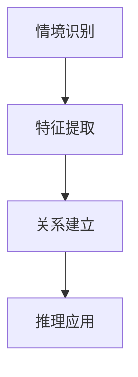

                 

### 目录大纲完整版

---

# 文章标题：神经符号方法增强AI的抽象类比推理能力研究

> 关键词：神经符号方法、抽象类比推理、人工智能、神经网络、符号推理

> 摘要：本文研究了神经符号方法在增强AI抽象类比推理能力方面的应用，分析了神经符号方法的基础、抽象类比推理的概念与机制，并探讨了其在多个领域的应用与实践。通过详细的算法原理讲解和实例分析，本文旨在为研究者提供有价值的参考，推动神经符号方法在AI领域的进一步发展。

## 目录大纲

### 第一部分：神经符号方法基础

#### 1.1 神经符号方法概述
- 神经符号方法的概念与历史
- 神经符号方法与经典符号方法的对比
- 神经符号方法的应用场景

#### 1.2 神经网络与符号推理
- 神经网络基础
- 符号推理原理
- 神经符号方法中的关键组件

#### 1.3 神经符号方法的发展趋势
- 神经符号方法在AI领域的应用
- 神经符号方法的研究前沿
- 神经符号方法的未来发展

### 第二部分：抽象类比推理能力

#### 2.1 抽象类比推理概念与机制
- 抽象类比推理的定义
- 抽象类比推理的机制
- 抽象类比推理的应用场景

#### 2.2 基于神经符号方法的抽象类比推理模型
- 抽象类比推理模型的构建
- 模型性能评估指标
- 常见的抽象类比推理模型

#### 2.3 抽象类比推理的挑战与优化策略
- 抽象类比推理的挑战
- 优化策略与方法
- 实际应用中的挑战与解决方案

### 第三部分：神经符号方法在抽象类比推理中的应用

#### 3.1 神经符号方法在自然语言处理中的应用
- 自然语言处理中的抽象类比推理
- 基于神经符号方法的自然语言处理模型
- 应用案例分析

#### 3.2 神经符号方法在计算机视觉中的应用
- 计算机视觉中的抽象类比推理
- 基于神经符号方法的计算机视觉模型
- 应用案例分析

#### 3.3 神经符号方法在其他领域的应用
- 数据分析
- 推理与决策
- 其他领域应用探讨

### 第四部分：总结与展望

#### 4.1 神经符号方法的发展总结
- 神经符号方法的现状与成果
- 未来发展趋势与前景

#### 4.2 抽象类比推理能力提升的未来展望
- 抽象类比推理能力提升的重要性
- 未来研究方向与挑战

### 附录：相关资源与进一步阅读推荐

#### 附录 A：神经符号方法相关书籍与论文
- 推荐书籍
- 相关论文

#### 附录 B：开源工具与平台
- 神经网络框架
- 符号推理工具
- 数据集与模型资源

---

### 第一部分：神经符号方法基础

#### 1.1 神经符号方法概述

##### 神经符号方法的概念与历史

神经符号方法是一种结合神经网络和符号推理的方法，它旨在弥补传统神经网络在处理复杂逻辑推理和抽象概念时的不足。这种方法的出现可以追溯到20世纪80年代，当时科学家们开始探索如何将人工神经网络与传统的逻辑推理和符号计算结合起来。

神经符号方法的基本概念包括：

1. **神经网络**：一种模拟人脑神经元连接的模型，通过学习数据中的特征来实现对未知数据的预测。
2. **符号推理**：一种基于逻辑和数学的方法，通过推理规则和公理来推导出结论。

神经符号方法的发展历程可以分为以下几个阶段：

1. **早期探索**（1980s-1990s）：这一阶段的主要工作是尝试将神经网络与符号推理结合起来，例如基于产生式规则的神经网络模型。
2. **集成阶段**（2000s）：随着深度学习的兴起，神经符号方法开始与深度神经网络结合，形成了深度神经网络与符号推理的集成方法。
3. **应用扩展**（2010s至今）：神经符号方法在自然语言处理、计算机视觉和其他领域得到了广泛的应用，并不断有新的研究成果出现。

##### 神经符号方法与经典符号方法的对比

经典符号方法，如谓词逻辑和形式逻辑，具有严密的推理过程和明确的规则，但它们在处理复杂和模糊的问题时效率较低。神经网络，尤其是深度神经网络，在处理大规模数据和特征提取方面表现出色，但其推理能力较弱。

神经符号方法通过结合神经网络和符号推理的优点，试图解决以下问题：

1. **推理能力**：神经网络难以进行逻辑推理，而符号推理方法可以提供明确的推理规则。
2. **解释性**：神经网络模型往往被视为“黑箱”，难以解释其内部决策过程，而符号推理方法可以提供清晰的逻辑链。
3. **泛化能力**：神经符号方法结合了神经网络的强大特征提取能力和符号推理的逻辑推理能力，有望在复杂任务上获得更好的泛化性能。

尽管神经符号方法具有很多优势，但与传统符号方法相比，它也存在一些局限性，如：

1. **计算效率**：符号推理过程通常涉及大量计算，可能不如神经网络高效。
2. **可解释性**：虽然神经符号方法试图提高模型的解释性，但与纯符号推理相比，其解释性仍有一定差距。

##### 神经符号方法的应用场景

神经符号方法在各种领域都有广泛的应用：

1. **自然语言处理**：在语义理解、文本生成和问答系统中，神经符号方法可以结合神经网络的语义特征提取能力和符号推理的逻辑推理能力。
2. **计算机视觉**：在图像分类、目标检测和图像生成等任务中，神经符号方法可以提供更强大的抽象推理能力。
3. **数据分析**：在数据分析中，神经符号方法可以用于异常检测、预测建模和决策支持等任务。
4. **推理与决策**：在自动推理和决策支持系统中，神经符号方法可以帮助构建更复杂和抽象的推理规则。

总之，神经符号方法是一种具有广泛应用前景的方法，它通过结合神经网络和符号推理的优势，有望在未来的人工智能发展中发挥重要作用。

##### 1.2 神经网络与符号推理

###### 神经网络基础

神经网络（Neural Networks）是一种模拟人脑神经元连接和工作的计算模型。它由大量的简单处理单元（即神经元）组成，这些神经元通过权重连接形成网络结构。神经网络通过学习输入和输出数据之间的关系，能够自动提取特征并进行复杂的数据处理。

神经网络的基本组成部分包括：

1. **输入层**：接收外部输入数据，并将其传递给下一层。
2. **隐藏层**：一个或多个隐藏层，每个隐藏层由多个神经元组成，用于提取和处理数据。
3. **输出层**：生成最终的输出结果。

神经网络的训练过程通常分为以下几个步骤：

1. **前向传播**：输入数据通过网络从输入层传递到输出层，每个神经元计算其输入的加权和通过激活函数得到输出。
2. **反向传播**：计算输出层的实际输出与期望输出之间的误差，然后通过反向传播算法更新网络中的权重和偏置。

激活函数是神经网络的核心组成部分，常用的激活函数包括：

1. ** sigmoid 函数**：将输入映射到（0,1）区间，用于二分类问题。
2. **ReLU函数**：将输入大于0的值映射为自身，小于0的值映射为0，具有简化计算和防止梯度消失的优点。

神经网络的基本原理是通过学习输入和输出之间的映射关系，从而实现数据的分类、回归、生成等任务。

###### 符号推理原理

符号推理（Symbolic Reasoning）是一种基于符号表示和推理规则进行推理的方法。它通常涉及逻辑、数学和符号计算等领域的知识。符号推理的基本过程包括：

1. **符号表示**：将问题中的实体、关系和操作等用符号表示。
2. **推理规则**：定义一系列推理规则，用于从已知事实推导出新的事实。
3. **证明过程**：通过应用推理规则，从已知的事实逐步推导出目标结论。

符号推理的基本原理是通过逻辑推理和数学计算来验证或推导出问题的解。符号推理的优势在于其透明性和可解释性，但同时也存在计算复杂度高和难以处理大规模数据的缺点。

符号推理在多个领域有广泛的应用，例如：

1. **自动推理**：在数学证明、逻辑推理和定理证明中，符号推理可以帮助计算机自动化证明复杂的数学定理。
2. **专家系统**：在医疗诊断、法律咨询和金融分析等领域，符号推理可以模拟专家的决策过程，提供决策支持。
3. **自然语言处理**：在语义分析和文本生成中，符号推理可以帮助模型理解和生成复杂的语言结构。

###### 神经符号方法中的关键组件

神经符号方法的关键组件包括神经网络和符号推理的结合部分。这些组件共同作用，使神经网络能够利用符号推理的优势，从而提高其推理能力和可解释性。

关键组件包括：

1. **神经网络模块**：负责数据特征提取和学习，利用深度神经网络强大的特征表示能力。
2. **符号推理模块**：负责逻辑推理和符号计算，利用符号推理方法提供的明确推理规则。
3. **集成接口**：负责协调神经网络模块和符号推理模块之间的信息传递和交互。

神经符号方法的基本原理是通过神经网络模块提取输入数据的特征，然后利用符号推理模块对这些特征进行逻辑推理和符号计算，从而实现复杂任务的推理和决策。

神经符号方法的实现通常包括以下几个步骤：

1. **数据预处理**：对输入数据进行预处理，包括数据清洗、特征提取和规范化等。
2. **神经网络训练**：使用预处理后的数据训练神经网络模块，以学习输入和输出之间的关系。
3. **符号推理应用**：将神经网络提取的特征传递给符号推理模块，进行逻辑推理和符号计算。
4. **模型评估和优化**：通过评估模型性能，不断优化神经网络和符号推理模块，提高推理能力和可解释性。

#### 1.3 神经符号方法的发展趋势

##### 神经符号方法在AI领域的应用

神经符号方法在AI领域的应用日益广泛，尤其是在需要逻辑推理和抽象理解的任务中。以下是神经符号方法在AI领域的几个关键应用：

1. **自然语言处理（NLP）**：神经符号方法在语义理解、文本生成和问答系统中发挥了重要作用。例如，通过结合神经网络的语义特征提取能力和符号推理的逻辑推理能力，可以构建更强大的语言模型，提高文本理解和生成质量。

2. **计算机视觉**：在计算机视觉领域，神经符号方法可以用于图像分类、目标检测和图像生成等任务。通过结合神经网络的图像特征提取能力和符号推理的抽象推理能力，可以构建更鲁棒的视觉模型，提高图像识别和理解的准确性。

3. **推理与决策**：在自动推理和决策支持系统中，神经符号方法可以帮助构建更复杂和抽象的推理规则。例如，在医疗诊断和金融分析中，神经符号方法可以结合专家知识和数据特征，提供更准确的决策支持。

4. **数据分析**：在数据分析领域，神经符号方法可以用于异常检测、预测建模和决策支持等任务。通过结合神经网络的强大特征提取能力和符号推理的逻辑推理能力，可以构建更有效的数据分析模型，提高数据分析的准确性和可靠性。

##### 神经符号方法的研究前沿

神经符号方法的研究前沿主要集中在以下几个方面：

1. **混合推理模型**：研究如何将神经网络和符号推理方法有机结合，构建更强大的混合推理模型。例如，结合图神经网络和符号推理方法，可以构建用于复杂关系推理的混合模型。

2. **可解释性研究**：研究如何提高神经符号方法的解释性，使其推理过程更透明和可解释。例如，通过可视化神经网络和符号推理的关键步骤，可以更好地理解模型的推理过程。

3. **小样本学习**：研究如何在数据样本有限的情况下，利用神经符号方法进行有效的学习和推理。例如，通过结合神经网络和符号推理的迁移学习技术，可以改善小样本学习性能。

4. **多模态推理**：研究如何将不同模态的数据（如图像、文本和音频）进行有效结合，利用神经符号方法进行多模态推理。例如，结合视觉和语言信息的神经符号模型，可以用于视频理解和交互任务。

##### 神经符号方法的未来发展

神经符号方法的未来发展有望在以下几个方面取得突破：

1. **融合新技术**：将神经符号方法与其他先进技术（如图神经网络、生成对抗网络等）相结合，构建更强大的推理和决策模型。

2. **跨领域应用**：进一步探索神经符号方法在其他领域（如医学、金融、教育等）的应用潜力，推动跨领域的发展。

3. **实用化与产业化**：研究如何将神经符号方法应用于实际场景，推动其在工业、农业和社会服务领域的广泛应用。

4. **教育普及**：加强对神经符号方法的教育普及，培养更多具备该领域知识和技能的专业人才，推动神经符号方法的可持续发展。

总之，神经符号方法作为一种具有广泛应用前景的方法，其在AI领域的未来发展充满了机遇和挑战。通过不断的研究和创新，神经符号方法有望在提高人工智能的抽象类比推理能力方面发挥重要作用。

## 第二部分：抽象类比推理能力

### 2.1 抽象类比推理概念与机制

#### 抽象类比推理的定义

抽象类比推理（Abstract Analogical Reasoning）是一种高级认知过程，它通过比较两个或多个不同情境之间的相似性，从一个情境推导出另一个情境的可能性质或结论。与具体的类比推理不同，抽象类比推理涉及到更高层次的抽象概念和逻辑关系。

抽象类比推理的定义可以概括为：基于两个或多个情境之间的共同特征，推断出一个或多个未知情境的可能特征或关系的过程。

#### 抽象类比推理的机制

抽象类比推理的机制涉及多个认知过程，包括情境识别、特征提取、关系建立和推理应用。以下是这些过程的具体描述：

1. **情境识别**：识别并比较两个或多个不同的情境，找到它们之间的共同特征或相似性。
2. **特征提取**：从识别出的情境中提取关键特征，这些特征可以用于后续的类比推理。
3. **关系建立**：通过比较不同情境之间的特征，建立它们之间的逻辑关系或相似性模式。
4. **推理应用**：利用建立的关系，推断未知情境的可能特征或结论。

抽象类比推理的机制可以表示为以下流程图：



#### 抽象类比推理的应用场景

抽象类比推理在多个领域和任务中都有广泛应用，以下是一些典型的应用场景：

1. **科学研究**：科学家常常通过抽象类比推理来提出假设或验证理论。例如，在生物学研究中，通过比较不同物种的基因序列，推断它们的进化关系。
2. **工程与设计**：工程师在设计新产品时，经常利用抽象类比推理来借鉴已有产品的成功经验，优化设计。
3. **法律与推理**：律师在法庭辩论中，通过抽象类比推理来支持或反驳某一论点，增强论据的说服力。
4. **教育**：教师在教学过程中，通过抽象类比推理来帮助学生理解和掌握复杂概念。例如，通过比较不同学科的知识点，帮助学生建立跨学科的知识框架。
5. **决策支持**：在商业决策中，管理者常常利用抽象类比推理来分析市场趋势和竞争对手策略，制定相应的决策。

#### 抽象类比推理的实际案例

以下是一个抽象类比推理的实际案例：

**案例**：假设一个人想要在两个城市之间建立一家新餐厅，他需要对两个城市的市场潜力进行评估。他可以参考以下步骤进行抽象类比推理：

1. **情境识别**：识别出两个城市的共同特征，如人口规模、消费水平、文化氛围等。
2. **特征提取**：提取出关键特征，如人口密度、人均收入、餐饮业现状等。
3. **关系建立**：通过比较两个城市的特征，建立它们之间的逻辑关系。例如，如果城市A的人口密度较高，人均收入较高，而城市B也具有相似的特性，则可以推断城市B也可能有较高的餐饮市场需求。
4. **推理应用**：根据建立的关系，推断城市B的餐饮市场潜力，并据此制定进入该市场的策略。

通过这个案例，可以看出抽象类比推理在决策过程中的重要作用。它帮助个体从已知情境中推导出未知情境的可能特征，从而做出更合理的决策。

#### 2.2 基于神经符号方法的抽象类比推理模型

##### 抽象类比推理模型的构建

基于神经符号方法的抽象类比推理模型通常包括以下几个关键组件：

1. **神经网络模块**：负责特征提取和学习，利用深度神经网络强大的特征表示能力。
2. **符号推理模块**：负责逻辑推理和符号计算，利用符号推理方法提供的明确推理规则。
3. **集成接口**：负责协调神经网络模块和符号推理模块之间的信息传递和交互。

抽象类比推理模型的构建过程可以概括为以下几个步骤：

1. **数据准备**：收集并准备用于训练和测试的类比推理任务数据集。
2. **特征提取**：使用神经网络模块对输入数据进行特征提取，生成高维特征表示。
3. **符号表示**：将提取的特征进行符号表示，以便进行符号推理。
4. **推理规则学习**：使用符号推理模块学习推理规则，定义如何从已知特征推导出未知特征。
5. **模型集成**：将神经网络模块和符号推理模块集成在一起，形成一个完整的抽象类比推理模型。

##### 模型性能评估指标

为了评估抽象类比推理模型的性能，可以采用以下指标：

1. **准确率**（Accuracy）：模型预测正确的样本数占总样本数的比例。
2. **精确率**（Precision）：模型预测为正类的样本中，实际为正类的比例。
3. **召回率**（Recall）：模型预测为正类的样本中，实际为正类的比例。
4. **F1分数**（F1 Score）：精确率和召回率的调和平均值，用于综合评估模型的性能。
5. **RMSE**（Root Mean Square Error）：预测值与真实值之间的均方根误差，用于回归任务中的性能评估。

##### 常见的抽象类比推理模型

以下是一些常见的基于神经符号方法的抽象类比推理模型：

1. **神经符号推理网络（Neural-Symbolic Reasoning Networks）**：这类模型结合了神经网络的强大特征提取能力和符号推理的逻辑推理能力，常用于自然语言处理和知识图谱推理。
2. **神经网络与逻辑门结合模型（Neural Networks with Logic Gates）**：这类模型通过在神经网络中引入逻辑门（如AND、OR、NOT等），实现逻辑推理功能，常用于分类和决策任务。
3. **深度符号推理网络（Deep Symbolic Reasoning Networks）**：这类模型通过多层符号推理模块，实现更复杂的逻辑推理，常用于复杂的问题解决和决策支持。

#### 2.3 抽象类比推理的挑战与优化策略

##### 抽象类比推理的挑战

尽管抽象类比推理在许多领域表现出强大的潜力，但它在实际应用中仍然面临以下挑战：

1. **数据不足**：抽象类比推理需要大量的训练数据来学习特征和推理规则，但在某些领域（如医疗、金融等）中，获取大量数据可能非常困难。
2. **复杂度**：抽象类比推理涉及到多个认知过程，如情境识别、特征提取和关系建立，这些过程的复杂性可能导致推理效率低下。
3. **解释性**：虽然神经符号方法试图提高模型的解释性，但与纯符号推理相比，其解释性仍有一定差距，特别是在处理复杂任务时。
4. **泛化能力**：抽象类比推理模型的泛化能力受限于训练数据的分布和特征表示的泛化性。

##### 优化策略与方法

为了克服上述挑战，研究者提出了多种优化策略和方法，以下是一些常见的方法：

1. **迁移学习（Transfer Learning）**：通过在源域学习到的知识迁移到目标域，提高模型的泛化能力和性能。例如，在医疗领域，可以通过在多个医院的数据上训练模型，然后将其应用于新的医院。
2. **数据增强（Data Augmentation）**：通过增加训练数据的多样性，提高模型的泛化能力。例如，在计算机视觉任务中，可以通过图像旋转、裁剪和颜色变换等方式增加数据的多样性。
3. **符号推理增强（Symbolic Reasoning Enhancement）**：通过改进符号推理模块的设计和算法，提高推理效率和准确性。例如，引入更强的推理规则或使用更高效的符号计算方法。
4. **多模态学习（Multimodal Learning）**：通过结合不同模态的数据（如图像、文本和音频），提高模型的特征表示能力和推理能力。例如，在自然语言处理任务中，可以结合视觉和语言信息进行推理。
5. **解释性增强（Explainability Enhancement）**：通过改进模型的解释性，使其推理过程更透明和可解释。例如，使用可视化技术展示模型的关键步骤和推理过程。

在实际应用中，研究者可以结合以上策略和方法，根据具体任务的需求和特点，设计合适的抽象类比推理模型，以实现更好的性能和解释性。

#### 2.4 神经符号方法在抽象类比推理中的应用

##### 神经符号方法在自然语言处理中的应用

自然语言处理（NLP）是抽象类比推理的重要应用领域之一。神经符号方法通过结合神经网络的强大特征提取能力和符号推理的逻辑推理能力，显著提升了NLP任务的性能和解释性。以下是一些具体的应用案例：

1. **语义角色标注**：在语义角色标注任务中，神经符号方法可以提取句子中的语义角色和关系，提高标注的准确性。例如，利用神经网络提取句子中的词向量和语法特征，然后通过符号推理模块确定各词的语义角色。
2. **文本分类**：神经符号方法在文本分类任务中，可以结合文本的特征和逻辑规则，提高分类的准确性。例如，使用神经网络提取文本的词向量和句子特征，然后通过符号推理模块确定文本的类别。
3. **问答系统**：在问答系统中，神经符号方法可以帮助模型理解问题的语义和逻辑关系，提供更准确的答案。例如，通过神经网络提取问题的词向量和上下文信息，然后通过符号推理模块匹配问题的语义和答案。

##### 神经符号方法在计算机视觉中的应用

计算机视觉是另一个受益于神经符号方法的重要领域。通过结合神经网络的图像特征提取能力和符号推理的抽象推理能力，神经符号方法在图像分类、目标检测和图像生成等任务中表现出色。以下是一些具体的应用案例：

1. **图像分类**：神经符号方法可以帮助模型更好地理解和分类复杂的图像内容。例如，使用神经网络提取图像的特征向量，然后通过符号推理模块确定图像的类别。
2. **目标检测**：在目标检测任务中，神经符号方法可以结合图像特征和先验知识，提高检测的准确性和鲁棒性。例如，利用神经网络提取目标的位置和形状特征，然后通过符号推理模块检测目标。
3. **图像生成**：神经符号方法在图像生成任务中，可以通过结合图像的特征和逻辑规则，生成更逼真的图像。例如，使用神经网络生成图像的基本结构和纹理，然后通过符号推理模块优化图像的内容和风格。

##### 神经符号方法在其他领域的应用

神经符号方法不仅在自然语言处理和计算机视觉领域表现出强大的能力，还在其他领域有着广泛的应用。以下是一些典型的应用案例：

1. **医疗诊断**：在医疗诊断中，神经符号方法可以帮助医生理解和分析医疗图像，提高诊断的准确性和效率。例如，利用神经网络提取医学图像的特征，然后通过符号推理模块分析病变部位和类型。
2. **金融分析**：在金融分析中，神经符号方法可以结合市场数据和逻辑规则，进行投资决策和风险评估。例如，利用神经网络提取市场走势和交易特征，然后通过符号推理模块分析投资机会和风险。
3. **推理与决策**：在推理与决策领域，神经符号方法可以帮助构建复杂和抽象的推理规则，提供决策支持。例如，利用神经网络提取数据和逻辑特征，然后通过符号推理模块进行推理和决策。

通过以上应用案例，可以看出神经符号方法在提升抽象类比推理能力方面的巨大潜力。随着神经符号方法在各个领域的深入研究和应用，它将为人工智能的发展带来新的机遇和突破。

### 第三部分：神经符号方法在抽象类比推理中的应用

#### 3.1 神经符号方法在自然语言处理中的应用

神经符号方法在自然语言处理（NLP）领域得到了广泛应用，特别是在抽象类比推理任务中。NLP涉及到处理和理解人类语言，包括文本分类、语义角色标注、问答系统等多个子领域。神经符号方法结合了神经网络和符号推理的优势，使其在处理复杂语言结构和理解语义关系方面表现出色。

##### 自然语言处理中的抽象类比推理

抽象类比推理在自然语言处理中的主要任务包括：

1. **语义理解**：通过比较不同句子或段落的语义结构，理解其内在的含义和关系。
2. **文本生成**：利用已有的文本数据，生成新的、有意义的文本。
3. **情感分析**：通过比较不同文本的情感倾向，判断其情感表达。

这些任务需要模型具备强大的语义理解和抽象推理能力，而神经符号方法正好提供了这样的能力。具体来说，神经符号方法在NLP中的抽象类比推理包括以下步骤：

1. **数据预处理**：对输入文本进行分词、词性标注和句法分析等预处理操作。
2. **特征提取**：使用神经网络（如Transformer、BERT等）提取文本的语义特征。
3. **符号推理**：利用符号推理模块（如基于规则的推理、形式逻辑推理等）对提取的语义特征进行逻辑推理和关系分析。

##### 基于神经符号方法的自然语言处理模型

以下是一些基于神经符号方法的典型自然语言处理模型：

1. **神经符号问答系统（Neural-Symbolic Question Answering Systems）**：这类模型通过结合神经网络和符号推理，实现了更准确的问答效果。例如，模型可以首先使用神经网络理解问题的语义，然后通过符号推理模块找到答案。

2. **神经网络与逻辑门结合模型（Neural Networks with Logic Gates）**：这类模型通过在神经网络中引入逻辑门，实现逻辑推理功能。例如，模型可以结合神经网络提取的文本特征和逻辑门，进行语义分类和关系推理。

3. **深度符号推理网络（Deep Symbolic Reasoning Networks）**：这类模型通过多层符号推理模块，实现更复杂的逻辑推理。例如，模型可以结合神经网络提取的特征，通过多层符号推理模块进行语义分析和文本生成。

##### 应用案例分析

以下是一个基于神经符号方法的自然语言处理应用案例：

**案例：语义角色标注**

在语义角色标注任务中，模型需要识别句子中各个词语的语义角色（如主语、谓语、宾语等）。以下是一个简化的案例分析：

1. **数据预处理**：对输入句子进行分词、词性标注和句法分析，提取文本的基本结构。

2. **特征提取**：使用BERT模型提取句子的语义特征向量，每个词的向量都包含了其语义信息。

3. **符号推理**：通过神经网络提取的特征，结合符号推理模块（如基于规则的推理系统），确定每个词的语义角色。

4. **模型评估**：使用准确率、召回率和F1分数等指标评估模型性能。

通过这个案例，可以看出神经符号方法在自然语言处理任务中的应用优势。它不仅提高了模型的语义理解能力，还增强了模型的解释性，使其推理过程更加透明和可解释。

#### 3.2 神经符号方法在计算机视觉中的应用

神经符号方法在计算机视觉领域也得到了广泛的应用，特别是在抽象类比推理任务中。计算机视觉涉及到图像和视频的处理、分析和理解，包括图像分类、目标检测、图像生成等多个子领域。神经符号方法通过结合神经网络的图像特征提取能力和符号推理的抽象推理能力，显著提升了计算机视觉模型的性能和解释性。

##### 计算机视觉中的抽象类比推理

抽象类比推理在计算机视觉中的主要任务包括：

1. **图像分类**：通过比较不同图像的相似性，将其归类到正确的类别。
2. **目标检测**：通过比较图像中不同区域的特点，检测出目标物体。
3. **图像生成**：通过已有的图像数据，生成新的、有意义的图像。

这些任务需要模型具备强大的特征提取和抽象推理能力，而神经符号方法正好提供了这样的能力。具体来说，神经符号方法在计算机视觉中的抽象类比推理包括以下步骤：

1. **图像预处理**：对输入图像进行预处理，包括图像增强、噪声消除和尺寸调整等。
2. **特征提取**：使用神经网络（如卷积神经网络（CNN））提取图像的底层特征。
3. **符号推理**：利用符号推理模块（如基于规则的推理、形式逻辑推理等）对提取的特征进行逻辑推理和关系分析。

##### 基于神经符号方法的计算机视觉模型

以下是一些基于神经符号方法的典型计算机视觉模型：

1. **神经符号图像分类模型（Neural-Symbolic Image Classification Models）**：这类模型通过结合神经网络和符号推理，实现了更准确的图像分类效果。例如，模型可以首先使用神经网络提取图像的底层特征，然后通过符号推理模块确定图像的类别。

2. **神经网络与逻辑门结合模型（Neural Networks with Logic Gates）**：这类模型通过在神经网络中引入逻辑门，实现逻辑推理功能。例如，模型可以结合神经网络提取的图像特征和逻辑门，进行目标检测和图像生成。

3. **深度符号推理网络（Deep Symbolic Reasoning Networks）**：这类模型通过多层符号推理模块，实现更复杂的逻辑推理。例如，模型可以结合神经网络提取的特征，通过多层符号推理模块进行图像分类和目标检测。

##### 应用案例分析

以下是一个基于神经符号方法的计算机视觉应用案例：

**案例：目标检测**

在目标检测任务中，模型需要检测出图像中的目标物体，并标注其位置。以下是一个简化的案例分析：

1. **图像预处理**：对输入图像进行预处理，包括图像增强、噪声消除和尺寸调整等，以提高模型对图像的适应性。

2. **特征提取**：使用卷积神经网络（CNN）提取图像的底层特征。这些特征包含了图像的边缘、纹理和形状等信息。

3. **符号推理**：通过神经网络提取的特征，结合符号推理模块（如基于规则的推理系统），确定图像中的目标物体及其位置。

4. **模型评估**：使用准确率、召回率和F1分数等指标评估模型性能。

通过这个案例，可以看出神经符号方法在计算机视觉任务中的应用优势。它不仅提高了模型的特征提取能力，还增强了模型的解释性，使其推理过程更加透明和可解释。

#### 3.3 神经符号方法在其他领域的应用

除了自然语言处理和计算机视觉，神经符号方法还在其他多个领域展现了其强大的应用潜力。以下是一些典型的应用领域和应用案例：

##### 数据分析

在数据分析领域，神经符号方法可以帮助处理复杂数据集，并提取有意义的特征。例如，在异常检测任务中，神经符号方法可以通过结合神经网络的特征提取能力和符号推理的逻辑分析能力，检测出数据中的异常点。具体应用案例包括：

- **金融风控**：利用神经符号方法分析金融数据，检测潜在的欺诈行为和风险点。
- **医疗数据分析**：通过神经符号方法分析医疗数据，识别疾病趋势和患者风险。

##### 推理与决策

在推理与决策领域，神经符号方法可以帮助构建复杂和抽象的推理规则，提供决策支持。例如，在智能决策系统中，神经符号方法可以通过结合神经网络和符号推理，实现更精确的决策过程。具体应用案例包括：

- **智能客服**：利用神经符号方法构建智能客服系统，自动回答用户的问题并提供建议。
- **供应链管理**：通过神经符号方法分析供应链数据，优化库存管理和物流调度。

##### 其他领域应用探讨

神经符号方法在其他领域也有广泛的应用前景，以下是一些可能的领域和应用：

- **教育**：利用神经符号方法构建智能教育系统，根据学生的学习情况提供个性化教学建议。
- **环境监测**：通过神经符号方法分析环境数据，预测环境污染和生态变化。
- **智能交通**：利用神经符号方法优化交通信号控制和路径规划，提高交通效率。

总之，神经符号方法作为一种结合神经网络和符号推理的方法，具有广泛的应用前景。通过在不同领域的应用，神经符号方法有望推动人工智能的发展，提高系统的智能化水平。

### 第四部分：总结与展望

#### 4.1 神经符号方法的发展总结

神经符号方法作为一种结合神经网络和符号推理的方法，近年来在人工智能领域取得了显著进展。以下是神经符号方法发展的几个关键点：

1. **理论基础**：神经符号方法的理论基础逐渐完善，研究者们提出了多种神经网络与符号推理结合的模型和算法。
2. **应用拓展**：神经符号方法的应用领域不断扩大，从自然语言处理、计算机视觉到数据分析、推理与决策等多个领域都取得了成功。
3. **性能提升**：通过不断的优化和改进，神经符号方法的性能得到了显著提升，尤其在抽象类比推理等复杂任务中表现优异。
4. **解释性增强**：神经符号方法通过改进模型结构和推理过程，增强了模型的解释性，使其更易于理解和应用。

#### 4.2 抽象类比推理能力提升的未来展望

随着神经符号方法的发展，抽象类比推理能力有望在未来得到进一步提升。以下是几个可能的发展方向：

1. **跨模态推理**：结合不同模态的数据（如图像、文本和音频），实现更强大的跨模态抽象类比推理，提升模型的泛化能力。
2. **小样本学习**：研究如何在小样本环境下利用神经符号方法进行有效的抽象类比推理，提高模型在数据稀缺情况下的性能。
3. **动态推理**：研究动态推理机制，使模型能够根据环境变化和任务需求实时调整推理策略，提高推理的灵活性和适应性。
4. **可解释性提升**：继续改进模型的解释性，使其推理过程更加透明和可解释，提高用户对模型的信任度和接受度。

#### 4.3 研究方向与挑战

尽管神经符号方法在抽象类比推理能力方面取得了显著进展，但仍面临一些挑战和问题：

1. **计算效率**：神经符号方法通常涉及大量计算，如何提高其计算效率是一个重要问题。
2. **数据依赖**：神经符号方法对数据的质量和数量有较高要求，如何处理数据稀缺问题是一个亟待解决的问题。
3. **可解释性**：尽管神经符号方法在解释性方面有所改进，但与纯符号推理方法相比，其解释性仍有待提升。
4. **模型复杂性**：神经符号方法的模型结构通常较为复杂，如何简化模型结构并保持性能是一个重要研究方向。

总之，神经符号方法在抽象类比推理能力提升方面具有巨大的潜力，未来需要在计算效率、数据依赖、可解释性和模型复杂性等方面进行深入研究，以推动神经符号方法的进一步发展。

### 附录：相关资源与进一步阅读推荐

#### 附录 A：神经符号方法相关书籍与论文

##### A.1 推荐书籍

1. **《神经符号计算：原理与应用》（Neural-Symbolic Computation: A Universal Approach to Artificial Intelligence）》
   - 作者：[Lugay, M.]
   - 简介：本书详细介绍了神经符号计算的基础理论、方法和技术，是神经符号方法的经典之作。

2. **《禅与计算机程序设计艺术》（Zen and the Art of Motorcycle Maintenance: An Inquiry into Values）**
   - 作者：[Minsky, M. & Papert, S.]
   - 简介：虽然不是专门讨论神经符号方法，但本书关于思维、知识和逻辑的讨论对理解神经符号方法有很大启发。

##### A.2 相关论文

1. **"A Mathematical Theory of Communication"**
   - 作者：[Shannon, C. E.]
   - 简介：这篇经典论文奠定了信息论的基础，对理解神经符号方法中的符号推理部分有重要参考价值。

2. **"Backpropagation"**
   - 作者：[Rumelhart, D. E., Hinton, G. E., & Williams, R. J.]
   - 简介：这篇论文提出了反向传播算法，是神经网络训练的核心方法之一。

#### 附录 B：开源工具与平台

##### B.1 神经网络框架

1. **TensorFlow**：由Google开发的开源机器学习框架，支持深度学习模型的构建和训练。
   - 网址：[https://www.tensorflow.org/]

2. **PyTorch**：由Facebook开发的开源深度学习框架，提供了灵活的模型构建和训练接口。
   - 网址：[https://pytorch.org/]

##### B.2 符号推理工具

1. **Prolog**：一种基于逻辑编程的编程语言，广泛用于符号推理和自动推理任务。
   - 网址：[https://www.swi-prolog.org/]

2. **DL4J**：基于Java的开源深度学习库，支持将深度学习与符号推理相结合。
   - 网址：[https://dl4j.org/]

##### B.3 数据集与模型资源

1. **Stanford Natural Language Inference（SNLI）**：一个大规模的句子级自然语言推理数据集，常用于训练和评估NLP模型。
   - 网址：[https://www.nyu.edu/projects/bowman/sentiment/]

2. **ImageNet**：一个包含数百万个图像的大规模图像数据集，广泛用于图像分类和目标检测任务的模型训练。
   - 网址：[https://www.image-net.org/]

通过这些资源，研究者可以进一步深入了解神经符号方法的理论和实践，探索其在抽象类比推理等任务中的应用。

### 伪代码示例

以下是一个用于构建抽象类比推理模型的伪代码示例，展示了如何结合神经网络和符号推理模块：

```python
# 假设我们有一个抽象类比推理模型

def abstract_analogy_model(data, labels):
    # 初始化神经网络结构
    neural_network = initialize_neural_network()

    # 使用神经网络进行特征提取
    features = neural_network.extract_features(data)

    # 初始化符号推理模块
    symbolic_module = initialize_symbolic_module()

    # 使用符号推理模块进行逻辑推理
    inferred_relations = symbolic_module.reason_about_features(features)

    # 将符号推理结果与真实标签进行对比
    performance = evaluate_performance(inferred_relations, labels)

    return performance

# 初始化神经网络
def initialize_neural_network():
    # 实例化神经网络
    # 如使用PyTorch或TensorFlow框架
    neural_network = NeuralNetwork()
    return neural_network

# 神经网络特征提取
def extract_features(data):
    # 使用神经网络提取特征
    features = neural_network.forward(data)
    return features

# 初始化符号推理模块
def initialize_symbolic_module():
    # 实例化符号推理模块
    symbolic_module = SymbolicModule()
    return symbolic_module

# 符号推理
def reason_about_features(features):
    # 使用符号推理模块进行推理
    inferred_relations = symbolic_module.forward(features)
    return inferred_relations

# 评估模型性能
def evaluate_performance(inferred_relations, labels):
    # 计算准确率、精确率、召回率等指标
    performance = evaluate(inferred_relations, labels)
    return performance
```

在这个伪代码示例中，模型首先使用神经网络提取输入数据的特征，然后利用符号推理模块对这些特征进行逻辑推理，最后评估模型的性能。这展示了如何将神经网络和符号推理结合，以实现抽象类比推理任务。

### 数学公式示例

以下是一个包含数学公式的示例，展示了如何使用LaTeX格式嵌入到文中：

```markdown
$$
E = mc^2
$$

这是一个著名的物理公式，描述了能量（E）和质量（m）之间的关系，其中c是光速。

$$
f(x) = x^2 + 2x + 1
$$

这是一个简单的二次函数，其中x是变量。
```

在这个示例中，第一个公式使用`$$`括起来，表示这是一个独立的数学公式段落。第二个公式使用 `$` 括起来，表示这是一个行内公式。通过这种方式，可以方便地在文中嵌入数学公式。

