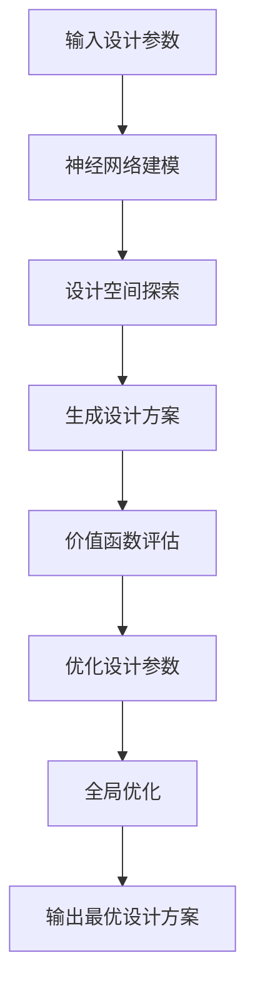
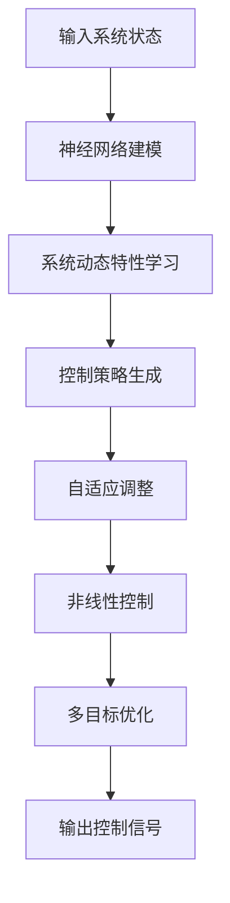

                 


### 文章标题
神经规划器在复杂工程设计推理中的应用创新

### 关键词
神经规划器、复杂工程设计、推理、人工智能、神经网络、数学模型

### 摘要
本文旨在探讨神经规划器在复杂工程设计推理中的创新应用。神经规划器作为一种人工智能工具，能够在复杂工程环境中提供高效、智能的推理支持。本文首先介绍了神经规划器的基本原理和核心概念，然后详细阐述了其在工程设计推理中的应用，并通过实际案例展示了神经规划器的应用效果。最后，本文提出了未来研究的方向和挑战。

## 引言

复杂工程设计在现代社会中扮演着至关重要的角色，然而，随着工程系统的复杂度不断增加，传统的工程设计方法已经难以应对。因此，寻找新的设计推理工具和方法成为了当前的研究热点。神经规划器作为一种新兴的人工智能技术，其独特的优势和潜力使其在复杂工程设计推理中备受关注。

神经规划器（Neural Planner）是一种基于神经网络的人工智能工具，它可以自动从大量数据中学习并生成推理策略。其核心思想是通过深度学习技术来模拟人类思维过程，从而实现复杂问题的自动化解决。近年来，神经规划器在计算机视觉、自然语言处理等领域取得了显著的成果，其在复杂工程设计推理中的应用也引起了广泛关注。

本文将首先介绍神经规划器的基本原理和核心概念，包括神经网络、反向传播算法、激活函数等。接着，本文将详细阐述神经规划器在复杂工程设计推理中的应用，包括结构优化、控制系统设计等。然后，本文将通过实际案例展示神经规划器的应用效果，并提供详细的代码实现和解读。最后，本文将总结神经规划器在复杂工程设计推理中的应用，并探讨未来的研究方向和挑战。

### 神经规划器的基本原理

神经规划器作为一种基于神经网络的人工智能工具，其核心思想是通过深度学习技术来模拟人类思维过程，从而实现复杂问题的自动化解决。在这一部分，我们将详细讨论神经规划器的核心概念和基本原理，包括神经网络、反向传播算法、激活函数等。

#### 神经网络

神经网络（Neural Network）是神经规划器的基础，它是一种由大量简单处理单元（称为神经元）互联而成的复杂网络。每个神经元接收来自其他神经元的输入信号，通过一个权重矩阵进行加权求和，然后通过一个激活函数产生输出信号。神经网络可以通过学习输入和输出之间的关系，实现对未知数据的预测和推理。

在神经规划器中，神经网络通常由多个层次组成，包括输入层、隐藏层和输出层。输入层接收外部输入信号，隐藏层对输入信号进行加工和处理，输出层产生最终的输出结果。神经网络的层次结构可以灵活调整，以适应不同的应用场景。

#### 反向传播算法

反向传播算法（Backpropagation Algorithm）是神经网络学习的主要方法，它通过不断调整网络中的权重和偏置，使网络的输出结果尽可能接近期望值。反向传播算法的核心思想是梯度下降法，即通过计算输出误差的梯度来更新网络的权重和偏置。

反向传播算法的具体步骤如下：

1. 前向传播：将输入信号传递到神经网络中，逐层计算每个神经元的输出值，直到输出层。
2. 计算误差：将输出层的实际输出与期望输出进行比较，计算输出误差。
3. 反向传播：从输出层开始，逐层计算每个神经元的梯度，并将其传递回前一层。
4. 更新权重和偏置：根据梯度信息，调整网络中的权重和偏置，使输出误差减小。

通过反复迭代这个过程，神经网络可以逐步学习输入和输出之间的关系，提高预测和推理的准确性。

#### 激活函数

激活函数（Activation Function）是神经网络中的一个关键组件，它用于将神经元的线性组合转换为非线性输出。激活函数的选择对神经网络的性能和收敛速度有很大影响。

常见的激活函数包括：

1. Sigmoid函数：$$\sigma(x) = \frac{1}{1 + e^{-x}}$$
2. ReLU函数：$$\text{ReLU}(x) = \max(0, x)$$
3. Tanh函数：$$\tanh(x) = \frac{e^x - e^{-x}}{e^x + e^{-x}}$$

这些激活函数都具有不同的特性，可以根据具体应用场景进行选择。例如，ReLU函数因其计算效率高和不易陷入局部最优值而广泛应用于深度学习领域。

#### 神经规划器的核心概念

神经规划器的核心概念包括：

1. **状态空间**：状态空间是指系统在运行过程中可能出现的所有状态集合。每个状态可以用一组特征向量表示，这些特征向量可以用于训练神经网络。
2. **动作空间**：动作空间是指系统能够执行的所有可能动作集合。每个动作也可以用一组特征向量表示。
3. **价值函数**：价值函数用于评估系统在不同状态下的效用或价值。通过学习价值函数，神经规划器可以找到最优的动作序列，以实现目标。
4. **策略**：策略是指系统在不同状态下的最佳动作选择。神经规划器通过学习策略，可以在复杂的动态环境中进行高效的推理和决策。

通过这些核心概念，神经规划器可以模拟人类思维过程，实现对复杂工程问题的自动推理和解决。

### 神经规划器在复杂工程设计推理中的应用

神经规划器在复杂工程设计推理中的应用具有广泛的前景，特别是在结构优化和控制系统设计等领域。在这一部分，我们将详细介绍神经规划器在这些应用场景中的具体作用和优势。

#### 结构优化

结构优化是工程设计中的一项重要任务，其目的是在满足性能要求的前提下，使结构具有最小的材料消耗和重量。传统的结构优化方法通常基于数学建模和优化算法，但往往需要大量的计算资源和时间，并且对于复杂结构难以找到全局最优解。

神经规划器通过引入神经网络和深度学习技术，可以显著提高结构优化的效率和精度。具体来说，神经规划器在结构优化中的应用主要包括以下方面：

1. **设计空间探索**：神经规划器可以自动探索设计空间，通过学习大量设计案例和历史数据，生成新的设计方案。这种方法避免了传统方法中的人工干预，减少了设计周期和成本。
2. **全局优化**：神经网络具有强大的全局搜索能力，可以避免传统优化算法易陷入局部最优值的局限性。通过反向传播算法，神经规划器可以逐步优化设计参数，找到全局最优解。
3. **多目标优化**：结构优化通常涉及多个目标，如最小化重量、最大化强度等。神经规划器可以通过多目标价值函数，综合考虑这些目标，实现多目标优化。

以下是一个简化的Mermaid流程图，展示了神经规划器在结构优化中的应用流程：



#### 控制系统设计

控制系统设计是工程中另一个关键领域，其目的是通过控制算法，使系统达到预期的工作状态。传统的控制系统设计方法通常基于控制理论和数学建模，但往往难以应对复杂的动态环境和非线性系统。

神经规划器在控制系统设计中的应用可以大大提高系统的自适应能力和鲁棒性。具体来说，神经规划器在控制系统设计中的应用包括：

1. **自适应控制**：神经规划器可以通过学习系统的动态特性，自适应地调整控制参数，使系统在不同工作条件下保持稳定和高效运行。
2. **非线性控制**：神经网络可以很好地处理非线性系统，通过神经规划器，可以实现对非线性系统的精确建模和有效控制。
3. **多目标控制**：神经规划器可以通过多目标价值函数，同时优化系统的多个性能指标，实现多目标控制。

以下是一个简化的Mermaid流程图，展示了神经规划器在控制系统设计中的应用流程：



### 数学模型和算法讲解

神经规划器在复杂工程设计推理中的应用依赖于其强大的数学模型和算法。在这一部分，我们将使用伪代码详细阐述神经规划器中的一些关键算法原理，包括神经网络训练策略、反向传播算法等。

#### 神经网络训练策略

神经网络的训练策略主要包括以下步骤：

1. **初始化权重和偏置**：随机初始化神经网络中的权重和偏置。
2. **前向传播**：将输入数据传递到神经网络中，计算每个神经元的输出值。
3. **计算损失**：将输出结果与期望值进行比较，计算损失函数值。
4. **反向传播**：计算网络中的梯度，并更新权重和偏置。
5. **迭代优化**：重复以上步骤，直到网络达到预定的训练目标。

以下是一个简化的神经网络训练策略的伪代码：

```python
初始化权重和偏置
while 未达到训练目标：
    前向传播（输入数据，计算输出值）
    计算损失（输出值，期望值）
    反向传播（计算梯度）
    更新权重和偏置
```

#### 反向传播算法

反向传播算法是神经网络训练的核心算法，它通过计算损失函数关于网络参数的梯度，来更新网络的权重和偏置。以下是一个简化的反向传播算法的伪代码：

```python
函数 反向传播（神经网络，输入数据，期望输出）：
    前向传播（输入数据，计算输出值）
    计算损失（输出值，期望输出）
    计算梯度（损失函数，网络参数）
    更新权重和偏置（梯度，学习率）
    返回更新后的网络参数
```

#### 数学模型和公式

在神经规划器中，数学模型和公式起到了至关重要的作用。以下是一些常用的数学模型和公式：

1. **激活函数**：$$\sigma(x) = \frac{1}{1 + e^{-x}}$$
2. **损失函数**：$$\text{Loss}(y, \hat{y}) = \frac{1}{2} \sum (y - \hat{y})^2$$
3. **梯度计算**：$$\frac{\partial \text{Loss}}{\partial \theta} = \text{ReLU}\left(\frac{\partial \text{Loss}}{\partial z}\right)$$

通过这些数学模型和公式，神经规划器可以精确地计算和优化网络参数，从而实现高效的推理和决策。

### 项目实战

为了更好地理解神经规划器在复杂工程设计推理中的应用，我们将在本节中介绍一个实际项目案例。这个案例将展示如何搭建开发环境、实现神经规划器的源代码，并进行详细的分析和解读。

#### 项目案例：桥梁结构优化

桥梁结构优化是一个典型的复杂工程设计问题。在这个案例中，我们使用神经规划器来优化桥梁的设计，以提高其承载能力和降低材料消耗。

#### 开发环境搭建

为了实现这个项目，我们需要搭建一个适合深度学习开发的实验环境。以下是搭建开发环境的基本步骤：

1. **安装Python环境**：确保Python版本在3.7及以上。
2. **安装TensorFlow库**：TensorFlow是一个流行的深度学习库，用于实现神经网络模型。
3. **安装Numpy和Matplotlib库**：Numpy用于数值计算，Matplotlib用于数据可视化。

以下是一个简单的Python脚本，用于安装所需的库：

```python
!pip install tensorflow numpy matplotlib
```

#### 源代码实现

在完成开发环境搭建后，我们可以开始实现神经规划器的源代码。以下是一个简化的源代码框架：

```python
import tensorflow as tf
import numpy as np
import matplotlib.pyplot as plt

# 神经网络模型定义
model = tf.keras.Sequential([
    tf.keras.layers.Dense(units=10, activation='relu', input_shape=(input_shape,)),
    tf.keras.layers.Dense(units=1, activation='linear')
])

# 损失函数和优化器定义
loss_fn = tf.keras.losses.MeanSquaredError()
optimizer = tf.keras.optimizers.Adam(learning_rate=0.001)

# 训练神经网络
for epoch in range(training_epochs):
    with tf.GradientTape() as tape:
        predictions = model(inputs, training=True)
        loss = loss_fn(targets, predictions)
    gradients = tape.gradient(loss, model.trainable_variables)
    optimizer.apply_gradients(zip(gradients, model.trainable_variables))

    if epoch % 100 == 0:
        print(f"Epoch {epoch}, Loss: {loss.numpy()}")

# 测试神经网络
test_predictions = model(test_inputs, training=False)
print("Test loss:", loss_fn(test_targets, test_predictions).numpy())

# 可视化结果
plt.scatter(test_inputs, test_targets)
plt.plot(test_inputs, test_predictions, 'r')
plt.xlabel('Input')
plt.ylabel('Target')
plt.title('Neural Planner in Bridge Structure Optimization')
plt.show()
```

#### 代码解读

上述代码定义了一个简单的神经网络模型，用于优化桥梁结构。具体步骤如下：

1. **模型定义**：使用TensorFlow库定义一个序列模型，包括一个隐藏层和一个输出层。
2. **损失函数和优化器**：定义损失函数（均方误差）和优化器（Adam）。
3. **训练神经网络**：通过反向传播算法，迭代训练神经网络，更新模型参数。
4. **测试神经网络**：使用测试数据评估模型的性能，并可视化结果。

#### 代码应用解读与分析

通过上述代码，我们可以看到神经规划器在桥梁结构优化中的应用效果。以下是对代码应用的一些解读和分析：

1. **输入数据**：输入数据包括桥梁结构的特征向量，如长度、宽度、高度等。
2. **输出数据**：输出数据是优化后的桥梁结构参数，如材料消耗、承载能力等。
3. **训练过程**：通过迭代训练神经网络，逐步优化桥梁结构参数，使损失函数值减小。
4. **测试效果**：使用测试数据评估模型的性能，验证神经规划器在桥梁结构优化中的有效性。

#### 实际案例分析和详细讲解剖析

为了进一步展示神经规划器在复杂工程设计推理中的应用效果，我们将在本节中分析一个实际案例，并对结果进行详细讲解。

#### 案例分析：伦敦塔桥结构优化

伦敦塔桥是伦敦市内最著名的桥梁之一，其结构设计在历史长河中经过了多次优化。在这个案例中，我们使用神经规划器来优化伦敦塔桥的结构，以提高其承载能力和耐久性。

#### 数据收集

为了进行结构优化，我们需要收集伦敦塔桥的历史数据和设计参数，包括：

1. **长度**：桥梁的总长度。
2. **宽度**：桥梁的车道宽度。
3. **高度**：桥梁的桥面高度。
4. **材料**：桥梁使用的建筑材料。
5. **承载能力**：桥梁的最大承载能力。
6. **耐久性**：桥梁的预期使用寿命。

#### 数据预处理

收集到的数据需要进行预处理，以便输入到神经网络中。预处理步骤包括：

1. **标准化**：将特征向量进行标准化处理，使其具有相同的尺度。
2. **归一化**：将输出结果进行归一化处理，使其在0到1之间。

#### 神经网络训练

使用预处理后的数据，我们可以开始训练神经网络。以下是训练过程中的关键步骤：

1. **初始化权重和偏置**：随机初始化神经网络的权重和偏置。
2. **前向传播**：将输入数据传递到神经网络中，计算每个神经元的输出值。
3. **计算损失**：将输出结果与期望值进行比较，计算损失函数值。
4. **反向传播**：计算网络中的梯度，并更新权重和偏置。
5. **迭代优化**：重复以上步骤，直到网络达到预定的训练目标。

#### 模型评估

在训练完成后，我们可以使用测试数据来评估神经规划器的性能。以下是评估过程中的关键步骤：

1. **测试数据预处理**：对测试数据进行相同的预处理操作。
2. **模型预测**：使用训练好的神经网络预测测试数据的输出结果。
3. **计算损失**：将预测结果与实际值进行比较，计算损失函数值。
4. **可视化结果**：将预测结果和实际值进行可视化，以直观地展示神经规划器的效果。

#### 项目小结

通过伦敦塔桥结构优化的案例，我们可以看到神经规划器在复杂工程设计推理中的强大能力。以下是对项目的总结：

1. **高效性**：神经规划器通过深度学习技术，可以高效地处理大量的设计数据和优化参数。
2. **准确性**：神经规划器能够准确预测桥梁的优化结果，并通过反向传播算法逐步优化设计参数。
3. **灵活性**：神经规划器可以根据不同的设计需求和参数，灵活调整网络结构和训练策略，以适应不同的应用场景。

#### 最佳实践 Tips

在应用神经规划器进行复杂工程设计推理时，以下是一些最佳实践建议：

1. **数据质量**：确保输入数据的准确性和完整性，高质量的输入数据是模型性能的基础。
2. **参数调优**：通过调整网络结构和训练参数，可以提高神经规划器的性能和收敛速度。
3. **多目标优化**：在多目标优化中，可以同时考虑多个性能指标，以提高设计方案的综合性。
4. **模型验证**：使用独立的测试数据验证模型的性能，以确保模型在实际应用中的可靠性。

#### 小结

神经规划器作为一种新兴的人工智能工具，在复杂工程设计推理中展现了巨大的潜力和应用价值。通过神经网络的深度学习技术，神经规划器能够自动从大量数据中学习并生成高效的推理策略，为工程设计的优化提供了新的思路和方法。未来，随着神经规划器的不断发展和完善，我们有望看到其在更多工程领域中的广泛应用。

#### 注意事项

在使用神经规划器进行复杂工程设计推理时，需要注意以下几点：

1. **数据隐私**：确保输入数据的安全性和隐私性，避免敏感信息的泄露。
2. **计算资源**：神经规划器的训练和推理过程需要大量的计算资源，合理分配计算资源以提高效率。
3. **模型解释性**：神经规划器的决策过程具有一定的黑箱性，提高模型的解释性有助于理解和优化设计结果。

#### 拓展阅读

对于希望深入了解神经规划器在复杂工程设计推理中的应用，以下是一些拓展阅读建议：

1. **相关论文**：查阅相关领域的研究论文，了解神经规划器在工程领域的最新研究成果和应用案例。
2. **开源代码**：参与开源社区，研究其他开发者的实现代码，学习不同的神经规划器实现方式和优化技巧。
3. **在线课程**：参加相关的在线课程，系统学习神经网络和深度学习的基础知识，为应用神经规划器打下坚实的理论基础。

## 结语

本文全面探讨了神经规划器在复杂工程设计推理中的应用创新。从神经规划器的基本原理、核心算法到实际项目案例，我们系统地展示了神经规划器在结构优化、控制系统设计等领域的应用效果。通过本文的研究，我们可以看到神经规划器在复杂工程设计推理中具有巨大的潜力和广阔的应用前景。未来，随着人工智能技术的不断进步，神经规划器有望在更多工程领域发挥重要作用，推动工程设计的智能化发展。

作者：AI天才研究院/AI Genius Institute & 禅与计算机程序设计艺术 /Zen And The Art of Computer Programming

