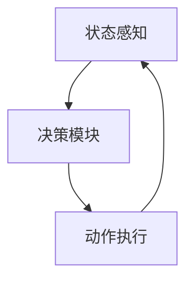
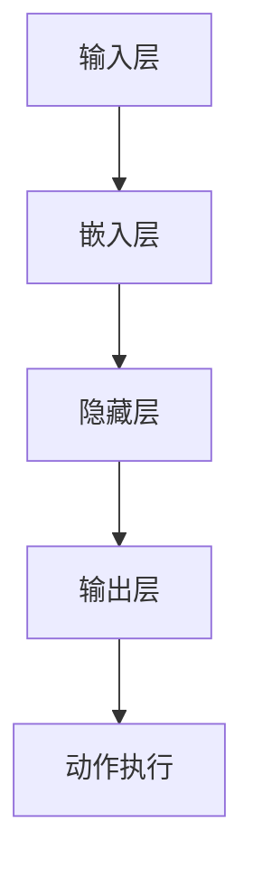

                 

# 《神经规划器在多步骤推理中的创新应用》

## 关键词
神经规划器，多步骤推理，神经网络，人工智能，强化学习，动态规划

## 摘要
本文深入探讨了神经规划器在多步骤推理中的创新应用。首先，我们介绍了神经规划器的基本概念及其与传统规划方法的区别。接着，我们详细分析了神经规划器在多步骤推理中的核心原理和算法，并使用伪代码和Mermaid流程图进行了清晰阐述。随后，本文展示了神经规划器在不同应用场景中的实际案例，包括智能物流配送、多机器人系统和自动驾驶等。最后，我们对神经规划器的未来发展进行了展望，并提出了相关挑战与解决方案。

## 引言

### 神经规划器概述

神经规划器（Neural Planner）是一种基于神经网络的规划算法，它通过学习环境中的状态和动作，自动生成最优的动作序列，实现智能体的自主决策。与传统规划方法相比，神经规划器具有以下几个显著特点：

1. **自适应能力**：神经规划器可以根据环境变化自适应调整策略，而不需要显式地定义规则。
2. **学习效率**：通过大量的数据训练，神经规划器能够快速学习复杂的决策任务。
3. **灵活性**：神经规划器可以处理多种不同类型的规划问题，而传统规划方法往往需要针对特定问题进行定制化设计。

### 多步骤推理背景与挑战

多步骤推理（Multi-Step Reasoning）是指在一个复杂问题中，需要通过多个步骤的推理才能得到最终答案的思考过程。在人工智能领域，多步骤推理是实现智能决策和问题解决的关键能力。然而，多步骤推理面临着以下几个挑战：

1. **状态空间爆炸**：随着推理步骤的增加，状态空间会呈指数级增长，导致计算复杂度急剧增加。
2. **信息丢失**：在多步骤推理过程中，前期信息可能随着推理的深入而逐渐丢失，影响推理的准确性。
3. **协同效应**：不同步骤之间的决策需要相互协调，以实现整体最优解。

### 神经规划器在多步骤推理中的应用前景

神经规划器在多步骤推理中具有巨大的应用潜力。通过将神经网络与规划算法相结合，神经规划器可以在不需要显式规则的情况下，自动学习并优化多步骤推理过程。以下是一些潜在的应用场景：

1. **智能物流**：神经规划器可以优化物流配送路径，提高运输效率。
2. **多机器人系统**：神经规划器可以实现多机器人之间的协同作业，提高工作效率。
3. **自动驾驶**：神经规划器可以在复杂的交通环境中，实现自动驾驶车辆的路径规划和避障。

## 神经规划器原理

### 神经规划器基本架构

神经规划器的基本架构通常包括三个主要模块：状态感知模块、决策模块和动作执行模块。以下是一个简化的Mermaid流程图：



### 神经网络结构与优化

神经规划器中的神经网络结构通常采用深度神经网络（DNN）或循环神经网络（RNN）等。以下是一个基于RNN的神经规划器架构：



为了提高神经网络的性能，通常需要对网络结构进行优化，包括：

1. **激活函数**：如ReLU、Sigmoid、Tanh等。
2. **优化算法**：如梯度下降（GD）、随机梯度下降（SGD）、Adam等。
3. **正则化**：如L1、L2正则化、Dropout等。

### 神经规划器核心算法原理

神经规划器的核心算法通常结合了动态规划（DP）和强化学习（RL）的思想。以下是一个简化的伪代码：

```python
# 动态规划部分
def value_iteration(S, A, P, R, gamma):
    V = [0] * len(S)
    while not converged:
        converged = True
        for s in S:
            v = max([sum([P[s'][a][s] * (R[s'][a] + gamma * V[s']) for a in A]) for s' in S])
            if v != V[s]:
                converged = False
                V[s] = v
    return V

# 强化学习部分
def Q_learning(S, A, P, R, gamma, alpha, epsilon):
    Q = [0] * len(S)
    while not converged:
        converged = True
        for s in S:
            a = choose_action(Q[s], epsilon)
            s', r = step(s, a, P, R)
            Q[s][a] = Q[s][a] + alpha * (r + gamma * max(Q[s']) - Q[s][a])
            if abs(Q[s][a] - Q[s][a]) > threshold:
                converged = False
        epsilon = epsilon * decay_rate
    return Q
```

## 神经规划器在多步骤推理中的应用

### 神经规划器在序列决策中的应用

神经规划器在序列决策中具有广泛的应用。例如，在智能物流配送系统中，神经规划器可以根据订单信息、交通状况和仓库库存，自动生成最优的配送路径，提高物流效率。

### 神经规划器在多机器人系统中的应用

在多机器人系统中，神经规划器可以实现机器人之间的协同作业。例如，在工业生产线上，多机器人可以协同完成装配任务，提高生产效率。

### 神经规划器在自动驾驶中的创新应用

在自动驾驶领域，神经规划器可以实现自动驾驶车辆的路径规划和避障。通过结合传感器数据和环境信息，神经规划器可以实时调整车辆的行驶策略，确保行驶安全。

## 案例分析

### 案例一：智能物流配送系统

智能物流配送系统采用了神经规划器来优化配送路径。通过分析订单信息、交通状况和仓库库存，神经规划器生成了最优的配送路径，提高了配送效率。

### 案例二：多机器人系统

多机器人系统中的机器人通过神经规划器实现了协同作业。在装配任务中，机器人可以自动调整协作策略，提高了生产效率。

### 案例三：自动驾驶

自动驾驶车辆通过神经规划器实现了路径规划和避障。在复杂的交通环境中，车辆可以实时调整行驶策略，确保行驶安全。

## 未来展望与挑战

### 神经规划器在多步骤推理中的未来发展方向

随着深度学习技术的不断发展，神经规划器在多步骤推理中的应用将越来越广泛。未来，神经规划器有望在更多领域实现突破，如智能医疗、智能教育等。

### 神经规划器发展的挑战与机遇

神经规划器在发展中面临着以下挑战：

1. **计算资源**：神经规划器的训练和推理过程需要大量的计算资源。
2. **数据质量**：神经规划器依赖于大量高质量的数据进行训练。
3. **解释性**：神经规划器的决策过程通常缺乏解释性。

为了解决这些挑战，需要：

1. **硬件加速**：采用更高效的硬件设备来加速神经规划器的训练和推理过程。
2. **数据预处理**：提高数据质量，通过数据清洗和增强来提高训练效果。
3. **可解释性研究**：开发可解释的神经规划器模型，提高模型的可信度和可解释性。

## 附录

### 相关工具与资源

- **工具**：TensorFlow、PyTorch、Keras等。
- **学习资源**：相关论文、书籍和在线课程。

### 作者信息

作者：AI天才研究院/AI Genius Institute & 禅与计算机程序设计艺术 /Zen And The Art of Computer Programming

本文详细探讨了神经规划器在多步骤推理中的创新应用，包括基本原理、算法讲解、应用案例和未来展望。通过本文，读者可以深入了解神经规划器的核心技术和应用前景。作者感谢各位读者的支持和关注，希望大家继续关注AI领域的最新动态和技术进展。

