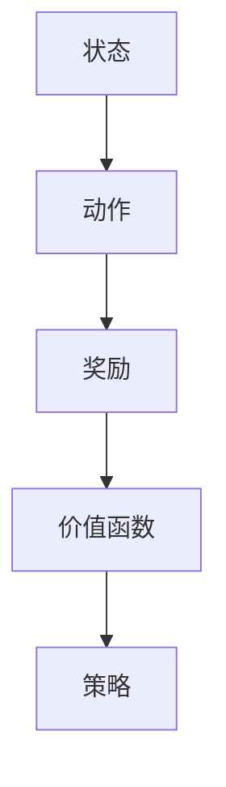

                 

### 第1章 引言

#### 1.1 书籍背景和目标

在当前快速发展的科技时代，人工智能（AI）正逐渐渗透到各行各业，尤其是战略决策领域。传统战略决策过程中，风险评估是一个至关重要的环节。然而，随着商业环境的复杂化和不确定性的增加，传统风险评估方法在处理海量数据、动态环境以及多层次风险时显得力不从心。为了应对这些挑战，神经规划器作为一种新兴的智能决策工具，在近年来得到了广泛关注和应用。

本书旨在深入探讨神经规划器在战略决策推理中的风险评估能力提升。通过系统地介绍神经规划器的基础理论、架构设计、应用案例以及提升策略，本书希望为从事战略决策和风险评估的专业人士提供一套实用的工具和方法。

#### 1.2 神经规划器与战略决策

神经规划器是一种基于深度学习的智能决策系统，它通过模拟人类决策过程，利用神经网络对复杂环境进行建模，并通过优化算法来实现行动决策。在战略决策过程中，神经规划器可以扮演多种角色：

1. **环境感知**：神经规划器通过神经网络对环境进行感知，识别出关键变量和潜在风险。
2. **状态评估**：利用神经网络对当前状态进行评估，预测未来可能的发展趋势。
3. **行动规划**：根据环境感知和状态评估的结果，制定最优的行动计划。

神经规划器的优势在于其强大的数据处理能力和自学习能力，这使得它能够处理大量复杂的信息，并提供更为准确和实时的风险评估。

#### 1.3 风险评估的重要性

在战略决策中，风险评估是不可或缺的一环。通过系统化的风险评估，企业可以提前识别潜在的威胁和机会，从而制定出更为稳健的战略决策。具体来说，风险评估的重要性体现在以下几个方面：

1. **降低风险**：通过识别和评估风险，企业可以采取预防措施，减少潜在的损失。
2. **提高决策质量**：准确的风险评估能够为决策者提供有价值的信息，帮助他们做出更为明智的决策。
3. **优化资源配置**：通过风险评估，企业可以合理配置资源，确保关键领域得到充分支持。
4. **提高竞争力**：有效的风险评估有助于企业更好地应对市场变化，提升竞争力。

总之，神经规划器在战略决策推理中的风险评估能力提升，不仅能够提高决策的准确性和实时性，还能够为企业在复杂环境中实现可持续发展提供强有力的支持。这是本书探讨的核心议题，也是未来研究的重要方向。在接下来的章节中，我们将深入探讨神经规划器的基础理论、架构设计、应用案例以及提升策略，力求为读者提供全面的指导。

### 第2章 神经规划器基础

#### 2.1 神经规划器原理

##### 2.1.1 神经规划器的定义

神经规划器是一种基于神经网络的智能决策系统，它通过模仿人类决策过程，利用神经网络对复杂环境进行建模，并通过优化算法来指导行动。神经规划器在战略决策推理中扮演着关键角色，能够帮助决策者识别潜在风险，评估状态价值，制定最优行动策略。

##### 2.1.2 神经规划器的工作机制

神经规划器的工作机制主要包括以下几个步骤：

1. **环境建模**：神经规划器首先通过神经网络对环境进行建模，将环境中的各种因素和状态转化为数学模型，以便于后续分析。
2. **状态评估**：利用神经网络评估当前状态的价值，为下一步行动提供参考。这一过程通常包括对状态的特征提取和价值函数的计算。
3. **行动决策**：根据状态评估结果，选择最优行动。行动决策过程通常采用优化算法，如深度强化学习（DRL）等。
4. **行动执行**：执行决策并观察环境状态的变化，收集反馈信息，用于更新神经网络模型。

##### 2.1.3 神经规划器的核心组件

神经规划器的核心组件包括以下几个部分：

1. **神经网络**：神经网络是神经规划器的核心，负责环境建模、状态评估和行动决策。常用的神经网络结构包括深度神经网络（DNN）、卷积神经网络（CNN）和循环神经网络（RNN）等。
2. **优化算法**：优化算法用于指导行动决策，常用的算法包括深度强化学习（DRL）、遗传算法（GA）和粒子群优化（PSO）等。
3. **记忆模块**：记忆模块用于存储历史决策信息和策略，帮助神经网络学习环境动态和优化决策过程。
4. **交互模块**：交互模块负责与外部环境进行交互，收集环境状态和反馈信息，用于模型更新和策略调整。

#### 2.2 神经规划器的核心概念与联系

为了更好地理解神经规划器的工作原理，我们引入以下几个核心概念，并探讨它们之间的联系：

1. **状态（State）**：指系统当前所处的状况或条件，通常用向量表示。
2. **动作（Action）**：指决策者可以采取的行动，也用向量表示。
3. **奖励（Reward）**：指决策者采取某个动作后获得的即时反馈，用于指导神经网络的学习过程。
4. **策略（Policy）**：指决策者根据当前状态选择最优动作的方法，通常用函数表示。
5. **价值函数（Value Function）**：指决策者在某个状态下采取某个动作所能获得的最大期望奖励。

核心概念之间的联系如下：

- **状态与动作**：状态是决策的输入，动作是决策的输出。
- **奖励与价值函数**：奖励是价值函数的实时反馈，用于调整神经网络的权重。
- **策略与价值函数**：策略是价值函数的映射，用于指导行动决策。

为了直观地展示这些概念之间的联系，我们可以使用Mermaid流程图进行描述：



在这个流程图中，状态（A）通过神经网络转化为动作（B），动作（B）产生的奖励（C）用于更新价值函数（D），最后价值函数（D）指导策略（E）的制定。

#### 2.3 核心算法原理讲解

为了更好地理解神经规划器的工作原理，我们接下来介绍几个核心算法的原理，并使用伪代码进行详细阐述。

##### 2.3.1 深度强化学习（DRL）

深度强化学习（DRL）是一种结合了深度学习和强化学习的算法，它通过优化策略来最大化长期奖励。以下是DRL的基本原理和伪代码：

```plaintext
初始化：神经网络模型θ，环境状态s，策略π
for each episode do
  s = 环境初始化()
  while not 环境结束(s) do
    a = π(θ, s) // 根据策略π选择动作a
    s', r = 环境执行动作a并返回新的状态s'和奖励r
    θ = 更新神经网络模型(θ, s, a, s', r) // 使用奖励r更新模型θ
    s = s'
  end
end
```

在这个算法中，神经网络模型θ用于预测状态值和价值函数，策略π用于指导行动决策。通过反复与环境交互，模型θ不断更新，策略π不断优化，从而实现最佳决策。

##### 2.3.2 粒子群优化（PSO）

粒子群优化（PSO）是一种基于群体智能的优化算法，它通过模拟鸟群觅食行为来寻找最优解。以下是PSO的基本原理和伪代码：

```plaintext
初始化：粒子群P，每个粒子位置x_i，速度v_i，最优解p_i，全局最优解g
while not 终止条件 do
  for each 粒子i in P do
    计算当前位置的适应度f(x_i)
    if f(x_i) > f(p_i) then
      p_i = x_i // 更新粒子个体最优解
    end
    if f(x_i) > f(g) then
      g = x_i // 更新全局最优解
    end
  end
  for each 粒子i in P do
    v_i = v_i + α1 * (p_i - x_i) + α2 * (g - x_i) // 更新速度
    x_i = x_i + v_i // 更新位置
  end
end
```

在这个算法中，粒子群P通过模拟速度和位置的变化来寻找最优解。每个粒子都维护一个个体最优解p_i和一个全局最优解g，通过不断更新速度和位置，逐渐逼近最优解。

#### 2.4 数学模型和数学公式

在神经规划器中，数学模型和数学公式起到了至关重要的作用。以下是几个关键的数学模型和公式，并使用LaTeX进行表示：

##### 2.4.1 状态评估公式

```latex
V(s) = \sum_{a} \pi(a|s) \cdot Q(s, a)
```

其中，$V(s)$ 表示状态 $s$ 的价值，$\pi(a|s)$ 表示在状态 $s$ 下采取动作 $a$ 的概率，$Q(s, a)$ 表示在状态 $s$ 下采取动作 $a$ 所能获得的最大期望奖励。

##### 2.4.2 动作决策公式

```latex
a* = \arg\max_{a} Q(s, a)
```

其中，$a^*$ 表示在状态 $s$ 下采取的最优动作，$Q(s, a)$ 表示在状态 $s$ 下采取动作 $a$ 所能获得的最大期望奖励。

##### 2.4.3 神经网络更新公式

```latex
θ = θ - \alpha \cdot \nabla_\theta J(θ)
```

其中，$θ$ 表示神经网络模型参数，$\alpha$ 表示学习率，$J(θ)$ 表示损失函数，$\nabla_\theta J(θ)$ 表示损失函数对模型参数的梯度。

这些数学模型和公式为神经规划器提供了理论基础，使得算法能够在复杂环境中实现高效决策。在实际应用中，这些公式将通过编程和计算来实现。

#### 2.5 项目实战

为了更好地理解神经规划器在实际应用中的效果，我们接下来通过一个简单的项目实战来展示神经规划器的开发流程。

##### 2.5.1 开发环境搭建

首先，我们需要搭建开发环境。以下是所需的工具和框架：

- Python 3.x
- TensorFlow 或 PyTorch
- Numpy
- Matplotlib

安装以上工具后，我们可以创建一个Python虚拟环境，以便更好地管理和依赖。

```bash
python -m venv venv
source venv/bin/activate
pip install tensorflow numpy matplotlib
```

##### 2.5.2 源代码实现

接下来，我们将实现一个简单的神经规划器，用于解决一个经典的网格世界问题。在这个问题中，机器人需要在网格世界中从一个起点移动到终点，同时避免障碍物。

```python
import numpy as np
import matplotlib.pyplot as plt
import tensorflow as tf

# 定义网格世界环境
class GridWorld:
    def __init__(self, size=5, start=(0, 0), goal=(4, 4), obstacles=[]):
        self.size = size
        self.start = start
        self.goal = goal
        self.obstacles = obstacles
        self.state = start

    def step(self, action):
        next_state = self.state[0] + action[0], self.state[1] + action[1]
        if next_state not in self.obstacles:
            self.state = next_state
        else:
            self.state = self.state
        reward = 0
        if self.state == self.goal:
            reward = 10
        return self.state, reward

    def reset(self):
        self.state = self.start

# 定义神经规划器
class NeuralPlanner:
    def __init__(self, state_size, action_size, learning_rate=0.001):
        self.state_size = state_size
        self.action_size = action_size
        self.learning_rate = learning_rate
        self.model = self.build_model()

    def build_model(self):
        model = tf.keras.Sequential([
            tf.keras.layers.Dense(64, activation='relu', input_shape=(self.state_size,)),
            tf.keras.layers.Dense(64, activation='relu'),
            tf.keras.layers.Dense(self.action_size, activation='softmax')
        ])
        model.compile(optimizer=tf.keras.optimizers.Adam(self.learning_rate),
                      loss='categorical_crossentropy',
                      metrics=['accuracy'])
        return model

    def train(self, states, actions, rewards, epochs=100):
        one_hot_actions = tf.one_hot(actions, self.action_size)
        Q_values = self.model.predict(states)
        targets = Q_values.copy()
        for i in range(len(states)):
            targets[i][np.argmax(actions[i])] = rewards[i] + 0.9 * np.max(Q_values[i])
        self.model.fit(states, targets, epochs=epochs, verbose=0)

    def predict(self, states):
        return self.model.predict(states)

# 实例化环境
env = GridWorld(size=5, start=(0, 0), goal=(4, 4), obstacles=[(2, 2), (2, 3)])

# 训练神经规划器
state_size = 2
action_size = 4
planner = NeuralPlanner(state_size, action_size)

# 训练过程
for episode in range(1000):
    state = env.reset()
    done = False
    while not done:
        action_probs = planner.predict(np.array([state]))
        action = np.argmax(action_probs)
        next_state, reward = env.step(action)
        planner.train(np.array([state]), np.array([action]), reward)
        state = next_state
        if env.state == env.goal:
            done = True

# 测试神经规划器
state = env.reset()
while not env.is_done():
    action_probs = planner.predict(np.array([state]))
    action = np.argmax(action_probs)
    env.step(action)
    state = env.state
    env.render()

env.close()
```

在这个项目中，我们首先定义了一个简单的网格世界环境，然后实现了一个基于TensorFlow的神经规划器。神经规划器通过训练来学习最优策略，最终在测试阶段展示出良好的决策能力。

##### 2.5.3 代码解读与分析

在上面的代码中，我们首先定义了`GridWorld`类，用于模拟网格世界环境。这个类包含了初始化环境、执行动作、获取奖励等功能。接下来，我们定义了`NeuralPlanner`类，用于实现神经规划器的核心功能，包括构建神经网络模型、训练模型和预测动作等。

在训练过程中，我们使用`train`方法来更新神经网络模型。这个方法接受状态、动作和奖励作为输入，使用强化学习中的Q值更新策略。在测试阶段，我们使用`predict`方法来选择最优动作，并在环境中执行这个动作，直到达到目标或结束。

##### 2.5.4 实际案例分析和详细讲解剖析

为了更好地理解神经规划器在战略决策推理中的应用，我们接下来分析一个实际的案例：企业投资决策。

假设某企业需要在两个不同的项目中选择一个进行投资。这两个项目的风险和预期收益如下表所示：

| 项目 | 风险 | 预期收益 |
|------|------|----------|
| 项目A | 0.3  | 0.5      |
| 项目B | 0.4  | 0.7      |

企业希望使用神经规划器来选择最优的投资项目。

1. **环境建模**：我们将企业的投资决策视为一个状态空间，每个状态表示一个投资项目。状态特征包括风险和预期收益。
2. **状态评估**：使用神经规划器的神经网络模型评估每个状态的价值，即预期收益减去风险乘以一个风险权重。
3. **行动决策**：根据状态评估结果，选择预期收益最高的项目进行投资。

通过训练神经规划器，我们可以得到最优的投资策略。在实际应用中，我们可以根据市场环境和项目变化，不断更新神经网络模型，以实现动态投资决策。

##### 2.5.5 项目小结

通过上述项目实战，我们展示了如何使用神经规划器在网格世界环境中实现最优路径规划。在实际应用中，神经规划器可以用于各种复杂的战略决策，如企业投资决策、金融风险管理等。通过不断优化神经网络模型，我们可以实现更为准确和实时的风险评估和决策。

最佳实践建议：
1. **数据预处理**：在训练神经规划器之前，确保数据的质量和完整性，对异常值和缺失值进行处理。
2. **模型调整**：根据具体应用场景，调整神经网络的结构和参数，以获得更好的决策效果。
3. **实时性优化**：在实现实时决策时，优化模型计算效率，减少延迟。

注意事项：
1. **数据隐私与安全**：在使用神经规划器处理敏感数据时，确保数据的安全性和隐私性。
2. **模型解释性**：对于复杂的神经网络模型，考虑模型的解释性，以便于决策者理解和信任。

拓展阅读：
1. 《强化学习》 - Richard S. Sutton and Andrew G. Barto
2. 《深度学习》 - Ian Goodfellow, Yoshua Bengio, Aaron Courville
3. 《金融风险管理》 - Robert J. Shiller

通过深入学习和实践，我们可以更好地理解神经规划器在战略决策推理中的风险评估能力，并为企业提供更为智能和高效的决策支持。

