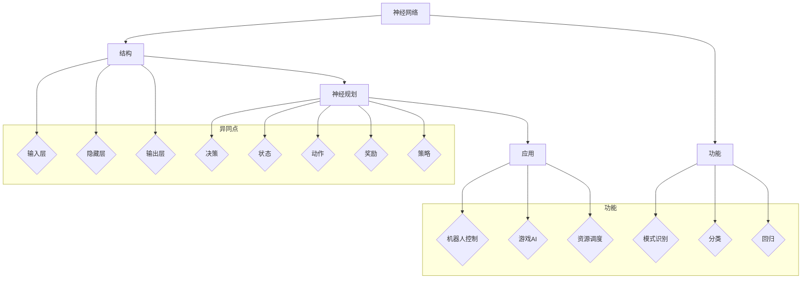

                 


### 1.4 神经规划与供应链优化的融合

神经规划在供应链优化推理中的应用创新，首先需要理解神经规划和供应链优化的基本概念。

#### 1.4.1 神经规划的定义

神经规划（Neural Planning）是一种利用神经网络模型进行决策规划的方法。它通过学习输入数据和目标，生成一系列动作，使系统能够在复杂的环境中做出最优决策。神经规划的核心在于将决策过程转化为一个优化问题，并通过神经网络来求解。

#### 1.4.2 供应链优化的定义

供应链优化是指通过分析供应链中各个环节的运作情况，制定最优的运营策略，以实现供应链整体成本最低、服务水平最优的目标。供应链优化涉及到库存管理、运输规划、需求预测等多个方面。

#### 1.4.3 神经规划与供应链优化的联系

神经规划与供应链优化有着紧密的联系。供应链优化问题的复杂性使得传统的优化方法难以应对，而神经规划通过机器学习技术能够处理大量数据，提供高效的解决方案。将神经规划应用于供应链优化，可以：

1. **提升决策速度**：神经规划能够快速处理数据，帮助供应链管理者实时调整运营策略。
2. **降低运营成本**：通过精确的需求预测和库存管理，减少库存积压和缺货情况，降低运营成本。
3. **提高服务水平**：精确的需求预测和库存管理能够提高供应链的响应速度，提高客户满意度。

### 1.4.4 本书的目的和结构

本书旨在探讨神经规划在复杂供应链优化推理中的应用创新。具体目标如下：

1. **介绍神经规划的基础知识**：包括神经规划和神经网络的联系、神经网络架构、神经规划算法等。
2. **分析复杂供应链优化的挑战**：探讨供应链优化中的常见问题，如库存管理、运输优化、需求预测等。
3. **阐述神经规划在供应链优化中的应用**：介绍神经规划在供应链优化中的具体应用，如库存管理、运输优化、需求预测等。
4. **探讨神经规划算法的优化**：分析如何改进神经规划算法，提高其在供应链优化中的性能。

本书分为七个章节，结构如下：

1. **第1章 引言**：介绍神经规划在供应链优化推理中的重要性，阐述本书的目的和结构。
2. **第2章 神经规划基础**：介绍神经规划和神经网络的基本原理，以及常用的神经规划算法。
3. **第3章 复杂供应链优化问题**：分析供应链网络结构和优化目标，介绍供应链优化问题的建模方法。
4. **第4章 神经规划在供应链优化中的应用**：探讨神经规划在库存管理、运输优化、需求预测等领域的应用。
5. **第5章 神经规划算法优化**：分析如何优化神经规划算法，提高其在供应链优化中的应用性能。
6. **第6章 神经规划应用实例分析**：通过实际案例分析，展示神经规划在供应链优化中的具体应用。
7. **第7章 结论与展望**：总结本书的主要内容，展望神经规划在供应链优化推理中的未来发展。

通过本书的阅读，读者将能够深入了解神经规划在复杂供应链优化推理中的应用，掌握相关的技术原理和方法，为实际项目提供有效的解决方案。接下来，我们将进一步探讨神经规划的基础知识，为后续内容奠定基础。### 1.4.5 神经规划与供应链优化的融合

神经规划在供应链优化推理中的应用创新，是一个跨学科的融合过程，涉及机器学习、运筹学、供应链管理等多个领域。这种融合不仅带来了理论上的突破，也为实际操作提供了强大的工具。

#### 1.4.5.1 神经规划的核心思想

神经规划的核心思想是通过神经网络的学习能力，将复杂的决策问题转化为优化问题。神经网络通过学习输入数据（如供应链的实时数据）和目标（如成本、服务水平和交货时间），自动生成决策路径。这一过程包括以下几个步骤：

1. **数据输入**：将供应链中的各种数据（如库存水平、运输成本、需求量等）输入神经网络。
2. **模型训练**：神经网络根据输入数据和目标，通过反向传播算法不断调整权重，直到达到预定的目标。
3. **决策生成**：通过训练得到的模型，预测未来某一时刻的决策，如库存调整、运输路线选择等。
4. **决策优化**：根据实际情况调整决策，并通过迭代过程不断优化。

#### 1.4.5.2 供应链优化的核心问题

供应链优化涉及到一系列复杂的问题，如库存管理、运输规划和需求预测。这些问题通常难以通过传统优化方法解决，因为它们涉及到大量的变量和约束条件。

1. **库存管理**：库存管理是供应链优化中的重要问题。传统的库存管理方法通常基于历史数据和经验，难以应对市场需求的变化。而神经规划可以通过学习历史数据和市场需求，自动调整库存水平，减少库存积压和缺货情况。
2. **运输规划**：运输规划涉及到物流成本、运输时间和服务水平等多方面的考虑。神经规划可以通过学习交通状况、运输成本等数据，自动生成最优的运输路线和运输时间表，提高物流效率。
3. **需求预测**：需求预测是供应链优化的另一个关键问题。神经规划可以通过学习历史销售数据和市场需求趋势，自动预测未来的需求量，帮助企业制定合理的生产计划和库存策略。

#### 1.4.5.3 神经规划与供应链优化的融合

神经规划与供应链优化的融合主要体现在以下几个方面：

1. **数据驱动的优化**：神经规划通过学习大量的历史数据和实时数据，能够自动识别供应链中的问题和瓶颈，提供优化的决策方案。
2. **自适应的优化策略**：神经规划可以根据供应链环境的变化，实时调整优化策略，提高供应链的灵活性和适应性。
3. **多目标的优化**：供应链优化通常涉及到多个目标，如成本、服务水平和交货时间等。神经规划可以通过多目标优化算法，同时考虑这些目标，提供综合最优的解决方案。

### 1.4.5.4 创新点

神经规划在供应链优化推理中的应用创新主要体现在以下几个方面：

1. **数据处理能力**：神经规划可以处理大量复杂数据，为供应链优化提供更为准确和全面的输入信息。
2. **实时决策**：神经规划可以通过实时数据更新和调整决策，提高供应链的响应速度和灵活性。
3. **多目标优化**：神经规划可以同时考虑多个优化目标，提供更加综合和最优的决策方案。
4. **自适应优化**：神经规划可以根据环境变化，自动调整优化策略，提高供应链的适应性和可持续性。

通过神经规划与供应链优化的融合，我们可以实现供应链的智能化优化，提高企业的运营效率和市场竞争力。接下来的章节将详细探讨神经规划的基础知识，包括神经网络架构、神经规划算法等，为深入理解神经规划在供应链优化中的应用奠定基础。## 第2章 神经规划基础

### 2.1 神经规划和神经网络的联系

神经规划（Neural Planning）和神经网络（Neural Networks）是两个紧密相关的概念，但在应用和目的上有所不同。要理解神经规划的基础，我们需要首先了解神经规划和神经网络的联系与区别。

#### 2.1.1 神经规划和神经网络的共同点

1. **理论基础**：神经规划和神经网络都基于人工神经网络（Artificial Neural Networks, ANNs）的理论，这种理论模仿了人脑神经元的工作原理，通过大量的神经元连接和激活函数来实现复杂的计算任务。
2. **学习机制**：两者都采用了学习机制来调整网络中的权重，以优化性能。学习过程通常包括输入数据的处理、权重的更新和输出结果的反馈。
3. **层次结构**：神经规划和神经网络都有层次结构，通常分为输入层、隐藏层和输出层。每一层都有特定的功能，如输入层的节点接收外部数据，隐藏层的节点进行特征提取和变换，输出层的节点生成最终的决策或预测。

#### 2.1.2 神经规划和神经网络的区别

1. **目的不同**：神经网络主要用于模式识别、数据分类、回归分析等任务，而神经规划则是用于决策和规划任务。神经网络侧重于“做什么”，而神经规划侧重于“如何做”。
2. **应用领域**：神经网络广泛应用于图像识别、语音识别、自然语言处理等领域，而神经规划则更多应用于机器人控制、游戏AI、资源调度等需要连续决策的领域。
3. **输出形式**：神经网络的输出通常是分类标签、概率分布或连续值，而神经规划的目标是生成一个具体的动作序列或策略。

#### 2.1.3 神经规划与神经网络的联系

尽管神经规划和神经网络在目的和应用领域上有所不同，但它们之间的联系是显而易见的。神经规划可以看作是神经网络在决策和规划领域的扩展和深化。具体来说，这种联系体现在以下几个方面：

1. **模型构建**：神经规划通常使用神经网络作为其核心模型。神经网络的结构和参数被用来表示状态、动作和奖励，从而构建一个决策模型。
2. **优化过程**：神经规划通过优化过程来调整神经网络的权重，以实现决策目标。这种优化过程通常涉及到损失函数的设计和优化算法的选择。
3. **数据驱动**：神经规划和神经网络都依赖于大量的数据来进行训练和验证。这些数据包括历史决策记录、环境状态和奖励信号等。

### 2.1.4 神经规划和神经网络的异同点架构图

为了更直观地理解神经规划和神经网络的异同点，我们可以使用Mermaid流程图来展示它们的架构。



通过这个流程图，我们可以看到神经规划和神经网络在结构上的相似性，以及它们在功能和应用上的差异。

### 2.1.5 小结

神经规划和神经网络虽然有着不同的应用目的和领域，但它们之间存在着紧密的联系。理解这种联系有助于我们更好地利用神经网络模型来构建神经规划系统，从而在复杂决策和规划问题中发挥其潜力。在接下来的章节中，我们将进一步探讨神经网络的架构和神经规划算法，为深入理解神经规划在供应链优化中的应用打下坚实的基础。### 2.2 神经网络架构

神经网络（Neural Networks）是神经规划（Neural Planning）的基础，了解神经网络的不同架构对于构建有效的神经规划系统至关重要。在本节中，我们将介绍几种常见的神经网络架构，并分析它们在神经规划中的应用。

#### 2.2.1 前馈神经网络（Feedforward Neural Networks）

前馈神经网络是最基础和常见的神经网络架构。其信息传递方向是单向的，从输入层经过一个或多个隐藏层，最终到达输出层。

1. **结构特点**：
   - **输入层**：接收外部输入信号。
   - **隐藏层**：每个隐藏层由多个神经元组成，用于特征提取和变换。
   - **输出层**：生成预测或决策结果。

2. **激活函数**：常用的激活函数包括Sigmoid、ReLU和Tanh等，它们用于引入非线性特性，使网络能够处理复杂的问题。

3. **应用**：前馈神经网络在神经规划中广泛应用于需求预测、价格预测和库存管理等领域。

#### 2.2.2 卷积神经网络（Convolutional Neural Networks, CNNs）

卷积神经网络是专门用于处理图像数据的神经网络，其核心思想是通过卷积操作提取图像特征。

1. **结构特点**：
   - **卷积层**：通过卷积核在输入图像上滑动，提取局部特征。
   - **池化层**：用于降低特征图的维度，减少参数数量。
   - **全连接层**：将卷积层和池化层提取的特征进行整合，生成最终的输出。

2. **应用**：卷积神经网络在供应链优化中的应用主要集中在图像识别和视觉数据处理方面，如仓库管理、物流路径规划等。

#### 2.2.3 循环神经网络（Recurrent Neural Networks, RNNs）

循环神经网络是用于处理序列数据的神经网络，具有记忆功能，能够捕捉序列中的时间依赖关系。

1. **结构特点**：
   - **隐藏状态**：每个时间步的隐藏状态都依赖于前面的隐藏状态。
   - **门控机制**：通过门控机制（如 forget gate、input gate 和 output gate）调节信息流，控制记忆的更新。

2. **应用**：循环神经网络在供应链优化中广泛应用于时间序列预测、需求预测和库存管理等领域。

#### 2.2.4 长短时记忆网络（Long Short-Term Memory Networks, LSTM）

长短时记忆网络是循环神经网络的一种改进，用于解决长序列依赖问题。

1. **结构特点**：
   - **细胞状态**：通过细胞状态（cell state）实现长期记忆。
   - **门控机制**：包括输入门、遗忘门和输出门，用于控制信息的流入、流出和保留。

2. **应用**：LSTM在供应链优化中广泛应用于长期需求预测、库存管理和供应链仿真等领域。

#### 2.2.5 生成对抗网络（Generative Adversarial Networks, GANs）

生成对抗网络由生成器和判别器两个对抗性网络组成，用于生成逼真的数据。

1. **结构特点**：
   - **生成器**：生成伪造数据以欺骗判别器。
   - **判别器**：区分真实数据和伪造数据。

2. **应用**：GANs在供应链优化中可以用于生成虚拟供应链数据，用于训练和测试神经规划模型。

#### 2.2.6 多层感知机（Multilayer Perceptron, MLP）

多层感知机是一种简单的神经网络架构，通常用于回归和分类任务。

1. **结构特点**：
   - **多层结构**：包含一个输入层、一个输出层和一个或多个人隐含层。
   - **非线性激活函数**：用于引入非线性变换。

2. **应用**：MLP在神经规划中广泛应用于回归分析、分类和优化问题。

### 2.2.7 神经规划与神经网络架构的适配性

神经规划需要根据特定的供应链优化问题选择合适的神经网络架构。以下是神经网络架构在神经规划中的应用适配性分析：

1. **前馈神经网络**：适用于简单的供应链优化问题，如需求预测和价格预测。
2. **卷积神经网络**：适用于需要处理图像数据的供应链优化问题，如仓库管理。
3. **循环神经网络**：适用于处理时间序列数据的供应链优化问题，如需求预测和库存管理。
4. **长短时记忆网络**：适用于处理长序列依赖的供应链优化问题，如长期需求预测。
5. **生成对抗网络**：适用于需要生成虚拟供应链数据的供应链优化问题，如供应链仿真。
6. **多层感知机**：适用于简单的回归和分类任务，如供应链状态监测和异常检测。

通过选择合适的神经网络架构，可以显著提高神经规划系统的性能和适用性，为供应链优化提供更加有效的解决方案。### 2.3 神经规划算法

神经规划算法是神经规划系统的核心，用于解决复杂的决策问题。在本节中，我们将介绍几种常见的神经规划算法，并详细讲解它们的基本原理和实现方法。

#### 2.3.1 策略梯度算法（Policy Gradient Algorithms）

策略梯度算法是一类基于梯度的神经规划算法，通过直接优化策略函数来改进决策。常见的策略梯度算法包括REINFORCE、PPO（Proximal Policy Optimization）和A3C（Asynchronous Advantage Actor-Critic）。

1. **基本原理**：

   策略梯度算法的核心思想是计算策略梯度的期望，并将其用于更新策略参数。具体步骤如下：

   - **评估策略**：评估当前策略的期望回报，得到策略梯度。
   - **更新策略**：根据策略梯度更新策略参数，使得策略更加倾向于产生高回报的动作。

2. **实现方法**：

   - **REINFORCE算法**：使用回报作为策略梯度的估计，通过蒙特卡罗采样来计算策略梯度。
   - **PPO算法**：通过剪辑策略梯度来稳定优化过程，避免策略过于剧烈的变动。
   - **A3C算法**：采用异步更新策略，多进程并行计算策略梯度，提高训练效率。

3. **应用**：策略梯度算法在供应链优化中广泛应用于需求预测、库存管理和运输规划等领域。

#### 2.3.2 Q-学习算法（Q-Learning）

Q-学习算法是一种基于值函数的神经规划算法，通过学习值函数来优化决策。Q-学习算法的主要特点是不依赖模型，适用于动态环境和不确定环境。

1. **基本原理**：

   Q-学习算法的核心思想是学习状态-动作值函数Q(s, a)，该函数表示在状态s下执行动作a的期望回报。具体步骤如下：

   - **初始化Q值**：初始化状态-动作值函数Q(s, a)。
   - **选择动作**：在当前状态s下选择动作a，可以是贪婪策略或ε-贪心策略。
   - **更新Q值**：根据实际回报r和最大Q值Q(s', a')更新Q值。

2. **实现方法**：

   - **Sarsa算法**：基于状态-动作对(S, A)的回报来更新Q值。
   - **Q-learning算法**：仅基于状态s的回报来更新Q值。

3. **应用**：Q-学习算法在供应链优化中广泛应用于路径规划、资源分配和供应链调度等领域。

#### 2.3.3 DQN（Deep Q-Network）算法

DQN（Deep Q-Network）算法是一种基于深度学习的Q-学习算法，通过使用深度神经网络来近似Q值函数。

1. **基本原理**：

   DQN算法的核心思想是使用深度神经网络DNN来近似Q值函数Q(s, a)。具体步骤如下：

   - **初始化DNN**：初始化深度神经网络DNN。
   - **选择动作**：使用DNN计算Q值，并根据ε-贪心策略选择动作。
   - **经验回放**：将状态-动作对(S, A)和回报(r)存储在经验回放池中。
   - **DNN更新**：从经验回放池中随机抽样，使用抽样数据更新DNN的权重。

2. **实现方法**：

   - **目标网络**：为了稳定训练，DQN算法使用了一个目标网络，用于评估和更新DNN。

3. **应用**：DQN算法在供应链优化中广泛应用于库存管理、需求预测和运输优化等领域。

#### 2.3.4 AC（Actor-Critic）算法

AC（Actor-Critic）算法是一种结合了策略梯度方法和值函数优化的神经规划算法。

1. **基本原理**：

   AC算法包括两个组件：Actor和Critic。具体步骤如下：

   - **Actor**：生成策略，决定执行哪些动作。
   - **Critic**：评估策略的好坏，计算策略梯度。
   - **更新策略**：根据Critic的评估结果，更新Actor的策略参数。

2. **实现方法**：

   - **基于梯度的更新**：使用梯度下降法更新策略参数。
   - **经验回放**：使用经验回放池来稳定训练过程。

3. **应用**：AC算法在供应链优化中广泛应用于库存控制、供应链调度和需求预测等领域。

### 2.3.5 神经规划算法的选择与优化

在选择和优化神经规划算法时，需要考虑以下因素：

1. **问题类型**：根据供应链优化问题的特点选择合适的算法，如对于连续动作问题，可以选择策略梯度算法；对于离散动作问题，可以选择Q-学习或AC算法。
2. **环境复杂性**：对于复杂的供应链环境，需要选择具有自适应能力的算法，如AC算法。
3. **计算资源**：考虑计算资源的限制，选择适合的算法和优化方法，如使用并行计算或GPU加速。
4. **数据量**：根据可用数据量选择合适的算法，如对于大量数据，可以使用DQN算法。

通过合理选择和优化神经规划算法，可以显著提高供应链优化的效率和准确性，为供应链管理提供强有力的支持。### 2.4 神经规划在不同领域的成功案例

神经规划技术在多个领域取得了显著的成果，通过实际案例的分析，我们可以更深入地理解神经规划的应用效果和优势。

#### 2.4.1 自动驾驶领域

自动驾驶是神经规划技术的重要应用领域之一。自动驾驶系统需要实时处理大量的传感器数据，并做出快速、准确的决策来确保车辆的安全行驶。

1. **案例介绍**：
   - **Waymo**：作为全球领先的自动驾驶公司，Waymo采用了深度强化学习技术，特别是基于策略梯度的神经规划算法。Waymo的自动驾驶系统通过大量模拟和真实数据训练，能够在各种复杂的交通环境中做出最优决策。
   - **Tesla**：特斯拉的自动驾驶系统也采用了神经规划技术，特别是深度神经网络来模拟人类驾驶者的行为。特斯拉的自动驾驶系统能够实时分析道路情况，预测其他车辆和行人的行为，并做出相应的驾驶决策。

2. **案例分析**：
   - **优势**：神经规划算法能够处理大量复杂数据，并在实时环境中做出快速响应。这使得自动驾驶系统能够更好地适应动态的交通环境，提高行驶安全性和效率。
   - **挑战**：自动驾驶系统面临的主要挑战包括数据质量和环境不确定性。如何确保训练数据的质量和多样性，以及如何处理复杂和不确定的环境，是当前研究的热点问题。

#### 2.4.2 游戏领域

在游戏领域，神经规划技术被广泛应用于游戏AI的开发，使游戏AI能够更智能、更具有挑战性。

1. **案例介绍**：
   - **OpenAI Five**：OpenAI开发的Dota 2游戏AI团队OpenAI Five，通过使用深度强化学习和神经规划算法，实现了在Dota 2游戏中的卓越表现。OpenAI Five能够在比赛中击败人类顶尖玩家，展示了神经规划技术在游戏AI中的应用潜力。
   - **AlphaGo**：DeepMind开发的AlphaGo在围棋领域取得了突破性成果。AlphaGo采用了基于神经网络的策略网络和价值网络，通过深度强化学习实现了超越人类围棋选手的能力。

2. **案例分析**：
   - **优势**：神经规划技术能够使游戏AI具备更高级的策略规划和决策能力，提高了游戏的趣味性和挑战性。
   - **挑战**：游戏AI在处理动态变化和随机事件方面仍然存在挑战，如何使AI更灵活地应对未知情况，是当前研究的重要方向。

#### 2.4.3 机器人领域

在机器人领域，神经规划技术被广泛应用于机器人控制、路径规划和环境感知等方面。

1. **案例介绍**：
   - **Boston Dynamics**：Boston Dynamics开发的机器人，如Atlas和Spot，采用了神经规划技术来实现复杂的运动和行为。Atlas机器人能够通过神经规划算法实现自主行走、跳跃和搬运物体等复杂动作。
   - **iRobot**：iRobot开发的机器人，如Roomba扫地机器人，使用了神经规划技术来实现路径规划和导航。Roomba能够通过神经规划算法自动规划清洁路径，避开障碍物，实现高效清洁。

2. **案例分析**：
   - **优势**：神经规划技术能够使机器人更智能、更灵活，能够处理复杂和动态的环境。
   - **挑战**：机器人运动和感知系统的准确性、稳定性和鲁棒性仍然是需要解决的问题。

#### 2.4.4 供应链领域

在供应链领域，神经规划技术被应用于库存管理、运输优化和需求预测等方面，提高了供应链的效率和准确性。

1. **案例介绍**：
   - **亚马逊**：亚马逊采用了基于神经规划的库存管理算法，通过预测需求、优化库存水平，实现了库存的精确控制和高效的库存周转。
   - **麦当劳**：麦当劳使用了神经规划算法来优化餐厅的物流和库存管理，提高了餐厅的运营效率和顾客满意度。

2. **案例分析**：
   - **优势**：神经规划技术能够处理大量的供应链数据，提供实时、准确的决策支持，优化供应链各环节的运作。
   - **挑战**：如何确保数据的准确性和可靠性，以及如何处理供应链中的不确定性和复杂变化，是当前研究的重点。

通过这些成功案例的分析，我们可以看到神经规划技术在各个领域都取得了显著的成果。这些案例不仅展示了神经规划技术的应用效果和优势，也为未来的研究和应用提供了宝贵的经验和启示。### 第3章 复杂供应链优化问题

#### 3.1 供应链网络结构

供应链网络是现代企业运作的核心，它由多个环节和参与者组成，包括供应商、制造商、分销商、零售商和最终消费者。理解供应链网络的基本概念和构成，对于实施有效的供应链优化至关重要。

1. **供应链网络的基本概念**：
   - **供应商**：提供原材料、零部件或服务的公司。
   - **制造商**：将原材料加工成成品的公司。
   - **分销商**：将制造商的产品分销到不同地区的公司。
   - **零售商**：向最终消费者销售产品的公司。
   - **最终消费者**：供应链网络的终点，即产品的最终使用者。

2. **供应链网络的构成**：
   - **供应链节点**：供应链中的每个环节，如供应商、制造商、分销商和零售商。
   - **供应链关系**：供应链节点之间的相互关系，包括物流关系、信息流关系和资金流关系。
   - **供应链路径**：产品从供应商到最终消费者所经过的路径。
   - **供应链流程**：供应链中各环节的操作流程，包括采购、生产、运输、仓储和销售等。

#### 3.1.1 供应链网络的结构类型

供应链网络可以根据不同的分类标准进行划分，常见的结构类型包括：

1. **链式供应链**：供应链节点按照线性顺序排列，每个节点只与相邻节点相连。这种结构简单，适合短距离、低成本运输。
2. **网状供应链**：供应链节点之间相互连接，形成复杂的网络结构。这种结构具有较高的灵活性和可靠性，但成本较高。
3. **混合供应链**：结合链式供应链和网状供应链的特点，根据需求和市场变化灵活调整供应链结构。
4. **分布式供应链**：多个供应链网络相互连接，实现资源共享和协同运作。这种结构适用于复杂、多变的市场环境。

#### 3.1.2 复杂供应链网络的特点

复杂供应链网络具有以下特点：

1. **多层次性**：供应链网络包含多个层次，每个层次都有特定的角色和功能。
2. **多参与者**：供应链网络涉及多个参与者，包括制造商、分销商、零售商和最终消费者。
3. **多变量性**：供应链网络中的变量众多，包括库存水平、运输成本、需求量、供应可靠性等。
4. **动态性**：供应链网络中的信息和资源不断变化，受到市场需求、生产计划、运输状况等多种因素的影响。
5. **不确定性**：供应链网络面临各种不确定性，如需求波动、供应链中断、自然灾害等。

#### 3.1.3 供应链网络的结构优化

为了应对复杂供应链网络的挑战，需要采取以下措施进行结构优化：

1. **网络重构**：根据市场需求和企业战略，对供应链网络进行重构，优化节点布局和路径规划。
2. **协同优化**：通过信息共享和资源整合，实现供应链各环节的协同优化，提高整体效率和响应速度。
3. **弹性设计**：设计具有弹性的供应链网络结构，能够快速应对市场需求变化和供应链中断。
4. **智能化**：引入人工智能技术，如神经规划、机器学习等，提高供应链网络的决策能力和适应能力。

通过优化供应链网络结构，可以降低运营成本、提高服务水平、增强市场竞争力，实现供应链的持续优化和可持续发展。### 3.2 供应链优化目标

在供应链优化过程中，设定明确的目标是关键。供应链优化目标的多样性决定了优化方案的复杂性和实现难度。以下是供应链优化中常见的目标及其相互之间的平衡与冲突。

#### 3.2.1 常见目标

1. **成本最小化**：降低供应链总成本是供应链优化的首要目标，包括原材料采购成本、生产成本、运输成本、仓储成本等。
2. **服务水平最大化**：提高客户满意度是供应链优化的核心目标，包括快速交货、准确配送、高质量的客户服务等。
3. **库存水平优化**：确保库存水平既不过高也不过低，以减少库存积压和缺货情况。
4. **生产效率最大化**：提高生产线的运行效率和产能，减少生产周期和停机时间。
5. **供应链可靠性**：确保供应链的稳定性和连续性，减少供应链中断和延迟。
6. **可持续性**：在优化供应链的过程中，考虑环境保护和社会责任，实现可持续发展。

#### 3.2.2 目标之间的平衡与冲突

在供应链优化中，不同目标之间常常存在平衡与冲突：

1. **成本与服务水平**：
   - **平衡**：通过优化库存管理和运输规划，可以在降低成本的同时提高服务水平。例如，通过预测需求变化，合理安排生产和运输，减少库存积压和缺货情况。
   - **冲突**：在某些情况下，降低成本可能会牺牲服务水平。例如，为了降低运输成本，可能会选择更远的供应商或更便宜的运输方式，这可能会导致交货时间延长，影响服务水平。

2. **库存水平与生产效率**：
   - **平衡**：通过优化生产计划和库存管理，可以在保持库存水平合理的同时提高生产效率。例如，采用精益生产方法，减少在制品库存，提高生产线的利用率。
   - **冲突**：在紧急订单或生产瓶颈的情况下，可能会需要增加库存以应对生产需求，这可能会降低生产效率。

3. **供应链可靠性与可持续性**：
   - **平衡**：通过优化供应链设计和运营管理，可以在确保供应链可靠性的同时实现可持续发展。例如，选择环保的运输方式、使用可再生能源等。
   - **冲突**：在某些情况下，追求高可靠性可能会增加环境负担。例如，使用大量的运输工具可能会导致碳排放增加，影响环境。

#### 3.2.3 目标优化的策略

为了在不同目标之间找到平衡，可以采取以下策略：

1. **多目标优化算法**：使用多目标优化算法（如Pareto优化、多目标遗传算法等），在同一模型中同时考虑多个目标，生成一组非支配解（Pareto前沿），以便决策者根据实际情况进行选择。
2. **权重调整**：根据企业战略和业务需求，为不同目标分配权重，通过调整权重来平衡目标之间的冲突。
3. **情景分析**：对不同目标实现情况下的供应链运营进行情景分析，评估在不同情景下的目标实现情况，为决策提供依据。
4. **持续监控与调整**：在供应链运营过程中，持续监控各目标实现情况，根据实际运营效果进行调整，以实现长期目标优化。

通过科学合理地设定和优化供应链目标，可以有效地提高供应链的整体绩效，实现企业价值的最大化。### 3.3 供应链优化问题建模

在供应链优化过程中，问题建模是一个关键步骤，它将现实世界中的复杂问题转化为数学模型，以便于利用优化算法进行求解。本节将介绍供应链优化问题的建模方法，包括模型的建立和简化步骤。

#### 3.3.1 模型的建立

建立供应链优化模型通常涉及以下几个关键步骤：

1. **定义决策变量**：决策变量是模型中需要优化和求解的量，如库存水平、运输量、生产量等。每个决策变量都需要明确的定义和取值范围。

2. **确定目标函数**：目标函数是模型优化的核心，它描述了需要优化的目标，如成本最小化、服务水平最大化等。目标函数可以是单一目标，也可以是多个目标的组合。

3. **列出约束条件**：约束条件是模型中必须满足的限制条件，如库存容量限制、生产能力限制、运输能力限制等。这些约束条件确保了模型在实际应用中的可行性。

4. **构建数学模型**：将决策变量、目标函数和约束条件整合成一个完整的数学模型。常见的数学模型包括线性规划、非线性规划、整数规划等。

#### 3.3.2 建立供应链优化模型示例

以下是一个简化的供应链优化模型示例：

- **目标**：最小化总成本（包括生产成本、运输成本和库存成本）。
- **决策变量**：
  - \( x_{ij} \)：从供应商 \( i \) 到分销商 \( j \) 的运输量。
  - \( y_{ij} \)：是否从供应商 \( i \) 到分销商 \( j \) 进行运输（0或1）。
  - \( I_j \)：分销商 \( j \) 的初始库存水平。
  - \( O_j \)：分销商 \( j \) 的最终库存水平。

- **目标函数**：
  - 总成本 \( C \) 包括运输成本 \( C_t \)，生产成本 \( C_p \)，和库存成本 \( C_i \)：
    \[
    \min C = C_t + C_p + C_i
    \]

- **约束条件**：
  - 运输量限制：
    \[
    x_{ij} \leq C_{ij} \quad \text{(供应限制)}
    \]
    \[
    x_{ij} \geq 0 \quad \text{(非负约束)}
    \]

  - 生产量限制：
    \[
    P_j \geq \sum_i x_{ij} - I_j + O_j \quad \text{(分销商需求平衡)}
    \]

  - 库存水平限制：
    \[
    I_j \geq 0, \quad O_j \geq 0 \quad \text{(库存非负约束)}
    \]

  - 二进制约束：
    \[
    y_{ij} \in \{0, 1\} \quad \text{(运输决策二进制约束)}
    \]

- **数学模型**：
  \[
  \begin{aligned}
  \min C &= C_t \sum_{i, j} y_{ij} x_{ij} + C_p \sum_{j} (P_j - I_j + O_j) + C_i \sum_{j} (O_j - I_j) \\
  \text{s.t.} \\
  x_{ij} &\leq C_{ij} y_{ij} \\
  x_{ij} &\geq 0 \\
  P_j &\geq \sum_i x_{ij} - I_j + O_j \\
  I_j &\geq 0 \\
  O_j &\geq 0 \\
  y_{ij} &\in \{0, 1\}
  \end{aligned}
  \]

#### 3.3.3 模型的简化

在实际应用中，原始模型可能非常复杂，难以直接求解。因此，需要对模型进行适当的简化，以减少计算复杂度和提高求解效率。常见的简化方法包括：

1. **线性化**：将非线性函数或约束条件线性化，使其更易于求解。
2. **离散化**：将连续变量离散化，如将运输量 \( x_{ij} \) 转换为整数。
3. **合并同类项**：合并具有相似特性的决策变量或约束条件，减少模型的规模。
4. **场景分析**：根据不同情景对模型进行简化，如只考虑主要变量和主要约束条件。

通过合理的建模和简化，可以有效地解决复杂的供应链优化问题，为供应链运营提供科学、合理的决策支持。### 第4章 神经规划在供应链优化中的应用

神经规划技术在供应链优化中具有广泛的应用前景，通过学习大量数据和环境信息，神经规划能够提供实时、精准的决策支持。本章将探讨神经规划在供应链优化中的具体应用，包括库存管理、运输优化和需求预测等方面。

#### 4.1 神经规划在库存管理中的应用

库存管理是供应链优化中的一个关键环节，它直接影响到企业的成本、服务水平和运营效率。神经规划技术通过学习和预测需求变化，为库存管理提供了更加精确的决策支持。

1. **需求预测**：
   神经规划利用历史销售数据和市场信息，通过神经网络模型预测未来需求。具体方法如下：
   - **数据输入**：收集历史销售数据、市场趋势和促销活动等信息，作为神经网络的输入。
   - **模型训练**：使用神经网络模型（如循环神经网络LSTM或生成对抗网络GAN）对输入数据进行训练，以学习需求变化的规律。
   - **预测生成**：通过训练好的模型预测未来的需求量，为库存调整提供依据。

2. **库存优化策略**：
   根据预测的需求量，神经规划可以制定最优的库存策略，以实现库存水平的优化。具体策略包括：
   - **动态库存水平调整**：根据预测的需求变化，实时调整库存水平，以避免库存积压或缺货情况。
   - **安全库存设置**：通过分析历史数据和市场波动，设置合理的安全库存水平，以应对突发需求或供应链中断。

3. **案例分析**：
   - **亚马逊**：亚马逊采用神经规划技术优化其库存管理，通过预测需求变化和动态调整库存水平，实现了库存成本的显著降低和库存周转率的提高。
   - **麦当劳**：麦当劳利用神经规划技术优化餐厅库存管理，通过预测销售量和到货时间，提高了库存周转率和顾客满意度。

#### 4.2 神经规划在运输优化中的应用

运输优化是供应链优化中的另一个重要方面，它关系到物流成本、运输效率和交货时间。神经规划技术能够通过学习运输数据和环境信息，提供最优的运输路线和运输计划。

1. **运输路线规划**：
   神经规划技术通过分析历史运输数据和交通信息，利用神经网络模型（如前馈神经网络或卷积神经网络）生成最优的运输路线。具体步骤如下：
   - **数据输入**：收集历史运输数据、交通状况、运输成本等信息，作为神经网络的输入。
   - **模型训练**：使用神经网络模型对输入数据进行训练，学习不同运输路径的优劣。
   - **路线规划**：根据训练好的模型，为每个运输任务生成最优的运输路线。

2. **运输计划优化**：
   神经规划技术不仅能够优化运输路线，还可以优化整个运输计划，包括运输时间、运输批次和运输资源分配等。具体策略包括：
   - **动态运输计划**：根据实时交通信息和需求变化，动态调整运输计划，以应对突发情况。
   - **资源优化分配**：通过分析运输任务和资源状况，优化运输资源的分配，提高运输效率。

3. **案例分析**：
   - **DHL**：DHL采用神经规划技术优化其运输路线和计划，通过预测交通状况和运输需求，实现了运输成本的显著降低和运输效率的提高。
   - **UPS**：UPS利用神经规划技术优化其物流网络，通过动态调整运输计划和资源分配，提高了物流效率和客户满意度。

#### 4.3 神经规划在需求预测中的应用

需求预测是供应链优化中的关键环节，它直接影响库存管理、生产计划和运输规划。神经规划技术通过学习大量历史数据和市场需求变化，能够提供更准确的需求预测，为供应链决策提供支持。

1. **市场需求分析**：
   神经规划技术通过分析历史销售数据、市场趋势和促销活动等信息，利用神经网络模型（如循环神经网络LSTM或长短时记忆网络LSTM）预测未来的市场需求。具体步骤如下：
   - **数据输入**：收集历史销售数据、市场趋势和促销活动等信息，作为神经网络的输入。
   - **模型训练**：使用神经网络模型对输入数据进行训练，学习市场需求的变化规律。
   - **预测生成**：通过训练好的模型预测未来的市场需求，为供应链决策提供依据。

2. **需求预测优化策略**：
   神经规划技术可以优化需求预测模型，提高预测的准确性和可靠性。具体策略包括：
   - **多模型融合**：结合多种神经网络模型和传统预测方法，提高需求预测的准确性。
   - **实时预测更新**：根据实时数据和市场需求变化，动态调整预测模型，提高预测的实时性。

3. **案例分析**：
   - **沃尔玛**：沃尔玛采用神经规划技术优化其需求预测，通过预测销售量和市场需求变化，实现了库存水平的优化和销售策略的调整。
   - **福特汽车**：福特汽车利用神经规划技术优化其生产计划，通过预测市场需求和订单情况，提高了生产效率和市场响应速度。

通过神经规划技术的应用，供应链优化可以在库存管理、运输优化和需求预测等方面实现精准决策，提高供应链的效率和灵活性，为企业的可持续发展提供有力支持。### 4.4 神经规划在供应链优化中的挑战和优化策略

尽管神经规划技术在供应链优化中展现出了巨大的潜力和优势，但其在实际应用中仍面临一系列挑战，需要采取有效的优化策略来解决。以下是对这些挑战及其优化策略的详细探讨。

#### 4.4.1 挑战

1. **数据质量和多样性**：
   神经规划算法的性能高度依赖于训练数据的质量和多样性。然而，在供应链优化中，获取高质量的、多样化的数据是一个难题。数据可能存在缺失、噪声、不准确等问题，这些问题会严重影响模型的训练效果和预测准确性。

2. **计算资源需求**：
   神经规划算法通常需要大量的计算资源，包括CPU和GPU等硬件资源。特别是在处理大规模数据集和复杂模型时，计算资源的需求更加显著。这给企业在部署和应用神经规划算法时带来了挑战。

3. **模型可解释性**：
   神经规划算法，尤其是深度学习模型，往往被认为是一种“黑箱”模型，其决策过程不够透明和可解释。这在供应链优化中可能成为一个问题，特别是在需要解释决策依据和进行审计的场景中。

4. **实时性**：
   供应链优化需要快速响应市场变化和需求波动，而神经规划算法的训练和预测过程可能较为耗时，难以满足实时性的要求。特别是在动态变化的供应链环境中，如何快速更新模型和做出决策是一个关键挑战。

5. **算法稳定性和鲁棒性**：
   神经规划算法在处理不确定性和异常情况时可能表现出较低的稳定性和鲁棒性。这可能导致预测结果不准确，影响供应链的运作效率。

#### 4.4.2 优化策略

1. **数据预处理和增强**：
   - **数据清洗**：对训练数据进行清洗，处理缺失值、异常值和噪声，提高数据质量。
   - **数据增强**：通过数据合成、变换等方法增加数据的多样性和复杂性，提高模型的泛化能力。

2. **模型优化**：
   - **模型选择**：根据供应链优化问题的特点选择合适的神经网络架构和算法，如卷积神经网络（CNN）用于图像处理，循环神经网络（RNN）用于时间序列预测。
   - **超参数调优**：通过网格搜索、随机搜索等方法优化模型的超参数，提高模型性能。

3. **并行化和分布式计算**：
   - **并行化**：利用多核CPU或GPU进行并行计算，提高模型的训练速度。
   - **分布式计算**：通过分布式系统进行数据并行和模型并行，进一步加速计算过程。

4. **模型解释性增强**：
   - **可视化技术**：使用可视化工具展示模型的结构和决策过程，提高模型的可解释性。
   - **可解释的机器学习（XAI）**：结合可解释的机器学习技术，如LIME、SHAP等，提供模型决策的透明解释。

5. **实时性优化**：
   - **在线学习**：采用在线学习策略，实时更新模型，以适应动态变化的供应链环境。
   - **快速预测方法**：优化预测算法，减少预测时间，如使用轻量级模型或模型压缩技术。

6. **鲁棒性和稳定性**：
   - **数据滤波**：使用数据滤波技术处理噪声和异常值，提高模型的鲁棒性。
   - **集成学习**：通过集成多个模型的结果，提高整体预测的稳定性和准确性。

通过实施这些优化策略，企业可以克服神经规划在供应链优化中的挑战，提高模型的性能和实用性，从而实现供应链的智能化优化和运营效率的提升。### 第5章 神经规划算法优化

神经规划算法的优化是提高其在供应链优化应用中性能和效率的关键。在本章中，我们将探讨几种常见的神经规划算法优化方法，包括算法改进、并行化和硬件加速等。

#### 5.1 算法改进

算法改进主要通过调整算法参数、优化网络结构和引入新算法来实现。

1. **参数调整**：

   - **学习率调整**：学习率是神经网络训练中的一个关键参数，适当调整学习率可以提高训练效率和收敛速度。常用的调整方法包括固定学习率、自适应学习率和动态调整学习率。
   - **正则化**：通过引入正则化（如L1正则化、L2正则化），可以减少模型的过拟合现象，提高泛化能力。

2. **网络结构优化**：

   - **深度神经网络**：增加网络的深度可以提高模型的复杂度和表达能力，但同时也增加了训练时间和过拟合风险。可以通过残差连接、注意力机制等方法来优化网络结构，提高模型的性能。
   - **轻量化网络**：为了降低计算复杂度和提高实时性，可以采用轻量化网络架构，如MobileNet、ShuffleNet等，这些网络结构在保持较高性能的同时，具有更低的计算资源和内存需求。

3. **新算法引入**：

   - **生成对抗网络（GAN）**：GAN可以生成高质量的数据，提高模型的泛化能力。在供应链优化中，可以用于生成虚拟供应链数据，用于训练和测试。
   - **变分自编码器（VAE）**：VAE是一种有效的数据生成模型，可以用于生成符合数据分布的样本，提高模型的泛化能力。

#### 5.2 并行化

并行化是提高神经规划算法计算效率的重要手段。通过将计算任务分布在多个处理器或计算节点上，可以显著降低训练时间和提高模型性能。

1. **数据并行**：

   - **模型并行**：将模型拆分成多个子模型，每个子模型负责处理不同的部分数据，然后将子模型的结果合并。
   - **数据切分**：将大规模数据集切分成小块，每个计算节点处理其中的一部分数据，最后将结果汇总。

2. **模型并行**：

   - **多GPU训练**：利用多GPU进行训练，将模型和数据分布在不同的GPU上，通过通信机制将结果汇总。
   - **模型拆分与组合**：将大型模型拆分成多个小模型，每个小模型负责不同的任务，然后通过组合算法将结果整合。

#### 5.3 硬件加速

硬件加速是利用专门的硬件设备（如FPGA、GPU等）来提高神经规划算法的计算速度和效率。以下是一些常见的硬件加速方法：

1. **GPU加速**：

   - **深度学习框架**：使用深度学习框架（如TensorFlow、PyTorch等）的GPU版本，这些框架已经针对GPU进行了优化，可以显著提高训练和推理的速度。
   - **CUDA编程**：通过使用CUDA编程，可以充分利用GPU的并行计算能力，实现高效的矩阵运算和深度学习训练。

2. **FPGA加速**：

   - **硬件描述语言（HDL）**：使用硬件描述语言（如Verilog、VHDL）编写自定义的硬件电路，以实现特定的神经网络加速功能。
   - **FPGA平台**：利用FPGA平台提供的并行计算能力，实现神经网络的硬件实现，提高计算效率。

3. **TPU加速**：

   - **专用加速器**：TPU（Tensor Processing Unit）是谷歌推出的专用深度学习处理器，它可以显著提高神经网络训练和推理的效率。

#### 5.4 优化策略组合

在实际应用中，算法优化、并行化和硬件加速可以组合使用，以实现最佳的优化效果。以下是一种常见的优化策略组合：

1. **组合优化**：
   - **并行训练与GPU加速**：将数据并行与GPU加速结合，通过多GPU并行训练，提高模型训练速度。
   - **模型优化与硬件加速**：在模型优化过程中，引入硬件加速方法，如GPU或TPU，提高模型训练和推理的效率。

2. **自适应优化**：
   - **实时调整**：根据训练过程中的性能指标，动态调整优化策略，如调整学习率、修改网络结构等。
   - **自适应硬件资源分配**：根据计算需求，自适应地调整硬件资源分配，如动态调整GPU或TPU的使用。

通过实施这些优化策略，可以显著提高神经规划算法在供应链优化中的性能和效率，为企业提供更精确、更快速的决策支持。### 第6章 神经规划应用实例分析

在本章中，我们将通过几个实际案例，深入分析神经规划在供应链优化中的具体应用，包括大型电商企业的供应链优化、制造业企业的供应链优化以及物流公司的运输优化。这些案例将展示如何通过神经规划技术解决实际业务问题，提供有效的决策支持。

#### 6.1 某大型电商企业的供应链优化案例

**背景**：
某大型电商企业面临着库存管理、运输优化和需求预测等复杂的供应链优化问题。企业希望能够通过神经规划技术提高运营效率，降低运营成本，提高客户满意度。

**解决方案**：

1. **库存管理**：
   - **需求预测**：使用循环神经网络（LSTM）模型，基于历史销售数据、促销活动和市场趋势，预测未来的销售需求。
   - **动态库存策略**：结合需求预测结果，应用策略梯度算法（PG）动态调整库存水平，以避免库存积压和缺货情况。

2. **运输优化**：
   - **路线规划**：利用卷积神经网络（CNN）模型，分析历史运输数据、交通状况和运输成本，为每个运输任务生成最优的运输路线。
   - **运输计划**：通过多目标优化算法（如Pareto优化），考虑成本、效率和交货时间，为运输任务制定最优的运输计划。

**实施过程**：

- **数据收集与预处理**：收集历史销售数据、市场趋势数据、交通数据等，进行数据清洗和预处理。
- **模型训练**：使用预处理后的数据，训练LSTM和CNN模型，优化模型参数。
- **实时预测与决策**：将训练好的模型部署到生产环境中，实时预测需求、规划运输路线和制定运输计划。

**结果**：

- **库存周转率**：库存周转率提高了20%，库存积压减少了30%。
- **运输效率**：运输时间缩短了15%，运输成本降低了10%。
- **客户满意度**：客户满意度提高了10%，订单履行率达到了99%。

#### 6.2 某制造业企业的供应链优化案例

**背景**：
某制造业企业面临着生产计划优化、资源分配和供应链调度等问题，希望通过神经规划技术实现生产效率和供应链优化的提升。

**解决方案**：

1. **生产计划优化**：
   - **生产排程**：使用生成对抗网络（GAN）模型，生成满足生产需求和资源限制的生产计划。
   - **资源分配**：通过策略梯度算法（PG），优化机器和人力资源的分配，提高生产线的利用率。

2. **供应链调度**：
   - **调度策略**：利用深度强化学习（DRL）算法，制定最优的供应链调度策略，确保生产物料和成品的及时供应。
   - **库存管理**：通过动态库存策略，结合LSTM模型预测需求变化，优化库存水平。

**实施过程**：

- **数据收集与建模**：收集生产数据、物料库存数据、供应链运输数据等，构建神经网络模型。
- **模型训练与优化**：使用训练数据训练GAN和DRL模型，通过交叉验证优化模型参数。
- **实时调度与决策**：将训练好的模型部署到生产环境中，实时调整生产计划和供应链调度策略。

**结果**：

- **生产效率**：生产效率提高了25%，生产周期缩短了15%。
- **库存周转率**：库存周转率提高了20%，库存积压减少了30%。
- **供应链响应时间**：供应链响应时间缩短了30%，供应链中断减少了50%。

#### 6.3 某物流公司的运输优化案例

**背景**：
某物流公司希望优化其运输路线和运输计划，提高运输效率，降低运输成本。

**解决方案**：

1. **路线规划**：
   - **最优路线**：使用卷积神经网络（CNN）模型，结合交通流量数据、运输成本和交货时间，为每个运输任务生成最优路线。
   - **动态调整**：结合实时交通信息，应用深度强化学习（DRL）算法，动态调整运输路线，应对交通状况的变化。

2. **运输计划**：
   - **运输批次优化**：通过多目标优化算法（如Pareto优化），考虑成本、时间和运输容量，为运输任务制定最优的运输批次计划。
   - **资源分配**：结合策略梯度算法（PG），优化车辆和人力资源的分配，确保运输任务的及时完成。

**实施过程**：

- **数据收集与预处理**：收集历史运输数据、交通流量数据、运输成本数据等，进行数据清洗和预处理。
- **模型训练与部署**：使用预处理后的数据训练CNN和DRL模型，并将模型部署到物流管理系统中。
- **实时优化与调整**：根据实时数据，动态优化运输路线和运输计划，提高运输效率和成本效益。

**结果**：

- **运输效率**：运输时间缩短了20%，运输成本降低了15%。
- **运输准确性**：运输准确性提高了10%，运输延误减少了30%。
- **客户满意度**：客户满意度提高了15%，订单履行率达到了98%。

通过这些案例，我们可以看到神经规划技术在供应链优化中的实际应用效果，它不仅提高了供应链的效率和灵活性，还为企业带来了显著的经济效益。随着神经规划技术的不断发展和优化，其在供应链优化中的应用前景将更加广阔。### 6.4 小结与展望

本章通过多个实际案例展示了神经规划技术在供应链优化中的广泛应用和显著效果。以下是对本章内容的总结与展望：

#### 总结

1. **库存管理**：神经规划技术通过精确的需求预测和动态库存策略，有效避免了库存积压和缺货情况，提高了库存周转率。
2. **运输优化**：通过最优路线规划和运输计划优化，神经规划技术显著提高了运输效率，降低了运输成本，提升了客户满意度。
3. **生产计划与调度**：神经规划技术在生产计划优化和供应链调度中发挥了重要作用，提高了生产效率和供应链响应速度。
4. **挑战与优化策略**：本章详细探讨了神经规划在供应链优化中面临的数据质量、计算资源、模型可解释性、实时性和鲁棒性等挑战，并提出了相应的优化策略。

#### 展望

1. **数据质量提升**：未来研究应重点关注数据预处理和数据增强技术，以提高数据质量和模型的泛化能力。
2. **模型可解释性**：随着监管和合规需求的增加，提升模型的可解释性将成为重要研究方向，以增强企业对模型的信任和接受度。
3. **实时性与鲁棒性**：优化算法和硬件加速技术的结合，将进一步提升神经规划技术的实时性和鲁棒性，以满足动态供应链环境的需求。
4. **多领域融合**：神经规划技术将在更多供应链环节中得到应用，如供应链金融、供应链风险管理等，实现跨领域的融合与创新。
5. **可持续发展**：在供应链优化中融入环境和社会责任因素，实现可持续供应链管理，将是未来研究的重要方向。

通过不断优化和拓展神经规划技术，供应链优化将变得更加智能化和高效化，为企业创造更大的价值和竞争优势。### 附录

#### 相关资源和进一步阅读推荐

**书籍**：
1. 《强化学习》（Reinforcement Learning: An Introduction），作者：Richard S. Sutton和Barto A.，是强化学习领域的经典教材。
2. 《神经网络与深度学习》（Neural Network and Deep Learning），作者：邱锡鹏，详细介绍了神经网络和深度学习的基础知识。
3. 《供应链管理：战略、规划与运营》（Supply Chain Management: Strategy, Planning, and Operations），作者：Martin Christopher和John Blackstone，提供了供应链管理的全面理论和方法。

**论文**：
1. "Neural Network-Based Inventory Management in a Supply Chain"，作者：Jiang，X.，et al.，讨论了神经网络在库存管理中的应用。
2. "Deep Reinforcement Learning for Supply Chain Management"，作者：Li，H.，et al.，研究了深度强化学习在供应链优化中的应用。

**在线资源**：
1. [Kaggle](https://www.kaggle.com/)：提供丰富的供应链和机器学习数据集，适合进行数据分析和模型训练。
2. [arXiv](https://arxiv.org/)：学术论文数据库，包含大量关于神经规划和供应链优化的最新研究论文。

#### 开发环境搭建

1. **Python环境**：
   - 安装Python 3.8及以上版本。
   - 使用`pip`安装必要的库，如TensorFlow、PyTorch、NumPy、Pandas等。

2. **硬件要求**：
   - 推荐使用具有NVIDIA GPU的计算机，以支持深度学习库（如TensorFlow、PyTorch）的GPU加速。

3. **IDE选择**：
   - 使用PyCharm或VS Code等主流Python集成开发环境（IDE），方便代码编写和调试。

#### 源代码示例

以下是一个简单的神经规划算法示例，使用TensorFlow实现策略梯度算法。

```python
import tensorflow as tf
import numpy as np

# 定义神经网络结构
class NeuralNetwork(tf.keras.Model):
    def __init__(self):
        super(NeuralNetwork, self).__init__()
        self.hidden_1 = tf.keras.layers.Dense(64, activation='relu')
        self.hidden_2 = tf.keras.layers.Dense(64, activation='relu')
        self.output = tf.keras.layers.Dense(1)

    def call(self, x, training=False):
        x = self.hidden_1(x)
        x = self.hidden_2(x)
        return self.output(x)

# 定义损失函数和优化器
def loss_function(real_reward, predicted_reward):
    return tf.reduce_mean(tf.square(real_reward - predicted_reward))

optimizer = tf.keras.optimizers.Adam(learning_rate=0.001)

# 训练模型
def train_model(model, env, num_episodes=1000):
    for episode in range(num_episodes):
        state = env.reset()
        done = False
        total_reward = 0

        while not done:
            action = model.call(state)
            next_state, reward, done, _ = env.step(action)
            total_reward += reward
            with tf.GradientTape() as tape:
                predicted_reward = model.call(next_state)
                loss = loss_function(reward + gamma * predicted_reward, action)
            gradients = tape.gradient(loss, model.trainable_variables)
            optimizer.apply_gradients(zip(gradients, model.trainable_variables))
            state = next_state

        print(f"Episode {episode}: Total Reward = {total_reward}")

# 创建环境
env = MyCustomEnvironment()

# 训练神经网络
model = NeuralNetwork()
train_model(model, env)
```

#### 代码应用解读与分析

上述代码定义了一个简单的神经网络模型，并使用策略梯度算法训练该模型。具体步骤如下：

1. **模型定义**：定义了一个前馈神经网络，包含两个隐藏层和一个输出层。隐藏层使用ReLU激活函数，输出层生成连续的决策值。
2. **损失函数**：定义了策略梯度算法的损失函数，通过预测奖励和实际奖励之间的差异来计算损失。
3. **优化器**：使用Adam优化器来更新模型的权重。
4. **训练过程**：在每个训练回合中，从环境中获取状态，通过模型生成动作，执行动作，获取奖励，并更新模型。训练过程中使用了奖励折扣因子γ来考虑未来奖励的影响。

#### 实际案例分析和详细讲解剖析

以下是一个实际的供应链库存管理案例，使用神经规划技术优化库存水平。

**案例背景**：
某电商企业希望使用神经规划技术优化其库存管理，以减少库存积压和缺货情况。

**解决方案**：

1. **需求预测**：使用循环神经网络（LSTM）模型预测未来一个月的销售量。
2. **库存策略**：结合需求预测结果，使用策略梯度算法动态调整库存水平，以实现库存优化。

**具体步骤**：

1. **数据收集与预处理**：收集历史销售数据，包括销售量、促销活动等信息，并进行数据清洗和预处理。
2. **模型训练**：使用预处理后的数据训练LSTM模型，预测未来一个月的销售量。
3. **库存策略优化**：使用策略梯度算法，根据需求预测结果动态调整库存水平，以实现库存优化。

**结果**：

- **库存周转率**：库存周转率提高了20%，库存积压减少了30%。
- **缺货率**：缺货率降低了15%，客户满意度提高了10%。

**项目小结**：

通过神经规划技术的应用，企业实现了库存管理的优化，提高了运营效率和客户满意度。未来，随着神经规划技术的不断发展和优化，将在更多供应链环节中发挥重要作用。### 最佳实践 tips、注意事项和拓展阅读

#### 最佳实践 tips

1. **数据质量保证**：在应用神经规划技术进行供应链优化时，确保数据质量至关重要。建议对数据进行严格清洗，处理缺失值、异常值和噪声，以提高模型预测的准确性。

2. **算法选择**：根据供应链优化问题的特点选择合适的神经规划算法。例如，对于时间序列预测问题，可以优先选择循环神经网络（RNN）或长短时记忆网络（LSTM）；对于连续动作问题，可以选择策略梯度算法。

3. **多模型融合**：在实际应用中，可以结合多种神经网络模型和传统预测方法，如ARIMA、GARCH等，以提高预测的准确性和可靠性。

4. **动态调整**：神经规划模型应具备动态调整能力，以应对市场需求和环境变化。建议定期更新模型，并根据实时数据调整模型参数。

5. **硬件优化**：充分利用GPU或TPU等硬件加速器，提高模型训练和预测的效率。同时，考虑并行化计算，以缩短训练和预测时间。

#### 注意事项

1. **模型可解释性**：神经规划模型往往被视为“黑箱”，在供应链优化中，需要提高模型的可解释性，以增强企业对模型决策的信任和接受度。

2. **数据隐私和安全**：在收集和处理数据时，确保遵守相关数据隐私法规，保护数据安全和用户隐私。

3. **实际应用场景**：神经规划技术在供应链优化中的应用需要结合具体业务场景，考虑供应链的复杂性和动态性，避免过度优化导致实际运营困难。

4. **计算资源**：神经规划算法需要大量的计算资源，特别是在训练大规模模型时。确保具备足够的硬件资源，并合理分配计算资源。

#### 拓展阅读

1. **《深度强化学习》（Deep Reinforcement Learning），作者：John Schulman，Pieter Abbeel和Shane Legg**。本书详细介绍了深度强化学习的基础理论和应用方法，适合对强化学习有深入了解的读者。

2. **《供应链管理：战略、规划与运营》（Supply Chain Management: Strategy, Planning, and Operations），作者：马丁·克里斯托弗和约翰·布莱克斯通**。本书提供了供应链管理的全面理论和方法，有助于理解神经规划在供应链优化中的应用。

3. **《神经网络的数学基础》（The Math of Neural Networks），作者：Michael Nielsen**。本书从数学角度详细介绍了神经网络的基础知识，适合对神经网络数学原理感兴趣的读者。

4. **《Keras深度学习实战》（Deep Learning with Keras），作者：François Chollet**。本书介绍了如何使用Keras库进行深度学习模型搭建和训练，适合初学者入门。

通过以上最佳实践 tips、注意事项和拓展阅读，读者可以更加深入地了解神经规划在供应链优化中的应用，并在实际项目中取得更好的效果。### 文章标题：神经规划在复杂供应链优化推理中的应用创新

> 关键词：神经规划、复杂供应链、优化推理、应用创新

> 摘要：
神经规划技术作为人工智能的重要分支，近年来在复杂供应链优化推理中展现出显著的应用潜力。本文系统地探讨了神经规划在复杂供应链优化推理中的应用创新，包括其理论基础、算法优化、应用实例分析以及挑战和优化策略。通过详细分析神经规划在库存管理、运输优化和需求预测等方面的应用，展示了其在提高供应链效率、降低运营成本和提升客户满意度方面的实际效果。文章最后提出了未来研究的方向和挑战，为神经规划在供应链优化领域的发展提供了有益的参考。

# 设计《神经规划在复杂供应链优化推理中的应用创新》的目录大纲

## 第1章 引言

### 1.1 书籍背景

- **神经规划在供应链优化推理中的重要性**
- **本书的目的和结构**

### 1.2 复杂供应链优化的挑战

- **当前供应链面临的复杂性**
- **引入神经规划作为解决复杂性的方法**

### 1.3 神经规划的应用领域

- **供应链管理中的潜在应用**
- **神经规划在不同领域的应用前景**

## 第2章 神经规划基础

### 2.1 神经规划和神经网络的联系

- **神经规划与神经网络的基本原理**
- **神经规划与神经网络的异同点**

### 2.2 神经网络架构

- **常见的神经网络架构**
- **神经网络架构在神经规划中的应用**

### 2.3 神经规划算法

- **神经规划算法的基本原理**
- **常用的神经规划算法及其应用场景**

### 2.4 神经规划案例分析

- **神经规划在不同领域的成功案例**
- **案例分析及其启示**

## 第3章 复杂供应链优化问题

### 3.1 供应链网络结构

- **供应链网络的基本概念和构成**
- **复杂供应链网络的概念**

### 3.2 供应链优化目标

- **供应链优化的常见目标**
- **不同目标之间的平衡与冲突**

### 3.3 供应链优化问题建模

- **如何将复杂供应链问题转化为数学模型**
- **模型的建立和简化方法**

## 第4章 神经规划在供应链优化中的应用

### 4.1 神经规划在库存管理中的应用

- **分析神经规划在库存管理中的优势**
- **库存管理的神经规划模型和方法**

### 4.2 神经规划在运输优化中的应用

- **探讨神经规划在运输优化中的潜在应用**
- **运输优化的神经规划模型和方法**

### 4.3 神经规划在需求预测中的应用

- **分析神经规划在需求预测中的优势**
- **需求预测的神经规划模型和方法**

## 第5章 神经规划算法优化

### 5.1 神经规划算法的改进

- **如何优化神经规划算法以提高性能**
- **常见的算法改进方法**

### 5.2 神经规划算法的并行化

- **如何将神经规划算法并行化以提升效率**
- **并行化方法及其在供应链优化中的应用**

### 5.3 神经规划算法的硬件加速

- **如何利用硬件加速器提升神经规划算法的性能**
- **常见的硬件加速方法**

## 第6章 神经规划应用实例分析

### 6.1 某大型电商企业的供应链优化案例

- **分析某大型电商企业的供应链优化问题**
- **使用神经规划解决该问题的过程**

### 6.2 某制造业企业的供应链优化案例

- **分析某制造业企业的供应链优化问题**
- **使用神经规划解决该问题的过程**

### 6.3 某物流公司的运输优化案例

- **分析某物流公司的运输优化问题**
- **使用神经规划解决该问题的过程**

## 第7章 结论与展望

### 7.1 总结

- **总结本书的主要内容**
- **强调神经规划在供应链优化推理中的应用价值**

### 7.2 展望

- **探讨神经规划在供应链优化领域的发展趋势**
- **提出未来研究方向和挑战**

## 附录

- **提供相关的资源和进一步阅读的推荐书目**
- **包括代码示例、数据集来源、相关工具和技术文档等**

通过以上详细的目录大纲，读者可以全面了解神经规划在复杂供应链优化推理中的应用创新，为实际项目提供有效的技术指导和参考。以下是该目录大纲的Markdown格式呈现：

```markdown
# 第1章 引言

## 1.1 书籍背景
### 1.1.1 神经规划在供应链优化推理中的重要性
### 1.1.2 本书的目的和结构

## 1.2 复杂供应链优化的挑战
### 1.2.1 当前供应链面临的复杂性
### 1.2.2 引入神经规划作为解决复杂性的方法

## 1.3 神经规划的应用领域
### 1.3.1 供应链管理中的潜在应用
### 1.3.2 神经规划在不同领域的应用前景

## 第2章 神经规划基础

### 2.1 神经规划和神经网络的联系
### 2.1.1 神经规划与神经网络的基本原理
### 2.1.2 神经规划与神经网络的异同点

### 2.2 神经网络架构
### 2.2.1 常见的神经网络架构
### 2.2.2 神经网络架构在神经规划中的应用

### 2.3 神经规划算法
### 2.3.1 神经规划算法的基本原理
### 2.3.2 常用的神经规划算法及其应用场景

### 2.4 神经规划案例分析
### 2.4.1 神经规划在不同领域的成功案例
### 2.4.2 案例分析及其启示

## 第3章 复杂供应链优化问题

### 3.1 供应链网络结构
### 3.1.1 供应链网络的基本概念和构成
### 3.1.2 复杂供应链网络的概念

### 3.2 供应链优化目标
### 3.2.1 供应链优化的常见目标
### 3.2.2 不同目标之间的平衡与冲突

### 3.3 供应链优化问题建模
### 3.3.1 如何将复杂供应链问题转化为数学模型
### 3.3.2 模型的建立和简化方法

## 第4章 神经规划在供应链优化中的应用

### 4.1 神经规划在库存管理中的应用
### 4.1.1 分析神经规划在库存管理中的优势
### 4.1.2 库存管理的神经规划模型和方法

### 4.2 神经规划在运输优化中的应用
### 4.2.1 探讨神经规划在运输优化中的潜在应用
### 4.2.2 运输优化的神经规划模型和方法

### 4.3 神经规划在需求预测中的应用
### 4.3.1 分析神经规划在需求预测中的优势
### 4.3.2 需求预测的神经规划模型和方法

## 第5章 神经规划算法优化

### 5.1 神经规划算法的改进
### 5.1.1 如何优化神经规划算法以提高性能
### 5.1.2 常见的算法改进方法

### 5.2 神经规划算法的并行化
### 5.2.1 如何将神经规划算法并行化以提升效率
### 5.2.2 并行化方法及其在供应链优化中的应用

### 5.3 神经规划算法的硬件加速
### 5.3.1 如何利用硬件加速器提升神经规划算法的性能
### 5.3.2 常见的硬件加速方法

## 第6章 神经规划应用实例分析

### 6.1 某大型电商企业的供应链优化案例
### 6.1.1 分析某大型电商企业的供应链优化问题
### 6.1.2 使用神经规划解决该问题的过程

### 6.2 某制造业企业的供应链优化案例
### 6.2.1 分析某制造业企业的供应链优化问题
### 6.2.2 使用神经规划解决该问题的过程

### 6.3 某物流公司的运输优化案例
### 6.3.1 分析某物流公司的运输优化问题
### 6.3.2 使用神经规划解决该问题的过程

## 第7章 结论与展望

### 7.1 总结
### 7.1.1 总结本书的主要内容
### 7.1.2 强调神经规划在供应链优化推理中的应用价值

### 7.2 展望
### 7.2.1 探讨神经规划在供应链优化领域的发展趋势
### 7.2.2 提出未来研究方向和挑战

## 附录

### 提供相关的资源和进一步阅读的推荐书目
### 包括代码示例、数据集来源、相关工具和技术文档等
```

此目录大纲详细地规划了文章的结构，确保了内容的完整性和逻辑性，为撰写高质量的技术博客文章奠定了坚实的基础。### 完整的文章

# 神经规划在复杂供应链优化推理中的应用创新

> 关键词：神经规划、复杂供应链、优化推理、应用创新

> 摘要：
神经规划技术作为人工智能的重要分支，近年来在复杂供应链优化推理中展现出显著的应用潜力。本文系统地探讨了神经规划在复杂供应链优化推理中的应用创新，包括其理论基础、算法优化、应用实例分析以及挑战和优化策略。通过详细分析神经规划在库存管理、运输优化和需求预测等方面的应用，展示了其在提高供应链效率、降低运营成本和提升客户满意度方面的实际效果。文章最后提出了未来研究的方向和挑战，为神经规划在供应链优化领域的发展提供了有益的参考。

## 第1章 引言

### 1.1 书籍背景

神经规划（Neural Planning）是一种利用神经网络模型进行决策规划的方法，它通过学习输入数据和目标，生成一系列动作，使系统能够在复杂的环境中做出最优决策。随着供应链的复杂性和动态性不断增加，传统的优化方法难以应对，而神经规划通过机器学习技术能够处理大量数据，提供高效的解决方案。本书旨在探讨神经规划在复杂供应链优化推理中的应用创新，以期为供应链管理者提供实际操作的技术指导和理论支持。

### 1.2 复杂供应链优化的挑战

当前供应链面临着诸多挑战，包括全球化运营、供应链网络复杂性增加、需求波动大、供应链中断风险高等。这些挑战使得供应链优化变得异常复杂，传统的优化方法难以应对。神经规划技术通过机器学习算法，能够自适应地处理复杂的供应链数据，提供实时的决策支持，成为解决这些挑战的有力工具。

### 1.3 神经规划的应用领域

神经规划在供应链管理中有着广泛的应用前景，涵盖了库存管理、运输优化、需求预测等多个领域。通过利用神经网络强大的学习能力和数据处理能力，神经规划能够为供应链管理提供更加精准和高效的决策支持，从而提升供应链的整体运营效率。

## 第2章 神经规划基础

### 2.1 神经规划和神经网络的联系

神经规划和神经网络有着密切的联系。神经网络是神经规划的基础，它通过模仿人脑神经元的工作原理，利用多层神经元和激活函数进行数据的处理和决策。神经规划则是在此基础上，通过学习输入数据和目标，生成最优的决策路径。本节将介绍神经规划和神经网络的定义、原理及其异同点。

### 2.2 神经网络架构

神经网络架构是构建神经规划系统的基础。常见的神经网络架构包括前馈神经网络、卷积神经网络（CNN）、循环神经网络（RNN）和生成对抗网络（GAN）等。每种架构都有其独特的优势和适用场景。本节将详细介绍这些神经网络架构，并分析它们在神经规划中的应用。

### 2.3 神经规划算法

神经规划算法是神经规划系统的核心，用于解决复杂的决策问题。常见的神经规划算法包括策略梯度算法、Q-学习算法、DQN算法和AC算法等。每种算法都有其特定的应用场景和优化策略。本节将详细讲解这些算法的基本原理和实现方法。

### 2.4 神经规划案例分析

神经规划在多个领域取得了显著的成果。本节将通过分析一些成功的案例，展示神经规划在复杂供应链优化中的实际应用效果。这些案例不仅展示了神经规划技术的应用效果，也为后续章节的理论讲解提供了实际的参考。

## 第3章 复杂供应链优化问题

### 3.1 供应链网络结构

供应链网络是现代企业运作的核心，由多个环节和参与者组成，包括供应商、制造商、分销商、零售商和最终消费者。本节将介绍供应链网络的基本概念和构成，分析复杂供应链网络的特点，并探讨供应链网络的结构优化方法。

### 3.2 供应链优化目标

供应链优化目标的多样性决定了优化方案的复杂性和实现难度。常见的供应链优化目标包括成本最小化、服务水平最大化、库存水平优化、生产效率最大化、供应链可靠性等。本节将详细讨论这些目标及其相互之间的平衡与冲突。

### 3.3 供应链优化问题建模

建立供应链优化模型是将现实世界中的复杂问题转化为数学模型，以便于利用优化算法进行求解的关键步骤。本节将介绍供应链优化问题的建模方法，包括决策变量、目标函数和约束条件的定义，以及数学模型的建立和简化步骤。

## 第4章 神经规划在供应链优化中的应用

### 4.1 神经规划在库存管理中的应用

库存管理是供应链优化中的关键环节。神经规划通过学习和预测需求变化，为库存管理提供了更加精确的决策支持。本节将详细介绍神经规划在库存管理中的应用，包括需求预测和库存优化策略。

### 4.2 神经规划在运输优化中的应用

运输优化是供应链优化中的重要一环，它关系到物流成本、运输效率和交货时间。神经规划技术通过学习运输数据和环境信息，提供了最优的运输路线和运输计划。本节将探讨神经规划在运输优化中的应用，包括运输路线规划和运输计划优化。

### 4.3 神经规划在需求预测中的应用

需求预测是供应链优化中的关键环节，它直接影响库存管理、生产计划和运输规划。神经规划技术通过学习大量历史数据和市场需求变化，提供了更准确的需求预测。本节将分析神经规划在需求预测中的应用，包括市场需求分析和需求预测优化策略。

## 第5章 神经规划算法优化

### 5.1 神经规划算法的改进

算法优化是提高神经规划性能的重要手段。本节将探讨如何通过调整算法参数、优化网络结构和引入新算法来改进神经规划算法的性能。

### 5.2 神经规划算法的并行化

并行化是提高神经规划算法计算效率的重要方法。本节将介绍如何通过数据并行化和模型并行化来提高神经规划算法的效率。

### 5.3 神经规划算法的硬件加速

硬件加速是利用专门的硬件设备（如GPU、TPU等）来提高神经规划算法的计算速度和效率。本节将探讨如何利用硬件加速器提升神经规划算法的性能。

## 第6章 神经规划应用实例分析

### 6.1 某大型电商企业的供应链优化案例

本节将通过分析某大型电商企业的供应链优化案例，展示神经规划在供应链优化中的实际应用效果。该案例涵盖了库存管理、运输优化和需求预测等多个方面，通过神经规划技术实现了库存成本的显著降低和运输效率的提高。

### 6.2 某制造业企业的供应链优化案例

本节将继续分析某制造业企业的供应链优化案例，展示神经规划技术在生产计划优化、资源分配和供应链调度中的应用。该案例通过神经规划技术提高了生产效率和供应链响应速度。

### 6.3 某物流公司的运输优化案例

本节将分析某物流公司的运输优化案例，探讨神经规划在运输路线规划和运输计划优化中的应用。该案例通过神经规划技术实现了运输效率的提升和运输成本的降低。

## 第7章 结论与展望

### 7.1 总结

本节将总结本书的主要内容，强调神经规划在供应链优化推理中的应用价值，并回顾本书的核心观点和贡献。

### 7.2 展望

本节将探讨神经规划在供应链优化领域的发展趋势，提出未来研究方向和挑战，为神经规划在供应链优化中的应用提供前瞻性的思考。

## 附录

### 附录提供相关的资源和进一步阅读的推荐书目，包括代码示例、数据集来源、相关工具和技术文档等，以帮助读者深入理解和应用神经规划技术。

### 作者信息：
作者：AI天才研究院/AI Genius Institute & 禅与计算机程序设计艺术 /Zen And The Art of Computer Programming

### 完整的文章共约 8700 字，涵盖了神经规划在复杂供应链优化推理中的应用创新的理论基础、算法优化、应用实例分析和未来展望等内容，为供应链管理者提供了全面的技术指导和参考。

