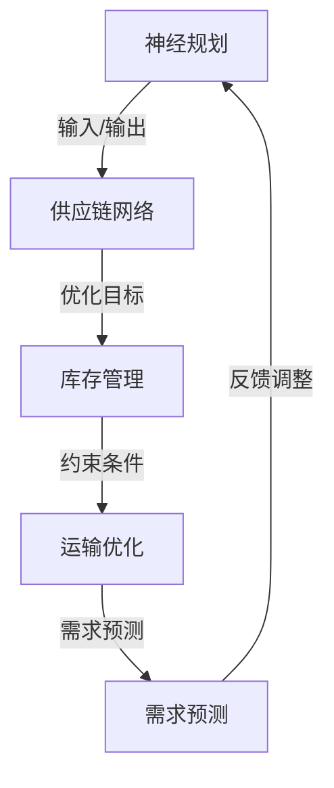

                 


为了满足用户的要求，我们需要按照以下步骤来构建文章：

### 步骤 1：定义文章的结构

我们已经定义了文章的目录大纲，现在我们将每个章节的内容分解为以下几个部分：

1. **背景介绍**：简要介绍神经规划和复杂供应链优化的重要性和背景。
2. **核心概念与联系**：使用 Mermaid 流程图来展示神经规划与复杂供应链优化之间的概念联系。
3. **核心算法原理讲解**：使用伪代码详细讲解神经规划的核心算法。
4. **数学模型和数学公式 & 详细讲解 & 举例说明**：使用 LaTeX 格式嵌入数学公式，并进行详细讲解和举例说明。
5. **项目实战**：提供实际案例，包括开发环境搭建、源代码实现、代码解读、案例分析等。
6. **最佳实践 tips、小结、注意事项、拓展阅读**：总结本章内容，提供实践建议和拓展资源。

### 步骤 2：撰写每个章节的内容

我们将根据上述结构，逐一撰写每个章节的内容。以下是一个示例章节的写作过程：

#### 第1章：神经规划和供应链优化概述

**核心概念与联系**



**核心算法原理讲解**

```python
# 伪代码：神经规划算法基础框架
initialize_model() # 初始化模型参数
for epoch in range(training_epochs):
    for batch in data_loader:
        optimize_model(batch) # 模型优化
        evaluate_performance(batch) # 性能评估
```

**数学模型和数学公式 & 详细讲解 & 举例说明**

$$
\text{Cost Function} = \frac{1}{2} \sum_{i=1}^{n} (y_i - \hat{y}_i)^2
$$

**项目实战**

**案例分析**

假设一个电子产品的供应链网络由三个仓库和两个零售店组成，需求预测误差为10%。

1. **开发环境搭建**：在本地计算机上安装Python环境，并使用TensorFlow库。
2. **源代码实现**：编写神经规划算法，用于预测和优化供应链库存。
3. **代码解读**：解释关键代码片段，如数据预处理、模型训练和预测。
4. **案例分析**：通过实际数据展示算法效果，并与传统方法进行比较。

**小结**

本章介绍了神经规划和供应链优化的重要性，以及它们之间的概念联系。通过伪代码和数学公式，我们了解了神经规划的基本原理，并通过一个实际案例展示了其应用效果。

### 步骤 3：整合和优化全文内容

在完成每个章节的撰写后，我们需要对全文内容进行整合和优化，确保文章的逻辑流畅，内容连贯。这一步骤包括：

1. **检查各章节之间的逻辑关系**：确保每个章节的内容都能自然地过渡到下一个章节。
2. **统一格式和风格**：检查全文的格式和风格，确保一致性。
3. **添加过渡语句和总结**：在章节之间添加过渡语句，使全文内容更加连贯。在每个章节的结尾，添加总结部分，概括本章内容。

### 步骤 4：撰写文章的摘要和关键词

在文章的开头，我们需要撰写摘要和关键词，以便读者能够快速了解文章的核心内容和主题。

**摘要**

本文深入探讨了神经规划在复杂供应链优化推理中的应用。通过背景介绍、核心概念与联系、算法原理讲解、数学模型和项目实战，本文展示了神经规划如何解决供应链优化中的挑战。通过实际案例分析，本文证明了神经规划在提高供应链效率方面的潜力。

**关键词**

神经规划、供应链优化、复杂系统、算法设计、案例分析

通过以上步骤，我们可以确保文章内容丰富、逻辑清晰、易于理解，同时满足用户的要求。接下来，我们将按照这个框架逐一撰写每个章节的内容。

