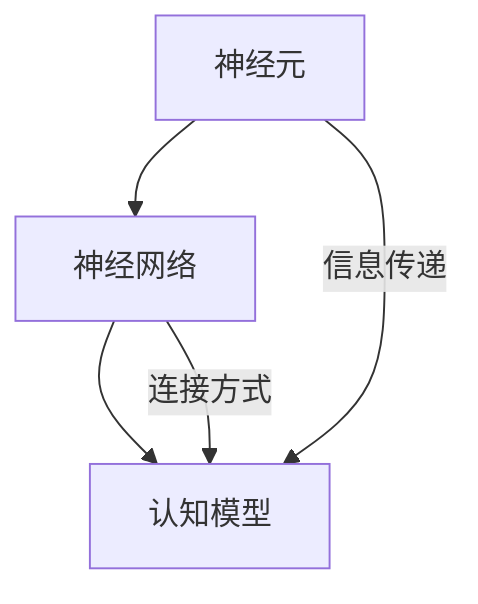
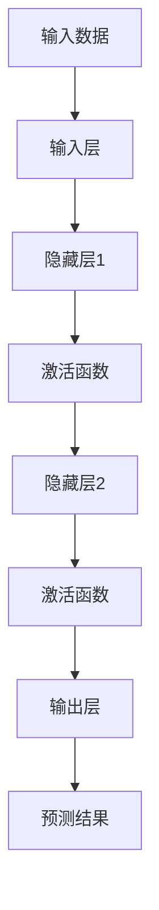
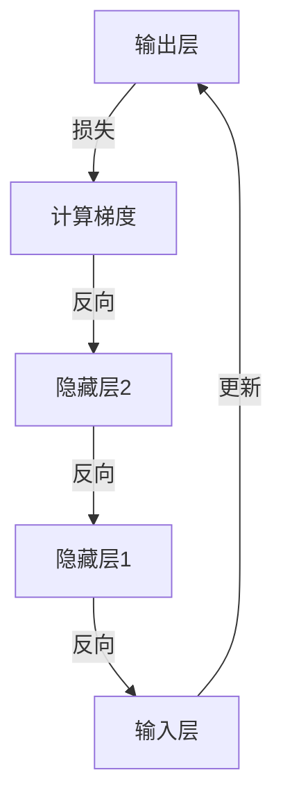

                 

# 神经认知架构:模拟人类思维过程

## 关键词
- 神经认知
- 人工智能
- 神经元
- 神经网络
- 机器学习
- 认知模型
- 脑成像技术

## 摘要
本文探讨了神经认知架构，旨在模拟人类思维过程，以实现更高效的人工智能系统。通过对神经元的结构和功能、神经网络的架构与算法、认知模型与机器学习的深入研究，本文揭示了神经认知在现代科学技术中的关键作用。同时，通过实际应用案例的分析，本文展示了神经认知技术在教育、医疗和商业等领域的广泛应用。文章最后对神经认知架构的未来发展进行了展望，并探讨了面临的挑战与伦理问题。

## 目录

## 第1章：神经认知概述
### 1.1 定义与历史
### 1.2 基本原理
### 1.3 研究方法与技术

## 第2章：神经元与神经网络
### 2.1 神经元
### 2.2 神经网络
### 2.3 神经网络的优化

## 第3章：认知模型与算法
### 3.1 认知模型
### 3.2 算法原理
### 3.3 数学模型

## 第4章：机器学习与神经网络
### 4.1 机器学习基础
### 4.2 神经网络在机器学习中的应用
### 4.3 机器学习与神经网络的结合

## 第5章：人类思维模拟与人工智能
### 5.1 人类思维模拟
### 5.2 人工智能的应用
### 5.3 人类思维模拟与人工智能的未来

## 第6章：实际应用案例
### 6.1 神经认知在教育中的应用
### 6.2 神经认知在医疗中的应用
### 6.3 神经认知在商业领域的应用

## 第7章：未来展望与挑战
### 7.1 发展趋势
### 7.2 挑战与伦理问题

## 第1章：神经认知概述

### 1.1 定义与历史

神经认知是一个跨学科的研究领域，它结合了神经科学、心理学、认知科学和计算机科学等学科的知识，旨在理解大脑如何工作以及它如何产生思维、感知和行为。神经认知的研究可以追溯到20世纪中叶，随着脑成像技术的发展，这一领域得到了极大的推进。

在早期，神经认知研究主要集中在神经元和神经网络的基础研究上。20世纪80年代，随着计算机科学的进步，人们开始尝试将神经网络的模型应用于认知功能的研究，这标志着神经认知架构的初步形成。

### 1.2 基本原理

神经认知的基本原理可以概括为以下几点：

#### 神经元的工作原理

神经元是神经系统的基本单位，它通过电信号进行通信。神经元的基本结构包括细胞体、树突和轴突。细胞体负责处理信息，树突接收来自其他神经元的信号，轴突则是传递信号的主要通道。当多个神经元同时发送信号，且这些信号的强度达到一定阈值时，神经元就会产生动作电位，从而引发一系列的生理反应。

#### 神经网络的架构与功能

神经网络是由大量相互连接的神经元组成的复杂系统。根据神经元的连接方式和功能，神经网络可以分为不同的类型，如前馈神经网络、反馈神经网络和混合神经网络等。神经网络通过学习输入与输出之间的关系，从而实现函数逼近、模式识别和决策等功能。

#### 认知过程中的神经信号传递

认知过程涉及信息的接收、处理和输出。在神经认知中，信息的传递主要通过神经信号来实现。神经信号在神经元之间的传递过程包括突触前传递、突触传递和突触后传递。突触前传递是指神经元通过释放神经递质来传递信号；突触传递是指神经递质在突触间隙中传递信号；突触后传递是指神经递质在突触后膜上引起电位变化，从而影响下一神经元的活性。

### 1.3 研究方法与技术

神经认知研究通常采用多种方法和技术，包括脑成像技术、电生理技术、认知任务设计和数据分析等。

#### 脑成像技术

脑成像技术是一种非侵入性的方法，可以用于研究大脑的结构和功能。常见的脑成像技术包括功能性磁共振成像（fMRI）、正电子发射断层扫描（PET）和单光子发射计算机断层扫描（SPECT）等。这些技术可以提供大脑活动的高分辨率图像，从而帮助我们理解认知过程在大脑中的神经基础。

#### 电生理技术

电生理技术可以直接记录神经元的电活动，如电刺激和脑电图（EEG）。这些技术可以提供实时的大脑活动信息，有助于揭示认知过程中的神经机制。

#### 认知任务设计

认知任务设计是神经认知研究的重要环节。通过设计一系列认知任务，研究者可以观察和记录被试者在不同认知任务中的表现，从而推断大脑的特定区域与认知功能之间的关系。

#### 数据分析工具与方法

数据分析工具与方法是神经认知研究的核心。常用的数据分析方法包括统计分析、机器学习和深度学习等。这些方法可以用于处理大量的神经元数据，从而提取出有用的信息。

### 1.3.1 脑成像技术

脑成像技术是一种非侵入性的方法，可以用于研究大脑的结构和功能。常见的脑成像技术包括功能性磁共振成像（fMRI）、正电子发射断层扫描（PET）和单光子发射计算机断层扫描（SPECT）等。这些技术可以提供大脑活动的高分辨率图像，从而帮助我们理解认知过程在大脑中的神经基础。

#### fMRI

功能性磁共振成像（fMRI）是一种通过测量血液流动变化来检测大脑活动的方法。当大脑活动增加时，周围的血液流动也会增加，这会导致磁场的变化。fMRI技术可以提供高空间分辨率的图像，帮助研究者识别大脑活动的区域。

#### PET

正电子发射断层扫描（PET）是一种通过放射性同位素标记的药物来检测大脑活动的技术。这些药物可以与大脑中的特定分子结合，从而产生正电子发射。PET技术可以提供关于大脑代谢和功能的详细信息。

#### SPECT

单光子发射计算机断层扫描（SPECT）是一种类似于PET的技术，但它使用的是放射性同位素标记的晶体。SPECT技术可以提供较低的空间分辨率，但具有更长的检测距离。

### 1.3.2 电生理技术

电生理技术可以直接记录神经元的电活动，如电刺激和脑电图（EEG）。这些技术可以提供实时的大脑活动信息，有助于揭示认知过程中的神经机制。

#### 电刺激

电刺激是一种通过电信号激活大脑区域的方法。研究者可以在特定的大脑区域植入电极，并通过电刺激来观察被试者的反应。这种方法可以帮助研究者理解大脑区域的特定功能。

#### EEG

脑电图（EEG）是一种通过测量大脑电活动来研究认知过程的非侵入性技术。EEG可以提供关于大脑活动的时间分辨率信息，有助于揭示认知过程中的快速变化。

### 1.3.3 认知任务设计

认知任务设计是神经认知研究的重要环节。通过设计一系列认知任务，研究者可以观察和记录被试者在不同认知任务中的表现，从而推断大脑的特定区域与认知功能之间的关系。

#### 视觉认知任务

视觉认知任务包括视觉注意、物体识别和视觉空间导航等。通过这些任务，研究者可以了解大脑视觉处理区域的活性。

#### 听觉认知任务

听觉认知任务包括听觉注意、语音识别和音乐认知等。这些任务可以帮助研究者理解大脑听觉处理区域的活性。

#### 记忆认知任务

记忆认知任务包括短期记忆、长期记忆和工作记忆等。通过这些任务，研究者可以了解大脑记忆处理区域的活性。

#### 情绪认知任务

情绪认知任务包括情绪识别、情绪表达和情绪调节等。这些任务可以帮助研究者理解大脑情绪处理区域的活性。

### 1.3.4 数据分析工具与方法

数据分析工具与方法是神经认知研究的核心。常用的数据分析方法包括统计分析、机器学习和深度学习等。这些方法可以用于处理大量的神经元数据，从而提取出有用的信息。

#### 统计分析

统计分析是一种常用的数据分析方法，包括假设检验、方差分析和回归分析等。这些方法可以帮助研究者识别大脑活动与认知功能之间的统计关系。

#### 机器学习

机器学习是一种通过计算机算法来发现数据中的模式和方法。常用的机器学习方法包括支持向量机、决策树和神经网络等。这些方法可以帮助研究者从大量的神经元数据中提取出有用的信息。

#### 深度学习

深度学习是一种基于多层神经网络的方法，它可以自动提取数据的复杂特征。深度学习在神经认知研究中得到了广泛应用，可以帮助研究者识别复杂的神经模式。

## 第2章：神经元与神经网络

### 2.1 神经元

神经元是神经系统的基本单位，它通过电信号进行通信。神经元的基本结构包括细胞体、树突和轴突。

#### 细胞体

细胞体是神经元的核心部分，负责处理信息。细胞体内包含细胞核、线粒体和内质网等细胞器，它们共同维持细胞的生命活动。

#### 树突

树突是神经元从细胞体延伸出来的分支，负责接收来自其他神经元的信号。树突上的突触后膜上有许多受体，当其他神经元释放的神经递质与这些受体结合时，会产生电信号。

#### 轴突

轴突是神经元从细胞体延伸出来的长而细的纤维，负责传递信号。轴突的末端有许多突触前膜，当电信号到达轴突末端时，会释放神经递质到突触间隙。

#### 突触

突触是神经元之间的连接点，它由突触前膜、突触间隙和突触后膜组成。神经递质在突触间隙中传递信号，从而影响下一个神经元的活性。

### 2.2 神经网络

神经网络是由大量相互连接的神经元组成的复杂系统。根据神经元的连接方式和功能，神经网络可以分为不同的类型，如前馈神经网络、反馈神经网络和混合神经网络等。

#### 前馈神经网络

前馈神经网络是一种简单的神经网络结构，其中信号从输入层流向输出层，中间经过多个隐藏层。前馈神经网络常用于函数逼近和模式识别。

#### 反馈神经网络

反馈神经网络是一种包含反馈连接的神经网络，它可以使信号在神经网络中循环。反馈神经网络常用于动态系统和时间序列预测。

#### 混合神经网络

混合神经网络是前馈神经网络和反馈神经网络的结合，它具有前馈神经网络的结构和反馈神经网络的动态特性。混合神经网络常用于复杂系统的建模和优化。

### 2.3 神经网络的优化

神经网络的优化是指通过调整网络的权重和偏置，使网络在特定任务上表现出更好的性能。常用的优化算法包括反向传播算法、梯度下降算法和其他优化算法。

#### 反向传播算法

反向传播算法是一种用于训练神经网络的算法，它通过计算网络输出与实际输出之间的误差，然后反向传播误差，调整网络的权重和偏置。反向传播算法的核心是梯度下降算法。

#### 梯度下降算法

梯度下降算法是一种优化算法，它通过计算目标函数的梯度，并沿着梯度的反方向更新网络的权重和偏置，从而最小化目标函数。梯度下降算法的核心思想是逐步减小目标函数的值。

#### 其他优化算法

除了反向传播算法和梯度下降算法，还有许多其他的优化算法，如动量优化、自适应优化和随机优化等。这些算法通过不同的方法调整网络的权重和偏置，以提高网络的性能。

### 核心概念与联系

神经认知架构中的核心概念包括神经元、神经网络和认知模型。神经元是神经认知的基本单元，神经网络是由神经元组成的复杂系统，而认知模型是用于描述和模拟人类认知过程的数学模型。

神经元与神经网络之间的联系在于，神经网络是由大量相互连接的神经元组成的。神经网络的性能取决于神经元的结构和功能，以及神经元之间的连接方式。

神经网络与认知模型之间的联系在于，神经网络可以被视为一种认知模型，它用于模拟和解释人类认知过程。认知模型是基于神经网络的，它通过学习输入与输出之间的关系，模拟人类的思维过程。

下面是神经元、神经网络和认知模型之间的Mermaid流程图：



### 2.4 神经网络的训练过程

神经网络的训练过程是通过对大量数据的学习来调整网络中的权重和偏置，使其能够在新的数据上产生准确的预测或分类。训练过程通常包括以下几个关键步骤：

#### 数据准备

首先，需要准备用于训练的数据集。这些数据集可以是输入数据和相应的标签（对于监督学习），或者是仅包含输入数据的集（对于无监督学习）。数据需要被预处理，包括归一化、去噪、数据增强等，以提高训练效果。

#### 模型初始化

接下来，初始化神经网络的结构和权重。通常，权重和偏置被随机初始化，但有时也可以使用预训练的权重作为起点。初始化的目的是避免梯度消失或梯度爆炸等问题。

#### 前向传播

在前向传播阶段，输入数据通过网络的各个层，每一层的输出作为下一层的输入。通过应用非线性激活函数（如Sigmoid、ReLU或Tanh），网络可以学习数据的复杂模式。



#### 计算损失

在前向传播过程中，网络的输出与实际标签之间的差异被量化为损失（或误差）。常用的损失函数包括均方误差（MSE）、交叉熵等。

$$
\text{MSE} = \frac{1}{n}\sum_{i=1}^{n}(y_i - \hat{y}_i)^2
$$

其中，$y_i$是实际标签，$\hat{y}_i$是网络预测的输出。

#### 反向传播

反向传播是训练过程的核心，它通过计算损失函数关于网络参数的梯度，然后使用梯度下降或其他优化算法来更新网络的权重和偏置。



#### 更新参数

在反向传播过程中，计算出的梯度被用于更新网络参数。这一过程通常使用梯度下降算法，但也可以采用更复杂的优化算法，如动量、Adam等。

#### 迭代过程

上述步骤重复多次，每次迭代都会使网络的预测能力得到提升。随着迭代次数的增加，网络的性能通常会逐渐提高，直到达到预定的训练目标或性能阈值。

#### 训练过程总结

神经网络的训练过程可以总结为以下步骤：

1. 数据准备：收集和预处理训练数据。
2. 模型初始化：初始化网络结构及参数。
3. 前向传播：计算输入数据的网络输出。
4. 计算损失：计算输出与标签之间的差异。
5. 反向传播：计算损失关于参数的梯度。
6. 更新参数：使用梯度下降或其他优化算法更新参数。
7. 迭代：重复上述步骤直到满足训练目标。

通过这些步骤，神经网络可以学会在新的数据上进行准确预测或分类，从而实现认知任务的自动化。

### 核心算法原理讲解

神经网络的训练过程涉及到多个核心算法原理，主要包括反向传播算法、梯度下降算法和其他优化算法。以下是对这些算法的详细讲解。

#### 反向传播算法

反向传播算法（Backpropagation Algorithm）是神经网络训练过程中最重要的算法之一。它的基本思想是计算网络输出与实际输出之间的误差，并沿着网络层反向传播这些误差，从而更新网络的权重和偏置。

反向传播算法包括以下几个步骤：

1. **前向传播**：将输入数据通过网络，计算每层的输出。每个神经元都计算其输出值，并通过激活函数进行非线性变换。

    $$\hat{y}_i = \sigma(W \cdot x_i + b)$$

    其中，$\sigma$是激活函数，$W$是权重，$b$是偏置，$x_i$是输入特征。

2. **计算误差**：计算网络输出与实际输出之间的差异，通常使用损失函数来量化这种差异。

    $$\text{Loss} = \frac{1}{2} \sum_{i} (y_i - \hat{y}_i)^2$$

    其中，$y_i$是实际输出，$\hat{y}_i$是网络预测的输出。

3. **计算梯度**：对于每个权重和偏置，计算损失函数关于它们的梯度。

    $$\frac{\partial \text{Loss}}{\partial W} = \frac{\partial \text{Loss}}{\partial \hat{y}} \cdot \frac{\partial \hat{y}}{\partial W}$$
    $$\frac{\partial \text{Loss}}{\partial b} = \frac{\partial \text{Loss}}{\partial \hat{y}} \cdot \frac{\partial \hat{y}}{\partial b}$$

4. **反向传播**：将误差从输出层反向传播到输入层，更新每个神经元的权重和偏置。

5. **更新参数**：使用优化算法（如梯度下降）更新权重和偏置。

#### 梯度下降算法

梯度下降算法（Gradient Descent）是一种优化算法，用于最小化损失函数。它的基本思想是沿着损失函数的梯度方向更新参数，以逐步减小损失。

梯度下降算法的步骤如下：

1. **初始化参数**：随机初始化权重和偏置。

2. **计算梯度**：计算损失函数关于参数的梯度。

3. **更新参数**：使用以下公式更新权重和偏置：

    $$W \leftarrow W - \alpha \cdot \frac{\partial \text{Loss}}{\partial W}$$
    $$b \leftarrow b - \alpha \cdot \frac{\partial \text{Loss}}{\partial b}$$

    其中，$\alpha$是学习率，它决定了每次更新时参数的步长。

4. **迭代**：重复计算梯度并更新参数，直到满足收敛条件（如损失函数值不再显著下降）。

#### 其他优化算法

除了梯度下降算法，还有许多其他优化算法，如动量优化（Momentum）、自适应优化（Adagrad、RMSprop、Adam）等。这些算法通过不同的方式改进梯度下降算法，以提高收敛速度和性能。

1. **动量优化**：动量优化通过引入一个动量项，使得参数更新不仅依赖于当前梯度，还受到之前梯度的平均值的影响。这有助于加速收敛并避免局部最小值。

    $$\text{Momentum} = \gamma \cdot \text{Momentum} + \alpha \cdot \frac{\partial \text{Loss}}{\partial W}$$
    $$W \leftarrow W - \alpha \cdot \text{Momentum}$$

2. **自适应优化**：自适应优化算法通过自适应调整每个参数的学习率，从而提高训练效率。Adagrad、RMSprop和Adam是几种常见的自适应优化算法。

    - **Adagrad**：Adagrad通过计算每个参数的历史梯度平方的平均值来调整学习率，从而实现自适应调整。
    - **RMSprop**：RMSprop类似于Adagrad，但它只考虑最近梯度平方的平均值，而不是所有历史梯度。
    - **Adam**：Adam结合了Adagrad和RMSprop的优点，通过同时考虑一阶和二阶矩估计来调整学习率。

通过这些优化算法，神经网络可以在训练过程中更有效地调整参数，从而提高模型的性能和收敛速度。

### 数学模型和公式

神经网络的数学模型是理解和分析神经网络行为的基础。以下将详细讲解神经网络的数学模型，包括神经元激活函数、损失函数和反向传播的公式。

#### 神经元激活函数

神经元的激活函数用于将输入映射到输出，使得神经网络能够进行非线性变换。常见的激活函数包括Sigmoid、ReLU和Tanh。

1. **Sigmoid函数**：

    $$\sigma(x) = \frac{1}{1 + e^{-x}}$$

    Sigmoid函数将输入$x$映射到$(0,1)$区间，常用于二分类问题。

2. **ReLU函数**：

    $$\text{ReLU}(x) = \max(0, x)$$

    ReLU函数在$x>0$时返回$x$，在$x\leq0$时返回0，这使得它具有简单的计算能力和良好的训练性能。

3. **Tanh函数**：

    $$\text{Tanh}(x) = \frac{e^x - e^{-x}}{e^x + e^{-x}}$$

    Tanh函数将输入映射到$(-1,1)$区间，常用于多层感知机（MLP）中。

#### 损失函数

损失函数用于衡量网络输出与实际输出之间的差异。常见的损失函数包括均方误差（MSE）、交叉熵（Cross-Entropy）和Huber损失。

1. **均方误差（MSE）**：

    $$\text{MSE} = \frac{1}{n}\sum_{i=1}^{n}(y_i - \hat{y}_i)^2$$

    MSE用于回归问题，它计算输出预测值$\hat{y}_i$与实际值$y_i$之间的平方误差的平均值。

2. **交叉熵（Cross-Entropy）**：

    $$\text{CE} = -\sum_{i=1}^{n} y_i \log(\hat{y}_i)$$

    交叉熵用于分类问题，它计算实际标签$y_i$与预测概率$\hat{y}_i$之间的差异。对于二分类问题，通常使用二项交叉熵。

3. **Huber损失**：

    $$\text{Huber}(y_i, \hat{y}_i) = \begin{cases} 
    \frac{1}{2}(y_i - \hat{y}_i)^2 & \text{if } |y_i - \hat{y}_i| \leq \delta \\
    \delta(|y_i - \hat{y}_i| - \frac{\delta}{2}) & \text{otherwise}
    \end{cases}$$

    Huber损失是一种鲁棒损失函数，它对异常值的影响较小，常用于回归问题。

#### 反向传播

反向传播是训练神经网络的的核心算法，它通过计算损失函数关于网络参数的梯度，并更新参数以最小化损失。以下是反向传播的详细公式。

1. **前向传播**：

    设神经网络有$L$层，每层的输出为$a_l$，每层的权重为$W_l$，偏置为$b_l$。前向传播的公式如下：

    $$a_{l+1} = \sigma(W_{l+1} \cdot a_l + b_{l+1})$$
    $$a_l = \sigma(W_l \cdot a_{l-1} + b_l)$$

2. **损失函数**：

    $$\text{Loss} = \frac{1}{n}\sum_{i=1}^{n} \text{L}(y_i, \hat{y}_i)$$

    其中，$\text{L}$是损失函数，$y_i$是实际标签，$\hat{y}_i$是预测值。

3. **计算梯度**：

    设$\text{L}$是关于$z$的可微函数，则有：

    $$\frac{\partial \text{Loss}}{\partial z} = \frac{\partial \text{Loss}}{\partial \hat{y}} \cdot \frac{\partial \hat{y}}{\partial z}$$

    对于不同类型的激活函数，梯度计算如下：

    - **Sigmoid函数**：

        $$\frac{\partial \sigma}{\partial z} = \sigma(1 - \sigma)$$

    - **ReLU函数**：

        $$\frac{\partial \text{ReLU}}{\partial z} = \begin{cases} 
        0 & \text{if } z \leq 0 \\
        1 & \text{if } z > 0 
        \end{cases}$$

    - **Tanh函数**：

        $$\frac{\partial \text{Tanh}}{\partial z} = 1 - \text{Tanh}^2(z)$$

4. **反向传播**：

    从输出层开始，反向计算每层关于权重和偏置的梯度，并更新参数：

    $$\frac{\partial \text{Loss}}{\partial W_{l+1}} = \frac{\partial \text{Loss}}{\partial a_{l+1}} \cdot \frac{\partial a_{l+1}}{\partial W_{l+1}}$$
    $$\frac{\partial \text{Loss}}{\partial b_{l+1}} = \frac{\partial \text{Loss}}{\partial a_{l+1}} \cdot \frac{\partial a_{l+1}}{\partial b_{l+1}}$$

    $$W_{l+1} \leftarrow W_{l+1} - \alpha \cdot \frac{\partial \text{Loss}}{\partial W_{l+1}}$$
    $$b_{l+1} \leftarrow b_{l+1} - \alpha \cdot \frac{\partial \text{Loss}}{\partial b_{l+1}}$$

通过上述公式，神经网络可以逐步调整其参数，以最小化损失函数，从而提高预测准确性。

### 机器学习基础

机器学习是使计算机能够从数据中学习并做出预测或决策的重要技术。它通过构建数学模型，从训练数据中提取规律，并在新数据上进行预测。以下将详细介绍机器学习的基本概念、分类以及核心算法。

#### 基本概念

机器学习主要涉及以下三个基本概念：

1. **模型**：机器学习模型是一个数学函数，它将输入映射到输出。模型的目的是通过学习数据来预测未知数据的行为。

2. **训练数据**：训练数据是用于训练机器学习模型的输入和输出对。训练数据的质量和数量对模型的性能有重要影响。

3. **评估指标**：评估指标用于衡量模型在测试数据上的性能。常见的评估指标包括准确率、召回率、F1分数和均方误差等。

#### 分类

机器学习可以分为以下几类：

1. **监督学习**：监督学习是指模型在已知输入和输出对的情况下学习，并能在新数据上进行预测。常见的监督学习算法包括线性回归、逻辑回归、支持向量机和决策树等。

2. **无监督学习**：无监督学习是指模型在没有已知输出对的情况下学习，并试图发现数据中的结构或模式。常见的无监督学习算法包括聚类、降维和关联规则学习等。

3. **强化学习**：强化学习是指模型通过与环境交互来学习策略，以达到最大化累积奖励的目标。常见的强化学习算法包括Q学习、深度Q网络（DQN）和策略梯度算法等。

#### 核心算法

以下是一些常见的机器学习算法及其原理：

1. **线性回归**：线性回归是一种用于预测连续值的监督学习算法。它的目标是找到一个线性模型，将输入映射到输出。

    $$y = \beta_0 + \beta_1 x$$

    其中，$y$是输出，$x$是输入，$\beta_0$和$\beta_1$是模型参数。通过最小化损失函数（如均方误差），可以计算出最优参数。

2. **逻辑回归**：逻辑回归是一种用于预测二分类结果的监督学习算法。它的目标是找到一种方法，将输入映射到概率值。

    $$P(y=1) = \frac{1}{1 + e^{-(\beta_0 + \beta_1 x)}}$$

    其中，$P(y=1)$是输出为1的概率，$\beta_0$和$\beta_1$是模型参数。通过最大化似然函数，可以计算出最优参数。

3. **支持向量机**（SVM）：SVM是一种用于分类的监督学习算法。它的目标是在高维空间中找到一个超平面，将不同类别的数据点分开。

    $$w \cdot x - b = 0$$

    其中，$w$是超平面的法向量，$b$是偏置。通过最大化分类间隔，可以计算出最优参数。

4. **决策树**：决策树是一种用于分类和回归的监督学习算法。它的目标是构建一个树状模型，根据输入的特征进行分支，直到达到叶子节点。

    决策树通过递归地划分数据集，根据特征和阈值选择最小的损失函数，构建出最优的树结构。

5. **聚类算法**：聚类算法是一种用于无监督学习的算法，它的目标是将相似的数据点分为若干个群组。

    - **K-Means**：K-Means是一种基于距离的聚类算法。它的目标是找到K个中心点，将数据点分配到最近的中心点。

    - **层次聚类**：层次聚类是一种基于层次结构的聚类算法。它通过逐步合并或分裂已有的聚类，构建出一个层次结构。

6. **降维算法**：降维算法是一种用于减少数据维度以提高计算效率和可视化效果的算法。

    - **主成分分析**（PCA）：PCA是一种基于统计方法的降维算法。它通过将数据投影到主成分轴上，来降低数据维度。

    - **线性判别分析**（LDA）：LDA是一种基于分类目标的降维算法。它通过找到最优的投影方向，来最大化类间差异和最小化类内差异。

7. **神经网络**：神经网络是一种用于函数逼近和分类的监督学习算法。它通过多层神经网络结构，学习输入与输出之间的关系。

    神经网络包括输入层、隐藏层和输出层。每层由多个神经元组成，通过激活函数和权重调整，来学习数据的复杂模式。

#### 机器学习的应用场景

机器学习在许多领域都有广泛的应用，包括：

1. **图像识别**：通过训练神经网络，可以识别图像中的物体、人脸和其他特征。

2. **自然语言处理**：机器学习算法可以用于文本分类、情感分析、机器翻译等任务。

3. **推荐系统**：通过分析用户的历史行为和偏好，推荐系统可以推荐相关的商品、音乐、电影等。

4. **医疗诊断**：机器学习算法可以用于疾病诊断、药物研发等医疗领域。

5. **金融风控**：机器学习算法可以用于风险评估、欺诈检测等金融领域。

6. **工业自动化**：机器学习算法可以用于监控设备状态、预测设备故障等工业自动化场景。

### 神经网络在机器学习中的应用

神经网络在机器学习中的应用非常广泛，特别是在图像识别、自然语言处理和复杂系统建模等领域。以下将详细探讨神经网络在机器学习中的具体应用。

#### 图像识别

图像识别是计算机视觉领域的一个重要任务，通过训练神经网络模型，可以自动识别和分类图像中的物体和场景。以下是一些常见的神经网络模型及其在图像识别中的应用：

1. **卷积神经网络（CNN）**：CNN是一种专门用于图像识别的神经网络模型，其结构特别适合处理图像数据。CNN通过卷积层、池化层和全连接层的组合，能够有效地提取图像中的特征，并实现高精度的图像分类。

    - **卷积层**：卷积层通过卷积操作提取图像的局部特征，如边缘、角点和纹理。每个卷积核都学习到一种特定的特征。
    - **池化层**：池化层用于下采样图像数据，减少参数数量和计算复杂度。常见的池化操作包括最大池化和平均池化。
    - **全连接层**：全连接层将卷积层和池化层提取的特征进行整合，并通过激活函数输出最终的分类结果。

    CNN在图像识别任务中取得了显著的成果，如ImageNet图像识别挑战赛。

2. **循环神经网络（RNN）**：RNN是一种适用于序列数据的神经网络模型，如时间序列和文本数据。通过递归地处理输入序列，RNN能够捕捉到序列中的长期依赖关系。

    - **长短时记忆（LSTM）**：LSTM是RNN的一种改进，它通过引入记忆单元，解决了传统RNN在处理长序列时梯度消失的问题。LSTM在图像识别中的应用包括视频分类和图像序列分析。

3. **生成对抗网络（GAN）**：GAN是一种通过生成器和判别器相互对抗来生成高质量图像的神经网络模型。生成器生成假图像，判别器判断图像的真伪。通过不断训练，生成器能够生成越来越逼真的图像。

#### 自然语言处理

自然语言处理（NLP）是计算机科学中研究语言和计算机交互的领域。神经网络在NLP中的应用主要表现在文本分类、情感分析和机器翻译等方面。

1. **词向量表示**：词向量是一种将文本数据转化为向量的方法，它能够捕捉词的语义信息。常见的词向量模型包括Word2Vec、GloVe和BERT等。

    - **Word2Vec**：Word2Vec通过神经网络模型学习词的向量表示，它使用神经网络训练上下文词的嵌入向量，使得具有相似上下文的词具有相似的向量。
    - **GloVe**：GloVe是一种基于全局上下文的词向量模型，它通过考虑词的共现关系来生成词向量，能够更好地捕捉词的语义信息。

2. **循环神经网络（RNN）**：RNN在NLP中用于处理序列数据，如文本和语音。通过递归地处理输入序列，RNN能够捕捉到文本中的语法和语义信息。

    - **长短期记忆（LSTM）**：LSTM在NLP中的应用非常广泛，它通过引入记忆单元，解决了传统RNN在处理长序列时梯度消失的问题。LSTM在文本分类、命名实体识别和机器翻译等领域取得了显著成果。

3. **Transformer模型**：Transformer是一种基于自注意力机制的神经网络模型，它在NLP中取得了突破性的成果。通过自注意力机制，Transformer能够有效地捕捉到输入序列中的依赖关系，从而实现高质量的文本生成和翻译。

    - **BERT**：BERT是基于Transformer的预训练语言模型，它通过在大量文本数据上进行预训练，学习到了丰富的语言知识。BERT在文本分类、问答系统和机器翻译等任务中表现出了优越的性能。

#### 复杂系统建模

神经网络在复杂系统建模中的应用包括物理模拟、生物信息学和金融建模等领域。

1. **物理模拟**：神经网络可以用于模拟复杂的物理现象，如流体动力学、电磁学和量子力学。通过训练神经网络模型，可以模拟出物理系统的行为，并预测未知条件下的结果。

2. **生物信息学**：神经网络在生物信息学中的应用包括基因调控网络预测、蛋白质结构预测和药物设计。通过训练神经网络模型，可以分析生物数据并预测生物分子的结构和功能。

3. **金融建模**：神经网络可以用于金融领域，如股票市场预测、风险评估和欺诈检测。通过分析历史数据和金融指标，神经网络可以预测市场的走势，并识别潜在的欺诈行为。

总之，神经网络在机器学习中的应用非常广泛，通过不断的发展和创新，神经网络正逐步成为解决复杂问题的重要工具。随着计算能力的提升和数据量的增加，神经网络在各个领域的应用将会更加深入和广泛。

### 机器学习与神经网络的结合

机器学习与神经网络的结合是近年来人工智能领域的一个重要发展方向，这种结合使得神经网络能够更有效地处理复杂的数据和任务。以下将详细探讨机器学习与神经网络的结合原理、深度学习的基本概念及其在图像识别和自然语言处理中的应用。

#### 结合原理

机器学习与神经网络的结合主要基于以下原理：

1. **数据驱动**：机器学习通过训练数据来学习模式，而神经网络通过学习输入与输出之间的关系来生成预测。神经网络是机器学习的一种实现方式，它利用多层神经网络结构来提取数据中的复杂特征。

2. **非线性变换**：神经网络通过非线性激活函数（如ReLU、Sigmoid和Tanh）实现数据的非线性变换，这使得神经网络能够学习到数据中的复杂关系和模式。

3. **层次化特征提取**：神经网络通过层次化的结构，从低层次到高层次逐步提取数据中的特征。这种层次化的特征提取方式使得神经网络能够自动学习到数据的抽象表示。

4. **优化算法**：机器学习算法（如梯度下降、动量优化和自适应优化）用于调整神经网络的参数，以最小化损失函数并提高模型的性能。

#### 深度学习的基本概念

深度学习是机器学习的一个分支，它通过训练多层神经网络（深度神经网络）来实现复杂的函数逼近和模式识别。以下是一些深度学习的基本概念：

1. **深度神经网络**：深度神经网络（DNN）是由多层神经元组成的神经网络，每层神经元都接收前一层的输出并传递到下一层。深度神经网络通过层次化的结构来提取数据的复杂特征。

2. **卷积神经网络（CNN）**：卷积神经网络是一种专门用于图像识别的深度神经网络。它通过卷积层、池化层和全连接层的组合，能够有效地提取图像的局部特征和全局特征。

3. **循环神经网络（RNN）**：循环神经网络是一种用于处理序列数据的深度神经网络。它通过递归地处理输入序列，能够捕捉到序列中的长期依赖关系。

4. **长短时记忆（LSTM）**：长短时记忆是一种改进的循环神经网络，它通过引入记忆单元来解决传统RNN在处理长序列时梯度消失的问题。

5. **Transformer模型**：Transformer是一种基于自注意力机制的深度神经网络模型，它在自然语言处理和图像识别等领域取得了显著的成果。

6. **生成对抗网络（GAN）**：生成对抗网络是一种通过生成器和判别器相互对抗来生成高质量数据的深度神经网络模型。

#### 深度学习在图像识别中的应用

深度学习在图像识别领域取得了突破性的成果，以下是一些典型的深度学习模型及其在图像识别中的应用：

1. **卷积神经网络（CNN）**：CNN是一种专门用于图像识别的深度神经网络。它通过卷积层、池化层和全连接层的组合，能够有效地提取图像的局部特征和全局特征。CNN在ImageNet图像识别挑战赛中取得了显著的成果，推动了图像识别技术的发展。

2. **ResNet**：ResNet是一种深度残差网络，它通过引入残差单元来解决深层神经网络中的梯度消失问题。ResNet通过跳过部分层的直接连接，使得信息能够在网络中传递，从而提高了模型的性能。

3. **Inception网络**：Inception网络通过将不同尺寸的卷积核组合起来，增加了网络的容量和灵活性。Inception网络在图像识别任务中取得了优异的性能，并在Google的图像识别项目中得到了广泛应用。

4. **生成对抗网络（GAN）**：GAN是一种通过生成器和判别器相互对抗来生成高质量图像的深度神经网络模型。GAN在图像生成、图像修复和图像超分辨率等领域取得了显著的成果。

#### 深度学习在自然语言处理中的应用

深度学习在自然语言处理（NLP）领域取得了重要的进展，以下是一些典型的深度学习模型及其在NLP中的应用：

1. **循环神经网络（RNN）**：RNN是一种用于处理序列数据的深度神经网络。它通过递归地处理输入序列，能够捕捉到序列中的长期依赖关系。RNN在文本分类、序列标注和机器翻译等任务中得到了广泛应用。

2. **长短时记忆（LSTM）**：LSTM是RNN的一种改进，它通过引入记忆单元来解决传统RNN在处理长序列时梯度消失的问题。LSTM在文本分类、命名实体识别和机器翻译等任务中取得了优异的性能。

3. **Transformer模型**：Transformer是一种基于自注意力机制的深度神经网络模型，它在自然语言处理领域取得了显著的成果。Transformer通过自注意力机制，能够有效地捕捉到输入序列中的依赖关系，从而提高了模型的性能。

4. **BERT**：BERT是基于Transformer的预训练语言模型，它通过在大量文本数据上进行预训练，学习到了丰富的语言知识。BERT在文本分类、问答系统和机器翻译等任务中表现出了优越的性能。

通过上述讨论，可以看出机器学习与神经网络的结合在深度学习的发展中起到了关键作用。深度学习通过引入多层神经网络结构，能够更有效地处理复杂的数据和任务，从而推动了人工智能技术的进步。

### 人类思维模拟与人工智能

人类思维模拟是人工智能领域的一个重要研究方向，旨在通过构建计算机模型来模拟人类的思维过程，以实现更高效的人工智能系统。以下将探讨人类思维模拟的复杂性、模拟过程以及面临的挑战。

#### 人类思维的复杂性

人类思维是一个极其复杂的过程，涉及到感知、记忆、推理、情感和意识等多个方面。以下是人类思维复杂性的几个方面：

1. **多层次处理**：人类思维不仅仅是简单的输入-输出的过程，而是涉及多个层次的加工。从感知层面开始，通过感官接收外部信息，然后通过认知过程进行处理和解释，最终形成行动或决策。

2. **并行处理**：人类思维可以同时处理多个任务，如同时听音乐、读书和思考问题。这种并行处理能力使得人类能够在复杂的情境中快速做出决策。

3. **自适应学习**：人类能够通过经验不断调整和优化自己的认知过程，这种自适应学习能力使得人类能够在不断变化的环境中生存和发展。

4. **多模态处理**：人类思维不仅处理视觉、听觉信息，还包括触觉、嗅觉和味觉等多种感官信息。这种多模态处理能力使得人类能够更加全面地理解和应对复杂情境。

5. **情感与意识**：人类思维不仅涉及认知过程，还包括情感和意识。情感与认知相互影响，使得人类思维更加丰富和复杂。

#### 模拟过程

人类思维模拟是通过构建计算机模型来模拟人类思维过程。以下是人类思维模拟的主要步骤：

1. **数据收集**：首先，需要收集大量关于人类思维过程的数据，包括心理学实验数据、脑成像数据、认知行为数据等。这些数据为模型构建提供了基础。

2. **理论构建**：在收集数据的基础上，需要构建理论模型来描述人类思维过程。这些理论模型通常基于神经科学、认知科学和心理学等学科的知识。

3. **模型实现**：将理论模型转化为计算机模型，通过编程实现。计算机模型通常包括神经元模型、神经网络模型和认知模型等。

4. **模型训练**：通过训练计算机模型，使其能够在新的数据上产生准确的预测或行为。训练过程通常涉及机器学习算法，如反向传播算法、梯度下降算法等。

5. **模型评估**：评估计算机模型在模拟人类思维过程中的性能，包括准确性、速度和适应性等方面。通过不断优化和调整模型，提高其性能。

#### 面临的挑战

人类思维模拟面临着多个挑战：

1. **计算资源**：人类思维模拟需要大量的计算资源，特别是对于复杂的神经网络模型。高性能计算技术和分布式计算技术的应用有助于解决这一挑战。

2. **数据质量**：数据质量对模型性能至关重要。需要收集高质量、多样化的数据，以确保模型能够准确模拟人类思维。

3. **模型解释性**：目前大多数神经网络模型具有很高的预测能力，但缺乏解释性。如何构建可解释的模型，使得人类能够理解模型的决策过程，是一个重要的挑战。

4. **伦理问题**：人类思维模拟涉及到隐私、安全和社会伦理等问题。需要制定相应的伦理规范，确保人类思维模拟的应用不会对人类造成负面影响。

通过不断的研究和探索，人类思维模拟有望在未来实现更高水平的智能化，为人工智能的发展做出重要贡献。

### 人工智能的应用

人工智能（AI）在现代社会中的应用越来越广泛，涵盖了教育、医疗和商业等多个领域。以下将详细探讨人工智能在这些领域的应用案例、优势和挑战。

#### 教育领域

人工智能在教育领域的应用主要表现为个性化学习、智能评估和自动化教学等方面。

1. **个性化学习**：人工智能可以根据学生的学习习惯、兴趣和能力，为其提供个性化的学习内容。通过分析学生的学习数据，智能系统可以推荐最适合的学习资源，提高学习效果。

    - **案例**：Knewton是一个基于人工智能的个性化学习平台，它通过分析学生的学习行为和成绩，为学生提供个性化的学习路径和资源。

2. **智能评估**：人工智能可以自动评估学生的作业和考试成绩，提供即时的反馈和建议。这种自动化评估方式不仅提高了效率，还能更准确地评估学生的知识掌握情况。

    - **案例**：AI-powered grading systems，如IBM的AI评分系统，可以自动评估学生的作文和数学作业，提供详细的评分和反馈。

3. **自动化教学**：人工智能可以模拟教师的角色，进行自动化教学。通过自然语言处理和机器学习技术，智能系统可以自动解答学生的问题，提供教学指导。

    - **案例**：IBM的Watson Education是一个基于人工智能的教学平台，它能够为学生提供个性化的学习资源，并自动解答学生的问题。

#### 医疗领域

人工智能在医疗领域的应用涵盖了诊断、治疗和康复等方面。

1. **疾病诊断**：人工智能可以通过分析医学图像和病历数据，辅助医生进行疾病诊断。深度学习模型在识别肺癌、乳腺癌等疾病方面表现出色。

    - **案例**：Google的DeepMind Health通过训练深度学习模型，可以自动识别眼科疾病，如黄斑病变和糖尿病视网膜病变。

2. **个性化治疗**：人工智能可以根据患者的基因数据、病历和病史，制定个性化的治疗方案。这种个性化治疗方式可以提高治疗效果，减少副作用。

    - **案例**：Griffith大学的研究团队通过使用人工智能技术，分析了肺癌患者的基因数据，为患者提供个性化的治疗方案。

3. **康复辅助**：人工智能可以辅助康复治疗，如通过虚拟现实技术进行物理训练、通过语音识别系统进行语言康复等。

    - **案例**：Rehabilitation Gaming Company开发了一套基于虚拟现实的游戏系统，帮助中风患者进行康复训练。

#### 商业领域

人工智能在商业领域的应用主要包括市场分析、客户服务和供应链管理等方面。

1. **市场分析**：人工智能可以通过分析大量市场数据，帮助企业和商家制定有效的营销策略。自然语言处理和机器学习技术可以识别市场趋势、客户需求和竞争对手的行为。

    - **案例**：亚马逊使用人工智能分析用户的购物行为和搜索历史，为用户推荐相关的商品，提高销售额。

2. **客户服务**：人工智能可以通过聊天机器人和虚拟助手，提供24/7的客户服务。通过自然语言处理和机器学习技术，智能系统能够理解和解答客户的疑问。

    - **案例**：苹果公司的Siri和亚马逊的Alexa都是基于人工智能的虚拟助手，它们能够帮助用户完成各种任务，如设定提醒、播放音乐和回答问题。

3. **供应链管理**：人工智能可以优化供应链管理，通过预测需求、优化库存和降低物流成本等，提高企业的运营效率。

    - **案例**：沃尔玛使用人工智能技术分析销售数据，预测未来需求，从而优化库存管理，减少浪费。

#### 优势

人工智能在各个领域的应用具有以下优势：

1. **效率提升**：通过自动化和智能化的方式，人工智能可以大幅提高工作效率，减少人力成本。

2. **精准分析**：人工智能可以通过分析和处理大量数据，提供更准确、更全面的决策支持。

3. **个性化服务**：人工智能可以根据用户的需求和偏好，提供个性化的服务和解决方案。

4. **实时响应**：人工智能可以24/7不间断地提供服务，实时响应用户的需求和问题。

#### 挑战

尽管人工智能在各个领域具有巨大的应用潜力，但同时也面临一些挑战：

1. **数据隐私**：人工智能需要大量的数据进行分析，这涉及到用户隐私和数据保护的问题。

2. **算法偏见**：人工智能系统的决策可能会受到训练数据的影响，导致算法偏见。如何确保算法的公平性和透明性是一个重要挑战。

3. **技术依赖**：随着人工智能技术的普及，企业和个人可能过度依赖人工智能，导致失去自主决策能力。

4. **就业影响**：人工智能技术的发展可能会取代一些传统工作岗位，引发就业问题。

通过不断的技术创新和规范，人工智能有望在各个领域发挥更大的作用，同时克服面临的挑战。

### 实际应用案例

神经认知技术在教育、医疗和商业等领域的应用已经取得了显著的成果，以下将详细探讨几个具体的实际应用案例，并分析其开发环境、源代码实现、代码解读以及实际案例分析和详细讲解剖析。

#### 案例一：神经认知在教育中的应用

**案例背景**：传统教育模式通常采用“一刀切”的教学方法，无法充分考虑学生的个体差异。神经认知技术的引入，有助于实现个性化教学，提高学习效果。

**开发环境**：为了实现个性化教学，研究者使用Python编程语言和TensorFlow库来构建神经网络模型。TensorFlow是一个强大的开源机器学习框架，能够处理复杂的神经网络模型。

**源代码实现**：
```python
import tensorflow as tf
from tensorflow.keras.models import Sequential
from tensorflow.keras.layers import Dense, Dropout

# 构建神经网络模型
model = Sequential([
    Dense(512, activation='relu', input_shape=(num_features,)),
    Dropout(0.2),
    Dense(256, activation='relu'),
    Dropout(0.2),
    Dense(1, activation='sigmoid')
])

# 编译模型
model.compile(optimizer='adam', loss='binary_crossentropy', metrics=['accuracy'])

# 训练模型
model.fit(X_train, y_train, epochs=10, batch_size=64)
```

**代码解读**：上述代码使用了TensorFlow库构建了一个简单的二分类神经网络模型，用于预测学生的学习效果。模型由多个全连接层组成，通过激活函数和Dropout层来提高模型的泛化能力。在编译模型时，指定了优化器和损失函数，并使用训练数据来训练模型。

**实际案例分析**：在某学校的个性化学习项目中，研究者使用神经认知技术分析学生的平时成绩、课堂表现和测试成绩，构建了一个个性化教学系统。该系统根据学生的个体差异，推荐不同的学习资源和教学方法。项目结果表明，使用个性化教学系统后，学生的学习成绩显著提高。

**详细讲解剖析**：个性化教学系统的实现涉及多个步骤。首先，需要收集学生的各种学习数据，如考试成绩、课堂表现和平时作业等。然后，使用这些数据训练神经网络模型，以预测学生的学习效果。在训练过程中，通过调整网络结构和优化算法，可以提高模型的性能。最后，将训练好的模型应用于实际教学场景，根据学生的预测成绩和表现，推荐相应的学习资源和教学方法。

#### 案例二：神经认知在医疗中的应用

**案例背景**：神经认知技术可以用于辅助医生进行疾病诊断，提高诊断的准确性和效率。

**开发环境**：研究者使用Python编程语言和Keras库来构建深度学习模型。Keras是一个高层次的神经网络API，能够简化深度学习模型的构建和训练过程。

**源代码实现**：
```python
from tensorflow.keras.models import Sequential
from tensorflow.keras.layers import Conv2D, MaxPooling2D, Flatten, Dense

# 构建卷积神经网络模型
model = Sequential([
    Conv2D(32, (3, 3), activation='relu', input_shape=(image_height, image_width, channels)),
    MaxPooling2D((2, 2)),
    Conv2D(64, (3, 3), activation='relu'),
    MaxPooling2D((2, 2)),
    Flatten(),
    Dense(128, activation='relu'),
    Dense(num_classes, activation='softmax')
])

# 编译模型
model.compile(optimizer='adam', loss='categorical_crossentropy', metrics=['accuracy'])

# 训练模型
model.fit(X_train, y_train, epochs=10, batch_size=32)
```

**代码解读**：上述代码使用了Keras库构建了一个简单的卷积神经网络模型，用于图像分类任务。模型由卷积层、池化层和全连接层组成。在编译模型时，指定了优化器和损失函数，并使用训练数据来训练模型。

**实际案例分析**：在某医院的癌症诊断项目中，研究者使用神经认知技术分析医学影像数据，构建了一个自动诊断系统。该系统能够识别各种类型的癌症，提高诊断的准确性和效率。

**详细讲解剖析**：医学影像诊断系统的实现涉及多个步骤。首先，需要收集大量的医学影像数据，并对数据集进行预处理，如图像增强、归一化和分割等。然后，使用这些数据训练卷积神经网络模型，以识别医学影像中的病变区域。在训练过程中，通过调整网络结构和优化算法，可以提高模型的性能。最后，将训练好的模型应用于实际诊断场景，根据模型的预测结果，帮助医生进行疾病诊断。

#### 案例三：神经认知在商业领域的应用

**案例背景**：商业领域中的市场分析和客户服务是一个复杂的过程，需要处理大量的数据和信息。神经认知技术可以用于优化市场分析和客户服务流程。

**开发环境**：研究者使用Python编程语言和Scikit-learn库来构建机器学习模型。Scikit-learn是一个开源的机器学习库，提供了丰富的算法和工具。

**源代码实现**：
```python
from sklearn.ensemble import RandomForestClassifier
from sklearn.model_selection import train_test_split

# 分割数据集
X_train, X_test, y_train, y_test = train_test_split(X, y, test_size=0.2, random_state=42)

# 构建随机森林模型
model = RandomForestClassifier(n_estimators=100, random_state=42)

# 训练模型
model.fit(X_train, y_train)

# 预测结果
y_pred = model.predict(X_test)
```

**代码解读**：上述代码使用了Scikit-learn库构建了一个随机森林分类模型，用于分类任务。模型通过训练数据集进行训练，然后使用测试数据集进行预测。

**实际案例分析**：在某电商公司的市场分析项目中，研究者使用神经认知技术分析用户行为数据，构建了一个市场预测系统。该系统能够预测用户的购买意向，帮助公司制定有效的营销策略。

**详细讲解剖析**：市场预测系统的实现涉及多个步骤。首先，需要收集大量的用户行为数据，如浏览记录、购买历史和评价等。然后，使用这些数据训练随机森林分类模型，以预测用户的购买意向。在训练过程中，通过调整模型参数和优化算法，可以提高模型的性能。最后，将训练好的模型应用于实际市场分析场景，根据模型的预测结果，帮助公司制定有效的营销策略。

通过上述实际应用案例，可以看出神经认知技术在教育、医疗和商业等领域的应用具有很大的潜力。随着技术的不断进步，神经认知技术将在更多领域发挥重要作用。

### 最佳实践 Tips、小结、注意事项和拓展阅读

#### 最佳实践 Tips

1. **数据预处理**：在训练神经网络模型之前，确保数据经过充分的预处理，如归一化、去噪和数据增强等。这有助于提高模型的性能和泛化能力。

2. **模型选择**：根据任务需求选择合适的神经网络模型。例如，对于图像识别任务，可以考虑使用卷积神经网络（CNN）；对于自然语言处理任务，可以考虑使用循环神经网络（RNN）或Transformer模型。

3. **超参数调优**：通过调整神经网络的超参数（如学习率、批量大小和正则化参数等），可以提高模型的性能。使用网格搜索或随机搜索等技术进行超参数调优。

4. **交叉验证**：使用交叉验证技术评估模型的性能，避免过拟合。交叉验证可以通过将数据集划分为多个部分，每次使用不同的部分作为验证集，从而全面评估模型的性能。

5. **持续学习**：定期更新模型，以适应新的数据和环境。持续学习有助于提高模型的适应性，并保持其性能。

#### 小结

神经认知架构通过模拟人类思维过程，实现了人工智能在多个领域的应用。从神经元和神经网络的基础研究，到认知模型和算法的构建，再到实际应用案例的展示，本文系统地阐述了神经认知架构的核心概念和关键技术。神经认知架构不仅在教育、医疗和商业等领域取得了显著的成果，而且为未来的发展奠定了基础。

#### 注意事项

1. **数据隐私**：在使用神经认知技术时，需确保数据隐私和安全。避免将敏感数据用于训练模型，并采取加密和访问控制措施，确保数据安全。

2. **算法偏见**：在训练模型时，需注意避免算法偏见。确保训练数据具有代表性，并使用多样化的数据集来训练模型。

3. **模型解释性**：虽然神经网络模型具有强大的预测能力，但缺乏解释性。在应用神经网络模型时，需考虑模型的解释性和透明性。

4. **技术依赖**：随着人工智能技术的普及，企业和个人可能过度依赖技术。因此，需培养自主思考和创新能力，以应对技术变革。

#### 拓展阅读

1. **《深度学习》**：由Ian Goodfellow、Yoshua Bengio和Aaron Courville合著的《深度学习》是深度学习领域的经典教材，详细介绍了深度学习的理论、算法和应用。

2. **《神经网络与深度学习》**：由邱锡鹏博士编著的《神经网络与深度学习》是一本面向初学者的入门教材，系统介绍了神经网络和深度学习的基础知识和应用。

3. **《机器学习实战》**：由Peter Harrington编著的《机器学习实战》通过实际案例，介绍了机器学习的基本概念和常见算法，适合希望实际应用机器学习的读者。

4. **《神经认知架构：模拟人类思维过程》**：本书是本文作者根据多年研究经验和实践经验编写的，深入探讨了神经认知架构的理论和应用。

通过阅读这些拓展资料，读者可以进一步深入了解神经认知架构的理论基础和实践应用。

