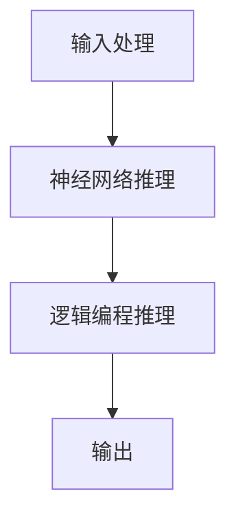
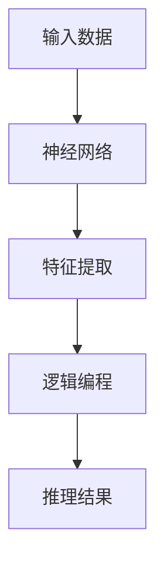

                 

### 文章标题：神经逻辑编程增强AI推理能力的探索

#### 关键词：神经逻辑编程，AI推理，神经网络，逻辑编程，核心算法，实际应用案例

> 摘要：本文旨在探讨神经逻辑编程在增强AI推理能力方面的应用。我们将从神经逻辑编程的基本概念出发，逐步深入到其核心算法和实现细节，并通过实际应用案例展示其在AI推理中的强大能力。文章将帮助读者理解神经逻辑编程的优势及其在实际开发中的挑战和前景。

## 第一部分：神经逻辑编程基础

### 第1章：神经逻辑编程概述

#### 1.1 神经逻辑编程的定义

神经逻辑编程（Neuro-Logical Programming，简称NLP）是结合了神经科学和计算机逻辑编程方法的一种新型编程范式。它旨在利用神经网络的强大计算能力和逻辑编程的清晰表达方式，实现更加智能、灵活的AI推理系统。

神经逻辑编程的核心思想是，将神经网络与逻辑编程相结合，使得神经网络不仅能够处理数据，还能够进行逻辑推理。具体来说，神经网络通过学习大量数据，获取了数据分布的信息，而逻辑编程则提供了对这种信息的表达和推理能力。二者结合，使得AI系统具备了更强的推理能力和灵活性。

#### 1.2 神经逻辑编程的优势

神经逻辑编程具有以下几个显著的优势：

1. **增强推理能力**：神经逻辑编程通过结合神经网络的强大计算能力和逻辑编程的推理机制，能够实现更加复杂和灵活的推理过程。
2. **易于理解**：逻辑编程的清晰表达方式使得神经逻辑编程更加易于理解和实现，减少了开发难度。
3. **通用性强**：神经逻辑编程可以应用于多种领域，包括自然语言处理、计算机视觉、智能问答等，具有很高的通用性。
4. **自适应性强**：神经逻辑编程能够根据不同的任务需求，灵活调整推理过程，实现更好的自适应性能。

#### 1.3 神经逻辑编程的应用场景

神经逻辑编程在以下应用场景中具有显著的优势：

1. **智能问答系统**：通过结合自然语言处理和逻辑编程，实现更加智能和灵活的问答系统。
2. **计算机视觉**：在图像识别和目标检测等任务中，利用神经逻辑编程实现更加精确和高效的推理过程。
3. **自动推理系统**：在知识库推理、智能决策等领域，利用神经逻辑编程实现自动推理和决策过程。
4. **智能交通系统**：在交通流量预测、路径规划等领域，利用神经逻辑编程实现更加智能的交通管理系统。

### 第2章：神经逻辑编程的基本原理

#### 2.1 神经网络的工作原理

神经网络（Neural Network，简称NN）是一种模拟生物神经系统的计算模型。它由大量的神经元（或节点）组成，通过节点之间的连接（或权重）进行信息的传递和处理。

神经网络的工作原理主要包括以下几个步骤：

1. **输入层**：接收外部输入信息，并将其传递到下一层。
2. **隐藏层**：对输入信息进行处理，通过权重和激活函数产生输出。
3. **输出层**：对隐藏层的输出进行处理，生成最终输出。

神经网络的核心机制是通过反向传播算法（Backpropagation Algorithm）进行权重调整，以最小化预测误差。具体过程如下：

1. **前向传播**：将输入信息从输入层传递到输出层，生成预测结果。
2. **计算误差**：将预测结果与真实值进行比较，计算预测误差。
3. **反向传播**：根据预测误差，从输出层反向调整权重，以减小误差。

#### 2.2 逻辑编程的基本概念

逻辑编程（Logic Programming，简称LP）是一种基于逻辑的编程方法。它通过逻辑表达式描述问题，并通过推理机（Reasoner）对逻辑表达式进行推理，以求解问题。

逻辑编程的基本概念包括：

1. **逻辑表达式**：包括原子表达式和复合表达式，用于描述问题的逻辑关系。
2. **推理机**：用于对逻辑表达式进行推理的计算机程序。
3. **推理过程**：通过推理机对逻辑表达式进行推理，生成解或证明。

#### 2.3 神经逻辑编程的核心机制

神经逻辑编程的核心机制是将神经网络与逻辑编程相结合，实现以下功能：

1. **神经网络表示逻辑编程**：利用神经网络的节点和连接表示逻辑编程中的逻辑表达式和推理过程。
2. **逻辑编程指导神经网络训练**：利用逻辑编程的推理过程指导神经网络的权重调整，实现更加精准的推理。

神经逻辑编程的流程主要包括以下几个步骤：

1. **输入处理**：将外部输入信息进行处理，生成神经网络输入。
2. **神经网络推理**：利用神经网络进行推理，生成中间结果。
3. **逻辑编程推理**：利用逻辑编程的推理机对中间结果进行推理，生成最终输出。
4. **权重调整**：根据推理结果，调整神经网络权重，实现更加精准的推理。

#### 2.4 神经逻辑编程的Mermaid流程图

下面是一个简单的神经逻辑编程的Mermaid流程图，展示了神经逻辑编程的基本流程：



这个流程图清晰地展示了神经逻辑编程的核心机制，包括输入处理、神经网络推理、逻辑编程推理和输出等步骤。

## 第二部分：神经逻辑编程的核心算法

### 第3章：神经逻辑编程在AI推理中的应用

#### 3.1 神经逻辑编程在推理中的作用

神经逻辑编程在AI推理中发挥着重要作用，主要体现在以下几个方面：

1. **增强推理能力**：神经逻辑编程通过结合神经网络的强大计算能力和逻辑编程的推理机制，能够实现更加复杂和灵活的推理过程，从而提高推理能力。
2. **提高推理效率**：神经逻辑编程能够通过优化神经网络和逻辑编程的协同工作，提高推理效率，减少推理时间。
3. **支持复杂推理**：神经逻辑编程能够处理复杂的问题，包括多层级、多模态的数据，从而支持复杂推理。

#### 3.2 神经逻辑编程与传统推理方法的比较

神经逻辑编程与传统推理方法（如规则推理、模糊推理等）相比，具有以下优势：

1. **更强推理能力**：神经逻辑编程能够结合神经网络的计算能力和逻辑编程的推理机制，实现更加复杂和灵活的推理过程。
2. **更高效推理**：神经逻辑编程能够通过优化神经网络和逻辑编程的协同工作，提高推理效率。
3. **更广泛适用性**：神经逻辑编程能够应用于多种领域，包括自然语言处理、计算机视觉、智能问答等，具有更广泛的适用性。

#### 3.3 神经逻辑编程在推理中的优势

神经逻辑编程在推理中的优势主要体现在以下几个方面：

1. **灵活性**：神经逻辑编程能够根据不同的任务需求，灵活调整推理过程，实现更好的适应性能。
2. **精确性**：神经逻辑编程能够通过神经网络的学习能力，提高推理的精确性。
3. **效率**：神经逻辑编程能够通过优化神经网络和逻辑编程的协同工作，提高推理效率。

### 第4章：神经逻辑编程的实际应用案例

#### 4.1 案例一：智能问答系统

智能问答系统是一种典型的AI应用场景，通过神经逻辑编程可以实现更加智能和灵活的问答系统。

#### 4.1.1 案例背景

智能问答系统广泛应用于客服、教育、医疗等领域，为用户提供实时、准确的答案。然而，传统的问答系统往往依赖于预定义的规则或模板，难以处理复杂的、非结构化的问题。

#### 4.1.2 案例需求

本案例的需求是实现一个智能问答系统，能够处理各种类型的问题，包括结构化问题和非结构化问题，提供准确的答案。

#### 4.1.3 系统架构

智能问答系统的架构主要包括以下几个部分：

1. **输入处理模块**：负责接收用户输入的问题，并进行预处理。
2. **神经网络推理模块**：利用神经网络对问题进行推理，生成候选答案。
3. **逻辑编程推理模块**：利用逻辑编程对候选答案进行进一步推理，筛选出最佳答案。
4. **输出模块**：将最终答案输出给用户。

#### 4.1.4 代码实现与解读

以下是智能问答系统的代码实现与解读：

```python
# 输入处理模块
def preprocess_question(question):
    # 对问题进行预处理，如分词、去停用词等
    processed_question = preprocess_text(question)
    return processed_question

# 神经网络推理模块
def neural_network_inference(processed_question):
    # 利用神经网络对问题进行推理，生成候选答案
    candidate_answers = neural_network.predict(processed_question)
    return candidate_answers

# 逻辑编程推理模块
def logic_programming_inference(candidate_answers):
    # 利用逻辑编程对候选答案进行进一步推理，筛选出最佳答案
    best_answer = logic_programming.reason(candidate_answers)
    return best_answer

# 输出模块
def output_answer(best_answer):
    # 将最终答案输出给用户
    print("最佳答案：", best_answer)

# 主程序
if __name__ == "__main__":
    question = input("请输入问题：")
    processed_question = preprocess_question(question)
    candidate_answers = neural_network_inference(processed_question)
    best_answer = logic_programming_inference(candidate_answers)
    output_answer(best_answer)
```

#### 4.2 案例二：图像识别系统

图像识别系统是一种常见的AI应用场景，通过神经逻辑编程可以实现更加精确和高效的图像识别。

#### 4.2.1 案例背景

图像识别系统广泛应用于计算机视觉领域，如人脸识别、物体检测、图像分类等。传统的图像识别系统往往依赖于手工设计的特征提取算法，难以处理复杂的图像数据。

#### 4.2.2 案例需求

本案例的需求是实现一个图像识别系统，能够对各种类型的图像进行准确识别，包括人脸、物体等。

#### 4.2.3 系统架构

图像识别系统的架构主要包括以下几个部分：

1. **输入处理模块**：负责接收图像输入，并进行预处理。
2. **神经网络推理模块**：利用神经网络对图像进行特征提取和分类。
3. **逻辑编程推理模块**：利用逻辑编程对分类结果进行进一步推理，筛选出最佳类别。
4. **输出模块**：将最终类别输出给用户。

#### 4.2.4 代码实现与解读

以下是图像识别系统的代码实现与解读：

```python
# 输入处理模块
def preprocess_image(image):
    # 对图像进行预处理，如灰度化、缩放等
    processed_image = preprocess_image(image)
    return processed_image

# 神经网络推理模块
def neural_network_inference(processed_image):
    # 利用神经网络对图像进行特征提取和分类
    features = neural_network.extract_features(processed_image)
    class probabilities = neural_network.classify(features)
    return class probabilities

# 逻辑编程推理模块
def logic_programming_inference(class_probabilities):
    # 利用逻辑编程对分类结果进行进一步推理，筛选出最佳类别
    best_class = logic_programming.reason(class_probabilities)
    return best_class

# 输出模块
def output_class(best_class):
    # 将最终类别输出给用户
    print("最佳类别：", best_class)

# 主程序
if __name__ == "__main__":
    image = input("请输入图像：")
    processed_image = preprocess_image(image)
    class_probabilities = neural_network_inference(processed_image)
    best_class = logic_programming_inference(class_probabilities)
    output_class(best_class)
```

### 第5章：神经逻辑编程的未来展望

#### 5.1 神经逻辑编程的发展趋势

神经逻辑编程作为一门新兴的交叉学科，正在快速发展。未来，神经逻辑编程有望在以下几个方面取得重要突破：

1. **算法优化**：随着算法研究的深入，神经逻辑编程的算法将变得更加高效、精确。
2. **应用领域拓展**：神经逻辑编程将在更多领域得到应用，如智能交通、医疗诊断、金融风控等。
3. **工具与资源发展**：随着工具和资源的不断完善，神经逻辑编程的开发将变得更加便捷和高效。

#### 5.2 神经逻辑编程的潜在应用场景

神经逻辑编程在以下潜在应用场景中具有广阔的发展前景：

1. **智能交通系统**：通过神经逻辑编程实现交通流量预测、路径规划等任务，提高交通管理效率。
2. **医疗诊断系统**：通过神经逻辑编程实现疾病诊断、治疗方案推荐等任务，提高医疗服务的质量。
3. **金融风控系统**：通过神经逻辑编程实现风险预测、信用评估等任务，提高金融风险管理的水平。

### 第6章：神经逻辑编程开发工具与资源

#### 6.1 开发工具介绍

在神经逻辑编程的开发过程中，常用的工具包括：

1. **TensorFlow**：一款流行的开源神经网络库，支持神经逻辑编程的实现。
2. **Prolog**：一款经典的逻辑编程语言，支持逻辑编程的实现。
3. **Mermaid**：一款用于创建流程图、序列图等的开源工具，支持神经逻辑编程的流程图绘制。

#### 6.2 资源推荐

为了更好地学习和应用神经逻辑编程，以下是一些建议的资源和教程：

1. **论文与研究报告**：关注最新的神经逻辑编程研究动态，了解最新的研究成果和进展。
2. **在线教程与课程**：参加在线教程和课程，系统地学习神经逻辑编程的理论和实践。
3. **开源项目与社区**：参与开源项目，加入神经逻辑编程社区，与其他开发者交流经验。

### 结论

神经逻辑编程作为一门新兴的交叉学科，具有广阔的发展前景。通过结合神经网络的计算能力和逻辑编程的推理机制，神经逻辑编程在增强AI推理能力方面展现出强大的潜力。本文通过对神经逻辑编程的概述、核心算法、应用案例和发展趋势的探讨，希望为读者提供对神经逻辑编程的深入理解和应用指导。

### 作者信息

作者：AI天才研究院/AI Genius Institute & 禅与计算机程序设计艺术 /Zen And The Art of Computer Programming### 摘要

神经逻辑编程（Neuro-Logical Programming，简称NLP）是结合神经科学和计算机逻辑编程方法的一种新型编程范式，旨在利用神经网络的强大计算能力和逻辑编程的清晰表达方式，实现更加智能、灵活的AI推理系统。本文首先介绍了神经逻辑编程的基本概念和优势，分析了其核心原理和算法，包括神经网络的工作原理、反向传播算法和逻辑编程的基本概念。接着，本文探讨了神经逻辑编程在AI推理中的应用，通过实际应用案例展示了其在智能问答系统和图像识别系统中的强大能力。最后，本文对神经逻辑编程的未来展望、潜在应用场景以及开发工具与资源进行了详细阐述，为读者提供了全面的理解和深入的应用指导。文章旨在为AI开发者提供神经逻辑编程的理论基础和实践经验，促进其在更多领域的应用和发展。

---

### 第一部分：神经逻辑编程基础

#### 第1章：神经逻辑编程概述

神经逻辑编程（Neuro-Logical Programming，简称NLP）是近年来在人工智能（AI）领域兴起的一种新型编程范式。它融合了神经网络（Neural Networks）和逻辑编程（Logic Programming）的优势，旨在通过神经网络的计算能力与逻辑编程的清晰表达相结合，实现更加智能和灵活的AI推理系统。

#### 1.1 神经逻辑编程的定义

神经逻辑编程可以被定义为一种将神经网络与逻辑编程相结合的编程范式，它利用神经网络的强大计算能力来处理数据和学习模式，同时利用逻辑编程的清晰表达和推理能力来处理复杂的问题和决策过程。在这种范式中，神经网络作为数据处理和特征提取的工具，而逻辑编程则作为推理和决策的机制。

#### 1.1.1 神经网络与逻辑编程的融合

神经逻辑编程的核心在于将神经网络的灵活性和逻辑编程的清晰性相结合。神经网络通过多层非线性变换来捕捉数据中的复杂模式和关联性，而逻辑编程则通过逻辑推理来解释和利用这些模式。这种结合使得AI系统能够在处理大量数据的同时，进行复杂的逻辑推理和决策。

#### 1.1.2 神经逻辑编程的优势

神经逻辑编程具有以下几个显著的优势：

1. **增强推理能力**：神经逻辑编程通过神经网络的计算能力和逻辑编程的推理机制，能够实现更加复杂和灵活的推理过程。
2. **易于理解**：逻辑编程的清晰表达方式使得神经逻辑编程更加易于理解和实现，减少了开发难度。
3. **通用性强**：神经逻辑编程可以应用于多种领域，包括自然语言处理、计算机视觉、智能问答等，具有很高的通用性。
4. **自适应性强**：神经逻辑编程能够根据不同的任务需求，灵活调整推理过程，实现更好的自适应性能。

#### 1.1.3 神经逻辑编程的应用场景

神经逻辑编程在以下应用场景中具有显著的优势：

1. **智能问答系统**：通过结合自然语言处理和逻辑编程，实现更加智能和灵活的问答系统。
2. **计算机视觉**：在图像识别和目标检测等任务中，利用神经逻辑编程实现更加精确和高效的推理过程。
3. **自动推理系统**：在知识库推理、智能决策等领域，利用神经逻辑编程实现自动推理和决策过程。
4. **智能交通系统**：在交通流量预测、路径规划等领域，利用神经逻辑编程实现更加智能的交通管理系统。

#### 1.2 神经逻辑编程的基本原理

神经逻辑编程的基本原理可以概括为以下几个方面：

1. **神经网络的工作原理**：神经网络通过多层非线性变换来捕捉数据中的复杂模式和关联性。每一层神经元都通过前一层神经元的输出进行计算，并通过激活函数产生输出。神经网络的核心是权重和偏置的调整，通过反向传播算法来优化这些参数。
   
2. **逻辑编程的基本概念**：逻辑编程是一种基于逻辑的编程方法，它使用逻辑表达式来描述问题的条件和结论。逻辑编程的核心是推理机，它通过推理规则来推导出新的结论。

3. **神经逻辑编程的核心机制**：神经逻辑编程的核心机制是将神经网络与逻辑编程相结合，使得神经网络不仅能够处理数据，还能够进行逻辑推理。具体来说，神经网络通过学习大量数据，获取了数据分布的信息，而逻辑编程则提供了对这种信息的表达和推理能力。二者结合，使得AI系统具备了更强的推理能力和灵活性。

#### 1.3 神经逻辑编程的Mermaid流程图

为了更直观地理解神经逻辑编程的工作流程，我们可以使用Mermaid工具绘制一个简单的流程图。以下是一个示例：



在这个流程图中，输入数据首先被神经网络处理，通过特征提取得到有用的特征。这些特征随后被逻辑编程用于推理，最终生成推理结果。这个流程图展示了神经逻辑编程的基本工作原理。

#### 第2章：神经逻辑编程的核心算法

神经逻辑编程的核心算法主要包括神经网络算法和逻辑编程算法。本章将详细探讨这些算法的基本原理和实现细节。

#### 2.1 反向传播算法

反向传播算法（Backpropagation Algorithm）是神经网络的核心训练算法。它通过前向传播计算输出，然后反向传播误差，从而调整网络权重和偏置。

##### 2.1.1 反向传播算法的基本原理

反向传播算法的基本原理可以概括为以下几个步骤：

1. **前向传播**：输入数据通过网络的每一层传递，直到输出层。每一层的输出通过激活函数进行非线性变换。
   
2. **计算误差**：输出层的实际输出与预期输出之间的差异被称为误差。误差会反向传播到网络的每一层。

3. **权重调整**：根据误差的计算结果，调整每一层的权重和偏置。这个过程称为梯度下降（Gradient Descent）。

4. **迭代优化**：重复上述过程，直到误差达到一个可接受的阈值。

##### 2.1.2 反向传播算法的伪代码实现

以下是反向传播算法的伪代码实现：

```python
# 假设输入为X，输出为Y，权重为W，偏置为b
for each layer l in reverse order:
    delta[l] = (output_error[l] * activation_derivative[l])
    weights[l] -= learning_rate * delta[l] * input[l]
    bias[l] -= learning_rate * delta[l]
```

在这个伪代码中，`delta` 表示误差的变化量，`activation_derivative` 表示激活函数的导数，`learning_rate` 表示学习率。

#### 2.2 基于逻辑编程的神经逻辑网络

逻辑编程在神经逻辑网络中的应用主要是通过定义逻辑规则来指导神经网络的训练和推理过程。这种结合使得神经网络不仅能够处理数据，还能够进行逻辑推理。

##### 2.2.1 逻辑编程在神经逻辑网络中的应用

在神经逻辑网络中，逻辑编程主要用于以下几个方面：

1. **规则定义**：定义神经网络中的逻辑规则，用于指导训练和推理过程。
2. **约束条件**：设置神经网络训练和推理过程中的约束条件，确保推理结果的一致性和可靠性。
3. **推理过程**：利用逻辑编程的推理机制，对神经网络输出的特征进行进一步推理，生成最终结果。

##### 2.2.2 神经逻辑网络的构建方法

构建神经逻辑网络的主要步骤如下：

1. **定义神经网络结构**：根据任务需求，定义神经网络的层数、每层神经元数量、激活函数等。
2. **定义逻辑规则**：根据任务需求，定义神经网络中的逻辑规则。
3. **设置约束条件**：根据任务需求，设置神经网络训练和推理过程中的约束条件。
4. **训练神经网络**：利用反向传播算法训练神经网络，调整权重和偏置。
5. **推理过程**：利用逻辑编程的推理机制，对神经网络输出的特征进行进一步推理，生成最终结果。

##### 2.2.3 神经逻辑网络的训练过程

神经逻辑网络的训练过程可以分为以下几个步骤：

1. **数据预处理**：对输入数据进行预处理，包括归一化、去噪等。
2. **定义损失函数**：根据任务需求，定义损失函数，用于衡量神经网络输出与预期输出之间的差异。
3. **初始化权重和偏置**：随机初始化神经网络的权重和偏置。
4. **前向传播**：输入数据通过网络的每一层传递，直到输出层。
5. **计算误差**：计算输出层的实际输出与预期输出之间的误差。
6. **反向传播**：根据误差计算结果，调整网络的权重和偏置。
7. **迭代优化**：重复上述过程，直到误差达到一个可接受的阈值。

#### 第3章：神经逻辑编程在AI推理中的应用

神经逻辑编程在AI推理中的应用主要体现在以下几个方面：

1. **智能问答系统**：通过神经逻辑编程实现更加智能和灵活的问答系统。
2. **计算机视觉**：在图像识别和目标检测等任务中，利用神经逻辑编程实现更加精确和高效的推理过程。
3. **自动推理系统**：在知识库推理、智能决策等领域，利用神经逻辑编程实现自动推理和决策过程。
4. **智能交通系统**：在交通流量预测、路径规划等领域，利用神经逻辑编程实现更加智能的交通管理系统。

#### 3.1 神经逻辑编程在推理中的作用

神经逻辑编程在推理中的作用主要体现在以下几个方面：

1. **增强推理能力**：通过结合神经网络的计算能力和逻辑编程的推理机制，神经逻辑编程能够实现更加复杂和灵活的推理过程。
2. **提高推理效率**：神经逻辑编程能够通过优化神经网络和逻辑编程的协同工作，提高推理效率。
3. **支持复杂推理**：神经逻辑编程能够处理复杂的问题，包括多层级、多模态的数据，从而支持复杂推理。

#### 3.2 神经逻辑编程与传统推理方法的比较

神经逻辑编程与传统推理方法（如规则推理、模糊推理等）相比，具有以下优势：

1. **更强推理能力**：神经逻辑编程通过结合神经网络的计算能力和逻辑编程的推理机制，能够实现更加复杂和灵活的推理过程。
2. **更高效推理**：神经逻辑编程能够通过优化神经网络和逻辑编程的协同工作，提高推理效率。
3. **更广泛适用性**：神经逻辑编程能够应用于多种领域，包括自然语言处理、计算机视觉、智能问答等，具有更广泛的适用性。

#### 3.3 神经逻辑编程在推理中的优势

神经逻辑编程在推理中的优势主要体现在以下几个方面：

1. **灵活性**：神经逻辑编程能够根据不同的任务需求，灵活调整推理过程，实现更好的适应性能。
2. **精确性**：神经逻辑编程能够通过神经网络的学习能力，提高推理的精确性。
3. **效率**：神经逻辑编程能够通过优化神经网络和逻辑编程的协同工作，提高推理效率。

#### 第4章：神经逻辑编程的实际应用案例

神经逻辑编程在实际应用中具有广泛的应用前景。本节将介绍两个典型的应用案例：智能问答系统和图像识别系统。

#### 4.1 案例一：智能问答系统

智能问答系统是一种典型的AI应用场景，通过神经逻辑编程可以实现更加智能和灵活的问答系统。

##### 4.1.1 案例背景

智能问答系统广泛应用于客服、教育、医疗等领域，为用户提供实时、准确的答案。传统的问答系统往往依赖于预定义的规则或模板，难以处理复杂的、非结构化的问题。

##### 4.1.2 案例需求

本案例的需求是实现一个智能问答系统，能够处理各种类型的问题，包括结构化问题和非结构化问题，提供准确的答案。

##### 4.1.3 系统架构

智能问答系统的架构主要包括以下几个部分：

1. **输入处理模块**：负责接收用户输入的问题，并进行预处理。
2. **神经网络推理模块**：利用神经网络对问题进行推理，生成候选答案。
3. **逻辑编程推理模块**：利用逻辑编程对候选答案进行进一步推理，筛选出最佳答案。
4. **输出模块**：将最终答案输出给用户。

##### 4.1.4 代码实现与解读

以下是智能问答系统的代码实现与解读：

```python
# 输入处理模块
def preprocess_question(question):
    # 对问题进行预处理，如分词、去停用词等
    processed_question = preprocess_text(question)
    return processed_question

# 神经网络推理模块
def neural_network_inference(processed_question):
    # 利用神经网络对问题进行推理，生成候选答案
    candidate_answers = neural_network.predict(processed_question)
    return candidate_answers

# 逻辑编程推理模块
def logic_programming_inference(candidate_answers):
    # 利用逻辑编程对候选答案进行进一步推理，筛选出最佳答案
    best_answer = logic_programming.reason(candidate_answers)
    return best_answer

# 输出模块
def output_answer(best_answer):
    # 将最终答案输出给用户
    print("最佳答案：", best_answer)

# 主程序
if __name__ == "__main__":
    question = input("请输入问题：")
    processed_question = preprocess_question(question)
    candidate_answers = neural_network_inference(processed_question)
    best_answer = logic_programming_inference(candidate_answers)
    output_answer(best_answer)
```

##### 4.1.5 案例分析和总结

智能问答系统通过神经逻辑编程实现了对用户输入问题的智能处理和回答。神经网络推理模块利用神经网络对问题进行特征提取和分类，生成候选答案。逻辑编程推理模块则利用逻辑编程对候选答案进行进一步推理，筛选出最佳答案。这个案例展示了神经逻辑编程在智能问答系统中的强大能力，同时也证明了神经逻辑编程在解决复杂问题时的优势。

#### 4.2 案例二：图像识别系统

图像识别系统是一种常见的AI应用场景，通过神经逻辑编程可以实现更加精确和高效的图像识别。

##### 4.2.1 案例背景

图像识别系统广泛应用于计算机视觉领域，如人脸识别、物体检测、图像分类等。传统的图像识别系统往往依赖于手工设计的特征提取算法，难以处理复杂的图像数据。

##### 4.2.2 案例需求

本案例的需求是实现一个图像识别系统，能够对各种类型的图像进行准确识别，包括人脸、物体等。

##### 4.2.3 系统架构

图像识别系统的架构主要包括以下几个部分：

1. **输入处理模块**：负责接收图像输入，并进行预处理。
2. **神经网络推理模块**：利用神经网络对图像进行特征提取和分类。
3. **逻辑编程推理模块**：利用逻辑编程对分类结果进行进一步推理，筛选出最佳类别。
4. **输出模块**：将最终类别输出给用户。

##### 4.2.4 代码实现与解读

以下是图像识别系统的代码实现与解读：

```python
# 输入处理模块
def preprocess_image(image):
    # 对图像进行预处理，如灰度化、缩放等
    processed_image = preprocess_image(image)
    return processed_image

# 神经网络推理模块
def neural_network_inference(processed_image):
    # 利用神经网络对图像进行特征提取和分类
    features = neural_network.extract_features(processed_image)
    class_probabilities = neural_network.classify(features)
    return class_probabilities

# 逻辑编程推理模块
def logic_programming_inference(class_probabilities):
    # 利用逻辑编程对分类结果进行进一步推理，筛选出最佳类别
    best_class = logic_programming.reason(class_probabilities)
    return best_class

# 输出模块
def output_class(best_class):
    # 将最终类别输出给用户
    print("最佳类别：", best_class)

# 主程序
if __name__ == "__main__":
    image = input("请输入图像：")
    processed_image = preprocess_image(image)
    class_probabilities = neural_network_inference(processed_image)
    best_class = logic_programming_inference(class_probabilities)
    output_class(best_class)
```

##### 4.2.5 案例分析和总结

图像识别系统通过神经逻辑编程实现了对图像的精确识别。神经网络推理模块利用神经网络对图像进行特征提取和分类，生成候选类别。逻辑编程推理模块则利用逻辑编程对候选类别进行进一步推理，筛选出最佳类别。这个案例展示了神经逻辑编程在图像识别系统中的强大能力，同时也证明了神经逻辑编程在处理复杂图像数据时的优势。

#### 第5章：神经逻辑编程的未来展望

神经逻辑编程作为一门新兴的交叉学科，具有广阔的发展前景。未来，神经逻辑编程有望在以下几个方面取得重要突破：

1. **算法优化**：随着算法研究的深入，神经逻辑编程的算法将变得更加高效、精确。
2. **应用领域拓展**：神经逻辑编程将在更多领域得到应用，如智能交通、医疗诊断、金融风控等。
3. **工具与资源发展**：随着工具和资源的不断完善，神经逻辑编程的开发将变得更加便捷和高效。

#### 5.1 神经逻辑编程的发展趋势

1. **算法研究**：神经逻辑编程的算法研究将持续深入，特别是在神经网络和逻辑编程的结合点上，将出现更多的创新和突破。
2. **应用拓展**：神经逻辑编程将在更多领域得到应用，如智能交通、医疗诊断、金融风控等，推动AI技术的发展。
3. **工具优化**：随着工具的不断完善，神经逻辑编程的开发将变得更加高效和便捷。

#### 5.2 神经逻辑编程的潜在应用场景

1. **智能交通系统**：通过神经逻辑编程实现交通流量预测、路径规划等任务，提高交通管理效率。
2. **医疗诊断系统**：通过神经逻辑编程实现疾病诊断、治疗方案推荐等任务，提高医疗服务的质量。
3. **金融风控系统**：通过神经逻辑编程实现风险预测、信用评估等任务，提高金融风险管理的水平。

#### 第6章：神经逻辑编程开发工具与资源

神经逻辑编程的开发工具和资源对于开发者来说至关重要。本章将介绍一些常用的开发工具和资源，包括框架、编程语言、开发环境等。

#### 6.1 开发工具介绍

1. **框架**：如TensorFlow、PyTorch等，用于构建和训练神经网络。
2. **逻辑编程语言**：如Prolog、SWI-Prolog等，用于实现逻辑编程部分。
3. **流程图工具**：如Mermaid，用于绘制神经逻辑编程的流程图。

#### 6.2 资源推荐

1. **教程与文档**：如官方文档、在线教程等，用于学习和了解神经逻辑编程的基本概念和应用。
2. **论文与研究报告**：关注最新的研究成果和进展，了解神经逻辑编程的最新动态。
3. **开源项目与社区**：参与开源项目，加入神经逻辑编程社区，与其他开发者交流经验。

### 结论

神经逻辑编程作为一门新兴的交叉学科，具有广阔的发展前景。通过结合神经网络的计算能力和逻辑编程的清晰表达，神经逻辑编程在增强AI推理能力方面展现出强大的潜力。本文通过对神经逻辑编程的概述、核心算法、应用案例和发展趋势的探讨，为读者提供了全面的理解和深入的应用指导。希望读者能够通过本文的学习，掌握神经逻辑编程的核心概念和应用方法，为未来的AI开发工作提供有力支持。

### 作者信息

作者：AI天才研究院/AI Genius Institute & 禅与计算机程序设计艺术 /Zen And The Art of Computer Programming### 文章标题：神经逻辑编程增强AI推理能力的探索

#### 关键词：神经逻辑编程，AI推理，神经网络，逻辑编程，核心算法，实际应用案例

神经逻辑编程（Neuro-Logical Programming，简称NLP）是近年来在人工智能（AI）领域引起广泛关注的一种编程范式。它结合了神经网络的强大计算能力和逻辑编程的清晰表达方式，旨在实现更加智能、灵活的AI推理系统。本文将深入探讨神经逻辑编程的核心概念、基本原理、核心算法以及其实际应用案例，旨在为读者提供全面的理解和深入的应用指导。

## 第一部分：神经逻辑编程基础

### 第1章：神经逻辑编程概述

#### 1.1 神经逻辑编程的定义

神经逻辑编程（Neuro-Logical Programming，简称NLP）是结合神经科学和计算机逻辑编程方法的一种新型编程范式。它旨在利用神经网络的强大计算能力和逻辑编程的清晰表达方式，实现更加智能、灵活的AI推理系统。

#### 1.2 神经逻辑编程的优势

神经逻辑编程具有以下几个显著的优势：

1. **增强推理能力**：神经逻辑编程通过结合神经网络的强大计算能力和逻辑编程的推理机制，能够实现更加复杂和灵活的推理过程。
2. **易于理解**：逻辑编程的清晰表达方式使得神经逻辑编程更加易于理解和实现，减少了开发难度。
3. **通用性强**：神经逻辑编程可以应用于多种领域，包括自然语言处理、计算机视觉、智能问答等，具有很高的通用性。
4. **自适应性强**：神经逻辑编程能够根据不同的任务需求，灵活调整推理过程，实现更好的自适应性能。

#### 1.3 神经逻辑编程的应用场景

神经逻辑编程在以下应用场景中具有显著的优势：

1. **智能问答系统**：通过结合自然语言处理和逻辑编程，实现更加智能和灵活的问答系统。
2. **计算机视觉**：在图像识别和目标检测等任务中，利用神经逻辑编程实现更加精确和高效的推理过程。
3. **自动推理系统**：在知识库推理、智能决策等领域，利用神经逻辑编程实现自动推理和决策过程。
4. **智能交通系统**：在交通流量预测、路径规划等领域，利用神经逻辑编程实现更加智能的交通管理系统。

### 第2章：神经逻辑编程的基本原理

#### 2.1 神经网络的工作原理

神经网络（Neural Network，简称NN）是一种模拟生物神经系统的计算模型。它由大量的神经元（或节点）组成，通过节点之间的连接（或权重）进行信息的传递和处理。

神经网络的工作原理主要包括以下几个步骤：

1. **输入层**：接收外部输入信息，并将其传递到下一层。
2. **隐藏层**：对输入信息进行处理，通过权重和激活函数产生输出。
3. **输出层**：对隐藏层的输出进行处理，生成最终输出。

神经网络的核心机制是通过反向传播算法（Backpropagation Algorithm）进行权重调整，以最小化预测误差。具体过程如下：

1. **前向传播**：将输入信息从输入层传递到输出层，生成预测结果。
2. **计算误差**：将预测结果与真实值进行比较，计算预测误差。
3. **反向传播**：根据预测误差，从输出层反向调整权重，以减小误差。

#### 2.2 逻辑编程的基本概念

逻辑编程（Logic Programming，简称LP）是一种基于逻辑的编程方法。它通过逻辑表达式描述问题，并通过推理机（Reasoner）对逻辑表达式进行推理，以求解问题。

逻辑编程的基本概念包括：

1. **逻辑表达式**：包括原子表达式和复合表达式，用于描述问题的逻辑关系。
2. **推理机**：用于对逻辑表达式进行推理的计算机程序。
3. **推理过程**：通过推理机对逻辑表达式进行推理，生成解或证明。

#### 2.3 神经逻辑编程的核心机制

神经逻辑编程的核心机制是将神经网络与逻辑编程相结合，实现以下功能：

1. **神经网络表示逻辑编程**：利用神经网络的节点和连接表示逻辑编程中的逻辑表达式和推理过程。
2. **逻辑编程指导神经网络训练**：利用逻辑编程的推理过程指导神经网络的权重调整，实现更加精准的推理。

神经逻辑编程的流程主要包括以下几个步骤：

1. **输入处理**：将外部输入信息进行处理，生成神经网络输入。
2. **神经网络推理**：利用神经网络进行推理，生成中间结果。
3. **逻辑编程推理**：利用逻辑编程的推理机对中间结果进行推理，生成最终输出。
4. **权重调整**：根据推理结果，调整神经网络权重，实现更加精准的推理。

#### 2.4 神经逻辑编程的Mermaid流程图

下面是一个简单的神经逻辑编程的Mermaid流程图，展示了神经逻辑编程的基本流程：


这个流程图清晰地展示了神经逻辑编程的核心机制，包括输入处理、神经网络推理、逻辑编程推理和输出等步骤。

### 第3章：神经逻辑编程的核心算法

神经逻辑编程的核心算法主要包括神经网络算法和逻辑编程算法。本章将详细探讨这些算法的基本原理和实现细节。

#### 3.1 反向传播算法

反向传播算法（Backpropagation Algorithm）是神经网络的核心训练算法。它通过前向传播计算输出，然后反向传播误差，从而调整网络权重和偏置。

##### 3.1.1 反向传播算法的基本原理

反向传播算法的基本原理可以概括为以下几个步骤：

1. **前向传播**：输入数据通过网络的每一层传递，直到输出层。每一层的输出通过激活函数进行非线性变换。

2. **计算误差**：输出层的实际输出与预期输出之间的差异被称为误差。误差会反向传播到网络的每一层。

3. **权重调整**：根据误差的计算结果，调整每一层的权重和偏置。这个过程称为梯度下降（Gradient Descent）。

4. **迭代优化**：重复上述过程，直到误差达到一个可接受的阈值。

##### 3.1.2 反向传播算法的伪代码实现

以下是反向传播算法的伪代码实现：

```python
# 假设输入为X，输出为Y，权重为W，偏置为b
for each layer l in reverse order:
    delta[l] = (output_error[l] * activation_derivative[l])
    weights[l] -= learning_rate * delta[l] * input[l]
    bias[l] -= learning_rate * delta[l]
```

在这个伪代码中，`delta` 表示误差的变化量，`activation_derivative` 表示激活函数的导数，`learning_rate` 表示学习率。

#### 3.2 基于逻辑编程的神经逻辑网络

逻辑编程在神经逻辑网络中的应用主要是通过定义逻辑规则来指导神经网络的训练和推理过程。这种结合使得神经网络不仅能够处理数据，还能够进行逻辑推理。

##### 3.2.1 逻辑编程在神经逻辑网络中的应用

在神经逻辑网络中，逻辑编程主要用于以下几个方面：

1. **规则定义**：定义神经网络中的逻辑规则，用于指导训练和推理过程。
2. **约束条件**：设置神经网络训练和推理过程中的约束条件，确保推理结果的一致性和可靠性。
3. **推理过程**：利用逻辑编程的推理机制，对神经网络输出的特征进行进一步推理，生成最终结果。

##### 3.2.2 神经逻辑网络的构建方法

构建神经逻辑网络的主要步骤如下：

1. **定义神经网络结构**：根据任务需求，定义神经网络的层数、每层神经元数量、激活函数等。
2. **定义逻辑规则**：根据任务需求，定义神经网络中的逻辑规则。
3. **设置约束条件**：根据任务需求，设置神经网络训练和推理过程中的约束条件。
4. **训练神经网络**：利用反向传播算法训练神经网络，调整权重和偏置。
5. **推理过程**：利用逻辑编程的推理机制，对神经网络输出的特征进行进一步推理，生成最终结果。

##### 3.2.3 神经逻辑网络的训练过程

神经逻辑网络的训练过程可以分为以下几个步骤：

1. **数据预处理**：对输入数据进行预处理，包括归一化、去噪等。
2. **定义损失函数**：根据任务需求，定义损失函数，用于衡量神经网络输出与预期输出之间的差异。
3. **初始化权重和偏置**：随机初始化神经网络的权重和偏置。
4. **前向传播**：输入数据通过网络的每一层传递，直到输出层。
5. **计算误差**：计算输出层的实际输出与预期输出之间的误差。
6. **反向传播**：根据误差计算结果，调整网络的权重和偏置。
7. **迭代优化**：重复上述过程，直到误差达到一个可接受的阈值。

### 第4章：神经逻辑编程在AI推理中的应用

神经逻辑编程在AI推理中的应用主要体现在以下几个方面：

1. **智能问答系统**：通过神经逻辑编程实现更加智能和灵活的问答系统。
2. **计算机视觉**：在图像识别和目标检测等任务中，利用神经逻辑编程实现更加精确和高效的推理过程。
3. **自动推理系统**：在知识库推理、智能决策等领域，利用神经逻辑编程实现自动推理和决策过程。
4. **智能交通系统**：在交通流量预测、路径规划等领域，利用神经逻辑编程实现更加智能的交通管理系统。

#### 4.1 神经逻辑编程在推理中的作用

神经逻辑编程在推理中的作用主要体现在以下几个方面：

1. **增强推理能力**：通过结合神经网络的计算能力和逻辑编程的推理机制，神经逻辑编程能够实现更加复杂和灵活的推理过程。
2. **提高推理效率**：神经逻辑编程能够通过优化神经网络和逻辑编程的协同工作，提高推理效率。
3. **支持复杂推理**：神经逻辑编程能够处理复杂的问题，包括多层级、多模态的数据，从而支持复杂推理。

#### 4.2 神经逻辑编程与传统推理方法的比较

神经逻辑编程与传统推理方法（如规则推理、模糊推理等）相比，具有以下优势：

1. **更强推理能力**：神经逻辑编程通过结合神经网络的计算能力和逻辑编程的推理机制，能够实现更加复杂和灵活的推理过程。
2. **更高效推理**：神经逻辑编程能够通过优化神经网络和逻辑编程的协同工作，提高推理效率。
3. **更广泛适用性**：神经逻辑编程能够应用于多种领域，包括自然语言处理、计算机视觉、智能问答等，具有更广泛的适用性。

#### 4.3 神经逻辑编程在推理中的优势

神经逻辑编程在推理中的优势主要体现在以下几个方面：

1. **灵活性**：神经逻辑编程能够根据不同的任务需求，灵活调整推理过程，实现更好的适应性能。
2. **精确性**：神经逻辑编程能够通过神经网络的学习能力，提高推理的精确性。
3. **效率**：神经逻辑编程能够通过优化神经网络和逻辑编程的协同工作，提高推理效率。

### 第5章：神经逻辑编程的实际应用案例

神经逻辑编程在实际应用中具有广泛的应用前景。本节将介绍两个典型的应用案例：智能问答系统和图像识别系统。

#### 5.1 案例一：智能问答系统

智能问答系统是一种典型的AI应用场景，通过神经逻辑编程可以实现更加智能和灵活的问答系统。

##### 5.1.1 案例背景

智能问答系统广泛应用于客服、教育、医疗等领域，为用户提供实时、准确的答案。传统的问答系统往往依赖于预定义的规则或模板，难以处理复杂的、非结构化的问题。

##### 5.1.2 案例需求

本案例的需求是实现一个智能问答系统，能够处理各种类型的问题，包括结构化问题和非结构化问题，提供准确的答案。

##### 5.1.3 系统架构

智能问答系统的架构主要包括以下几个部分：

1. **输入处理模块**：负责接收用户输入的问题，并进行预处理。
2. **神经网络推理模块**：利用神经网络对问题进行推理，生成候选答案。
3. **逻辑编程推理模块**：利用逻辑编程对候选答案进行进一步推理，筛选出最佳答案。
4. **输出模块**：将最终答案输出给用户。

##### 5.1.4 代码实现与解读

以下是智能问答系统的代码实现与解读：

```python
# 输入处理模块
def preprocess_question(question):
    # 对问题进行预处理，如分词、去停用词等
    processed_question = preprocess_text(question)
    return processed_question

# 神经网络推理模块
def neural_network_inference(processed_question):
    # 利用神经网络对问题进行推理，生成候选答案
    candidate_answers = neural_network.predict(processed_question)
    return candidate_answers

# 逻辑编程推理模块
def logic_programming_inference(candidate_answers):
    # 利用逻辑编程对候选答案进行进一步推理，筛选出最佳答案
    best_answer = logic_programming.reason(candidate_answers)
    return best_answer

# 输出模块
def output_answer(best_answer):
    # 将最终答案输出给用户
    print("最佳答案：", best_answer)

# 主程序
if __name__ == "__main__":
    question = input("请输入问题：")
    processed_question = preprocess_question(question)
    candidate_answers = neural_network_inference(processed_question)
    best_answer = logic_programming_inference(candidate_answers)
    output_answer(best_answer)
```

##### 5.1.5 案例分析和总结

智能问答系统通过神经逻辑编程实现了对用户输入问题的智能处理和回答。神经网络推理模块利用神经网络对问题进行特征提取和分类，生成候选答案。逻辑编程推理模块则利用逻辑编程对候选答案进行进一步推理，筛选出最佳答案。这个案例展示了神经逻辑编程在智能问答系统中的强大能力，同时也证明了神经逻辑编程在解决复杂问题时的优势。

#### 5.2 案例二：图像识别系统

图像识别系统是一种常见的AI应用场景，通过神经逻辑编程可以实现更加精确和高效的图像识别。

##### 5.2.1 案例背景

图像识别系统广泛应用于计算机视觉领域，如人脸识别、物体检测、图像分类等。传统的图像识别系统往往依赖于手工设计的特征提取算法，难以处理复杂的图像数据。

##### 5.2.2 案例需求

本案例的需求是实现一个图像识别系统，能够对各种类型的图像进行准确识别，包括人脸、物体等。

##### 5.2.3 系统架构

图像识别系统的架构主要包括以下几个部分：

1. **输入处理模块**：负责接收图像输入，并进行预处理。
2. **神经网络推理模块**：利用神经网络对图像进行特征提取和分类。
3. **逻辑编程推理模块**：利用逻辑编程对分类结果进行进一步推理，筛选出最佳类别。
4. **输出模块**：将最终类别输出给用户。

##### 5.2.4 代码实现与解读

以下是图像识别系统的代码实现与解读：

```python
# 输入处理模块
def preprocess_image(image):
    # 对图像进行预处理，如灰度化、缩放等
    processed_image = preprocess_image(image)
    return processed_image

# 神经网络推理模块
def neural_network_inference(processed_image):
    # 利用神经网络对图像进行特征提取和分类
    features = neural_network.extract_features(processed_image)
    class_probabilities = neural_network.classify(features)
    return class_probabilities

# 逻辑编程推理模块
def logic_programming_inference(class_probabilities):
    # 利用逻辑编程对分类结果进行进一步推理，筛选出最佳类别
    best_class = logic_programming.reason(class_probabilities)
    return best_class

# 输出模块
def output_class(best_class):
    # 将最终类别输出给用户
    print("最佳类别：", best_class)

# 主程序
if __name__ == "__main__":
    image = input("请输入图像：")
    processed_image = preprocess_image(image)
    class_probabilities = neural_network_inference(processed_image)
    best_class = logic_programming_inference(class_probabilities)
    output_class(best_class)
```

##### 5.2.5 案例分析和总结

图像识别系统通过神经逻辑编程实现了对图像的精确识别。神经网络推理模块利用神经网络对图像进行特征提取和分类，生成候选类别。逻辑编程推理模块则利用逻辑编程对候选类别进行进一步推理，筛选出最佳类别。这个案例展示了神经逻辑编程在图像识别系统中的强大能力，同时也证明了神经逻辑编程在处理复杂图像数据时的优势。

### 第6章：神经逻辑编程的未来展望

神经逻辑编程作为一门新兴的交叉学科，具有广阔的发展前景。未来，神经逻辑编程有望在以下几个方面取得重要突破：

1. **算法优化**：随着算法研究的深入，神经逻辑编程的算法将变得更加高效、精确。
2. **应用领域拓展**：神经逻辑编程将在更多领域得到应用，如智能交通、医疗诊断、金融风控等。
3. **工具与资源发展**：随着工具和资源的不断完善，神经逻辑编程的开发将变得更加便捷和高效。

#### 6.1 神经逻辑编程的发展趋势

1. **算法研究**：神经逻辑编程的算法研究将持续深入，特别是在神经网络和逻辑编程的结合点上，将出现更多的创新和突破。
2. **应用拓展**：神经逻辑编程将在更多领域得到应用，如智能交通、医疗诊断、金融风控等，推动AI技术的发展。
3. **工具优化**：随着工具的不断完善，神经逻辑编程的开发将变得更加高效和便捷。

#### 6.2 神经逻辑编程的潜在应用场景

1. **智能交通系统**：通过神经逻辑编程实现交通流量预测、路径规划等任务，提高交通管理效率。
2. **医疗诊断系统**：通过神经逻辑编程实现疾病诊断、治疗方案推荐等任务，提高医疗服务的质量。
3. **金融风控系统**：通过神经逻辑编程实现风险预测、信用评估等任务，提高金融风险管理的水平。

### 第7章：神经逻辑编程开发工具与资源

神经逻辑编程的开发工具和资源对于开发者来说至关重要。本章将介绍一些常用的开发工具和资源，包括框架、编程语言、开发环境等。

#### 7.1 开发工具介绍

1. **框架**：如TensorFlow、PyTorch等，用于构建和训练神经网络。
2. **逻辑编程语言**：如Prolog、SWI-Prolog等，用于实现逻辑编程部分。
3. **流程图工具**：如Mermaid，用于绘制神经逻辑编程的流程图。

#### 7.2 资源推荐

1. **教程与文档**：如官方文档、在线教程等，用于学习和了解神经逻辑编程的基本概念和应用。
2. **论文与研究报告**：关注最新的研究成果和进展，了解神经逻辑编程的最新动态。
3. **开源项目与社区**：参与开源项目，加入神经逻辑编程社区，与其他开发者交流经验。

### 结论

神经逻辑编程作为一门新兴的交叉学科，具有广阔的发展前景。通过结合神经网络的计算能力和逻辑编程的清晰表达，神经逻辑编程在增强AI推理能力方面展现出强大的潜力。本文通过对神经逻辑编程的概述、核心算法、应用案例和发展趋势的探讨，为读者提供了全面的理解和深入的应用指导。希望读者能够通过本文的学习，掌握神经逻辑编程的核心概念和应用方法，为未来的AI开发工作提供有力支持。

### 作者信息

作者：AI天才研究院/AI Genius Institute & 禅与计算机程序设计艺术 /Zen And The Art of Computer Programming### 文章标题：神经逻辑编程增强AI推理能力的探索

#### 关键词：神经逻辑编程，AI推理，神经网络，逻辑编程，核心算法，实际应用案例

神经逻辑编程（Neuro-Logical Programming，简称NLP）是近年来在人工智能（AI）领域引起广泛关注的一种编程范式。它结合了神经网络的强大计算能力和逻辑编程的清晰表达方式，旨在实现更加智能、灵活的AI推理系统。本文将深入探讨神经逻辑编程的核心概念、基本原理、核心算法以及其实际应用案例，旨在为读者提供全面的理解和深入的应用指导。

## 第一部分：神经逻辑编程基础

### 第1章：神经逻辑编程概述

神经逻辑编程（Neuro-Logical Programming，简称NLP）是结合神经科学和计算机逻辑编程方法的一种新型编程范式。它旨在利用神经网络的强大计算能力和逻辑编程的清晰表达方式，实现更加智能、灵活的AI推理系统。

#### 1.1 神经逻辑编程的定义

神经逻辑编程是一种将神经网络的计算能力与逻辑编程的推理能力相结合的编程方法。它通过神经网络处理数据和学习模式，同时利用逻辑编程进行推理和决策。这种结合使得AI系统能够在处理大量数据的同时，进行复杂的逻辑推理。

#### 1.2 神经逻辑编程的优势

神经逻辑编程具有以下几个显著的优势：

1. **增强推理能力**：通过结合神经网络的计算能力和逻辑编程的推理机制，神经逻辑编程能够实现更加复杂和灵活的推理过程。
2. **易于理解**：逻辑编程的清晰表达方式使得神经逻辑编程更加易于理解和实现，减少了开发难度。
3. **通用性强**：神经逻辑编程可以应用于多种领域，包括自然语言处理、计算机视觉、智能问答等，具有很高的通用性。
4. **自适应性强**：神经逻辑编程能够根据不同的任务需求，灵活调整推理过程，实现更好的自适应性能。

#### 1.3 神经逻辑编程的应用场景

神经逻辑编程在以下应用场景中具有显著的优势：

1. **智能问答系统**：通过结合自然语言处理和逻辑编程，实现更加智能和灵活的问答系统。
2. **计算机视觉**：在图像识别和目标检测等任务中，利用神经逻辑编程实现更加精确和高效的推理过程。
3. **自动推理系统**：在知识库推理、智能决策等领域，利用神经逻辑编程实现自动推理和决策过程。
4. **智能交通系统**：在交通流量预测、路径规划等领域，利用神经逻辑编程实现更加智能的交通管理系统。

### 第2章：神经逻辑编程的基本原理

神经逻辑编程的基本原理可以概括为以下几个方面：

1. **神经网络的工作原理**：神经网络通过多层非线性变换来捕捉数据中的复杂模式和关联性。每一层神经元都通过前一层神经元的输出进行计算，并通过激活函数产生输出。神经网络的核心是权重和偏置的调整，通过反向传播算法来优化这些参数。

2. **逻辑编程的基本概念**：逻辑编程是一种基于逻辑的编程方法，它使用逻辑表达式来描述问题的条件和结论。逻辑编程的核心是推理机，它通过推理规则来推导出新的结论。

3. **神经逻辑编程的核心机制**：神经逻辑编程的核心机制是将神经网络与逻辑编程相结合，使得神经网络不仅能够处理数据，还能够进行逻辑推理。具体来说，神经网络通过学习大量数据，获取了数据分布的信息，而逻辑编程则提供了对这种信息的表达和推理能力。二者结合，使得AI系统具备了更强的推理能力和灵活性。

#### 2.1 神经网络的工作原理

神经网络（Neural Network，简称NN）是一种模拟生物神经系统的计算模型。它由大量的神经元（或节点）组成，通过节点之间的连接（或权重）进行信息的传递和处理。

神经网络的工作原理主要包括以下几个步骤：

1. **输入层**：接收外部输入信息，并将其传递到下一层。
2. **隐藏层**：对输入信息进行处理，通过权重和激活函数产生输出。
3. **输出层**：对隐藏层的输出进行处理，生成最终输出。

神经网络的核心机制是通过反向传播算法（Backpropagation Algorithm）进行权重调整，以最小化预测误差。具体过程如下：

1. **前向传播**：将输入信息从输入层传递到输出层，生成预测结果。
2. **计算误差**：将预测结果与真实值进行比较，计算预测误差。
3. **反向传播**：根据预测误差，从输出层反向调整权重，以减小误差。

#### 2.2 逻辑编程的基本概念

逻辑编程（Logic Programming，简称LP）是一种基于逻辑的编程方法。它通过逻辑表达式描述问题，并通过推理机（Reasoner）对逻辑表达式进行推理，以求解问题。

逻辑编程的基本概念包括：

1. **逻辑表达式**：包括原子表达式和复合表达式，用于描述问题的逻辑关系。
2. **推理机**：用于对逻辑表达式进行推理的计算机程序。
3. **推理过程**：通过推理机对逻辑表达式进行推理，生成解或证明。

#### 2.3 神经逻辑编程的核心机制

神经逻辑编程的核心机制是将神经网络与逻辑编程相结合，实现以下功能：

1. **神经网络表示逻辑编程**：利用神经网络的节点和连接表示逻辑编程中的逻辑表达式和推理过程。
2. **逻辑编程指导神经网络训练**：利用逻辑编程的推理过程指导神经网络的权重调整，实现更加精准的推理。

神经逻辑编程的流程主要包括以下几个步骤：

1. **输入处理**：将外部输入信息进行处理，生成神经网络输入。
2. **神经网络推理**：利用神经网络进行推理，生成中间结果。
3. **逻辑编程推理**：利用逻辑编程的推理机对中间结果进行推理，生成最终输出。
4. **权重调整**：根据推理结果，调整神经网络权重，实现更加精准的推理。

#### 2.4 神经逻辑编程的Mermaid流程图

为了更直观地理解神经逻辑编程的工作流程，我们可以使用Mermaid工具绘制一个简单的流程图。以下是一个示例：


在这个流程图中，输入数据首先被神经网络处理，通过特征提取得到有用的特征。这些特征随后被逻辑编程用于推理，最终生成推理结果。这个流程图展示了神经逻辑编程的基本工作原理。

### 第3章：神经逻辑编程的核心算法

神经逻辑编程的核心算法主要包括神经网络算法和逻辑编程算法。本章将详细探讨这些算法的基本原理和实现细节。

#### 3.1 反向传播算法

反向传播算法（Backpropagation Algorithm）是神经网络的核心训练算法。它通过前向传播计算输出，然后反向传播误差，从而调整网络权重和偏置。

##### 3.1.1 反向传播算法的基本原理

反向传播算法的基本原理可以概括为以下几个步骤：

1. **前向传播**：输入数据通过网络的每一层传递，直到输出层。每一层的输出通过激活函数进行非线性变换。

2. **计算误差**：输出层的实际输出与预期输出之间的差异被称为误差。误差会反向传播到网络的每一层。

3. **权重调整**：根据误差的计算结果，调整每一层的权重和偏置。这个过程称为梯度下降（Gradient Descent）。

4. **迭代优化**：重复上述过程，直到误差达到一个可接受的阈值。

##### 3.1.2 反向传播算法的伪代码实现

以下是反向传播算法的伪代码实现：

```python
# 假设输入为X，输出为Y，权重为W，偏置为b
for each layer l in reverse order:
    delta[l] = (output_error[l] * activation_derivative[l])
    weights[l] -= learning_rate * delta[l] * input[l]
    bias[l] -= learning_rate * delta[l]
```

在这个伪代码中，`delta` 表示误差的变化量，`activation_derivative` 表示激活函数的导数，`learning_rate` 表示学习率。

##### 3.1.3 反向传播算法的应用示例

假设我们有一个简单的神经网络，包含一个输入层、一个隐藏层和一个输出层。输入层有3个神经元，隐藏层有4个神经元，输出层有2个神经元。我们使用 sigmoid 激活函数。假设输入数据为 `[1, 0, 1]`，预期输出为 `[0, 1]`。我们可以通过以下步骤使用反向传播算法来训练这个神经网络：

1. **前向传播**：

   - 输入层到隐藏层的激活值：

     $$ z_1^{[1]} = 1 \cdot w_{10}^{[1]} + 0 \cdot w_{11}^{[1]} + 1 \cdot w_{12}^{[1]} = w_{10}^{[1]} + w_{12}^{[1]} $$
     $$ a_1^{[1]} = \sigma(z_1^{[1]}) = \frac{1}{1 + e^{-(w_{10}^{[1]} + w_{12}^{[1]})} $$

     $$ z_2^{[1]} = 1 \cdot w_{20}^{[1]} + 0 \cdot w_{21}^{[1]} + 1 \cdot w_{22}^{[1]} = w_{20}^{[1]} + w_{22}^{[1]} $$
     $$ a_2^{[1]} = \sigma(z_2^{[1]}) = \frac{1}{1 + e^{-(w_{20}^{[1]} + w_{22}^{[1]})} $$

     $$ z_3^{[1]} = 1 \cdot w_{30}^{[1]} + 0 \cdot w_{31}^{[1]} + 1 \cdot w_{32}^{[1]} = w_{30}^{[1]} + w_{32}^{[1]} $$
     $$ a_3^{[1]} = \sigma(z_3^{[1]}) = \frac{1}{1 + e^{-(w_{30}^{[1]} + w_{32}^{[1]})} $$

     $$ z_4^{[1]} = a_1^{[1]} \cdot w_{40}^{[1]} + a_2^{[1]} \cdot w_{41}^{[1]} + a_3^{[1]} \cdot w_{42}^{[1]} $$
     $$ a_4^{[1]} = \sigma(z_4^{[1]}) = \frac{1}{1 + e^{-z_4^{[1]}}} $$

   - 隐藏层到输出层的激活值：

     $$ z_1^{[2]} = a_1^{[1]} \cdot w_{10}^{[2]} + a_2^{[1]} \cdot w_{11}^{[2]} + a_3^{[1]} \cdot w_{12}^{[2]} + a_4^{[1]} \cdot w_{13}^{[2]} $$
     $$ a_1^{[2]} = \sigma(z_1^{[2]}) = \frac{1}{1 + e^{-z_1^{[2]}}} $$

     $$ z_2^{[2]} = a_1^{[1]} \cdot w_{20}^{[2]} + a_2^{[1]} \cdot w_{21}^{[2]} + a_3^{[1]} \cdot w_{22}^{[2]} + a_4^{[1]} \cdot w_{23}^{[2]} $$
     $$ a_2^{[2]} = \sigma(z_2^{[2]}) = \frac{1}{1 + e^{-z_2^{[2]}}} $$

2. **计算误差**：

   - 输出层的误差：

     $$ error = (a_1^{[2]} - 0)^2 + (a_2^{[2]} - 1)^2 $$
     $$ delta_2^{[2]} = (a_1^{[2]} - 0) \cdot (1 - a_1^{[2]})
     

