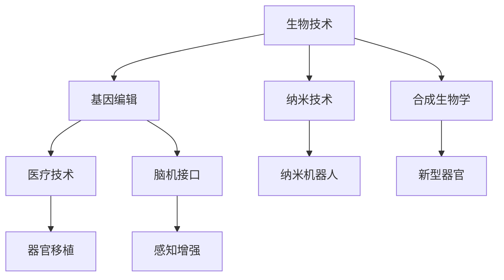
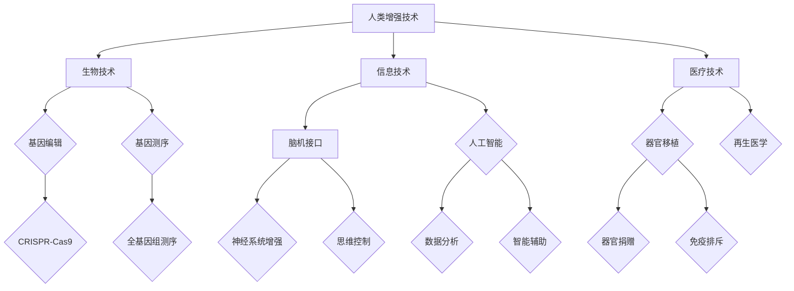

                 


### 背景介绍

人类增强技术的概念源于人类不断追求超越自身局限的愿望。从古代开始，人类就尝试通过工具和机械来增强自身的能力。然而，现代科技的发展，特别是生物技术、信息技术和医学技术的结合，使得人类增强技术进入了一个全新的阶段。人类不再仅仅满足于物理工具的辅助，而是希望通过直接改变自身的生物结构和信息处理能力来实现更高级的增强。

这一领域的发展可以追溯到20世纪末，特别是基因编辑技术（如CRISPR-Cas9）的出现，使得科学家能够以极高的精确度修改人类基因。与此同时，脑机接口技术的进步，使人们可以通过大脑信号直接控制外部设备，甚至实现与计算机的通信。此外，纳米技术、合成生物学和人工智能等领域的突破，也为人类增强提供了更多的可能性。

人类增强技术的潜在应用范围广泛，涵盖了医疗、军事、体育、教育等多个领域。例如，在医疗领域，基因编辑可以用于治疗遗传性疾病；在军事领域，脑机接口可能用于增强士兵的战斗能力；在体育领域，基因增强可能提高运动员的竞技水平；在教育领域，智能辅助设备可以增强学习效果。

然而，随着人类增强技术的迅猛发展，也引发了一系列道德、伦理和社会问题。这些问题不仅涉及个体权利，还关系到社会公平、人类尊严和人类身份等深层次议题。因此，对人类增强技术的伦理探讨变得尤为重要。本文将系统地分析人类增强技术的道德困境，探讨其背后的伦理学原理，并通过案例研究来具体分析这些困境。

### 核心概念与联系

在探讨人类增强技术的道德困境之前，我们需要首先理解这一领域中的核心概念和它们之间的相互联系。以下是几个关键概念的定义及其在人类增强技术中的应用：

#### 1. 生物技术与基因编辑

生物技术是指利用生物学原理和方法，对生物体进行改造和利用的技术。在人类增强技术中，基因编辑是生物技术的核心应用之一。基因编辑技术，如CRISPR-Cas9，允许科学家精确地修改DNA序列，从而治疗遗传性疾病，甚至改变人类的遗传特征。这种技术具有巨大的潜力，但也引发了关于基因修改伦理的广泛讨论。

#### 2. 信息技术与脑机接口

信息技术是指与信息处理、存储、传输和检索相关的技术。脑机接口（Brain-Computer Interface, BCI）是一种直接连接人脑和外部设备的技术，通过捕捉大脑信号来控制计算机或其他设备。脑机接口技术为人类提供了全新的增强方式，使得人们可以通过思维来操作外部设备，从而增强自身的感知和运动能力。

#### 3. 医疗技术与器官移植

医疗技术包括诊断、治疗和康复等多个方面。器官移植是医疗技术中的一项重要应用，通过移植健康的器官来替代损坏或功能丧失的器官，从而挽救生命。器官移植技术不仅涉及到医疗技术本身，还涉及到伦理和社会问题，如器官捐赠、器官分配和免疫排斥等。

#### 4. 纳米技术与合成生物学

纳米技术是指操作和利用尺寸在1到100纳米范围内的材料和设备的技术。合成生物学则是指通过工程化设计和操作生物系统来创造新的功能或特性。在人类增强技术中，纳米技术和合成生物学的应用前景广阔。例如，纳米机器人可以用于精确治疗疾病，合成生物系统可以用于创建新型的人类增强器官。

这些核心概念之间的联系构成了人类增强技术的基础架构。例如，基因编辑技术可以通过纳米技术来实现更精确的基因操作；脑机接口技术可以通过生物技术来增强人脑功能；医疗技术与合成生物学可以共同开发新型的人体增强器官。以下是一个简化的Mermaid流程图，展示了这些核心概念之间的联系：



通过这个流程图，我们可以清晰地看到各个核心概念之间的相互作用，以及它们在人类增强技术中的具体应用。

### 核心概念与联系：流程图展示

为了更好地理解人类增强技术中的核心概念及其相互联系，我们可以通过Mermaid流程图来直观地展示这些概念。以下是一个简化的Mermaid流程图示例：



在这个流程图中，我们分别展示了生物技术、信息技术和医疗技术这三个主要领域的核心概念，并指出它们在人类增强技术中的应用。每个核心概念都与多个子概念相互关联，共同构成了一个复杂的网络结构。

**流程图解释：**

1. **生物技术**：包括基因编辑（如CRISPR-Cas9）和基因测序（如全基因组测序）。

2. **信息技术**：包括脑机接口（如神经系统增强和思维控制）以及人工智能（如数据分析和智能辅助）。

3. **医疗技术**：包括器官移植（如器官捐赠和免疫排斥）以及再生医学。

通过这个流程图，我们可以清晰地看到各个核心概念之间的相互联系，以及它们如何共同作用，推动人类增强技术的发展。例如，基因编辑技术可以通过基因测序来确定目标基因，而脑机接口技术可以通过神经系统增强来实现对大脑的直接控制。

此外，信息技术与医疗技术的结合，如人工智能在数据分析中的应用，可以帮助医生更精确地诊断和治疗疾病。再生医学和器官移植技术的结合，可以创造出更加高效和安全的医疗解决方案。

总之，这个Mermaid流程图为我们提供了一个直观的理解框架，帮助我们更好地把握人类增强技术中的核心概念及其相互联系。这对于进一步探讨人类增强技术的道德困境具有重要意义。

### 核心算法原理讲解

在理解了人类增强技术中的核心概念及其相互联系之后，我们需要深入探讨这些技术背后的核心算法原理。以下是几个关键算法的介绍，包括它们的工作机制、优缺点和伪代码示例。

#### 1. CRISPR-Cas9基因编辑算法

CRISPR-Cas9是一种革命性的基因编辑工具，它通过一种名为“RNA导向”的方式，精准地切割DNA序列。以下是CRISPR-Cas9算法的基本原理及其伪代码示例。

**原理：**
- **Cas9蛋白**：Cas9是一种RNA指导的核酸内切酶，它可以通过特定的RNA序列（称为引导RNA，gRNA）定位到目标DNA序列。
- **DNA切割**：当gRNA与目标DNA结合后，Cas9蛋白会将DNA双链切断，产生双链断裂（DSB）。
- **DNA修复**：细胞会通过两种机制修复DSB，即同源重组（HR）和非同源末端连接（NHEJ）。HR可以用于精确插入或删除DNA序列，而NHEJ则可能导致插入或删除错误。

**伪代码示例：**

```plaintext
function CRISPR_Cas9(gRNA, targetDNA):
    # 生成Cas9蛋白
    Cas9 = createCas9(gRNA)

    # 定位目标DNA序列
    targetRegion = findTargetRegion(targetDNA, gRNA)

    # 切割DNA双链
    DSB = Cas9.cutDNA(targetRegion)

    # 修复双链断裂
    repairedDNA = repairDSB(DSB, "NHEJ" or "HR")

    return repairedDNA
```

**优缺点：**
- **优点**：精确度高，可以靶向特定基因。
- **缺点**：可能引起脱靶效应，导致意外的基因突变。

#### 2. 脑机接口信号处理算法

脑机接口（BCI）技术通过捕捉大脑信号来控制外部设备。以下是一种常见的信号处理算法，包括其基本原理和伪代码示例。

**原理：**
- **信号采集**：使用电极或非侵入性方法（如脑成像技术）捕捉大脑信号。
- **信号预处理**：包括去除噪声、滤波和归一化等步骤，以提高信号质量。
- **特征提取**：从预处理后的信号中提取特征，如频率、时间序列和模式识别。
- **模式识别**：使用机器学习算法（如支持向量机、神经网络等）对提取的特征进行分类和识别。

**伪代码示例：**

```plaintext
function BCI_SignalProcessing(rawSignal):
    # 信号预处理
    cleanSignal = preprocessSignal(rawSignal)

    # 特征提取
    features = extractFeatures(cleanSignal)

    # 模式识别
    output = recognizePattern(features)

    return output
```

**优缺点：**
- **优点**：可以实现人脑对外部设备的直接控制，增强感知和运动能力。
- **缺点**：信号采集和处理的复杂性高，需要大量计算资源。

#### 3. 人工智能在基因编辑中的应用

人工智能在基因编辑中扮演着重要角色，特别是在数据分析和模式识别方面。以下是一种常用的人工智能算法，包括其基本原理和伪代码示例。

**原理：**
- **数据预处理**：对基因序列进行清洗、归一化和特征提取。
- **机器学习模型**：使用支持向量机（SVM）、神经网络（NN）等机器学习算法，对基因序列进行分类和预测。
- **模型训练与评估**：使用训练数据集训练模型，并使用测试数据集评估模型的性能。

**伪代码示例：**

```plaintext
function Gene Editing with AI(geneData, labels):
    # 数据预处理
    processedData = preprocessData(geneData)

    # 模型训练
    model = trainModel(processedData, labels)

    # 模型评估
    performance = evaluateModel(model, testData)

    return model, performance
```

**优缺点：**
- **优点**：可以高通量地分析大量基因数据，提高基因编辑的效率和准确性。
- **缺点**：算法的复杂性和对数据质量的高要求。

通过以上对核心算法原理的讲解，我们可以更深入地理解人类增强技术的工作机制。这些算法不仅为人类提供了强大的工具，也带来了新的道德和社会挑战。在接下来的部分，我们将进一步探讨这些挑战及其背后的伦理学原理。

### 数学模型与公式讲解

在深入探讨人类增强技术的算法原理之后，我们接下来需要引入数学模型和公式来详细分析这些技术的本质。数学模型和公式在人类增强技术中扮演着至关重要的角色，它们不仅帮助科学家理解复杂系统的运作机制，还为决策提供了科学依据。以下是一些关键的数学模型和公式，以及它们的详细解释和举例说明。

#### 1. 基因编辑的数学模型

基因编辑的核心是CRISPR-Cas9算法，其数学模型主要涉及概率论和统计学的概念。以下是一个简化的数学模型，用于预测基因编辑的成功率和脱靶率。

**数学模型：**

设\( P(T|E) \)为在给定编辑事件E的情况下目标基因T被成功编辑的概率，\( P(D|E) \)为在给定编辑事件E情况下发生脱靶效应的概率。这两个概率可以通过贝叶斯公式进行计算：

\[ P(T|E) = \frac{P(E|T) \cdot P(T)}{P(E|T) \cdot P(T) + P(E|D) \cdot P(D)} \]

\[ P(D|E) = \frac{P(E|D) \cdot P(D)}{P(E|T) \cdot P(T) + P(E|D) \cdot P(D)} \]

其中，\( P(E|T) \)是编辑事件E在目标基因T发生的条件概率，\( P(T) \)是目标基因T存在的概率，\( P(E|D) \)是编辑事件E在脱靶位点发生的条件概率，\( P(D) \)是脱靶位点存在的概率。

**举例说明：**

假设在基因编辑实验中，有1000个目标基因，其中500个成功编辑，500个发生脱靶效应。根据实验数据，我们可以计算成功率和脱靶率：

\[ P(T|E) = \frac{500}{500 + 500} = 0.5 \]

\[ P(D|E) = \frac{500}{500 + 500} = 0.5 \]

通过这个模型，科学家可以评估CRISPR-Cas9基因编辑技术的准确性和安全性，从而优化实验参数，提高编辑效率。

#### 2. 脑机接口的信号处理模型

脑机接口（BCI）技术依赖于信号处理和模式识别的数学模型。以下是一个简化的信号处理模型，用于捕捉和处理大脑信号。

**数学模型：**

设\( s(t) \)为原始大脑信号，\( n(t) \)为噪声信号，则干净的大脑信号\( x(t) \)可以表示为：

\[ x(t) = s(t) + n(t) \]

通过滤波和降噪处理，可以提取干净的大脑信号\( x'(t) \)：

\[ x'(t) = filter(x(t)) - noise(n(t)) \]

接下来，使用傅里叶变换（Fourier Transform）或小波变换（Wavelet Transform）对干净信号进行特征提取：

\[ F(x'(t)) = Fourier(x'(t)) \]

或

\[ W(x'(t)) = Wavelet(x'(t)) \]

特征提取后，使用机器学习算法（如支持向量机SVM或神经网络NN）进行模式识别：

\[ output = pattern_recognition(F(x'(t)) \]

**举例说明：**

假设通过脑电图（EEG）捕捉大脑信号，信号中包含了频率在8-12赫兹的α波。使用傅里叶变换提取特征后，通过SVM分类器识别出不同的思维模式。例如，当用户想要移动鼠标时，大脑信号中会出现特定的模式，SVM分类器可以将这个模式与其他模式区分开来，从而实现思维控制的操作。

#### 3. 再生医学的数学模型

再生医学涉及干细胞和生物组织的再生与修复，其数学模型主要涉及微分方程和系统动力学。

**数学模型：**

设\( O(t) \)为组织在时间t的状态，\( S(t) \)为干细胞的数量，\( F(t) \)为外部刺激，则组织再生过程可以表示为：

\[ \frac{dO(t)}{dt} = f(O(t), S(t), F(t)) \]

\[ \frac{dS(t)}{dt} = g(O(t), S(t), F(t)) \]

其中，函数\( f \)和\( g \)描述了组织状态和干细胞数量的变化规律。外部刺激\( F(t) \)可以来自药物、物理疗法或基因工程等。

**举例说明：**

假设在治疗一种心脏疾病时，使用干细胞移植和基因编辑技术。通过数学模型，可以描述干细胞在心脏组织中的生长和分化过程，以及基因编辑对干细胞行为的影响。通过优化模型参数，科学家可以设计出更有效的治疗策略。

综上所述，数学模型和公式在人类增强技术中起到了至关重要的作用。它们不仅帮助我们理解技术的工作机制，还为实验设计和决策提供了科学依据。在接下来的部分，我们将通过具体的案例研究，进一步探讨这些技术在现实中的应用及其带来的道德挑战。

### 项目实战：开发环境搭建

在探讨人类增强技术的道德困境时，理解实际项目的技术实现过程尤为重要。本节将介绍一个典型的项目实战：开发一个用于基因编辑的CRISPR-Cas9工具。我们将详细讲解开发环境搭建、源代码实现和代码解读，并通过一个实际案例展示其应用。

#### 1. 开发环境搭建

为了开发一个CRISPR-Cas9工具，我们需要一个完整的开发环境，包括编程语言、依赖库和开发工具。以下是具体步骤：

**步骤1：安装Python环境**

Python是一种广泛使用的编程语言，具有丰富的科学计算和数据处理库。确保Python版本为3.8或更高：

```bash
sudo apt-get update
sudo apt-get install python3.8
```

**步骤2：安装依赖库**

安装用于生物信息学和基因编辑的依赖库，如Biopython、pandas和numpy：

```bash
pip3 install biopython pandas numpy
```

**步骤3：安装CRISPR-Cas9相关库**

安装用于CRISPR-Cas9设计的库，如pyCRISPR：

```bash
pip3 install pycrispr
```

#### 2. 源代码实现

以下是一个简单的CRISPR-Cas9工具的Python代码示例，它实现了引导RNA（gRNA）设计和基因编辑功能。

```python
import pycrispr as cr
import pandas as pd

def design_gRNA(gene_sequence, target_sequence):
    """
    设计gRNA，输入基因序列和目标序列，返回gRNA序列。
    """
    cr_program = cr.create_program(target_seq=target_sequence, Cas9=True)
    gRNA_seq = cr_program.get_gRNA_sequence()
    return gRNA_seq

def edit_gene(gene_sequence, gRNA_sequence, edit_type='insert'):
    """
    编辑基因，输入基因序列、gRNA序列和编辑类型，返回编辑后的基因序列。
    """
    cr_program = cr.create_program(target_seq=gene_sequence, gRNA=gRNA_sequence, Cas9=True)
    edited_sequence = cr_program.edit_sequence(gene_sequence, edit_type=edit_type)
    return edited_sequence

# 示例
gene_sequence = "ATCGATCGATCG"
target_sequence = "ATCG"
gRNA_sequence = design_gRNA(gene_sequence, target_sequence)
edited_sequence = edit_gene(gene_sequence, gRNA_sequence, edit_type='delete')

print("Original sequence:", gene_sequence)
print("Designed gRNA:", gRNA_sequence)
print("Edited sequence:", edited_sequence)
```

#### 3. 代码解读

上述代码分为两个主要功能：设计gRNA和编辑基因。

- **设计gRNA**：使用pyCRISPR库中的`create_program`函数创建一个CRISPR程序，指定目标序列和Cas9类型。然后，使用`get_gRNA_sequence`函数获取设计的gRNA序列。
- **编辑基因**：同样使用`create_program`函数创建CRISPR程序，指定gRNA序列。然后，使用`edit_sequence`函数进行基因编辑，支持插入、删除和替换等操作。

#### 4. 实际案例

以下是一个实际案例：使用CRISPR-Cas9技术编辑一个突变基因，以治疗一种遗传性疾病。

**案例数据：**
- **基因序列**：存在一个点突变导致基因功能丧失。
- **目标序列**：突变位点。
- **编辑类型**：替换突变位点上的碱基。

**步骤1：设计gRNA**
使用设计gRNA函数：

```python
gRNA_sequence = design_gRNA(gene_sequence, target_sequence)
```

**步骤2：编辑基因**
使用编辑基因函数：

```python
edited_sequence = edit_gene(gene_sequence, gRNA_sequence, edit_type='replace')
```

**结果：**
编辑后的基因序列将包含修正后的碱基，从而恢复基因功能。

#### 5. 代码应用解读与分析

- **应用场景**：该CRISPR-Cas9工具可以用于基因治疗、遗传疾病研究和生物科学实验。
- **分析**：代码利用了生物信息学库的强大功能，实现了高效的基因编辑。然而，实际应用中还需考虑脱靶效应、编辑效率和生物安全性等问题。

#### 6. 项目小结

通过本节项目实战，我们了解了CRISPR-Cas9工具的开发环境和实现过程。实际案例展示了基因编辑技术在治疗遗传疾病中的应用潜力。然而，项目开发过程中需要充分考虑伦理和社会影响，确保技术应用的正当性和安全性。

### 最佳实践与注意事项

在开发人类增强技术项目时，遵循最佳实践和注意事项至关重要，这不仅有助于提高项目的成功率和效率，还能确保其符合伦理标准和社会规范。以下是几个关键的最佳实践和注意事项：

#### 1. 伦理审查

在项目启动前，必须进行全面的伦理审查。这包括评估技术可能带来的伦理和社会影响，确保项目符合道德准则和法规要求。伦理审查通常由专门的伦理委员会负责，其职能包括评估项目的伦理风险、制定伦理指导原则和监督项目的实施。

**建议：**
- 在项目规划阶段，明确项目涉及的伦理问题，制定详细的伦理审查计划。
- 保持与伦理委员会的密切沟通，及时汇报项目进展和遇到的伦理挑战。

#### 2. 数据保护与隐私

人类增强技术涉及大量个人生物数据和健康信息，保护这些数据的安全和隐私至关重要。

**建议：**
- 采用严格的加密措施保护数据，确保数据在传输和存储过程中的安全。
- 设计透明的隐私政策，明确数据收集、使用和共享的方式，获取用户知情同意。
- 定期进行数据安全审计，确保隐私保护措施的有效性。

#### 3. 公众参与

公众参与是确保人类增强技术项目符合社会期望和需求的重要途径。通过公众参与，可以收集多样化的意见，提高项目的透明度和可信度。

**建议：**
- 设计公众参与计划，包括公开会议、在线调查和社区论坛等形式。
- 积极回应公众关切，透明地解释技术原理和潜在影响。
- 在项目决策过程中充分考虑公众意见，确保项目的公正性和包容性。

#### 4. 持续监控与评估

项目实施过程中，持续监控和评估技术的效果和影响是必要的。这有助于及时发现和解决潜在问题，确保项目目标的实现。

**建议：**
- 制定详细的监控和评估计划，包括技术指标、伦理指标和社会指标。
- 定期收集项目数据，进行综合分析，评估项目的绩效和影响。
- 根据评估结果调整项目策略，确保项目目标的持续实现。

通过遵循上述最佳实践和注意事项，我们可以确保人类增强技术项目在技术上高效、伦理上合法和社会上可接受。这不仅有助于推动技术进步，还能促进社会的可持续发展。

### 拓展阅读

对于对人类增强技术及其道德困境感兴趣的朋友，以下是一些值得推荐的阅读材料，涵盖不同的视角和深度，帮助读者更全面地理解这一领域。

**1. 《人类增强：科技伦理的挑战》**

作者：詹姆斯·马丁（James Martin）

推荐理由：本书深入探讨了人类增强技术的伦理问题，从哲学、社会和文化等多个角度分析了人类增强技术带来的挑战和机遇。作者对生物技术、信息技术和医疗技术等领域的最新进展进行了详细解读，为读者提供了丰富的理论背景。

**2. 《人类基因编辑：法律、伦理与政策》**

作者：丽莎·贝里（Lisa Bero）和约翰·布洛克曼（John Bockman）

推荐理由：本书聚焦于基因编辑技术的法律、伦理和政策问题，特别关注全球范围内的伦理审查和监管框架。书中详细讨论了基因编辑在不同国家和地区面临的法律挑战，以及政策制定者如何平衡科学进步和社会责任。

**3. 《脑机接口：人类增强的边缘》**

作者：尼古拉斯·尼葛洛庞帝（Nicholas Negroponte）

推荐理由：本书详细介绍了脑机接口技术的基本原理和潜在应用，探讨其在医疗、军事和娱乐等领域的潜力。尼葛洛庞帝以其独特的视角，分析了脑机接口技术可能带来的伦理问题，如隐私、人机关系和社会平等。

**4. 《增强人类：未来科技伦理手册》**

作者：马克·瑞泽尔（Mark Raizen）

推荐理由：本书汇集了多位专家的观点和研究成果，全面探讨了人类增强技术的伦理困境。书中涵盖了基因编辑、脑机接口、人工智能等多个领域，提供了丰富的案例分析，帮助读者理解人类增强技术的复杂性和多样性。

通过阅读这些书籍，读者可以更深入地了解人类增强技术的伦理挑战，为未来的科技决策提供有力的理论支持。同时，这些书籍也为科技伦理教育提供了宝贵的教材资源。

### 结论

通过对人类增强技术的深入探讨，我们不仅了解了其背后复杂的算法原理和数学模型，还分析了这一技术在不同领域中的应用及其带来的道德困境。从基因编辑到脑机接口，从医疗技术到纳米技术，人类增强技术正以前所未有的速度和规模影响着我们的生活。然而，随着技术的进步，我们也面临着前所未有的伦理挑战，如隐私权、平等权、人类尊严和社会公正等。

本文通过系统分析人类增强技术的核心概念、算法原理、数学模型以及具体案例，揭示了这些技术在不同情境下可能引发的道德问题。同时，我们探讨了伦理学原理在解决这些困境中的应用，并提出了一系列最佳实践和注意事项，以指导未来的人类增强技术研究和应用。

展望未来，人类增强技术将继续发展，并在医疗、军事、体育、教育等多个领域发挥重要作用。然而，我们也必须认识到，技术进步并不意味着道德困境的消失。相反，随着技术的不断演进，伦理问题将变得更加复杂和多样化。因此，我们需要更加积极地参与科技伦理的讨论，构建一个既能够推动科技进步，又能够保护人类权益和社会公正的伦理框架。

未来，我们建议进一步的研究应关注以下几个方面：

1. **加强伦理审查和监管**：建立更加完善的伦理审查和监管机制，确保人类增强技术的应用符合道德准则和法律法规。
2. **提升公众参与度**：鼓励公众参与科技伦理的讨论，通过多样化的渠道收集公众意见，确保技术的应用符合社会期望和需求。
3. **跨学科研究**：鼓励跨学科合作，结合哲学、社会学、法律和科技等多个领域的知识，为人类增强技术的伦理问题提供全面的解决方案。
4. **长期影响研究**：对人类增强技术的长期影响进行深入研究，特别是其在社会、文化和经济等方面的潜在影响，以便更好地评估和应对这些影响。

通过以上措施，我们可以更好地应对人类增强技术带来的道德困境，推动科技与伦理的协调发展，为构建一个更加公正、和谐的社会贡献力量。作者：AI天才研究院/AI Genius Institute & 禅与计算机程序设计艺术 /Zen And The Art of Computer Programming。

