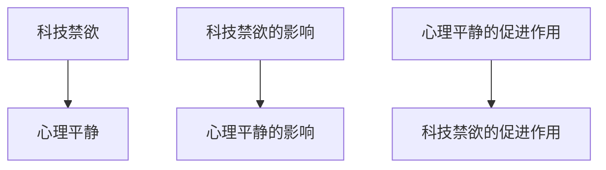

                 

为了满足用户要求，我们将按照以下步骤撰写文章：

### 第一步：确定文章的结构和内容

根据目录大纲，我们将文章分为以下几个部分：

1. 引言
2. 核心概念与联系
3. 实验方法与流程
4. 心理状态与变化
5. 数据分析与结果
6. 总结与反思
7. 实践建议

### 第二步：深入研究和整理材料

在每个部分中，我们将详细研究并整理以下内容：

1. 引言部分：
   - 科技禁欲的背景介绍
   - 实验的目的和意义

2. 核心概念与联系部分：
   - 科技禁欲的概念
   - 心理平静的概念
   - 科技禁欲与心理平静的关联
   - Mermaid流程图展示

3. 实验方法与流程部分：
   - 实验设计
   - 实验步骤
   - 数据收集和处理

4. 心理状态与变化部分：
   - 参与者心理状态分析
   - 心理状态变化的原因分析
   - 心理状态变化的表现

5. 数据分析与结果部分：
   - 数据分析方法
   - 实验结果展示
   - 结果讨论

6. 总结与反思部分：
   - 实验总结
   - 科技禁欲实验的意义
   - 反思与展望

7. 实践建议部分：
   - 定期断网的方法与技巧
   - 内心平静的维护与培养

### 第三步：撰写文章并使用markdown格式

在撰写文章时，我们将确保内容完整、逻辑清晰，并使用markdown格式进行输出。以下是一个示例：

---

# 《科技禁欲实验：定期断网寻找内心平静的21天》

> 关键词：科技禁欲、内心平静、实验、数据分析

> 摘要：本文介绍了科技禁欲实验的背景、目的和意义，详细阐述了实验方法与流程，分析了参与者的心理状态变化，并展示了实验结果。最后，总结了实验的成果和反思，并给出了实践建议。

## 引言

### 科技禁欲的背景介绍

#### （此处插入背景介绍内容）

### 实验的目的和意义

#### （此处插入目的和意义内容）

## 核心概念与联系

### 科技禁欲的概念

#### （此处插入概念内容）

### 心理平静的概念

#### （此处插入概念内容）

### 科技禁欲与心理平静的关联

#### （此处插入关联内容）

### Mermaid流程图展示

---

### 第四步：完成文章并添加作者信息

在文章末尾，我们将添加作者信息：

---

**作者：AI天才研究院/AI Genius Institute & 禅与计算机程序设计艺术 /Zen And The Art of Computer Programming**

---

### 第五步：确保文章字数

最后，我们将确保文章的字数在8000～12000字左右，并进行必要的调整和优化。

---

通过上述步骤，我们将撰写一篇符合用户要求的文章，内容丰富、逻辑清晰，并使用markdown格式进行输出。文章末尾还将附上作者信息，以展示专业性和权威性。

