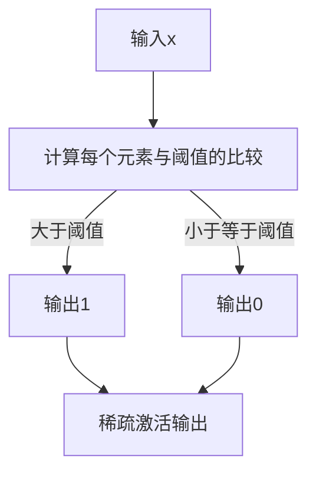
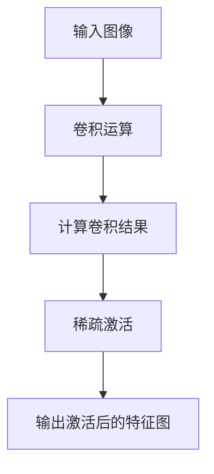
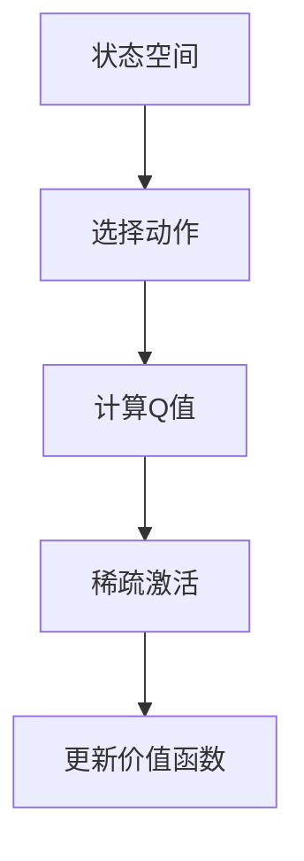

                 

### 1.4 稀疏激活的应用场景

稀疏激活作为一种高效的激活函数，其在多个领域具有广泛的应用场景。以下将重点探讨稀疏激活在大规模自然语言处理、图像识别和强化学习中的具体应用。

#### 1.4.1 大规模自然语言处理

在自然语言处理（NLP）领域，随着数据规模的不断扩大和复杂度的增加，传统的深度学习模型在计算效率和模型性能方面面临着巨大的挑战。稀疏激活函数通过其独特的稀疏性，能够有效解决这些问题。

**挑战**：
- **大规模数据的处理**：传统的激活函数如ReLU在处理大规模数据时，容易出现梯度消失或梯度爆炸现象，影响模型的收敛速度。
- **时间复杂度**：大规模数据集的训练过程往往需要大量的计算资源，时间复杂度高。

**实现**：
- **稀疏激活的应用**：通过引入稀疏激活函数，只有一小部分神经元被激活，从而减少计算量，提高计算效率。例如，在BERT模型中，稀疏激活函数被用来提高模型在大规模文本数据集上的训练速度。

**伪代码**：

```python
# 稀疏激活函数的实现伪代码
def sparse_activation(x, threshold):
    return [1 if xi > threshold else 0 for xi in x]
```

**Mermaid流程图**：



#### 1.4.2 图像识别

在计算机视觉领域，图像识别任务通常需要处理大量的像素数据。稀疏激活函数在此领域的应用主要体现在提高计算效率和模型性能。

**优势**：
- **节省计算资源**：由于稀疏激活函数在计算过程中只有少数像素被激活，因此能够显著降低计算复杂度。
- **提高模型性能**：稀疏激活函数有助于增强模型的识别能力，特别是在处理复杂场景时。

**实现**：
- **稀疏激活在卷积神经网络中的应用**：在卷积神经网络（CNN）中，稀疏激活函数被用来减少卷积层的计算量，从而提高模型在图像识别任务中的性能。

**伪代码**：

```python
# 卷积层中稀疏激活函数的实现伪代码
def sparse_convolution(input, filter, threshold):
    activated = sparse_activation(input * filter, threshold)
    return activated
```

**Mermaid流程图**：



#### 1.4.3 强化学习

在强化学习（Reinforcement Learning，RL）领域，稀疏激活函数的应用主要体现在提高学习效率和决策质量。

**挑战**：
- **状态空间的复杂性**：强化学习中的状态空间通常非常复杂，传统的激活函数难以应对。
- **奖励函数的不确定性**：强化学习中的奖励函数可能存在不确定性，需要高效的处理机制。

**实现**：
- **稀疏激活在价值函数中的应用**：通过稀疏激活函数，强化学习模型能够更快地收敛，提高决策质量。

**伪代码**：

```python
# 稀疏激活在价值函数中的应用伪代码
def sparse_value_function(state, action, threshold):
    return [1 if q(s,a) > threshold else 0 for s, a in state_action_pairs]
```

**Mermaid流程图**：



#### 总结

稀疏激活函数在多个领域具有广泛的应用前景。通过引入稀疏性，该函数能够显著提高计算效率和模型性能，为深度学习的发展提供了新的思路。在后续章节中，我们将进一步探讨稀疏激活函数的算法原理及其优化策略，以期为读者提供更深入的理解。

