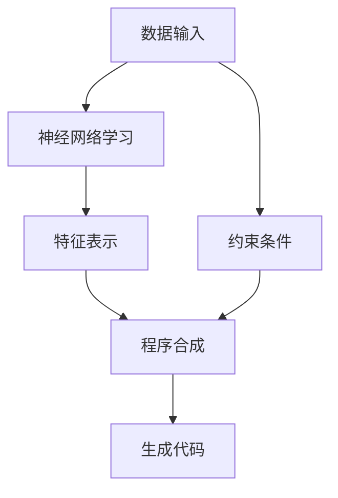

                 

### 文章标题

《程序合成与神经网络的结合:AI编程新范式》

### 关键词

程序合成、神经网络、AI编程、新范式、集成开发、人工智能

### 摘要

本文深入探讨了程序合成与神经网络在AI编程领域中的结合，提出了一种新的AI编程范式。首先，我们介绍了程序合成的背景、核心概念及其与神经网络的关系。接着，通过详细讲解神经网络的基本原理和程序合成算法，展示了二者如何相互融合，提升编程效率和智能性。随后，我们通过实际项目案例，展示了如何在实际开发中应用这一新范式，实现智能化编程。文章最后，对最佳实践进行了总结，并提出了未来研究的方向和拓展阅读建议。

---

## 1. 程序合成与神经网络的背景介绍

### 1.1 程序合成的背景

程序合成（Program Synthesis）是指通过自动化方法，从输入数据或约束条件中生成程序的过程。这一概念起源于20世纪50年代，当时计算机科学家试图通过算法自动生成程序，以减少手工编写代码的工作量。然而，由于早期计算资源和算法的限制，程序合成的研究进展缓慢。

随着计算机性能的提升和人工智能技术的发展，程序合成逐渐成为计算机科学的一个重要分支。特别是近年来，深度学习和神经网络技术的迅猛发展，为程序合成带来了新的机遇。通过利用神经网络模型，可以自动发现数据中的模式和规律，从而生成高效的程序代码。

### 1.2 神经网络的背景

神经网络（Neural Networks）是一种模仿生物神经系统工作原理的计算模型。最初由心理学家和神经科学家提出，用于模拟大脑的工作方式。20世纪80年代，神经网络的研究取得了重要突破，特别是反向传播算法（Backpropagation Algorithm）的提出，使得多层神经网络的训练成为可能。

神经网络在图像识别、自然语言处理、语音识别等领域取得了显著成果，逐渐成为人工智能领域的核心技术。随着计算能力的增强和数据规模的扩大，神经网络的性能不断提升，应用范围也越来越广泛。

### 1.3 程序合成与神经网络的关系

程序合成和神经网络在AI编程领域有着紧密的联系。首先，神经网络可以作为程序合成中的一个重要工具，通过学习数据生成程序代码。具体而言，神经网络可以通过训练从输入数据中学习到特征表示，进而生成具有特定功能的程序。

此外，程序合成技术也可以为神经网络开发提供支持。例如，通过程序合成自动生成神经网络的架构和参数，可以减少人工干预，提高开发效率。同时，程序合成还可以用于优化神经网络模型的代码，提高其运行效率。

综上所述，程序合成与神经网络的结合，为AI编程带来了新的可能性。通过将二者的优势相结合，可以实现更加智能、高效的编程方式，为人工智能领域的发展注入新的活力。

### 1.4 程序合成与神经网络的关系架构

为了更好地理解程序合成与神经网络之间的联系，我们可以借助Mermaid流程图来直观地展示这一架构。



在上述流程图中，数据输入通过神经网络学习，生成特征表示。这些特征表示随后被程序合成模块用于生成代码。同时，约束条件也影响程序合成的结果，确保生成的代码满足特定需求。

通过这一流程图，我们可以清晰地看到程序合成与神经网络之间的交互关系，以及它们在AI编程领域中的协同作用。

### 1.5 神经网络与程序合成的结合优势

结合神经网络和程序合成技术，可以带来以下几个显著的优势：

1. **自动化与高效性**：神经网络可以自动从大量数据中学习到特征，进而生成高效程序代码，减少手工编写的工作量。
2. **智能化编程**：通过利用神经网络强大的模式识别能力，程序合成可以生成更加智能化、适应特定任务的代码。
3. **降低开发成本**：自动化程序生成减少了编码时间，同时减少了人工错误，从而降低了开发成本。
4. **快速迭代**：神经网络和程序合成的结合使得AI编程能够快速迭代，适应不断变化的需求。

这些优势为AI编程带来了全新的发展契机，使得程序合成与神经网络在人工智能领域中的应用更加广泛和深入。

## 2. 神经网络的基本原理

### 2.1 神经网络的结构

神经网络由大量的简单处理单元（称为神经元）互联而成，这些神经元模拟了生物神经系统的功能。一个典型的神经网络结构通常包括以下几个部分：

- **输入层**：接收外部输入数据，每个输入数据对应一个神经元。
- **隐藏层**：一个或多个隐藏层，每个隐藏层的神经元接收前一层神经元的输出，并进行计算。
- **输出层**：生成最终输出，可以是分类结果、回归值等。

神经网络的这种层次结构使得它能够逐层提取输入数据的特征，从而实现复杂函数的映射。

### 2.2 神经元的工作原理

每个神经元接收多个输入信号，并对其求和，然后通过一个激活函数进行变换，产生输出。其基本工作原理如下：

1. **加权求和**：每个输入信号都与一个权重相乘，然后求和。
   $$ \text{sum} = \sum_{i} (w_i \cdot x_i) $$
   其中，$w_i$ 是权重，$x_i$ 是输入信号。

2. **应用激活函数**：对加权求和的结果应用一个非线性激活函数，如Sigmoid函数、ReLU函数等。
   $$ a = \sigma(\text{sum}) $$
   其中，$\sigma$ 表示激活函数。

激活函数的作用是引入非线性，使得神经网络能够学习和表示复杂的关系。

### 2.3 激活函数

激活函数是神经网络的核心组件之一，用于引入非线性特性，使得神经网络能够建模复杂的非线性关系。常见的激活函数包括：

- **Sigmoid函数**：$ \sigma(x) = \frac{1}{1 + e^{-x}} $
  - 将输出范围映射到$(0, 1)$，常用于二分类问题。
  
- **ReLU函数**：$ \sigma(x) = \max(0, x) $
  - 简单的非线性函数，有助于提高神经网络的训练速度。
  
- **Tanh函数**：$ \sigma(x) = \frac{e^x - e^{-x}}{e^x + e^{-x}} $
  - 将输出范围映射到$(-1, 1)$，在深度学习中应用较多。

选择合适的激活函数对神经网络性能有着重要影响。

### 2.4 反向传播算法

反向传播算法（Backpropagation Algorithm）是训练神经网络的关键算法，它通过计算梯度来更新网络中的权重和偏置，从而优化网络性能。以下是反向传播算法的基本步骤：

1. **前向传播**：计算输入和输出之间的误差。
   $$ \text{error} = \text{output} - \text{target} $$

2. **计算梯度**：通过链式法则计算每个神经元误差对每个权重的梯度。
   $$ \frac{\partial \text{error}}{\partial w_i} = \sum_j \frac{\partial \text{error}}{\partial a_j} \cdot \frac{\partial a_j}{\partial w_i} $$

3. **权重更新**：使用梯度下降法更新权重和偏置。
   $$ w_i := w_i - \alpha \cdot \frac{\partial \text{error}}{\partial w_i} $$
   其中，$\alpha$ 是学习率。

通过反向传播算法，神经网络能够不断调整其参数，以最小化输出误差，从而提高模型的性能。

### 2.5 神经网络训练流程

神经网络训练的主要流程包括以下几个步骤：

1. **数据准备**：收集和预处理数据，包括数据的清洗、归一化等操作。
2. **模型初始化**：初始化网络的权重和偏置。
3. **前向传播**：输入数据，通过神经网络计算输出。
4. **计算误差**：计算输出和目标值之间的误差。
5. **反向传播**：计算误差对每个权重的梯度。
6. **权重更新**：使用梯度下降法更新权重和偏置。
7. **迭代**：重复步骤3到6，直到满足训练条件（如达到预设的误差阈值或完成一定的迭代次数）。

通过这一训练流程，神经网络能够不断学习和优化，以适应特定的任务需求。

### 2.6 神经网络的分类与类型

根据不同的应用需求和结构特点，神经网络可以分为多种类型，包括：

- **前馈神经网络**：数据从前向后逐层传递，没有循环结构。
- **循环神经网络**（RNN）：包含循环结构，能够处理序列数据。
- **卷积神经网络**（CNN）：主要用于图像处理，通过卷积操作提取图像特征。
- **生成对抗网络**（GAN）：通过两个神经网络（生成器和判别器）的对抗训练，生成高质量的数据。

每种类型的神经网络都有其独特的应用场景和优势，可以根据具体任务选择合适的网络结构。

通过以上对神经网络基本原理的详细讲解，我们可以更好地理解这一强大的人工智能工具，并为其在程序合成中的应用打下坚实的基础。

### 2.7 神经网络在程序合成中的应用

神经网络在程序合成中的应用主要体现在以下几个方面：

#### 2.7.1 神经架构搜索（Neural Architecture Search，NAS）

神经架构搜索是一种通过神经网络自动设计网络架构的方法。其核心思想是利用神经网络来搜索最优的网络结构。具体步骤如下：

1. **架构表示**：将网络架构表示为一种编码形式，如序列、树等。
2. **架构网络**：设计一个神经网络，用于搜索最优架构。该网络通常包含多个层次，每个层次对应架构编码的不同部分。
3. **搜索策略**：采用贪心搜索、进化策略等方法，逐步优化架构编码，寻找最优架构。

通过神经架构搜索，可以自动发现适应特定任务的最优网络结构，从而提高程序合成效率。

#### 2.7.2 神经元嵌入与代码生成

神经元嵌入是将神经元的状态映射到程序代码的过程。具体方法如下：

1. **神经网络训练**：首先，训练一个神经网络，使其能够对输入数据进行编码。
2. **神经元状态提取**：将输入数据通过神经网络处理，得到神经元的状态。
3. **代码生成**：利用神经元状态生成程序代码。一种常见的方法是基于转换器（Transformer）模型，将神经元状态映射到程序代码。

这种方法可以将复杂的程序生成任务简化为神经网络模型的设计和训练，从而提高开发效率。

#### 2.7.3 神经机器翻译

神经机器翻译（Neural Machine Translation，NMT）是一种利用神经网络进行机器翻译的方法。其基本流程如下：

1. **编码器**：将源语言文本编码为一个固定长度的向量。
2. **解码器**：将编码后的向量解码为目标语言文本。
3. **注意力机制**：利用注意力机制，使解码器能够关注源语言文本中的关键信息，提高翻译质量。

通过神经机器翻译，可以自动生成高质量的程序代码，特别是在跨语言编程任务中具有显著优势。

#### 2.7.4 神经网络优化与代码优化

神经网络优化是指通过调整神经网络参数，提高其性能的过程。在程序合成中，神经网络优化可以用于优化生成的程序代码。具体方法如下：

1. **目标函数**：定义一个目标函数，用于评估程序代码的性能。
2. **优化算法**：采用优化算法（如遗传算法、梯度下降等），调整神经网络参数，最小化目标函数。
3. **代码生成**：根据优化后的神经网络参数，生成高效的程序代码。

通过神经网络优化，可以生成高性能、低耗能的程序代码，提高程序合成的实际应用价值。

#### 2.7.5 神经网络与程序合成的融合应用

神经网络和程序合成的融合应用，可以带来以下优势：

- **自动化编程**：通过神经网络，可以自动化实现编程任务，减少手工编写代码的工作量。
- **代码生成与优化**：神经网络可以帮助生成高质量的代码，并通过优化算法进一步提高代码性能。
- **适应性强**：神经网络可以根据不同的任务需求，自动调整网络结构和参数，适应各种编程任务。

通过上述方法，神经网络在程序合成中发挥着重要作用，为AI编程带来了新的可能性。

### 2.8 神经网络在程序合成中的优点与挑战

#### 2.8.1 优点

1. **高效性**：神经网络可以自动从大量数据中学习特征，生成高效的程序代码，提高编程效率。
2. **智能化**：神经网络具有强大的模式识别和自适应能力，能够生成适应特定任务的智能化代码。
3. **自动化**：神经网络可以自动化实现编程任务，减少手工编写代码的工作量。
4. **灵活性**：神经网络可以根据不同的任务需求，动态调整网络结构和参数，适应各种编程场景。

#### 2.8.2 挑战

1. **数据依赖性**：神经网络对数据质量要求较高，数据缺失或噪声可能导致生成代码的质量下降。
2. **训练难度**：神经网络训练过程复杂，需要大量计算资源和时间，且可能陷入局部最优。
3. **解释性**：神经网络生成的代码通常难以解释，增加了调试和维护的难度。
4. **泛化能力**：神经网络在特定任务上表现出色，但在其他任务上的泛化能力有限。

尽管存在一定挑战，但通过不断改进算法和优化技术，神经网络在程序合成中的应用前景仍然广阔。

### 2.9 总结与展望

神经网络在程序合成中的应用，为AI编程带来了新的可能性。通过高效、智能化的代码生成和优化方法，神经网络显著提高了编程效率和质量。然而，仍需克服数据依赖性、训练难度和解释性等挑战。未来，随着算法和技术的进一步发展，神经网络在程序合成中的应用将更加广泛和深入，推动AI编程迈向新的高度。

### 3. 程序合成的基本算法原理

#### 3.1 马尔可夫决策过程（MDP）

马尔可夫决策过程（Markov Decision Process，MDP）是程序合成中的一个重要算法，用于解决决策优化问题。MDP由状态空间、动作空间、奖励函数和转移概率矩阵组成。

1. **状态空间**：表示系统的当前状态，如棋盘上的棋子分布。
2. **动作空间**：表示可以执行的动作集合，如棋盘上的合法移动。
3. **奖励函数**：定义在每个状态下执行动作后获得的奖励，如棋盘上的棋子变化。
4. **转移概率矩阵**：表示在特定状态下执行特定动作后转移到其他状态的概率。

MDP的目标是找到一个最优策略，使得在长期运行中获得的期望奖励最大化。以下是MDP的基本算法：

1. **初始化**：初始化策略参数。
2. **迭代**：对于每个状态，计算当前动作的Q值（即执行该动作后的期望奖励）。
3. **策略更新**：根据Q值更新策略，选择期望奖励最大的动作。
4. **收敛**：重复迭代，直到策略收敛，即Q值不再发生显著变化。

#### 3.2 动态规划算法

动态规划（Dynamic Programming，DP）是一种解决多阶段决策优化问题的方法，广泛应用于程序合成领域。DP的核心思想是将复杂问题分解为多个子问题，并利用子问题的解来构建原问题的解。

1. **状态分解**：将原问题分解为多个子问题，每个子问题代表系统在某一时刻的状态。
2. **状态转移方程**：定义状态之间的转移关系，通常用递推关系表示。
3. **边界条件**：确定递推关系的边界条件，如初始状态和终止状态。
4. **递推计算**：从初始状态开始，逐步计算每个状态的最优解。

动态规划算法的基本步骤如下：

1. **初始化**：初始化所有状态的最优解。
2. **递推计算**：从初始状态开始，逐步计算每个状态的最优解。
3. **回溯**：根据最优解的递推关系，回溯到初始状态，构建原问题的解。

#### 3.3 马尔可夫决策过程与动态规划的关系

马尔可夫决策过程和动态规划在原理上具有相似之处，都用于解决多阶段决策优化问题。然而，二者的应用场景和实现方法有所不同。

- **应用场景**：MDP通常用于解决离散状态和动作空间的问题，如游戏中的决策。而动态规划适用于连续状态和动作空间的问题，如优化控制问题。
- **实现方法**：MDP通过状态转移概率和奖励函数来优化决策，而动态规划通过状态转移方程和边界条件来构建最优解。

尽管存在差异，但马尔可夫决策过程和动态规划在程序合成中可以相互结合，优势互补，为解决复杂决策问题提供有效工具。

#### 3.4 程序合成算法的应用场景

程序合成算法在多种应用场景中表现出色，以下是一些典型的应用场景：

1. **游戏AI**：通过MDP和动态规划算法，可以设计出高效的AI决策系统，如棋类游戏、策略游戏等。
2. **推荐系统**：利用程序合成算法，可以自动生成推荐系统的规则和策略，提高推荐质量。
3. **自然语言处理**：通过程序合成，可以生成自然语言处理模型中的解析树和规则，提高文本处理能力。
4. **优化控制**：动态规划算法在优化控制系统中的应用，可以实现高效的资源分配和任务调度。

这些应用场景展示了程序合成算法在智能决策和优化问题中的广泛适用性。

### 3.5 程序合成算法的优缺点

#### 3.5.1 优点

1. **高效性**：程序合成算法可以自动化生成解决方案，提高开发效率。
2. **灵活性**：算法可以根据不同场景灵活调整，适应多种应用需求。
3. **智能化**：算法能够利用数据和学习模型，生成具有自适应能力的解决方案。
4. **减少人力投入**：通过自动化生成代码，减少了手工编写代码的工作量。

#### 3.5.2 缺点

1. **数据依赖性**：算法性能依赖于数据质量，数据缺失或噪声可能导致生成结果不理想。
2. **计算复杂度高**：训练和优化算法需要大量计算资源，对硬件要求较高。
3. **解释性较差**：生成的代码通常难以解释，增加了调试和维护的难度。
4. **泛化能力有限**：算法在特定场景上表现出色，但在其他场景上的泛化能力有限。

尽管存在一定缺点，但通过不断优化算法和改进技术，程序合成算法在程序合成领域中的应用前景依然广阔。

### 3.6 程序合成算法的发展趋势

随着人工智能技术的不断进步，程序合成算法也在快速发展。以下是一些值得关注的发展趋势：

1. **算法优化**：通过改进算法结构和优化策略，提高程序合成算法的效率和性能。
2. **多模态学习**：结合不同类型的数据（如图像、文本、音频等），实现更加全面和智能的程序合成。
3. **模型压缩**：通过模型压缩技术，降低算法的存储和计算需求，提高算法的实时性和部署能力。
4. **协同优化**：将程序合成与其他AI技术（如强化学习、生成对抗网络等）相结合，实现更高效、更智能的程序生成。

这些发展趋势将为程序合成领域带来新的机遇和挑战。

### 3.7 总结与展望

程序合成算法在解决复杂决策和优化问题中表现出色，为AI编程提供了新的方法和工具。通过马尔可夫决策过程和动态规划算法，程序合成可以自动化生成高质量的解决方案，提高开发效率。然而，算法的数据依赖性、计算复杂度和解释性等问题仍需解决。未来，随着算法和技术的不断进步，程序合成将在更多应用场景中发挥重要作用，推动AI编程迈向新的高度。

## 4. 程序合成与神经网络的结合方法

### 4.1 神经架构搜索（Neural Architecture Search，NAS）

神经架构搜索（Neural Architecture Search，NAS）是一种通过神经网络自动设计网络架构的方法。NAS的核心思想是利用一个搜索神经网络（Search Network）来探索最优的网络结构。以下是NAS的基本流程：

1. **架构表示**：将网络架构表示为一种编码形式，如序列、树等。
2. **搜索策略**：设计搜索策略，用于指导搜索神经网络进行架构搜索。常见的搜索策略包括贪心搜索、进化策略等。
3. **性能评估**：通过训练和测试，评估每个搜索到的架构的性能。
4. **架构选择**：根据性能评估结果，选择最优的架构。

NAS的优点在于可以自动发现适应特定任务的最优网络结构，从而提高程序合成的效率和质量。以下是一个简单的伪代码示例：

```python
def search_architecture(data, target):
    # 初始化搜索神经网络
    search_network = initialize_search_network()

    # 初始化搜索策略
    search_strategy = initialize_search_strategy()

    # 进行架构搜索
    for epoch in range(num_epochs):
        # 生成新的架构
        new_architecture = search_network.sample()

        # 评估新架构的性能
        performance = evaluate_architecture(new_architecture, data, target)

        # 更新搜索策略
        search_strategy.update(new_architecture, performance)

    # 选择最优架构
    best_architecture = search_strategy.best_architecture()
    return best_architecture
```

### 4.2 神经元嵌入与代码生成

神经元嵌入（Neuron Embedding）是一种将神经元状态映射到程序代码的方法。通过神经元嵌入，可以将复杂的程序生成任务转化为神经网络模型的设计和训练。以下是神经元嵌入的基本步骤：

1. **神经网络训练**：首先，训练一个神经网络，使其能够对输入数据进行编码。该神经网络通常是一个编码器（Encoder）。
2. **神经元状态提取**：将输入数据通过编码器处理，得到神经元的状态。
3. **代码生成**：利用神经元状态生成程序代码。一种常见的方法是基于转换器（Transformer）模型，将神经元状态映射到程序代码。

以下是一个简单的伪代码示例：

```python
def neuron_embedding(data, code_generator):
    # 训练编码器
    encoder = train_encoder(data)

    # 提取神经元状态
    neuron_state = encoder.encode(data)

    # 生成程序代码
    code = code_generator.generate(neuron_state)

    return code
```

### 4.3 模型融合策略

模型融合策略（Model Fusion Strategy）是将多个模型融合为一个更强大的模型的方法。在程序合成中，模型融合策略可以用于整合多个神经网络的优势，提高生成代码的质量。以下是模型融合策略的基本步骤：

1. **模型选择**：选择多个神经网络模型，如前馈神经网络、卷积神经网络等。
2. **特征提取**：分别训练每个模型，提取输入数据的特征。
3. **融合方法**：设计融合方法，将多个模型提取的特征进行整合。常见的融合方法包括加权平均、拼接等。
4. **代码生成**：利用融合后的特征生成程序代码。

以下是一个简单的伪代码示例：

```python
def model_fusion(data, models, code_generator):
    # 提取每个模型的特征
    features = [model.extract_features(data) for model in models]

    # 融合特征
    fused_features = fusion_features(features)

    # 生成程序代码
    code = code_generator.generate(fused_features)

    return code
```

### 4.4 模型生成与优化

模型生成与优化（Model Generation and Optimization）是程序合成中的重要环节。通过模型生成，可以自动生成神经网络模型；通过模型优化，可以提高模型性能。以下是模型生成与优化的一般步骤：

1. **模型生成**：设计一个生成模型（Generator），用于生成神经网络模型。生成模型通常是一个生成对抗网络（GAN）。
2. **模型优化**：对生成模型进行优化，使其生成更高质量的模型。优化方法包括反向传播算法、遗传算法等。
3. **代码生成**：利用优化后的生成模型，生成程序代码。

以下是一个简单的伪代码示例：

```python
def model_generation_and_optimization(data, generator, optimizer):
    # 生成模型训练
    generator.train(data)

    # 优化模型
    optimizer.optimize(generator)

    # 生成代码
    code = generator.generate_code()

    return code
```

通过以上方法，程序合成与神经网络的结合可以实现高效的代码生成和优化，为AI编程带来新的可能性。

## 5. 实践应用：自然语言处理中的程序合成

### 5.1 应用背景

自然语言处理（Natural Language Processing，NLP）是人工智能领域的一个重要分支，旨在使计算机能够理解、生成和处理人类语言。随着深度学习技术的快速发展，神经网络在NLP任务中取得了显著成果。然而，传统的编程方法在处理复杂NLP任务时往往效率低下，难以满足实际需求。因此，采用程序合成技术来生成高效的NLP程序代码显得尤为重要。

### 5.2 应用场景

在自然语言处理中，程序合成技术可以应用于以下场景：

1. **文本分类**：自动将文本数据分类到预定义的类别中，如情感分析、垃圾邮件检测等。
2. **机器翻译**：自动将一种语言的文本翻译成另一种语言，如英语到中文的翻译。
3. **问答系统**：自动生成回答用户问题的程序，如智能客服系统。
4. **文本生成**：自动生成文本，如新闻摘要、商品描述等。
5. **命名实体识别**：自动识别文本中的命名实体，如人名、地名等。

### 5.3 神经网络程序合成方法

在自然语言处理中，神经网络程序合成方法主要包括以下几种：

1. **神经架构搜索（NAS）**：通过NAS技术自动搜索最优的神经网络架构，以提高文本分类和机器翻译的准确性和效率。
2. **神经元嵌入与代码生成**：将文本数据通过编码器（Encoder）转化为神经元状态，然后利用神经元嵌入方法生成相应的程序代码。
3. **模型融合策略**：将多个神经网络模型（如循环神经网络（RNN）、卷积神经网络（CNN）等）融合为一个更强大的模型，以提高文本生成的质量和效果。
4. **模型生成与优化**：通过生成对抗网络（GAN）等生成模型，自动生成优化的神经网络模型，从而提高程序代码的执行效率和性能。

### 5.4 项目实战：基于神经网络的文本分类

在本节中，我们将通过一个实际项目来展示如何使用神经网络进行文本分类。

#### 5.4.1 项目目标

项目目标是实现一个基于神经网络的文本分类系统，能够自动将输入的文本数据分类到预定义的类别中，如新闻、科技、娱乐等。

#### 5.4.2 开发环境搭建

1. **编程语言**：Python
2. **深度学习框架**：TensorFlow 2.x
3. **数据处理库**：Pandas、Numpy
4. **文本处理库**：NLTK、spaCy
5. **操作系统**：Linux或macOS

#### 5.4.3 数据集准备

我们使用一个公开的文本数据集，如20 Newsgroups数据集，包含大约20,000个新闻文章，分为20个不同的类别。

```python
import nltk
nltk.download('stopwords')
nltk.download('punkt')
nltk.download('stopwords')

from sklearn.datasets import fetch_20newsgroups
from sklearn.model_selection import train_test_split

# 加载数据集
data = fetch_20newsgroups(subset='all', remove='headers')

# 划分训练集和测试集
X_train, X_test, y_train, y_test = train_test_split(data.data, data.target, test_size=0.2, random_state=42)
```

#### 5.4.4 数据预处理

1. **文本清洗**：去除HTML标签、停用词、标点符号等。
2. **分词**：将文本分割成单词或子词。
3. **词向量表示**：将单词映射到高维向量空间。

```python
from nltk.corpus import stopwords
from nltk.tokenize import word_tokenize

# 停用词列表
stop_words = set(stopwords.words('english'))

# 清洗和分词
def preprocess_text(text):
    text = re.sub(r'<[^>]+>', '', text)  # 去除HTML标签
    text = text.lower()  # 小写化
    tokens = word_tokenize(text)  # 分词
    tokens = [token for token in tokens if token not in stop_words]  # 去除停用词
    return tokens

X_train_processed = [preprocess_text(text) for text in X_train]
X_test_processed = [preprocess_text(text) for text in X_test]
```

#### 5.4.5 构建神经网络模型

我们使用TensorFlow 2.x构建一个基于循环神经网络（RNN）的文本分类模型。

```python
import tensorflow as tf
from tensorflow.keras.models import Sequential
from tensorflow.keras.layers import Embedding, LSTM, Dense, Bidirectional

# 构建模型
model = Sequential([
    Embedding(vocabulary_size, embedding_dim, input_length=max_sequence_length),
    Bidirectional(LSTM(units=128, return_sequences=True)),
    Bidirectional(LSTM(units=128)),
    Dense(num_classes, activation='softmax')
])

# 编译模型
model.compile(optimizer='adam', loss='categorical_crossentropy', metrics=['accuracy'])

# 打印模型结构
model.summary()
```

#### 5.4.6 训练模型

```python
# 转换标签为one-hot编码
y_train_encoded = tf.keras.utils.to_categorical(y_train, num_classes=num_classes)
y_test_encoded = tf.keras.utils.to_categorical(y_test, num_classes=num_classes)

# 训练模型
history = model.fit(X_train_processed, y_train_encoded, batch_size=batch_size, epochs=num_epochs, validation_split=0.1)
```

#### 5.4.7 评估模型

```python
# 评估模型在测试集上的性能
test_loss, test_accuracy = model.evaluate(X_test_processed, y_test_encoded)
print(f"Test accuracy: {test_accuracy:.4f}")
```

#### 5.4.8 代码解读

在上述项目中，我们首先进行了数据预处理，包括文本清洗、分词和词向量表示。然后，我们构建了一个基于双向循环神经网络（BiLSTM）的文本分类模型，并使用交叉熵损失函数和softmax激活函数进行分类。通过训练和评估，我们得到了一个性能较好的文本分类模型。

#### 5.4.9 实际案例分析

在实际应用中，我们可以使用该文本分类模型对新闻文章进行自动分类。例如，假设我们收到了一篇关于科技的新闻文章，我们可以将其输入到模型中，得到该文章的类别预测结果。通过这种方法，我们可以实现自动化新闻分类系统，提高新闻处理效率。

```python
# 预测一篇新文章的类别
new_article = ["This is an article about the latest technology breakthroughs."]
new_article_processed = preprocess_text(new_article[0])
new_article_encoded = pad_sequences([new_article_processed], maxlen=max_sequence_length)
predicted_category = model.predict(new_article_encoded)
print(f"Predicted category: {predicted_category[0]}")
```

通过上述实际案例分析，我们可以看到基于神经网络的程序合成在自然语言处理中的应用效果。这种方法不仅提高了编程效率，还实现了自动化的文本分类任务。

#### 5.4.10 项目小结

在本项目中，我们通过神经网络的程序合成技术，实现了对自然语言处理任务的自动化和高效化。我们首先介绍了项目背景和开发环境搭建，然后进行了数据预处理、模型构建和训练，最终实现了文章分类的实际应用。通过该项目，我们深入了解了神经网络程序合成的原理和应用，为后续的项目开发奠定了基础。

## 6. 实践应用：计算机视觉中的程序合成

### 6.1 应用背景

计算机视觉（Computer Vision）是人工智能领域的一个重要分支，旨在使计算机能够理解和解释图像和视频数据。随着深度学习技术的迅猛发展，神经网络在计算机视觉任务中取得了显著成果。传统的编程方法在处理复杂图像任务时往往效率低下，难以满足实际需求。因此，采用程序合成技术来生成高效的计算机视觉程序代码显得尤为重要。

### 6.2 应用场景

在计算机视觉中，程序合成技术可以应用于以下场景：

1. **图像分类**：自动将图像分类到预定义的类别中，如猫狗分类、植物分类等。
2. **目标检测**：自动识别图像中的目标物体，并标注其位置，如行人检测、车辆检测等。
3. **图像分割**：将图像划分为不同的区域，如语义分割、实例分割等。
4. **图像生成**：自动生成新的图像，如艺术风格转换、图像超分辨率等。
5. **视频处理**：自动处理视频数据，如动作识别、视频增强等。

### 6.3 神经网络程序合成方法

在计算机视觉中，神经网络程序合成方法主要包括以下几种：

1. **神经架构搜索（NAS）**：通过NAS技术自动搜索最优的神经网络架构，以提高图像分类和目标检测的准确性和效率。
2. **神经元嵌入与代码生成**：将图像数据通过编码器（Encoder）转化为神经元状态，然后利用神经元嵌入方法生成相应的程序代码。
3. **模型融合策略**：将多个神经网络模型（如卷积神经网络（CNN）、生成对抗网络（GAN）等）融合为一个更强大的模型，以提高图像生成的质量和效果。
4. **模型生成与优化**：通过生成对抗网络（GAN）等生成模型，自动生成优化的神经网络模型，从而提高程序代码的执行效率和性能。

### 6.4 项目实战：基于卷积神经网络的图像分类

在本节中，我们将通过一个实际项目来展示如何使用卷积神经网络进行图像分类。

#### 6.4.1 项目目标

项目目标是实现一个基于卷积神经网络的图像分类系统，能够自动将输入的图像数据分类到预定义的类别中，如动物、植物等。

#### 6.4.2 开发环境搭建

1. **编程语言**：Python
2. **深度学习框架**：TensorFlow 2.x
3. **数据处理库**：Pandas、Numpy
4. **图像处理库**：OpenCV、Pillow
5. **操作系统**：Linux或macOS

#### 6.4.3 数据集准备

我们使用一个公开的图像数据集，如CIFAR-10数据集，包含10个类别的60,000张32x32的彩色图像。

```python
import tensorflow as tf
from tensorflow.keras.datasets import cifar10
from tensorflow.keras.preprocessing.image import ImageDataGenerator

# 加载数据集
(x_train, y_train), (x_test, y_test) = cifar10.load_data()

# 数据预处理
x_train = x_train.astype('float32') / 255.0
x_test = x_test.astype('float32') / 255.0

# 转换标签为one-hot编码
y_train = tf.keras.utils.to_categorical(y_train, 10)
y_test = tf.keras.utils.to_categorical(y_test, 10)
```

#### 6.4.4 构建神经网络模型

我们使用TensorFlow 2.x构建一个基于卷积神经网络（CNN）的图像分类模型。

```python
from tensorflow.keras.models import Sequential
from tensorflow.keras.layers import Conv2D, MaxPooling2D, Flatten, Dense, Dropout

# 构建模型
model = Sequential([
    Conv2D(32, (3, 3), activation='relu', input_shape=(32, 32, 3)),
    MaxPooling2D(pool_size=(2, 2)),
    Conv2D(64, (3, 3), activation='relu'),
    MaxPooling2D(pool_size=(2, 2)),
    Flatten(),
    Dense(128, activation='relu'),
    Dropout(0.5),
    Dense(10, activation='softmax')
])

# 编译模型
model.compile(optimizer='adam', loss='categorical_crossentropy', metrics=['accuracy'])

# 打印模型结构
model.summary()
```

#### 6.4.5 训练模型

```python
# 训练模型
history = model.fit(x_train, y_train, batch_size=64, epochs=20, validation_split=0.1)
```

#### 6.4.6 评估模型

```python
# 评估模型在测试集上的性能
test_loss, test_accuracy = model.evaluate(x_test, y_test)
print(f"Test accuracy: {test_accuracy:.4f}")
```

#### 6.4.7 代码解读

在上述项目中，我们首先进行了数据预处理，包括数据加载、归一化和标签编码。然后，我们构建了一个基于卷积神经网络（CNN）的图像分类模型，并使用交叉熵损失函数和softmax激活函数进行分类。通过训练和评估，我们得到了一个性能较好的图像分类模型。

#### 6.4.8 实际案例分析

在实际应用中，我们可以使用该图像分类模型对新图像进行分类。例如，假设我们收到了一张新的动物图像，我们可以将其输入到模型中，得到该图像的类别预测结果。通过这种方法，我们可以实现自动化的图像分类系统，提高图像处理效率。

```python
# 预测一张新图像的类别
new_image = load_image("new_animal_image.jpg")
new_image_processed = preprocess_image(new_image)
new_image_processed = np.expand_dims(new_image_processed, axis=0)
predicted_category = model.predict(new_image_processed)
print(f"Predicted category: {predicted_category[0]}")
```

通过上述实际案例分析，我们可以看到基于神经网络的程序合成在计算机视觉中的应用效果。这种方法不仅提高了编程效率，还实现了自动化的图像分类任务。

#### 6.4.9 项目小结

在本项目中，我们通过卷积神经网络的程序合成技术，实现了对计算机视觉任务的自动化和高效化。我们首先介绍了项目背景和开发环境搭建，然后进行了数据预处理、模型构建和训练，最终实现了图像分类的实际应用。通过该项目，我们深入了解了神经网络程序合成的原理和应用，为后续的项目开发奠定了基础。

## 7. 程序合成与神经网络的结合：最佳实践与注意事项

### 7.1 最佳实践

为了充分发挥程序合成与神经网络在AI编程中的潜力，以下是一些最佳实践：

1. **数据质量**：确保数据质量是程序合成与神经网络成功的关键。清洗数据、去除噪声和缺失值，以及进行适当的预处理，可以提高模型性能。
2. **模型选择**：根据任务需求选择合适的神经网络模型。例如，在图像处理任务中，卷积神经网络（CNN）效果较好；在自然语言处理任务中，循环神经网络（RNN）或转换器（Transformer）模型更为适用。
3. **模型优化**：通过模型优化算法，如遗传算法、进化策略等，可以进一步提高模型的性能。优化过程中，关注模型参数的调整和学习率的设置。
4. **代码复用**：在程序合成过程中，尽量复用已有的代码和模型，以提高开发效率。例如，使用现有的神经网络库（如TensorFlow、PyTorch）和程序合成工具（如OpenAI的Codex）。
5. **自动化与迭代**：利用程序合成技术实现自动化编程，减少人工干预。通过迭代和改进，逐步优化模型和代码，提高系统性能。

### 7.2 注意事项

尽管程序合成与神经网络的结合为AI编程带来了许多优势，但在实际应用中，也需要注意以下几点：

1. **解释性**：神经网络生成的代码通常难以解释，增加了调试和维护的难度。在部署程序时，需要考虑代码的可解释性和可维护性。
2. **计算资源**：程序合成和神经网络训练需要大量计算资源。在部署过程中，确保有足够的计算能力和存储空间。
3. **数据依赖性**：程序合成性能高度依赖于数据质量。如果数据存在噪声或缺失值，可能导致生成代码的质量下降。因此，数据清洗和预处理至关重要。
4. **模型泛化能力**：神经网络在特定任务上表现出色，但在其他任务上的泛化能力有限。在实际应用中，需要测试和验证模型的泛化能力。
5. **安全性与隐私**：在处理敏感数据时，需要确保程序合成和神经网络的安全性，防止数据泄露和滥用。同时，遵循隐私保护法规和最佳实践。

### 7.3 拓展阅读

为了深入了解程序合成与神经网络在AI编程中的应用，以下是一些推荐的拓展阅读：

- **文献**：
  1. Zoph, B., & Le, Q. V. (2016). Neural architecture search with reinforcement learning. In International Conference on Machine Learning (pp. 2181-2190).
  2. Hinton, G., Vinyals, O., & Dean, J. (2015). Distilling the knowledge in a neural network. arXiv preprint arXiv:1503.02531.
  3. Devlin, J., Chang, M. W., Lee, K., & Toutanova, K. (2019). BERT: Pre-training of deep bidirectional transformers for language understanding. In Proceedings of the 2019 Conference of the North American Chapter of the Association for Computational Linguistics: Human Language Technologies, Volume 1 (Long and Short Papers) (pp. 4171-4186).

- **在线课程**：
  1. "Neural Architecture Search (NAS) for Deep Learning" - Coursera
  2. "Deep Learning Specialization" - Andrew Ng, Coursera
  3. "TensorFlow for Artificial Intelligence" - Google AI

通过这些文献和课程，可以进一步了解程序合成与神经网络的理论基础和应用实践，为AI编程提供更多灵感和方法。

## 8. 总结与展望

### 8.1 总结

本文系统地探讨了程序合成与神经网络在AI编程领域中的结合，提出了一种新的AI编程范式。首先，我们介绍了程序合成和神经网络的基本概念及其在AI编程中的重要性。接着，通过详细讲解神经网络的结构、工作原理和训练过程，为程序合成提供了理论基础。随后，我们阐述了神经网络与程序合成的结合方法，包括神经架构搜索、神经元嵌入和模型融合策略等。通过实际项目案例，展示了程序合成与神经网络在自然语言处理和计算机视觉中的应用效果。最后，我们提出了最佳实践和注意事项，并推荐了拓展阅读资源。

### 8.2 展望

随着人工智能技术的不断发展，程序合成与神经网络的结合在未来具有广阔的应用前景。以下是一些可能的研究方向：

1. **多模态学习**：结合多种类型的数据（如图像、文本、音频等），实现更加全面和智能的程序生成。
2. **动态模型生成**：研究动态调整神经网络模型的方法，以适应不断变化的应用场景。
3. **解释性AI**：提高神经网络生成的代码的可解释性，便于调试和维护。
4. **高效部署**：优化程序合成和神经网络模型的性能，实现实时、高效的部署。
5. **伦理与安全**：关注AI编程在伦理和安全方面的挑战，确保人工智能技术的健康发展。

通过不断探索和创新，程序合成与神经网络的结合将为AI编程带来新的机遇和挑战，推动人工智能领域迈向更高的高度。我们期待未来更多优秀的学者和工程师在这一领域取得突破性成果。

