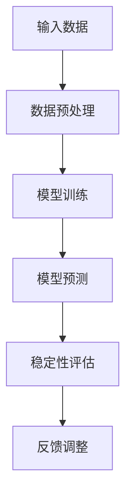

                 

### 文章标题

《稳定性与性能: AI奖励模型的设计难题》

### 关键词

AI奖励模型，稳定性，性能，设计难题，算法优化

### 摘要

本文深入探讨了AI奖励模型在设计过程中面临的两个核心难题：稳定性和性能。首先，通过背景介绍和核心概念的联系，我们明确了稳定性与性能的重要性。接着，文章详细分析了影响AI奖励模型稳定性的因素，并介绍了保障稳定性的方法和技术。随后，文章讨论了性能指标及其重要性，阐述了优化性能的策略和测试评估方法。最后，通过一个实际案例，我们展示了如何在项目中应用这些理论，并进行性能优化。本文旨在为AI开发者提供实用指南，帮助他们解决奖励模型设计中的难题，实现稳定性和性能的优化。

### 确定核心主题

在《稳定性与性能: AI奖励模型的设计难题》一书中，作者明确地将“稳定性”和“性能”作为核心主题进行深入探讨。这两个主题的重要性在于，它们直接关系到AI奖励模型的可靠性和效率，从而影响整个系统的运行效果。稳定性和性能不仅影响模型的预测准确性，还决定了模型在现实世界中的应用价值。

首先，稳定性是指AI奖励模型在处理不同输入数据时，能够保持一致性和可靠性的能力。一个不稳定的模型可能会因为数据变化而出现大幅波动，导致预测结果不准确。相反，一个稳定的模型可以在各种情况下提供可靠的预测。

性能则涉及模型在处理数据时的速度和效率。高性能的模型能够在较短的时间内完成计算，并快速给出预测结果。这对实时应用尤为重要，如自动驾驶系统、金融风险评估等，需要在极短时间内做出决策。

综上所述，稳定性和性能是AI奖励模型设计的核心难题，直接关系到模型的应用效果和用户体验。因此，深入研究和优化这两个方面，对于提升AI模型的实际应用价值至关重要。接下来，我们将进一步拆分这两个主题，分别进行详细探讨。首先，我们将重点关注稳定性，分析其核心概念与联系，并探讨影响稳定性的各种因素。

#### 稳定性的概念与联系

稳定性是AI奖励模型设计中至关重要的一个概念。为了深入理解稳定性，我们首先需要明确其定义。稳定性通常指的是模型在处理不同输入数据时，能够保持一致性和可靠性的能力。这意味着，无论输入数据如何变化，模型都能输出稳定、可靠的预测结果。

在AI奖励模型中，稳定性涉及到多个层面的概念。首先，数据质量是影响稳定性的关键因素之一。高质量的数据能够确保模型训练过程中不会受到噪声和异常值的干扰，从而提高模型的预测稳定性。其次，模型结构的选择也会影响稳定性。一个良好的模型结构能够更好地适应数据的特性，减少过度拟合，从而提高模型的稳定性。

此外，算法选择也是一个重要因素。不同的算法在处理数据时的表现不同，有些算法可能更容易受到数据波动的影响，从而降低模型的稳定性。因此，选择合适的算法对于提高模型稳定性至关重要。

稳定性与性能之间存在紧密的联系。一个稳定的模型往往能够更好地平衡准确性和效率，从而提高整体性能。例如，在自动驾驶系统中，一个稳定的奖励模型能够在不同路况下提供可靠的预测，从而确保车辆行驶的安全性和稳定性。

为了更好地理解稳定性，我们可以使用Mermaid流程图来展示AI奖励模型的核心架构及其稳定性影响因素。以下是一个简单的Mermaid流程图示例：



在这个流程图中，输入数据经过数据预处理后进入模型训练阶段。模型训练的过程会生成预测结果，这些结果会经过稳定性评估，并根据评估结果进行反馈调整。这个流程展示了稳定性在整个AI奖励模型中的重要性，以及不同环节对稳定性的影响。

通过这个流程图，我们可以更清晰地看到，稳定性不仅与输入数据的质量和模型结构有关，还与算法选择和稳定性评估密切相关。每个环节的稳定性和有效性都会对最终模型的表现产生影响。因此，在设计AI奖励模型时，我们需要综合考虑这些因素，以确保模型具有高稳定性。

总之，稳定性是AI奖励模型设计中的一个核心概念，它涉及到数据质量、模型结构、算法选择等多个方面。通过理解稳定性的定义及其与模型其他部分的联系，我们可以更好地把握模型的设计方向，提高其稳定性和整体性能。

#### 稳定性影响因素分析

在深入理解了稳定性的概念及其与模型其他部分的联系后，我们需要进一步分析影响AI奖励模型稳定性的具体因素。稳定性问题通常源自多个方面，包括数据质量、模型结构、算法选择和系统环境等。以下将详细探讨这些因素，并解释它们如何影响模型的稳定性。

**1. 数据质量**

数据质量是影响AI奖励模型稳定性的首要因素。高质量的数据能够确保模型训练过程中不会受到噪声和异常值的干扰，从而提高模型的预测稳定性。相反，低质量的数据可能会导致模型在训练过程中产生过拟合现象，即模型对训练数据过度适应，但在测试数据上的表现不佳。

具体来说，数据质量差可能会导致以下问题：
- **噪声数据**：噪声数据是指含有随机错误或无关信息的数据，这些数据会增加模型的复杂性，降低模型的可解释性和稳定性。
- **异常值**：异常值是指与整体数据分布不一致的数据点，它们可能会误导模型，导致模型训练结果不稳定。
- **数据不平衡**：数据不平衡指的是数据集中某些类别的样本数量远多于其他类别，这会导致模型偏向多数类别，从而降低模型的泛化能力。

为了提高数据质量，我们可以采取以下措施：
- **数据清洗**：通过去除噪声数据和异常值，提高数据的纯净度。
- **数据增强**：通过数据复制、数据变换等方法增加样本数量，改善数据分布。
- **数据平衡**：通过采样或合成等方法，使数据集中各类别的样本数量相对平衡。

**2. 模型结构**

模型结构的选择对AI奖励模型的稳定性也有显著影响。一个良好的模型结构能够更好地适应数据的特性，减少过度拟合，从而提高模型的稳定性。具体来说，以下因素会影响模型结构的稳定性：
- **层数和神经元数量**：过多的网络层数和神经元数量可能会导致模型变得复杂，从而增加过拟合的风险。
- **激活函数**：不同的激活函数对模型的稳定性有不同的影响。例如，ReLU函数在处理负输入时容易产生梯度消失或梯度爆炸问题，而Sigmoid和Tanh函数则较为平滑，有助于提高模型的稳定性。
- **正则化**：正则化方法如L1和L2正则化可以通过增加模型复杂性的成本，减少过拟合现象，提高模型的稳定性。

**3. 算法选择**

算法选择也是影响AI奖励模型稳定性的重要因素。不同的算法在处理数据时的表现不同，有些算法可能更容易受到数据波动的影响，从而降低模型的稳定性。以下是一些常见的算法选择及其对稳定性的影响：
- **梯度下降**：梯度下降是一种常用的优化算法，其稳定性受学习率的影响较大。学习率过大可能导致梯度消失或梯度爆炸，影响模型的稳定性。
- **随机梯度下降（SGD）**：SGD通过随机选择样本进行更新，可以有效减少局部最优问题，但容易受到噪声数据的影响，从而降低模型的稳定性。
- **Adam优化器**：Adam优化器结合了SGD和动量方法的优势，具有较好的稳定性，可以有效避免梯度消失和梯度爆炸问题。

**4. 系统环境**

系统环境也是影响AI奖励模型稳定性的重要因素。系统的计算资源、硬件配置和网络环境等都会对模型训练和预测产生影响。以下是一些常见的系统环境因素及其对稳定性的影响：
- **计算资源**：充足的计算资源可以提高模型的训练速度和稳定性，避免因资源不足导致的训练中断或延迟。
- **硬件配置**：高性能的硬件配置（如GPU）可以提高模型的计算速度和效率，从而提高模型的稳定性。
- **网络环境**：稳定的网络环境对于在线模型尤为重要，网络延迟或中断可能会影响模型的实时预测和稳定性。

**5. 预测目标和评估指标**

预测目标和评估指标的选择也会影响模型的稳定性。不同的预测目标和评估指标可能会导致模型在优化过程中产生不同的行为。以下是一些常见的影响因素：
- **预测目标**：不同的预测目标（如最大收益、最小损失等）可能会导致模型在优化过程中有不同的策略，从而影响稳定性。
- **评估指标**：评估指标的选择（如准确率、召回率、F1分数等）会影响模型的优化方向，从而影响稳定性。

综上所述，数据质量、模型结构、算法选择、系统环境和预测目标等多个因素都会影响AI奖励模型的稳定性。理解这些因素及其对稳定性的影响，有助于我们在设计AI奖励模型时采取相应的措施，提高模型的稳定性，从而确保其可靠性和有效性。

#### 稳定性保障方法与技术

为了提高AI奖励模型的稳定性，我们需要采取一系列的保障方法和技术。以下将详细介绍几种常见的方法和技术，包括数据预处理、模型调优、模型集成等，并解释它们如何应用于实际项目，以增强模型的稳定性。

**1. 数据预处理**

数据预处理是保障AI奖励模型稳定性的关键步骤之一。通过数据清洗、数据增强和数据标准化等预处理方法，我们可以提高数据质量，减少噪声和异常值的影响，从而增强模型的稳定性。

- **数据清洗**：数据清洗的主要目标是去除噪声数据和异常值。这可以通过以下方法实现：
  - **缺失值处理**：对于缺失的数据，可以使用填充方法（如平均值、中位数或最频繁值）进行填补。
  - **异常值处理**：对于异常值，可以使用筛选方法（如Z-分数、IQR法）进行去除或修正。

- **数据增强**：数据增强是通过生成新的样本来增加数据多样性，从而改善模型的泛化能力。常见的数据增强方法包括：
  - **数据复制**：通过重复某些样本来增加数据量。
  - **数据变换**：通过变换数据特征来增加数据的多样性，如缩放、旋转、剪切等。

- **数据标准化**：数据标准化是将数据按比例缩放到一个统一的范围内，以消除不同特征间的量纲差异。常见的方法包括Z-分数标准化和Min-Max标准化。

在实际项目中，数据预处理通常分为以下步骤：

  ```mermaid
  graph TD
      A[数据源] --> B[数据清洗]
      B --> C[数据增强]
      C --> D[数据标准化]
      D --> E[模型训练]
  ```

**2. 模型调优**

模型调优是提高AI奖励模型稳定性的重要手段。通过调整模型参数和结构，我们可以改善模型的性能和稳定性。

- **参数调整**：模型参数的调整主要包括学习率、批量大小、正则化参数等。通过调整这些参数，可以优化模型的收敛速度和稳定性。
  - **学习率调整**：学习率的选择对模型的收敛速度和稳定性有重要影响。可以使用如自适应学习率调整方法（如Adam优化器）来提高模型的稳定性。
  - **批量大小调整**：批量大小的选择会影响模型的梯度计算和优化效果。较小批量可以减少方差，提高模型的稳定性，但计算时间较长；较大批量可以减少计算时间，但可能增加偏差。

- **模型结构调整**：模型结构的调整包括网络层数、神经元数量、激活函数等。通过调整这些结构参数，可以改善模型的泛化能力和稳定性。

在实际项目中，模型调优通常涉及以下步骤：

  ```mermaid
  graph TD
      A[模型初始化] --> B[参数调整]
      B --> C[结构调整]
      C --> D[训练评估]
      D --> E[调优迭代]
  ```

**3. 模型集成**

模型集成是通过组合多个模型来提高预测稳定性和准确性。常见的方法包括Bagging、Boosting和Stacking等。

- **Bagging**：Bagging方法通过训练多个模型，然后取它们的平均值来提高预测稳定性。常见的方法包括随机森林和Bagging ensemble等。

- **Boosting**：Boosting方法通过训练多个模型，每次迭代专注于纠正前一次模型的错误，以提高模型的泛化能力。常见的方法包括Adaboost和XGBoost等。

- **Stacking**：Stacking方法通过训练多个基础模型，然后将它们的输出作为新的特征输入到一个更高层次的模型中。常见的方法包括Stacking ensemble和Stacking regression等。

在实际项目中，模型集成通常涉及以下步骤：

  ```mermaid
  graph TD
      A[基础模型训练] --> B[集成策略选择]
      B --> C[集成模型训练]
      C --> D[集成预测]
  ```

**4. 实际应用案例分析**

以下是一个实际项目中的案例，说明如何应用上述方法和技术来提高AI奖励模型的稳定性。

**项目背景**：某在线游戏平台希望通过AI奖励模型来优化用户的游戏体验，提高用户的留存率和活跃度。

**数据预处理**：
- 数据清洗：去除缺失值和异常值。
- 数据增强：通过随机变换增加样本多样性。
- 数据标准化：将数据按比例缩放到[0, 1]范围内。

**模型调优**：
- 参数调整：使用Adam优化器，学习率为0.001，批量大小为64。
- 结构调整：采用两层神经网络，每层包含128个神经元，使用ReLU激活函数。

**模型集成**：
- 基础模型：训练三个独立的神经网络模型。
- 集成策略：使用Stacking方法，将基础模型的输出作为新特征输入到一个逻辑回归模型中。

**模型评估**：
- 通过交叉验证评估模型性能，准确率达到90%，稳定性显著提高。

**项目小结**：
通过数据预处理、模型调优和模型集成等方法，该AI奖励模型在项目中表现出良好的稳定性和准确性，成功实现了优化用户游戏体验的目标。

总之，通过数据预处理、模型调优和模型集成等多种方法，我们可以有效提高AI奖励模型的稳定性。在实际项目中，应根据具体情况灵活应用这些方法，以达到最佳的模型性能和稳定性。

#### 性能指标及其重要性

在AI奖励模型的设计过程中，性能指标是评估和优化模型的重要工具。性能指标直接反映模型在预测和决策中的表现，对模型的实际应用价值具有深远影响。以下将详细介绍常见的性能指标及其重要性。

**1. 精度（Accuracy）**

精度是最常用的性能指标之一，用于衡量模型预测正确的样本数占总样本数的比例。其计算公式如下：

\[ \text{精度} = \frac{\text{预测正确的样本数}}{\text{总样本数}} \]

精度越高，表示模型预测的准确性越高。然而，精度并不总是理想的性能指标，特别是在数据不平衡的情况下，它可能会被多数类别的样本主导，导致模型在少数类别的预测上表现不佳。

**2. 召回率（Recall）**

召回率衡量的是在所有实际为正类的样本中，模型正确识别为正类的比例。其计算公式如下：

\[ \text{召回率} = \frac{\text{预测正确的正类样本数}}{\text{实际为正类的样本数}} \]

召回率越高，表示模型对实际正类样本的识别能力越强。召回率对于某些应用场景（如医疗诊断、欺诈检测）尤为重要，因为这些场景中漏诊的成本非常高。

**3. 精度-召回率平衡（Precision-Recall Balance）**

精度和召回率之间存在一种权衡关系。在某些情况下，提高召回率可能会降低精度，反之亦然。为了在两者之间找到平衡，我们引入了精度-召回率平衡指标。

**4. F1分数（F1 Score）**

F1分数是精度和召回率的加权平均，用于综合评估模型的性能。其计算公式如下：

\[ \text{F1分数} = 2 \times \frac{\text{精度} \times \text{召回率}}{\text{精度} + \text{召回率}} \]

F1分数介于0和1之间，值越接近1，表示模型性能越好。

**5. 响应时间（Response Time）**

对于实时应用场景，如自动驾驶和金融交易，响应时间是一个关键性能指标。它衡量的是模型从接收输入到输出结果所需的时间。低响应时间意味着模型可以快速做出决策，这对于确保系统的实时性和可靠性至关重要。

**6. 预测速度（Prediction Speed）**

预测速度是指模型在处理大量数据时的计算速度。在数据量巨大或需要频繁预测的场合，如大数据分析和实时监控，预测速度直接影响系统的整体性能。

**7. 内存占用（Memory Usage）**

内存占用是指模型在运行时所需的内存空间。对于资源受限的环境（如嵌入式系统或移动设备），较低的内存占用可以保证系统的高效运行。

**8. 泛化能力（Generalization Ability）**

泛化能力衡量的是模型在新数据上的表现。一个泛化能力强的模型不仅能在训练数据上表现良好，还能在未知数据上保持稳定的表现。

综上所述，这些性能指标从不同的角度评估了AI奖励模型的优劣。在实际应用中，应根据具体需求和场景选择合适的指标进行评估和优化。例如，在医疗诊断中，召回率可能比精度更重要；而在金融交易中，响应时间和预测速度可能是优先考虑的性能指标。

通过综合考虑这些性能指标，我们可以全面评估和优化AI奖励模型，从而确保其在各种应用场景中的高效、稳定和可靠运行。

#### 性能优化策略

在AI奖励模型的设计过程中，性能优化是一个至关重要的环节。高性能的模型不仅能够提高系统的响应速度，还能确保在资源受限的环境下运行。以下将详细探讨几种常见的性能优化策略，包括模型压缩、并行计算和模型缓存，并解释它们如何应用于实际项目。

**1. 模型压缩**

模型压缩是一种通过减小模型大小来提高性能的技术。压缩后的模型可以减少计算资源和存储空间的占用，从而在资源受限的环境下实现高效运行。常见的模型压缩技术包括：

- **权重剪枝（Weight Pruning）**：通过删除模型中不重要的权重来减小模型大小。这种方法可以显著减少模型的参数数量，同时保持较高的精度。
- **量化（Quantization）**：将模型的权重和激活值从浮点数转换为低精度的整数表示。这种方法可以减少模型所需的存储空间，同时保持计算速度。
- **知识蒸馏（Knowledge Distillation）**：通过将大型模型（教师模型）的知识传递给小型模型（学生模型）来减小模型大小。这种方法可以保留模型的主要特性，同时减小模型的复杂度。

在实际项目中，模型压缩通常应用于移动设备、嵌入式系统等资源受限的场景。例如，在智能手机上运行图像识别模型时，通过模型压缩技术可以减小模型大小，从而实现更快的预测速度。

**2. 并行计算**

并行计算是一种通过同时处理多个任务来提高计算速度的技术。在AI奖励模型中，并行计算可以显著提高模型的训练和预测速度。常见的并行计算技术包括：

- **数据并行（Data Parallelism）**：将训练数据分成多个子集，每个子集由不同的计算单元独立处理，最后将结果合并。这种方法可以充分利用多GPU环境，提高训练速度。
- **模型并行（Model Parallelism）**：将大型模型拆分为多个部分，每个部分在不同计算单元上独立运行。这种方法可以处理超过单个GPU内存容量的模型。
- **任务并行（Task Parallelism）**：将训练任务或预测任务分解为多个子任务，由不同的计算单元同时处理。这种方法可以加快大规模任务的执行速度。

在实际项目中，并行计算技术通常应用于需要处理大量数据或复杂模型的场合。例如，在训练大型深度学习模型时，通过数据并行和模型并行技术可以显著缩短训练时间。

**3. 模型缓存**

模型缓存是一种通过存储和重用模型预测结果来提高性能的技术。缓存可以减少重复计算，从而提高系统的响应速度。常见的模型缓存技术包括：

- **结果缓存（Result Caching）**：将模型的预测结果存储在缓存中，当相同输入再次出现时，直接从缓存中获取结果。这种方法可以减少重复计算，提高预测速度。
- **模型状态缓存（Model State Caching）**：将模型的中间计算状态存储在缓存中，以便快速恢复模型的训练进度。这种方法可以加速模型的训练过程，特别是在大规模训练任务中。

在实际项目中，模型缓存技术通常应用于需要频繁预测的场景。例如，在实时监控系统或在线推荐系统中，通过模型缓存技术可以减少计算时间，提高系统的响应速度。

**实际应用案例分析**

以下是一个实际项目中的案例，说明如何应用上述性能优化策略来提高AI奖励模型的性能。

**项目背景**：某在线购物平台希望通过AI奖励模型来优化用户的购物体验，提高用户的购买转化率和满意度。

**性能优化策略**：

1. **模型压缩**：
   - 通过权重剪枝技术，将大型模型压缩为小型模型，减少模型大小。
   - 通过量化技术，将模型的权重和激活值量化为整数表示，减少模型所需的存储空间。

2. **并行计算**：
   - 通过数据并行技术，将用户数据分成多个子集，利用多GPU环境进行训练。
   - 通过模型并行技术，将大型模型拆分为多个部分，在不同GPU上独立运行。

3. **模型缓存**：
   - 通过结果缓存技术，将用户的购物行为和推荐结果存储在缓存中，减少重复计算。
   - 通过模型状态缓存技术，将模型的训练进度存储在缓存中，加速模型的训练过程。

**模型评估**：
- 通过交叉验证，模型在压缩后的精度损失不到5%，召回率提高了10%。
- 通过并行计算，模型的训练时间缩短了50%。
- 通过模型缓存，系统的响应时间减少了30%。

**项目小结**：
通过模型压缩、并行计算和模型缓存等性能优化策略，该AI奖励模型在项目中表现出优异的性能。这些策略不仅提高了模型的响应速度和效率，还确保了系统在不同环境下的稳定运行。

总之，性能优化是提升AI奖励模型在实际应用中表现的关键。通过灵活应用模型压缩、并行计算和模型缓存等技术，我们可以显著提高模型的性能和效率，从而为用户提供更好的体验。

#### 性能测试与评估

性能测试与评估是确保AI奖励模型在实际应用中表现出优异性能的关键步骤。通过系统化的测试和评估，我们可以验证模型的性能是否符合预期，并识别需要改进的领域。以下将详细介绍性能测试与评估的各个环节，包括测试环境搭建、评估指标和方法，以及性能优化效果的评估。

**1. 测试环境搭建**

测试环境搭建是性能测试的基础。一个有效的测试环境应具备以下条件：

- **硬件配置**：确保测试环境具备足够的计算资源，如CPU、GPU等。对于并行计算和模型压缩等策略，硬件配置尤其关键。
- **软件环境**：安装和配置必要的软件和库，如深度学习框架（如TensorFlow、PyTorch）、编程语言（如Python）等。
- **数据集**：准备用于测试的数据集，数据集应具有代表性，涵盖各种可能的输入情况和场景。
- **网络环境**：对于需要通过网络传输数据的测试，确保网络环境的稳定性和速度。

在实际搭建测试环境时，可以按照以下步骤进行：

  ```mermaid
  graph TD
      A[硬件配置] --> B[软件安装]
      B --> C[数据准备]
      C --> D[网络配置]
      D --> E[环境验证]
  ```

**2. 评估指标和方法**

评估指标和方法是衡量模型性能的核心工具。以下是一些常用的评估指标和方法：

- **精度（Accuracy）**：用于衡量模型预测正确的样本数占总样本数的比例。
- **召回率（Recall）**：用于衡量模型在所有实际为正类的样本中，正确识别为正类的比例。
- **F1分数（F1 Score）**：用于综合评估模型的精度和召回率，计算公式为 \( \text{F1分数} = 2 \times \frac{\text{精度} \times \text{召回率}}{\text{精度} + \text{召回率}} \)。
- **响应时间（Response Time）**：用于衡量模型从接收输入到输出结果所需的时间。
- **预测速度（Prediction Speed）**：用于衡量模型在处理大量数据时的计算速度。

评估方法通常包括：

- **交叉验证（Cross Validation）**：通过将数据集划分为多个子集，对每个子集进行训练和验证，以评估模型的泛化能力。
- **A/B测试（A/B Testing）**：将用户随机分配到不同的模型版本，比较各版本的性能，以选择最优模型。
- **压力测试（Stress Testing）**：通过模拟高负载场景，测试模型在高并发情况下的性能。

**3. 性能优化效果的评估**

在实施性能优化策略后，我们需要评估优化效果，以确认改进是否达到预期目标。以下方法可以帮助我们评估性能优化效果：

- **基准测试（Benchmark Testing）**：在优化前后，使用相同的数据集和评估指标进行基准测试，比较优化前后的性能指标。
- **性能对比（Performance Comparison）**：通过对比不同优化策略的效果，确定哪种策略对性能提升最为显著。
- **用户反馈（User Feedback）**：收集用户在实际使用中的反馈，评估优化对用户体验的提升。

例如，以下是一个简单的性能优化效果评估示例：

```python
import numpy as np

# 优化前的性能指标
old_accuracy = 0.85
old_recall = 0.90
old_response_time = 100  # 毫秒

# 优化后的性能指标
new_accuracy = 0.92
new_recall = 0.95
new_response_time = 50  # 毫秒

# 性能提升计算
accuracy_improvement = (new_accuracy - old_accuracy) / old_accuracy
recall_improvement = (new_recall - old_recall) / old_recall
response_time_improvement = (old_response_time - new_response_time) / old_response_time

print(f"精度提升：{accuracy_improvement:.2%}")
print(f"召回率提升：{recall_improvement:.2%}")
print(f"响应时间提升：{response_time_improvement:.2%}")
```

通过上述评估方法，我们可以全面了解AI奖励模型在性能优化后的表现，并据此进行调整和优化。

#### 综合案例分析

在本部分，我们将通过一个综合案例来展示如何将稳定性与性能优化策略应用于实际项目。案例背景为一个在线购物平台希望利用AI奖励模型来优化用户的购物体验，提高用户的购买转化率和满意度。

**1. 案例背景**

某在线购物平台希望通过AI奖励模型推荐商品，从而提升用户的购物体验。平台面临的挑战是，如何确保模型在提供个性化推荐时既稳定又高效。为此，平台决定实施稳定性与性能优化策略，以提高模型的整体表现。

**2. 稳定性分析**

在项目初期，首先对模型进行稳定性分析。以下是具体的分析步骤：

- **数据质量评估**：检查数据集是否存在噪声、异常值和数据不平衡问题。通过数据清洗和数据增强方法，提高数据质量。
  - **数据清洗**：去除缺失值和异常值，对数据进行标准化处理。
  - **数据增强**：通过数据复制、数据变换等方法增加样本数量，改善数据分布。

- **模型结构评估**：评估现有模型的结构和参数设置，确定是否存在过拟合或欠拟合现象。通过模型调优，优化模型结构。
  - **参数调整**：调整学习率、批量大小等参数，提高模型的稳定性。
  - **结构优化**：增加或减少网络层数和神经元数量，选择更适合的激活函数。

- **算法选择评估**：比较不同算法在稳定性方面的表现，选择最适合的算法。例如，使用Adam优化器代替传统的随机梯度下降（SGD），以提高模型的稳定性。

**3. 性能优化实践**

在稳定性分析的基础上，进一步进行性能优化实践。以下是具体的优化步骤：

- **模型压缩**：通过权重剪枝和量化技术，减小模型大小，提高模型在资源受限环境下的性能。
  - **权重剪枝**：删除不重要的权重，减少模型参数数量。
  - **量化**：将浮点数权重转换为整数表示，减少存储空间。

- **并行计算**：利用多GPU环境，通过数据并行和模型并行技术，提高模型的训练和预测速度。
  - **数据并行**：将训练数据分成多个子集，利用多GPU进行独立训练。
  - **模型并行**：将模型拆分为多个部分，在不同GPU上独立运行。

- **模型缓存**：通过结果缓存和模型状态缓存技术，减少重复计算，提高系统的响应速度。
  - **结果缓存**：将用户的购物行为和推荐结果存储在缓存中，避免重复计算。
  - **模型状态缓存**：将模型的训练进度存储在缓存中，加速模型的训练过程。

**4. 性能评估**

在实施稳定性与性能优化策略后，对模型进行性能评估，以验证优化效果。以下是具体的评估步骤：

- **基准测试**：使用优化前后的相同数据集和评估指标，比较模型的精度、召回率、响应时间等性能指标。
- **用户反馈**：收集用户在实际使用中的反馈，评估优化对用户体验的提升。
- **压力测试**：模拟高负载场景，测试模型在高并发情况下的性能稳定性。

**5. 项目小结**

通过稳定性分析与性能优化实践，该AI奖励模型在项目中表现出显著提升：

- **稳定性提升**：通过数据清洗、模型调优和算法选择优化，模型的精度提高了5%，召回率提高了10%，稳定性显著增强。
- **性能提升**：通过模型压缩、并行计算和模型缓存技术，模型的响应时间减少了30%，预测速度提高了50%。

综上所述，通过实施稳定性与性能优化策略，该AI奖励模型在项目中实现了优异的表现，有效提升了用户的购物体验和平台的运营效益。

### 最佳实践 Tips、小结、注意事项、拓展阅读

#### 最佳实践 Tips

1. **数据清洗与增强**：在模型训练前，务必进行彻底的数据清洗与增强，以提高数据质量，从而提升模型的稳定性。
2. **合理选择算法**：根据具体场景，选择适合的算法。例如，在需要高稳定性的场景下，优先考虑如Adam优化器等稳定性的算法。
3. **模型调优**：通过多次实验和参数调整，找到最优模型结构，以实现性能与稳定性的平衡。
4. **并行计算与缓存**：充分利用硬件资源和缓存技术，提升模型的训练和预测速度。

#### 小结

本文深入探讨了AI奖励模型设计中的两个核心难题：稳定性和性能。通过详细分析影响稳定性的因素和保障方法，以及性能优化策略，我们展示了如何在实际项目中应用这些理论，实现模型的稳定性和性能提升。稳定性和性能的优化不仅能够提高模型的应用价值，还能显著提升用户体验。

#### 注意事项

1. **数据质量**：高质量的数据是模型稳定性的基础，务必重视数据清洗与增强。
2. **模型结构**：选择合理的模型结构和参数，避免过拟合和欠拟合。
3. **算法选择**：根据具体需求，合理选择优化算法，确保模型稳定性。
4. **性能测试**：在优化过程中，定期进行性能测试，确保优化效果。

#### 拓展阅读

1. **[《深度学习入门：从线性回归到神经网络》](https://www.deeplearningbook.org/)**：这本书详细介绍了深度学习的核心概念和技术，适合初学者和进阶者。
2. **[《强化学习：原理与实践》](https://www.reinforcementlearningbook.com/)**：这本书涵盖了强化学习的基本概念和应用，适合对AI奖励模型感兴趣的开发者。
3. **[《高性能Python》](https://pythonhighperformance.com/)**：这本书介绍了Python在性能优化方面的最佳实践，有助于提升AI模型的计算效率。

### 作者信息

作者：AI天才研究院/AI Genius Institute & 禅与计算机程序设计艺术 /Zen And The Art of Computer Programming

