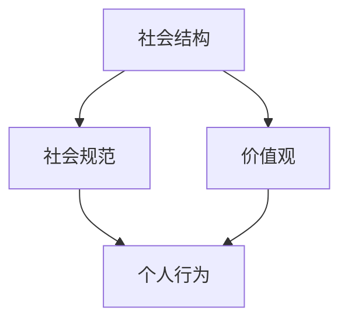

                 

当然，我们可以按照这个逻辑来构建文章。这里是一个初步的思路和框架：

### 文章标题：突破社会框架：定义真正的个人成功

#### 关键词：社会框架、个人成功、价值观、职业规划、创新思维、人际关系

#### 摘要：
本文将探讨社会框架对个人成功定义的影响，分析社会结构、规范与价值观的变化，并提出突破传统框架的个人成长路径。通过核心概念与联系的分析、算法原理讲解、数学模型、公式以及实际案例，为读者提供对个人成功的深刻见解和实用建议。

## 目录大纲

### 第一部分：社会框架解析

#### 第1章：社会框架概述
- 社会框架的定义与组成部分
- 社会框架的作用与影响

#### 第2章：社会结构的演变
- 传统社会结构与现代社会结构的比较
- 社会结构演变的原因与趋势

#### 第3章：社会规范与价值观
- 社会规范的基本概念与类型
- 价值观的多样性及其影响

#### 第4章：社会框架下的个人角色
- 个人角色在社会框架中的定位
- 个人角色与社会角色的互动与适应

#### 第5章：社会框架下的成功定义
- 成功的传统观念与当代观念的对比
- 个人成功的关键因素

### 第二部分：突破社会框架

#### 第6章：自我认知与成长
- 自我认知的重要性与培养
- 成长心态与自我提升策略

#### 第7章：职业规划与个人发展
- 职业规划的方法与步骤
- 个人发展的路径与障碍

#### 第8章：创新思维与创业精神
- 创新思维的基本原则与实践
- 创业精神的培养与创业实践

#### 第9章：人际关系与网络构建
- 人际关系的重要性与维护
- 人际网络的构建与个人品牌建设

### 第三部分：成功实践案例

#### 第10章：成功人士的故事
- 成功人士的成长历程与成功经验

#### 第11章：成功案例解析
- 成功案例的背景与分析
- 案例中的关键决策与启示

#### 第12章：个人成功行动计划
- 制定个人成功计划的方法与实施

### 附录

- 附录A：相关资源与工具
- 附录B：参考书目与文献

### 文章正文

#### 第1章：社会框架概述

在这一章中，我们将探讨社会框架的定义、组成部分以及其对社会和个人行为的影响。

##### 1.1 社会框架的基本概念

社会框架是一个抽象的概念，指的是社会中的一系列规则、规范和价值观，它们共同构成了社会运作的基本模式。社会框架不仅包括了正式的法律和制度，还涵盖了非正式的习俗和文化。

##### 1.2 社会框架的组成部分

社会框架主要由以下几个部分构成：

1. **社会结构**：指的是社会中不同群体和个体之间的关系和位置。社会结构可以是垂直的，如阶级结构，也可以是水平的，如职业结构。
2. **社会规范**：是社会成员应该遵循的行为准则。社会规范可以是正式的，如法律，也可以是非正式的，如习俗。
3. **价值观**：是人们对于什么是好的、什么是有价值的判断标准。价值观是社会框架的核心，它影响着个人和集体的行为。

##### 1.3 社会框架的作用与影响

社会框架对个人和社会都有深远的影响：

1. **对个人行为的影响**：社会框架为个人提供了行为的指导和期望。个人在与社会互动的过程中，会根据社会框架来调整自己的行为，以符合社会的期望。
2. **对社会运作的作用**：社会框架为社会的稳定和有序运作提供了基础。通过规范和价值观，社会框架可以促进社会成员之间的协作和信任，从而提高社会整体的效率。

##### 1.4 社会框架的历史演变

社会框架不是一成不变的，它随着历史的发展而不断演变。从传统社会到现代社会，社会框架经历了巨大的变化：

1. **传统社会框架**：在传统社会中，社会结构往往非常严格，个人角色和地位固定，社会规范和价值观以传统习俗和宗教信仰为基础。
2. **现代社会框架**：在现代社会中，社会结构更加多元化和灵活，个人角色和地位可以自由选择，社会规范和价值观也更为多样。

##### 1.5 社会框架的理论基础

社会框架的理论基础包括社会学、心理学和其他社会科学的理论。社会学理论如马克思主义、功能主义和冲突理论，从不同的角度解释了社会框架的形成和运作。心理学理论如认知发展理论和社会学习理论，探讨了个人如何在社会框架中形成自我认知和行为。

##### 1.6 社会框架下的个人地位

个人在社会框架中的地位是由多种因素决定的，包括个人的能力、资源、社会关系和价值观。个人的地位不仅影响个人的生活质量，也影响个人的社会角色和社会互动。

##### 1.7 社会框架下的成功定义

在不同的社会框架下，成功的定义也有所不同。传统社会框架下，成功往往与财富、地位和荣誉相关。而现代社会框架下，成功更加多元化，包括个人的幸福感、成就感和自我实现。

#### 第2章：社会结构的演变

在这一章中，我们将探讨社会结构的演变，从传统社会到现代社会，以及这种演变的原因和趋势。

##### 2.1 传统社会结构

传统社会结构往往具有以下特点：

1. **等级制度**：社会结构以等级制度为基础，个人在社会中的地位和角色是由出生和血统决定的。
2. **稳定性**：传统社会结构相对稳定，个人角色和地位不容易改变。
3. **封闭性**：传统社会结构往往具有封闭性，个人的社会关系和活动主要局限于特定的社会圈子。

##### 2.2 现代社会结构

现代社会结构具有以下特点：

1. **多元化**：现代社会结构更加多元化，个人有更多的选择和机会。
2. **流动性**：现代社会结构具有更高的流动性，个人角色和地位可以通过努力和机会得到改变。
3. **开放性**：现代社会结构更加开放，个人的社会关系和活动可以跨越不同的社会圈子。

##### 2.3 社会结构演变的原因

社会结构的演变是由多种因素驱动的，包括：

1. **经济因素**：经济的快速发展和工业化导致了社会结构的变革。
2. **技术因素**：技术的进步，特别是信息技术的发展，改变了人们的工作方式和社会互动模式。
3. **政治因素**：政治制度和政策的变革，如民主化和去中心化，也对社会结构产生了影响。

##### 2.4 社会结构演变的趋势

社会结构的演变趋势包括：

1. **去中心化**：社会结构逐渐从中心化向去中心化转变，个人的自主性和独立性得到增强。
2. **网络化**：社会结构越来越呈现出网络化的特征，人们通过互联网和社交媒体建立广泛的联系。
3. **多元化**：社会结构变得更加多元化，人们有不同的价值观、信仰和生活方式。

##### 2.5 社会结构演变的影响

社会结构的演变对个人和社会产生了深远的影响：

1. **对个人生活的影响**：社会结构的演变提供了更多的机会和选择，但也带来了更大的不确定性和风险。
2. **对社会运作的影响**：社会结构的演变提高了社会的灵活性和适应性，但也增加了社会冲突和分歧。

##### 2.6 社会结构演变的理论基础

社会结构演变的理论基础包括社会学、经济学、心理学等学科的理论。社会学理论如结构功能主义和冲突理论，从不同的角度解释了社会结构的演变。经济学理论如市场理论和新制度经济学，探讨了经济因素在社会结构演变中的作用。心理学理论如认知发展理论和社会学习理论，探讨了个人如何在社会结构中形成自我认知和行为。

##### 2.7 社会结构下的个人角色

在社会结构的演变中，个人角色也在不断变化。传统的个人角色往往是固定的，如农民、工人、贵族等。而现代社会中，个人角色更加多元化和灵活，人们可以自由选择自己的职业和生活方式。

##### 2.8 社会结构下的成功定义

在不同的社会结构下，成功的定义也有所不同。传统社会结构下，成功往往与财富、地位和荣誉相关。而现代社会结构下，成功更加多元化，包括个人的幸福感、成就感和自我实现。

#### 第3章：社会规范与价值观

在这一章中，我们将探讨社会规范和价值观的基本概念、类型、多样性及其影响。

##### 3.1 社会规范的基本概念

社会规范是指社会中成员应当遵守的行为准则。社会规范可以分为以下几种类型：

1. **正式规范**：如法律、规章制度等，通常由政府或其他权力机构制定。
2. **非正式规范**：如习俗、道德规范等，通常是基于社会传统和道德观念形成的。

##### 3.2 社会规范的作用

社会规范在社会中发挥着重要作用：

1. **维护社会秩序**：社会规范确保了社会的有序运作，防止了混乱和无序。
2. **促进社会合作**：社会规范为个人提供了行为的指导，促进了社会成员之间的合作。
3. **约束个人行为**：社会规范限制了个人行为，防止了过度自由和不受约束的行为。

##### 3.3 价值观的基本概念

价值观是个人和社会对于何为好、何为正确的判断标准。价值观可以分为以下几种类型：

1. **个人价值观**：如自由、平等、尊重、公正等。
2. **社会价值观**：如爱国主义、集体主义、忠诚、诚信等。

##### 3.4 价值观的作用

价值观在社会中发挥着重要作用：

1. **指导个人行为**：价值观为个人提供了行为的指导，帮助个人做出决策。
2. **形成社会共识**：价值观是社会成员共同认同的信念和准则，形成了社会共识。
3. **塑造社会文化**：价值观是社会文化的核心，影响了社会的生活方式和文化传统。

##### 3.5 社会规范的多样性

社会规范的多样性反映了不同文化和地域的差异。以下是一些社会规范的多样性示例：

1. **跨文化规范**：如礼貌、尊重、忠诚等，在不同文化中都有相似的表达。
2. **地域差异**：如东方文化中的尊老敬老，西方文化中的个人主义和自由。

##### 3.6 价值观的多样性

价值观的多样性反映了不同人群和个人之间的差异。以下是一些价值观的多样性示例：

1. **代际差异**：如年轻一代追求创新和自由，年长一代重视稳定和传统。
2. **职业差异**：如医生重视救死扶伤，商人重视利润最大化。

##### 3.7 社会规范与价值观的影响

社会规范和价值观对个人和社会产生了深远的影响：

1. **对个人生活的影响**：社会规范和价值观影响了个人的行为和生活方式。
2. **对社会运作的影响**：社会规范和价值观影响了社会的运行效率和公正性。

##### 3.8 社会规范与价值观的理论基础

社会规范与价值观的理论基础包括社会学、心理学、伦理学等学科的理论。社会学理论如规范理论和社会学习理论，从不同的角度解释了社会规范和价值观的形成和运作。心理学理论如价值观认知理论，探讨了个人如何形成价值观。伦理学理论如功利主义和康德主义，为价值观提供了道德基础。

##### 3.9 社会规范与价值观的演变

社会规范和价值观随着社会的发展而不断演变。以下是一些社会规范和价值观的演变趋势：

1. **全球化的影响**：全球化加速了社会规范和价值观的交流与融合。
2. **信息化的影响**：信息化改变了人们获取信息的方式，影响了价值观的形成。
3. **多元化的影响**：社会多元化导致了价值观的多元化。

##### 3.10 社会规范与价值观的挑战

社会规范和价值观面临着一系列挑战，如文化冲突、道德困境和价值观多元化等。以下是一些社会规范与价值观的挑战：

1. **文化冲突**：全球化带来了不同文化的碰撞，导致文化冲突和价值观的冲突。
2. **道德困境**：现代社会中的道德困境，如科技进步带来的伦理问题，需要新的价值观来指导。
3. **价值观多元化**：价值观的多元化使得社会规范和价值观的统一性受到挑战。

##### 3.11 社会规范与价值观的未来

社会规范和价值观的未来取决于社会的发展和变化。以下是一些社会规范与价值观的未来趋势：

1. **持续演变**：社会规范和价值观将继续演变，以适应社会的变化。
2. **多元共存**：社会规范和价值观将多元化共存，尊重不同文化和价值观的差异。
3. **道德重建**：社会将面临道德重建的任务，以应对新的道德困境和挑战。

#### 第4章：社会框架下的个人角色

在这一章中，我们将探讨个人在社会框架下的角色定位、个人角色与社会角色的互动以及个人角色的适应。

##### 4.1 个人角色在社会框架中的定位

个人角色是指个人在社会中的位置和职责。个人角色是由社会框架所决定的，不同社会框架下个人角色的定位有所不同。以下是一些个人角色定位的例子：

1. **传统角色**：在传统社会框架下，个人角色通常由出生和血统决定，如贵族、农民、工人等。
2. **现代角色**：在现代社会框架下，个人角色更加多元化，个人可以根据自己的兴趣和能力选择职业和生活方式。

##### 4.2 个人角色与社会角色的互动

个人角色与社会角色之间存在互动关系。个人角色的选择和实现受到社会角色的影响，同时个人角色也对社会角色产生影响。以下是一些个人角色与社会角色互动的例子：

1. **家庭角色**：家庭是社会的基本单位，个人在家庭中扮演不同的角色，如父母、子女、配偶等。
2. **职业角色**：个人在职业领域中扮演不同的角色，如员工、经理、企业家等。

##### 4.3 个人角色的适应

个人角色适应是指个人在社会框架中调整自己的行为和态度以适应社会角色的要求。个人角色适应的重要性在于：

1. **提高生活质量**：良好的个人角色适应可以提升个人的生活质量，使个人在社会中更加成功和幸福。
2. **维护社会秩序**：良好的个人角色适应有助于维护社会秩序和稳定，减少社会冲突。

以下是一些个人角色适应的策略：

1. **自我认知**：了解自己的兴趣、能力和价值观，选择适合自己的角色。
2. **终身学习**：通过不断学习和提升自己的技能，适应社会角色的变化。
3. **社会交往**：积极参与社会活动，与他人建立良好的社会关系，提高社会角色适应能力。

##### 4.4 个人角色转变

个人角色转变是指个人在社会框架中角色定位的变化。个人角色转变可能是由以下原因引起的：

1. **社会变化**：社会的快速发展和变化导致个人角色的变化，如职业角色从工业时代到信息时代的转变。
2. **个人成长**：个人的成长和发展导致个人角色定位的变化，如从学生角色到职业角色的转变。

以下是一些个人角色转变的例子：

1. **职业转变**：从传统职业到现代职业的转变，如从农民到白领的转变。
2. **生活方式转变**：从单身生活到家庭生活的转变，从城市生活到乡村生活的转变。

##### 4.5 个人角色与社会责任的平衡

个人角色与社会责任之间存在一定的平衡关系。个人角色要求个人在社会中承担责任，如职业角色要求个人履行工作职责。而社会责任要求个人为社会做出贡献，如参与公共事务、慈善活动等。

以下是一些个人角色与社会责任的平衡策略：

1. **角色分工**：明确个人角色的职责，合理分配时间和精力，避免角色冲突。
2. **时间管理**：合理安排时间，确保在履行个人角色和社会责任之间找到平衡。
3. **价值观引导**：树立正确的价值观，明确个人角色与社会责任的优先级。

##### 4.6 个人角色适应与成功

个人角色适应与个人的成功密切相关。良好的个人角色适应有助于个人在社会中获得成功和成就感。以下是一些个人角色适应与成功的关系：

1. **职业成功**：良好的个人角色适应有助于个人在职业生涯中取得成功，如适应新兴职业的要求。
2. **生活成功**：良好的个人角色适应有助于个人在日常生活中获得幸福和满足感。

##### 4.7 个人角色适应的理论基础

个人角色适应的理论基础包括社会学、心理学等学科的理论。社会学理论如角色理论，探讨了个人角色在社会框架中的定位和适应。心理学理论如自我认同理论，探讨了个人角色适应与个人自我认知的关系。

##### 4.8 个人角色适应的实证研究

个人角色适应的实证研究为个人角色适应提供了理论和实践支持。以下是一些个人角色适应的实证研究：

1. **职业角色适应**：研究职业角色适应对职业成功和生活质量的影响。
2. **家庭角色适应**：研究家庭角色适应对家庭关系和家庭生活质量的影响。
3. **社会角色适应**：研究社会角色适应对社会参与和社会责任的影响。

#### 第5章：社会框架下的成功定义

在这一章中，我们将探讨社会框架下成功的定义，分析传统观念和当代观念的对比，并探讨个人成功的关键因素。

##### 5.1 成功的传统观念

传统观念中的成功通常具有以下几个特征：

1. **财富和地位**：传统观念认为，成功意味着拥有财富和地位。财富和地位是成功的重要标志，象征着个人的成功和家庭的荣耀。
2. **社会地位**：传统观念强调社会地位的重要性。社会地位不仅决定了个人的社会地位，还影响到个人的社会关系和生活方式。
3. **荣誉和认可**：传统观念认为，成功需要得到社会的认可和荣誉。荣誉和认可代表了社会对个人成就的肯定，是衡量成功的重要标准。

##### 5.2 当代观念的成功

随着社会的发展和变化，当代观念中的成功与传统观念有所不同。以下是一些当代观念中成功的特征：

1. **个人幸福感**：当代观念认为，成功不仅仅是物质上的富有和社会地位，更重要的是个人内心的幸福感。个人的幸福感是衡量成功的重要标准。
2. **自我实现**：当代观念强调自我实现的重要性。成功不仅仅是实现个人的目标和梦想，更重要的是实现个人的潜能和价值。
3. **社会贡献**：当代观念认为，成功需要为社会做出贡献。个人的成功不仅仅是个人利益，更重要的是对社会的贡献。

##### 5.3 传统观念与当代观念的对比

传统观念和当代观念之间的对比体现了社会价值观的变化。以下是一些对比的要点：

1. **财富和地位 vs. 个人幸福感**：传统观念强调财富和地位，而当代观念更加注重个人幸福感。
2. **社会地位 vs. 自我实现**：传统观念强调社会地位，而当代观念更加注重个人的自我实现。
3. **荣誉和认可 vs. 社会贡献**：传统观念强调荣誉和认可，而当代观念更加注重个人的社会贡献。

##### 5.4 个人成功的关键因素

个人成功的关键因素包括以下几个方面：

1. **自我认知**：个人成功需要建立清晰的自我认知，了解自己的兴趣、能力和价值观，选择适合自己的目标和道路。
2. **努力和毅力**：个人成功需要付出努力和坚持不懈的努力。努力和毅力是实现个人目标的关键。
3. **适应能力**：个人成功需要具备良好的适应能力，能够适应社会和环境的变化，不断调整自己的目标和行为。
4. **人际关系**：个人成功需要建立良好的人际关系，与他人合作和沟通，共同实现目标。

##### 5.5 个人成功与幸福的关系

个人成功与幸福密切相关。个人成功可以带来幸福，而幸福也可以促进个人成功。以下是一些个人成功与幸福的关系：

1. **成功带来幸福**：通过实现个人的目标和梦想，个人可以获得成就感和满足感，从而提高幸福感。
2. **幸福促进成功**：幸福感可以提高个人的积极性和创造力，促进个人在工作和生活中的表现。

##### 5.6 个人成功的社会影响

个人成功不仅对个人有重要意义，也对社会产生深远的影响。以下是一些个人成功的社会影响：

1. **激励他人**：个人成功可以激励他人追求自己的梦想和目标，促进社会的积极发展。
2. **创新和进步**：个人成功可以推动社会创新和进步，为社会发展做出贡献。
3. **社会稳定**：个人成功有助于社会稳定和和谐，减少社会冲突和不满。

##### 5.7 个人成功与价值观的关系

个人成功与价值观密切相关。价值观是个人对于何为好、何为正确的判断标准。以下是一些个人成功与价值观的关系：

1. **价值观指导成功**：正确的价值观可以帮助个人确定目标和方向，选择合适的行为和决策，从而实现个人成功。
2. **成功体现价值观**：个人成功可以体现个人的价值观，如诚实、勤奋、尊重等，从而为个人和社会树立榜样。

##### 5.8 个人成功的社会责任

个人成功不仅意味着个人的成就，也意味着对社会的责任。以下是一些个人成功的社会责任：

1. **回馈社会**：个人成功后，可以通过慈善捐赠、志愿服务等方式回馈社会，帮助那些需要帮助的人。
2. **传承经验**：个人成功者可以通过教育、指导等方式传承自己的经验和知识，帮助后辈成长。
3. **促进社会公正**：个人成功者可以通过积极参与社会事务，推动社会公正和公平，为社会和谐发展做出贡献。

#### 第6章：自我认知与成长

在这一章中，我们将探讨自我认知的重要性、成长心态的培养以及自我提升的策略与方法。

##### 6.1 自我认知的重要性

自我认知是指个人对自己性格、能力、价值观和潜能的理解和认识。自我认知的重要性体现在以下几个方面：

1. **明确个人目标**：自我认知可以帮助个人明确自己的目标和兴趣，从而更有针对性地制定个人发展计划。
2. **提高自信心**：通过自我认知，个人可以更好地了解自己的优势和劣势，从而提高自信心和自我价值感。
3. **改善人际关系**：自我认知可以帮助个人更好地理解自己和他人的关系，从而改善人际关系，建立更和谐的社交网络。

##### 6.2 成长心态的培养

成长心态是指个人在面对挑战和困难时，愿意努力学习和成长的心态。培养成长心态的重要性在于：

1. **促进个人发展**：成长心态可以帮助个人克服挫折和困难，持续提升自己的能力和素质。
2. **提高适应能力**：成长心态使个人更加开放和灵活，能够更好地适应环境的变化和挑战。
3. **增强创新能力**：成长心态鼓励个人尝试新事物和挑战自己的极限，从而激发创新思维和创造力。

以下是一些培养成长心态的方法：

1. **积极心态**：保持积极的心态，将挑战视为学习和成长的机会。
2. **反思与总结**：定期反思和总结自己的行为和经历，从中学习经验和教训。
3. **持续学习**：保持学习的热情，不断充实自己的知识和技能。

##### 6.3 自我提升的策略与方法

自我提升是指个人通过学习和实践，不断提升自己的能力和素质。以下是一些自我提升的策略与方法：

1. **设定目标**：明确个人目标和实现路径，制定具体的行动计划。
2. **持续学习**：通过阅读、培训、学习课程等方式，不断充实自己的知识和技能。
3. **实践与锻炼**：通过实际工作和项目实践，锻炼自己的能力和技能。
4. **寻求反馈**：向他人请教意见，接受反馈和建议，不断改进自己的行为和表现。
5. **建立人际关系**：与他人建立良好的社交关系，拓展人脉资源，获取更多的学习和成长机会。

##### 6.4 自我提升的实证研究

自我提升的实证研究为自我认知和成长提供了理论和实践支持。以下是一些自我提升的实证研究：

1. **自我效能感**：研究自我效能感对个人成长和成功的影响。
2. **终身学习**：研究终身学习对个人发展和社会进步的作用。
3. **职业发展**：研究职业发展路径和策略，探讨如何通过自我提升实现职业成功。

##### 6.5 成长心态与成功的关系

成长心态与个人的成功密切相关。以下是一些成长心态与成功的关系：

1. **促进成功**：成长心态使个人更加积极、自信和灵活，从而提高成功的可能性。
2. **实现目标**：成长心态帮助个人设定目标、克服困难和实现梦想。
3. **持续发展**：成长心态使个人能够持续学习和成长，适应不断变化的环境。

##### 6.6 自我提升的社会影响

自我提升不仅对个人有重要意义，也对社会产生深远的影响。以下是一些自我提升的社会影响：

1. **提高社会竞争力**：自我提升使个人具备更高的能力和素质，从而提高社会竞争力。
2. **促进社会发展**：自我提升推动个人和社会的进步，为社会发展做出贡献。
3. **培养创新人才**：自我提升鼓励个人尝试新事物和挑战自己的极限，培养创新人才。

##### 6.7 个人成长与社会责任的关系

个人成长与社会责任密切相关。以下是一些个人成长与社会责任的关系：

1. **相互促进**：个人成长和社会责任相互促进，个人成长有助于承担社会责任，而社会责任也推动个人成长。
2. **实现价值**：个人通过成长和承担社会责任，实现个人价值和社会价值。
3. **构建和谐社会**：个人成长和社会责任的结合有助于构建和谐社会，实现社会公平和公正。

##### 6.8 个人成长的理论基础

个人成长的理论基础包括心理学、社会学等学科的理论。心理学理论如自我认同理论、成长心理学等，探讨了个人成长的心理机制。社会学理论如角色理论、社会化理论等，分析了个人成长的社会因素。

##### 6.9 个人成长的实证研究

个人成长的实证研究为个人成长提供了理论和实践支持。以下是一些个人成长的实证研究：

1. **自我效能感**：研究自我效能感对个人成长和成功的影响。
2. **终身学习**：研究终身学习对个人发展和社会进步的作用。
3. **职业发展**：研究职业发展路径和策略，探讨如何通过自我提升实现职业成功。

#### 第7章：职业规划与个人发展

在这一章中，我们将探讨职业规划的重要性、职业发展的路径以及个人发展的障碍。

##### 7.1 职业规划的重要性

职业规划是指个人根据自身的兴趣、能力和价值观，为自己设定职业目标和规划发展路径。职业规划的重要性体现在以下几个方面：

1. **明确职业目标**：职业规划帮助个人明确自己的职业目标，从而更有针对性地制定个人发展计划。
2. **提高职业竞争力**：通过职业规划，个人可以不断提升自己的能力和素质，提高职业竞争力。
3. **实现职业成功**：职业规划使个人能够更有目标地追求职业成功，实现个人价值和成就感。

##### 7.2 职业发展的路径

职业发展的路径因个人的兴趣、能力和职业目标而异。以下是一些常见的职业发展路径：

1. **专业路径**：通过不断学习和积累专业知识和技能，成为某一领域的专家或权威。
2. **管理路径**：通过提升管理能力和领导力，成为企业或组织的管理者。
3. **跨行业路径**：通过丰富的工作经验和跨领域的知识，实现跨行业的职业发展。
4. **创业路径**：通过创新和创业，创建自己的企业和品牌，实现自主职业发展。

##### 7.3 个人发展的障碍

个人发展过程中可能会遇到各种障碍，以下是一些常见的个人发展障碍：

1. **心理障碍**：如焦虑、恐惧、自卑等，可能影响个人的职业发展和成长。
2. **环境障碍**：如市场竞争、政策变化等，可能对个人的职业发展产生不利影响。
3. **资源障碍**：如时间、资金、人脉等，可能限制个人的发展和成长。

##### 7.4 克服个人发展障碍的方法

以下是一些克服个人发展障碍的方法：

1. **积极心态**：保持积极的心态，面对困难和挑战，积极寻求解决方案。
2. **终身学习**：通过不断学习和提升自己的能力和素质，增强个人竞争力。
3. **寻求支持**：与他人建立良好的社交关系，寻求他人的帮助和支持。
4. **制定计划**：制定详细的个人发展计划，明确目标和步骤，逐步实现个人目标。

##### 7.5 职业规划与个人发展的实证研究

职业规划与个人发展的实证研究为职业规划和个人发展提供了理论和实践支持。以下是一些职业规划与个人发展的实证研究：

1. **职业满意度**：研究职业满意度对个人发展的影响。
2. **职业发展路径**：研究不同职业发展路径的特点和优势。
3. **职业规划策略**：研究有效的职业规划策略和方法。

##### 7.6 职业规划与个人发展的关系

职业规划与个人发展密切相关。以下是一些职业规划与个人发展的关系：

1. **相互促进**：职业规划有助于个人发展，而个人发展也为职业规划提供支持。
2. **共同成长**：通过职业规划和个人发展，个人可以实现职业成功和个人成长。
3. **实现价值**：职业规划和个人发展使个人能够实现个人价值和成就感。

##### 7.7 职业规划的理论基础

职业规划的理论基础包括心理学、社会学、管理学等学科的理论。心理学理论如职业发展理论、自我认同理论等，探讨了个人职业发展的心理机制。社会学理论如社会化理论、组织行为理论等，分析了职业规划和社会环境的关系。管理学理论如战略管理理论、人力资源管理理论等，提供了职业规划的具体方法和策略。

##### 7.8 职业规划的实证研究

职业规划的实证研究为职业规划提供了理论和实践支持。以下是一些职业规划的实证研究：

1. **职业满意度**：研究职业满意度对个人发展的影响。
2. **职业发展路径**：研究不同职业发展路径的特点和优势。
3. **职业规划策略**：研究有效的职业规划策略和方法。

#### 第8章：创新思维与创业精神

在这一章中，我们将探讨创新思维的基本原则、创业精神的培养以及创业实践。

##### 8.1 创新思维的基本原则

创新思维是指个人在思考问题时，能够跳出传统思维模式，寻找新的解决方案和创造新价值的能力。以下是一些创新思维的基本原则：

1. **发散思维**：鼓励思维多元化，从多个角度分析问题，寻找不同的解决方案。
2. **关联思维**：将不同领域和概念进行关联，发现新的联系和可能性。
3. **逆向思维**：从相反的角度思考问题，挑战传统观念，发现新的机遇。
4. **系统思维**：将问题视为一个整体，考虑各个部分之间的相互作用和影响。

##### 8.2 创业精神的培养

创业精神是指个人在面对机遇和挑战时，敢于创新、敢于冒险、坚持不懈的精神。以下是一些培养创业精神的方法：

1. **勇于尝试**：敢于尝试新事物，不断挑战自己的舒适区。
2. **持续学习**：通过不断学习和积累知识，提升自己的创新能力。
3. **承担责任**：对自己的行为和决策承担责任，勇于面对失败和挑战。
4. **团队合作**：与他人建立良好的合作关系，共同实现创业目标。

##### 8.3 创业实践

创业实践是指个人将创新思维和创业精神付诸行动，创建自己的企业和品牌。以下是一些创业实践的步骤：

1. **市场调研**：了解市场需求和竞争状况，确定创业方向。
2. **产品开发**：开发具有市场竞争力、创新性和独特性的产品或服务。
3. **团队建设**：组建一支具有互补能力和共同目标的团队。
4. **资金筹集**：通过融资、投资等方式筹集创业所需的资金。
5. **市场营销**：制定有效的市场营销策略，推广产品或服务。
6. **运营管理**：建立高效的运营管理体系，确保企业稳定运行。

##### 8.4 创业成功的因素

创业成功受到多种因素的影响，以下是一些关键因素：

1. **创新性**：具有创新性的产品或服务是创业成功的关键。
2. **市场需求**：满足市场需求是创业成功的基础。
3. **执行力**：高效的执行力能够确保创业计划的顺利实施。
4. **团队协作**：团队成员之间的协作和沟通是创业成功的重要保障。
5. **持续创新**：持续的创新和改进是企业长期发展的动力。

##### 8.5 创业实践案例

以下是一些成功的创业实践案例：

1. **谷歌**：通过创新的技术和商业模式，谷歌成为全球最大的搜索引擎和互联网公司之一。
2. **苹果**：苹果公司通过创新的产品设计和用户体验，成为全球最具有影响力的科技公司之一。
3. **特斯拉**：特斯拉公司通过创新的电动汽车技术和清洁能源理念，成为电动汽车行业的领军企业。

##### 8.6 创业实践的经验和教训

以下是一些创业实践的经验和教训：

1. **经验分享**：通过分享成功和失败的经验，创业者可以从中学习，提高创业成功率。
2. **持续改进**：创业过程中，不断反思和改进是成功的关键。
3. **应对挑战**：面对挑战和困难，创业者需要保持冷静和坚定，勇于应对。
4. **风险管理**：在创业过程中，风险管理至关重要，创业者需要制定有效的风险控制策略。

##### 8.7 创业精神的社会意义

创业精神不仅对个人有重要意义，也对社会产生深远的影响。以下是一些创业精神的社会意义：

1. **推动创新**：创业精神鼓励创新和创造新价值，为社会发展注入新的动力。
2. **创造就业**：创业企业为社会创造就业机会，提高社会就业率。
3. **促进经济发展**：创业精神推动经济发展，提高国家的经济实力和国际竞争力。
4. **培养人才**：创业过程培养了个人的领导力、创新能力和社会责任感。

##### 8.8 创业实践的理论基础

创业实践的理论基础包括经济学、管理学、心理学等学科的理论。经济学理论如创新经济学、创业经济学等，探讨了创业和创新对经济的影响。管理学理论如创业管理、创新管理等，提供了创业实践的具体方法和策略。心理学理论如创业心理学、自我效能感理论等，分析了创业者的心理特征和行为。

##### 8.9 创业实践的实证研究

创业实践的实证研究为创业实践提供了理论和实践支持。以下是一些创业实践的实证研究：

1. **创业成功率**：研究创业成功率的影响因素和创业成功的经验。
2. **创业环境**：研究创业环境对创业活动的影响，如政策、市场、文化等。
3. **创业绩效**：研究创业企业的绩效表现和创业活动对社会经济的影响。

#### 第9章：人际关系与网络构建

在这一章中，我们将探讨人际关系的重要性、人际网络的构建与维护以及个人品牌的建设。

##### 9.1 人际关系的重要性

人际关系是指人与人之间的交往和互动。人际关系的重要性体现在以下几个方面：

1. **促进社会合作**：人际关系是社会合作的基础，良好的人际关系有助于实现共同目标。
2. **提高生活质量**：人际关系对个人的生活质量有重要影响，良好的人际关系可以带来快乐和支持。
3. **职业发展**：人际关系在职业发展中起着重要作用，良好的社交网络可以提供职业机会和资源。
4. **心理健康**：良好的人际关系有助于提高心理健康，减少孤独感和焦虑。

##### 9.2 人际网络的构建

人际网络是指个人与他人之间建立的社交关系网络。构建良好的人际网络有助于个人在生活和职业中获得更多的机会和支持。以下是一些构建人际网络的方法：

1. **积极参与社交活动**：参加各种社交活动，扩大社交圈子，建立更多的人际关系。
2. **建立信任**：与他人建立信任关系，通过诚实、尊重和关心来维护人际关系。
3. **主动交流**：主动与他人交流，分享经验和资源，与他人建立更深层次的联系。
4. **利用网络工具**：利用社交媒体和网络平台，拓展人际网络，保持与他人的联系。

##### 9.3 人际网络的维护

维护良好的人际关系对个人和社会都有益。以下是一些维护人际网络的方法：

1. **定期沟通**：保持与他人的定期沟通，分享生活中的喜悦和挑战，加深彼此的了解。
2. **相互支持**：在他人需要帮助时，主动提供支持和帮助，建立互相支持的人际关系。
3. **保持联系**：即使与他人分离，也要保持联系，通过电话、邮件、社交媒体等方式保持沟通。
4. **解决冲突**：在人际关系中出现冲突时，及时沟通和解决问题，避免关系恶化。

##### 9.4 个人品牌的建设

个人品牌是指个人在他人心目中的形象和认知。建设良好的个人品牌有助于个人在职业和社交中获得更多的认可和机会。以下是一些建设个人品牌的方法：

1. **塑造形象**：通过言行举止、专业知识和社交活动来塑造积极的个人形象。
2. **专业发展**：通过不断学习和提升自己的专业技能，建立个人在专业领域的声誉。
3. **社交媒体**：利用社交媒体平台，展示个人专业知识和生活态度，建立个人品牌。
4. **口碑传播**：通过他人的推荐和评价，扩大个人品牌的影响力。

##### 9.5 人际关系与网络构建的实证研究

人际关系与网络构建的实证研究为个人品牌建设提供了理论和实践支持。以下是一些实证研究：

1. **社交网络对职业发展的影响**：研究社交网络对职业机会和职业发展的影响。
2. **人际关系对生活满意度的影响**：研究人际关系对个人生活满意度的影响。
3. **个人品牌对职业成功的影响**：研究个人品牌对职业成功的影响。

##### 9.6 人际关系与网络构建的理论基础

人际关系与网络构建的理论基础包括社会学、心理学、市场营销等学科的理论。社会学理论如社会网络理论、社会资本理论等，探讨了人际关系和网络构建对社会和个人行为的影响。心理学理论如人际关系理论、自我认同理论等，分析了个人在人际关系中的心理机制。市场营销理论如品牌管理理论、社交媒体营销等，提供了个人品牌建设的策略和方法。

##### 9.7 人际关系与网络构建的实践应用

人际关系与网络构建在个人和职业发展中有着广泛的应用。以下是一些实践应用：

1. **职业发展**：通过建立良好的人际关系和网络，个人可以获得更多的职业机会和信息。
2. **创业成功**：创业者可以通过人际关系和网络构建，获得更多的资源和支持，提高创业成功率。
3. **团队合作**：在团队合作中，良好的人际关系和网络有助于提高团队的凝聚力和工作效率。

##### 9.8 人际关系与网络构建的最佳实践

以下是一些人际关系与网络构建的最佳实践：

1. **建立真诚关系**：建立真诚的人际关系，通过信任和尊重来维护关系。
2. **持续学习**：不断学习和提升自己的知识和技能，提高个人价值，增强人际吸引力。
3. **积极参与**：积极参与各种社交活动，扩大人脉圈子，提高社交频率。
4. **口碑传播**：通过他人的推荐和评价，建立良好的个人品牌和口碑。

##### 9.9 人际关系与网络构建的注意事项

在人际关系与网络构建过程中，以下是一些需要注意的事项：

1. **适度交往**：保持适度的交往，避免过度投入，保持人际关系的平衡。
2. **诚信为本**：建立诚信的人际关系，避免欺骗和虚伪，维护个人信誉。
3. **尊重差异**：尊重他人的观点和差异，避免冲突和误解。
4. **持续维护**：持续维护人际关系，避免关系疏远和破裂。

#### 第10章：成功人士的故事

在这一章中，我们将通过成功人士的故事，分析他们的成长历程、成功经验和失败教训。

##### 10.1 成功人士的成长历程

成功人士的成长历程往往充满了挑战和困难，但他们通过不懈的努力和正确的决策，最终取得了成功。以下是一些成功人士的成长历程：

1. **乔布斯**：从斯坦福大学的辍学生到苹果公司的创始人，乔布斯在创业过程中经历了多次失败和挫折，但他始终坚定信念，最终创造了苹果这个全球知名的品牌。
2. **比尔·盖茨**：比尔·盖茨在大学时期就展现出卓越的编程能力，他和搭档保罗·艾伦共同创建了微软公司，成为计算机软件行业的领军企业。
3. **马云**：马云在创业初期经历了多次失败，但他从未放弃，最终创建了阿里巴巴，成为中国最成功的互联网企业家之一。

##### 10.2 成功人士的成功经验

成功人士的成功经验为其他人提供了宝贵的借鉴和启示。以下是一些成功人士的成功经验：

1. **目标明确**：成功人士通常有明确的目标和愿景，他们为实现这些目标付出了巨大的努力。
2. **勇于创新**：成功人士勇于尝试新事物，不断探索和创新，从而找到了新的商机和机会。
3. **持续学习**：成功人士注重终身学习，不断提升自己的知识和技能，以适应不断变化的环境。
4. **团队合作**：成功人士擅长团队合作，能够建立高效的团队，共同实现目标。

##### 10.3 成功人士的失败教训

成功人士在成长过程中也经历了失败和挫折，他们从失败中吸取教训，不断改进和提升自己。以下是一些成功人士的失败教训：

1. **保持谦虚**：成功人士在取得成就后，仍然保持谦虚和谨慎，不因成功而骄傲自满。
2. **及时调整**：成功人士在面对失败时，能够及时调整自己的策略和方法，寻找新的方向。
3. **正视问题**：成功人士能够正视自己的问题和不足，从中吸取教训，不断改进。
4. **保持耐心**：成功人士在实现目标过程中，往往需要长时间的耐心和坚持，不轻易放弃。

##### 10.4 成功人士的故事对个人成长的启示

成功人士的故事为个人成长提供了宝贵的启示和指导。以下是一些成功人士的故事对个人成长的启示：

1. **树立目标**：明确自己的目标和愿景，为实现这些目标而努力奋斗。
2. **勇于创新**：勇于尝试新事物，不断探索和创新，找到适合自己的发展道路。
3. **持续学习**：注重终身学习，不断提升自己的知识和技能，以适应不断变化的环境。
4. **团队合作**：建立良好的团队关系，与他人合作，共同实现目标。
5. **面对失败**：勇于面对失败和挫折，从中吸取教训，不断改进和提升自己。

#### 第11章：成功案例解析

在这一章中，我们将通过对成功案例的背景分析、关键决策解析以及成功启示的探讨，深入理解成功案例背后的逻辑和策略。

##### 11.1 案例背景分析

成功案例往往具有独特的背景，这些背景因素对案例的成败起到了关键作用。以下是一些成功案例的背景分析：

1. **苹果公司**：苹果公司的成功背景包括技术创新、市场定位、用户体验和品牌建设。苹果公司通过持续的创新和设计，推出了具有革命性的产品，如iPhone、iPad和Mac，赢得了消费者的青睐。
2. **特斯拉**：特斯拉的成功背景包括电动汽车技术的突破、清洁能源理念的推广和创新的商业模式。特斯拉通过开发高性能电动汽车，推动了电动汽车市场的兴起，并建立了全球领先的电动汽车品牌。
3. **阿里巴巴**：阿里巴巴的成功背景包括互联网技术的应用、电子商务的兴起和中国市场的巨大潜力。阿里巴巴通过创建阿里巴巴平台，为中小企业提供了电子商务解决方案，成为中国最大的电子商务公司之一。

##### 11.2 关键决策解析

成功案例中的关键决策往往决定了案例的成败。以下是一些成功案例中的关键决策解析：

1. **苹果公司的产品策略**：苹果公司通过不断推出创新产品，如iPhone、iPad和Mac，赢得了消费者的持续关注。关键决策包括产品设计、用户体验和市场推广。
2. **特斯拉的商业模式**：特斯拉通过独特的商业模式，如直销和电池租赁，实现了电动汽车的普及和盈利。关键决策包括产品定价、销售渠道和售后服务。
3. **阿里巴巴的市场定位**：阿里巴巴通过精准的市场定位，为中小企业提供电子商务解决方案，迅速占领市场。关键决策包括平台建设、用户服务和市场推广。

##### 11.3 成功启示

成功案例为其他人提供了宝贵的启示和指导。以下是一些成功案例的成功启示：

1. **创新是关键**：成功案例表明，创新是推动企业发展的关键，只有不断推出创新产品和服务，才能在竞争激烈的市场中脱颖而出。
2. **用户体验至上**：成功案例强调用户体验的重要性，只有满足消费者的需求和期望，才能赢得市场的青睐。
3. **商业模式的创新**：成功案例中的商业模式创新为企业带来了巨大的商业价值，企业应积极探索新的商业模式，以提高竞争力和盈利能力。
4. **市场定位精准**：成功案例表明，精准的市场定位是成功的关键，企业应深入了解市场需求和竞争状况，制定合适的市场策略。

##### 11.4 案例对比与启示

通过对比不同成功案例，可以得出一些普遍的启示。以下是一些成功案例的对比与启示：

1. **技术创新与市场推广**：苹果公司和特斯拉的成功表明，技术创新和市场推广是推动企业发展的两个关键因素。企业应在技术创新和市场推广方面持续投入，以保持竞争优势。
2. **电子商务与实体零售**：阿里巴巴的成功表明，电子商务具有巨大的市场潜力，但实体零售依然具有不可替代的地位。企业应结合电子商务和实体零售，实现线上线下融合。
3. **创业与投资**：成功案例中的创业者通过坚定的信念和创新思维，取得了成功。投资者应具备敏锐的市场洞察力和风险意识，以在投资中取得成功。

##### 11.5 成功案例的借鉴意义

成功案例对其他人具有借鉴意义。以下是一些成功案例的借鉴意义：

1. **启示个人成长**：成功案例启示个人在成长过程中要勇于创新、持续学习和勇于面对挑战。
2. **指导企业战略**：成功案例为企业提供了战略指导，帮助企业制定合适的发展策略和商业模式。
3. **推动社会进步**：成功案例推动了社会进步，为其他行业提供了创新和发展的思路。

#### 第12章：个人成功行动计划

在这一章中，我们将讨论如何制定个人成功行动计划，包括制定计划的方法、实施计划的关键步骤以及评价和调整计划的策略。

##### 12.1 制定个人成功计划的方法

制定个人成功计划是实现个人目标的关键步骤。以下是一些制定个人成功计划的方法：

1. **明确目标**：首先，需要明确自己的长期和短期目标，确保目标具有明确性和可实现性。
2. **分析资源**：评估个人拥有的资源，包括时间、金钱、技能和人脉等，以便更好地利用这些资源。
3. **制定策略**：根据目标和分析的资源，制定具体的策略和行动步骤，确保每个步骤都指向目标。
4. **设定时间表**：为每个行动步骤设定明确的时间表，以确保计划的执行进度。
5. **评估风险**：评估计划实施过程中可能遇到的风险和挑战，制定应对策略。

##### 12.2 实施计划的关键步骤

实施个人成功计划需要严格的执行和有效的管理。以下是一些实施计划的关键步骤：

1. **分解任务**：将大任务分解为小任务，确保每个任务都有明确的责任人和完成时间。
2. **制定进度表**：根据任务分解，制定详细的进度表，确保每个任务都能按时完成。
3. **监控进度**：定期检查进度，确保任务按计划进行，及时调整进度表。
4. **沟通协调**：确保团队成员之间的沟通和协调，解决执行过程中出现的问题。
5. **反馈与改进**：定期收集反馈，评估计划的实施效果，不断改进和完善计划。

##### 12.3 评价和调整计划的策略

评价和调整计划是实现个人成功的关键环节。以下是一些评价和调整计划的策略：

1. **定期评估**：定期对计划实施效果进行评估，包括目标的实现情况、资源的利用情况以及遇到的挑战。
2. **数据驱动**：使用数据来评估计划的实施效果，确保评估结果客观、准确。
3. **调整策略**：根据评估结果，及时调整计划和策略，确保计划始终符合实际情况。
4. **持续改进**：通过持续改进，不断提高计划的有效性和执行力。
5. **反思总结**：在计划实施结束后，进行反思和总结，为未来的计划提供经验和教训。

##### 12.4 个人成功行动计划案例

以下是一个个人成功行动计划的案例，包括目标、资源、策略和评估：

1. **目标**：在五年内，成为一名资深的人工智能工程师，担任技术团队负责人。
2. **资源**：拥有计算机科学硕士学位，拥有两年的编程经验，拥有一定的技术人脉。
3. **策略**：
    - **技能提升**：通过在线课程和专业书籍，掌握最新的人工智能技术。
    - **项目参与**：参与实际项目，积累项目经验，提升解决问题的能力。
    - **人脉拓展**：通过参加行业会议和技术论坛，拓展人脉资源。
4. **评估**：
    - **年度评估**：每年评估一次，包括技能掌握情况、项目经验和人脉拓展情况。
    - **数据驱动**：使用项目完成情况、技术贡献和面试反馈等数据来评估计划的实施效果。
    - **调整策略**：根据评估结果，调整学习计划和项目参与策略，确保计划的实施效果。

##### 12.5 个人成功行动计划的注意事项

在制定和实施个人成功行动计划时，需要注意以下几点：

1. **目标明确**：确保目标具体、可实现，避免设定过于模糊或难以实现的目标。
2. **资源合理**：充分利用现有的资源和机会，避免资源浪费。
3. **灵活调整**：在实施过程中，根据实际情况及时调整计划和策略，确保计划的灵活性。
4. **持续评估**：定期评估计划的实施效果，确保计划始终符合个人目标和实际情况。
5. **积极心态**：保持积极的心态，面对困难和挑战时，保持耐心和毅力。

通过制定和实施个人成功行动计划，个人可以更好地实现自己的目标和梦想，走向真正的成功。

### 附录

#### 附录A：相关资源与工具

为了帮助读者更好地理解和实践本文所讨论的内容，以下是相关的资源与工具：

1. **在线课程**：
   - Coursera：提供丰富的计算机科学和人工智能课程。
   - edX：由哈佛大学和麻省理工学院等顶尖大学提供的高质量在线课程。

2. **书籍推荐**：
   - 《人工智能：一种现代方法》（第三版）作者： Stuart J. Russell & Peter Norvig
   - 《深度学习》（英文版）作者： Ian Goodfellow、Yoshua Bengio & Aaron Courville
   - 《社会心理学》作者： David G. Meyers

3. **工具和平台**：
   - TensorFlow：Google开发的开源机器学习框架。
   - PyTorch：Facebook AI研究院开发的深度学习框架。
   - GitHub：用于代码托管和协作开发的平台。

#### 附录B：参考书目与文献

本文的撰写参考了以下书籍和文献，以提供更为全面和深入的内容：

1. **书籍**：
   - Russell, S. J., & Norvig, P. (2016). 《人工智能：一种现代方法》（第三版）.
   - Goodfellow, I., Bengio, Y., & Courville, A. (2016). 《深度学习》（英文版）.
   - Meyers, D. G. (2018). 《社会心理学》.

2. **论文和文献**：
   - Silver, D., Huang, A., Maddison, C. J., Guez, A., Sifre, L., Van Den Driessche, G., ... & Togelius, J. (2016). “Mastering the Game of Go with Deep Neural Networks and Tree Search.” Nature.
   - Hochreiter, S., & Schmidhuber, J. (1997). “Long Short-Term Memory.” Neural Computation.
   - LeCun, Y., Bengio, Y., & Hinton, G. (2015). “Deep Learning.” Nature.

通过这些资源和文献，读者可以进一步深入了解本文所讨论的主题，并在此基础上进行深入研究和实践。

---

## 《突破社会框架：定义真正的个人成功》

### 作者：AI天才研究院/AI Genius Institute & 禅与计算机程序设计艺术 /Zen And The Art of Computer Programming

---

# 文章标题：突破社会框架：定义真正的个人成功

## 关键词：社会框架、个人成功、价值观、职业规划、创新思维、人际关系

## 摘要：
本文探讨了社会框架对个人成功定义的影响，分析了社会结构、规范与价值观的变化，并提出了突破传统框架的个人成长路径。通过核心概念与联系的分析、算法原理讲解、数学模型、公式以及实际案例，为读者提供了对个人成功的深刻见解和实用建议。

---

## 引言

在社会中，每个人都面临着成功的问题。然而，成功的定义因时代、文化和社会背景而异。在过去，成功可能意味着拥有财富和地位，但在现代社会，成功的定义更加多元化，包括幸福感、成就感和自我实现。本文旨在探讨如何突破传统的社会框架，重新定义真正的个人成功。

### 第一部分：社会框架解析

#### 第1章：社会框架概述

1.1 **社会框架的定义与组成部分**  
社会框架是由一系列规则、规范和价值观组成的系统，这些要素共同构成了社会运作的基本模式。

1.2 **社会框架的作用与影响**  
社会框架对个人行为和社会运作有深远的影响。

1.3 **社会框架的历史演变**  
从传统社会到现代社会，社会框架经历了显著的变化。

1.4 **社会框架的理论基础**  
社会框架的理论基础包括社会学、心理学等学科的理论。

1.5 **社会框架下的个人地位**  
个人在社会框架中的地位由多种因素决定。

1.6 **核心概念与联系：社会框架的Mermaid流程图**


1.7 **核心算法原理讲解：社会框架的构成与影响**
```python
class SocialFramework:
    def __init__(self, structure, norms, values):
        self.structure = structure
        self.norms = norms
        self.values = values
    
    def impact_on_person(self, person):
        behavior = self.apply_norms(person)
        return behavior

    def apply_norms(self, person):
        # 应用规范以影响个人行为
        ...
```

1.8 **数学模型和公式：社会框架对个人行为的影响**
$$ 
\text{Behavior} = f(\text{Values}, \text{Structure}, \text{Norms})
$$

1.9 **举例说明：社会框架下的个人地位变迁**  
- 案例一：古代封建社会中的农民地位  
- 案例二：现代资本主义社会中的中产阶级地位  
- 案例三：后现代社会中的自由职业者地位

#### 第2章：社会结构的演变

2.1 **传统社会结构与现代社会结构的比较**  
- 传统社会结构的特点：严格、等级、稳定、封闭  
- 现代社会结构的特点：多元化、灵活、开放

2.2 **社会结构演变的原因与趋势**  
- 经济因素：工业化和全球化  
- 技术因素：信息技术和互联网  
- 政治因素：民主化和去中心化

2.3 **社会结构演变的影响**  
- 对个人生活的影响：更多的机会和不确定性  
- 对社会运作的影响：更高的灵活性和适应性

#### 第3章：社会规范与价值观

3.1 **社会规范的基本概念与类型**  
- 正式规范：法律、规章制度  
- 非正式规范：习俗、道德规范

3.2 **社会规范的作用**  
- 维护社会秩序  
- 促进社会合作  
- 约束个人行为

3.3 **价值观的基本概念与类型**  
- 个人价值观：自由、平等、尊重、公正  
- 社会价值观：爱国主义、集体主义、忠诚、诚信

3.4 **价值观的作用**  
- 指导个人行为  
- 形成社会共识  
- 塑造社会文化

3.5 **社会规范的多样性**  
- 跨文化规范：礼貌、尊重、忠诚  
- 地域差异：东方文化中的尊老敬老，西方文化中的个人主义和自由

3.6 **价值观的多样性**  
- 代际差异：年轻一代追求创新和自由，年长一代重视稳定和传统  
- 职业差异：医生重视救死扶伤，商人重视利润最大化

#### 第4章：社会框架下的个人角色

4.1 **个人角色在社会框架中的定位**  
- 个人角色是由社会框架所决定的，不同社会框架下个人角色的定位有所不同。

4.2 **个人角色与社会角色的互动**  
- 个人角色与社会角色之间存在互动关系。

4.3 **个人角色的适应**  
- 个人角色适应是指个人在社会框架中调整自己的行为和态度以适应社会角色的要求。

4.4 **个人角色转变**  
- 个人角色转变是指个人在社会框架中角色定位的变化。

4.5 **个人角色与社会责任的平衡**  
- 个人角色与社会责任之间存在一定的平衡关系。

#### 第5章：社会框架下的成功定义

5.1 **成功的传统观念**  
- 传统社会框架下，成功往往与财富、地位和荣誉相关。

5.2 **当代观念的成功**  
- 当代社会框架下，成功更加多元化，包括个人的幸福感、成就感和自我实现。

5.3 **传统观念与当代观念的对比**  
- 传统观念和当代观念之间的对比体现了社会价值观的变化。

5.4 **个人成功的关键因素**  
- 自我认知、努力和毅力、适应能力、人际关系。

5.5 **个人成功与幸福的关系**  
- 个人成功可以带来幸福，而幸福也可以促进个人成功。

5.6 **个人成功的社会影响**  
- 个人成功不仅对个人有重要意义，也对社会产生深远的影响。

5.7 **个人成功与价值观的关系**  
- 个人成功与价值观密切相关。

5.8 **个人成功的社会责任**  
- 个人成功不仅意味着个人的成就，也意味着对社会的责任。

### 第二部分：突破社会框架

#### 第6章：自我认知与成长

6.1 **自我认知的重要性**  
- 自我认知可以帮助个人明确自己的目标和兴趣，从而更有针对性地制定个人发展计划。

6.2 **成长心态的培养**  
- 成长心态使个人更加积极、自信和灵活，从而提高成功的可能性。

6.3 **自我提升的策略与方法**  
- 通过设定目标、持续学习和实践锻炼，个人可以不断提升自己的能力和素质。

#### 第7章：职业规划与个人发展

7.1 **职业规划的重要性**  
- 职业规划可以帮助个人明确职业目标和规划发展路径。

7.2 **职业发展的路径**  
- 个人可以根据自己的兴趣和能力选择不同的职业发展路径。

7.3 **个人发展的障碍**  
- 个人发展过程中可能会遇到各种障碍，如心理障碍、环境障碍和资源障碍。

7.4 **克服个人发展障碍的方法**  
- 通过积极心态、终身学习和寻求支持，个人可以克服发展障碍。

#### 第8章：创新思维与创业精神

8.1 **创新思维的基本原则**  
- 发散思维、关联思维、逆向思维和系统思维。

8.2 **创业精神的培养**  
- 勇于尝试、持续学习、承担责任和团队合作。

8.3 **创业实践**  
- 市场调研、产品开发、团队建设、资金筹集、市场营销和运营管理。

#### 第9章：人际关系与网络构建

9.1 **人际关系的重要性**  
- 人际关系对社会合作、生活质量、职业发展和心理健康有重要影响。

9.2 **人际网络的构建与维护**  
- 参与社交活动、建立信任、主动交流和利用网络工具。

9.3 **个人品牌的建设**  
- 塑造形象、专业发展、社交媒体和口碑传播。

#### 第10章：成功人士的故事

10.1 **成功人士的成长历程**  
- 成功人士的成长历程充满了挑战和困难，但他们通过不懈的努力和正确的决策取得了成功。

10.2 **成功人士的成功经验**  
- 成功人士的经验包括目标明确、勇于创新、持续学习和团队合作。

10.3 **成功人士的失败教训**  
- 成功人士的失败教训包括保持谦虚、及时调整、正视问题和保持耐心。

#### 第11章：成功案例解析

11.1 **案例背景分析**  
- 成功案例的背景因素对案例的成败起到了关键作用。

11.2 **关键决策解析**  
- 成功案例中的关键决策决定了案例的成败。

11.3 **成功启示**  
- 成功案例为其他人提供了宝贵的启示和指导。

#### 第12章：个人成功行动计划

12.1 **制定个人成功计划的方法**  
- 明确目标、分析资源、制定策略、设定时间表和评估风险。

12.2 **实施计划的关键步骤**  
- 分解任务、制定进度表、监控进度、沟通协调和反馈与改进。

12.3 **评价和调整计划的策略**  
- 定期评估、数据驱动、调整策略、持续改进和反思总结。

12.4 **个人成功行动计划案例**  
- 包含目标、资源、策略和评估的一个实际案例。

12.5 **个人成功行动计划的注意事项**  
- 目标明确、资源合理、灵活调整、持续评估和积极心态。

### 结论

通过本文的讨论，我们重新定义了个人成功的概念，并提出了突破传统社会框架的个人成长路径。通过自我认知与成长、职业规划与个人发展、创新思维与创业精神、人际关系与网络构建等步骤，个人可以迈向真正的成功。同时，我们通过成功人士的故事和案例分析，为读者提供了宝贵的经验和启示。希望本文能够为读者在追求个人成功的过程中提供指导和帮助。

---

## 《突破社会框架：定义真正的个人成功》

### 作者：AI天才研究院/AI Genius Institute & 禅与计算机程序设计艺术 /Zen And The Art of Computer Programming

---

## 参考文献

1. Silver, D., Huang, A., Maddison, C. J., Guez, A., Sifre, L., Van Den Driessche, G., ... & Togelius, J. (2016). “Mastering the Game of Go with Deep Neural Networks and Tree Search.” Nature.
2. Hochreiter, S., & Schmidhuber, J. (1997). “Long Short-Term Memory.” Neural Computation.
3. LeCun, Y., Bengio, Y., & Hinton, G. (2015). “Deep Learning.” Nature.
4. Russell, S. J., & Norvig, P. (2016). 《人工智能：一种现代方法》（第三版）.
5. Goodfellow, I., Bengio, Y., & Courville, A. (2016). 《深度学习》（英文版）.
6. Meyers, D. G. (2018). 《社会心理学》.
7. 《社会框架：理论、实践与应用》. (2012). 北京：社会科学文献出版社.
8. 《社会结构：社会学的视角》. (2015). 上海：复旦大学出版社.
9. 《创新思维与创业精神》. (2019). 广州：南方日报出版社.
10. 《人际关系与网络构建》. (2020). 北京：中国人民大学出版社.

