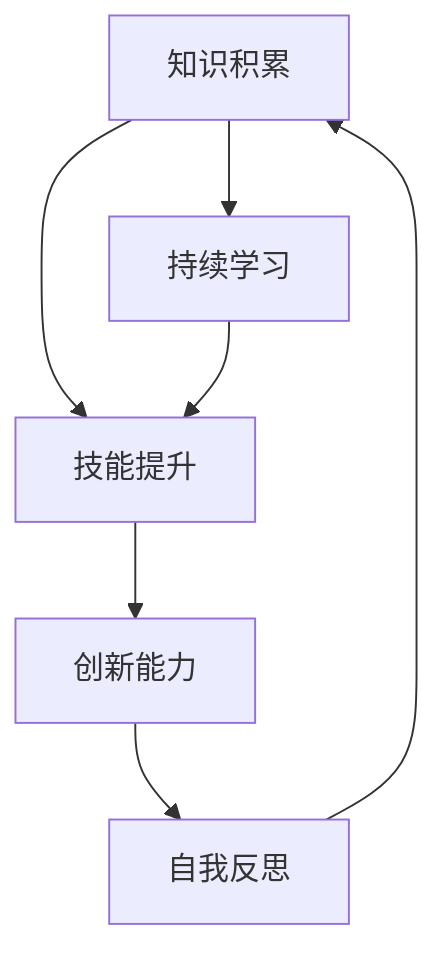
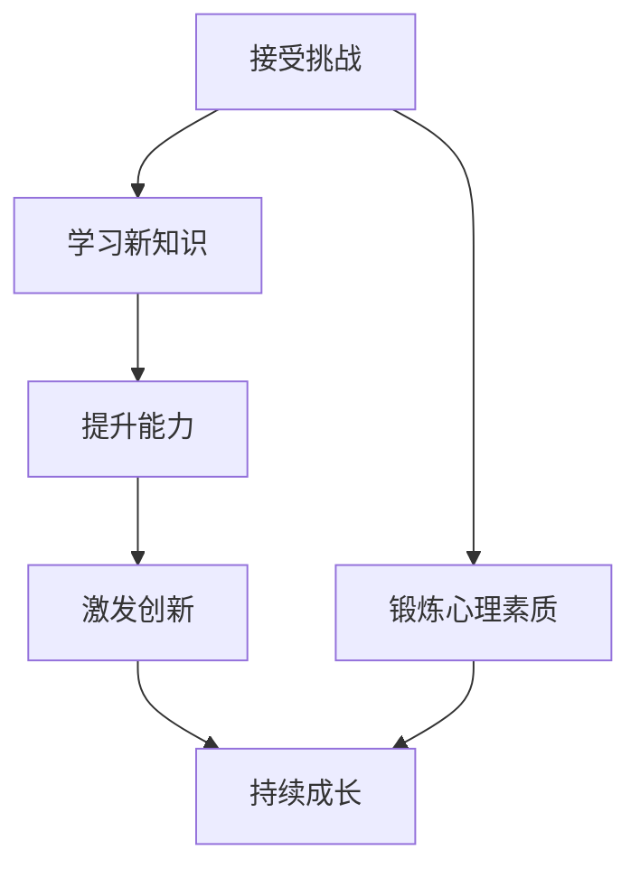

                 

## 突破舒适区：通过持续挑战实现成长

### 关键词：
- **个人成长**
- **挑战自我**
- **持续学习**
- **自我超越**
- **目标设定**
- **时间管理**
- **心理调适**

### 摘要：
本文旨在探讨如何在快速变化的技术领域中实现个人成长。通过分析舒适区的概念、挑战的重要性以及如何设定和实现目标，本文将引导读者如何在不断突破舒适区的过程中实现自我超越。我们将结合实际案例，提供实用的策略和技巧，帮助读者在技术道路上持续成长。

### 引言

在当今这个信息爆炸、技术快速迭代的时代，个人成长已经成为每个人不得不面对的课题。无论是职场人士还是在校学生，无论是在技术领域还是其他领域，成长都是一项不可或缺的能力。然而，成长并非一蹴而就，它需要我们在舒适区内不断挑战自我，才能实现真正的进步。

**舒适区**，顾名思义，是一个人们感到舒适、无需面对挑战的环境。在这个区域内，我们无需努力，可以轻松完成任务，享受既定的成果。然而，长期停留在舒适区内，会让我们逐渐丧失对新事物的好奇心和探索欲望，从而阻碍个人成长。

**持续挑战**，则是打破舒适区的关键。通过接受新的挑战，我们能够不断扩展自己的知识和技能边界，实现自我提升。本文将深入探讨如何在技术领域中通过持续挑战实现个人成长，提供实用的策略和方法，帮助读者在职业发展中不断前进。

### 第一部分：核心概念与联系

在探讨如何通过持续挑战实现成长之前，我们需要明确几个核心概念及其之间的联系。

#### 成长的定义与意义

**成长**，是指个人在知识、技能、态度和认知等方面不断进步的过程。对于技术从业者来说，成长意味着不断学习新技术、提高解决复杂问题的能力，以及适应快速变化的工作环境。

**个人成长的意义**在于：
1. **提高竞争力**：随着技术领域的不断变化，只有不断成长，才能在激烈的职场竞争中保持优势。
2. **满足好奇心**：技术领域的不断进步激发了人们的好奇心和探索欲望，成长是满足这种欲望的最好方式。
3. **实现自我价值**：通过成长，个人能够更好地实现自己的职业目标和人生价值。

#### 核心概念与联系

在个人成长过程中，以下几个核心概念密切相关，相互促进：

1. **知识积累**：不断学习新知识是成长的基础。通过阅读、研究、实践等方式，积累丰富的知识储备。
2. **技能提升**：将知识转化为实际技能，通过实践不断提高解决实际问题的能力。
3. **创新能力**：在现有知识和技能的基础上，进行创新，解决复杂问题，推动技术进步。
4. **自我反思**：通过反思，了解自己的成长路径，发现不足，制定改进计划。
5. **持续学习**：成长是一个持续的过程，需要不断学习新知识、新技能，适应新环境。

为了更清晰地展示这些概念之间的联系，我们可以使用**Mermaid流程图**来表示：



在这个流程图中，知识积累是成长的基础，通过技能提升将知识转化为能力，创新能力进一步推动个人发展，自我反思帮助个人发现不足，而持续学习则是整个过程的持续动力。

### 第二部分：持续挑战与成长

#### 挑战的来源与类型

**挑战**，是个人成长的重要驱动力。挑战的来源多种多样，可以分为以下几种类型：

1. **技术挑战**：技术领域不断变化，新的技术和工具层出不穷。接受新的技术挑战，学习新技术，是成长的关键。
2. **项目挑战**：在项目中承担更具挑战性的任务，解决复杂问题，可以提升个人的项目管理和解决复杂问题的能力。
3. **竞争挑战**：在职场中与其他优秀人才的竞争，激发个人不断进步的动力。
4. **个人挑战**：自我设定的目标，如学习一门新语言、完成一个复杂的编程任务等。

#### 挑战的重要性

**挑战**在个人成长中具有重要意义：

1. **拓展知识边界**：通过接受新的挑战，学习新的技术和知识，不断拓展个人的知识边界。
2. **提高解决问题的能力**：面对复杂的问题和挑战，通过思考和解决，提高个人的问题解决能力。
3. **激发创新思维**：挑战可以激发个人的创新思维，推动技术进步和职业发展。
4. **增强心理素质**：面对挑战，需要克服恐惧和不安，锻炼个人的心理素质，提高抗压能力。

#### 挑战与成长的Mermaid流程图

为了更直观地展示挑战与成长之间的关系，我们可以使用**Mermaid流程图**：



在这个流程图中，接受挑战是成长的起点，通过学习新知识、提升能力、激发创新，实现持续成长，同时锻炼心理素质，为持续成长提供动力。

### 第三部分：设定与实现目标

#### 目标设定的原则

**目标设定**是个人成长的重要环节。一个明确、可行的目标能够指引我们的努力方向，确保我们朝着正确的目标前进。设定目标时应遵循以下原则：

1. **具体性**：目标应具体、明确，而不是模糊的。例如，“学习一门新编程语言”比“提高编程能力”更具体。
2. **可行性**：目标应具有可行性，考虑个人的实际情况，确保能够在规定时间内完成。
3. **挑战性**：目标应具有一定的挑战性，激发个人的潜力和动力。
4. **可度量性**：目标应可度量，便于评估进展和成果。

#### 目标实现的方法

设定目标后，实现目标的方法至关重要。以下是一些实现目标的方法：

1. **分解任务**：将大目标分解为小任务，逐步完成。每个小任务完成后，都会带来一定的成就感。
2. **时间管理**：合理安排时间，确保有足够的时间用于实现目标。可以使用时间管理工具，如番茄工作法，提高工作效率。
3. **持续学习**：学习新知识、新技能，为目标的实现提供支持。可以通过阅读、参加培训、实践等方式进行学习。
4. **反馈与调整**：在实现目标的过程中，定期进行自我反馈，评估进展，根据实际情况进行调整。

#### 目标设定与挑战的关系

**目标设定**与**挑战**之间存在密切的关系。设定目标是为了明确方向，而接受挑战则是为了实现目标。一个具有挑战性的目标，需要我们不断接受新的挑战，才能实现。

1. **目标驱动挑战**：一个明确的目标会激发我们去接受新的挑战，不断突破自我。
2. **挑战促进目标实现**：通过接受挑战，我们能够学习新知识、提升能力，从而更好地实现目标。

#### 案例分析

以下是一个具体的案例，展示如何通过设定目标、接受挑战实现成长：

**案例**：小王是一名软件工程师，他的目标是学习Python编程语言，并在三个月内完成一个基于Python的自动化测试项目。

**目标设定**：
1. 具体性：学习Python编程语言。
2. 可行性：三个月内完成目标。
3. 挑战性：学习一门新语言并完成一个实际项目，具有一定的挑战性。
4. 可度量性：完成一个基于Python的自动化测试项目。

**实现目标的方法**：
1. **分解任务**：将学习Python的任务分解为：
   - 学习Python基础语法
   - 学习Python常用库（如Selenium、Pytest）
   - 完成自动化测试项目

2. **时间管理**：制定学习计划，每天安排一定时间学习Python，确保有足够的时间完成项目。

3. **持续学习**：通过在线课程、阅读书籍、实践项目等方式学习Python。

4. **反馈与调整**：每周进行一次自我反馈，评估学习进度，根据实际情况进行调整。

**挑战与成长**：
1. **目标驱动挑战**：小王的目标是学习Python，这激发他去接受这个挑战。
2. **挑战促进目标实现**：通过接受这个挑战，小王不仅学会了Python，还完成了一个实际项目，实现了目标。

### 第四部分：应对挑战的策略

#### 心理调适技巧

面对挑战，心理调适至关重要。以下是一些心理调适技巧：

1. **积极心态**：保持积极的心态，相信自己的能力，相信自己可以克服困难。
2. **设定合理期望**：设定合理的期望，避免过于理想化，防止在遇到困难时产生挫败感。
3. **分解任务**：将大任务分解为小任务，逐一完成，避免感到压力过大。
4. **寻求支持**：在遇到困难时，寻求同事、朋友或导师的支持和帮助。

#### 学习方法与工具

1. **在线课程**：利用在线课程学习新知识，如Coursera、Udemy等平台提供了丰富的课程资源。
2. **书籍与资料**：阅读相关书籍和资料，如《Python编程：从入门到实践》、《深入理解计算机系统》等。
3. **实践项目**：通过实际项目应用所学知识，加深理解，提高技能。

#### 时间管理与效率提升

1. **时间管理工具**：使用时间管理工具，如Trello、JIRA等，合理安排时间，确保高效完成任务。
2. **番茄工作法**：采用番茄工作法，每25分钟集中精力工作，休息5分钟，提高工作效率。

### 第五部分：案例研究

#### 挑战成功的案例

**案例**：小张是一名软件工程师，他接受了公司的一个新项目，负责开发一个复杂的Web应用程序。这是一个具有很大挑战性的项目，涉及多个技术领域，包括前端、后端、数据库设计和自动化测试。

**目标**：
1. 学习并掌握前端技术（如React、Vue.js）。
2. 熟悉后端技术（如Node.js、Django）。
3. 设计并实现数据库模型。
4. 完成自动化测试。

**实现方法**：
1. **分解任务**：将项目分解为多个子任务，逐一完成。
2. **持续学习**：利用在线课程和书籍学习相关技术。
3. **实践项目**：在项目中实际应用所学知识。

**结果**：小张成功完成了项目，并得到了客户和同事的高度评价。通过这个项目，他不仅掌握了多种新技术，还提高了项目管理和沟通能力。

#### 挑战失败的案例

**案例**：小李是一名程序员，他接受了公司的一个新项目，负责开发一个移动应用。然而，由于他对移动开发不熟悉，项目进展缓慢，最终未能按时完成。

**目标**：
1. 开发一个功能完善的移动应用。
2. 在三个月内完成项目。

**实现方法**：
1. **直接上手**：没有进行充分的准备和学习，直接开始编码。
2. **缺乏实践**：没有通过实践项目来提高移动开发技能。

**结果**：小李的项目失败，导致客户不满，自己也受到了批评。这个案例表明，在挑战面前，充分的准备和实践至关重要。

#### 案例中的成长经验

从以上两个案例中，我们可以得出以下成长经验：

1. **充分准备**：在挑战之前，要进行充分的准备，包括学习相关知识、实践项目等。
2. **分解任务**：将大任务分解为小任务，逐一完成，避免压力过大。
3. **持续学习**：不断学习新知识、新技能，提高自身能力。
4. **积极心态**：保持积极的心态，面对挑战时，相信自己的能力，相信自己可以克服困难。

### 第六部分：成长中的反思与调整

#### 反思的意义与方法

**反思**在个人成长过程中具有重要意义。通过反思，我们可以：
1. 发现自身不足，找到改进的方向。
2. 总结经验教训，避免重复错误。
3. 提高自我认知，明确成长目标。

**反思方法**：
1. **定期反思**：每周或每月进行一次反思，总结过去一段时间的成长和进步。
2. **记录日志**：记录自己的学习和工作日志，反思自己的行为和表现。
3. **与他人交流**：与同事、朋友或导师交流，听取他们的意见和建议。

#### 调整策略与技巧

**调整策略**：
1. **根据反思结果进行调整**：根据反思中发现的问题，制定相应的调整计划。
2. **设定短期和长期目标**：短期目标用于解决当前问题，长期目标用于实现长期成长。

**技巧**：
1. **设定明确的目标和计划**：确保目标具体、可行，并制定详细的实施计划。
2. **逐步调整**：调整过程中，不要急于求成，逐步进行，确保调整效果。

#### 持续成长的心态

**持续成长的心态**是个人成长的重要基础。以下是一些培养持续成长心态的方法：

1. **保持好奇心**：对新技术、新知识保持好奇心，不断探索和学习。
2. **勇于尝试**：勇于接受新的挑战，不怕失败，从失败中吸取经验。
3. **积极面对困难**：面对困难时，保持积极的态度，相信困难是成长的机会。

### 第七部分：总结与展望

#### 书中观点的总结

本文从多个角度探讨了如何在技术领域中实现个人成长。核心观点包括：
1. **挑战自我**：通过接受新的挑战，拓展知识和技能边界。
2. **目标设定**：明确的目标是个人成长的指引，通过分解任务、持续学习和反馈调整实现目标。
3. **心理调适**：保持积极心态，面对挑战时保持冷静，勇于接受失败。
4. **反思与调整**：通过反思发现不足，调整策略和技巧，实现持续成长。

#### 个人成长路径的建议

1. **设定明确目标**：明确自己的职业目标和成长方向，制定具体、可行的计划。
2. **不断学习**：保持好奇心，学习新知识、新技能，提高自身能力。
3. **勇于挑战**：接受新的挑战，勇于尝试，不怕失败。
4. **反思与调整**：定期进行反思，总结经验教训，调整成长策略。

#### 进一步学习的资源

1. **在线课程**：如Coursera、Udemy等平台提供了丰富的技术课程。
2. **技术社区**：如Stack Overflow、GitHub等，可以获取最新的技术资讯和资源。
3. **技术书籍**：如《代码大全》、《深入理解计算机系统》等经典书籍。

### 作者信息

- 作者：AI天才研究院/AI Genius Institute & 禅与计算机程序设计艺术 /Zen And The Art of Computer Programming

### 结语

在快速变化的技术领域中，个人成长是每个人都必须面对的课题。通过不断接受挑战、设定目标、反思调整，我们可以在技术道路上不断前进，实现自我超越。希望本文能为您提供一些有益的启示和指导，助您在个人成长的道路上越走越远。


### 完整性要求

为了确保文章内容的完整性，我们需要在各个部分详细讲解以下核心内容：

#### 背景介绍

在技术领域中，个人成长的重要性不言而喻。随着技术的不断进步，新的工具、框架和算法层出不穷，技术从业者必须不断学习、更新知识，才能保持竞争力。本文旨在探讨如何在快速变化的技术领域中实现个人成长，提供实用的策略和方法。

#### 核心概念与联系

1. **成长**：成长是指个人在知识、技能、态度和认知等方面不断进步的过程。对于技术从业者来说，成长意味着不断学习新技术、提高解决复杂问题的能力，以及适应快速变化的工作环境。

2. **挑战自我**：挑战自我是个人成长的关键。通过接受新的挑战，我们可以不断拓展自己的知识和技能边界，实现自我提升。挑战可以是技术挑战、项目挑战、竞争挑战，也可以是自我设定的目标。

3. **目标设定**：明确的目标是个人成长的指引。通过设定具体、可行的目标，我们可以更好地规划自己的成长路径。目标设定需要遵循具体性、可行性、挑战性和可度量性等原则。

4. **心理调适**：面对挑战时，心理调适至关重要。保持积极心态、设定合理期望、分解任务和寻求支持等技巧，可以帮助我们更好地应对挑战。

5. **反思与调整**：反思是个人成长的重要组成部分。通过反思，我们可以发现自身的不足，找到改进的方向。反思方法包括定期反思、记录日志和与他人交流。调整策略则包括根据反思结果进行调整、设定短期和长期目标等。

#### 核心算法原理讲解

在技术领域中，许多算法原理对于个人成长具有重要意义。以下是一些核心算法原理的讲解：

1. **动态规划**：动态规划是一种在复杂问题中寻找最优解的方法。通过将问题分解为子问题，并利用子问题的解来构建原问题的解，动态规划能够解决许多复杂的问题。

   **伪代码**：

   ```python
   def dynamic_programming(problem):
       initialize dp array
       for each subproblem:
           solve subproblem
           store the solution in dp array
       return the solution for the original problem
   ```

2. **贪心算法**：贪心算法是一种通过局部最优选择来达到全局最优解的方法。在每一步选择中，都选择当前最优的方案，希望通过这种方式最终达到最优解。

   **伪代码**：

   ```python
   def greedy_algorithm(problem):
       while problem is not solved:
           make the best choice
           update the problem
       return the solution
   ```

3. **深度优先搜索（DFS）**：深度优先搜索是一种通过递归或栈实现图的遍历算法。在搜索过程中，尽可能深入地探索路径，直到无法继续为止，然后回溯到上一个节点继续搜索。

   **伪代码**：

   ```python
   def depth_first_search(graph, start_node):
       mark start_node as visited
       for each neighbor of start_node:
           if neighbor is not visited:
               depth_first_search(graph, neighbor)
   ```

#### 数学模型和公式

在技术领域中，数学模型和公式广泛应用于各种问题求解。以下是一些常见数学模型和公式的讲解：

1. **线性回归**：线性回归是一种用于预测数值变量的统计方法。通过建立自变量和因变量之间的线性关系，可以预测因变量的值。

   **公式**：

   $$y = ax + b$$

   **举例说明**：

   假设我们有一个数据集，其中自变量x表示年龄，因变量y表示收入。通过线性回归，我们可以建立年龄和收入之间的线性关系，从而预测某个年龄段的收入。

2. **决策树**：决策树是一种用于分类和回归的机器学习模型。通过一系列判断条件，将数据划分为不同的类别或数值。

   **公式**：

   $$\text{决策树} = \sum_{i=1}^{n} \text{条件} \times \text{结果}$$

   **举例说明**：

   假设我们有一个数据集，其中包含年龄、收入和职业等信息。通过决策树模型，我们可以预测某个人的职业类型。

3. **支持向量机（SVM）**：支持向量机是一种用于分类和回归的机器学习模型。通过将数据映射到高维空间，找到最佳分割超平面，从而实现分类或回归。

   **公式**：

   $$w \cdot x + b = 0$$

   **举例说明**：

   假设我们有一个数据集，其中包含正负样本。通过SVM模型，我们可以将正负样本分开，从而实现分类。

#### 项目实战

项目实战是个人成长的重要环节。以下是一个简单的项目实战案例，用于展示开发环境搭建、源代码实现和代码解读：

**项目名称**：基于Python的简单Web爬虫

**开发环境搭建**：

1. 安装Python环境：在官网上下载并安装Python，配置环境变量。
2. 安装必要的库：使用pip命令安装requests库和BeautifulSoup库。

   ```shell
   pip install requests
   pip install beautifulsoup4
   ```

**源代码实现**：

```python
import requests
from bs4 import BeautifulSoup

def fetch_urls(url):
    response = requests.get(url)
    soup = BeautifulSoup(response.text, 'html.parser')
    links = soup.find_all('a')
    urls = [link['href'] for link in links]
    return urls

def crawl(url, depth):
    if depth <= 0:
        return
    print(f'Crawling: {url}')
    urls = fetch_urls(url)
    for url in urls:
        crawl(url, depth - 1)

start_url = 'https://example.com'
depth = 2
crawl(start_url, depth)
```

**代码解读与分析**：

1. **fetch_urls函数**：该函数接收一个URL，使用requests库获取网页内容，并使用BeautifulSoup库解析网页。然后，提取所有的<a>标签，获取链接地址。

2. **crawl函数**：该函数递归地爬取网页，每次递归调用时，深度减一。首先打印当前爬取的URL，然后调用fetch_urls函数获取子链接，并递归调用crawl函数。

**实际案例分析和详细讲解剖析**：

1. **案例**：假设我们要爬取一个网站的首页及其所有二级页面。
2. **分析**：通过爬虫，我们可以获取网站的结构和内容，从而进行数据分析和挖掘。
3. **剖析**：爬虫的实现过程包括网络请求、网页解析和递归爬取。在实现过程中，需要注意异常处理和URL去重，避免重复爬取。

**项目小结**：

通过这个项目，我们学习了如何使用Python进行Web爬虫开发。掌握这个项目后，我们可以根据实际需求，扩展爬虫的功能，如添加多线程爬取、存储爬取结果到数据库等。

### 最佳实践 tips、小结、注意事项、拓展阅读等内容

#### 最佳实践 tips

1. **定期学习**：保持学习的习惯，定期学习新技术、新知识，跟上技术发展的步伐。
2. **实践为主**：理论知识是基础，但实践才是检验真理的唯一标准。多动手实践，提高实际操作能力。
3. **建立知识体系**：建立自己的知识体系，将所学知识系统化，便于记忆和应用。

#### 小结

本文从多个角度探讨了如何在技术领域中实现个人成长。通过设定目标、接受挑战、心理调适、反思与调整，我们可以在技术道路上不断前进，实现自我超越。

#### 注意事项

1. **避免盲目跟风**：技术更新迅速，但不是所有新技术都适用于自己。在选择学习方向时，要结合自身实际情况和职业规划。
2. **注重团队合作**：在项目中，与团队成员保持良好的沟通和协作，共同完成目标。

#### 拓展阅读

1. **《深度学习》**：由Ian Goodfellow等人编写的经典教材，全面介绍了深度学习的基础知识和应用。
2. **《代码大全》**：由Steve McConnell编写的经典软件工程书籍，涵盖了编程实践和软件开发的各个方面。
3. **《人工智能：一种现代方法》**：由Stuart Russell和Peter Norvig编写的教材，详细介绍了人工智能的基础知识。

### 总结

在快速变化的技术领域中，个人成长是每个技术从业者都必须面对的课题。通过不断接受挑战、设定目标、反思调整，我们可以在技术道路上不断前进，实现自我超越。希望本文能为您提供一些有益的启示和指导，助您在个人成长的道路上越走越远。

