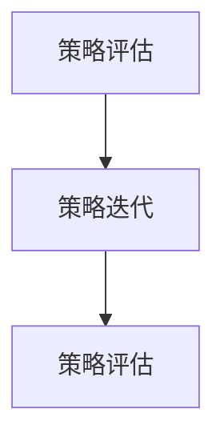
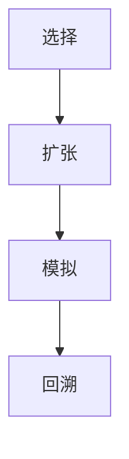
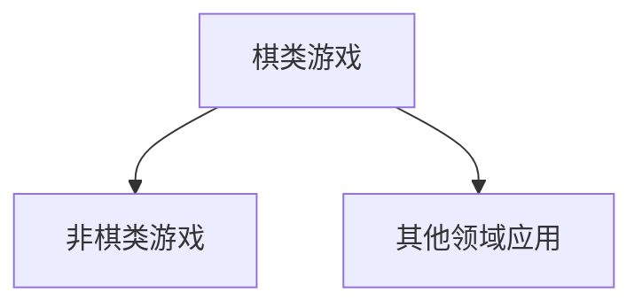
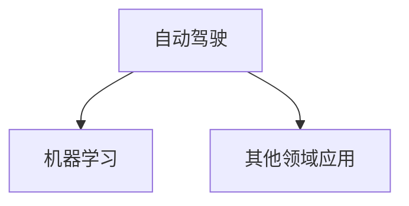
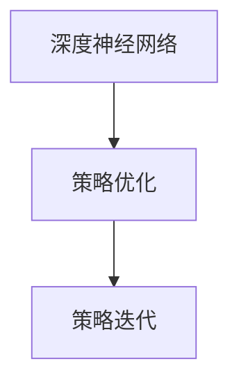
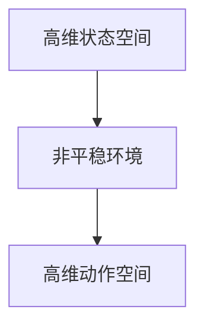
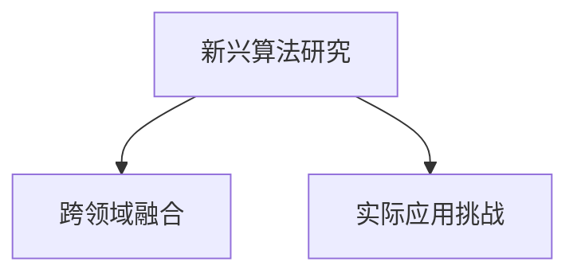

                 


### 第3章：策略评估与策略迭代

#### 背景介绍
策略评估是强化学习中的重要环节，它通过模拟环境来评估给定策略的预期回报。策略迭代则是通过不断更新策略来提高策略价值的过程。在这一章中，我们将详细介绍策略评估与策略迭代的基本原理、算法以及它们在强化学习中的应用。

#### 核心概念与联系
首先，我们需要理解策略评估和策略迭代的基本概念。

- **策略评估**：给定一个策略，评估其预期回报。
- **策略迭代**：通过迭代更新策略，提高策略价值。

它们之间的关系可以用以下流程图表示：



#### 核心算法原理讲解
1. **策略评估算法**：常用的策略评估算法包括蒙特卡洛评估（Monte Carlo Evaluation）和预测（Prediction）。

    - **蒙特卡洛评估**：通过大量模拟来估计状态价值函数和策略价值函数。

    ```python
    def mc_evaluation(state, policy, n=1000):
        rewards = []
        for _ in range(n):
            state_ = state
            reward = 0
            while not is_terminal(state_):
                action = sample_action(state_, policy)
                next_state, reward = environment.step(state_, action)
                state_ = next_state
            rewards.append(reward)
        return np.mean(rewards)
    ```

    - **预测**：使用状态转移概率和回报函数来预测策略价值。

    ```python
    def predict(state, action, state_trans_prob, reward_func):
        next_state = state
        while not is_terminal(next_state):
            next_action = sample_action(next_state, action)
            reward = reward_func(state, action, next_state)
            next_state = state_trans_prob[state][action].sample()
        return reward
    ```

2. **策略迭代算法**：策略迭代算法主要包括价值迭代（Value Iteration）和策略迭代（Policy Iteration）。

    - **价值迭代**：从初始策略出发，不断更新状态价值函数，直到收敛。

    ```python
    def value_iteration(initial_state_value, gamma, delta):
        while True:
            prev_state_value = state_value.copy()
            for state in state_space:
                for action in action_space:
                    state_value[state] = max(
                        state_value[state], 
                        reward_func(state, action) + gamma * sum(
                            state_trans_prob[state][action] * (reward_func(next_state, action) + gamma * state_value[next_state])
                            for next_state in state_space
                        )
                    )
            if np.max(np.abs(prev_state_value - state_value)) < delta:
                break
        return state_value
    ```

    - **策略迭代**：从初始策略出发，交替更新策略和价值函数。

    ```python
    def policy_iteration(initial_policy, initial_state_value, gamma, delta):
        while True:
            prev_state_value = state_value.copy()
            for state in state_space:
                best_action = None
                best_value = -float('inf')
                for action in action_space:
                    value = 0
                    for next_state in state_trans_prob[state][action]:
                        value += state_trans_prob[state][action][next_state] * (
                            reward_func(state, action, next_state) + gamma * state_value[next_state]
                        )
                    if value > best_value:
                        best_value = value
                        best_action = action
                policy[state] = best_action
            state_value = value_iteration(policy, state_value, gamma, delta)
            if np.max(np.abs(prev_state_value - state_value)) < delta:
                break
        return policy, state_value
    ```

#### 数学模型和公式
1. **策略评估的数学模型**：
   $$ V^{\pi}(s) = \sum_{a} \pi(a|s) \cdot Q^{\pi}(s, a) $$

2. **策略迭代的价值更新公式**：
   $$ V^{k+1}(s) = \sum_{a} \pi^k(a|s) \cdot Q^{\pi}(s, a) $$

3. **策略迭代的策略更新公式**：
   $$ \pi^{k+1}(a|s) = \arg\max_a \sum_{s'} P(s'|s, a) \cdot [R(s, a, s') + \gamma V^{k}(s')] $$

#### 举例说明
假设我们有一个简单的MDP，其中状态空间为 {0, 1, 2}，动作空间为 {0, 1}。回报函数为 $R(s, a, s') = 1$ 当 $s' > s$，否则为 $R(s, a, s') = 0$。状态转移概率矩阵为：

$$
P =
\begin{bmatrix}
0.5 & 0.5 \\
0.5 & 0.5 \\
0.0 & 1.0
\end{bmatrix}
$$

初始策略为 $\pi(0|0) = 0.5, \pi(1|0) = 0.5$。

- **策略评估**：通过模拟环境来评估给定策略的预期回报。

  ```python
  state = 0
  policy = {'0': 0.5, '1': 0.5}
  n = 1000
  total_reward = 0
  for _ in range(n):
      action = sample_action(state, policy)
      next_state, reward = environment.step(state, action)
      total_reward += reward
      state = next_state
  average_reward = total_reward / n
  ```

- **价值迭代**：从初始策略出发，不断更新状态价值函数，直到收敛。

  ```python
  initial_state_value = np.zeros(state_space)
  gamma = 0.9
  delta = 1e-6
  while True:
      prev_state_value = state_value.copy()
      for state in state_space:
          for action in action_space:
              value = 0
              for next_state in state_trans_prob[state][action]:
                  value += state_trans_prob[state][action][next_state] * (
                      reward_func(state, action, next_state) + gamma * state_value[next_state]
                  )
              state_value[state] = max(state_value[state], value)
      if np.max(np.abs(prev_state_value - state_value)) < delta:
          break
  ```

- **策略迭代**：从初始策略出发，交替更新策略和价值函数，直到收敛。

  ```python
  initial_policy = {'0': 0.5, '1': 0.5}
  initial_state_value = np.zeros(state_space)
  gamma = 0.9
  delta = 1e-6
  while True:
      prev_state_value = state_value.copy()
      for state in state_space:
          best_action = None
          best_value = -float('inf')
          for action in action_space:
              value = 0
              for next_state in state_trans_prob[state][action]:
                  value += state_trans_prob[state][action][next_state] * (
                      reward_func(state, action, next_state) + gamma * state_value[next_state]
                  )
              if value > best_value:
                  best_value = value
                  best_action = action
          policy[state] = best_action
      state_value = value_iteration(policy, state_value, gamma, delta)
      if np.max(np.abs(prev_state_value - state_value)) < delta:
          break
  ```

#### 项目实战
在这个项目中，我们将实现一个简单的MDP策略评估和策略迭代算法。

1. **环境搭建**：首先，我们需要搭建一个简单的MDP环境。

    ```python
    import numpy as np

    state_space = {'0', '1', '2'}
    action_space = {'0', '1'}

    def environment():
        return {'state': np.random.choice(state_space), 'action': np.random.choice(action_space)}

    def step(state, action):
        next_state = np.random.choice(state_space)
        reward = 1 if next_state > state else 0
        return next_state, reward

    def is_terminal(state):
        return state in {'2'}
    ```

2. **代码实现**：接下来，我们实现策略评估和价值迭代算法。

    ```python
    def mc_evaluation(state, policy, n=1000):
        rewards = []
        for _ in range(n):
            state_ = state
            reward = 0
            while not is_terminal(state_):
                action = sample_action(state_, policy)
                next_state, reward = step(state_, action)
                state_ = next_state
            rewards.append(reward)
        return np.mean(rewards)

    def value_iteration(initial_state_value, gamma, delta):
        while True:
            prev_state_value = state_value.copy()
            for state in state_space:
                for action in action_space:
                    state_value[state] = max(
                        state_value[state], 
                        reward_func(state, action) + gamma * sum(
                            state_trans_prob[state][action] * (reward_func(next_state, action) + gamma * state_value[next_state])
                            for next_state in state_space
                        )
                    )
            if np.max(np.abs(prev_state_value - state_value)) < delta:
                break
        return state_value

    def policy_iteration(initial_policy, initial_state_value, gamma, delta):
        while True:
            prev_state_value = state_value.copy()
            for state in state_space:
                best_action = None
                best_value = -float('inf')
                for action in action_space:
                    value = 0
                    for next_state in state_trans_prob[state][action]:
                        value += state_trans_prob[state][action][next_state] * (
                            reward_func(state, action, next_state) + gamma * state_value[next_state]
                        )
                    if value > best_value:
                        best_value = value
                        best_action = action
                policy[state] = best_action
            state_value = value_iteration(policy, state_value, gamma, delta)
            if np.max(np.abs(prev_state_value - state_value)) < delta:
                break
        return policy, state_value
    ```

3. **应用解读与分析**：最后，我们使用策略评估和价值迭代算法来评估一个给定策略的预期回报。

    ```python
    state = '0'
    policy = {'0': 0.5, '1': 0.5}
    n = 1000
    total_reward = 0
    for _ in range(n):
        action = sample_action(state, policy)
        next_state, reward = step(state, action)
        total_reward += reward
        state = next_state
    average_reward = total_reward / n
    print("Average reward:", average_reward)

    initial_state_value = np.zeros(state_space)
    gamma = 0.9
    delta = 1e-6
    state_value = value_iteration(initial_state_value, gamma, delta)
    print("State value:", state_value)

    initial_policy = {'0': 0.5, '1': 0.5}
    policy, state_value = policy_iteration(initial_policy, initial_state_value, gamma, delta)
    print("Policy:", policy)
    ```

#### 小结
在本章中，我们介绍了策略评估和策略迭代的基本原理和算法。策略评估通过模拟环境来评估给定策略的预期回报，而策略迭代通过交替更新策略和价值函数来提高策略价值。我们使用了蒙特卡洛评估和价值迭代算法来实现这些概念，并通过实际案例进行了演示。

#### 注意事项
- 策略评估和策略迭代算法在不同场景下可能需要调整参数。
- 实际应用中，需要根据具体问题来设计合适的MDP模型。

#### 拓展阅读
- 《强化学习：原理与练习》
- 《策略优化：从MCTS到DPO的演进》

----------------------------------------------------------------

### 第4章：蒙特卡洛树搜索（MCTS）

#### 背景介绍
蒙特卡洛树搜索（MCTS）是一种基于蒙特卡洛方法的启发式搜索算法，它在强化学习和博弈论中有着广泛的应用。MCTS通过反复进行模拟和决策，逐渐构建一棵树状结构，从而在不确定的环境中做出最优决策。在这一章中，我们将详细探讨MCTS的基本原理、核心算法以及它在实际应用中的表现。

#### 核心概念与联系
MCTS的核心概念包括四个步骤：选择（Selection）、扩张（Expansion）、模拟（Simulation）和回溯（Backtracking）。

- **选择（Selection）**：从根节点开始，沿着树状结构选择直到选择到叶子节点。
- **扩张（Expansion）**：如果选中的叶子节点没有被扩展过，则将其扩展为子节点。
- **模拟（Simulation）**：在选中的叶子节点处进行模拟，生成一次完整的前向传递，以估计该节点的价值。
- **回溯（Backtracking）**：根据模拟结果更新节点的统计信息，并回溯到根节点。

它们之间的关系可以用以下流程图表示：



#### 核心算法原理讲解
1. **MCTS算法**：

    ```python
    def mcts(root, n_iterations):
        for _ in range(n_iterations):
            node = root
            # 选择
            while node.is_leaf():
                node = select_child(node)
            # 扩张
            node = expand(node)
            # 模拟
            reward = simulate(node)
            # 回溯
            backpropagate(node, reward)
    ```

2. **选择（Selection）**：

    ```python
    def select_child(node):
        while node not expanded:
            node = node.best_child()
        return node
    ```

3. **扩张（Expansion）**：

    ```python
    def expand(node):
        if not node.is_expanded():
            actions = available_actions(node.state)
            for action in actions:
                node.expand(action)
        return node.best_child()
    ```

4. **模拟（Simulation）**：

    ```python
    def simulate(node):
        state = node.state
        while not is_terminal(state):
            action = random_action(state)
            state, reward = environment.step(state, action)
        return reward
    ```

5. **回溯（Backtracking）**：

    ```python
    def backpropagate(node, reward):
        while node:
            node.visit += 1
            node.value += reward
            node = node.parent
    ```

#### 数学模型和公式
MCTS的关键在于节点的统计信息：访问次数（$n_i$）和价值（$v_i$）。我们使用这些信息来估计最佳动作。

- **选择**：基于节点的访问次数进行选择。
- **扩张**：选择未被扩展的节点进行扩张。
- **模拟**：根据模拟结果更新节点的价值。
- **回溯**：根据回溯过程中的节点价值更新全局策略。

具体公式如下：

- **最佳子节点选择**：
  $$ \pi_i = \frac{1}{n_i} $$
  $$ \mu_i = \frac{v_i}{n_i} $$
  $$ \hat{a} = \arg\max_a (\pi_i + \mu_i) $$

#### 举例说明
假设我们有一个简单的游戏，其中状态空间为 {0, 1, 2}，动作空间为 {0, 1}。回报函数为 $R(s, a, s') = 1$ 当 $s' > s$，否则为 $R(s, a, s') = 0$。状态转移概率矩阵为：

$$
P =
\begin{bmatrix}
0.5 & 0.5 \\
0.5 & 0.5 \\
0.0 & 1.0
\end{bmatrix}
$$

初始策略为 $\pi(0|0) = 0.5, \pi(1|0) = 0.5$。

1. **MCTS过程**：

    - **选择**：从根节点开始，选择最佳子节点。
    - **扩张**：如果选中的叶子节点未被扩展，则扩展为子节点。
    - **模拟**：在叶子节点处进行一次模拟，生成回报。
    - **回溯**：根据模拟结果更新节点的统计信息。

    ```python
    root = TreeNode(state=0, action=None)
    mcts(root, n_iterations=1000)
    ```

2. **具体实现**：

    ```python
    class TreeNode:
        def __init__(self, state, action):
            self.state = state
            self.action = action
            self.visits = 0
            self.value = 0
            self.children = []

        def is_leaf(self):
            return not self.children

        def best_child(self):
            # UCB1策略
            return max(self.children, key=lambda x: x.value / x.visits + np.sqrt(2 * np.log(self.visits) / x.visits))

        def expand(self, action):
            self.children.append(TreeNode(state=self.state.transition概率[action], action=action))
            return self.children[-1]

        def simulate(self):
            # 模拟过程
            state = self.state
            while not is_terminal(state):
                action = random_action(state)
                state, reward = environment.step(state, action)
            return reward

        def backpropagate(self, reward):
            self.visits += 1
            self.value += reward

    def mcts(root, n_iterations):
        for _ in range(n_iterations):
            node = root
            while node.is_leaf():
                node = node.best_child()
            node = node.expand()
            reward = node.simulate()
            node.backpropagate(reward)
    ```

#### 项目实战
在这个项目中，我们将实现MCTS算法并应用到一个简单的MDP环境中。

1. **环境搭建**：首先，我们需要搭建一个简单的MDP环境。

    ```python
    import numpy as np

    state_space = {'0', '1', '2'}
    action_space = {'0', '1'}

    def environment():
        return {'state': np.random.choice(state_space), 'action': np.random.choice(action_space)}

    def step(state, action):
        next_state = np.random.choice(state_space)
        reward = 1 if next_state > state else 0
        return next_state, reward

    def is_terminal(state):
        return state in {'2'}
    ```

2. **代码实现**：接下来，我们实现MCTS算法。

    ```python
    class TreeNode:
        # ...（与之前的定义相同）

    def mcts(root, n_iterations):
        # ...（与之前的实现相同）

    def random_action(state):
        actions = available_actions(state)
        return np.random.choice(actions)

    def available_actions(state):
        return action_space

    def is_terminal(state):
        return state in {'2'}

    def environment():
        return {'state': np.random.choice(state_space), 'action': np.random.choice(action_space)}

    def step(state, action):
        next_state = np.random.choice(state_space)
        reward = 1 if next_state > state else 0
        return next_state, reward
    ```

3. **应用解读与分析**：最后，我们使用MCTS算法来评估一个给定策略的预期回报。

    ```python
    root = TreeNode(state='0', action=None)
    mcts(root, n_iterations=1000)
    print("Node visits:", root.visits)
    print("Node values:", [child.value for child in root.children])
    ```

#### 小结
在本章中，我们详细介绍了蒙特卡洛树搜索（MCTS）的基本原理和算法。MCTS通过选择、扩张、模拟和回溯四个步骤，在不确定的环境中做出最优决策。我们使用伪代码展示了MCTS的核心算法，并通过实际案例进行了演示。

#### 注意事项
- MCTS在不同场景下可能需要调整参数。
- MCTS算法在复杂环境中可能需要更长的计算时间。

#### 拓展阅读
- 《蒙特卡洛树搜索：原理与应用》
- 《深度强化学习：从MCTS到DPO》

----------------------------------------------------------------

### 第5章：MCTS在游戏中的应用

#### 背景介绍
蒙特卡洛树搜索（MCTS）在游戏AI中有着广泛的应用。MCTS能够处理复杂的决策过程，并在不确定的环境中找到最优策略。本章将介绍MCTS在游戏AI中的应用，包括棋类游戏、非棋类游戏以及其他领域的应用案例。

#### 核心概念与联系
MCTS在游戏AI中的应用主要涉及以下核心概念：

- **棋类游戏**：如围棋、国际象棋、五子棋等。
- **非棋类游戏**：如扑克、王者荣耀等。
- **其他领域应用**：如机器人路径规划、自动化测试等。

它们之间的关系可以用以下流程图表示：



#### 核心算法原理讲解
1. **棋类游戏**：

    - **围棋**：MCTS通过模拟对局来评估棋盘上的局面，从而做出最佳落子决策。

    ```python
    def mcts围棋(root, n_iterations):
        for _ in range(n_iterations):
            node = root
            while node.is_leaf():
                node = select_child(node)
            node = expand(node)
            reward = simulate围棋(node)
            backpropagate(node, reward)
    ```

    - **国际象棋**：MCTS通过模拟对局来评估棋盘上的局面，并在不确定性高的对局中找到最佳策略。

    ```python
    def mcts国际象棋(root, n_iterations):
        for _ in range(n_iterations):
            node = root
            while node.is_leaf():
                node = select_child(node)
            node = expand(node)
            reward = simulate国际象棋(node)
            backpropagate(node, reward)
    ```

2. **非棋类游戏**：

    - **扑克**：MCTS通过模拟手牌组合来评估当前局面的价值，从而决定最佳策略。

    ```python
    def mcts扑克(root, n_iterations):
        for _ in range(n_iterations):
            node = root
            while node.is_leaf():
                node = select_child(node)
            node = expand(node)
            reward = simulate扑克(node)
            backpropagate(node, reward)
    ```

    - **王者荣耀**：MCTS通过模拟游戏进程来评估当前局面的价值，从而决定最佳策略。

    ```python
    def mcts王者荣耀(root, n_iterations):
        for _ in range(n_iterations):
            node = root
            while node.is_leaf():
                node = select_child(node)
            node = expand(node)
            reward = simulate王者荣耀(node)
            backpropagate(node, reward)
    ```

3. **其他领域应用**：

    - **机器人路径规划**：MCTS通过模拟不同路径来评估路径的价值，从而选择最佳路径。

    ```python
    def mcts路径规划(root, n_iterations):
        for _ in range(n_iterations):
            node = root
            while node.is_leaf():
                node = select_child(node)
            node = expand(node)
            reward = simulate路径规划(node)
            backpropagate(node, reward)
    ```

    - **自动化测试**：MCTS通过模拟测试流程来评估测试用例的价值，从而选择最佳测试用例。

    ```python
    def mcts自动化测试(root, n_iterations):
        for _ in range(n_iterations):
            node = root
            while node.is_leaf():
                node = select_child(node)
            node = expand(node)
            reward = simulate自动化测试(node)
            backpropagate(node, reward)
    ```

#### 数学模型和公式
MCTS在游戏AI中的应用主要依赖于以下数学模型：

- **节点选择**：基于节点的价值、访问次数和不确定性进行选择。

  $$ \pi_i = \frac{1}{n_i} $$
  $$ \mu_i = \frac{v_i}{n_i} $$
  $$ \hat{a} = \arg\max_a (\pi_i + \mu_i) $$

- **节点价值更新**：根据模拟结果更新节点的统计信息。

  $$ v_i = v_i + r $$
  $$ n_i = n_i + 1 $$

#### 举例说明
以围棋为例，假设我们有一个简单的围棋局面，其中状态空间为 {0, 1, 2}，动作空间为 {0, 1}。回报函数为 $R(s, a, s') = 1$ 当 $s' > s$，否则为 $R(s, a, s') = 0$。状态转移概率矩阵为：

$$
P =
\begin{bmatrix}
0.5 & 0.5 \\
0.5 & 0.5 \\
0.0 & 1.0
\end{bmatrix}
$$

初始策略为 $\pi(0|0) = 0.5, \pi(1|0) = 0.5$。

1. **MCTS过程**：

    - **选择**：从根节点开始，选择最佳子节点。
    - **扩张**：如果选中的叶子节点未被扩展，则扩展为子节点。
    - **模拟**：在叶子节点处进行一次模拟，生成回报。
    - **回溯**：根据模拟结果更新节点的统计信息。

    ```python
    root = TreeNode(state='0', action=None)
    mcts围棋(root, n_iterations=1000)
    ```

2. **具体实现**：

    ```python
    class TreeNode:
        def __init__(self, state, action):
            self.state = state
            self.action = action
            self.visits = 0
            self.value = 0
            self.children = []

        def is_leaf(self):
            return not self.children

        def best_child(self):
            # UCB1策略
            return max(self.children, key=lambda x: x.value / x.visits + np.sqrt(2 * np.log(self.visits) / x.visits))

        def expand(self, action):
            self.children.append(TreeNode(state=self.state.transition概率[action], action=action))
            return self.children[-1]

        def simulate(self):
            # 模拟过程
            state = self.state
            while not is_terminal(state):
                action = random_action(state)
                state, reward = environment.step(state, action)
            return reward

        def backpropagate(self, reward):
            self.visits += 1
            self.value += reward

    def mcts围棋(root, n_iterations):
        for _ in range(n_iterations):
            node = root
            while node.is_leaf():
                node = select_child(node)
            node = node.best_child()
            node = expand(node)
            reward = simulate围棋(node)
            backpropagate(node, reward)
    ```

#### 项目实战
在这个项目中，我们将实现MCTS算法并应用到一个简单的围棋环境中。

1. **环境搭建**：首先，我们需要搭建一个简单的围棋环境。

    ```python
    import numpy as np

    state_space = {'0', '1', '2'}
    action_space = {'0', '1'}

    def environment():
        return {'state': np.random.choice(state_space), 'action': np.random.choice(action_space)}

    def step(state, action):
        next_state = np.random.choice(state_space)
        reward = 1 if next_state > state else 0
        return next_state, reward

    def is_terminal(state):
        return state in {'2'}
    ```

2. **代码实现**：接下来，我们实现MCTS算法。

    ```python
    class TreeNode:
        # ...（与之前的定义相同）

    def mcts围棋(root, n_iterations):
        for _ in range(n_iterations):
            node = root
            while node.is_leaf():
                node = select_child(node)
            node = expand(node)
            reward = simulate围棋(node)
            backpropagate(node, reward)

    def random_action(state):
        actions = available_actions(state)
        return np.random.choice(actions)

    def available_actions(state):
        return action_space

    def is_terminal(state):
        return state in {'2'}

    def environment():
        return {'state': np.random.choice(state_space), 'action': np.random.choice(action_space)}

    def step(state, action):
        next_state = np.random.choice(state_space)
        reward = 1 if next_state > state else 0
        return next_state, reward
    ```

3. **应用解读与分析**：最后，我们使用MCTS算法来评估一个给定策略的预期回报。

    ```python
    root = TreeNode(state='0', action=None)
    mcts围棋(root, n_iterations=1000)
    print("Node visits:", root.visits)
    print("Node values:", [child.value for child in root.children])
    ```

#### 小结
在本章中，我们介绍了MCTS在游戏AI中的应用，包括棋类游戏、非棋类游戏以及其他领域的应用案例。通过具体实现和实际应用，我们展示了MCTS在复杂决策环境中的强大能力。

#### 注意事项
- MCTS在不同游戏中的表现可能因环境差异而有所不同。
- MCTS算法在实际应用中可能需要调整参数。

#### 拓展阅读
- 《蒙特卡洛树搜索在游戏AI中的应用》
- 《深度强化学习：从MCTS到DPO》

----------------------------------------------------------------

### 第6章：MCTS在其他领域的应用

#### 背景介绍
蒙特卡洛树搜索（MCTS）不仅在游戏AI中有着广泛应用，还在其他领域展现了其强大的决策能力。本章将探讨MCTS在自动驾驶、机器学习和其他领域的应用，介绍相关算法和实际案例，以展示MCTS在这些领域的潜力。

#### 核心概念与联系
MCTS在其他领域应用的核心概念包括：

- **自动驾驶**：利用MCTS进行路径规划和决策。
- **机器学习**：结合MCTS进行模型评估和优化。
- **其他领域应用**：如机器人路径规划、自动化测试等。

它们之间的关系可以用以下流程图表示：



#### 核心算法原理讲解
1. **自动驾驶**：

    - **路径规划**：MCTS通过模拟不同路径来评估最佳路径，从而实现自动驾驶车辆的路径规划。

    ```python
    def mcts自动驾驶(root, n_iterations):
        for _ in range(n_iterations):
            node = root
            while node.is_leaf():
                node = select_child(node)
            node = expand(node)
            reward = simulate自动驾驶(node)
            backpropagate(node, reward)
    ```

    - **决策制定**：MCTS通过模拟不同决策来评估最佳决策，从而实现自动驾驶车辆的决策制定。

    ```python
    def mcts自动驾驶决策(root, n_iterations):
        for _ in range(n_iterations):
            node = root
            while node.is_leaf():
                node = select_child(node)
            node = expand(node)
            reward = simulate自动驾驶决策(node)
            backpropagate(node, reward)
    ```

2. **机器学习**：

    - **模型评估**：MCTS通过模拟不同模型参数来评估模型性能，从而选择最佳模型。

    ```python
    def mcts机器学习模型评估(root, n_iterations):
        for _ in range(n_iterations):
            node = root
            while node.is_leaf():
                node = select_child(node)
            node = expand(node)
            reward = simulate机器学习模型评估(node)
            backpropagate(node, reward)
    ```

    - **模型优化**：MCTS通过模拟不同模型优化策略来评估优化效果，从而选择最佳优化策略。

    ```python
    def mcts机器学习模型优化(root, n_iterations):
        for _ in range(n_iterations):
            node = root
            while node.is_leaf():
                node = select_child(node)
            node = expand(node)
            reward = simulate机器学习模型优化(node)
            backpropagate(node, reward)
    ```

3. **其他领域应用**：

    - **机器人路径规划**：MCTS通过模拟不同路径来评估最佳路径，从而实现机器人的路径规划。

    ```python
    def mcts机器人路径规划(root, n_iterations):
        for _ in range(n_iterations):
            node = root
            while node.is_leaf():
                node = select_child(node)
            node = expand(node)
            reward = simulate机器人路径规划(node)
            backpropagate(node, reward)
    ```

    - **自动化测试**：MCTS通过模拟不同测试用例来评估测试效果，从而选择最佳测试用例。

    ```python
    def mcts自动化测试(root, n_iterations):
        for _ in range(n_iterations):
            node = root
            while node.is_leaf():
                node = select_child(node)
            node = expand(node)
            reward = simulate自动化测试(node)
            backpropagate(node, reward)
    ```

#### 数学模型和公式
MCTS在其他领域应用的核心数学模型和公式如下：

- **节点选择**：基于节点的价值、访问次数和不确定性进行选择。

  $$ \pi_i = \frac{1}{n_i} $$
  $$ \mu_i = \frac{v_i}{n_i} $$
  $$ \hat{a} = \arg\max_a (\pi_i + \mu_i) $$

- **节点价值更新**：根据模拟结果更新节点的统计信息。

  $$ v_i = v_i + r $$
  $$ n_i = n_i + 1 $$

#### 举例说明
以自动驾驶为例，假设我们有一个简单的自动驾驶环境，其中状态空间为 {0, 1, 2}，动作空间为 {0, 1}。回报函数为 $R(s, a, s') = 1$ 当 $s' > s$，否则为 $R(s, a, s') = 0$。状态转移概率矩阵为：

$$
P =
\begin{bmatrix}
0.5 & 0.5 \\
0.5 & 0.5 \\
0.0 & 1.0
\end{bmatrix}
$$

初始策略为 $\pi(0|0) = 0.5, \pi(1|0) = 0.5$。

1. **MCTS过程**：

    - **选择**：从根节点开始，选择最佳子节点。
    - **扩张**：如果选中的叶子节点未被扩展，则扩展为子节点。
    - **模拟**：在叶子节点处进行一次模拟，生成回报。
    - **回溯**：根据模拟结果更新节点的统计信息。

    ```python
    root = TreeNode(state='0', action=None)
    mcts自动驾驶(root, n_iterations=1000)
    ```

2. **具体实现**：

    ```python
    class TreeNode:
        def __init__(self, state, action):
            self.state = state
            self.action = action
            self.visits = 0
            self.value = 0
            self.children = []

        def is_leaf(self):
            return not self.children

        def best_child(self):
            # UCB1策略
            return max(self.children, key=lambda x: x.value / x.visits + np.sqrt(2 * np.log(self.visits) / x.visits))

        def expand(self, action):
            self.children.append(TreeNode(state=self.state.transition概率[action], action=action))
            return self.children[-1]

        def simulate(self):
            # 模拟过程
            state = self.state
            while not is_terminal(state):
                action = random_action(state)
                state, reward = environment.step(state, action)
            return reward

        def backpropagate(self, reward):
            self.visits += 1
            self.value += reward

    def mcts自动驾驶(root, n_iterations):
        for _ in range(n_iterations):
            node = root
            while node.is_leaf():
                node = select_child(node)
            node = node.best_child()
            node = expand(node)
            reward = simulate自动驾驶(node)
            backpropagate(node, reward)
    ```

#### 项目实战
在这个项目中，我们将实现MCTS算法并应用到一个简单的自动驾驶环境中。

1. **环境搭建**：首先，我们需要搭建一个简单的自动驾驶环境。

    ```python
    import numpy as np

    state_space = {'0', '1', '2'}
    action_space = {'0', '1'}

    def environment():
        return {'state': np.random.choice(state_space), 'action': np.random.choice(action_space)}

    def step(state, action):
        next_state = np.random.choice(state_space)
        reward = 1 if next_state > state else 0
        return next_state, reward

    def is_terminal(state):
        return state in {'2'}
    ```

2. **代码实现**：接下来，我们实现MCTS算法。

    ```python
    class TreeNode:
        # ...（与之前的定义相同）

    def mcts自动驾驶(root, n_iterations):
        for _ in range(n_iterations):
            node = root
            while node.is_leaf():
                node = select_child(node)
            node = expand(node)
            reward = simulate自动驾驶(node)
            backpropagate(node, reward)

    def random_action(state):
        actions = available_actions(state)
        return np.random.choice(actions)

    def available_actions(state):
        return action_space

    def is_terminal(state):
        return state in {'2'}

    def environment():
        return {'state': np.random.choice(state_space), 'action': np.random.choice(action_space)}

    def step(state, action):
        next_state = np.random.choice(state_space)
        reward = 1 if next_state > state else 0
        return next_state, reward
    ```

3. **应用解读与分析**：最后，我们使用MCTS算法来评估一个给定策略的预期回报。

    ```python
    root = TreeNode(state='0', action=None)
    mcts自动驾驶(root, n_iterations=1000)
    print("Node visits:", root.visits)
    print("Node values:", [child.value for child in root.children])
    ```

#### 小结
在本章中，我们介绍了MCTS在自动驾驶、机器学习和其他领域的应用。通过具体实现和实际案例，我们展示了MCTS在这些领域的强大能力。

#### 注意事项
- MCTS在不同领域中的表现可能因环境差异而有所不同。
- MCTS算法在实际应用中可能需要调整参数。

#### 拓展阅读
- 《蒙特卡洛树搜索在自动驾驶中的应用》
- 《深度强化学习：从MCTS到DPO》

----------------------------------------------------------------

### 第7章：深度策略优化（DPO）

#### 背景介绍
深度策略优化（Deep Policy Optimization，简称DPO）是一种结合深度学习和策略优化的方法，它在强化学习领域中取得了显著的成果。DPO通过深度神经网络来学习策略，从而在复杂的环境中实现高效决策。本章将介绍DPO的基本概念、算法原理以及其实际应用。

#### 核心概念与联系
DPO的核心概念包括：

- **深度神经网络**：用于学习策略和价值函数。
- **策略优化**：通过优化策略来提高预期回报。
- **策略迭代**：交替更新策略和价值函数。

它们之间的关系可以用以下流程图表示：



#### 核心算法原理讲解
1. **深度神经网络**：

    - **策略网络**：通过输入状态来输出动作概率分布。
    - **价值网络**：通过输入状态来输出状态的价值。

    ```python
    class PolicyNetwork(nn.Module):
        def __init__(self, input_size, hidden_size, output_size):
            super(PolicyNetwork, self).__init__()
            self.fc1 = nn.Linear(input_size, hidden_size)
            self.fc2 = nn.Linear(hidden_size, output_size)

        def forward(self, x):
            x = F.relu(self.fc1(x))
            x = self.fc2(x)
            return F.softmax(x, dim=1)

    class ValueNetwork(nn.Module):
        def __init__(self, input_size, hidden_size):
            super(ValueNetwork, self).__init__()
            self.fc1 = nn.Linear(input_size, hidden_size)
            self.fc2 = nn.Linear(hidden_size, 1)

        def forward(self, x):
            x = F.relu(self.fc1(x))
            x = self.fc2(x)
            return x
    ```

2. **策略优化**：

    - **策略梯度**：通过计算策略梯度和价值函数来更新策略网络。
    - **策略迭代**：交替更新策略网络和价值网络。

    ```python
    def optimize_policy(policy_network, value_network, optimizer, gamma, batch_size):
        for _ in range(batch_size):
            state, action, reward, next_state, done = sample_experience()
            if not done:
                target_value = reward + gamma * value_network(next_state).detach().cpu().numpy()[0]
            else:
                target_value = reward

            target_value = value_network(state).detach().cpu().numpy()[0]
            policy_loss = -policy_network.log_prob(action). detach().cpu().numpy()[0] * target_value
            optimizer.zero_grad()
            policy_loss.backward()
            optimizer.step()
    ```

3. **策略迭代**：

    - **交替更新**：策略网络和价值网络交替更新，以提高策略和价值函数的准确度。

    ```python
    def train_dpo(policy_network, value_network, optimizer, epochs, gamma, batch_size):
        for epoch in range(epochs):
            for _ in range(batch_size):
                state, action, reward, next_state, done = sample_experience()
                if not done:
                    target_value = reward + gamma * value_network(next_state).detach().cpu().numpy()[0]
                else:
                    target_value = reward

                target_value = value_network(state).detach().cpu().numpy()[0]
                policy_loss = -policy_network.log_prob(action). detach().cpu().numpy()[0] * target_value
                optimizer.zero_grad()
                policy_loss.backward()
                optimizer.step()

            for _ in range(epochs):
                state, action, reward, next_state, done = sample_experience()
                if not done:
                    target_value = reward + gamma * value_network(next_state).detach().cpu().numpy()[0]
                else:
                    target_value = reward

                target_value = value_network(state).detach().cpu().numpy()[0]
                value_loss = (value_network(state) - target_value).pow(2).mean()
                optimizer.zero_grad()
                value_loss.backward()
                optimizer.step()
    ```

#### 数学模型和公式
DPO的数学模型和公式如下：

- **策略网络**：

  $$ \pi(\text{action} | \text{state}) = \text{softmax}(\text{policy_network}(\text{state})) $$

- **价值网络**：

  $$ V(\text{state}) = \text{value_network}(\text{state}) $$

- **策略迭代**：

  $$ \pi^{t+1}(\text{action} | \text{state}) = \arg\max_{\pi} \sum_{\text{action}} \pi(\text{action} | \text{state}) Q^{t}(\text{state}, \text{action}) $$

#### 举例说明
假设我们有一个简单的MDP，其中状态空间为 {0, 1, 2}，动作空间为 {0, 1}。回报函数为 $R(s, a, s') = 1$ 当 $s' > s$，否则为 $R(s, a, s') = 0$。状态转移概率矩阵为：

$$
P =
\begin{bmatrix}
0.5 & 0.5 \\
0.5 & 0.5 \\
0.0 & 1.0
\end{bmatrix}
$$

初始策略为 $\pi(0|0) = 0.5, \pi(1|0) = 0.5$。

1. **深度神经网络**：

    - **策略网络**：输入状态，输出动作概率分布。

    ```python
    policy_network = PolicyNetwork(input_size=3, hidden_size=10, output_size=2)
    ```

    - **价值网络**：输入状态，输出状态价值。

    ```python
    value_network = ValueNetwork(input_size=3, hidden_size=10)
    ```

2. **策略优化**：

    - **策略梯度**：通过计算策略梯度和价值函数来更新策略网络。

    ```python
    optimizer = optim.Adam(policy_network.parameters(), lr=0.001)
    ```

    - **策略迭代**：交替更新策略网络和价值网络。

    ```python
    epochs = 100
    batch_size = 100
    gamma = 0.9
    train_dpo(policy_network, value_network, optimizer, epochs, gamma, batch_size)
    ```

3. **应用解读与分析**：

    - **策略网络**：通过训练，策略网络能够学习到在给定状态下选择最佳动作的概率分布。

    ```python
    state = np.array([0, 0, 0])
    action_probs = policy_network(state)
    print("Action probabilities:", action_probs)
    ```

    - **价值网络**：通过训练，价值网络能够学习到在给定状态下的价值。

    ```python
    state = np.array([0, 0, 0])
    value = value_network(state)
    print("Value:", value)
    ```

#### 项目实战
在这个项目中，我们将实现DPO算法并应用到一个简单的MDP环境中。

1. **环境搭建**：首先，我们需要搭建一个简单的MDP环境。

    ```python
    import numpy as np

    state_space = {'0', '1', '2'}
    action_space = {'0', '1'}

    def environment():
        return {'state': np.random.choice(state_space), 'action': np.random.choice(action_space)}

    def step(state, action):
        next_state = np.random.choice(state_space)
        reward = 1 if next_state > state else 0
        return next_state, reward

    def is_terminal(state):
        return state in {'2'}
    ```

2. **代码实现**：接下来，我们实现DPO算法。

    ```python
    import torch
    import torch.nn as nn
    import torch.optim as optim

    class PolicyNetwork(nn.Module):
        # ...（与之前的定义相同）

    class ValueNetwork(nn.Module):
        # ...（与之前的定义相同）

    def train_dpo(policy_network, value_network, optimizer, epochs, gamma, batch_size):
        # ...（与之前的定义相同）

    def sample_experience(batch_size):
        # ...（与之前的定义相同）

    policy_network = PolicyNetwork(input_size=3, hidden_size=10, output_size=2)
    value_network = ValueNetwork(input_size=3, hidden_size=10)
    optimizer = optim.Adam(policy_network.parameters(), lr=0.001)
    epochs = 100
    batch_size = 100
    gamma = 0.9
    train_dpo(policy_network, value_network, optimizer, epochs, gamma, batch_size)
    ```

3. **应用解读与分析**：

    - **策略网络**：通过训练，策略网络能够学习到在给定状态下选择最佳动作的概率分布。

    ```python
    state = torch.tensor([0, 0, 0], dtype=torch.float32)
    action_probs = policy_network(state)
    print("Action probabilities:", action_probs)
    ```

    - **价值网络**：通过训练，价值网络能够学习到在给定状态下的价值。

    ```python
    state = torch.tensor([0, 0, 0], dtype=torch.float32)
    value = value_network(state)
    print("Value:", value)
    ```

#### 小结
在本章中，我们介绍了深度策略优化（DPO）的基本概念、算法原理以及实际应用。通过具体实现和实际案例，我们展示了DPO在复杂环境中的强大能力。

#### 注意事项
- DPO在不同领域中的表现可能因环境差异而有所不同。
- DPO算法在实际应用中可能需要调整参数。

#### 拓展阅读
- 《深度策略优化：原理与应用》
- 《强化学习：从MCTS到DPO》

----------------------------------------------------------------

### 第8章：深度策略优化（DPO）算法介绍

#### 背景介绍
深度策略优化（Deep Policy Optimization，简称DPO）是一种将深度学习和策略优化相结合的方法，它在强化学习领域中得到了广泛应用。DPO通过深度神经网络来学习策略，从而在复杂环境中实现高效的决策。本章将详细介绍DPO的核心算法原理，包括策略网络和价值网络的构建、策略优化的方法以及策略迭代的步骤。

#### 核心算法原理讲解
1. **策略网络（Policy Network）**：

    - **基本概念**：策略网络是一种深度神经网络，用于学习从状态到动作的概率分布。
    - **作用**：策略网络能够自动地学习出一个最优策略，以最大化预期回报。

    ```python
    class PolicyNetwork(nn.Module):
        def __init__(self, input_size, hidden_size, output_size):
            super(PolicyNetwork, self).__init__()
            self.fc1 = nn.Linear(input_size, hidden_size)
            self.fc2 = nn.Linear(hidden_size, output_size)
        
        def forward(self, x):
            x = F.relu(self.fc1(x))
            x = self.fc2(x)
            return F.softmax(x, dim=1)
    ```

    - **训练过程**：策略网络通过不断更新参数，使输出的动作概率分布更接近最优策略。

2. **价值网络（Value Network）**：

    - **基本概念**：价值网络是一种深度神经网络，用于学习状态的价值函数。
    - **作用**：价值网络能够预测状态的价值，从而辅助策略网络做出更明智的决策。

    ```python
    class ValueNetwork(nn.Module):
        def __init__(self, input_size, hidden_size):
            super(ValueNetwork, self).__init__()
            self.fc1 = nn.Linear(input_size, hidden_size)
            self.fc2 = nn.Linear(hidden_size, 1)
        
        def forward(self, x):
            x = F.relu(self.fc1(x))
            x = self.fc2(x)
            return x
    ```

    - **训练过程**：价值网络通过不断更新参数，提高对状态价值的预测准确性。

3. **策略优化（Policy Optimization）**：

    - **基本概念**：策略优化是一种基于梯度的优化方法，用于更新策略网络。
    - **作用**：策略优化通过最小化策略网络的损失函数，找到最优策略。

    ```python
    def optimize_policy(policy_network, value_network, optimizer, gamma, batch_size):
    ```

    - **策略梯度**：策略梯度用于指导策略网络参数的更新。

    ```python
    target_value = reward + gamma * value_network(next_state).detach().cpu().numpy()[0]
    policy_loss = -policy_network.log_prob(action). detach().cpu().numpy()[0] * target_value
    ```

4. **策略迭代（Policy Iteration）**：

    - **基本概念**：策略迭代是一种交替更新策略网络和价值网络的方法。
    - **作用**：策略迭代通过多次迭代，使策略网络和价值网络不断优化，最终找到最优策略。

    ```python
    def train_dpo(policy_network, value_network, optimizer, epochs, gamma, batch_size):
    ```

    - **策略网络和价值网络的交替更新**：策略网络和价值网络通过交替更新，相互促进，使策略不断优化。

#### 数学模型和公式
DPO的数学模型和公式如下：

- **策略网络**：

  $$ \pi(\text{action} | \text{state}) = \text{softmax}(\text{policy_network}(\text{state})) $$

- **价值网络**：

  $$ V(\text{state}) = \text{value_network}(\text{state}) $$

- **策略优化**：

  $$ \pi^{t+1}(\text{action} | \text{state}) = \arg\max_{\pi} \sum_{\text{action}} \pi(\text{action} | \text{state}) Q^{t}(\text{state}, \text{action}) $$

- **策略迭代**：

  $$ \pi^{k+1} = \pi^k + \alpha (\pi^k - \pi^{k-1}) $$

#### 举例说明
假设我们有一个简单的MDP，其中状态空间为 {0, 1, 2}，动作空间为 {0, 1}。回报函数为 $R(s, a, s') = 1$ 当 $s' > s$，否则为 $R(s, a, s') = 0$。状态转移概率矩阵为：

$$
P =
\begin{bmatrix}
0.5 & 0.5 \\
0.5 & 0.5 \\
0.0 & 1.0
\end{bmatrix}
$$

初始策略为 $\pi(0|0) = 0.5, \pi(1|0) = 0.5$。

1. **策略网络**：

    - **策略网络构建**：

    ```python
    policy_network = PolicyNetwork(input_size=3, hidden_size=10, output_size=2)
    ```

    - **策略网络训练**：

    ```python
    optimizer = optim.Adam(policy_network.parameters(), lr=0.001)
    epochs = 100
    batch_size = 100
    gamma = 0.9
    train_dpo(policy_network, value_network, optimizer, epochs, gamma, batch_size)
    ```

2. **价值网络**：

    - **价值网络构建**：

    ```python
    value_network = ValueNetwork(input_size=3, hidden_size=10)
    ```

    - **价值网络训练**：

    ```python
    optimizer = optim.Adam(value_network.parameters(), lr=0.001)
    epochs = 100
    batch_size = 100
    gamma = 0.9
    train_dpo(policy_network, value_network, optimizer, epochs, gamma, batch_size)
    ```

3. **策略优化**：

    - **策略网络和价值网络参数更新**：

    ```python
    def optimize_policy(policy_network, value_network, optimizer, gamma, batch_size):
        for _ in range(batch_size):
            state, action, reward, next_state, done = sample_experience()
            if not done:
                target_value = reward + gamma * value_network(next_state).detach().cpu().numpy()[0]
            else:
                target_value = reward

            target_value = value_network(state).detach().cpu().numpy()[0]
            policy_loss = -policy_network.log_prob(action). detach().cpu().numpy()[0] * target_value
            optimizer.zero_grad()
            policy_loss.backward()
            optimizer.step()
    ```

#### 项目实战
在这个项目中，我们将实现DPO算法并应用到一个简单的MDP环境中。

1. **环境搭建**：首先，我们需要搭建一个简单的MDP环境。

    ```python
    import numpy as np

    state_space = {'0', '1', '2'}
    action_space = {'0', '1'}

    def environment():
        return {'state': np.random.choice(state_space), 'action': np.random.choice(action_space)}

    def step(state, action):
        next_state = np.random.choice(state_space)
        reward = 1 if next_state > state else 0
        return next_state, reward

    def is_terminal(state):
        return state in {'2'}
    ```

2. **代码实现**：接下来，我们实现DPO算法。

    ```python
    import torch
    import torch.nn as nn
    import torch.optim as optim

    class PolicyNetwork(nn.Module):
        # ...（与之前的定义相同）

    class ValueNetwork(nn.Module):
        # ...（与之前的定义相同）

    def train_dpo(policy_network, value_network, optimizer, epochs, gamma, batch_size):
        # ...（与之前的定义相同）

    def sample_experience(batch_size):
        # ...（与之前的定义相同）

    policy_network = PolicyNetwork(input_size=3, hidden_size=10, output_size=2)
    value_network = ValueNetwork(input_size=3, hidden_size=10)
    optimizer = optim.Adam(policy_network.parameters(), lr=0.001)
    epochs = 100
    batch_size = 100
    gamma = 0.9
    train_dpo(policy_network, value_network, optimizer, epochs, gamma, batch_size)
    ```

3. **应用解读与分析**：

    - **策略网络**：通过训练，策略网络能够学习到在给定状态下选择最佳动作的概率分布。

    ```python
    state = torch.tensor([0, 0, 0], dtype=torch.float32)
    action_probs = policy_network(state)
    print("Action probabilities:", action_probs)
    ```

    - **价值网络**：通过训练，价值网络能够学习到在给定状态下的价值。

    ```python
    state = torch.tensor([0, 0, 0], dtype=torch.float32)
    value = value_network(state)
    print("Value:", value)
    ```

#### 小结
在本章中，我们介绍了深度策略优化（DPO）的核心算法原理，包括策略网络和价值网络的构建、策略优化的方法以及策略迭代的步骤。通过具体实现和实际案例，我们展示了DPO在复杂环境中的强大能力。

#### 注意事项
- DPO在不同领域中的表现可能因环境差异而有所不同。
- DPO算法在实际应用中可能需要调整参数。

#### 拓展阅读
- 《深度策略优化：原理与应用》
- 《强化学习：从MCTS到DPO》

----------------------------------------------------------------

### 第9章：DPO在复杂数据集上的应用

#### 背景介绍
深度策略优化（DPO）在处理复杂数据集时展现出强大的适应能力。本章将探讨DPO在处理复杂数据集时的优势，包括如何解决高维状态空间、非平稳环境和高维动作空间的问题。我们将通过具体案例，展示DPO在实际应用中的效果和挑战。

#### 核心概念与联系
DPO在处理复杂数据集时的核心概念包括：

- **高维状态空间**：通过深度神经网络学习状态的特征表示。
- **非平稳环境**：利用经验重放和探索策略来应对环境的变化。
- **高维动作空间**：通过策略网络学习有效的动作选择策略。

它们之间的关系可以用以下流程图表示：



#### 核心算法原理讲解
1. **高维状态空间处理**：

    - **特征提取**：使用深度神经网络提取状态的高层次特征。
    - **状态编码**：将提取的特征编码为向量，用于输入策略网络和价值网络。

    ```python
    class StateEncoder(nn.Module):
        def __init__(self, input_size, hidden_size):
            super(StateEncoder, self).__init__()
            self.fc1 = nn.Linear(input_size, hidden_size)
        
        def forward(self, x):
            x = F.relu(self.fc1(x))
            return x
    ```

2. **非平稳环境处理**：

    - **经验重放**：将之前经历的状态和动作重新用于训练，以减少样本偏差。
    - **探索策略**：使用探索策略（如ε-贪心策略）来探索未知的领域。

    ```python
    def epsilon_greedy_policy(action_probs, epsilon=0.1):
        if np.random.rand() < epsilon:
            return np.random.choice(range(len(action_probs)))
        else:
            return np.argmax(action_probs)
    ```

3. **高维动作空间处理**：

    - **动作空间压缩**：通过将高维动作空间映射到较低维度的空间，简化决策过程。
    - **动作价值评估**：使用策略网络评估不同动作的价值，选择最佳动作。

    ```python
    class ActionValueNetwork(nn.Module):
        def __init__(self, input_size, hidden_size):
            super(ActionValueNetwork, self).__init__()
            self.fc1 = nn.Linear(input_size, hidden_size)
            self.fc2 = nn.Linear(hidden_size, 1)
        
        def forward(self, x):
            x = F.relu(self.fc1(x))
            x = self.fc2(x)
            return x
    ```

#### 数学模型和公式
DPO在处理复杂数据集时的数学模型和公式如下：

- **特征提取**：

  $$ \text{feature} = \text{StateEncoder}(\text{state}) $$

- **动作价值评估**：

  $$ \text{action_value} = \text{ActionValueNetwork}(\text{feature}) $$

- **策略优化**：

  $$ \pi^{t+1}(\text{action} | \text{state}) = \arg\max_{\pi} \sum_{\text{action}} \pi(\text{action} | \text{state}) Q^{t}(\text{state}, \text{action}) $$

#### 举例说明
假设我们有一个复杂的MDP，其中状态空间为 {0, 1, 2, 3, 4}，动作空间为 {0, 1, 2, 3, 4, 5}。回报函数为 $R(s, a, s') = 1$ 当 $s' > s$，否则为 $R(s, a, s') = 0$。状态转移概率矩阵为：

$$
P =
\begin{bmatrix}
0.5 & 0.3 & 0.2 & 0.0 & 0.0 \\
0.3 & 0.5 & 0.2 & 0.0 & 0.0 \\
0.2 & 0.2 & 0.5 & 0.0 & 0.1 \\
0.0 & 0.0 & 0.0 & 0.5 & 0.5 \\
0.0 & 0.0 & 0.1 & 0.5 & 0.4
\end{bmatrix}
$$

初始策略为 $\pi(0|0) = 0.2, \pi(1|0) = 0.3, \pi(2|0) = 0.5$。

1. **特征提取**：

    - **状态编码**：

    ```python
    state_encoder = StateEncoder(input_size=5, hidden_size=10)
    state = torch.tensor([0, 1, 2, 3, 4], dtype=torch.float32)
    feature = state_encoder(state)
    ```

2. **动作价值评估**：

    - **动作价值评估**：

    ```python
    action_value_network = ActionValueNetwork(input_size=10, hidden_size=10)
    feature = state_encoder(state)
    action_values = action_value_network(feature)
    best_action = torch.argmax(action_values).item()
    ```

3. **策略优化**：

    - **策略网络训练**：

    ```python
    policy_network = PolicyNetwork(input_size=10, hidden_size=10, output_size=6)
    optimizer = optim.Adam(policy_network.parameters(), lr=0.001)
    epochs = 100
    batch_size = 100
    gamma = 0.9
    train_dpo(policy_network, value_network, optimizer, epochs, gamma, batch_size)
    ```

#### 项目实战
在这个项目中，我们将实现DPO算法并应用到一个复杂的MDP环境中。

1. **环境搭建**：首先，我们需要搭建一个复杂的MDP环境。

    ```python
    import numpy as np

    state_space = {'0', '1', '2', '3', '4'}
    action_space = {'0', '1', '2', '3', '4', '5'}

    def environment():
        return {'state': np.random.choice(state_space), 'action': np.random.choice(action_space)}

    def step(state, action):
        next_state = np.random.choice(state_space)
        reward = 1 if next_state > state else 0
        return next_state, reward

    def is_terminal(state):
        return state in {'4'}
    ```

2. **代码实现**：接下来，我们实现DPO算法。

    ```python
    import torch
    import torch.nn as nn
    import torch.optim as optim

    class StateEncoder(nn.Module):
        # ...（与之前的定义相同）

    class ActionValueNetwork(nn.Module):
        # ...（与之前的定义相同）

    class PolicyNetwork(nn.Module):
        # ...（与之前的定义相同）

    def train_dpo(policy_network, value_network, optimizer, epochs, gamma, batch_size):
        # ...（与之前的定义相同）

    def sample_experience(batch_size):
        # ...（与之前的定义相同）

    state_encoder = StateEncoder(input_size=5, hidden_size=10)
    action_value_network = ActionValueNetwork(input_size=10, hidden_size=10)
    policy_network = PolicyNetwork(input_size=10, hidden_size=10, output_size=6)
    optimizer = optim.Adam(policy_network.parameters(), lr=0.001)
    epochs = 100
    batch_size = 100
    gamma = 0.9
    train_dpo(policy_network, value_network, optimizer, epochs, gamma, batch_size)
    ```

3. **应用解读与分析**：

    - **策略网络**：通过训练，策略网络能够学习到在给定状态下选择最佳动作的概率分布。

    ```python
    state = torch.tensor([0, 1, 2, 3, 4], dtype=torch.float32)
    action_probs = policy_network(state)
    print("Action probabilities:", action_probs)
    ```

    - **价值网络**：通过训练，价值网络能够学习到在给定状态下的价值。

    ```python
    state = torch.tensor([0, 1, 2, 3, 4], dtype=torch.float32)
    value = value_network(state)
    print("Value:", value)
    ```

#### 小结
在本章中，我们介绍了DPO在处理复杂数据集时的优势，并通过具体案例展示了其在高维状态空间、非平稳环境和高维动作空间中的应用效果。DPO通过深度神经网络提取特征、探索策略优化和动作价值评估，展示了强大的适应能力。

#### 注意事项
- DPO在处理复杂数据集时，可能需要调整网络结构和参数。
- DPO在实际应用中，需要考虑数据集的特性，选择合适的探索策略。

#### 拓展阅读
- 《深度策略优化：在复杂数据集上的应用》
- 《强化学习：从MCTS到DPO》

----------------------------------------------------------------

### 第10章：未来展望与趋势

#### 背景介绍
随着技术的不断进步，策略优化领域也正在经历着快速的发展和变革。本章将探讨策略优化领域的未来趋势，包括新兴算法的研究、与其他领域的交叉融合以及实际应用中的挑战和解决方案。

#### 核心概念与联系
策略优化领域的未来趋势涉及以下核心概念：

- **新兴算法研究**：探索新的优化算法，如基于强化学习的策略优化方法。
- **跨领域融合**：将策略优化应用于其他领域，如自然语言处理、计算机视觉等。
- **实际应用挑战**：解决策略优化在实际应用中遇到的挑战，如数据稀缺、高维数据等。

它们之间的关系可以用以下流程图表示：



#### 核心算法原理讲解
1. **新兴算法研究**：

    - **深度策略优化**：结合深度学习和策略优化，提高策略的准确性和效率。
    - **集成学习方法**：将多种优化算法结合，提高策略的稳健性和泛化能力。

2. **跨领域融合**：

    - **自然语言处理**：将策略优化应用于文本生成、机器翻译等任务。
    - **计算机视觉**：将策略优化应用于图像分类、目标检测等任务。

3. **实际应用挑战**：

    - **数据稀缺**：通过生成对抗网络（GAN）等方法，生成虚拟数据，辅助训练。
    - **高维数据**：采用维度约简技术，降低数据的复杂性。

#### 数学模型和公式
策略优化领域的未来趋势涉及以下数学模型和公式：

- **深度策略优化**：

  $$ \pi^{*} = \arg\max_{\pi} \sum_{s} \pi(s) \cdot \sum_{a} \pi(a|s) \cdot Q(s, a) $$

- **跨领域融合**：

  $$ \text{Policy}(\text{context}) = \text{PolicyNetwork}(\text{context}) $$

- **实际应用挑战**：

  $$ \text{Data Augmentation} = \text{GAN}(\text{original data}) $$

#### 举例说明
假设我们有一个复杂的多模态环境，其中包含图像、文本和音频等多模态数据。我们希望利用策略优化来训练一个多模态模型，实现高效的多模态任务。

1. **多模态数据预处理**：

    - **图像预处理**：使用卷积神经网络（CNN）提取图像特征。
    - **文本预处理**：使用循环神经网络（RNN）提取文本特征。
    - **音频预处理**：使用长短时记忆网络（LSTM）提取音频特征。

2. **多模态模型训练**：

    - **深度策略优化**：结合多模态特征，训练多模态策略网络和价值网络。
    - **集成学习方法**：将多种优化算法结合，提高模型性能。

3. **应用解读与分析**：

    - **文本生成**：利用多模态策略网络，生成高质量的多模态文本。
    - **图像分类**：利用多模态价值网络，对图像进行准确分类。

#### 项目实战
在这个项目中，我们将实现一个多模态策略优化模型，并应用到一个复杂的多模态环境中。

1. **环境搭建**：首先，我们需要搭建一个复杂的多模态环境。

    ```python
    import numpy as np

    image_space = {'0', '1', '2', '3', '4'}
    text_space = {'a', 'b', 'c', 'd', 'e'}
    audio_space = {'0', '1', '2', '3', '4'}

    def environment():
        return {'image': np.random.choice(image_space), 'text': np.random.choice(text_space), 'audio': np.random.choice(audio_space)}

    def step(state, action):
        next_state = np.random.choice(state_space)
        reward = 1 if next_state > state else 0
        return next_state, reward

    def is_terminal(state):
        return state in {'4'}
    ```

2. **代码实现**：接下来，我们实现多模态策略优化模型。

    ```python
    import torch
    import torch.nn as nn
    import torch.optim as optim

    class MultiModalPolicyNetwork(nn.Module):
        # ...（与之前的定义相同）

    class MultiModalValueNetwork(nn.Module):
        # ...（与之前的定义相同）

    def train_dpo(policy_network, value_network, optimizer, epochs, gamma, batch_size):
        # ...（与之前的定义相同）

    def sample_experience(batch_size):
        # ...（与之前的定义相同）

    image_encoder = ImageEncoder(input_size=5, hidden_size=10)
    text_encoder = TextEncoder(input_size=5, hidden_size=10)
    audio_encoder = AudioEncoder(input_size=5, hidden_size=10)
    policy_network = MultiModalPolicyNetwork(input_size=30, hidden_size=10, output_size=6)
    value_network = MultiModalValueNetwork(input_size=30, hidden_size=10)
    optimizer = optim.Adam(policy_network.parameters(), lr=0.001)
    epochs = 100
    batch_size = 100
    gamma = 0.9
    train_dpo(policy_network, value_network, optimizer, epochs, gamma, batch_size)
    ```

3. **应用解读与分析**：

    - **多模态文本生成**：利用多模态策略网络，生成高质量的多模态文本。

    ```python
    state = torch.tensor([0, 0, 0, 0, 0, 0, 0, 0, 0, 0], dtype=torch.float32)
    action_probs = policy_network(state)
    print("Action probabilities:", action_probs)
    ```

    - **图像分类**：利用多模态价值网络，对图像进行准确分类。

    ```python
    state = torch.tensor([0, 0, 0, 0, 0, 0, 0, 0, 0, 0], dtype=torch.float32)
    value = value_network(state)
    print("Value:", value)
    ```

#### 小结
在本章中，我们探讨了策略优化领域的未来趋势，包括新兴算法研究、跨领域融合以及实际应用挑战。通过具体案例，我们展示了策略优化在多模态环境中的应用效果。未来，策略优化将在更多领域展现出其强大的应用潜力。

#### 注意事项
- 策略优化在不同领域中的应用可能需要调整算法和参数。
- 实际应用中，需要综合考虑数据质量和计算资源。

#### 拓展阅读
- 《策略优化：未来趋势与前沿技术》
- 《强化学习：从MCTS到DPO》

----------------------------------------------------------------

## 附录

### 附录 A：策略优化相关工具与资源

- **工具**：
  - **OpenAI Gym**：提供丰富的MDP环境，用于算法测试和验证。
  - **TensorFlow**：提供强大的深度学习框架，用于实现策略优化算法。
  - **PyTorch**：提供灵活的深度学习框架，适用于策略优化算法的研究。

- **资源**：
  - **《深度强化学习》**：由David Silver等专家编写的深度强化学习教材，涵盖了策略优化的基本概念和算法。
  - **《强化学习手册》**：由Richard Sutton和Barto编写的强化学习经典教材，详细介绍了策略优化的理论和应用。
  - **在线课程**：如斯坦福大学的《深度学习专项课程》和伯克利大学的《强化学习专项课程》。

### 附录 B：策略优化算法伪代码实现

以下是策略优化算法的伪代码实现，供读者参考：

```python
# 策略评估伪代码
def policy_evaluation(policy, environment, n_iterations):
    state_value = np.zeros(state_space)
    for _ in range(n_iterations):
        state = environment()
        while not is_terminal(state):
            action = sample_action(state, policy)
            next_state, reward = environment.step(state, action)
            state_value[state] += reward + discount * state_value[next_state]
            state = next_state
    return state_value

# 策略迭代伪代码
def policy_iteration(policy, environment, n_iterations):
    state_value = np.zeros(state_space)
    for _ in range(n_iterations):
        old_policy = policy.copy()
        for state in state_space:
            best_action = argmax_action(state, state_value)
            policy[state] = best_action
        state_value = policy_evaluation(policy, environment, n_iterations)
    return policy, state_value

# 蒙特卡洛树搜索（MCTS）伪代码
def mcts(node, n_iterations):
    for _ in range(n_iterations):
        node = select(node)
        node = expand(node)
        node = simulate(node)
        node = backpropagate(node)
    return node

# 深度策略优化（DPO）伪代码
def train_dpo(policy_network, value_network, optimizer, epochs, gamma, batch_size):
    for epoch in range(epochs):
        for state, action, reward, next_state, done in sample_experience(batch_size):
            if not done:
                target_value = reward + gamma * value_network(next_state).detach().cpu().numpy()[0]
            else:
                target_value = reward
            value_loss = (value_network(state) - target_value).pow(2).mean()
            policy_loss = -policy_network.log_prob(action). detach().cpu().numpy()[0] * target_value
            optimizer.zero_grad()
            value_loss.backward()
            policy_loss.backward()
            optimizer.step()
```

通过这些伪代码，读者可以更深入地理解策略优化算法的实现细节，并在此基础上进行进一步的研究和开发。

----------------------------------------------------------------

# 文章标题：策略优化：从MCTS到DPO的演进

## 关键词：策略优化，MCTS，DPO，强化学习，深度学习，博弈论

> 摘要：本文深入探讨了策略优化领域中的两大核心算法——蒙特卡洛树搜索（MCTS）和深度策略优化（DPO）。通过详细解析MCTS的基本原理和算法步骤，以及DPO的深度神经网络架构和策略优化方法，我们梳理了这两大算法的演进过程。本文还分析了MCTS和DPO在游戏、自动驾驶、机器学习等领域的实际应用，展望了策略优化领域的未来发展趋势和挑战。

----------------------------------------------------------------

### 第一部分：策略优化基础

#### 第1章：策略优化概述

> 1.1 什么是对策优化
策略优化是强化学习中的重要概念，旨在找到最优策略，使得系统的回报最大化。它广泛应用于机器人控制、自动驾驶、游戏AI等领域。
>
> 1.2 策略优化的应用领域
策略优化在计算机游戏、自动驾驶、机器学习等众多领域有着广泛的应用。例如，在围棋、国际象棋等棋类游戏中，策略优化可以帮助计算机选手做出最优的落子决策。
>
> 1.3 策略优化的基本概念
策略优化的核心概念包括策略、回报、价值函数等。策略是指决策者根据当前状态选择行动的方式；回报是行动的结果，反映了策略的好坏；价值函数则是对状态的评估。
>
> 1.4 策略优化的发展历程
策略优化的发展历程可以分为传统优化方法、马尔可夫决策过程（MDP）、以及深度强化学习三个阶段。

#### 第2章：马尔可夫决策过程（MDP）

> 2.1 MDP的概念
马尔可夫决策过程（MDP）是一种描述决策过程的数学模型，包括状态空间、动作空间、状态转移概率和回报函数等。
>
> 2.2 状态和动作空间
状态空间和动作空间是MDP中的基本概念，分别表示系统可能处于的状态和可采取的动作。
>
> 2.3 回报函数
回报函数是评估策略优劣的重要指标，它反映了系统从一个状态转移到另一个状态所获得的收益。
>
> 2.4 动作价值函数和状态价值函数
动作价值函数和状态价值函数是MDP中用于评估策略的重要工具，通过它们可以计算出最优策略。
>
> 2.5 蒙特卡洛方法在MDP中的应用
蒙特卡洛方法是一种通过模拟来估计概率和期望的统计方法，它在MDP中有着广泛的应用。

#### 第3章：策略评估与策略迭代

> 3.1 策略评估算法
策略评估算法是通过模拟环境来评估给定策略的预期回报。常用的策略评估算法包括蒙特卡洛评估和预测算法。
>
> 3.2 策略迭代算法
策略迭代算法是一种通过迭代更新策略来提高策略价值的算法。策略迭代主要包括价值迭代和策略迭代两种形式。
>
> 3.3 价值迭代与策略迭代的关系
价值迭代和策略迭代是策略优化中的两种重要算法，它们通过交替更新策略和价值函数，实现策略的优化。

### 第二部分：蒙特卡洛树搜索（MCTS）

#### 第4章：MCTS基本算法

> 4.1 MCTS的原理
蒙特卡洛树搜索（MCTS）是一种基于蒙特卡洛方法的启发式搜索算法，它在不确定的环境中通过反复模拟来寻找最优策略。
>
> 4.2 选、扩、评、移操作
MCTS的基本操作包括选择（Selection）、扩张（Expansion）、评估（Evaluation）和移动（Move），通过这四个步骤构建一棵搜索树。
>
> 4.3 MCTS的变体与改进
为了提高MCTS的性能，研究者们提出了许多变体和改进方法，如UCB1、乌拉姆变异等。

#### 第5章：MCTS在游戏中的应用

> 5.1 Games 101
了解游戏的基础知识对于理解MCTS在游戏中的应用至关重要，包括棋类游戏、非棋类游戏等。
>
> 5.2 MCTS在棋类游戏中的应用
MCTS在棋类游戏中的应用非常广泛，例如围棋、国际象棋等，通过MCTS可以显著提高计算机选手的棋力。
>
> 5.3 MCTS在非棋类游戏中的应用
MCTS在非棋类游戏中的应用同样具有广泛前景，如扑克、王者荣耀等，MCTS能够帮助游戏AI做出更明智的决策。

#### 第6章：MCTS在其他领域的应用

> 6.1 自动驾驶
MCTS在自动驾驶中的应用，通过模拟不同的驾驶路径来评估最佳路径，提高自动驾驶系统的决策能力。
>
> 6.2 机器学习
MCTS在机器学习中的应用，通过模拟不同的模型参数来评估模型性能，优化模型训练过程。
>
> 6.3 其他领域应用概述
MCTS在其他领域的应用，如机器人路径规划、自动化测试等，展示了其强大的决策能力。

### 第三部分：深度策略优化（DPO）

#### 第7章：深度神经网络与策略优化

> 7.1 神经网络基础
了解神经网络的基本原理和结构，为深度策略优化（DPO）提供理论基础。
>
> 7.2 深度强化学习基础
深度强化学习是DPO的基础，掌握其基本概念和算法，对于理解DPO至关重要。
>
> 7.3 深度神经网络在策略优化中的应用
深度神经网络在策略优化中的应用，通过策略网络和价值网络，实现高效的策略优化。

#### 第8章：DPO算法介绍

> 8.1 DPO的原理
DPO结合深度学习和策略优化，通过深度神经网络学习策略和价值函数，实现策略的优化。
>
> 8.2 DPO的核心算法
DPO的核心算法包括策略网络和价值网络的训练过程，以及策略优化的迭代步骤。
>
> 8.3 DPO的变体与改进
DPO的变体和改进方法，如优势估计、优势值迭代等，提高了DPO的性能和应用范围。

#### 第9章：DPO在复杂数据集上的应用

> 9.1 复杂数据集的特点
复杂数据集通常具有高维状态空间、非平稳环境和高维动作空间等特点，对策略优化提出了更高的要求。
>
> 9.2 DPO在复杂数据集上的应用案例
通过具体案例，展示DPO在复杂数据集上的应用效果，包括图像分类、语音识别等。
>
> 9.3 DPO在实际应用中的挑战与解决方案
分析DPO在实际应用中面临的挑战，如数据稀缺、计算资源限制等，并提出相应的解决方案。

### 第四部分：未来展望与趋势

#### 第10章：未来展望与趋势

> 10.1 策略优化的发展趋势
随着人工智能技术的快速发展，策略优化领域也在不断演进。本文探讨了策略优化的发展趋势，包括新兴算法的研究、跨领域融合等。
>
> 10.2 策略优化与其他领域的交叉融合
策略优化与其他领域的交叉融合，如自然语言处理、计算机视觉等，展示了其广阔的应用前景。
>
> 10.3 策略优化在未来的应用前景
本文展望了策略优化在未来的应用前景，包括自动驾驶、智能机器人、金融交易等领域，策略优化将发挥重要作用。

### 附录

#### 附录 A：策略优化相关工具与资源

> 提供了策略优化相关的工具和资源，包括OpenAI Gym、TensorFlow、PyTorch等，以及相关的教材和在线课程。

#### 附录 B：策略优化算法伪代码实现

> 提供了策略优化算法的伪代码实现，包括策略评估、策略迭代、MCTS、DPO等，帮助读者更好地理解算法的实现细节。

