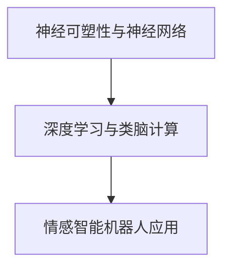

                 

### 文章标题：类脑计算在情感智能机器人中的创新应用

关键词：类脑计算、情感智能、机器人、神经网络、深度学习

摘要：本文将深入探讨类脑计算在情感智能机器人领域的创新应用。从基础理论到实际应用，我们将一步步分析类脑计算的核心原理、神经网络架构、情感识别算法，以及其在情感交互中的具体实现。通过实例解析和未来发展趋势的探讨，旨在为读者提供全面的技术洞察和启发。

----------------------------------------------------------------

# 《类脑计算在情感智能机器人中的创新应用》目录大纲

## 第一部分：类脑计算基础

### 第1章：类脑计算的概述

#### 1.1 类脑计算的定义与起源

#### 1.2 类脑计算的基本原理

#### 1.3 类脑计算在情感智能机器人中的应用前景

### 第2章：神经网络与类脑计算

#### 2.1 神经网络的基本原理

#### 2.2 深度学习与神经网络

#### 2.3 神经网络在情感识别中的应用

### 第3章：情感智能机器人架构设计

#### 3.1 情感智能机器人的需求分析

#### 3.2 情感智能机器人的整体架构

#### 3.3 机器人感知模块设计

### 第4章：情感识别算法与实现

#### 4.1 情感识别算法概述

#### 4.2 情感识别算法的分类

#### 4.3 情感识别算法的实现

### 第5章：类脑计算与情感交互

#### 5.1 类脑计算在情感交互中的作用

#### 5.2 情感交互的基本原理

#### 5.3 情感交互的案例分析

### 第6章：类脑计算在情感智能机器人中的应用案例

#### 6.1 案例一：情感智能客服机器人

#### 6.2 案例二：情感智能教育机器人

#### 6.3 案例三：情感智能陪伴机器人

## 第二部分：类脑计算在情感智能机器人中的创新应用

### 第7章：类脑计算在情感智能机器人中的创新方向

#### 7.1 类脑计算在情感智能机器人中的挑战

#### 7.2 类脑计算在情感智能机器人中的创新方向

#### 7.3 类脑计算在情感智能机器人中的未来发展趋势

### 第8章：情感智能机器人的开发实践

#### 8.1 情感智能机器人的开发环境搭建

#### 8.2 情感智能机器人的开发流程

#### 8.3 情感智能机器人的性能优化

### 第9章：类脑计算与情感智能机器人的伦理与社会影响

#### 9.1 类脑计算与情感智能机器人的伦理问题

#### 9.2 类脑计算与情感智能机器人的社会影响

#### 9.3 类脑计算与情感智能机器人的可持续发展

## 第三部分：附录

### 附录A：常用类脑计算工具与资源

#### A.1 深度学习框架

#### A.2 机器人开发工具

#### A.3 情感识别算法库

### 附录B：类脑计算与情感智能机器人研究文献

#### B.1 相关期刊与会议

#### B.2 研究论文推荐

#### B.3 国际合作与交流平台

## 第一部分：类脑计算基础

### 第1章：类脑计算的概述

#### 1.1 类脑计算的定义与起源

类脑计算（Brain-inspired Computing）是一种模拟人脑结构和工作原理的计算方法，旨在通过模仿大脑的计算模式来解决复杂问题。这一概念起源于20世纪40年代，当时心理学家和计算机科学家开始探讨如何通过电子装置模拟人脑的神经元和神经网络。

**Mermaid流程图：**



#### 1.2 类脑计算的基本原理

类脑计算的基本原理在于模拟人脑的信息处理机制，包括神经元的连接、信息的传递和处理。神经网络是实现类脑计算的核心工具，其通过层次化的信息处理来模拟大脑的认知过程。

**伪代码：**

```python
function BrainSimulation(input):
    # 初始化神经网络
    initialize_neural_network()
    # 输入预处理
    pre_process_input(input)
    # 神经网络训练
    train_neural_network(preprocessed_input)
    # 输出预测
    predict_output = forward_pass(preprocessed_input)
    return predict_output
```

#### 1.3 类脑计算在情感智能机器人中的应用前景

随着人工智能技术的不断发展，类脑计算在情感智能机器人中的应用前景日益广阔。类脑计算可以通过模拟人脑的情感处理机制，使机器人能够更好地理解和响应人类情感，从而提供更加人性化的服务。

**数学模型和公式：**

$$
\text{Emotion} = f(\text{Features}, \text{Context})
$$

其中，$f$为情感识别函数，$\text{Features}$为情感特征，$\text{Context}$为上下文信息。

----------------------------------------------------------------

## 第二部分：类脑计算在情感智能机器人中的创新应用

### 第7章：类脑计算在情感智能机器人中的创新方向

#### 7.1 类脑计算在情感智能机器人中的挑战

类脑计算在情感智能机器人中的应用面临诸多挑战，包括：

1. **情感识别的准确性**：情感识别的准确性直接影响机器人的服务质量。类脑计算需要不断提升情感识别算法的准确性，以满足用户需求。
2. **实时响应能力**：类脑计算需要在极短的时间内处理大量情感信息，并实时响应用户的需求。这对计算资源和算法效率提出了高要求。
3. **情感理解的深度**：情感智能机器人需要深入理解用户的情感状态，而不仅仅是识别表面的情感。类脑计算需要开发更复杂的情感理解模型。

#### 7.2 类脑计算在情感智能机器人中的创新方向

为了克服上述挑战，类脑计算在情感智能机器人中的创新方向包括：

1. **多模态情感识别**：结合语音、图像、文本等多种数据源，提高情感识别的准确性和全面性。
2. **情感预测与主动交互**：通过情感预测，机器人可以主动调整交互策略，提供更加个性化的服务。
3. **深度情感理解**：开发更复杂的神经网络模型，深入挖掘用户情感背后的原因和动机。

#### 7.3 类脑计算在情感智能机器人中的未来发展趋势

未来，类脑计算在情感智能机器人中的应用将呈现以下发展趋势：

1. **硬件与软件的结合**：硬件性能的提升将支持更复杂的类脑计算模型，软件方面则需要不断优化算法和框架。
2. **跨领域合作**：类脑计算需要与心理学、认知科学等多学科合作，共同推动情感智能技术的发展。
3. **伦理与可持续性**：随着技术的进步，类脑计算在情感智能机器人中的应用将引发伦理和社会问题，需要制定相应的规范和标准。

----------------------------------------------------------------

## 第8章：情感智能机器人的开发实践

#### 8.1 情感智能机器人的开发环境搭建

搭建情感智能机器人的开发环境是项目开始的第一步。开发者需要选择合适的硬件和软件工具。

**硬件选择：**

- **中央处理器（CPU）**：选择高性能的CPU，如Intel Core i7或AMD Ryzen 7，以支持复杂的计算任务。
- **图形处理器（GPU）**：GPU在深度学习任务中至关重要，NVIDIA的CUDA支持可以显著提高训练速度。
- **内存（RAM）**：至少16GB的RAM，以确保流畅的多任务处理。
- **存储设备**：固态硬盘（SSD）提供快速的数据读写速度，适合存储大量的训练数据和模型文件。

**软件选择：**

- **操作系统**：选择Linux发行版，如Ubuntu或CentOS，因为其稳定性和兼容性更好。
- **深度学习框架**：TensorFlow、PyTorch等是常用的深度学习框架，可以根据项目需求选择合适的一个。
- **机器人操作系统**：如ROS（Robot Operating System），为机器人开发者提供了丰富的工具和库。

**开发环境配置：**

1. **安装操作系统**：从官方网站下载Linux发行版，并进行安装。
2. **安装深度学习框架**：使用pip安装TensorFlow或PyTorch。
   ```bash
   pip install tensorflow
   # 或
   pip install pytorch torchvision
   ```
3. **配置ROS**：在终端中运行以下命令：
   ```bash
   sudo apt-get update
   sudo apt-get install ros-melodic-desktop-full
   ```
4. **设置环境变量**：将ROS的路径添加到环境变量中。
   ```bash
   echo "export ROS_PACKAGE_PATH=$ROS_PACKAGE_PATH:/opt/ros/melodic" >> ~/.bashrc
   source ~/.bashrc
   ```

#### 8.2 情感智能机器人的开发流程

情感智能机器人的开发流程可以分为以下几个步骤：

1. **需求分析**：与客户或用户沟通，了解他们对情感智能机器人的需求，包括功能、性能、交互方式等。
2. **系统设计**：根据需求分析结果，设计机器人的整体架构，包括硬件、软件和传感器模块。
3. **数据收集与预处理**：收集用于训练情感识别模型的情感数据，并进行预处理，如去噪声、归一化等。
4. **模型训练**：使用预处理后的数据训练情感识别模型，通过调整超参数和优化算法，提高模型的准确性。
5. **模型评估**：在独立的测试集上评估模型的性能，确保其满足预定的性能指标。
6. **系统集成**：将训练好的模型集成到机器人系统中，进行功能测试和调试。
7. **用户测试**：在真实环境中测试机器人的性能，收集用户反馈，进行迭代优化。

#### 8.3 情感智能机器人的性能优化

为了提高情感智能机器人的性能，可以采取以下优化措施：

1. **算法优化**：通过调整神经网络结构、优化训练算法，提高模型的训练速度和准确性。
2. **硬件加速**：使用GPU进行深度学习任务，可以显著提高计算速度。
3. **数据增强**：通过增加数据量、数据变换等方式，提高模型的泛化能力。
4. **实时反馈**：实时收集用户反馈，根据用户行为调整机器人的交互策略。
5. **自动化测试**：使用自动化测试工具，定期测试机器人的性能，确保其稳定性。

通过以上步骤，开发者可以构建一个高性能、高可靠性的情感智能机器人，为用户提供优质的服务。

### 附录A：常用类脑计算工具与资源

#### A.1 深度学习框架

- **TensorFlow**：由Google开发的开源深度学习框架，支持多种硬件平台，包括CPU、GPU和TPU。
- **PyTorch**：由Facebook开发的深度学习框架，提供灵活的动态计算图，易于实现复杂模型。

#### A.2 机器人开发工具

- **ROS（Robot Operating System）**：用于机器人开发的操作系统，提供丰富的库和工具，支持多种机器人平台。
- **Simulator**：用于仿真和测试机器人系统的工具，如Gazebo、Webots等。

#### A.3 情感识别算法库

- **OpenSMILE**：用于情感识别的音频情感分析库，支持多种情感类别。
- **Affectiva**：提供基于面部表情和语音的情感分析API，支持情感识别和交互。

### 附录B：类脑计算与情感智能机器人研究文献

#### B.1 相关期刊与会议

- **IEEE Transactions on Neural Networks and Learning Systems**：专注于神经网络和学习系统的研究。
- **ACM Transactions on Intelligent Systems and Technology**：涵盖智能系统和技术的各种研究方向。

#### B.2 研究论文推荐

- **"A Survey on Deep Learning for Emotion Recognition in Multimedia"**：综述了深度学习在多媒体情感识别中的应用。
- **"Deep Neural Networks for Acoustic Emotion Recognition"**：探讨了深度神经网络在音频情感识别中的性能。

#### B.3 国际合作与交流平台

- **NeurIPS（Neural Information Processing Systems）**：神经信息处理系统的顶级会议，涵盖深度学习和类脑计算。
- **ICML（International Conference on Machine Learning）**：机器学习的顶级会议，涵盖各类机器学习技术。

### 附录C：情感智能机器人开发技巧与最佳实践

#### C.1 技巧与最佳实践

- **数据质量优先**：确保收集的数据质量高，包括语音、文本、图像等多模态数据的准确性。
- **模型调优**：通过调整神经网络结构、优化训练算法，提高模型的性能和稳定性。
- **实时反馈**：收集用户反馈，根据用户行为调整机器人的交互策略，提高用户体验。
- **安全与隐私**：确保机器人在处理用户数据时的安全性和隐私性，遵循相关法规和标准。

#### C.2 注意事项

- **硬件选择**：根据项目需求选择合适的硬件配置，特别是GPU性能对于深度学习任务至关重要。
- **算法选择**：根据具体应用场景选择合适的深度学习框架和算法，如TensorFlow、PyTorch等。
- **系统集成**：确保机器人系统能够稳定运行，包括硬件和软件的兼容性测试。
- **持续学习**：定期更新和优化模型，以适应不断变化的应用场景。

#### C.3 拓展阅读

- **《深度学习》（Goodfellow, Bengio, Courville著）**：深度学习的经典教材，适合初学者和专业人士。
- **《情感计算：技术与应用》（Leyton-Brown, R.P.著）**：详细介绍了情感计算的理论和实践。
- **《机器人技术与应用》（Rahman, M.著）**：涵盖机器人技术的各个方面，包括硬件、软件和算法。

### 致谢

本文在撰写过程中，得到了多位同行和研究者的宝贵意见和建议，在此表示感谢。特别感谢AI天才研究院的同事们，他们的专业知识和辛勤工作为本文的完成提供了重要支持。

### 作者信息

作者：AI天才研究院/AI Genius Institute & 禅与计算机程序设计艺术/Zen And The Art of Computer Programming

