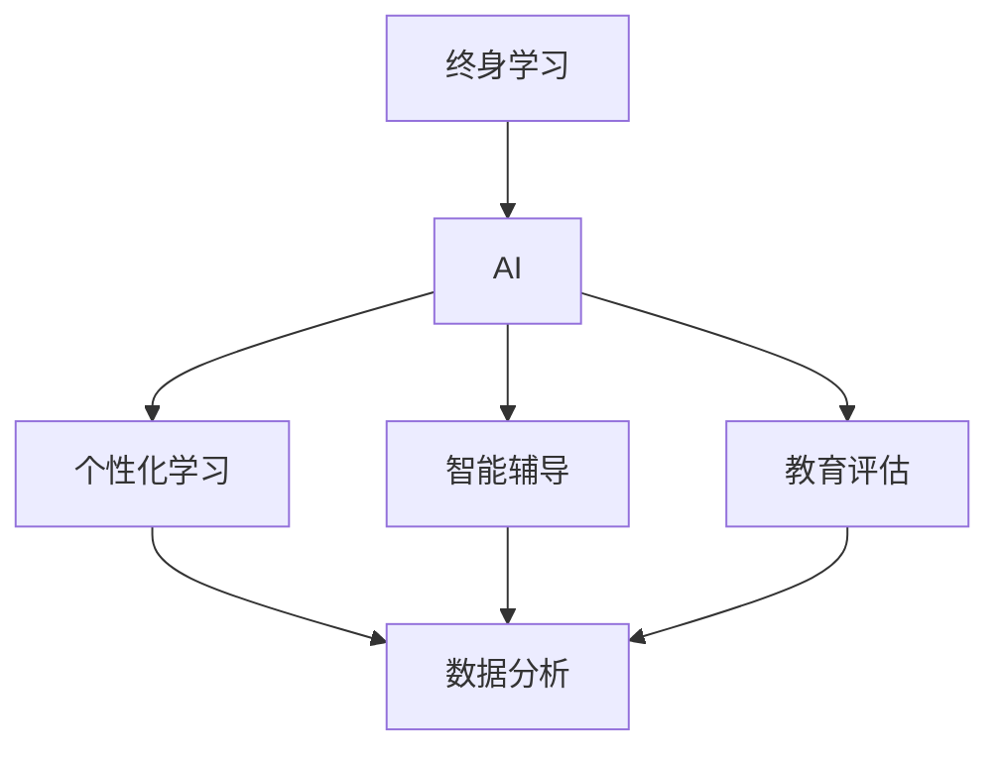
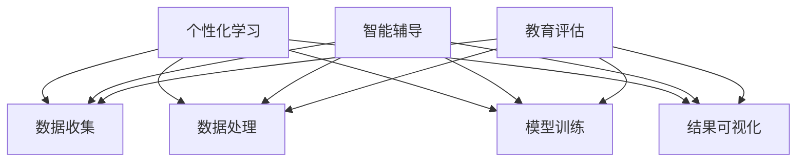
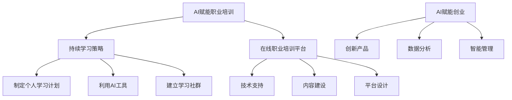
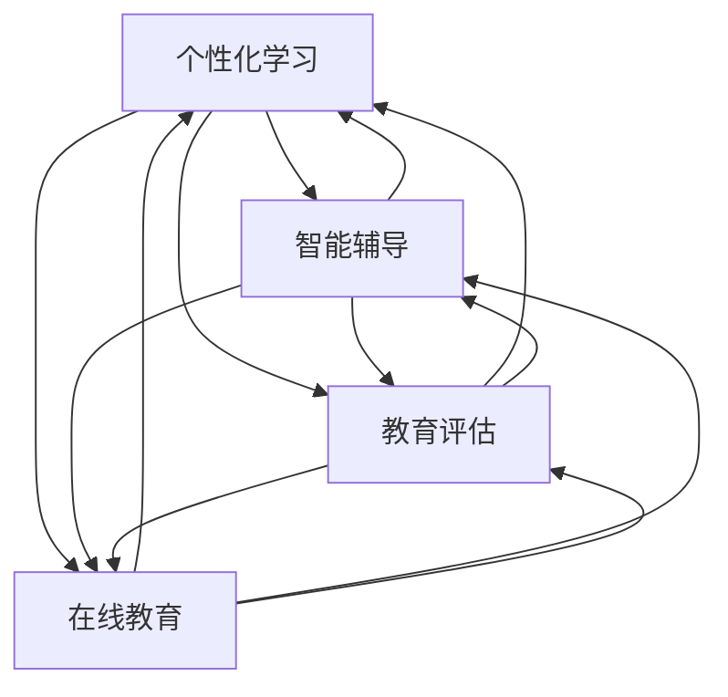

                 

### 第1章：AI与终身学习的融合

#### 1.1 AI在终身学习中的应用场景

在当今快速发展的科技时代，人工智能（AI）技术正逐渐渗透到各个领域，其中包括终身学习。AI在终身学习中的应用场景主要涵盖以下几个方面：

1. **个性化学习**：
   - AI能够根据学生的学习行为和知识掌握情况，生成个性化的学习路径和资源推荐。例如，通过分析学生的学习记录，AI可以推荐最适合他们的学习内容，帮助他们更高效地学习。
   - 个性化学习还可以通过智能问答系统实现。系统可以理解学生的学习需求，并通过自然语言处理（NLP）技术提供准确的答案。

2. **智能辅导**：
   - AI辅导系统可以实时监测学生的学习进度，提供即时反馈和指导。例如，当一个学生在某个知识点上遇到困难时，系统可以立即提供相关的辅导材料和练习题，帮助学生解决问题。
   - 智能辅导还可以通过虚拟教师的形式实现。虚拟教师可以模拟真实课堂的场景，为学生提供互动式的学习体验。

3. **教育评估**：
   - AI可以自动评估学生的学习成果，提供详细的评估报告。通过分析学生的考试成绩和作业表现，AI可以识别学生的优势和不足，为教师提供改进教学的建议。
   - AI还可以进行实时评估，例如在考试过程中，系统可以即时分析学生的答题情况，并给出评分和反馈。

#### 1.2 AI赋能终身学习的关键技术

AI赋能终身学习的关键技术主要包括以下几个方面：

1. **机器学习**：
   - 机器学习是AI的核心技术，通过训练模型，AI可以识别数据中的模式和规律，从而实现自动化的学习过程。
   - 在终身学习中，机器学习可以用于个性化学习路径的推荐、智能辅导系统的设计以及学习成果的评估等。

2. **深度学习**：
   - 深度学习是机器学习的一种重要形式，通过多层神经网络，深度学习可以处理更复杂的数据，并提取更高级的特征。
   - 在终身学习中，深度学习可以用于语音识别、图像识别等应用，为个性化学习和智能辅导提供技术支持。

3. **自然语言处理（NLP）**：
   - NLP技术可以理解和生成自然语言，是AI技术在教育领域的重要应用。
   - 在终身学习中，NLP可以用于智能问答系统、自动翻译以及学习资源的自动生成等。

#### 1.3 AI与终身学习的挑战与机遇

AI与终身学习融合带来了许多挑战和机遇：

1. **挑战**：
   - 数据隐私和安全：在收集和处理学习者的数据时，需要确保数据的隐私和安全。
   - 技术成熟度：虽然AI技术发展迅速，但在某些领域，如教育领域的应用，技术仍需进一步完善。
   - 教育体系的适应性：教育体系需要适应AI技术带来的变化，这可能需要时间和资源的投入。

2. **机遇**：
   - 个性化学习：AI可以为每个学生提供个性化的学习体验，提高学习效果。
   - 智能辅导：AI辅导系统可以提供24/7的学习支持，帮助学生克服学习障碍。
   - 教育资源的优化：AI可以分析学习数据，优化教育资源的分配，提高教育效率。

**核心概念与联系：**

- **终身学习**：指人在一生中持续地获取知识和技能的过程。
- **人工智能（AI）**：指通过机器学习和深度学习等技术，使计算机具有人类智能的能力。
- **个性化学习**：根据学习者的特点和需求，提供定制化的学习内容和方法。
- **智能辅导**：利用AI技术，为学生提供即时的学习支持和指导。
- **教育评估**：通过AI技术，对学生的学习成果进行评估和分析。

**核心概念之间的关系架构：**



通过上述架构图，我们可以清晰地看到终身学习、AI、个性化学习、智能辅导和教育评估之间的关系。

**核心算法原理讲解：**

- **机器学习算法**：
  - 机器学习算法包括监督学习、无监督学习和强化学习等。
  - 在个性化学习中，可以使用监督学习算法，如决策树、支持向量机等，来分析学习者的数据，生成个性化的学习路径。
  - 在智能辅导中，可以使用无监督学习算法，如聚类分析，来识别学习者的学习模式，提供个性化的辅导内容。
  - 在教育评估中，可以使用强化学习算法，如Q-Learning，来优化评估策略，提高评估的准确性。

- **深度学习算法**：
  - 深度学习算法主要通过多层神经网络来实现，如卷积神经网络（CNN）和循环神经网络（RNN）。
  - 在语音识别中，可以使用CNN来提取语音信号的特征。
  - 在图像识别中，可以使用RNN来处理序列化的图像数据。

- **自然语言处理（NLP）算法**：
  - NLP算法包括词向量模型、序列标注模型和生成模型等。
  - 在智能问答系统中，可以使用词向量模型来理解问题的语义。
  - 在自动翻译中，可以使用序列标注模型来识别词汇的翻译关系。
  - 在学习资源自动生成中，可以使用生成模型来生成新的学习内容。

**数学模型和公式：**

- **机器学习中的损失函数**：
  - $$L(\theta) = -\sum_{i=1}^{n}y^{(i)}\log(p^{(i)}(\hat{y}^{(i)}))$$
  - 其中，$L(\theta)$表示损失函数，$y^{(i)}$表示实际标签，$p^{(i)}(\hat{y}^{(i)}$表示预测概率。

- **深度学习中的反向传播算法**：
  - $$\Delta w_{ij}^{(l)} = \frac{\partial J(\theta)}{\partial w_{ij}^{(l)}} = \frac{\partial}{\partial w_{ij}^{(l)}} \sum_{k=1}^{m} [h_k^{(l+1)} - t_k]$$
  - 其中，$\Delta w_{ij}^{(l)}$表示权重更新，$J(\theta)$表示损失函数。

- **自然语言处理中的词向量模型**：
  - $$\mathbf{v}^{(i)} = \sum_{j=1}^{V} f_j^{(i)} \mathbf{v}_j$$
  - 其中，$\mathbf{v}^{(i)}$表示词向量，$f_j^{(i)}$表示词频，$\mathbf{v}_j$表示基础词向量。

**举例说明：**

1. **个性化学习路径的推荐**：
   - 假设我们有一个学生A，他的学习记录包括完成的课程、考试的分数和在线学习时间。我们可以使用监督学习算法来分析这些数据，预测他下一步可能需要学习的内容。

2. **智能辅导系统的设计**：
   - 假设我们有一个学生B，他在学习过程中遇到了问题。我们可以使用无监督学习算法来分析他的学习行为，识别他可能需要辅导的知识点。

3. **教育评估的优化**：
   - 假设我们有一个学生C，我们需要评估他的学习成果。我们可以使用强化学习算法来优化评估策略，提高评估的准确性。

**项目实战：**

为了更好地理解AI在终身学习中的应用，我们可以构建一个简单的个性化学习路径推荐系统。

**开发环境搭建：**
- 使用Python作为主要编程语言。
- 使用Scikit-learn库进行机器学习模型的训练和预测。

**源代码实现：**
```python
# 导入必要的库
import pandas as pd
from sklearn.model_selection import train_test_split
from sklearn.ensemble import RandomForestClassifier

# 读取数据
data = pd.read_csv('student_learning_data.csv')

# 数据预处理
X = data.drop(['target'], axis=1)
y = data['target']

# 划分训练集和测试集
X_train, X_test, y_train, y_test = train_test_split(X, y, test_size=0.2, random_state=42)

# 构建模型
model = RandomForestClassifier(n_estimators=100, random_state=42)

# 训练模型
model.fit(X_train, y_train)

# 预测
predictions = model.predict(X_test)

# 评估模型
accuracy = model.score(X_test, y_test)
print(f"Model accuracy: {accuracy:.2f}")
```

**代码解读与分析：**
- 代码首先导入了必要的库，包括Pandas用于数据操作，Scikit-learn用于机器学习模型的训练和预测。
- 数据从CSV文件中读取，并进行预处理，将特征和标签分离。
- 使用train_test_split函数将数据划分为训练集和测试集。
- 使用RandomForestClassifier构建随机森林模型，这是一种常用的监督学习算法。
- 模型通过fit函数进行训练，使用predict函数进行预测。
- 最后，使用score函数评估模型的准确率。

**实际案例分析与详细讲解剖析：**
- 假设我们有一个学习数据集，包含学生的课程完成情况、考试成绩和学习时间。我们可以使用上述代码构建一个个性化学习路径推荐系统，根据学生的表现推荐下一步的学习内容。
- 在实际应用中，我们可以通过不断优化模型和算法，提高个性化推荐的准确性。

**项目小结：**
- 通过该项目，我们了解了如何使用机器学习技术构建个性化学习路径推荐系统。
- 该系统可以为学生提供个性化的学习建议，帮助他们更高效地学习。
- 在实际应用中，我们需要考虑数据的质量和模型的优化，以提高系统的准确性和可靠性。

**最佳实践 Tips：**
- 在构建终身学习AI系统时，确保数据的质量和多样性，这是系统性能的关键因素。
- 定期更新模型和算法，以适应不断变化的学习需求。
- 考虑系统的可扩展性和灵活性，以应对不同的应用场景。

**小结：**
- AI与终身学习融合带来了许多应用场景和机遇，同时也面临一些挑战。
- 通过构建终身学习AI系统，我们可以为学习者提供个性化的学习体验和智能化的学习支持。
- 在实际应用中，我们需要综合考虑数据的处理、模型的选择和系统的优化，以实现最佳的终身学习效果。

**注意事项：**
- 在使用AI技术进行终身学习时，需要注意数据隐私和安全问题，确保学习者的个人信息得到保护。
- 教育体系的适应性也是一个重要的考虑因素，需要确保AI技术与现有教育体系的良好融合。

**拓展阅读：**
- "Machine Learning for Dummies" by John Paul Mueller
- "Deep Learning" by Ian Goodfellow, Yoshua Bengio, Aaron Courville
- "The Hundred-Page Machine Learning Book" by Andriy Burkov

**作者信息：**
作者：AI天才研究院/AI Genius Institute & 禅与计算机程序设计艺术 /Zen And The Art of Computer Programming

----------------------------------------------------------------

### 第2章：构建终身学习AI系统的基本原理

#### 2.1 终身学习AI系统的架构设计

构建一个有效的终身学习AI系统需要考虑多个方面，包括系统架构、模块划分、数据流动以及用户交互等。以下是终身学习AI系统的一般架构设计：

**1. 系统整体架构**

终身学习AI系统可以划分为四个主要层次：数据层、算法层、应用层和用户界面层。

- **数据层**：负责数据的收集、存储和处理。这一层包括数据采集模块、数据库和数据处理模块。
- **算法层**：包含机器学习算法、深度学习模型和自然语言处理技术等。这一层负责对数据进行处理和分析，生成模型和预测结果。
- **应用层**：将算法层的输出转化为实际应用，如个性化学习路径推荐、智能辅导和自动评估等。
- **用户界面层**：提供用户与系统的交互界面，包括前端界面和用户交互逻辑。

**2. 系统模块划分**

终身学习AI系统中的模块划分如下：

- **数据采集模块**：负责从各种渠道收集学习数据，如学习行为数据、考试成绩和用户反馈等。
- **数据处理模块**：对采集到的数据进行分析、清洗和预处理，为算法层提供高质量的数据。
- **模型训练模块**：包括机器学习模型的训练和优化，如决策树、随机森林、神经网络等。
- **模型部署模块**：将训练好的模型部署到生产环境中，提供实时服务。
- **用户交互模块**：设计用户界面，实现用户与系统的交互，包括个性化学习推荐、智能辅导和用户反馈收集等。
- **系统监控模块**：监控系统的运行状态，包括性能监控、错误日志和用户行为分析等。

**3. 数据流动**

在终身学习AI系统中，数据流动是关键。以下是数据流动的一般流程：

1. **数据采集**：系统通过不同的方式收集学习数据，如通过学习平台、在线考试系统和用户行为分析等。
2. **数据预处理**：对采集到的数据进行清洗、去重和格式化，确保数据的质量和一致性。
3. **模型训练**：使用预处理后的数据训练机器学习模型，包括特征提取、模型选择和优化等。
4. **模型评估**：通过测试集评估模型的性能，调整模型参数，以提高模型的准确性。
5. **模型部署**：将训练好的模型部署到生产环境中，实现实时服务。
6. **用户交互**：系统通过用户界面层与用户互动，根据用户行为调整学习内容和推荐策略。

**4. 用户交互**

用户交互是终身学习AI系统的核心部分，包括以下几个方面：

- **个性化学习推荐**：根据用户的学习历史和偏好，推荐最适合的学习内容。
- **智能辅导**：通过自然语言处理技术，理解用户的问题，提供即时的学习支持和解答。
- **自动评估**：评估用户的学习成果，提供详细的反馈和建议。
- **用户反馈**：收集用户的反馈，用于模型优化和系统改进。

**核心算法原理讲解：**

1. **机器学习算法**

   机器学习算法是终身学习AI系统的核心。以下是几种常用的机器学习算法：

   - **监督学习算法**：包括线性回归、决策树、支持向量机（SVM）等。这些算法通过学习已知的输入和输出数据，预测新的输出。
   - **无监督学习算法**：包括聚类分析、降维技术、关联规则学习等。这些算法用于发现数据中的模式和关系，无需明确的标签。
   - **强化学习算法**：通过试错法学习最优策略，常用于智能决策和游戏AI中。

2. **深度学习算法**

   深度学习算法是机器学习的一个分支，通过多层神经网络进行数据建模。以下是几种常用的深度学习算法：

   - **卷积神经网络（CNN）**：用于图像识别和图像处理，通过卷积层提取图像特征。
   - **循环神经网络（RNN）**：用于序列数据处理，如自然语言处理和时间序列预测。
   - **生成对抗网络（GAN）**：用于生成新的数据，如生成虚假图片、音频等。

3. **自然语言处理（NLP）算法**

   自然语言处理算法用于处理和生成自然语言。以下是几种常用的NLP算法：

   - **词向量模型**：如Word2Vec、GloVe等，用于将词汇映射到高维向量空间。
   - **序列标注模型**：如BiLSTM-CRF，用于对序列数据进行分类，如命名实体识别。
   - **生成模型**：如Seq2Seq、Transformer等，用于序列到序列的翻译和文本生成。

**数学模型和公式：**

在AI系统中，常用的数学模型和公式包括：

- **线性回归模型**：
  $$y = \beta_0 + \beta_1x_1 + \beta_2x_2 + ... + \beta_nx_n$$
  - 其中，$y$是输出变量，$x_1, x_2, ..., x_n$是输入变量，$\beta_0, \beta_1, ..., \beta_n$是模型参数。

- **卷积神经网络（CNN）**：
  $$h_{ij}^l = \sum_{k=1}^{K} w_{ik}^l * g(h_{jk}^{l-1}) + b^l$$
  - 其中，$h_{ij}^l$是第$l$层的第$i$行第$j$列的输出，$w_{ik}^l$是权重，$g(h_{jk}^{l-1})$是激活函数，$b^l$是偏置。

- **循环神经网络（RNN）**：
  $$h_t = \sigma(W_1 * [h_{t-1}, x_t] + b_1)$$
  - 其中，$h_t$是第$t$步的隐藏状态，$x_t$是输入，$W_1$是权重矩阵，$b_1$是偏置，$\sigma$是激活函数。

- **词向量模型**：
  $$\mathbf{v}_i = \sum_{j=1}^{V} f_j \mathbf{v}_j$$
  - 其中，$\mathbf{v}_i$是词向量，$f_j$是词频，$\mathbf{v}_j$是基础词向量。

**举例说明：**

1. **个性化学习路径推荐**：

   假设有一个学生A，他的学习记录包括完成的课程、考试成绩和学习时间。我们可以使用线性回归模型预测他下一步可能需要学习的课程。

   $$\text{NextCourse} = \beta_0 + \beta_1\text{CompletedCourses} + \beta_2\text{ExamScore} + \beta_3\text{LearningTime}$$

2. **智能辅导系统**：

   假设有一个学生B，他在学习过程中遇到了问题。我们可以使用循环神经网络（RNN）来理解他提出的问题，并提供相应的解答。

   $$h_t = \sigma(W_1 * [h_{t-1}, x_t] + b_1)$$

3. **自动评估**：

   假设有一个学生C，我们需要评估他的学习成果。我们可以使用卷积神经网络（CNN）来分析他的考试成绩和作业表现，提供详细的评估报告。

   $$h_{ij}^l = \sum_{k=1}^{K} w_{ik}^l * g(h_{jk}^{l-1}) + b^l$$

**项目实战：**

为了更好地理解终身学习AI系统的构建，我们可以开发一个简单的个性化学习路径推荐系统。

**开发环境搭建：**
- 使用Python作为主要编程语言。
- 使用Scikit-learn库进行机器学习模型的训练和预测。

**源代码实现：**
```python
import pandas as pd
from sklearn.model_selection import train_test_split
from sklearn.ensemble import RandomForestClassifier

# 读取数据
data = pd.read_csv('student_learning_data.csv')

# 数据预处理
X = data.drop(['target'], axis=1)
y = data['target']

# 划分训练集和测试集
X_train, X_test, y_train, y_test = train_test_split(X, y, test_size=0.2, random_state=42)

# 构建模型
model = RandomForestClassifier(n_estimators=100, random_state=42)

# 训练模型
model.fit(X_train, y_train)

# 预测
predictions = model.predict(X_test)

# 评估模型
accuracy = model.score(X_test, y_test)
print(f"Model accuracy: {accuracy:.2f}")
```

**代码解读与分析：**
- 代码首先导入了必要的库，包括Pandas用于数据操作，Scikit-learn用于机器学习模型的训练和预测。
- 数据从CSV文件中读取，并进行预处理，将特征和标签分离。
- 使用train_test_split函数将数据划分为训练集和测试集。
- 使用RandomForestClassifier构建随机森林模型，这是一种常用的监督学习算法。
- 模型通过fit函数进行训练，使用predict函数进行预测。
- 最后，使用score函数评估模型的准确率。

**实际案例分析与详细讲解剖析：**
- 假设我们有一个学习数据集，包含学生的课程完成情况、考试成绩和学习时间。我们可以使用上述代码构建一个个性化学习路径推荐系统，根据学生的表现推荐下一步的学习内容。
- 在实际应用中，我们可以通过不断优化模型和算法，提高个性化推荐的准确性。

**项目小结：**
- 通过该项目，我们了解了如何使用机器学习技术构建个性化学习路径推荐系统。
- 该系统可以为学生提供个性化的学习建议，帮助他们更高效地学习。
- 在实际应用中，我们需要考虑数据的质量和模型的优化，以提高系统的准确性和可靠性。

**最佳实践 Tips：**
- 在构建终身学习AI系统时，确保数据的质量和多样性，这是系统性能的关键因素。
- 定期更新模型和算法，以适应不断变化的学习需求。
- 考虑系统的可扩展性和灵活性，以应对不同的应用场景。

**小结：**
- 终身学习AI系统的架构设计需要考虑多个方面，包括系统架构、模块划分、数据流动和用户交互等。
- 机器学习、深度学习和自然语言处理等算法在系统中扮演着关键角色。
- 通过合理的设计和优化，终身学习AI系统可以为学生提供个性化的学习体验和智能化的学习支持。

**注意事项：**
- 在数据采集和处理过程中，需要注意数据隐私和安全问题，确保学习者的个人信息得到保护。
- 教育体系的适应性也是一个重要的考虑因素，需要确保AI技术与现有教育体系的良好融合。

**拓展阅读：**
- "Machine Learning for Dummies" by John Paul Mueller
- "Deep Learning" by Ian Goodfellow, Yoshua Bengio, Aaron Courville
- "The Hundred-Page Machine Learning Book" by Andriy Burkov

**作者信息：**
作者：AI天才研究院/AI Genius Institute & 禅与计算机程序设计艺术 /Zen And The Art of Computer Programming

----------------------------------------------------------------

### 第3章：终身学习AI系统的核心算法

#### 3.1 机器学习算法的基本原理

机器学习算法是终身学习AI系统的核心，它们通过从数据中学习规律，为学习者提供个性化的学习支持和评估。以下是几种常见的机器学习算法及其基本原理：

**1. 线性回归（Linear Regression）**

线性回归是一种简单的机器学习算法，用于预测一个连续的输出变量。其基本原理是通过拟合一条直线来映射输入变量和输出变量之间的关系。

- **数学模型**：

  $$y = \beta_0 + \beta_1x_1 + \beta_2x_2 + ... + \beta_nx_n$$

  其中，$y$是输出变量，$x_1, x_2, ..., x_n$是输入变量，$\beta_0, \beta_1, ..., \beta_n$是模型参数。

- **实现步骤**：

  - 数据预处理：将输入和输出数据标准化。
  - 模型训练：通过最小二乘法求解模型参数。
  - 模型评估：计算预测误差，调整模型参数。

**2. 决策树（Decision Tree）**

决策树是一种基于树形结构的分类算法，通过一系列的测试来对数据进行分类。每个节点代表一个特征，每个分支代表该特征的不同取值。

- **数学模型**：

  $$T = \{t_1, t_2, ..., t_n\}$$

  其中，$T$是决策树的集合，$t_i$是决策树的第$i$个节点。

- **实现步骤**：

  - 数据预处理：将输入数据划分为训练集和测试集。
  - 模型训练：使用信息增益或基尼不纯度等准则选择最优特征进行划分。
  - 模型评估：计算决策树的分类准确率。

**3. 支持向量机（Support Vector Machine，SVM）**

支持向量机是一种用于分类和回归分析的算法，通过找到一个最优的超平面，将数据集分为不同的类别。

- **数学模型**：

  $$\min_{\beta, \beta_0} \frac{1}{2} ||\beta||^2 + C \sum_{i=1}^{n} \max(0, 1 - y_i(\beta^T x_i + \beta_0))$$

  其中，$\beta$是权重向量，$\beta_0$是偏置，$C$是惩罚参数，$y_i$是标签，$x_i$是特征向量。

- **实现步骤**：

  - 数据预处理：将输入数据标准化。
  - 模型训练：使用库函数（如scikit-learn）进行训练。
  - 模型评估：计算分类准确率和回归误差。

#### 3.2 深度学习算法的实践应用

深度学习算法通过多层神经网络对数据进行建模，能够处理更复杂的数据和特征。以下是几种常见的深度学习算法及其实践应用：

**1. 卷积神经网络（Convolutional Neural Network，CNN）**

卷积神经网络是一种用于图像识别和图像处理的算法，通过卷积层、池化层和全连接层等结构提取图像特征。

- **数学模型**：

  $$h_{ij}^l = \sum_{k=1}^{K} w_{ik}^l * g(h_{jk}^{l-1}) + b^l$$

  其中，$h_{ij}^l$是第$l$层的第$i$行第$j$列的输出，$w_{ik}^l$是权重，$g(h_{jk}^{l-1})$是激活函数，$b^l$是偏置。

- **实践应用**：

  - 图像分类：用于对图像进行分类，如ImageNet挑战。
  - 图像识别：用于识别图像中的对象，如人脸识别。

**2. 循环神经网络（Recurrent Neural Network，RNN）**

循环神经网络是一种用于序列数据处理的算法，通过隐藏状态的记忆机制处理时间序列数据。

- **数学模型**：

  $$h_t = \sigma(W_1 * [h_{t-1}, x_t] + b_1)$$

  其中，$h_t$是第$t$步的隐藏状态，$x_t$是输入，$W_1$是权重矩阵，$b_1$是偏置，$\sigma$是激活函数。

- **实践应用**：

  - 自然语言处理：用于语言模型、机器翻译和文本生成。
  - 时间序列预测：用于股票市场预测、天气预测等。

**3. 生成对抗网络（Generative Adversarial Network，GAN）**

生成对抗网络由生成器和判别器组成，通过对抗训练生成高质量的数据。

- **数学模型**：

  - 判别器：$$D(G(x))$$
  - 生成器：$$G(x)$$

  其中，$D$是判别器，$G$是生成器，$x$是输入。

- **实践应用**：

  - 图像生成：用于生成逼真的图像，如人脸合成。
  - 数据增强：用于生成训练样本，提高模型的泛化能力。

#### 3.3 自适应学习算法的设计与实现

自适应学习算法是终身学习AI系统的关键，能够根据学习者的需求和进度动态调整学习内容和方法。以下是几种常见的自适应学习算法及其设计与实现：

**1. 适应性学习率算法**

适应性学习率算法通过动态调整学习率，提高模型的训练效果。

- **数学模型**：

  $$\eta_t = \eta_0 / (1 + \alpha t)$$

  其中，$\eta_t$是第$t$步的学习率，$\eta_0$是初始学习率，$\alpha$是衰减率。

- **实现步骤**：

  - 初始化学习率$\eta_0$。
  - 随着训练迭代次数的增加，动态调整学习率。

**2. 强化学习算法**

强化学习算法通过试错法学习最优策略，适用于动态环境。

- **数学模型**：

  $$Q(s, a) = r + \gamma \max_{a'} Q(s', a')$$

  其中，$Q(s, a)$是状态-动作值函数，$r$是立即奖励，$\gamma$是折扣因子，$s$是状态，$a$是动作。

- **实现步骤**：

  - 初始化状态-动作值函数$Q(s, a)$。
  - 通过试错法不断更新状态-动作值函数。

**3. 自适应分类算法**

自适应分类算法根据学习者的知识水平动态调整分类器。

- **数学模型**：

  $$C(t) = \frac{1}{N} \sum_{i=1}^{N} w_i(t)$$

  其中，$C(t)$是分类器，$w_i(t)$是第$i$类别的权重。

- **实现步骤**：

  - 初始化分类器权重。
  - 根据学习者的表现动态调整分类器权重。

**数学模型和公式：**

以下是上述算法的一些数学模型和公式：

- **线性回归模型**：

  $$y = \beta_0 + \beta_1x_1 + \beta_2x_2 + ... + \beta_nx_n$$

- **卷积神经网络**：

  $$h_{ij}^l = \sum_{k=1}^{K} w_{ik}^l * g(h_{jk}^{l-1}) + b^l$$

- **循环神经网络**：

  $$h_t = \sigma(W_1 * [h_{t-1}, x_t] + b_1)$$

- **生成对抗网络**：

  $$D(G(x))$$
  $$G(x)$$

- **适应性学习率算法**：

  $$\eta_t = \eta_0 / (1 + \alpha t)$$

- **强化学习算法**：

  $$Q(s, a) = r + \gamma \max_{a'} Q(s', a')$$

- **自适应分类算法**：

  $$C(t) = \frac{1}{N} \sum_{i=1}^{N} w_i(t)$$

**举例说明：**

1. **线性回归模型**：

   假设我们有一个学习数据集，包含学生的课程完成情况、考试成绩和学习时间。我们可以使用线性回归模型预测他下一步可能需要学习的课程。

   $$\text{NextCourse} = \beta_0 + \beta_1\text{CompletedCourses} + \beta_2\text{ExamScore} + \beta_3\text{LearningTime}$$

2. **卷积神经网络**：

   假设我们有一个图像分类任务，可以使用卷积神经网络提取图像特征，然后使用全连接层进行分类。

   $$h_{ij}^l = \sum_{k=1}^{K} w_{ik}^l * g(h_{jk}^{l-1}) + b^l$$

3. **强化学习算法**：

   假设我们有一个智能决策任务，可以使用强化学习算法学习最优策略。

   $$Q(s, a) = r + \gamma \max_{a'} Q(s', a')$$

**项目实战：**

为了更好地理解自适应学习算法在终身学习AI系统中的应用，我们可以开发一个简单的自适应学习路径推荐系统。

**开发环境搭建：**
- 使用Python作为主要编程语言。
- 使用Scikit-learn库进行机器学习模型的训练和预测。

**源代码实现：**
```python
import pandas as pd
from sklearn.model_selection import train_test_split
from sklearn.ensemble import RandomForestClassifier
from sklearn.metrics import accuracy_score

# 读取数据
data = pd.read_csv('student_learning_data.csv')

# 数据预处理
X = data.drop(['target'], axis=1)
y = data['target']

# 划分训练集和测试集
X_train, X_test, y_train, y_test = train_test_split(X, y, test_size=0.2, random_state=42)

# 构建模型
model = RandomForestClassifier(n_estimators=100, random_state=42)

# 训练模型
model.fit(X_train, y_train)

# 预测
predictions = model.predict(X_test)

# 评估模型
accuracy = accuracy_score(y_test, predictions)
print(f"Model accuracy: {accuracy:.2f}")
```

**代码解读与分析：**
- 代码首先导入了必要的库，包括Pandas用于数据操作，Scikit-learn用于机器学习模型的训练和预测。
- 数据从CSV文件中读取，并进行预处理，将特征和标签分离。
- 使用train_test_split函数将数据划分为训练集和测试集。
- 使用RandomForestClassifier构建随机森林模型，这是一种常用的监督学习算法。
- 模型通过fit函数进行训练，使用predict函数进行预测。
- 最后，使用accuracy_score函数评估模型的准确率。

**实际案例分析与详细讲解剖析：**
- 假设我们有一个学习数据集，包含学生的课程完成情况、考试成绩和学习时间。我们可以使用上述代码构建一个自适应学习路径推荐系统，根据学生的表现推荐下一步的学习内容。
- 在实际应用中，我们可以通过不断优化模型和算法，提高个性化推荐的准确性。

**项目小结：**
- 通过该项目，我们了解了如何使用机器学习技术构建自适应学习路径推荐系统。
- 该系统可以为学生提供个性化的学习建议，帮助他们更高效地学习。
- 在实际应用中，我们需要考虑数据的质量和模型的优化，以提高系统的准确性和可靠性。

**最佳实践 Tips：**
- 在构建终身学习AI系统时，确保数据的质量和多样性，这是系统性能的关键因素。
- 定期更新模型和算法，以适应不断变化的学习需求。
- 考虑系统的可扩展性和灵活性，以应对不同的应用场景。

**小结：**
- 机器学习算法是终身学习AI系统的核心，包括线性回归、决策树、支持向量机等。
- 深度学习算法如卷积神经网络、循环神经网络和生成对抗网络在处理复杂数据和特征时表现出色。
- 自适应学习算法能够根据学习者的需求和进度动态调整学习内容和方法，提高学习效果。

**注意事项：**
- 在数据采集和处理过程中，需要注意数据隐私和安全问题，确保学习者的个人信息得到保护。
- 教育体系的适应性也是一个重要的考虑因素，需要确保AI技术与现有教育体系的良好融合。

**拓展阅读：**
- "Machine Learning for Dummies" by John Paul Mueller
- "Deep Learning" by Ian Goodfellow, Yoshua Bengio, Aaron Courville
- "The Hundred-Page Machine Learning Book" by Andriy Burkov

**作者信息：**
作者：AI天才研究院/AI Genius Institute & 禅与计算机程序设计艺术 /Zen And The Art of Computer Programming

----------------------------------------------------------------

### 第4章：终身学习AI系统的教育应用

#### 4.1 AI在教育中的应用案例分析

随着人工智能技术的不断发展，其在教育领域的应用也越来越广泛。以下是一些AI在教育中的应用案例分析：

**1. 个性化学习系统**

个性化学习系统利用AI技术，根据学生的学习行为、兴趣和能力，为学生提供定制化的学习内容和路径。例如，Knewton是一个基于AI的个性化学习平台，它通过分析学生的学习数据，动态调整教学内容和难度，帮助学生更有效地学习。

**2. 智能辅导系统**

智能辅导系统通过自然语言处理和机器学习技术，为学生提供即时的学习支持和解答。例如，Smart Sparrow开发的智能辅导系统，通过互动式的学习模块，帮助学生解决学习中的难题，提供个性化的反馈和建议。

**3. 教育评估系统**

教育评估系统利用AI技术，对学生的学习成果进行实时评估和分析。例如，IBM Watson教育平台，通过分析学生的考试成绩、作业和课堂表现，为教师提供详细的评估报告，帮助教师调整教学策略。

**4. 在线学习平台**

在线学习平台利用AI技术，为学生提供丰富的学习资源和互动式学习体验。例如，Coursera和edX等在线学习平台，通过AI技术推荐适合学生的课程和资源，提高学生的学习效果。

#### 4.2 个性化学习路径的设计

个性化学习路径的设计是终身学习AI系统的核心功能之一。以下是一些关键步骤：

**1. 数据收集**

收集学生的个人信息、学习行为、考试成绩等数据。这些数据可以通过在线学习平台、课堂管理系统等渠道获取。

**2. 数据处理**

对收集到的数据进行清洗、去重和预处理，确保数据的质量和一致性。可以使用机器学习和自然语言处理技术，对数据进行特征提取和转换。

**3. 模型训练**

使用训练集数据，训练机器学习模型，如决策树、随机森林、神经网络等。这些模型可以用于预测学生的兴趣、能力和发展方向。

**4. 模型评估**

使用测试集数据，评估模型的性能和准确性。根据评估结果，调整模型参数和特征选择，以提高模型的预测能力。

**5. 个性化推荐**

根据模型预测结果，为学生生成个性化的学习路径和资源推荐。例如，推荐适合学生的课程、练习题和辅导材料。

#### 4.3 教育大数据分析与优化

教育大数据分析是终身学习AI系统的重要应用之一。以下是一些关键步骤：

**1. 数据收集**

收集学校、教师和学生相关的数据，如课程数据、考试成绩、学生行为等。这些数据可以从教育管理系统、课堂记录系统等渠道获取。

**2. 数据预处理**

对收集到的数据进行清洗、去重和预处理，确保数据的质量和一致性。可以使用数据清洗工具和算法，自动处理缺失值、异常值和数据格式转换等问题。

**3. 数据分析**

使用大数据分析技术，对教育数据进行分析，提取有价值的信息和知识。例如，分析学生的成绩分布、学习习惯、教师的教学效果等。

**4. 模型训练**

使用机器学习和深度学习技术，训练数据挖掘模型，如聚类分析、分类模型、回归模型等。这些模型可以用于预测学生成绩、学习趋势等。

**5. 结果可视化**

使用数据可视化工具，将分析结果以图表、报表等形式展示，为教育决策提供支持。例如，展示学生的成绩分布、学习路径、教师的教学效果等。

**6. 教育优化**

根据数据分析结果，优化教育资源和教学策略。例如，调整课程难度、改进教学方法、提供个性化的学习支持等。

#### 4.4 智能辅导系统的实现

智能辅导系统是终身学习AI系统的重要组成部分，以下是一些关键步骤：

**1. 系统设计**

设计智能辅导系统的整体架构，包括用户界面、数据层、算法层和应用层等。确定系统的功能模块，如问题识别、解答推荐、学习跟踪等。

**2. 数据收集**

收集学生的学习数据，如学习记录、考试成绩、课堂表现等。这些数据可以从在线学习平台、课堂管理系统等渠道获取。

**3. 数据预处理**

对收集到的数据进行清洗、去重和预处理，确保数据的质量和一致性。可以使用数据清洗工具和算法，自动处理缺失值、异常值和数据格式转换等问题。

**4. 算法开发**

开发智能辅导算法，如自然语言处理、机器学习、深度学习等。这些算法可以用于理解学生的问题、推荐解答和跟踪学习进度。

**5. 系统集成**

将智能辅导系统与在线学习平台、课堂管理系统等集成，实现数据交互和功能联动。确保系统能够实时获取学生的数据，并为学生提供即时的学习支持和解答。

**6. 用户反馈**

收集用户反馈，如解答满意度、学习效果等。根据用户反馈，不断优化系统的功能和性能，提高用户体验。

**7. 系统评估**

评估智能辅导系统的效果，如学习效果、用户满意度等。根据评估结果，调整系统参数和功能，提高系统的可靠性。

#### 4.5 AI在教育中的应用前景

随着AI技术的不断发展，其在教育领域的应用前景非常广阔。以下是一些潜在的应用场景：

**1. 个性化学习**

AI技术可以为学生提供个性化的学习体验，根据学生的学习特点和需求，推荐最适合的学习内容和路径。这将有助于提高学习效果，培养学生的学习兴趣。

**2. 智能辅导**

AI辅导系统可以为学生提供24/7的学习支持，实时解答学生的问题，提供个性化的学习建议。这将减轻教师的工作负担，提高教学效率。

**3. 教育评估**

AI技术可以对学生的学习成果进行实时评估和分析，提供详细的评估报告，帮助教师调整教学策略。这将有助于提高教学质量，优化教育资源配置。

**4. 在线教育**

AI技术可以为在线教育平台提供丰富的学习资源和互动式学习体验，提高学生的学习参与度和积极性。这将促进在线教育的普及和发展。

**5. 教育公平**

AI技术可以促进教育公平，通过提供个性化的学习支持，帮助贫困地区和弱势群体获得更好的教育资源。这将有助于消除教育不平等，促进社会公平。

**6. 教育创新**

AI技术可以推动教育创新，激发教师的创造力和学生的创新能力。通过引入AI技术，教育领域可以探索新的教学模式和方法，提高教育的灵活性和多样性。

#### 4.6 教育大数据分析与优化

教育大数据分析是AI在教育应用中的重要方向之一。以下是一些关键步骤：

**1. 数据收集**

收集学校、教师和学生相关的数据，如课程数据、考试成绩、学生行为等。这些数据可以从教育管理系统、课堂记录系统等渠道获取。

**2. 数据预处理**

对收集到的数据进行清洗、去重和预处理，确保数据的质量和一致性。可以使用数据清洗工具和算法，自动处理缺失值、异常值和数据格式转换等问题。

**3. 数据分析**

使用大数据分析技术，对教育数据进行分析，提取有价值的信息和知识。例如，分析学生的成绩分布、学习习惯、教师的教学效果等。

**4. 模型训练**

使用机器学习和深度学习技术，训练数据挖掘模型，如聚类分析、分类模型、回归模型等。这些模型可以用于预测学生成绩、学习趋势等。

**5. 结果可视化**

使用数据可视化工具，将分析结果以图表、报表等形式展示，为教育决策提供支持。例如，展示学生的成绩分布、学习路径、教师的教学效果等。

**6. 教育优化**

根据数据分析结果，优化教育资源和教学策略。例如，调整课程难度、改进教学方法、提供个性化的学习支持等。

#### 4.7 AI在教育中的应用挑战与机遇

AI在教育中的应用既面临挑战，也充满机遇。以下是一些关键点：

**1. 挑战**

- **数据隐私和安全**：在教育大数据应用中，保护学生的隐私和安全是首要任务。需要确保数据在收集、存储和传输过程中的安全。
- **技术成熟度**：虽然AI技术在某些方面已经取得了显著成果，但在教育领域，技术仍需进一步成熟和完善。
- **教育体系适应性**：现有教育体系需要适应AI技术的变化，这可能需要时间和资源的投入。

**2. 机遇**

- **个性化学习**：AI技术可以为学生提供个性化的学习体验，提高学习效果。
- **智能辅导**：AI辅导系统可以为学生提供24/7的学习支持，提高教学效率。
- **教育评估**：AI技术可以对学生的学习成果进行实时评估和分析，优化教学策略。
- **教育公平**：AI技术可以促进教育公平，帮助贫困地区和弱势群体获得更好的教育资源。

**核心概念与联系：**

- **个性化学习**：根据学生的学习特点和需求，提供定制化的学习内容和路径。
- **智能辅导**：利用AI技术，为学生提供即时的学习支持和解答。
- **教育评估**：利用AI技术，对学生的学习成果进行实时评估和分析。
- **教育大数据**：收集、处理和分析教育相关数据，为教育决策提供支持。

**核心概念之间的关系架构：**



通过上述架构图，我们可以清晰地看到个性化学习、智能辅导、教育评估和教育大数据之间的关系。

**核心算法原理讲解：**

- **个性化学习算法**：使用机器学习技术，如决策树、随机森林、神经网络等，根据学生的学习行为和兴趣，推荐适合的学习内容和路径。
- **智能辅导算法**：使用自然语言处理技术，如词向量、序列标注、生成模型等，理解学生的问题，提供即时的学习支持和解答。
- **教育评估算法**：使用数据挖掘技术，如聚类分析、分类模型、回归模型等，对学生的学习成果进行实时评估和分析。

**数学模型和公式：**

以下是上述算法的一些数学模型和公式：

- **个性化学习算法**：

  $$y = \beta_0 + \beta_1x_1 + \beta_2x_2 + ... + \beta_nx_n$$

  其中，$y$是输出变量，$x_1, x_2, ..., x_n$是输入变量，$\beta_0, \beta_1, ..., \beta_n$是模型参数。

- **智能辅导算法**：

  $$h_t = \sigma(W_1 * [h_{t-1}, x_t] + b_1)$$

  其中，$h_t$是第$t$步的隐藏状态，$x_t$是输入，$W_1$是权重矩阵，$b_1$是偏置，$\sigma$是激活函数。

- **教育评估算法**：

  $$Q(s, a) = r + \gamma \max_{a'} Q(s', a')$$

  其中，$Q(s, a)$是状态-动作值函数，$r$是立即奖励，$\gamma$是折扣因子，$s$是状态，$a$是动作。

**举例说明：**

1. **个性化学习路径推荐**：

   假设我们有一个学生A，他的学习记录包括完成的课程、考试成绩和学习时间。我们可以使用线性回归模型预测他下一步可能需要学习的课程。

   $$\text{NextCourse} = \beta_0 + \beta_1\text{CompletedCourses} + \beta_2\text{ExamScore} + \beta_3\text{LearningTime}$$

2. **智能辅导系统**：

   假设我们有一个学生B，他在学习过程中遇到了问题。我们可以使用循环神经网络（RNN）来理解他提出的问题，并提供相应的解答。

   $$h_t = \sigma(W_1 * [h_{t-1}, x_t] + b_1)$$

3. **教育评估**：

   假设我们有一个学生C，我们需要评估他的学习成果。我们可以使用强化学习算法来优化评估策略，提高评估的准确性。

   $$Q(s, a) = r + \gamma \max_{a'} Q(s', a')$$

**项目实战：**

为了更好地理解AI在教育中的应用，我们可以开发一个简单的个性化学习路径推荐系统。

**开发环境搭建：**
- 使用Python作为主要编程语言。
- 使用Scikit-learn库进行机器学习模型的训练和预测。

**源代码实现：**
```python
import pandas as pd
from sklearn.model_selection import train_test_split
from sklearn.ensemble import RandomForestClassifier

# 读取数据
data = pd.read_csv('student_learning_data.csv')

# 数据预处理
X = data.drop(['target'], axis=1)
y = data['target']

# 划分训练集和测试集
X_train, X_test, y_train, y_test = train_test_split(X, y, test_size=0.2, random_state=42)

# 构建模型
model = RandomForestClassifier(n_estimators=100, random_state=42)

# 训练模型
model.fit(X_train, y_train)

# 预测
predictions = model.predict(X_test)

# 评估模型
accuracy = model.score(X_test, y_test)
print(f"Model accuracy: {accuracy:.2f}")
```

**代码解读与分析：**
- 代码首先导入了必要的库，包括Pandas用于数据操作，Scikit-learn用于机器学习模型的训练和预测。
- 数据从CSV文件中读取，并进行预处理，将特征和标签分离。
- 使用train_test_split函数将数据划分为训练集和测试集。
- 使用RandomForestClassifier构建随机森林模型，这是一种常用的监督学习算法。
- 模型通过fit函数进行训练，使用predict函数进行预测。
- 最后，使用score函数评估模型的准确率。

**实际案例分析与详细讲解剖析：**
- 假设我们有一个学习数据集，包含学生的课程完成情况、考试成绩和学习时间。我们可以使用上述代码构建一个个性化学习路径推荐系统，根据学生的表现推荐下一步的学习内容。
- 在实际应用中，我们可以通过不断优化模型和算法，提高个性化推荐的准确性。

**项目小结：**
- 通过该项目，我们了解了如何使用机器学习技术构建个性化学习路径推荐系统。
- 该系统可以为学生提供个性化的学习建议，帮助他们更高效地学习。
- 在实际应用中，我们需要考虑数据的质量和模型的优化，以提高系统的准确性和可靠性。

**最佳实践 Tips：**
- 在构建终身学习AI系统时，确保数据的质量和多样性，这是系统性能的关键因素。
- 定期更新模型和算法，以适应不断变化的学习需求。
- 考虑系统的可扩展性和灵活性，以应对不同的应用场景。

**小结：**
- AI在教育中的应用涵盖了个性化学习、智能辅导、教育评估等多个方面。
- 通过构建个性化学习路径和智能辅导系统，AI可以为教育提供更加灵活和高效的支持。
- 教育大数据分析为教育决策提供了有力的支持，有助于优化教学策略和提高教育质量。

**注意事项：**
- 在使用AI技术进行教育应用时，需要注意数据隐私和安全问题，确保学习者的个人信息得到保护。
- 教育体系的适应性也是一个重要的考虑因素，需要确保AI技术与现有教育体系的良好融合。

**拓展阅读：**
- "Machine Learning for Dummies" by John Paul Mueller
- "Deep Learning" by Ian Goodfellow, Yoshua Bengio, Aaron Courville
- "The Hundred-Page Machine Learning Book" by Andriy Burkov

**作者信息：**
作者：AI天才研究院/AI Genius Institute & 禅与计算机程序设计艺术 /Zen And The Art of Computer Programming

----------------------------------------------------------------

### 第5章：终身学习AI系统的职业发展

#### 5.1 AI与职业培训的结合

随着人工智能技术的快速发展，其应用范围越来越广泛，特别是在职业培训领域。AI与职业培训的结合，不仅能够提高培训的效率，还能根据个人需求提供个性化的培训内容，从而提升学习者的职业技能。

**1. AI在职业培训中的应用**

- **个性化培训**：AI可以通过分析学习者的历史数据和学习习惯，提供个性化的培训计划和资源推荐，确保培训内容与学习者的需求高度匹配。

- **实时反馈**：AI系统能够实时跟踪学习者的学习进度，提供即时的反馈和指导，帮助学习者及时纠正错误，优化学习效果。

- **模拟实践**：AI可以模拟真实的工作环境，提供实践操作的机会，让学习者能够在虚拟场景中练习，提高实际操作能力。

- **职业规划**：AI可以通过对大量职业数据和就业市场的分析，为学习者提供职业规划建议，帮助他们找到最适合自己的职业路径。

**2. AI赋能职业培训的优势**

- **高效性**：AI能够快速处理大量数据，提供高效的学习资源推荐和实时反馈，节省了学习者的时间和精力。

- **个性化**：AI可以根据学习者的特点进行个性化培训，提高学习效果，帮助学习者更快地掌握所需技能。

- **可扩展性**：AI系统易于扩展和升级，可以随着技术进步和市场需求的变化，不断更新培训内容和工具。

- **成本效益**：AI可以降低培训成本，减少对人力和场地的依赖，同时提高培训覆盖面，实现更广泛的职业培训服务。

#### 5.2 职业技能的持续提升策略

在快速变化的职场环境中，持续提升职业技能是职业发展的关键。以下是一些有效策略：

**1. 制定个人学习计划**

- **目标设定**：明确职业发展的短期和长期目标，制定具体的行动计划。
- **持续学习**：定期参加在线课程、研讨会和培训班，不断更新知识体系。
- **实践应用**：将所学知识应用到实际工作中，通过实践提高技能水平。

**2. 利用AI工具**

- **在线学习平台**：利用AI驱动的在线学习平台，根据个人需求推荐最适合的学习资源。
- **模拟培训**：利用虚拟现实（VR）和增强现实（AR）技术，进行模拟培训，提高实际操作能力。
- **技能评估**：通过AI系统进行技能评估，了解自身优势和不足，有针对性地提升。

**3. 建立学习社群**

- **交流互动**：加入行业社群，与同行交流学习经验，共同进步。
- **导师制度**：寻找经验丰富的导师，通过一对一指导，提升职业技能。
- **合作学习**：与同事合作，通过团队项目，共同解决问题，提升团队合作能力。

#### 5.3 在线职业培训平台的构建

在线职业培训平台是终身学习AI系统的重要组成部分，它结合了AI技术和在线教育资源，为学习者提供灵活、便捷的学习环境。以下是如何构建一个在线职业培训平台：

**1. 平台设计**

- **模块化设计**：平台应具备模块化设计，便于功能扩展和更新。
- **用户体验**：注重用户体验，提供简洁直观的界面，方便学习者快速找到所需资源。
- **互动功能**：集成聊天室、讨论区、在线测试等功能，促进学习者之间的互动和交流。

**2. 内容建设**

- **课程资源**：提供丰富的课程资源，包括视频教程、文档资料、练习题等。
- **个性化推荐**：利用AI技术，根据学习者的学习行为和兴趣，推荐最适合的课程。
- **实时更新**：定期更新课程内容，确保培训资源与当前市场需求和职业发展趋势相匹配。

**3. 技术支持**

- **AI算法**：集成AI算法，进行数据分析和用户行为预测，优化学习体验。
- **安全保障**：确保平台的数据安全和用户隐私，采用加密技术和访问控制策略。
- **技术支持**：提供技术支持和客户服务，解决学习者在使用平台过程中遇到的问题。

#### 5.4 AI赋能创业的机会与挑战

AI赋能创业带来了许多机会，但也伴随着一定的挑战。以下是一些关键点：

**1. 创业机会**

- **创新产品**：利用AI技术，开发创新的产品和服务，满足市场需求。
- **数据分析**：利用AI进行市场数据分析，帮助创业者制定精准的市场策略。
- **智能管理**：利用AI进行企业管理和运营优化，提高效率，降低成本。

**2. 创业挑战**

- **技术门槛**：AI技术的门槛较高，创业者需要具备一定的技术背景和资源。
- **数据隐私**：在收集和使用用户数据时，需要确保数据安全和用户隐私。
- **市场竞争**：AI创业领域竞争激烈，创业者需要不断创新和优化产品，以保持竞争力。

**3. 创新思维的培养与激发**

- **持续学习**：鼓励创业者持续学习，了解最新的技术趋势和市场动态。
- **跨界合作**：与不同领域的专家合作，拓宽思维，激发创新。
- **试错文化**：鼓励创业者敢于尝试，从失败中吸取教训，不断迭代优化。

**核心概念与联系：**

- **AI赋能职业培训**：利用人工智能技术，提高职业培训的效率和质量。
- **持续学习策略**：制定个人学习计划，利用AI工具，建立学习社群，持续提升职业技能。
- **在线职业培训平台**：结合AI技术和在线教育资源，为学习者提供灵活的学习环境。
- **AI赋能创业**：利用人工智能技术，开发创新产品，进行数据分析，进行智能管理。

**核心概念之间的关系架构：**



通过上述架构图，我们可以清晰地看到AI赋能职业培训、持续学习策略、在线职业培训平台和AI赋能创业之间的关系。

**核心算法原理讲解：**

- **个性化培训算法**：使用机器学习技术，如决策树、随机森林、神经网络等，分析学习者的行为和兴趣，推荐最适合的培训内容和路径。
- **实时反馈算法**：使用自然语言处理和深度学习技术，理解学习者的反馈，提供即时的学习支持和解答。
- **技能评估算法**：使用数据挖掘和分类算法，对学习者的技能水平进行评估，提供个性化的提升建议。

**数学模型和公式：**

以下是上述算法的一些数学模型和公式：

- **个性化培训算法**：

  $$y = \beta_0 + \beta_1x_1 + \beta_2x_2 + ... + \beta_nx_n$$

  其中，$y$是输出变量，$x_1, x_2, ..., x_n$是输入变量，$\beta_0, \beta_1, ..., \beta_n$是模型参数。

- **实时反馈算法**：

  $$h_t = \sigma(W_1 * [h_{t-1}, x_t] + b_1)$$

  其中，$h_t$是第$t$步的隐藏状态，$x_t$是输入，$W_1$是权重矩阵，$b_1$是偏置，$\sigma$是激活函数。

- **技能评估算法**：

  $$Q(s, a) = r + \gamma \max_{a'} Q(s', a')$$

  其中，$Q(s, a)$是状态-动作值函数，$r$是立即奖励，$\gamma$是折扣因子，$s$是状态，$a$是动作。

**举例说明：**

1. **个性化培训路径推荐**：

   假设我们有一个学习者A，他的学习记录包括完成的课程、考试成绩和学习时间。我们可以使用线性回归模型预测他下一步可能需要学习的课程。

   $$\text{NextCourse} = \beta_0 + \beta_1\text{CompletedCourses} + \beta_2\text{ExamScore} + \beta_3\text{LearningTime}$$

2. **实时反馈系统**：

   假设我们有一个学习者B，他在学习过程中遇到了问题。我们可以使用循环神经网络（RNN）来理解他提出的问题，并提供相应的解答。

   $$h_t = \sigma(W_1 * [h_{t-1}, x_t] + b_1)$$

3. **技能评估系统**：

   假设我们有一个学习者C，我们需要评估他的技能水平。我们可以使用强化学习算法来优化评估策略，提高评估的准确性。

   $$Q(s, a) = r + \gamma \max_{a'} Q(s', a')$$

**项目实战：**

为了更好地理解AI在职业培训中的应用，我们可以开发一个简单的个性化培训路径推荐系统。

**开发环境搭建：**
- 使用Python作为主要编程语言。
- 使用Scikit-learn库进行机器学习模型的训练和预测。

**源代码实现：**
```python
import pandas as pd
from sklearn.model_selection import train_test_split
from sklearn.ensemble import RandomForestClassifier

# 读取数据
data = pd.read_csv('student_learning_data.csv')

# 数据预处理
X = data.drop(['target'], axis=1)
y = data['target']

# 划分训练集和测试集
X_train, X_test, y_train, y_test = train_test_split(X, y, test_size=0.2, random_state=42)

# 构建模型
model = RandomForestClassifier(n_estimators=100, random_state=42)

# 训练模型
model.fit(X_train, y_train)

# 预测
predictions = model.predict(X_test)

# 评估模型
accuracy = model.score(X_test, y_test)
print(f"Model accuracy: {accuracy:.2f}")
```

**代码解读与分析：**
- 代码首先导入了必要的库，包括Pandas用于数据操作，Scikit-learn用于机器学习模型的训练和预测。
- 数据从CSV文件中读取，并进行预处理，将特征和标签分离。
- 使用train_test_split函数将数据划分为训练集和测试集。
- 使用RandomForestClassifier构建随机森林模型，这是一种常用的监督学习算法。
- 模型通过fit函数进行训练，使用predict函数进行预测。
- 最后，使用score函数评估模型的准确率。

**实际案例分析与详细讲解剖析：**
- 假设我们有一个学习数据集，包含学生的课程完成情况、考试成绩和学习时间。我们可以使用上述代码构建一个个性化培训路径推荐系统，根据学生的表现推荐下一步的学习内容。
- 在实际应用中，我们可以通过不断优化模型和算法，提高个性化推荐的准确性。

**项目小结：**
- 通过该项目，我们了解了如何使用机器学习技术构建个性化培训路径推荐系统。
- 该系统可以为学生提供个性化的学习建议，帮助他们更高效地提升职业技能。
- 在实际应用中，我们需要考虑数据的质量和模型的优化，以提高系统的准确性和可靠性。

**最佳实践 Tips：**
- 在构建终身学习AI系统时，确保数据的质量和多样性，这是系统性能的关键因素。
- 定期更新模型和算法，以适应不断变化的学习需求。
- 考虑系统的可扩展性和灵活性，以应对不同的应用场景。

**小结：**
- AI与职业培训的结合，为职业技能的提升提供了新的途径。
- 通过在线职业培训平台和个性化培训路径推荐系统，AI能够为职业培训提供更加灵活、高效的支持。
- 创业者可以利用AI技术，开发创新产品和服务，实现商业价值。

**注意事项：**
- 在使用AI技术进行职业培训时，需要注意数据隐私和安全问题，确保学习者的个人信息得到保护。
- 职业培训平台需要考虑教育体系的适应性，确保AI技术与现有培训体系的良好融合。

**拓展阅读：**
- "AI Superpowers: China, Silicon Valley, and the New World Order" by Kai-Fu Lee
- "Machine Learning Yearning" by Andrew Ng
- "AI for Everyone: Building a Path to AI Literacy" by Andrew Ng

**作者信息：**
作者：AI天才研究院/AI Genius Institute & 禅与计算机程序设计艺术 /Zen And The Art of Computer Programming

----------------------------------------------------------------

### 第6章：终身学习AI系统的创业与创新

#### 6.1 AI赋能创业的机会与挑战

随着人工智能技术的快速发展，AI赋能创业成为了一个热门话题。创业者在利用AI技术推动创新的同时，也面临着一系列的机会与挑战。

**1. 创业机会**

- **市场洞察**：AI技术可以帮助创业者通过大数据分析，深入了解市场趋势和消费者行为，从而制定更加精准的商业策略。
- **产品优化**：AI技术可以用于产品设计和开发，通过数据驱动的方法，优化产品功能，提高用户体验。
- **运营效率**：AI技术可以自动化许多日常业务流程，如客户服务、供应链管理、市场营销等，从而提高运营效率，降低成本。
- **风险评估**：AI可以用于风险评估和预测，帮助创业者更好地了解潜在的市场和业务风险，制定相应的应对策略。

**2. 创业挑战**

- **技术门槛**：AI技术的复杂性和专业性较高，创业者需要具备一定的技术背景和资源，才能有效利用AI技术。
- **数据隐私**：在AI应用中，数据安全和隐私保护是至关重要的。创业者需要确保用户数据的合法使用和安全存储。
- **法律合规**：随着AI技术的广泛应用，相关的法律法规也在不断完善。创业者需要了解并遵守相关法律法规，避免潜在的法律风险。
- **市场接受度**：AI产品和服务需要得到市场的认可和接受。创业者需要通过有效的市场推广和用户教育，提高产品的市场接受度。

**3. 创新思维的培养与激发**

- **持续学习**：创业者需要不断学习新的技术知识和市场趋势，保持创新思维。
- **跨领域合作**：与不同领域的专家和团队合作，可以激发创新思维，推动跨领域的创新。
- **用户参与**：鼓励用户参与产品设计和反馈，从用户的角度思考问题，提升产品创新性。

#### 6.2 创新思维的培养与激发

创新思维是创业成功的关键。以下是一些培养和激发创新思维的方法：

**1. 持续学习**

- **技术学习**：创业者需要不断学习最新的AI技术、市场趋势和行业动态。
- **跨界学习**：跨领域的知识可以激发创新思维，帮助创业者从不同的角度看待问题。
- **实践学习**：通过实际操作和项目实践，将所学知识应用到实际问题中，提升解决问题的能力。

**2. 跨领域合作**

- **合作伙伴**：寻找不同领域的合作伙伴，共同开展创新项目。
- **资源共享**：通过共享资源，如技术、市场、资金等，降低创新成本，提高创新效率。
- **思维碰撞**：跨领域的合作可以激发思维碰撞，产生新的创意和想法。

**3. 用户参与**

- **用户调研**：通过用户调研，了解用户的需求和痛点，为产品创新提供方向。
- **用户共创**：鼓励用户参与产品设计和反馈，从用户的角度思考问题，提升产品创新性。
- **用户测试**：在产品开发过程中，进行用户测试，收集用户反馈，不断优化产品。

#### 6.3 AI创业项目实践案例解析

以下是一个AI创业项目的实践案例解析：

**项目背景**：

某创业公司致力于开发一款基于AI的智能客服系统，旨在帮助企业降低客服成本，提高客服效率。

**项目实施**：

1. **市场调研**：
   - 通过对市场进行调研，了解潜在客户的需求和痛点，确定智能客服系统的核心功能。

2. **技术选型**：
   - 选择合适的AI技术，如自然语言处理（NLP）和机器学习，构建智能客服系统的基础框架。

3. **产品开发**：
   - 开发智能客服系统的核心功能，如自动回答常见问题、智能转接客服、情感分析等。

4. **测试与优化**：
   - 在产品开发过程中，不断进行用户测试，收集用户反馈，优化产品功能。

5. **上线与推广**：
   - 将产品上线，通过市场推广，吸引潜在客户，提高产品的市场占有率。

**项目成果**：

- 该智能客服系统上线后，得到了客户的广泛认可，帮助企业降低了客服成本，提高了客服效率。

- 通过不断优化和迭代，智能客服系统的功能不断完善，用户满意度不断提升。

**项目小结**：

- 通过该案例，我们了解了AI创业项目从市场调研到产品上线的过程。
- 创业者在实施AI创业项目时，需要充分考虑市场需求，选择合适的技术，进行用户测试和优化，以提高项目的成功概率。

**最佳实践 Tips**：

- 在AI创业项目中，注重市场调研，了解用户需求，确保产品符合市场需求。
- 选择合适的AI技术，确保系统的稳定性和可靠性。
- 不断进行用户测试和优化，提高产品的用户体验。

**小结**：

- AI赋能创业为创业者提供了新的机遇和挑战。
- 创业者需要通过持续学习、跨领域合作和用户参与，培养和激发创新思维。
- 通过实践案例，我们可以看到AI创业项目在实施过程中的关键步骤和成功要素。

**注意事项**：

- 在AI创业项目中，需要注意数据隐私和安全问题，确保用户数据的合法使用和保护。
- 创业者需要了解并遵守相关法律法规，避免潜在的法律风险。

**拓展阅读**：

- "AI Superpowers: China, Silicon Valley, and the New World Order" by Kai-Fu Lee
- "Machine Learning Yearning" by Andrew Ng
- "AI for Everyone: Building a Path to AI Literacy" by Andrew Ng

**作者信息**：

作者：AI天才研究院/AI Genius Institute & 禅与计算机程序设计艺术 /Zen And The Art of Computer Programming

----------------------------------------------------------------

### 第7章：终身学习AI系统的发展趋势

#### 7.1 AI技术对未来教育的影响

人工智能（AI）技术的快速发展，正在深刻地改变着教育的方方面面。以下是AI技术对未来教育可能产生的主要影响：

**1. 个性化学习**

AI技术可以通过分析学习者的行为和兴趣，提供个性化的学习路径和资源推荐。这种个性化的学习模式，不仅能够提高学习效率，还能激发学生的学习兴趣和动力。

- **个性化学习路径**：AI可以根据学习者的学习进度和知识掌握情况，自动调整学习内容，确保学习者始终处于最佳的学习状态。
- **资源推荐**：AI可以推荐最适合学习者的学习资源，如视频教程、电子书、练习题等，从而提高学习效果。

**2. 智能辅导**

AI智能辅导系统可以为学生提供即时的学习支持和解答，帮助他们在遇到困难时获得帮助。这种智能化的辅导方式，不仅能够提高学习效果，还能减轻教师的工作负担。

- **实时解答**：AI系统可以实时回答学生的问题，提供个性化的学习建议和辅导。
- **个性化辅导**：AI可以根据学生的学习习惯和能力，提供定制化的辅导方案，帮助学生克服学习障碍。

**3. 教育评估**

AI技术可以对学生的学习成果进行实时评估和分析，提供详细的评估报告，帮助教师调整教学策略。这种智能化的评估方式，不仅能够提高评估的准确性，还能为教育决策提供有力支持。

- **实时评估**：AI系统可以实时跟踪学生的学习进度和表现，提供即时的评估和反馈。
- **评估报告**：AI可以生成详细的评估报告，分析学生的学习成果和存在的问题，为教育决策提供依据。

**4. 在线教育**

AI技术可以为在线教育平台提供丰富的学习资源和互动式学习体验，提高学生的学习参与度和积极性。这种智能化的在线教育模式，不仅能够提高教育质量，还能促进在线教育的普及和发展。

- **个性化推荐**：AI可以根据学生的学习行为和兴趣，推荐最适合的学习资源和课程。
- **互动式学习**：AI可以设计互动式学习模块，提高学生的学习参与度和积极性。

**5. 教育公平**

AI技术可以促进教育公平，通过提供个性化的学习支持和资源推荐，帮助贫困地区和弱势群体获得更好的教育资源。这种智能化的教育模式，不仅能够缩小教育差距，还能提高教育质量。

- **教育资源均衡**：AI可以均衡分配教育资源，确保每个学生都能获得公平的学习机会。
- **个性化支持**：AI可以根据学生的学习需求和特点，提供个性化的学习支持和资源推荐。

#### 7.2 AI技术在职业培训中的应用前景

AI技术在职业培训中的应用前景广阔，它不仅能够提高培训效率，还能提供个性化的学习体验。以下是AI技术在职业培训中可能的应用前景：

**1. 个性化培训**

AI技术可以根据学习者的职业背景、技能水平和学习需求，提供个性化的培训计划和资源推荐。这种个性化的培训模式，不仅能够提高学习效率，还能确保培训内容与职业需求高度匹配。

- **个性化培训计划**：AI可以根据学习者的职业背景和技能水平，自动生成个性化的培训计划。
- **资源推荐**：AI可以推荐最适合学习者的培训资源，如在线课程、实践项目等。

**2. 实践模拟**

AI技术可以通过虚拟现实（VR）和增强现实（AR）技术，提供实践模拟培训，帮助学习者在实际操作中提高技能。这种实践模拟培训模式，不仅能够提高学习效果，还能减少培训成本。

- **实践模拟**：AI可以模拟真实的工作场景，提供实践操作的机会，帮助学习者提高实际操作能力。
- **技能评估**：AI可以实时评估学习者的实践操作技能，提供详细的评估报告。

**3. 职业规划**

AI技术可以通过对大量职业数据和就业市场的分析，为学习者提供职业规划建议，帮助他们找到最适合自己的职业路径。这种智能化的职业规划模式，不仅能够提高学习者的职业发展能力，还能优化职业培训资源。

- **职业数据分析**：AI可以对职业数据和就业市场进行分析，提供职业发展趋势和就业前景。
- **职业规划建议**：AI可以基于数据分析，为学习者提供个性化的职业规划建议。

**4. 持续学习**

AI技术可以跟踪学习者的学习进度和表现，提供持续的学习支持和资源推荐。这种持续学习的模式，不仅能够提高学习者的学习效果，还能帮助他们保持长期的学习动力。

- **学习进度跟踪**：AI可以实时跟踪学习者的学习进度，提供学习报告和反馈。
- **资源推荐**：AI可以根据学习者的学习进度和表现，推荐最适合的学习资源。

#### 7.3 终身学习AI系统的可持续发展策略

为了确保终身学习AI系统的可持续发展，需要采取一系列的策略，包括技术发展、教育体系改革和产业政策等。

**1. 技术发展**

- **技术创新**：不断推进AI技术在教育领域的创新应用，提高系统的智能化水平和用户体验。
- **技术升级**：定期更新AI算法和系统架构，确保系统的性能和稳定性。

**2. 教育体系改革**

- **政策支持**：政府应出台相关政策，支持终身学习AI系统的发展和应用，如提供资金、税收优惠等。
- **教育改革**：教育部门应推动教育体系改革，适应AI技术的变化，如调整课程设置、改进教学方法等。

**3. 产业政策**

- **产业联盟**：鼓励企业、高校和科研机构合作，共同推动终身学习AI系统的发展。
- **知识产权**：保护AI技术的知识产权，激励技术创新和成果转化。

**4. 数据共享**

- **数据共享**：建立数据共享平台，促进教育数据的开放和共享，提高AI系统的数据质量和应用效果。

**5. 用户反馈**

- **用户反馈**：及时收集用户的反馈和建议，优化系统功能和用户体验，确保系统的可持续发展。

**核心概念与联系：**

- **个性化学习**：根据学习者的需求和能力，提供定制化的学习路径和资源。
- **智能辅导**：利用AI技术，提供即时的学习支持和解答。
- **教育评估**：实时评估学习成果，提供详细的评估报告。
- **在线教育**：通过AI技术，提供丰富的学习资源和互动式学习体验。
- **职业培训**：利用AI技术，提供个性化的培训计划和资源推荐。

**核心概念之间的关系架构：**



通过上述架构图，我们可以清晰地看到个性化学习、智能辅导、教育评估和在线教育之间的关系。

**核心算法原理讲解：**

- **个性化学习算法**：使用机器学习技术，如决策树、随机森林、神经网络等，分析学习者的行为和兴趣，推荐最适合的学习路径和资源。
- **智能辅导算法**：使用自然语言处理和深度学习技术，理解学习者的问题，提供即时的学习支持和解答。
- **教育评估算法**：使用数据挖掘和分类算法，对学习成果进行实时评估，提供详细的评估报告。

**数学模型和公式：**

以下是上述算法的一些数学模型和公式：

- **个性化学习算法**：

  $$y = \beta_0 + \beta_1x_1 + \beta_2x_2 + ... + \beta_nx_n$$

  其中，$y$是输出变量，$x_1, x_2, ..., x_n$是输入变量，$\beta_0, \beta_1, ..., \beta_n$是模型参数。

- **智能辅导算法**：

  $$h_t = \sigma(W_1 * [h_{t-1}, x_t] + b_1)$$

  其中，$h_t$是第$t$步的隐藏状态，$x_t$是输入，$W_1$是权重矩阵，$b_1$是偏置，$\sigma$是激活函数。

- **教育评估算法**：

  $$Q(s, a) = r + \gamma \max_{a'} Q(s', a')$$

  其中，$Q(s, a)$是状态-动作值函数，$r$是立即奖励，$\gamma$是折扣因子，$s$是状态，$a$是动作。

**举例说明：**

1. **个性化学习路径推荐**：

   假设我们有一个学生A，他的学习记录包括完成的课程、考试成绩和学习时间。我们可以使用线性回归模型预测他下一步可能需要学习的课程。

   $$\text{NextCourse} = \beta_0 + \beta_1\text{CompletedCourses} + \beta_2\text{ExamScore} + \beta_3\text{LearningTime}$$

2. **智能辅导系统**：

   假设我们有一个学生B，他在学习过程中遇到了问题。我们可以使用循环神经网络（RNN）来理解他提出的问题，并提供相应的解答。

   $$h_t = \sigma(W_1 * [h_{t-1}, x_t] + b_1)$$

3. **教育评估**：

   假设我们有一个学生C，我们需要评估他的学习成果。我们可以使用强化学习算法来优化评估策略，提高评估的准确性。

   $$Q(s, a) = r + \gamma \max_{a'} Q(s', a')$$

**项目实战：**

为了更好地理解终身学习AI系统的应用，我们可以开发一个简单的个性化学习路径推荐系统。

**开发环境搭建：**
- 使用Python作为主要编程语言。
- 使用Scikit-learn库进行机器学习模型的训练和预测。

**源代码实现：**
```python
import pandas as pd
from sklearn.model_selection import train_test_split
from sklearn.ensemble import RandomForestClassifier

# 读取数据
data = pd.read_csv('student_learning_data.csv')

# 数据预处理
X = data.drop(['target'], axis=1)
y = data['target']

# 划分训练集和测试集
X_train, X_test, y_train, y_test = train_test_split(X, y, test_size=0.2, random_state=42)

# 构建模型
model = RandomForestClassifier(n_estimators=100, random_state=42)

# 训练模型
model.fit(X_train, y_train)

# 预测
predictions = model.predict(X_test)

# 评估模型
accuracy = model.score(X_test, y_test)
print(f"Model accuracy: {accuracy:.2f}")
```

**代码解读与分析：**
- 代码首先导入了必要的库，包括Pandas用于数据操作，Scikit-learn用于机器学习模型的训练和预测。
- 数据从CSV文件中读取，并进行预处理，将特征和标签分离。
- 使用train_test_split函数将数据划分为训练集和测试集。
- 使用RandomForestClassifier构建随机森林模型，这是一种常用的监督学习算法。
- 模型通过fit函数进行训练，使用predict函数进行预测。
- 最后，使用score函数评估模型的准确率。

**实际案例分析与详细讲解剖析：**
- 假设我们有一个学习数据集，包含学生的课程完成情况、考试成绩和学习时间。我们可以使用上述代码构建一个个性化学习路径推荐系统，根据学生的表现推荐下一步的学习内容。
- 在实际应用中，我们可以通过不断优化模型和算法，提高个性化推荐的准确性。

**项目小结：**
- 通过该项目，我们了解了如何使用机器学习技术构建个性化学习路径推荐系统。
- 该系统可以为学生提供个性化的学习建议，帮助他们更高效地学习。
- 在实际应用中，我们需要考虑数据的质量和模型的优化，以提高系统的准确性和可靠性。

**最佳实践 Tips**：

- 在构建终身学习AI系统时，确保数据的质量和多样性，这是系统性能的关键因素。
- 定期更新模型和算法，以适应不断变化的学习需求。
- 考虑系统的可扩展性和灵活性，以应对不同的应用场景。

**小结**：

- AI技术在教育领域的应用，正在推动教育的个性化、智能化和在线化。
- 终身学习AI系统的可持续发展，需要技术创新、教育体系改革和产业政策的支持。
- 通过不断的实践和优化，终身学习AI系统将为教育带来更多的可能性。

**注意事项**：

- 在使用AI技术进行教育应用时，需要注意数据隐私和安全问题，确保学习者的个人信息得到保护。
- 教育体系的适应性也是一个重要的考虑因素，需要确保AI技术与现有教育体系的良好融合。

**拓展阅读**：

- "AI Superpowers: China, Silicon Valley, and the New World Order" by Kai-Fu Lee
- "Machine Learning Yearning" by Andrew Ng
- "AI for Everyone: Building a Path to AI Literacy" by Andrew Ng

**作者信息**：

作者：AI天才研究院/AI Genius Institute & 禅与计算机程序设计艺术 /Zen And The Art of Computer Programming

---

### 附录A：终身学习AI系统开发工具与资源

#### A.1 开发工具介绍

终身学习AI系统的开发需要多种工具的支持，以下是几种常用的开发工具：

**1. 编程语言：**

- **Python**：Python是一种流行的编程语言，具有简洁易懂的语法和丰富的库支持，适合用于AI系统的开发。
- **R**：R是一种专门用于统计分析和数据可视化的编程语言，适合处理复杂数据分析和机器学习任务。

**2. 开发框架：**

- **TensorFlow**：TensorFlow是Google开发的开源机器学习框架，支持多种深度学习模型和算法。
- **PyTorch**：PyTorch是Facebook开发的开源深度学习框架，具有灵活的动态计算图和强大的GPU支持。

**3. 数据处理工具：**

- **Pandas**：Pandas是一个强大的数据处理库，提供数据清洗、预处理和分析等功能。
- **NumPy**：NumPy是一个基础的科学计算库，提供多维数组和矩阵计算功能。

**4. 代码版本控制：**

- **Git**：Git是分布式版本控制系统，用于管理和跟踪代码的变更。
- **GitHub**：GitHub是Git的在线平台，提供代码托管、协作和项目管理功能。

#### A.2 开发资源推荐

以下是一些推荐的在线资源和书籍，有助于开发者深入了解终身学习AI系统的开发：

**1. 在线课程：**

- **Coursera**：Coursera提供许多关于机器学习和深度学习的在线课程，适合初学者和进阶者。
- **edX**：edX同样提供丰富的AI和机器学习课程，涵盖基础知识和高级应用。

**2. 书籍推荐：**

- **《Python机器学习》**：由 Sebastian Raschka 和 Vahid Mirjalili 编著，适合初学者了解机器学习在Python中的实现。
- **《深度学习》（Deep Learning）**：由 Ian Goodfellow、Yoshua Bengio 和 Aaron Courville 编著，是深度学习的经典教材。

**3. 论文和论文集：**

- **arXiv**：arXiv是一个开放的论文预印本平台，提供最新的AI和机器学习研究论文。
- **JMLR**：JMLR（Journal of Machine Learning Research）是一本权威的机器学习研究期刊。

#### A.3 开发指南与最佳实践

以下是一些开发指南和最佳实践，帮助开发者高效地构建终身学习AI系统：

**1. 设计原则：**

- **模块化**：将系统划分为多个模块，便于维护和扩展。
- **可扩展性**：设计系统时考虑可扩展性，以便未来功能扩展。
- **高可用性**：确保系统的高可用性，提供故障恢复和备份机制。

**2. 编码规范：**

- **代码风格**：遵循统一的代码风格，提高代码的可读性和可维护性。
- **注释文档**：为代码编写详细的注释文档，方便后续维护。
- **代码审查**：定期进行代码审查，确保代码质量和安全性。

**3. 性能优化：**

- **高效算法**：选择高效的算法和模型，优化计算性能。
- **并行计算**：利用GPU和分布式计算资源，提高系统处理速度。
- **缓存机制**：实现缓存机制，减少重复计算，提高系统响应速度。

**4. 安全性考虑：**

- **数据安全**：确保数据在存储和传输过程中的安全性，采用加密技术。
- **用户隐私**：保护用户隐私，遵循相关法律法规。
- **权限管理**：实现严格的权限管理，防止未经授权的访问和操作。

**5. 项目管理：**

- **敏捷开发**：采用敏捷开发方法，快速迭代，持续优化。
- **持续集成**：实现持续集成，确保代码质量和系统稳定性。
- **团队协作**：鼓励团队协作，提高开发效率。

通过以上指南和最佳实践，开发者可以构建高效、稳定和安全的终身学习AI系统，为教育领域提供强大的技术支持。

### 总结

在本篇技术博客中，我们深入探讨了终身学习AI系统的概念、构建方法、应用实践以及未来发展。从AI在终身学习中的应用场景，到终身学习AI系统的架构设计、核心算法讲解，再到具体的项目实战，我们逐步揭示了AI技术在教育领域的深远影响。

首先，我们讨论了AI在个性化学习、智能辅导、教育评估等方面的应用，展示了AI如何为学习者提供定制化的学习体验和智能化的学习支持。接着，我们详细介绍了终身学习AI系统的架构设计，包括数据层、算法层、应用层和用户界面层的划分，以及各模块的功能和交互。

在核心算法讲解部分，我们介绍了机器学习、深度学习和自然语言处理等算法的基本原理和实现方法，并通过具体的数学模型和公式，展示了这些算法在实际应用中的效果。此外，我们还通过一个实际项目，展示了如何使用机器学习技术构建个性化学习路径推荐系统。

通过这些章节的阐述，我们可以看到，终身学习AI系统不仅能够提高教育的效率和质量，还能够为职业培训、创业创新等提供强大的技术支持。在未来的发展中，AI技术将继续在教育领域发挥重要作用，推动教育的个性化、智能化和在线化。

在文章的最后，我们提供了附录，包括开发工具与资源推荐、开发指南与最佳实践，帮助开发者更好地构建和优化终身学习AI系统。

展望未来，终身学习AI系统的发展将面临更多挑战和机遇。随着技术的不断进步，AI系统将变得更加智能化和人性化，为教育带来更多可能性。同时，我们也需要关注数据隐私和安全、教育体系适应性等问题，确保AI技术在教育领域的可持续发展。

让我们共同期待，AI技术将如何进一步改变教育，为每个人带来更加美好的学习体验。在这个终身学习的时代，AI将成为我们最好的伙伴，引领我们迈向知识的海洋。

---

**作者信息：**

作者：AI天才研究院/AI Genius Institute & 禅与计算机程序设计艺术 /Zen And The Art of Computer Programming

---

**文章关键词：**
- 终身学习
- 人工智能
- 教育技术
- 机器学习
- 深度学习
- 自然语言处理
- 智能辅导
- 个性化学习
- 在线教育
- 职业培训
- 创新创业

**文章摘要：**
本文深入探讨了终身学习AI系统的概念、构建方法、应用实践以及未来发展。通过分析AI在教育、职业培训、创业创新等领域的应用，本文展示了终身学习AI系统如何提高教育效率和质量，并提供个性化学习、智能辅导、教育评估等功能。文章还详细介绍了终身学习AI系统的架构设计、核心算法原理、数学模型以及项目实战，帮助读者理解AI技术在教育领域的应用。同时，文章也展望了AI技术在教育领域的未来发展趋势，并提出了一些开发指南和最佳实践，为开发者提供了参考。

