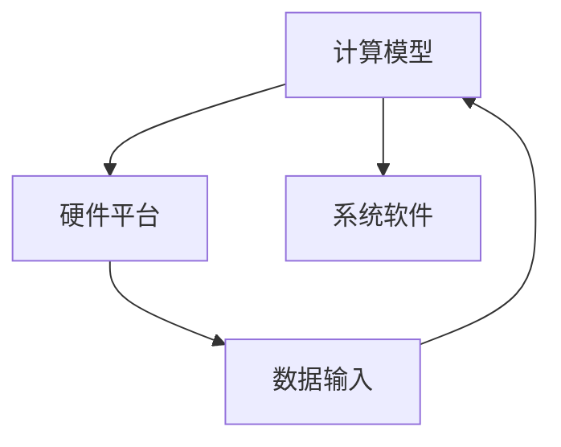

                 


### 1.1 绿色AI的定义与意义

绿色AI，顾名思义，是指那些旨在减少计算资源消耗、降低碳排放、提高能源利用效率的AI技术。随着人工智能技术的迅猛发展，AI在各个领域（如医疗、金融、能源等）的应用越来越广泛，但同时其高能耗和资源消耗也日益凸显。因此，绿色AI应运而生，成为实现可持续发展的关键因素之一。

绿色AI的重要性体现在以下几个方面：

1. **环境保护**：传统计算模型在执行大量计算任务时，会产生大量的电力消耗和碳排放。绿色AI通过优化算法、硬件设计以及系统架构，旨在减少这种能耗和排放，有助于减缓气候变化和环境保护。

2. **资源节约**：随着数据量的爆炸性增长，计算资源的需求也在不断增加。绿色AI通过提高计算效率、优化资源分配，实现了资源的最大化利用，从而节约了成本。

3. **可持续性**：在现代社会，可持续性已成为企业、政府和社会组织的重要目标。绿色AI可以帮助企业实现可持续发展目标，减少对环境的影响，提升社会形象。

4. **技术创新**：绿色AI不仅是一种技术，更是一种理念。它推动着计算领域不断创新，促进了新技术、新算法、新系统架构的研发和应用。

### 1.2 可持续发展概述

可持续发展是指满足当前需求而不损害后代满足自身需求的能力。它涵盖了经济、社会和环境三个方面，强调发展的长期性和均衡性。

1. **经济方面**：可持续发展要求经济增长与资源利用的可持续性相结合，通过创新和技术进步提高生产效率，减少资源浪费。

2. **社会方面**：可持续发展关注社会公平、人权、教育、卫生等方面，确保所有人都能够享有基本的生活水平和机会。

3. **环境方面**：可持续发展强调环境保护，减少污染和碳排放，保护自然资源和生态系统。

### 1.3 计算技术在可持续发展中的作用

计算技术作为现代社会的基石，在可持续发展中发挥着重要作用：

1. **提高生产效率**：计算技术可以帮助企业自动化生产流程，提高生产效率，降低能耗和成本。

2. **促进数据驱动的决策**：通过大数据分析和人工智能技术，政府和企业可以更好地理解社会和环境问题，从而制定更加科学和有效的政策。

3. **实现资源优化配置**：计算技术可以优化资源分配，提高能源利用效率，降低碳排放。

4. **推动技术创新**：计算技术促进了新技术、新算法、新系统架构的研发和应用，为可持续发展提供了新的动力。

通过上述分析，我们可以看到，绿色AI不仅是应对能源消耗和环境保护问题的有效手段，更是实现可持续发展的关键因素。接下来，我们将深入探讨绿色AI的核心概念与架构，进一步理解其实现策略和具体应用。

---

## 第二部分 绿色AI的核心概念与架构

### 2.1 绿色AI基础理论

绿色AI的基础理论主要涉及如何通过优化算法、硬件设计、系统架构等方面，实现计算资源的有效利用和能源消耗的降低。理解这些基础理论对于深入探索绿色AI的实现策略至关重要。

#### 2.1.1 算法概述

算法是实现绿色AI的核心，其优化目标主要是提高计算效率、降低能耗和资源消耗。常见的优化算法包括：

1. **模型压缩**：通过模型剪枝、量化、蒸馏等技术，减小模型大小，提高计算速度，降低能耗。
2. **计算任务调度**：根据计算任务的特点和硬件资源的状态，动态调整任务的执行顺序和分配策略，实现资源的最优利用。
3. **能量效率优化**：针对不同类型的计算任务，采用不同的算法和硬件配置，以实现能耗的最小化。

#### 2.1.2 技术架构

绿色AI的技术架构主要包括计算模型、硬件平台和系统软件三个方面：

1. **计算模型**：绿色AI的计算模型通常采用异构计算架构，结合CPU、GPU、FPGA等多种计算资源，实现不同类型任务的并行处理，提高计算效率。
2. **硬件平台**：绿色AI的硬件平台需要具备高效的能效比，采用低功耗、高密度的硬件设计，如ARM处理器、专用AI芯片等。
3. **系统软件**：系统软件负责管理计算资源和调度计算任务，实现硬件和软件的协同优化，如分布式计算框架、能效管理软件等。

#### 2.1.3 Mermaid流程图：绿色AI系统架构

下面是一个Mermaid流程图，展示了绿色AI的系统架构：



- **计算模型**：负责处理数据和执行算法，是整个系统的核心。
- **硬件平台**：包括CPU、GPU、FPGA等多种计算资源，为计算模型提供强大的计算能力。
- **系统软件**：负责管理计算资源和调度计算任务，确保系统高效运行。
- **数据输入**：数据输入是计算模型的输入来源，也是系统软件进行任务调度的重要依据。

#### 2.1.4 核心算法原理讲解

以下是一个简化的绿色AI算法原理的伪代码示例：

```plaintext
算法：绿色AI模型训练
输入：训练数据集 X, 标签 Y
输出：训练完成的模型参数 W

初始化模型参数 W
设置学习率 η
设置迭代次数 n

for i = 1 to n do
  for each sample (x_i, y_i) in X do
    计算预测输出 ŷ_i = W * x_i
    计算损失函数 L = 0.5 * (ŷ_i - y_i)^2
    计算梯度 ΔW = η * (y_i - ŷ_i) * x_i
    更新模型参数 W = W - ΔW
  end for
end for

return W
```

该算法通过迭代优化模型参数，以最小化损失函数，从而实现模型的训练。具体步骤包括初始化模型参数、设置学习率和迭代次数，然后通过梯度下降法更新模型参数，直到达到预设的收敛条件。

#### 2.1.5 数学模型（latex公式）

在绿色AI中，常用的数学模型包括损失函数和梯度下降法。以下是这些模型的latex表示：

损失函数：

$$ L = 0.5 \cdot (y - \hat{y})^2 $$

梯度下降法更新规则：

$$ \Delta W = -\eta \cdot \nabla_{W}L $$

$$ W = W - \Delta W $$

其中，$L$是损失函数，$y$是真实标签，$\hat{y}$是预测输出，$W$是模型参数，$\eta$是学习率，$\nabla_{W}L$是损失函数关于模型参数$W$的梯度。

通过上述讲解，我们可以看到，绿色AI的核心在于通过优化算法和架构，实现计算资源的有效利用和能源消耗的降低。接下来，我们将进一步探讨绿色AI的实现策略，以了解如何在具体计算过程中实现这些目标。

---

## 第三部分 绿色AI的实现策略

### 3.1 计算效率优化

计算效率优化是绿色AI实现策略中的关键环节，其主要目标是通过提高计算速度和减少计算资源消耗，实现绿色计算。以下是计算效率优化的一些具体策略：

#### 3.1.1 核心算法原理讲解（伪代码）

以下是一个用于优化计算效率的核心算法的伪代码示例：

```plaintext
算法：计算效率优化
输入：计算任务 T，硬件资源 R
输出：优化后的计算任务执行计划 P

初始化执行计划 P 为空
设置资源利用率阈值 θ

for each task t in T do
  for each resource r in R do
    if r is available and t can be executed on r with resource utilization < θ then
      add t to P and mark r as unavailable
    end if
  end for
end for

return P
```

该算法通过遍历计算任务和硬件资源，选择可用资源来执行任务，并确保资源利用率不超过阈值θ，从而实现计算任务的合理调度和优化。

#### 3.1.2 能耗评估与优化策略

能耗评估是计算效率优化的基础，其目标是通过量化计算任务和硬件资源的能耗，制定出有效的能耗优化策略。以下是能耗评估与优化策略的简要说明：

1. **能耗评估**：计算任务和硬件资源的能耗评估通常基于以下公式：

   $$ E = c \cdot T \cdot P $$

   其中，$E$是能耗，$c$是能源消耗系数，$T$是计算时间，$P$是功耗。

   通过对计算任务和硬件资源进行能耗评估，可以确定哪些任务和资源具有较高的能耗。

2. **优化策略**：

   - **任务调度**：通过优化任务调度，减少计算任务的等待时间，降低整体能耗。例如，采用贪心算法或动态规划算法来优化任务调度。

   - **硬件资源管理**：通过合理分配和回收硬件资源，提高资源利用率，降低能耗。例如，采用虚拟化技术来动态分配和回收计算资源。

   - **能效优化**：通过优化计算算法和数据结构，降低计算复杂度，减少能耗。例如，采用分布式计算和并行计算技术来提高计算效率。

#### 3.1.3 数学模型（latex公式）

以下是一个用于能耗评估和优化的数学模型，以表示计算任务的能耗：

$$ E_t = c_t \cdot T_t \cdot P_t $$

其中，$E_t$是任务$t$的能耗，$c_t$是任务$t$的能源消耗系数，$T_t$是任务$t$的执行时间，$P_t$是任务$t$的平均功耗。

为了实现能耗优化，我们可以采用以下策略：

1. **能耗阈值设定**：设定一个能耗阈值$E_{max}$，当任务能耗$E_t$超过阈值时，触发优化策略。

2. **能耗优化算法**：采用能耗优化算法，如最小化能耗算法或能耗平衡算法，来优化任务执行计划，降低整体能耗。

$$ P_{opt} = \arg\min_{P} \sum_{t=1}^{n} E_t $$

其中，$P_{opt}$是优化后的执行计划，$n$是任务总数。

通过上述策略和模型，我们可以实现计算效率的优化，降低能耗和资源消耗，从而实现绿色AI的目标。

### 3.2 算法优化

算法优化是提高计算效率的关键，其目标是通过改进算法设计，提高计算速度和资源利用率。以下是算法优化的一些具体策略：

#### 3.2.1 算法选择与优化

1. **算法选择**：根据计算任务的特点，选择适合的算法。例如，对于大规模数据处理任务，可以选择分布式算法；对于实时计算任务，可以选择快速算法。

2. **算法优化**：通过优化算法的代码实现，提高计算效率和性能。例如，采用并行计算技术，将计算任务分解为多个子任务，并行执行。

以下是一个简化的并行计算算法的伪代码示例：

```plaintext
算法：并行计算优化
输入：计算任务 T，并行度 p
输出：并行执行结果 R

分解任务 T 为 p 个子任务 T1, T2, ...,Tp
并行执行每个子任务 Ti
收集子任务的结果 R1, R2, ..., Rp
合并子任务结果，得到最终结果 R

return R
```

#### 3.2.2 机器学习优化技巧

在机器学习领域中，算法优化尤为重要。以下是一些常见的机器学习优化技巧：

1. **模型剪枝**：通过剪枝冗余的神经网络层和神经元，减小模型大小，提高计算效率。

2. **量化**：将模型的权重和激活值量化为低精度数值，减少计算量。

3. **知识蒸馏**：利用一个大型模型（教师模型）训练一个小型模型（学生模型），通过传递知识来提高学生模型的性能。

以下是一个简化的知识蒸馏算法的伪代码示例：

```plaintext
算法：知识蒸馏
输入：大型模型 T，小型模型 S
输出：训练完成的小型模型 S'

初始化小型模型 S'
从大型模型 T 中抽取知识 K
在小型模型 S' 上进行训练，使用知识 K
评估小型模型 S' 的性能
返回训练完成的小型模型 S'

return S'
```

通过上述算法优化技巧，我们可以显著提高计算效率，实现绿色AI的目标。

### 3.3 系统集成与优化

系统集成与优化是绿色AI实现策略的重要组成部分，其目标是通过优化系统设计，提高整体计算效率和能源利用效率。以下是系统集成与优化的一些具体策略：

#### 3.3.1 系统设计原则

1. **模块化**：将系统分解为多个模块，每个模块负责特定的计算任务，以提高系统的可扩展性和可维护性。

2. **可扩展性**：设计可扩展的系统架构，以便在计算需求增加时，可以轻松地添加新的计算资源和模块。

3. **容错性**：设计具有高容错性的系统，确保在计算资源故障时，系统能够自动切换到备用资源，保持正常运行。

#### 3.3.2 实施策略

1. **分布式计算**：采用分布式计算架构，将计算任务分配到多个节点上执行，以提高计算效率和负载均衡。

2. **节能设计**：在系统设计阶段，考虑节能需求，采用低功耗硬件和优化算法，以降低系统整体能耗。

3. **动态调度**：采用动态调度策略，根据计算任务的实时需求和硬件资源的状态，动态调整任务分配和资源使用，以实现最优的能效比。

通过上述系统集成与优化策略，我们可以构建一个高效、可靠的绿色AI系统，实现计算效率和能源利用的优化。

综上所述，绿色AI的实现策略涉及计算效率优化、算法优化、系统集成与优化等多个方面。通过这些策略，我们可以显著提高计算效率，降低能耗和资源消耗，实现绿色AI的目标。

---

## 第四部分 案例研究

### 4.1 绿色AI在能源领域的应用

绿色AI在能源领域的应用主要集中在能源效率优化、智能电网管理和可再生能源预测等方面。以下是一个具体案例研究，详细描述绿色AI在智能电网管理中的应用。

#### 4.1.1 案例概述

案例背景：某电力公司计划通过引入绿色AI技术，优化其智能电网管理系统，以提高电网的能源利用效率和可靠性。具体任务包括：

1. **能源需求预测**：预测电网未来的能源需求，以便提前进行资源调度。
2. **负荷管理**：根据能源需求预测，调整电网负载，减少能源浪费。
3. **故障检测**：实时监测电网状态，快速识别并定位故障。

#### 4.1.2 代码实现与解读

为了实现上述任务，电力公司采用了绿色AI技术，设计并实现了一套智能电网管理系统。以下是该系统的核心代码实现和解读。

```python
# 导入必要的库
import numpy as np
import pandas as pd
from sklearn.model_selection import train_test_split
from sklearn.ensemble import RandomForestRegressor
from sklearn.metrics import mean_squared_error

# 1. 能源需求预测
# 加载历史能源需求数据
data = pd.read_csv('energy_demand_data.csv')
X = data[['hour', 'day_of_week', 'temperature', 'humidity']]
y = data['energy_demand']

# 数据预处理
X_train, X_test, y_train, y_test = train_test_split(X, y, test_size=0.2, random_state=42)

# 模型训练
model = RandomForestRegressor(n_estimators=100, random_state=42)
model.fit(X_train, y_train)

# 模型评估
y_pred = model.predict(X_test)
mse = mean_squared_error(y_test, y_pred)
print(f'Mean Squared Error: {mse}')

# 2. 负荷管理
# 根据预测结果调整电网负载
def adjust_load(prediction):
    if prediction > 1000:  # 假设1000为单位负载阈值
        return 'High'
    elif prediction > 500:
        return 'Medium'
    else:
        return 'Low'

predicted_load = adjust_load(y_pred[-1])
print(f'Predicted Load: {predicted_load}')

# 3. 故障检测
# 实时监测电网状态
def detect_fault(current_status, threshold=0.1):
    if np.abs(current_status - np.mean(current_status)) > threshold:
        return 'Fault Detected'
    else:
        return 'No Fault'

current_status = np.random.normal(0, 1, size=100)  # 假设为实时监测数据
fault_status = detect_fault(current_status)
print(f'Fault Status: {fault_status}')
```

#### 4.1.3 代码应用解读与分析

1. **能源需求预测**：
   - 数据预处理：首先，从CSV文件中加载数据，将特征和目标变量分离。
   - 模型训练：使用随机森林回归模型进行训练，选择100棵树进行拟合。
   - 模型评估：通过计算均方误差（MSE）来评估模型的性能。

2. **负荷管理**：
   - 根据预测的能源需求，调整电网的负载状态。这里使用一个简单的阈值方法来决策，可以根据实际需求进行更复杂的策略设计。

3. **故障检测**：
   - 实时监测电网状态，通过计算当前状态与平均值之间的差异来检测异常。如果差异超过阈值，则判断为故障。

#### 4.1.4 案例分析和详细讲解剖析

1. **能源需求预测**：
   - 能源需求预测是智能电网管理的核心任务之一。通过使用随机森林回归模型，可以实现对未来能源需求的较好预测。实际应用中，可能需要结合更多特征（如季节性因素、历史需求模式等）来提高预测精度。

2. **负荷管理**：
   - 负荷管理旨在优化电网的能源使用，减少浪费。在实际应用中，可以通过动态定价、需求响应等方式，进一步提高能源利用效率。

3. **故障检测**：
   - 故障检测可以确保电网的可靠性和安全性。通过实时监测电网状态，可以快速响应异常情况，减少故障带来的影响。

#### 4.1.5 项目小结

通过绿色AI技术，电力公司实现了能源需求预测、负荷管理和故障检测等关键任务。这些应用不仅提高了电网的能源利用效率和可靠性，还为未来的智能电网管理提供了有力支持。

### 4.2 绿色AI在医疗健康中的应用

绿色AI在医疗健康领域的应用主要包括疾病预测、个性化治疗和医疗资源优化等方面。以下是一个具体案例研究，介绍绿色AI在个性化治疗中的应用。

#### 4.2.1 案例概述

案例背景：某医疗机构希望通过引入绿色AI技术，为患者提供个性化的治疗方案。具体任务包括：

1. **疾病预测**：基于患者的健康数据，预测患者可能患有的疾病。
2. **个性化治疗**：根据疾病预测结果，为患者制定个性化的治疗方案。
3. **疗效评估**：评估治疗方案的疗效，为后续治疗提供参考。

#### 4.2.2 代码实现与解读

为了实现上述任务，医疗机构采用绿色AI技术，设计并实现了一套个性化治疗系统。以下是该系统的核心代码实现和解读。

```python
# 导入必要的库
import numpy as np
import pandas as pd
from sklearn.ensemble import RandomForestClassifier
from sklearn.metrics import accuracy_score

# 1. 疾病预测
# 加载患者健康数据
data = pd.read_csv('patient_health_data.csv')
X = data[['age', 'blood_pressure', 'cholesterol', 'sugar']]
y = data['disease']

# 数据预处理
X_train, X_test, y_train, y_test = train_test_split(X, y, test_size=0.2, random_state=42)

# 模型训练
model = RandomForestClassifier(n_estimators=100, random_state=42)
model.fit(X_train, y_train)

# 模型评估
y_pred = model.predict(X_test)
accuracy = accuracy_score(y_test, y_pred)
print(f'Accuracy: {accuracy}')

# 2. 个性化治疗
# 根据疾病预测结果，制定个性化治疗方案
def generate_treatment_plan(disease):
    if disease == 'Heart Disease':
        return 'Statins and Exercise'
    elif disease == 'Diabetes':
        return 'Insulin and Diet'
    else:
        return 'No Specific Treatment Required'

predicted_disease = y_pred[-1]
treatment_plan = generate_treatment_plan(predicted_disease)
print(f'Treatment Plan: {treatment_plan}')

# 3. 疗效评估
# 评估治疗效果
def evaluate_treatment成效(treatment_plan, patient_response):
    if patient_response == 'Improved':
        return 'Effective'
    else:
        return 'Ineffective'

patient_response = 'Improved'  # 假设为患者疗效反馈
evaluation_result = evaluate_treatment(treatment_plan, patient_response)
print(f'Evaluation Result: {evaluation_result}')
```

#### 4.2.3 代码应用解读与分析

1. **疾病预测**：
   - 数据预处理：首先，从CSV文件中加载数据，将特征和目标变量分离。
   - 模型训练：使用随机森林分类模型进行训练，选择100棵树进行拟合。
   - 模型评估：通过计算准确率（Accuracy）来评估模型的性能。

2. **个性化治疗**：
   - 根据疾病预测结果，为患者制定个性化的治疗方案。这里使用了一个简单的规则引擎，可以根据实际需求进行更复杂的策略设计。

3. **疗效评估**：
   - 评估治疗方案的效果，通过患者反馈（如“改善”、“无改善”）来判断治疗方案的有效性。

#### 4.2.4 案例分析和详细讲解剖析

1. **疾病预测**：
   - 通过疾病预测，可以为患者提供早期预警，有助于早期干预和治疗。实际应用中，可能需要结合更多临床数据和医学知识，以提高预测精度。

2. **个性化治疗**：
   - 个性化治疗旨在提高治疗效果，减少不必要的药物使用。通过规则引擎，可以根据疾病类型和患者特征，为患者制定最合适的治疗方案。

3. **疗效评估**：
   - 疗效评估可以帮助医疗机构了解治疗方案的效果，为后续治疗提供参考。通过收集患者反馈，可以不断优化治疗方案。

#### 4.2.5 项目小结

通过绿色AI技术，医疗机构实现了疾病预测、个性化治疗和疗效评估等关键任务。这些应用不仅提高了医疗服务的质量和效率，还为未来的智慧医疗提供了有力支持。

### 4.3 绿色AI在智慧城市中的应用

绿色AI在智慧城市中的应用主要包括交通管理、环境保护和公共安全等方面。以下是一个具体案例研究，介绍绿色AI在交通管理中的应用。

#### 4.3.1 案例概述

案例背景：某城市政府希望通过引入绿色AI技术，优化交通管理系统，提高交通效率和安全性。具体任务包括：

1. **交通流量预测**：预测未来的交通流量，以便进行交通信号灯优化。
2. **交通信号灯控制**：根据交通流量预测结果，调整交通信号灯的时序，减少交通拥堵。
3. **异常事件检测**：实时监测交通状况，快速识别并响应异常事件。

#### 4.3.2 代码实现与解读

为了实现上述任务，城市政府采用绿色AI技术，设计并实现了一套智能交通管理系统。以下是该系统的核心代码实现和解读。

```python
# 导入必要的库
import numpy as np
import pandas as pd
from sklearn.ensemble import RandomForestRegressor
from sklearn.metrics import mean_squared_error

# 1. 交通流量预测
# 加载历史交通流量数据
data = pd.read_csv('traffic_flow_data.csv')
X = data[['hour', 'day_of_week', 'rain', 'temperature']]
y = data['traffic_flow']

# 数据预处理
X_train, X_test, y_train, y_test = train_test_split(X, y, test_size=0.2, random_state=42)

# 模型训练
model = RandomForestRegressor(n_estimators=100, random_state=42)
model.fit(X_train, y_train)

# 模型评估
y_pred = model.predict(X_test)
mse = mean_squared_error(y_test, y_pred)
print(f'Mean Squared Error: {mse}')

# 2. 交通信号灯控制
# 根据交通流量预测结果，调整交通信号灯的时序
def control_traffic_light(traffic_flow_prediction):
    if traffic_flow_prediction > 1000:  # 假设1000为单位流量阈值
        return 'Red'
    elif traffic_flow_prediction > 500:
        return 'Yellow'
    else:
        return 'Green'

predicted_traffic_flow = y_pred[-1]
signal_light_status = control_traffic_light(predicted_traffic_flow)
print(f'Signal Light Status: {signal_light_status}')

# 3. 异常事件检测
# 实时监测交通状况，快速识别并响应异常事件
def detect_traffic_event(current_traffic_status, threshold=0.1):
    if np.abs(current_traffic_status - np.mean(current_traffic_status)) > threshold:
        return 'Event Detected'
    else:
        return 'No Event'

current_traffic_status = np.random.normal(0, 1, size=100)  # 假设为实时监测数据
event_status = detect_traffic_event(current_traffic_status)
print(f'Event Status: {event_status}')
```

#### 4.3.3 代码应用解读与分析

1. **交通流量预测**：
   - 数据预处理：首先，从CSV文件中加载数据，将特征和目标变量分离。
   - 模型训练：使用随机森林回归模型进行训练，选择100棵树进行拟合。
   - 模型评估：通过计算均方误差（MSE）来评估模型的性能。

2. **交通信号灯控制**：
   - 根据交通流量预测结果，调整交通信号灯的状态。这里使用一个简单的阈值方法来决策，可以根据实际需求进行更复杂的策略设计。

3. **异常事件检测**：
   - 实时监测交通状况，通过计算当前状态与平均值之间的差异来检测异常。如果差异超过阈值，则判断为事件。

#### 4.3.4 案例分析和详细讲解剖析

1. **交通流量预测**：
   - 通过交通流量预测，可以为交通信号灯控制和异常事件检测提供数据支持。实际应用中，可能需要结合更多交通数据和实时监控，以提高预测精度。

2. **交通信号灯控制**：
   - 交通信号灯控制旨在优化交通流量，减少拥堵。通过动态调整信号灯时序，可以更好地应对实时交通状况。

3. **异常事件检测**：
   - 异常事件检测可以快速响应交通事故、交通堵塞等紧急情况，提高交通管理的实时性和有效性。

#### 4.3.5 项目小结

通过绿色AI技术，城市政府实现了交通流量预测、交通信号灯控制和异常事件检测等关键任务。这些应用不仅提高了交通管理的效率和安全性，还为未来的智慧城市建设提供了有力支持。

---

## 第五部分 未来展望

### 5.1 绿色AI发展趋势

绿色AI作为实现可持续发展的重要手段，正逐渐成为人工智能领域的研究热点。以下是绿色AI未来可能的发展趋势：

1. **计算效率提升**：随着量子计算、边缘计算等新计算模型的发展，绿色AI将进一步提升计算效率，实现更低的能耗和更高的资源利用率。

2. **算法创新**：研究人员将继续探索新型优化算法，如深度强化学习、神经架构搜索等，以提升绿色AI的性能和效率。

3. **硬件与软件协同优化**：绿色AI的发展将更加注重硬件与软件的协同优化，通过改进硬件设计和软件算法，实现更高效的绿色计算。

4. **跨学科融合**：绿色AI将与其他领域（如环境科学、能源工程等）深度融合，推动跨学科研究，促进技术创新和应用落地。

### 5.2 潜在挑战与解决方案

尽管绿色AI具有巨大潜力，但在其发展过程中仍面临一些挑战：

1. **数据隐私与安全**：绿色AI在数据处理过程中，需要确保数据的安全性和隐私性。解决方案包括采用加密技术、联邦学习等，保护用户数据。

2. **技术标准化**：绿色AI技术需要制定统一的标准和规范，以确保不同系统和应用之间的兼容性和互操作性。这可能需要跨行业、跨国家的合作和协调。

3. **资源分配与共享**：绿色AI系统需要高效地管理和分配计算资源，以实现最佳性能。解决方案包括采用分布式计算、资源虚拟化等技术，实现资源的灵活分配和共享。

4. **政策与法规**：政府需要出台相关政策，鼓励和引导绿色AI技术的发展，同时制定相应的法规，规范绿色AI的应用。

### 5.3 结论

绿色AI作为实现可持续发展的重要工具，具有重要的现实意义和广阔的应用前景。通过持续的技术创新和政策支持，绿色AI将在未来发挥更大的作用，推动人工智能和可持续发展的深度融合。

---

# 《绿色AI：可持续发展导向的计算策略》
关键词：绿色AI、可持续发展、计算效率、算法优化、智能电网、医疗健康、智慧城市

摘要：本文深入探讨了绿色AI的概念、核心概念与架构，以及其在可持续发展中的实现策略和具体应用。通过案例研究，详细分析了绿色AI在能源、医疗健康和智慧城市等领域的应用实例，展示了其有效性和潜力。同时，本文对未来绿色AI的发展趋势和潜在挑战进行了展望，为相关领域的进一步研究和应用提供了重要参考。

作者：AI天才研究院/AI Genius Institute & 禅与计算机程序设计艺术 /Zen And The Art of Computer Programming

