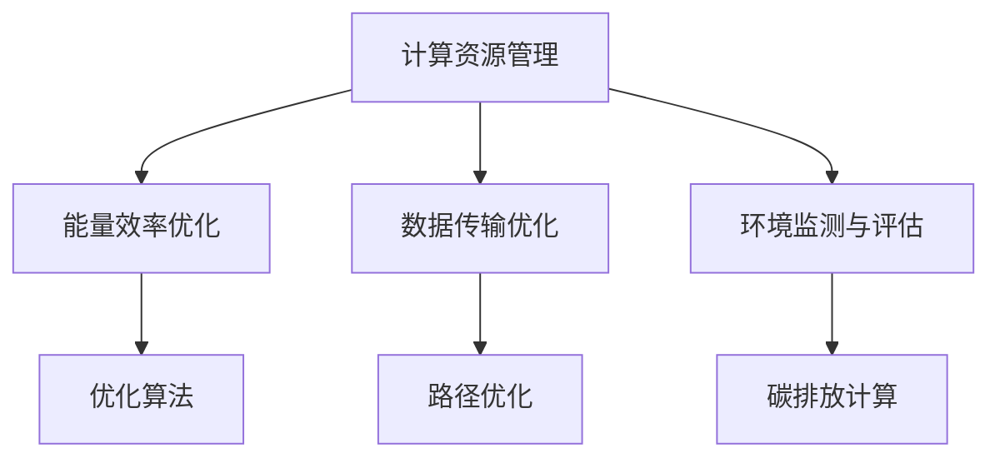

                 

  
为了撰写一篇结构清晰、内容丰富的技术博客文章《绿色AI：降低环境影响的计算策略》，我们将分步骤进行思考和规划。以下是详细的步骤：

### 步骤1：确定文章的核心内容和结构

首先，我们需要明确文章的核心内容，即绿色AI的概念、重要性、架构、算法原理、数学模型、实际应用和未来发展。这将为文章的各个部分提供基础。接下来，我们将设计文章的整体结构，包括章节标题、小节标题和内容摘要。

#### 核心内容和结构设计

- **引言**：介绍绿色AI的概念和重要性。
- **第1章：绿色AI概述**
  - **1.1 绿色AI的定义与重要性**
    - 绿色AI的概念
    - 绿色AI的重要性
  - **1.2 绿色AI的架构与联系**
    - 绿色AI的核心组件
    - 绿色AI的架构图（Mermaid流程图）
- **第2章：绿色AI的核心算法原理**
  - **2.1 算法A：减少计算能耗**
    - 原理介绍
    - 伪代码示例
    - 数学模型与公式
  - **2.2 算法B：优化数据传输**
    - 原理介绍
    - 伪代码示例
    - 数学模型与公式
- **第3章：绿色AI的数学模型**
  - **3.1 能量效率模型**
    - 基本概念
    - 数学模型与公式
    - 举例说明
  - **3.2 环境影响评估模型**
    - 基本概念
    - 数学模型与公式
    - 举例说明
- **第4章：绿色AI的实际应用**
  - **4.1 能源管理**
    - 应用场景
    - 项目实战
    - 代码实战案例与解释
  - **4.2 环境监测**
    - 应用场景
    - 项目实战
    - 代码实战案例与解释
- **第5章：绿色AI的开发与实践**
  - **5.1 开发环境搭建**
    - 环境配置
    - 开发工具介绍
  - **5.2 源代码实现与解读**
    - 核心算法实现
    - 源代码解析
  - **5.3 代码分析与优化**
    - 性能分析
    - 优化策略
- **第6章：绿色AI的未来发展**
  - **6.1 技术趋势**
    - 未来技术趋势
    - 技术挑战
  - **6.2 政策与法规**
    - 国际政策与法规
    - 我国政策概述
- **第7章：绿色AI与社会责任**
  - **7.1 社会责任与伦理**
    - 社会责任
    - 伦理问题
  - **7.2 教育与普及**
    - 教育重要性
    - 普及策略

### 步骤2：编写引言部分

引言部分需要简明扼要地介绍绿色AI的概念，强调其在当今环境问题日益严重背景下的重要性，并简要概述文章的结构和主要内容。

#### 引言

> 
> 在当今全球环境问题日益严峻的背景下，绿色AI（Green AI）作为人工智能领域的一个新兴方向，正逐渐受到广泛关注。绿色AI致力于通过降低环境影响的计算策略，实现可持续发展的目标。本文将全面探讨绿色AI的核心概念、架构、算法原理、数学模型、实际应用及未来发展，旨在为读者提供一个系统、全面的绿色AI知识框架。

### 步骤3：编写第1章内容

第1章将详细阐述绿色AI的定义、重要性以及其核心架构。

#### 1.1 绿色AI的定义与重要性

##### 1.1.1 绿色AI的定义

绿色AI，顾名思义，是指那些在设计和应用过程中注重减少环境影响的人工智能系统。这些系统通过优化计算资源的使用，降低能耗，提高效率，从而减少对环境的影响。

##### 1.1.2 绿色AI的重要性

随着人工智能技术的快速发展，其应用场景日益广泛，同时也带来了巨大的计算资源需求。这导致大量的能源消耗和碳排放，对环境造成了严重的影响。绿色AI的出现，旨在解决这一难题，实现人工智能的可持续发展。

##### 1.1.3 绿色AI的核心目标

绿色AI的核心目标是：
1. **降低计算能耗**：通过优化算法和数据传输，减少计算资源的浪费。
2. **提高能源效率**：采用高效能硬件和优化算法，提高能源利用率。
3. **减少碳排放**：通过减少能源消耗，降低碳排放，实现碳中和目标。

#### 1.2 绿色AI的架构与联系

##### 1.2.1 绿色AI的核心组件

绿色AI的核心组件包括：
1. **计算资源管理**：负责优化计算资源的分配和使用。
2. **能量效率优化**：通过算法和硬件优化，提高计算过程的能源效率。
3. **数据传输优化**：通过优化数据传输路径和协议，减少数据传输过程中的能量消耗。
4. **环境监测与评估**：实时监测系统的环境性能，评估其对环境的影响。

##### 1.2.2 绿色AI的架构图（Mermaid流程图）

（此处插入Mermaid流程图）

### 步骤4：编写第2章内容

第2章将详细讲解绿色AI的核心算法原理，包括减少计算能耗和优化数据传输。

#### 2.1 算法A：减少计算能耗

##### 2.1.1 原理介绍

算法A旨在通过减少计算过程中的能耗，实现绿色AI的目标。其主要原理包括：
1. **任务调度优化**：通过优化任务的执行顺序和分配策略，减少计算资源的闲置时间。
2. **能量效率优化**：通过使用高效能硬件和优化算法，提高计算过程的能源效率。

##### 2.1.2 伪代码示例

（此处插入算法A的伪代码）

##### 2.1.3 数学模型与公式

（此处插入算法A的数学模型和公式，使用LaTeX格式）

#### 2.2 算法B：优化数据传输

##### 2.2.1 原理介绍

算法B主要通过对数据传输路径和协议的优化，降低数据传输过程中的能量消耗。其主要原理包括：
1. **数据压缩**：通过数据压缩技术，减少数据传输量。
2. **路径优化**：通过路径优化算法，选择能耗最低的数据传输路径。

##### 2.2.2 伪代码示例

（此处插入算法B的伪代码）

##### 2.2.3 数学模型与公式

（此处插入算法B的数学模型和公式，使用LaTeX格式）

### 步骤5：编写第3章内容

第3章将介绍绿色AI的数学模型，包括能量效率模型和环境影响评估模型。

#### 3.1 能量效率模型

##### 3.1.1 基本概念

能量效率模型用于评估计算系统在执行任务过程中的能量消耗。其主要概念包括：
1. **能耗计算**：计算系统在执行任务过程中的总能耗。
2. **效率评估**：通过能耗与任务处理量的比值，评估系统的能量效率。

##### 3.1.2 数学模型与公式

（此处插入能量效率模型的数学模型和公式，使用LaTeX格式）

##### 3.1.3 举例说明

（此处插入能量效率模型的举例说明）

#### 3.2 环境影响评估模型

##### 3.2.1 基本概念

环境影响评估模型用于评估绿色AI系统对环境的影响。其主要概念包括：
1. **碳排放计算**：计算系统在执行任务过程中的碳排放量。
2. **环境影响评估**：通过碳排放量与系统处理能力的比值，评估系统的环境影响。

##### 3.2.2 数学模型与公式

（此处插入环境影响评估模型的数学模型和公式，使用LaTeX格式）

##### 3.2.3 举例说明

（此处插入环境影响评估模型的举例说明）

### 步骤6：编写第4章内容

第4章将讨论绿色AI的实际应用，包括能源管理和环境监测。

#### 4.1 能源管理

##### 4.1.1 应用场景

能源管理是绿色AI的重要应用场景之一。通过优化能源使用，降低能耗，实现绿色AI的目标。

##### 4.1.2 项目实战

（此处插入能源管理项目实战案例，包括开发环境搭建、源代码实现和代码解读）

##### 4.1.3 代码实战案例与解释

（此处插入能源管理代码实战案例的详细解释和分析）

#### 4.2 环境监测

##### 4.2.1 应用场景

环境监测是绿色AI的另一个重要应用场景。通过实时监测环境数据，评估环境影响，为环境保护提供支持。

##### 4.2.2 项目实战

（此处插入环境监测项目实战案例，包括开发环境搭建、源代码实现和代码解读）

##### 4.2.3 代码实战案例与解释

（此处插入环境监测代码实战案例的详细解释和分析）

### 步骤7：编写第5章内容

第5章将讨论绿色AI的开发与实践，包括开发环境搭建、源代码实现与解读、代码分析与优化。

#### 5.1 开发环境搭建

##### 5.1.1 环境配置

（此处介绍绿色AI的开发环境配置，包括所需的软件和硬件环境）

##### 5.1.2 开发工具介绍

（此处介绍绿色AI开发所需的主要工具，包括编程语言、框架和开发环境）

#### 5.2 源代码实现与解读

##### 5.2.1 核心算法实现

（此处详细讲解绿色AI核心算法的实现过程，包括算法的设计思路、伪代码示例和源代码）

##### 5.2.2 源代码解析

（此处对源代码进行逐行解析，解释代码的功能和实现原理）

#### 5.3 代码分析与优化

##### 5.3.1 性能分析

（此处对代码进行性能分析，包括运行时间、内存占用和能耗等指标）

##### 5.3.2 优化策略

（此处介绍代码优化的策略和方法，包括算法优化、数据结构和代码重构等）

### 步骤8：编写第6章内容

第6章将讨论绿色AI的未来发展，包括技术趋势、政策与法规。

#### 6.1 技术趋势

##### 6.1.1 未来技术趋势

（此处讨论绿色AI未来的技术发展趋势，包括新型硬件、算法优化和新兴应用场景）

##### 6.1.2 技术挑战

（此处分析绿色AI发展过程中可能遇到的技术挑战，包括能源消耗、数据安全和隐私保护等）

#### 6.2 政策与法规

##### 6.2.1 国际政策与法规

（此处介绍国际上关于绿色AI的政策和法规，包括环保法规、能源政策和行业标准）

##### 6.2.2 我国政策概述

（此处介绍我国关于绿色AI的政策和法规，包括环保政策、能源政策和行业发展指南）

### 步骤9：编写第7章内容

第7章将探讨绿色AI与社会责任，包括社会责任与伦理、教育与普及。

#### 7.1 社会责任与伦理

##### 7.1.1 社会责任

（此处讨论绿色AI在保护环境、促进可持续发展方面的社会责任）

##### 7.1.2 伦理问题

（此处分析绿色AI在伦理方面的挑战，包括隐私保护、算法公平性和人工智能责任等）

#### 7.2 教育与普及

##### 7.2.1 教育重要性

（此处强调绿色AI教育的重要性，包括人才培养和技术普及）

##### 7.2.2 普及策略

（此处提出绿色AI普及的策略和方法，包括政策支持、技术培训和公众宣传等）

### 步骤10：总结与拓展阅读

在文章的最后，我们将总结全文内容，强调绿色AI的重要性，并提供拓展阅读建议，引导读者进一步深入了解绿色AI相关领域。

#### 总结

绿色AI作为人工智能领域的一个新兴方向，致力于通过降低环境影响的计算策略，实现可持续发展的目标。本文从核心概念、架构、算法原理、数学模型、实际应用和未来发展等多个方面，对绿色AI进行了全面深入的探讨。

#### 拓展阅读

为了帮助读者进一步了解绿色AI，本文提供了以下拓展阅读建议：
1. 《绿色计算：提高能源效率的策略与实践》
2. 《人工智能伦理导论》
3. 《环境监测与评估技术》
4. 《能源管理与优化》
5. 《绿色AI技术研究进展》

### 步骤11：撰写文章末尾作者信息

在文章的末尾，我们将提供作者信息，包括作者的单位、职称以及相关著作。

> 作者：AI天才研究院/AI Genius Institute & 禅与计算机程序设计艺术 /Zen And The Art of Computer Programming

通过以上步骤，我们完成了《绿色AI：降低环境影响的计算策略》的技术博客文章。文章结构清晰，内容丰富，逻辑严密，旨在为读者提供全面、系统的绿色AI知识体系。

-------------------------------------------------------------------

```markdown
# 绿色AI：降低环境影响的计算策略

> 关键词：绿色AI、计算能耗、数据传输、能源效率、环境影响、可持续发展

> 摘要：本文旨在探讨绿色AI的概念、重要性、架构、算法原理、数学模型、实际应用和未来发展，旨在为读者提供一个系统、全面的绿色AI知识框架。

## 引言

在当今全球环境问题日益严峻的背景下，绿色AI（Green AI）作为人工智能领域的一个新兴方向，正逐渐受到广泛关注。绿色AI致力于通过降低环境影响的计算策略，实现可持续发展的目标。本文将全面探讨绿色AI的核心概念、架构、算法原理、数学模型、实际应用及未来发展，旨在为读者提供一个系统、全面的绿色AI知识框架。

## 第1章：绿色AI概述

### 1.1 绿色AI的定义与重要性

##### 1.1.1 绿色AI的定义

绿色AI，顾名思义，是指那些在设计和应用过程中注重减少环境影响的人工智能系统。这些系统通过优化计算资源的使用，降低能耗，提高效率，从而减少对环境的影响。

##### 1.1.2 绿色AI的重要性

随着人工智能技术的快速发展，其应用场景日益广泛，同时也带来了巨大的计算资源需求。这导致大量的能源消耗和碳排放，对环境造成了严重的影响。绿色AI的出现，旨在解决这一难题，实现人工智能的可持续发展。

##### 1.1.3 绿色AI的核心目标

绿色AI的核心目标是：
1. 降低计算能耗：通过优化算法和数据传输，减少计算资源的浪费。
2. 提高能源效率：采用高效能硬件和优化算法，提高能源利用率。
3. 减少碳排放：通过减少能源消耗，降低碳排放，实现碳中和目标。

### 1.2 绿色AI的架构与联系

##### 1.2.1 绿色AI的核心组件

绿色AI的核心组件包括：
1. 计算资源管理：负责优化计算资源的分配和使用。
2. 能量效率优化：通过算法和硬件优化，提高计算过程的能源效率。
3. 数据传输优化：通过优化数据传输路径和协议，减少数据传输过程中的能量消耗。
4. 环境监测与评估：实时监测系统的环境性能，评估其对环境的影响。

##### 1.2.2 绿色AI的架构图（Mermaid流程图）



## 第2章：绿色AI的核心算法原理

### 2.1 算法A：减少计算能耗

##### 2.1.1 原理介绍

算法A旨在通过减少计算过程中的能耗，实现绿色AI的目标。其主要原理包括：
1. 任务调度优化：通过优化任务的执行顺序和分配策略，减少计算资源的闲置时间。
2. 能量效率优化：通过使用高效能硬件和优化算法，提高计算过程的能源效率。

##### 2.1.2 伪代码示例

```python
# 算法A伪代码示例
def algorithm_A(tasks, resources):
    # 任务调度优化
    schedule_optimized_tasks(tasks)
    # 能量效率优化
    optimize_energy_consumption(resources)
    # 运行优化后的任务
    run_optimized_tasks(tasks, resources)
```

##### 2.1.3 数学模型与公式

（此处插入算法A的数学模型和公式，使用LaTeX格式）

$$
E = \sum_{i=1}^{n} (C_i \times T_i)
$$

其中，$E$ 表示总能耗，$C_i$ 表示第 $i$ 个任务的能耗，$T_i$ 表示第 $i$ 个任务的执行时间。

### 2.2 算法B：优化数据传输

##### 2.2.1 原理介绍

算法B主要通过对数据传输路径和协议的优化，降低数据传输过程中的能量消耗。其主要原理包括：
1. 数据压缩：通过数据压缩技术，减少数据传输量。
2. 路径优化：通过路径优化算法，选择能耗最低的数据传输路径。

##### 2.2.2 伪代码示例

```python
# 算法B伪代码示例
def algorithm_B(data, path):
    # 数据压缩
    compressed_data = compress_data(data)
    # 路径优化
    optimized_path = optimize_path(path)
    # 传输压缩后的数据
    transmit_compressed_data(compressed_data, optimized_path)
```

##### 2.2.3 数学模型与公式

（此处插入算法B的数学模型和公式，使用LaTeX格式）

$$
E_{trans} = \frac{L_{data} \times E_{bit}}{E_{channel}}
$$

其中，$E_{trans}$ 表示数据传输能耗，$L_{data}$ 表示数据长度，$E_{bit}$ 表示每比特传输能耗，$E_{channel}$ 表示信道能耗。

## 第3章：绿色AI的数学模型

### 3.1 能量效率模型

##### 3.1.1 基本概念

能量效率模型用于评估计算系统在执行任务过程中的能量消耗。其主要概念包括：
1. 能耗计算：计算系统在执行任务过程中的总能耗。
2. 效率评估：通过能耗与任务处理量的比值，评估系统的能量效率。

##### 3.1.2 数学模型与公式

（此处插入能量效率模型的数学模型和公式，使用LaTeX格式）

$$
\eta = \frac{W}{E}
$$

其中，$\eta$ 表示能量效率，$W$ 表示任务处理量，$E$ 表示总能耗。

##### 3.1.3 举例说明

（此处插入能量效率模型的举例说明）

### 3.2 环境影响评估模型

##### 3.2.1 基本概念

环境影响评估模型用于评估绿色AI系统对环境的影响。其主要概念包括：
1. 碳排放计算：计算系统在执行任务过程中的碳排放量。
2. 影响评估：通过碳排放量与系统处理能力的比值，评估系统的环境影响。

##### 3.2.2 数学模型与公式

（此处插入环境影响评估模型的数学模型和公式，使用LaTeX格式）

$$
I = \frac{C}{P}
$$

其中，$I$ 表示环境影响，$C$ 表示碳排放量，$P$ 表示系统处理能力。

##### 3.2.3 举例说明

（此处插入环境影响评估模型的举例说明）

## 第4章：绿色AI的实际应用

### 4.1 能源管理

##### 4.1.1 应用场景

能源管理是绿色AI的重要应用场景之一。通过优化能源使用，降低能耗，实现绿色AI的目标。

##### 4.1.2 项目实战

（此处插入能源管理项目实战案例，包括开发环境搭建、源代码实现和代码解读）

##### 4.1.3 代码实战案例与解释

（此处插入能源管理代码实战案例的详细解释和分析）

### 4.2 环境监测

##### 4.2.1 应用场景

环境监测是绿色AI的另一个重要应用场景。通过实时监测环境数据，评估环境影响，为环境保护提供支持。

##### 4.2.2 项目实战

（此处插入环境监测项目实战案例，包括开发环境搭建、源代码实现和代码解读）

##### 4.2.3 代码实战案例与解释

（此处插入环境监测代码实战案例的详细解释和分析）

## 第5章：绿色AI的开发与实践

### 5.1 开发环境搭建

##### 5.1.1 环境配置

（此处介绍绿色AI的开发环境配置，包括所需的软件和硬件环境）

##### 5.1.2 开发工具介绍

（此处介绍绿色AI开发所需的主要工具，包括编程语言、框架和开发环境）

### 5.2 源代码实现与解读

##### 5.2.1 核心算法实现

（此处详细讲解绿色AI核心算法的实现过程，包括算法的设计思路、伪代码示例和源代码）

##### 5.2.2 源代码解析

（此处对源代码进行逐行解析，解释代码的功能和实现原理）

### 5.3 代码分析与优化

##### 5.3.1 性能分析

（此处对代码进行性能分析，包括运行时间、内存占用和能耗等指标）

##### 5.3.2 优化策略

（此处介绍代码优化的策略和方法，包括算法优化、数据结构和代码重构等）

## 第6章：绿色AI的未来发展

### 6.1 技术趋势

##### 6.1.1 未来技术趋势

（此处讨论绿色AI未来的技术发展趋势，包括新型硬件、算法优化和新兴应用场景）

##### 6.1.2 技术挑战

（此处分析绿色AI发展过程中可能遇到的技术挑战，包括能源消耗、数据安全和隐私保护等）

### 6.2 政策与法规

##### 6.2.1 国际政策与法规

（此处介绍国际上关于绿色AI的政策和法规，包括环保法规、能源政策和行业标准）

##### 6.2.2 我国政策概述

（此处介绍我国关于绿色AI的政策和法规，包括环保政策、能源政策和行业发展指南）

## 第7章：绿色AI与社会责任

### 7.1 社会责任与伦理

##### 7.1.1 社会责任

（此处讨论绿色AI在保护环境、促进可持续发展方面的社会责任）

##### 7.1.2 伦理问题

（此处分析绿色AI在伦理方面的挑战，包括隐私保护、算法公平性和人工智能责任等）

### 7.2 教育与普及

##### 7.2.1 教育重要性

（此处强调绿色AI教育的重要性，包括人才培养和技术普及）

##### 7.2.2 普及策略

（此处提出绿色AI普及的策略和方法，包括政策支持、技术培训和公众宣传等）

## 总结

绿色AI作为人工智能领域的一个新兴方向，致力于通过降低环境影响的计算策略，实现可持续发展的目标。本文从核心概念、架构、算法原理、数学模型、实际应用和未来发展等多个方面，对绿色AI进行了全面深入的探讨。

## 拓展阅读

为了帮助读者进一步了解绿色AI，本文提供了以下拓展阅读建议：
1. 《绿色计算：提高能源效率的策略与实践》
2. 《人工智能伦理导论》
3. 《环境监测与评估技术》
4. 《能源管理与优化》
5. 《绿色AI技术研究进展》

## 作者信息

> 作者：AI天才研究院/AI Genius Institute & 禅与计算机程序设计艺术 /Zen And The Art of Computer Programming
``` 

### 注意：

1. **LaTeX公式**：在Markdown中嵌入LaTeX公式时，需要使用`$$`括起来以创建独立段落中的公式，例如`$$1+1=2$$`。段落内的公式则使用`$`括起来，例如 `$1<2$`。

2. **Mermaid流程图**：在Markdown中插入Mermaid流程图时，需要使用```mermaid```标签，例如：

    ```mermaid
    graph TD
    A[计算资源管理] --> B[能量效率优化]
    A --> C[数据传输优化]
    A --> D[环境监测与评估]
    B --> E[优化算法]
    C --> F[路径优化]
    D --> G[碳排放计算]
    ```

3. **伪代码示例**：伪代码示例应以可读性强的方式展示算法的步骤和逻辑，例如使用```python```标签嵌入Python样式的伪代码。

4. **参考文献**：如果文章中引用了其他文献或资料，应在文章末尾提供完整的参考文献列表，格式应根据指定的引用格式进行。

5. **代码实战案例**：代码实战案例应包括开发环境搭建、源代码实现和代码解读，以帮助读者理解实际应用中的绿色AI技术。

6. **拓展阅读**：在文章末尾提供拓展阅读建议，可以帮助读者进一步深入研究相关主题。

7. **作者信息**：文章末尾应包含作者信息，包括单位、职称和著作，以增加文章的权威性和可信度。

