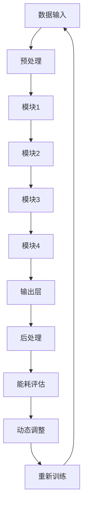

                 


### 引言

在当今信息时代，深度学习作为人工智能的关键技术之一，已经取得了显著的成果。从图像识别、自然语言处理到推荐系统，深度学习模型在各个领域都展现出了强大的应用潜力。然而，随着深度学习模型的规模不断扩大，其计算复杂度和能耗需求也急剧增加，这对环境和社会产生了深远的影响。在这种背景下，“绿色深度学习”应运而生，成为了一个重要研究方向。

绿色深度学习的目标是设计能源效率感知的深度学习模型，通过优化模型结构和算法，降低能耗和碳排放，实现可持续发展。这不仅关乎技术的进步，更关系到环境保护和社会责任。因此，研究绿色深度学习具有重要的现实意义。

本文将围绕“绿色深度学习：能源效率感知的模型设计”这一主题，详细探讨绿色深度学习的基础、能源效率感知的模型设计、数学模型与公式，以及项目实战等内容。通过逐步分析，我们将深入了解绿色深度学习的核心概念、设计原则和实现方法。

### 第一部分：绿色深度学习的基础

#### 第1章：绿色深度学习概述

**1.1 绿色深度学习的概念**

绿色深度学习（Green Deep Learning）是指通过优化深度学习模型的设计和运行，降低其能耗和碳排放，实现可持续发展的深度学习技术。它不仅仅关注模型的准确性，更强调在训练和推理过程中对能源效率的优化。

绿色深度学习涉及多个方面，包括：

- **模型结构优化**：通过设计更高效的神经网络架构，减少模型参数数量，降低计算复杂度。
- **算法改进**：优化训练算法，减少迭代次数，加快收敛速度，降低能耗。
- **硬件与软件协同**：结合硬件加速器和新型计算模型，提高计算效率。
- **能耗监测与管理**：实时监测模型能耗，通过调整模型参数和运行策略，降低能耗。

**1.2 绿色深度学习的目标和挑战**

绿色深度学习的目标主要包括：

- **提高能源效率**：降低深度学习模型的能耗，减少碳排放。
- **降低成本**：优化模型设计和算法，减少计算资源的需求，降低硬件和维护成本。
- **实现可持续发展**：通过绿色深度学习，促进人工智能技术的可持续发展，减少对环境的负面影响。

然而，实现绿色深度学习面临着一系列挑战：

- **性能与效率的平衡**：在降低能耗的同时，需要保证模型性能不受影响。
- **多样性需求**：深度学习模型应用广泛，不同场景对能源效率的要求各不相同。
- **技术复杂性**：绿色深度学习涉及多个学科领域，技术实现复杂。
- **标准缺失**：目前缺乏统一的绿色深度学习评估标准和测试平台。

**1.3 绿色深度学习的研究现状**

近年来，绿色深度学习受到了广泛关注，研究人员从多个角度进行了探索：

- **模型结构优化**：提出了一系列低能耗的神经网络架构，如稀疏网络、小样本学习模型等。
- **算法改进**：研究了多种优化算法，如自适应梯度下降、随机搜索等，以减少训练和推理过程中的能耗。
- **硬件协同**：结合了新型硬件技术，如TPU、GPU、FPGA等，以提高计算效率。
- **能耗监测与管理**：开发了一系列能耗监测工具和软件，以实时评估和优化模型能耗。

尽管取得了显著进展，但绿色深度学习仍处于发展初期，未来需要进一步研究，以解决现有挑战，实现更大规模的推广应用。

### 第2章：深度学习模型能耗分析

**2.1 能耗分析的方法和工具**

深度学习模型的能耗分析是绿色深度学习研究的重要基础。能耗分析的方法和工具主要包括以下几个方面：

- **硬件能耗监测**：通过硬件监控工具，如GPU功耗监控器，实时测量深度学习模型在运行过程中的功耗。
- **软件能耗模拟**：使用能耗模拟工具，如EnergyPlus、MATLAB等，对深度学习模型在不同硬件平台上的能耗进行预测和评估。
- **能耗基准测试**：通过建立能耗基准测试平台，对不同深度学习模型在相同任务下的能耗进行对比和分析。
- **能效优化算法**：基于能耗分析结果，设计并实现能效优化算法，以降低深度学习模型的能耗。

**2.2 现有深度学习模型的能耗**

目前，深度学习模型的能耗分析主要集中在以下几个层面：

- **训练能耗**：在深度学习模型训练过程中，模型参数的更新和计算复杂度是主要能耗来源。特别是对于大型模型，如BERT、GPT等，训练能耗极高。
- **推理能耗**：在模型推理过程中，计算图执行和模型参数访问是主要能耗来源。推理能耗虽然相对较低，但随着模型规模的增大，能耗也在不断增加。
- **存储能耗**：深度学习模型需要大量的存储空间，存储能耗主要包括硬盘读写能耗和存储器能耗。

根据相关研究，现有深度学习模型的能耗特点如下：

- **能耗集中性**：深度学习模型的能耗主要集中在GPU和TPU等硬件设备上，CPU和其他硬件设备能耗相对较低。
- **能耗差异性**：不同深度学习模型的能耗存在较大差异，取决于模型规模、计算复杂度和训练/推理策略。
- **能耗增长趋势**：随着深度学习模型规模的不断扩大和复杂度的增加，能耗也在不断增加。

**2.3 模型能耗的影响因素**

深度学习模型的能耗受到多种因素的影响，主要包括以下几个方面：

- **模型结构**：神经网络层数、节点数量、连接方式等结构因素直接影响模型的计算复杂度和能耗。
- **训练算法**：优化算法、学习率调整、批量大小等训练算法因素影响模型训练效率和能耗。
- **硬件平台**：不同硬件平台（如GPU、TPU、CPU）的能耗特性不同，影响模型整体能耗。
- **数据规模**：数据集大小和数据分布对模型训练和推理过程产生直接影响，从而影响能耗。
- **运行环境**：温度、湿度、散热系统等运行环境因素对硬件设备能耗产生影响。

通过深入分析深度学习模型的能耗影响因素，可以为绿色深度学习模型设计提供重要参考，从而实现更高效、更环保的深度学习应用。

#### 第3章：能量效率感知神经网络架构

**3.1 能量效率感知神经网络的设计原则**

能量效率感知神经网络（Energy-Efficient Neural Network，简称EE-NN）旨在通过设计高效的网络结构，降低深度学习模型在训练和推理过程中的能耗。设计EE-NN时，需要遵循以下原则：

- **模块化设计**：将神经网络分为多个模块，每个模块负责不同的计算任务，可以灵活调整模块的规模和结构，以适应不同的能耗需求。
- **稀疏性**：通过引入稀疏连接和稀疏激活函数，减少非必要的计算操作，降低能耗。
- **动态调整**：根据训练过程中的数据分布和模型性能，动态调整网络结构和参数，以实现最优的能耗-性能平衡。
- **硬件协同**：结合不同类型的硬件资源，如GPU、TPU、FPGA等，实现计算资源的最佳分配和协同工作，提高整体能耗效率。

**3.2 Mermaid流程图：能量效率感知神经网络架构图**

为了更好地展示EE-NN的架构，可以使用Mermaid流程图来描述。以下是EE-NN架构的Mermaid流程图：



图中的各个模块表示EE-NN的不同层级和功能，数据输入经过预处理后，依次通过模块1、模块2、模块3和模块4，最终由输出层生成预测结果。在训练过程中，通过能耗评估模块实时监测和评估模型的能耗，并根据评估结果动态调整网络结构和参数，实现能耗-性能的最优化。

**3.3 常见的能量效率感知神经网络架构**

目前，已经提出了一些具有代表性的能量效率感知神经网络架构，以下介绍几种常见的架构：

1. **稀疏神经网络（Sparse Neural Network，简称SNN）**：
   SNN通过引入稀疏性，减少网络的连接数，降低计算复杂度和能耗。在训练过程中，SNN采用稀疏激活函数，如ReLU-Sparse，使得大部分神经元处于关闭状态，从而减少能耗。

2. **动态稀疏神经网络（Dynamically Sparse Neural Network，简称DSNN）**：
   DSNN在SNN的基础上，引入了动态调整机制，可以根据训练过程中的数据分布和模型性能，动态调整网络的稀疏度。DSNN通过在线学习策略，实现了更高效的能耗管理。

3. **能量效率感知卷积神经网络（Energy-Efficient Convolutional Neural Network，简称EE-CNN）**：
   EE-CNN针对卷积神经网络（CNN）的特点，设计了一系列能量效率优化策略，如低秩分解、混合精度训练等，以降低模型的能耗。EE-CNN在图像识别、目标检测等任务中取得了显著的能耗-性能平衡。

4. **自适应能量效率神经网络（Adaptive Energy-Efficient Neural Network，简称AE-NN）**：
   AE-NN通过自适应调整网络结构和参数，实现能耗-性能的最优化。AE-NN结合了多种能量效率优化方法，如稀疏性、动态调整和硬件协同等，适用于不同类型的深度学习任务。

这些能量效率感知神经网络架构在降低能耗的同时，也保持了较高的模型性能，为绿色深度学习的研究和应用提供了重要参考。

#### 第4章：核心算法原理讲解

**4.1 深度学习模型的优化算法**

优化算法是深度学习训练过程中关键的一环，其目的是通过调整模型参数，使得模型在训练数据上的性能不断优化。以下是几种常用的优化算法及其伪代码：

**1. 梯度下降算法（Gradient Descent）**

梯度下降算法是一种最简单的优化算法，其基本思想是沿着损失函数的梯度方向，反向更新模型参数，以减小损失函数的值。以下是梯度下降算法的伪代码：

```python
# 参数初始化
θ = θ_init

# 学习率
η = learning_rate

# 迭代次数
T = num_iterations

for t in range(T):
    # 计算梯度
    ∇θL(θ) = ∂L(θ)/∂θ
    
    # 更新参数
    θ = θ - η∇θL(θ)
```

**2. 动量优化算法（Momentum）**

动量优化算法在梯度下降算法的基础上，引入了动量项，以加速收敛速度并减少局部最小值的影响。以下是动量优化算法的伪代码：

```python
# 参数初始化
θ = θ_init
v = 0

# 学习率
η = learning_rate

# 动量系数
α = momentum_coefficient

# 迭代次数
T = num_iterations

for t in range(T):
    # 计算梯度
    ∇θL(θ) = ∂L(θ)/∂θ
    
    # 更新动量
    v = α * v - η * ∇θL(θ)
    
    # 更新参数
    θ = θ + v
```

**3. Adam优化算法（Adam）**

Adam优化算法结合了动量优化和自适应学习率调整，具有较好的收敛性能。以下是Adam优化算法的伪代码：

```python
# 参数初始化
θ = θ_init
m = 0
v = 0
m_hat = 0
v_hat = 0

# 学习率
η = learning_rate

# 衰减系数
β1 = beta1
β2 = beta2

# 迭代次数
T = num_iterations

for t in range(T):
    # 计算梯度
    ∇θL(θ) = ∂L(θ)/∂θ
    
    # 更新m
    m = β1 * m + (1 - β1) * ∇θL(θ)
    
    # 更新v
    v = β2 * v + (1 - β2) * ∇θL(θ)**2
    
    # 去偏置
    m_hat = m / (1 - β1**t)
    v_hat = v / (1 - β2**t)
    
    # 更新参数
    θ = θ - η * m_hat / (sqrt(v_hat) + ε)
```

**4.2 深度学习模型的激活函数**

激活函数是深度学习模型中重要的非线性变换，其作用是引入模型的非线性特性，使得模型能够拟合复杂的数据分布。以下是几种常见的激活函数：

**1. Sigmoid函数**

Sigmoid函数是一种常用的激活函数，其形式为：

$$ f(x) = \frac{1}{1 + e^{-x}} $$

Sigmoid函数的输出范围在(0, 1)之间，常用于二分类问题。

**2.ReLU函数**

ReLU函数（Rectified Linear Unit）是一种简单的线性激活函数，其形式为：

$$ f(x) = \max(0, x) $$

ReLU函数具有计算简单、梯度不变等优点，常用于深度学习模型的隐藏层。

**3. tanh函数**

tanh函数（双曲正切函数）是一种常用的非线性激活函数，其形式为：

$$ f(x) = \frac{e^x - e^{-x}}{e^x + e^{-x}} $$

tanh函数的输出范围在(-1, 1)之间，具有较好的平滑性。

**4. Leaky ReLU函数**

Leaky ReLU函数是对ReLU函数的改进，其形式为：

$$ f(x) = \max(0.01x, x) $$

Leaky ReLU函数解决了ReLU函数在负值部分梯度消失的问题，提高了模型的训练稳定性。

**4.3 深度学习模型的正则化方法**

正则化方法是一种防止深度学习模型过拟合的技术，其目的是通过引入惩罚项，降低模型复杂度，提高泛化能力。以下是几种常见的正则化方法：

**1. L1正则化**

L1正则化通过在损失函数中加入L1范数惩罚项，实现模型复杂度的控制。其形式为：

$$ L_{reg} = λ\sum_{i=1}^{n} |θ_i| $$

**2. L2正则化**

L2正则化通过在损失函数中加入L2范数惩罚项，实现模型复杂度的控制。其形式为：

$$ L_{reg} = λ\sum_{i=1}^{n} θ_i^2 $$

L2正则化具有较好的平滑效果，适用于防止模型过拟合。

**3. Drop

