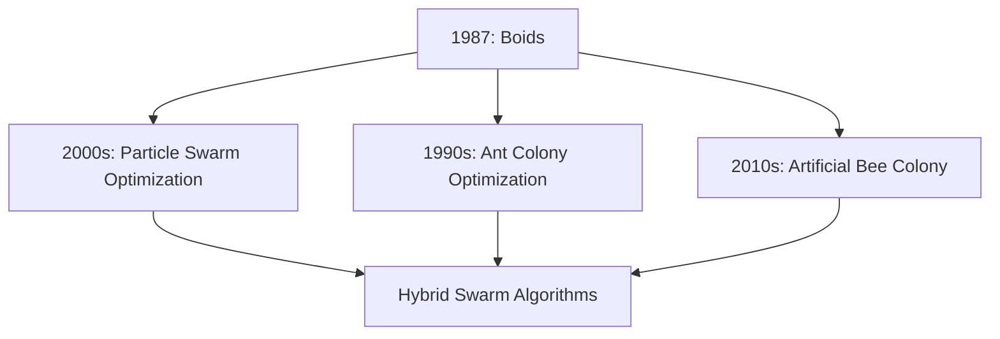
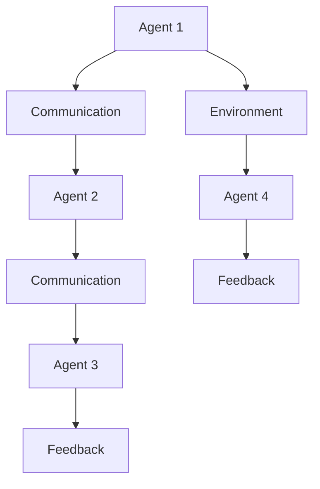

                 


### Step 1: Introduction to Swarm Intelligence and Multi-Agent Systems

#### Chapter 1: Introduction to Swarm Intelligence

**1.1 Definition and Historical Background**

Swarm intelligence (SI) is a collective property of many individuals appearing in a group of simple agents. The core concept revolves around the idea that complex, intelligent behavior can emerge from the interactions of many simple agents, each following a set of simple rules. This idea was first proposed by Craig Reynolds in 1987, who introduced the concept of "boids" — a simulation of bird flocking behavior using simple algorithms.

**Mermaid Flowchart: Illustrating the Evolution of Swarm Intelligence**



**1.2 Core Concepts and Theories**

Swarm intelligence is grounded in several core concepts and theories, such as:

- **Individual Behavior**: Each agent operates based on simple rules, such as separation, alignment, and cohesion.
- **Local Interaction**: Agents communicate and collaborate based on local information, without the need for a global view.
- **Collective Behavior**: Emergent properties arise from the interactions between agents, leading to complex, intelligent behavior.

**1.3 Applications of Swarm Intelligence**

Swarm intelligence has found applications in various fields, including:

- **Robotics**: Coordinating the behavior of multiple robots to achieve complex tasks.
- **Transportation**: Optimizing traffic flow and routing in transportation networks.
- **Scheduling**: Efficiently scheduling tasks in distributed systems.
- **Economics**: Modeling the behavior of financial markets and stock markets.

**1.4 Swarm Intelligence in Multi-Agent Systems**

In multi-agent systems (MAS), swarm intelligence plays a crucial role in enabling agents to collaborate and make collective decisions. The integration of swarm intelligence in MAS leads to more robust and adaptive systems.

### Step 2: Fundamentals of Multi-Agent Systems

#### Chapter 2: Fundamentals of Multi-Agent Systems

**2.1 Definition and Characteristics**

A multi-agent system (MAS) consists of multiple autonomous agents that interact with each other and their environment. The key characteristics of MAS include:

- **Autonomy**: Agents operate independently, making their own decisions based on their local information.
- **Distributed Intelligence**: Intelligence is distributed across multiple agents, allowing the system to adapt to changes in the environment.
- **Adaptability**: Agents can adapt their behavior based on the changing environment and feedback from other agents.

**2.2 Agent Models and Communication Protocols**

There are various types of agent models, including:

- **Logical Agents**: Make decisions based on a set of predefined rules.
- **Physical Agents**: Interact with the physical environment through sensors and actuators.
- **Social Agents**: Form social bonds and engage in social behaviors.

Communication protocols in MAS include:

- **Direct Communication**: Agents communicate directly with each other using message-passing.
- **Indirect Communication**: Agents communicate indirectly through the environment or shared resources.

**2.3 Coordination Mechanisms**

Coordination mechanisms in MAS can be centralized or decentralized:

- **Centralized Coordination**: A central authority makes decisions for all agents.
- **Decentralized Coordination**: Agents coordinate their actions based on local information and feedback.

Multi-agent learning algorithms, such as reinforcement learning and genetic algorithms, can also help in achieving coordination.

**2.4 Architecture of Multi-Agent Systems**

Common architectures for MAS include:

- **Distributed Architecture**: Agents operate in a distributed environment and communicate through direct or indirect communication.
- **Centralized Architecture**: A central controller coordinates the actions of all agents.
- **Hybrid Architecture**: Combines elements of both distributed and centralized architectures.

**Mermaid Flowchart: Illustrating the Architecture of a Multi-Agent System**



### Step 3: Swarm Intelligence Algorithms

#### Chapter 3: Swarm Intelligence Algorithms

**3.1 Basic Swarm Algorithms**

Basic swarm algorithms include:

- **Particle Swarm Optimization (PSO)**: Optimizes problems by simulating the social behavior of birds or fish. 
  - **Pseudocode for PSO**:
    
    ```python
    Initialize a swarm of particles with random positions and velocities
    while not convergence criterion:
        for each particle in the swarm:
            update its position and velocity
            if current position is better than its best position:
                update its best position
        update the global best position found so far
    return the best position found
    ```

- **Ant Colony Optimization (ACO)**: Solves optimization problems by simulating the foraging behavior of ants. 
  - **Pseudocode for ACO**:
    
    ```python
    Initialize pheromone levels on the edges of the graph
    while not convergence criterion:
        for each ant in the swarm:
            construct a solution by following the pheromone trails
            deposit pheromone on the edges of the solution
        evaporation of pheromone
    return the best solution found
    ```

**3.2 Advanced Swarm Algorithms**

Advanced swarm algorithms include:

- **Artificial Bee Colony (ABC)**: Inspired by the foraging behavior of honey bees.
  - **Pseudocode for ABC**:
    
    ```python
    Initialize a population of bees with solutions to the problem
    while not convergence criterion:
        for each bee in the swarm:
            generate a new solution by perturbing its current solution
            if the new solution is better:
                replace the current solution with the new one
        for each bee:
            select a neighbor solution and perform the greedy selection
        perform the employed bees and onlooker bees phases
    return the best solution found
    ```

- **Genetic Algorithms (GA)**: Inspired by the process of natural selection and genetics.
  - **Pseudocode for GA**:
    
    ```python
    Initialize a population of individuals with random solutions
    while not convergence criterion:
        evaluate the fitness of each individual
        select the best individuals for reproduction
        create a new population by applying genetic operators like crossover and mutation
    return the best individual found
    ```

**3.3 Hybrid Swarm Algorithms**

Hybrid swarm algorithms combine the advantages of multiple swarm intelligence algorithms to improve performance and robustness. Examples of hybrid swarm algorithms include PSO-ACO, PSO-GA, and ABC-GA.

### Step 4: Collaborative Decision-Making in Multi-Agent Systems

#### Chapter 4: Collaborative Decision-Making in Multi-Agent Systems

**4.1 Core Concepts and Theories**

Collaborative decision-making in multi-agent systems involves agents working together to reach a consensus on a decision. The key concepts and theories include:

- **Consensus Algorithms**: Algorithms that enable agents to reach a shared understanding of the environment and make coordinated decisions.
- **Distributed Decision-Making**: Decisions are made locally by individual agents, but the overall system converges to a collective decision.
- **Decentralized Control**: Agents operate independently, with no central authority.

**4.2 Coordination Mechanisms**

Coordination mechanisms in collaborative decision-making include:

- **Rules-Based Coordination**: Agents follow a set of predefined rules to coordinate their actions.
- **Model-Based Coordination**: Agents use models of the environment and other agents to coordinate their actions.
- **Learning-Based Coordination**: Agents learn from their interactions and feedback to improve their coordination.

**4.3 Case Studies**

Case studies of collaborative decision-making in multi-agent systems include:

- **Distributed Sensor Networks**: Agents collect data and share information to make decisions about environmental monitoring or target tracking.
- **Robotic Swarms**: Robots collaborate to complete complex tasks, such as search and rescue or construction.
- **Multi-Agent Path Finding**: Agents coordinate to find optimal paths in a dynamic environment.

### Step 5: Swarm Intelligence in Real-World Applications

#### Chapter 5: Swarm Intelligence in Real-World Applications

**5.1 Robotics**

Swarm intelligence has been applied in robotics to enable the coordination of multiple robots. Examples include:

- **Search and Rescue**: Robots working together to locate survivors in disaster areas.
- **Manufacturing**: Robots collaborating in assembly lines to improve efficiency and reduce costs.

**5.2 Transportation**

Swarm intelligence has been applied in transportation systems to optimize traffic flow and routing. Examples include:

- **Urban Traffic Management**: Optimizing traffic signals and routes to reduce congestion.
- **Smart Transportation Systems**: Integrating autonomous vehicles and public transportation.

**5.3 Economics**

Swarm intelligence has been applied in economic systems to model financial markets and analyze market trends. Examples include:

- **Stock Market Prediction**: Predicting stock prices based on the collective behavior of investors.
- **Financial Risk Management**: Assessing and managing risks in financial systems.

### Conclusion

Swarm intelligence and multi-agent systems are powerful tools for solving complex problems in a distributed and collaborative manner. By understanding the core concepts, algorithms, and applications of swarm intelligence, we can develop more robust and intelligent systems that can adapt to changing environments and make informed decisions.

---

**Keywords**: Swarm Intelligence, Multi-Agent Systems, Collaborative Decision-Making, Optimization Algorithms, Robotics, Transportation, Economics.

**Abstract**: This book presents a comprehensive overview of swarm intelligence and multi-agent systems, covering their definitions, fundamental concepts, algorithms, and real-world applications. The book aims to provide readers with a deep understanding of how simple agents can work together to solve complex problems, enabling the development of more intelligent and adaptive systems.

**Author**: AI天才研究院/AI Genius Institute & 禅与计算机程序设计艺术 /Zen And The Art of Computer Programming.

