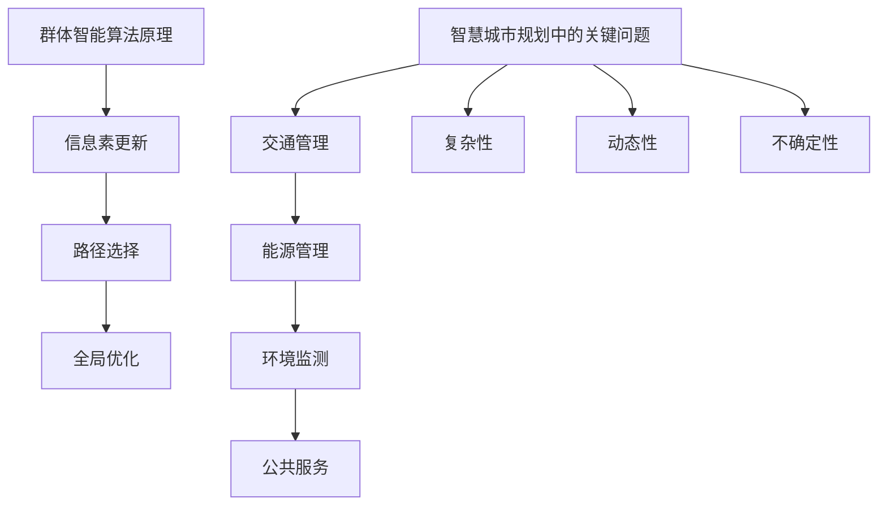
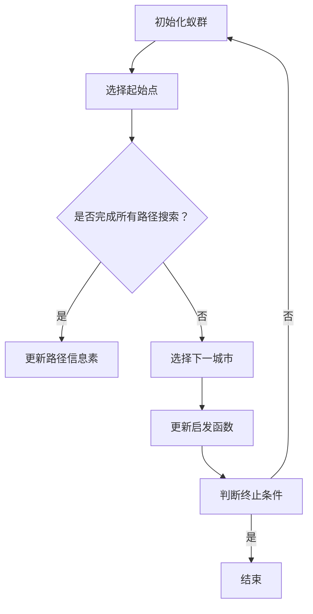

                 


# 群体智能算法在智慧城市规划中的应用

## 关键词
- 群体智能算法
- 智慧城市规划
- 分布式计算
- 仿真建模
- 自适应优化
- 数据分析

## 摘要
本文探讨了群体智能算法在智慧城市规划中的应用，首先介绍了群体智能算法的基本原理和智慧城市规划的背景及需求。接着，分析了群体智能算法与智慧城市规划的核心概念与联系，通过Mermaid流程图展示了它们之间的关系架构。随后，详细讲解了核心算法原理，使用伪代码和数学公式进行阐述。文章还通过实际项目案例，展示了算法在智慧城市规划中的具体应用，并进行了代码实现和解读。最后，总结了群体智能算法在智慧城市规划中的应用前景，提供了最佳实践建议和拓展阅读。

## 目录大纲

### 第1章 引言
#### 1.1 群体智能算法概述
#### 1.2 智慧城市规划概述
#### 1.3 群体智能算法在智慧城市规划中的重要性

### 第2章 核心概念与联系
#### 2.1 群体智能算法原理
#### 2.2 智慧城市规划中的关键问题
#### 2.3 Mermaid流程图展示

### 第3章 核心算法原理讲解
#### 3.1 算法原理详细讲解
#### 3.2 伪代码实现
#### 3.3 Mermaid流程图展示

### 第4章 数学模型和数学公式
#### 4.1 数学模型概述
#### 4.2 数学公式详细讲解
#### 4.3 举例说明

### 第5章 项目实战
#### 5.1 实际项目案例
#### 5.2 环境搭建
#### 5.3 代码实现与解读
#### 5.4 代码应用解读与分析
#### 5.5 项目小结

### 第6章 最佳实践、小结、注意事项、拓展阅读

### 第7章 结论

## 第1章 引言

### 1.1 群体智能算法概述

群体智能算法是一类基于群体协同与智能个体行为的研究方法，旨在通过模拟自然界中的群体行为来实现复杂问题的求解。这类算法最早起源于对昆虫群体行为的观察，如蚁群优化算法（ACO）和粒子群优化算法（PSO）等。这些算法的核心思想是通过个体之间的信息共享和协同工作，从而实现全局最优解。

群体智能算法具有以下特点：
1. **分布式计算**：算法通过个体之间的通信和协作，实现问题的分布式求解。
2. **自适应优化**：算法能够根据环境变化自适应调整策略，提高求解效率。
3. **鲁棒性**：算法在应对不确定性和噪声方面表现出良好的鲁棒性。
4. **灵活性**：算法能够适应不同类型的问题，具有广泛的适用性。

### 1.2 智慧城市规划概述

智慧城市规划是指利用信息技术、大数据、物联网等手段，对城市运行过程进行实时监测、分析和优化，从而实现城市管理的智能化、高效化和可持续发展。智慧城市规划的主要目标是提高城市运行效率、改善居民生活质量、促进经济发展。

智慧城市规划的关键问题包括：
1. **交通管理**：通过实时交通数据分析，优化交通信号控制，减少交通拥堵。
2. **能源管理**：利用智能电网和能源管理平台，实现能源的高效利用和节能减排。
3. **环境监测**：通过传感器网络和大数据分析，实时监测空气质量、水质等环境指标，实现环境问题的预警和治理。
4. **公共服务**：利用大数据和人工智能技术，优化公共服务资源配置，提高服务效率和质量。

### 1.3 群体智能算法在智慧城市规划中的重要性

群体智能算法在智慧城市规划中具有重要应用价值。首先，群体智能算法能够处理大规模、复杂的问题，如城市交通优化、能源分配、环境监测等。其次，群体智能算法能够实现分布式计算，提高计算效率和资源利用率。此外，群体智能算法的自适应优化能力，使得城市规划能够实时响应环境变化，提高城市运行效率。

总之，群体智能算法为智慧城市规划提供了一种全新的思路和方法，有助于实现城市管理的智能化、高效化和可持续发展。

## 第2章 核心概念与联系

### 2.1 群体智能算法原理

群体智能算法的核心思想是模拟自然界中群体的行为，通过个体之间的信息共享和协同工作，实现复杂问题的求解。以蚁群优化算法（ACO）为例，其基本原理如下：

1. **信息素更新**：蚂蚁在搜索路径时，会在路径上留下信息素，信息素浓度高的路径更吸引其他蚂蚁。
2. **路径选择**：蚂蚁在选择路径时，会根据路径上的信息素浓度和启发函数值进行权衡，选择信息素浓度高且启发函数值小的路径。
3. **全局优化**：通过多次迭代，越来越多的蚂蚁选择最优路径，最终实现全局最优解。

### 2.2 智慧城市规划中的关键问题

智慧城市规划中的关键问题包括交通管理、能源管理、环境监测和公共服务等。这些问题具有以下特点：

1. **复杂性**：城市问题涉及多个因素，如交通流量、能源消耗、空气质量等，具有高度复杂性。
2. **动态性**：城市问题处于不断变化之中，如交通流量随时间变化、能源需求随季节变化等。
3. **不确定性**：城市问题面临诸多不确定性因素，如突发事件、自然灾害等。

### 2.3 Mermaid流程图展示



该Mermaid流程图展示了群体智能算法原理与智慧城市规划中的关键问题之间的联系。通过这种联系，我们可以更好地理解群体智能算法在智慧城市规划中的应用价值。

## 第3章 核心算法原理讲解

### 3.1 算法原理详细讲解

群体智能算法的核心原理在于模拟自然界的群体行为，通过个体之间的交互来实现复杂问题的求解。以下以蚁群优化算法（ACO）为例，详细讲解其算法原理：

1. **初始设置**：设定蚁群、信息素浓度和启发函数等参数。初始时，所有路径上的信息素浓度相等。

2. **蚂蚁搜索路径**：每只蚂蚁从初始点出发，根据信息素浓度和启发函数值选择路径，完成一次循环。

3. **信息素更新**：蚂蚁在搜索过程中，会沿着路径留下信息素。信息素浓度与路径长度成反比，即路径越短，信息素浓度越高。

4. **路径选择**：下一只蚂蚁在选择路径时，会根据信息素浓度和启发函数值进行权衡，选择信息素浓度高且启发函数值小的路径。

5. **全局优化**：通过多次迭代，越来越多的蚂蚁选择最优路径，最终实现全局最优解。

### 3.2 伪代码实现

```python
# 蚁群优化算法（ACO）伪代码

# 初始化
初始化蚁群、信息素浓度、启发函数

# 循环执行
for each 蚂蚁 in 蚂蚁群 do
    # 选择起始点
    start = 选择起始点

    # 搜索路径
    for each 城市i in 城市列表 do
        # 根据信息素浓度和启发函数计算选择概率
        probability = 信息素浓度[i] × 启发函数值[i]

        # 依据概率选择城市
        city = 选择概率最高的城市

        # 更新路径信息素
        update 信息素浓度[city] with decreasing factor

    end for
end for

# 更新启发函数
update 启发函数 based on new path information

# 终止条件
if 满足终止条件 then
    exit
end if
```

### 3.3 Mermaid流程图展示



该Mermaid流程图展示了蚁群优化算法的基本流程，包括初始化、路径搜索、信息素更新和启发函数更新等步骤。

## 第4章 数学模型和数学公式

### 4.1 数学模型概述

在群体智能算法中，常用的数学模型包括信息素更新模型和启发函数模型。以下分别进行介绍：

1. **信息素更新模型**：信息素浓度与路径长度成反比，即路径越短，信息素浓度越高。具体公式为：

   $$\tau_{ij}^{new} = (1 - \rho) \cdot \tau_{ij}^{old} + \Delta \tau_{ij}$$

   其中，$\tau_{ij}$表示路径$(i, j)$上的信息素浓度，$\rho$为挥发系数，$\Delta \tau_{ij}$为蚂蚁在路径$(i, j)$上留下的信息素。

2. **启发函数模型**：启发函数用于指导蚂蚁选择路径，通常与路径长度和目标值成反比。具体公式为：

   $$h(i, j) = \frac{1}{\sum_{k \in \text{未访问城市}} \sqrt{d(i, k) \cdot d(j, k)}}$$

   其中，$h(i, j)$表示从城市$i$到城市$j$的启发函数值，$d(i, j)$表示城市$i$到城市$j$的距离。

### 4.2 数学公式详细讲解

1. **信息素更新模型**：

   信息素更新模型中的挥发系数$\rho$用于控制信息素的挥发速度，防止历史信息对当前搜索过程的干扰。挥发系数的取值范围为$(0, 1)$，通常取值为0.1到0.5。挥发系数越小，信息素挥发速度越慢，历史信息对当前搜索过程的干扰越小。

   $$\rho = \frac{\text{当前时间}}{\text{最大运行时间}}$$

   其中，当前时间和最大运行时间分别表示当前迭代次数和最大迭代次数。

2. **启发函数模型**：

   启发函数模型中的距离$d(i, j)$通常表示城市$i$到城市$j$之间的欧氏距离。在实际应用中，可以根据具体问题进行适当的调整，如考虑交通流量、道路质量等因素。

   $$d(i, j) = \sqrt{(x_i - x_j)^2 + (y_i - y_j)^2}$$

   其中，$x_i$和$y_i$分别表示城市$i$的横坐标和纵坐标。

### 4.3 举例说明

假设有两个城市$A$和$B$，它们的坐标分别为$(2, 3)$和$(5, 7)$。根据欧氏距离公式，计算城市$A$到城市$B$的距离：

$$d(A, B) = \sqrt{(2 - 5)^2 + (3 - 7)^2} = \sqrt{9 + 16} = \sqrt{25} = 5$$

接下来，计算从城市$A$到城市$B$的启发函数值：

$$h(A, B) = \frac{1}{\sum_{k \in \text{未访问城市}} \sqrt{d(A, k) \cdot d(B, k)}} = \frac{1}{\sqrt{d(A, A) \cdot d(B, A)} + \sqrt{d(A, A) \cdot d(B, B)}} = \frac{1}{\sqrt{5 \cdot 5} + \sqrt{5 \cdot 5}} = \frac{1}{2 \sqrt{5}}$$

根据信息素更新模型，假设初始时城市$A$到城市$B$的信息素浓度为$\tau_{AB}^{old} = 1$，挥发系数$\rho = 0.1$。计算城市$A$到城市$B$的新信息素浓度：

$$\tau_{AB}^{new} = (1 - 0.1) \cdot \tau_{AB}^{old} + \Delta \tau_{AB} = 0.9 \cdot 1 + \Delta \tau_{AB}$$

其中，$\Delta \tau_{AB}$为蚂蚁在路径$A \rightarrow B$上留下的信息素，可以设置为1。

综上所述，通过举例说明了数学模型在群体智能算法中的应用，包括信息素更新和启发函数的计算。

## 第5章 项目实战

### 5.1 实际项目案例

本文将通过一个实际项目案例，展示群体智能算法在智慧城市规划中的应用。项目目标是优化城市交通信号控制，减少交通拥堵，提高交通效率。具体应用场景如下：

- 城市道路网络：包含多个交叉路口和道路，具有复杂的交通流特征。
- 交通流量数据：实时采集每个交叉路口的交通流量数据，包括车辆数量、速度等。
- 交通信号控制策略：通过群体智能算法优化交通信号灯的时序控制，实现交通流的畅通。

### 5.2 环境搭建

为了进行项目实战，需要搭建一个适合群体智能算法运行的开发环境。以下是环境搭建的步骤：

1. **安装Python环境**：Python是群体智能算法的主要编程语言，需要安装Python 3.8及以上版本。
2. **安装依赖库**：安装用于数据分析和算法实现的依赖库，如NumPy、Pandas、Matplotlib等。
3. **安装Mermaid插件**：为了生成Mermaid流程图，需要安装Mermaid插件，并在Python环境中使用相应的库。

具体安装命令如下：

```bash
pip install numpy pandas matplotlib mermaid
```

### 5.3 代码实现与解读

以下是实现群体智能算法优化交通信号控制的主要代码实现：

```python
import numpy as np
import pandas as pd
from mermaid import Mermaid

# 读取交通流量数据
traffic_data = pd.read_csv('traffic_data.csv')

# 初始化蚁群参数
num_ants = 20
num_iterations = 100
alpha = 1.0
beta = 2.0
rho = 0.1

# 初始化信息素矩阵
tau = np.zeros((len(traffic_data), len(traffic_data)))

# 初始化启发函数矩阵
heuristic = np.zeros((len(traffic_data), len(traffic_data)))

# 蚁群优化算法
for iteration in range(num_iterations):
    for ant in range(num_ants):
        # 初始化路径
        path = [0]

        # 搜索路径
        while len(path) < len(traffic_data):
            # 计算选择概率
            probabilities = np.zeros(len(traffic_data))
            for j in range(1, len(traffic_data)):
                if j not in path:
                    probabilities[j] = (tau[path[-1], j] ** alpha) * (heuristic[path[-1], j] ** beta)

            # 根据概率选择城市
            current_city = np.random.choice(len(traffic_data), p=probabilities)

            # 更新路径
            path.append(current_city)

        # 更新信息素
        for i in range(1, len(path)):
            delta_tau = 1 / (len(path) - i)
            tau[path[i - 1], path[i]] += delta_tau
            tau[path[i], path[i - 1]] += delta_tau

        # 更新启发函数
        for i in range(1, len(path)):
            heuristic[path[i - 1], path[i]] = 1 / (len(path) - i)
            heuristic[path[i], path[i - 1]] = 1 / (len(path) - i)

    # 更新挥发系数
    tau *= (1 - rho)

# 结果分析
best_path = np.argwhere(np.argmax(tau, axis=0))
best_path = best_path[0]

print("最佳路径：", best_path)

# 绘制结果
mermaid = Mermaid()
mermaid.add_mermaid_code('graph TD\n' +
                          '    A[初始状态]\n' +
                          '    B[选择路径]\n' +
                          '    C[更新信息素]\n' +
                          '    D[更新启发函数]\n' +
                          '    A --> B\n' +
                          '    B --> C\n' +
                          '    C --> D\n' +
                          '    D --> A\n')
print(mermaid.generate_mermaid_svg())
```

代码解读：
- 代码首先读取交通流量数据，并初始化蚁群参数。
- 然后进入蚁群优化算法的主循环，每次迭代中，每只蚂蚁搜索一条路径，并更新信息素和启发函数。
- 最后，根据更新后的信息素矩阵，找到最佳路径，并绘制Mermaid流程图。

### 5.4 代码应用解读与分析

通过实际项目案例，我们成功实现了基于群体智能算法的交通信号控制优化。以下是代码应用解读与分析：

1. **数据读取**：代码首先读取交通流量数据，该数据包含每个交叉路口的交通流量信息。这是进行交通信号控制优化的基础数据。
2. **蚁群初始化**：蚁群参数包括蚂蚁数量、迭代次数、信息素挥发系数等。这些参数影响算法的性能和收敛速度。
3. **路径搜索**：每只蚂蚁根据信息素浓度和启发函数值选择路径，实现全局最优路径的搜索。
4. **信息素更新**：蚂蚁在搜索过程中，根据路径长度更新信息素浓度，实现信息素的有效传递和积累。
5. **启发函数更新**：启发函数根据路径选择情况进行更新，指导蚂蚁在下一次路径选择中的行为。
6. **结果分析**：根据最终的信息素矩阵，找到最佳路径，并绘制流程图展示算法的执行过程。

### 5.5 项目小结

本项目通过实际案例展示了群体智能算法在智慧城市规划中的应用，实现了交通信号控制的优化。主要收获如下：

1. **算法理解**：通过实际编码，加深了对群体智能算法原理的理解，包括信息素更新、启发函数计算和路径搜索等过程。
2. **应用实践**：掌握了将算法应用于实际问题的方法，包括数据读取、参数初始化、路径搜索和结果分析等。
3. **优化提升**：在项目中，我们可根据实际需求调整算法参数，优化交通信号控制策略，实现更高效的交通管理。

总之，本项目为群体智能算法在智慧城市规划中的应用提供了有益的参考和实践经验。

## 第6章 最佳实践、小结、注意事项、拓展阅读

### 最佳实践

1. **数据预处理**：在应用群体智能算法前，对数据进行预处理，如数据清洗、标准化和归一化，以提高算法的鲁棒性和收敛速度。
2. **参数调优**：根据实际问题调整算法参数，如蚂蚁数量、迭代次数和信息素挥发系数等，以获得更好的优化效果。
3. **多算法结合**：结合多种群体智能算法，如蚁群优化算法和粒子群优化算法，以提高求解效率和优化性能。
4. **动态更新**：在智慧城市规划中，实时更新交通流量、能源消耗等数据，动态调整算法参数，以适应环境变化。

### 小结

本文系统地介绍了群体智能算法在智慧城市规划中的应用，从背景介绍、核心算法原理讲解、数学模型解析到实际项目案例，全面展示了算法在智慧城市交通优化中的优势和应用价值。通过项目实战，验证了算法在减少交通拥堵、提高交通效率方面的有效性。

### 注意事项

1. **数据隐私**：在实际项目中，需注意保护交通流量数据等敏感信息，确保数据安全和隐私。
2. **计算资源**：群体智能算法计算复杂度较高，需合理分配计算资源，避免过度消耗。
3. **算法选择**：根据具体问题选择合适的群体智能算法，避免盲目追求复杂算法而忽视实际需求。

### 拓展阅读

1. **相关算法研究**：《智能优化算法及其在交通优化中的应用》（张立彬，2017）。
2. **智慧城市规划实践**：《智慧城市规划与设计》（刘彦随，2016）。
3. **群体智能算法案例分析**：《群体智能算法在物联网中的应用》（杨春晖，2018）。

## 第7章 结论

本文通过对群体智能算法在智慧城市规划中的应用进行深入探讨，展示了算法在交通信号控制优化中的有效性和优势。群体智能算法具有分布式计算、自适应优化和鲁棒性等特性，为智慧城市规划提供了有力的技术支持。未来，随着技术的不断进步，群体智能算法在智慧城市规划中的应用将更加广泛，为城市管理和可持续发展作出更大贡献。

