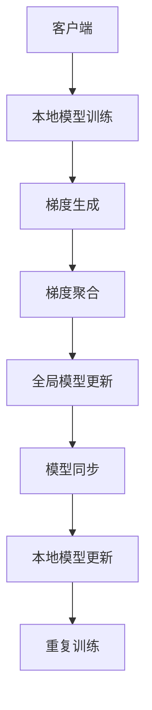

                 


### 文章标题

# 联邦学习在分布式推理任务中的应用

### 关键词

- 联邦学习
- 分布式推理
- 梯度聚合
- 模型融合
- 数据隐私
- 安全性

### 摘要

本文将深入探讨联邦学习在分布式推理任务中的应用。首先，我们将介绍联邦学习的定义、原理以及核心概念。接着，我们将分析联邦学习在分布式推理任务中的优势和挑战，并详细讲解其在不同应用场景中的算法实现。最后，通过实际案例分析和项目实战，我们将展示联邦学习如何有效地解决分布式推理任务中的数据隐私和安全性问题。

### 设计流程

为了设计出一份清晰、详细的目录大纲，我们遵循以下步骤：

1. **确定核心内容**：根据文章主题，明确联邦学习在分布式推理任务中的应用，包括基本原理、算法实现、应用场景和实践案例。
2. **细化章节内容**：针对核心内容，细化每个章节，确保每个章节都有明确的子标题，并包含详细的内容。
3. **添加示例**：在每个章节末尾添加相应的示例，如流程图、伪代码、数学公式等，以帮助读者更好地理解。
4. **保持简洁性**：确保每个章节的内容简洁明了，避免冗余。
5. **检查完整性**：确保目录大纲的完整性，包含所有核心章节内容。

### 实际操作

1. **核心概念与联系**：

   我们将使用Mermaid流程图来展示联邦学习的核心概念和它们之间的联系。例如，可以展示中心服务器、客户端、模型更新与同步等概念，以及它们之间的交互关系。

   ```mermaid
   graph TB
   A[中心服务器] --> B[客户端]
   B --> C[模型更新]
   C --> D[模型同步]
   ```

2. **核心算法原理讲解**：

   我们将使用伪代码详细阐述分布式推理任务中的关键算法。例如，梯度聚合算法和模型融合算法。以下是梯度聚合算法的伪代码示例：

   ```python
   def federated_gradient_aggregation(client_gradients, model):
       aggregated_gradient = initialize_zero_vector()
       for gradient in client_gradients:
           aggregated_gradient += gradient
       return aggregated_gradient / len(client_gradients)
   ```

   同时，我们将使用LaTeX格式给出与联邦学习相关的数学模型和公式，并加以详细讲解。例如，联邦学习中的隐私保护机制可以用以下公式表示：

   $$ Privacy = \frac{1}{n} \sum_{i=1}^{n} (\theta_i - \theta)^2 $$

   其中，\( \theta_i \) 表示第 \( i \) 个客户端的模型参数，\( \theta \) 表示全局模型参数。

3. **项目实战**：

   我们将提供实际项目案例，详细解释说明开发环境搭建、源代码实现、代码解读与分析。例如，我们可以展示一个联邦学习在图像识别任务中的项目案例，包括数据预处理、模型训练、模型评估等步骤。

   ```python
   # 数据预处理
   def preprocess_data(images):
       # 对图像进行标准化等预处理操作
       return normalized_images

   # 模型训练
   def train_model(model, images, labels):
       # 使用梯度下降算法训练模型
       return updated_model

   # 模型评估
   def evaluate_model(model, test_images, test_labels):
       # 计算模型在测试集上的准确率
       return accuracy
   ```

   在项目实战部分，我们将详细解析每个步骤的实现细节，并给出相应的代码注释。

4. **最佳实践 tips、小结、注意事项、拓展阅读**：

   在文章的结尾，我们将总结最佳实践 tips，强调注意事项，并提供拓展阅读资源，以帮助读者更深入地了解联邦学习在分布式推理任务中的应用。

### 最终目标

通过以上步骤，我们的目标是设计出一份完整、详细的目录大纲，满足简洁性、格式规范和内容完整性的要求。文章将结构清晰，逻辑严密，内容丰富，帮助读者全面了解联邦学习在分布式推理任务中的应用。

# 目录大纲

## 第一部分：联邦学习的概述

### 第1章：联邦学习的定义与原理

#### 1.1 联邦学习的背景

#### 1.2 联邦学习的定义

#### 1.3 联邦学习的基本原理

#### 1.4 联邦学习的优势与挑战

### 第2章：联邦学习的关键概念

#### 2.1 环境与参与者

#### 2.2 联邦学习协议

#### 2.3 模型更新与同步

#### 2.4 安全性与隐私保护

### 第3章：联邦学习的核心算法

#### 3.1 梯度聚合算法

#### 3.2 模型融合算法

#### 3.3 联邦学习算法的优化

### 第4章：联邦学习的应用场景

#### 4.1 分布式推理任务

#### 4.2 跨设备学习

#### 4.3 集中式数据共享的替代方案

### 第5章：联邦学习的实践与案例分析

#### 5.1 案例分析：联邦学习在医疗数据共享中的应用

#### 5.2 案例分析：联邦学习在智能交通系统中的应用

#### 5.3 案例分析：联邦学习在移动设备上的应用

### 第6章：联邦学习的未来发展趋势与挑战

#### 6.1 技术发展趋势

#### 6.2 安全性与隐私保护面临的挑战

#### 6.3 跨学科融合与未来研究方向

## 第二部分：分布式推理任务中的联邦学习应用

### 第7章：分布式推理任务的概述

#### 7.1 分布式推理任务的特点

#### 7.2 分布式推理任务的挑战

#### 7.3 联邦学习在分布式推理任务中的应用优势

### 第8章：联邦学习在分布式推理任务中的应用场景

#### 8.1 图像识别

#### 8.2 自然语言处理

#### 8.3 语音识别

### 第9章：联邦学习在分布式推理任务中的算法实现

#### 9.1 梯度聚合算法的优化

#### 9.2 模型融合算法的选择

#### 9.3 联邦学习在分布式推理任务中的实现步骤

### 第10章：联邦学习在分布式推理任务中的实践与案例分析

#### 10.1 案例分析：联邦学习在图像识别任务中的应用

#### 10.2 案例分析：联邦学习在自然语言处理任务中的应用

#### 10.3 案例分析：联邦学习在语音识别任务中的应用

### 第11章：分布式推理任务中的联邦学习未来展望

#### 11.1 技术发展的方向

#### 11.2 应用场景的拓展

#### 11.3 挑战与解决方案

## 附录

### 附录A：联邦学习工具与资源

#### A.1 联邦学习框架介绍

#### A.2 联邦学习数据集与工具

#### A.3 联邦学习社区与资源

# 核心概念与联系

联邦学习是一种分布式机器学习方法，通过将模型训练分散到多个边缘设备上，从而实现数据隐私保护和资源优化。在分布式推理任务中，联邦学习通过将全局模型与本地模型相结合，实现对复杂任务的推理。以下是联邦学习的核心概念及其相互关系：

### 联邦学习环境

- **中心服务器（Server）**：负责协调和聚合来自多个客户端的模型更新，以训练全局模型。
- **客户端（Client）**：包含本地数据和工作负载，负责训练本地模型并向服务器发送更新。

### 联邦学习协议

- **通信协议**：定义客户端与服务器之间的数据传输规则，确保模型更新的安全性和一致性。
- **同步机制**：确保客户端之间的更新同步，以避免不一致性。

### 模型更新与同步

- **本地模型训练**：客户端使用本地数据训练模型，生成更新。
- **梯度聚合**：中心服务器收集并聚合来自所有客户端的更新，以生成全局模型更新。
- **模型同步**：更新后的全局模型被发送回客户端，用于更新本地模型。

### 安全性与隐私保护

- **差分隐私（Differential Privacy）**：通过添加噪声来保护客户端数据的隐私，确保无法从聚合数据中推断出单个客户端的数据。
- **加密算法**：使用加密技术来保护模型更新过程中的数据传输，防止中间人攻击。

### 联邦学习算法

- **梯度聚合算法**：如FedAvg，用于聚合客户端的梯度，生成全局模型更新。
- **模型融合算法**：如模型平均（Model Averaging），用于合并全局模型与本地模型的更新。

### Mermaid流程图



### 伪代码示例

```python
# 梯度聚合算法伪代码
def federated_gradient_aggregation(client_gradients, model):
    aggregated_gradient = initialize_zero_vector()
    for gradient in client_gradients:
        aggregated_gradient += gradient
    return aggregated_gradient / len(client_gradients)
```

通过上述核心概念和算法，联邦学习实现了在分布式推理任务中的高效推理，同时保证了数据的安全性和隐私性。联邦学习的实现和应用正逐步成为分布式系统中的重要组成部分。

# 联邦学习的定义与原理

## 1.1 联邦学习的背景

在当今数字化时代，数据已成为各行业的关键资产。然而，随着数据量的不断增加和数据类型的多样化，数据的安全性和隐私保护问题日益凸显。传统的集中式数据处理方法将所有数据集中存储在中央服务器上，虽然便于管理和分析，但同时也带来了数据泄露和隐私侵犯的风险。为了解决这个问题，联邦学习（Federated Learning）应运而生。

联邦学习起源于2016年Google提出的一个研究项目，其核心思想是通过将模型训练分散到多个边缘设备上，实现全局模型的优化，同时保持数据本地化，从而解决数据隐私和安全问题。与传统的集中式学习方法相比，联邦学习具有以下优势：

1. **数据隐私**：联邦学习通过将数据留在本地设备上，避免了数据在传输过程中被窃取或篡改的风险。
2. **降低通信成本**：由于数据无需传输到中心服务器，因此大大减少了数据传输的带宽和延迟。
3. **提高计算效率**：联邦学习利用边缘设备的计算资源，降低了中心服务器的负载，提高了整体系统的计算效率。

## 1.2 联邦学习的定义

联邦学习是一种分布式机器学习方法，通过将模型训练分散到多个边缘设备上，实现全局模型的优化。在联邦学习环境中，通常包括以下参与者：

1. **中心服务器（Server）**：负责协调和聚合来自各个客户端的模型更新，以生成全局模型。
2. **客户端（Client）**：包含本地数据和工作负载，负责在本地训练模型，并定期向服务器发送更新。

联邦学习的基本过程包括以下几个步骤：

1. **初始化**：中心服务器初始化全局模型，并将其分发到所有客户端。
2. **本地训练**：客户端使用本地数据对全局模型进行训练，生成本地梯度。
3. **梯度聚合**：中心服务器收集所有客户端的本地梯度，并进行聚合，生成全局梯度。
4. **模型更新**：使用全局梯度更新全局模型，并将其分发回所有客户端。
5. **重复**：重复上述步骤，直到达到预定的训练轮数或达到满意的模型性能。

## 1.3 联邦学习的基本原理

联邦学习的基本原理可以概括为以下几个方面：

1. **分布式计算**：联邦学习利用边缘设备的计算资源，将模型训练分散到多个设备上，从而提高整体系统的计算效率。
2. **异步通信**：联邦学习允许客户端在本地训练模型时异步地向服务器发送更新，从而减少通信延迟和带宽占用。
3. **模型聚合**：中心服务器通过聚合来自各个客户端的本地梯度，生成全局模型更新，从而实现全局模型的优化。
4. **隐私保护**：联邦学习采用差分隐私等技术，确保在模型训练过程中保护客户端数据的隐私。

## 1.4 联邦学习的优势与挑战

### 优势

1. **数据隐私**：联邦学习通过将数据留在本地设备上，避免了数据在传输过程中被窃取或篡改的风险。
2. **降低通信成本**：由于数据无需传输到中心服务器，因此大大减少了数据传输的带宽和延迟。
3. **提高计算效率**：联邦学习利用边缘设备的计算资源，降低了中心服务器的负载，提高了整体系统的计算效率。
4. **支持动态设备**：联邦学习能够适应设备加入或离开的情况，具有良好的扩展性。

### 挑战

1. **数据质量不一致**：由于不同客户端的数据质量和类型可能不同，导致模型训练过程中的数据不平衡。
2. **通信延迟和带宽限制**：尽管联邦学习减少了数据传输的需求，但仍然面临通信延迟和带宽限制的问题。
3. **计算资源分配**：如何合理分配计算资源，以最大化模型训练效率和资源利用率，是一个挑战。
4. **安全性和隐私保护**：在联邦学习环境中，如何确保模型更新过程中的数据安全和隐私保护，仍是一个待解决的问题。

通过以上分析，我们可以看出，联邦学习在分布式推理任务中具有显著的优势，但也面临着一系列挑战。接下来，我们将进一步探讨联邦学习的关键概念、核心算法和应用场景，以深入理解其在分布式推理任务中的实际应用。

## 2.1 环境与参与者

在联邦学习环境中，主要涉及以下几个关键参与者：

1. **中心服务器（Server）**：中心服务器在整个联邦学习过程中起到核心协调作用。它初始化全局模型，并接收来自各个客户端的本地梯度，进行聚合和更新。此外，中心服务器还负责管理客户端的加入和离开，确保系统的动态适应性。

2. **客户端（Client）**：客户端是联邦学习环境中的边缘设备，如智能手机、物联网设备等。每个客户端都包含一定量的本地数据，并在本地对全局模型进行训练。训练完成后，客户端将生成的本地梯度发送给中心服务器，参与全局模型的更新。

3. **模型**：联邦学习中的模型通常由全局模型和多个局部模型组成。全局模型在整个系统中共享，用于更新和优化。而局部模型则在每个客户端上独立训练，以适应本地数据特征。

4. **通信协议**：通信协议是联邦学习环境中的通信规则，定义客户端与中心服务器之间的数据传输方式。为了确保数据安全和隐私保护，通信协议通常采用加密技术，如TLS（传输层安全协议）。

### 数据流动

在联邦学习过程中，数据流动可以分为以下几个阶段：

1. **初始化**：中心服务器初始化全局模型，并将其分发到所有客户端。
2. **本地训练**：客户端使用本地数据进行模型训练，生成本地梯度。
3. **梯度传输**：客户端将生成的本地梯度发送给中心服务器。
4. **模型聚合**：中心服务器收集所有客户端的本地梯度，进行聚合和更新，生成全局模型更新。
5. **模型更新**：更新后的全局模型被发送回所有客户端。
6. **重复训练**：客户端使用更新后的全局模型进行下一轮本地训练，重复上述过程。

通过这种方式，联邦学习实现了全局模型的优化，同时保持了数据的本地化，从而解决了数据隐私和安全问题。

### 实例分析

假设一个联邦学习环境中有10个客户端和1个中心服务器。每个客户端都包含一组本地数据，例如图像分类任务中的图像数据。在初始化阶段，中心服务器初始化全局模型，并将其分发到所有客户端。

在本地训练阶段，每个客户端使用本地数据进行模型训练，生成本地梯度。然后，客户端将生成的本地梯度发送给中心服务器。中心服务器收集所有客户端的本地梯度，进行聚合和更新，生成全局模型更新。

在模型更新阶段，更新后的全局模型被发送回所有客户端。接下来，客户端使用更新后的全局模型进行下一轮本地训练，重复上述过程。

通过这种方式，联邦学习实现了全局模型的优化，同时保持了数据的本地化，从而提高了系统的隐私保护和计算效率。

## 2.2 联邦学习协议

联邦学习协议是确保联邦学习系统有效运行和模型更新一致性的关键组成部分。这些协议定义了客户端与中心服务器之间的通信规则、模型更新机制以及数据传输方式。以下是几种常见的联邦学习协议：

### 梯度聚合协议

梯度聚合协议是联邦学习中最基本的协议，它负责将来自各个客户端的本地梯度聚合为全局梯度，以更新全局模型。以下是一种简单的梯度聚合协议：

1. **初始化**：中心服务器初始化全局模型，并将其分发到所有客户端。
2. **本地训练**：每个客户端使用本地数据对全局模型进行训练，并生成本地梯度。
3. **梯度传输**：客户端将生成的本地梯度加密后发送给中心服务器。
4. **梯度聚合**：中心服务器接收并解密所有客户端的本地梯度，进行聚合，生成全局梯度。
5. **模型更新**：使用全局梯度更新全局模型，并将其分发回所有客户端。
6. **重复训练**：客户端使用更新后的全局模型进行下一轮本地训练，重复上述过程。

### 模型融合协议

模型融合协议用于在多个客户端上训练多个局部模型后，将它们融合为一个全局模型。以下是一种常见的模型融合协议：

1. **初始化**：中心服务器初始化全局模型，并将其分发到所有客户端。
2. **本地训练**：每个客户端使用本地数据训练局部模型。
3. **模型融合**：中心服务器接收并融合所有客户端的局部模型，生成全局模型。
4. **模型更新**：使用融合后的全局模型进行下一轮本地训练。
5. **重复训练**：客户端使用更新后的全局模型进行下一轮本地训练，重复上述过程。

### 加密通信协议

为了确保联邦学习过程中的数据安全和隐私，加密通信协议被广泛应用于客户端与中心服务器之间的数据传输。以下是一种常见的加密通信协议：

1. **初始化**：中心服务器生成公钥和私钥对，并将其分发到所有客户端。
2. **本地训练**：客户端使用中心服务器的公钥对本地梯度进行加密。
3. **梯度传输**：客户端将加密后的本地梯度发送给中心服务器。
4. **梯度聚合**：中心服务器使用私钥解密所有客户端的加密梯度，进行聚合。
5. **模型更新**：中心服务器使用解密后的全局梯度更新全局模型，并将其加密后分发回客户端。
6. **重复训练**：客户端使用加密后的全局模型进行下一轮本地训练，重复上述过程。

### 零知识证明协议

零知识证明协议是一种先进的加密技术，用于证明某个陈述是真实的，而无需泄露任何额外信息。在联邦学习中，零知识证明协议可以用于验证客户端生成的梯度是否真实有效，从而防止恶意行为。以下是一种常见的零知识证明协议：

1. **初始化**：中心服务器生成公钥和私钥对，并将其分发到所有客户端。
2. **本地训练**：客户端生成本地梯度，并使用零知识证明技术生成证明。
3. **证明传输**：客户端将生成的证明发送给中心服务器。
4. **证明验证**：中心服务器使用公钥验证所有客户端的证明，以确认梯度是否真实有效。
5. **模型更新**：中心服务器使用有效的梯度进行模型更新。
6. **重复训练**：客户端使用更新后的全局模型进行下一轮本地训练，重复上述过程。

通过这些联邦学习协议，客户端与中心服务器之间的数据传输得以加密和验证，确保了联邦学习系统的安全性和隐私保护。此外，这些协议还提高了联邦学习系统的效率和可靠性，使其能够在实际应用中发挥更大的作用。

## 2.3 模型更新与同步

在联邦学习中，模型更新与同步是确保全局模型准确性和一致性的关键步骤。由于联邦学习涉及多个客户端的协同工作，如何有效地进行模型更新和同步是确保系统性能和稳定性的重要因素。以下是联邦学习中模型更新与同步的主要方法：

### 梯度聚合

梯度聚合是联邦学习中最常见的模型更新方法。其基本思想是每个客户端使用本地数据对全局模型进行训练，生成本地梯度，然后将这些梯度聚合起来，更新全局模型。以下是梯度聚合的基本步骤：

1. **初始化**：中心服务器初始化全局模型，并将其分发到所有客户端。
2. **本地训练**：客户端使用本地数据进行模型训练，生成本地梯度。
3. **梯度传输**：客户端将生成的本地梯度发送给中心服务器。
4. **梯度聚合**：中心服务器接收所有客户端的梯度，并进行聚合，得到全局梯度。
5. **模型更新**：使用全局梯度更新全局模型，并将更新后的模型分发回所有客户端。
6. **重复训练**：客户端使用更新后的全局模型进行下一轮本地训练，重复上述过程。

### 模型同步

模型同步是指在多个客户端之间保持全局模型一致性的一种方法。同步方法可以分为同步更新和异步更新两种类型。

1. **同步更新**：在同步更新中，所有客户端在相同的时间点上同步更新全局模型。这种方法可以确保全局模型的一致性，但可能会增加通信延迟和带宽占用。
   
   步骤如下：

   - **初始化**：中心服务器初始化全局模型，并将其分发到所有客户端。
   - **本地训练**：客户端使用本地数据进行模型训练，生成本地梯度。
   - **梯度传输**：客户端将生成的本地梯度发送给中心服务器。
   - **全局模型更新**：中心服务器聚合所有客户端的梯度，更新全局模型，并将更新后的模型分发回所有客户端。
   - **模型同步**：所有客户端接收更新后的全局模型，并进行本地更新。
   - **重复训练**：客户端使用更新后的全局模型进行下一轮本地训练，重复上述过程。

2. **异步更新**：在异步更新中，客户端可以在任意时间点更新全局模型，而不需要等待其他客户端的更新。这种方法可以减少通信延迟和带宽占用，但可能会引入模型不一致性问题。

   步骤如下：

   - **初始化**：中心服务器初始化全局模型，并将其分发到所有客户端。
   - **本地训练**：客户端使用本地数据进行模型训练，生成本地梯度。
   - **梯度传输**：客户端将生成的本地梯度发送给中心服务器。
   - **全局模型更新**：中心服务器聚合所有客户端的梯度，更新全局模型，并将更新后的模型分发回客户端。
   - **模型同步**：客户端接收更新后的全局模型，并使用本地数据进行下一轮训练。
   - **重复训练**：客户端使用更新后的全局模型进行下一轮本地训练，重复上述过程。

### 聚合与同步策略

为了提高联邦学习系统的效率和稳定性，可以采用以下策略：

1. **异构计算**：根据客户端的硬件资源和数据量，合理分配计算任务，确保系统负载均衡。
2. **动态调整**：根据系统运行状态，动态调整梯度聚合和模型同步的频率，以提高系统的响应速度。
3. **数据预处理**：对客户端数据进行预处理，如数据清洗、归一化等，以提高模型训练的效率和稳定性。
4. **通信优化**：采用高效的通信协议和数据压缩技术，减少通信延迟和带宽占用。

通过上述方法，联邦学习系统可以有效地进行模型更新和同步，确保全局模型的一致性和准确性，从而实现高效、安全的分布式推理任务。

## 2.4 安全性与隐私保护

在联邦学习中，安全性与隐私保护是至关重要的。由于联邦学习涉及多个客户端的数据协作，因此如何确保数据在传输和存储过程中的安全性，防止恶意攻击和数据泄露，是联邦学习面临的主要挑战。以下是一些常见的安全性和隐私保护机制：

### 差分隐私

差分隐私是一种用于保护数据隐私的数学理论，通过在客户端数据上添加噪声，使得攻击者无法通过分析聚合数据来推断出单个客户端的数据。以下是一个简单的差分隐私算法示例：

1. **噪声添加**：在聚合客户端数据前，为每个数据点添加随机噪声。
2. **聚合**：将添加噪声后的数据点进行聚合。
3. **结果发布**：发布聚合后的结果。

差分隐私的强度通常用ε参数表示，ε值越大，隐私保护越强，但可能影响模型的准确性。

### 加密

加密是一种通过将数据转换为密文，从而保护数据不被未授权访问的技术。在联邦学习中，加密可以用于保护客户端数据和模型更新过程中的数据传输。以下是一些常见的加密技术：

1. **对称加密**：使用相同的密钥对数据进行加密和解密。例如，AES（高级加密标准）。
2. **非对称加密**：使用公钥和私钥对数据进行加密和解密。例如，RSA（Rivest-Shamir-Adleman）。
3. **混合加密**：结合对称加密和非对称加密，以提高数据传输效率和安全性。

### 认证与授权

认证与授权是确保联邦学习系统中参与者身份和权限的一种机制。以下是一些常见的认证与授权技术：

1. **数字签名**：使用私钥对数据或消息进行签名，以确保数据的完整性和真实性。
2. **访问控制**：根据用户的角色和权限，限制其对数据和资源的访问。
3. **多因素认证**：结合多种认证方法，如密码、生物识别等，提高认证安全性。

### 零知识证明

零知识证明是一种允许证明某个陈述是真实的，而无需泄露任何额外信息的技术。在联邦学习中，零知识证明可以用于验证客户端生成的梯度是否真实有效，从而防止恶意行为。以下是一个简单的零知识证明示例：

1. **初始化**：中心服务器生成公钥和私钥对，并将其分发到所有客户端。
2. **证明生成**：客户端生成证明，证明其生成的梯度是真实的。
3. **证明验证**：中心服务器使用公钥验证客户端生成的证明。

通过上述安全性和隐私保护机制，联邦学习系统可以有效地防止数据泄露、恶意攻击和隐私侵犯，确保联邦学习过程的可信性和安全性。

## 3.1 梯度聚合算法

在联邦学习中，梯度聚合算法是一个核心环节，它负责将来自各个客户端的本地梯度聚合起来，生成全局梯度，以更新全局模型。以下是几种常见的梯度聚合算法：

### 1. FedAvg

FedAvg（联邦平均）算法是最简单的梯度聚合算法。它通过简单平均所有客户端的梯度来生成全局梯度，然后使用全局梯度更新全局模型。以下是FedAvg算法的伪代码：

```python
# 初始化全局模型参数为θ_0
global_model = initialize_model()

for t in range(T):
    # 获取来自每个客户端的梯度
    client_gradients = []
    for client in clients:
        client_model = client.local_model
        gradient = compute_gradient(client_model, client_data)
        client_gradients.append(gradient)
    
    # 计算全局梯度
    global_gradient = federated_average(client_gradients)
    
    # 使用全局梯度更新全局模型
    global_model = update_model(global_model, global_gradient)
    
    # 将更新后的全局模型分发回客户端
    for client in clients:
        client.local_model = global_model
```

### 2. FedProx

FedProx算法是在FedAvg的基础上，引入了 proximal term（邻近项），以解决客户端之间的模型不一致问题。proximal term 可以帮助收敛到更一致的模型。以下是FedProx算法的伪代码：

```python
# 初始化全局模型参数为θ_0
global_model = initialize_model()

for t in range(T):
    # 获取来自每个客户端的梯度
    client_gradients = []
    for client in clients:
        client_model = client.local_model
        gradient = compute_gradient(client_model, client_data)
        client_gradients.append(gradient)
    
    # 计算全局梯度
    global_gradient = federated_average(client_gradients)
    
    # 添加proximal term
    proximal_term = proximal_term(global_model, global_gradient)
    global_gradient += proximal_term
    
    # 使用全局梯度更新全局模型
    global_model = update_model(global_model, global_gradient)
    
    # 将更新后的全局模型分发回客户端
    for client in clients:
        client.local_model = global_model
```

### 3. FedAdam

FedAdam算法是FedAvg和Adam优化器的结合体。它使用Adam优化器的自适应学习率机制来改进梯度聚合过程。以下是FedAdam算法的伪代码：

```python
# 初始化全局模型参数为θ_0
global_model = initialize_model()
b1, b2 = 0.9, 0.999  # Adam优化器的两个超参数
eps = 1e-8  # 防止除以零

for t in range(T):
    # 获取来自每个客户端的梯度
    client_gradients = []
    for client in clients:
        client_model = client.local_model
        gradient = compute_gradient(client_model, client_data)
        client_gradients.append(gradient)
    
    # 计算全局梯度
    global_gradient = federated_average(client_gradients)
    
    # 更新Adam优化器的参数
    m = b1 * m + (1 - b1) * global_gradient
    v = b2 * v + (1 - b2) * (global_gradient ** 2)
    m_hat = m / (1 - b1 ** t)
    v_hat = v / (1 - b2 ** t)
    
    # 使用全局梯度更新全局模型
    global_model = update_model(global_model, m_hat / (np.sqrt(v_hat) + eps))
    
    # 将更新后的全局模型分发回客户端
    for client in clients:
        client.local_model = global_model
```

通过上述梯度聚合算法，联邦学习系统可以有效地聚合来自各个客户端的梯度，生成全局梯度，从而更新全局模型。这些算法各有优缺点，根据具体应用场景和需求，可以选择合适的算法来提高模型训练效率和性能。

## 3.2 模型融合算法

在联邦学习中，模型融合算法是关键的一环，它用于将多个客户端的局部模型融合为一个全局模型。融合算法的选择对模型性能和训练效率有着重要影响。以下是几种常见的模型融合算法：

### 1. 模型平均（Model Averaging）

模型平均算法是最简单的一种融合算法。它通过计算所有客户端局部模型的平均值来生成全局模型。这种方法在理论上可以减少模型的方差，提高模型的稳定性。

模型平均算法的伪代码如下：

```python
# 初始化全局模型为θ_0
global_model = initialize_model()

for t in range(T):
    # 获取来自每个客户端的局部模型
    local_models = []
    for client in clients:
        local_models.append(client.local_model)
    
    # 计算全局模型为局部模型的平均值
    global_model = average(local_models)
    
    # 使用全局模型更新所有客户端的局部模型
    for client in clients:
        client.local_model = global_model
```

### 2. 模型权重平均（Weighted Model Averaging）

模型权重平均算法是对模型平均算法的一种改进。它通过为每个客户端的局部模型分配不同的权重来生成全局模型。这些权重可以根据客户端的数据量、模型性能或训练时间等因素进行计算。

模型权重平均算法的伪代码如下：

```python
# 初始化全局模型为θ_0
global_model = initialize_model()

for t in range(T):
    # 计算每个客户端的权重
    weights = compute_weights(clients)
    
    # 获取来自每个客户端的局部模型
    local_models = []
    for client in clients:
        local_models.append(client.local_model)
    
    # 计算全局模型为局部模型的加权平均值
    global_model = weighted_average(local_models, weights)
    
    # 使用全局模型更新所有客户端的局部模型
    for client in clients:
        client.local_model = global_model
```

### 3. 模型集成（Model Ensembling）

模型集成算法通过将多个局部模型组合成一个集成模型来提高模型性能。这种算法通常包括分类器集成（如随机森林、梯度提升树）和回归模型集成等。

模型集成算法的伪代码如下：

```python
# 初始化全局模型为θ_0
global_model = initialize_model()

for t in range(T):
    # 获取来自每个客户端的局部模型
    local_models = []
    for client in clients:
        local_models.append(client.local_model)
    
    # 构建集成模型
    global_model = build_ensemble_model(local_models)
    
    # 使用全局模型更新所有客户端的局部模型
    for client in clients:
        client.local_model = global_model
```

### 4. 模型深度融合（Deep Model Fusion）

模型深度融合算法是针对深度学习模型的融合算法。它通过共享部分网络层或使用跨客户端的共享层来提高模型的一致性和性能。

模型深度融合算法的伪代码如下：

```python
# 初始化全局模型为θ_0
global_model = initialize_model()

for t in range(T):
    # 获取来自每个客户端的局部模型
    local_models = []
    for client in clients:
        local_models.append(client.local_model)
    
    # 计算全局模型，使用共享层和跨客户端的融合策略
    global_model = deep_model_fusion(local_models)
    
    # 使用全局模型更新所有客户端的局部模型
    for client in clients:
        client.local_model = global_model
```

通过这些模型融合算法，联邦学习系统能够有效地融合多个客户端的局部模型，生成全局模型，从而提高模型训练效率和性能。不同的融合算法适用于不同的应用场景，可以根据具体需求选择合适的算法。

## 3.3 联邦学习算法的优化

在联邦学习过程中，优化算法的性能对于模型训练效率和准确性至关重要。以下是几种常见的优化策略，旨在提高联邦学习算法的效率：

### 1. 梯度压缩

梯度压缩是一种通过调整学习率来控制梯度大小，从而加速模型训练的方法。在梯度压缩中，学习率被表示为一个线性函数，与梯度的L2范数相关。这种策略可以有效地控制梯度大小，减少模型更新过程中的波动，提高训练稳定性。

梯度压缩的伪代码如下：

```python
# 初始化全局模型参数为θ_0
global_model = initialize_model()

# 设置初始学习率和最大迭代次数
learning_rate = 0.1
max_iterations = 1000

for t in range(max_iterations):
    # 获取来自每个客户端的梯度
    client_gradients = []
    for client in clients:
        client_model = client.local_model
        gradient = compute_gradient(client_model, client_data)
        client_gradients.append(gradient)
    
    # 计算全局梯度
    global_gradient = federated_average(client_gradients)
    
    # 应用梯度压缩策略
    learning_rate = 0.1 / (1 + 0.01 * t)
    
    # 使用压缩后的全局梯度更新全局模型
    global_model = update_model(global_model, global_gradient * learning_rate)
    
    # 将更新后的全局模型分发回客户端
    for client in clients:
        client.local_model = global_model
```

### 2. 并行化

并行化是一种通过同时处理多个客户端的模型更新，以提高训练效率的方法。在联邦学习中，可以使用多线程或多进程来并行处理多个客户端的梯度计算和模型更新。这种方法可以显著减少模型训练所需的时间。

并行化梯度聚合算法的伪代码如下：

```python
# 初始化全局模型参数为θ_0
global_model = initialize_model()

# 设置客户端数量和线程数量
num_clients = 10
num_threads = 4

for t in range(T):
    # 并行计算每个客户端的梯度
    with mp.Pool(processes=num_threads) as pool:
        client_gradients = pool.starmap(compute_gradient, [(client.local_model, client_data) for client in clients])
    
    # 计算全局梯度
    global_gradient = federated_average(client_gradients)
    
    # 使用全局梯度更新全局模型
    global_model = update_model(global_model, global_gradient)
    
    # 将更新后的全局模型分发回客户端
    for client in clients:
        client.local_model = global_model
```

### 3. 模型剪枝

模型剪枝是一种通过移除模型中不重要的参数和权重来减少模型大小和计算复杂度的方法。在联邦学习中，模型剪枝可以帮助减少客户端的存储和计算需求，从而提高训练效率。

模型剪枝的伪代码如下：

```python
# 初始化全局模型参数为θ_0
global_model = initialize_model()

# 定义剪枝比例
pruning_ratio = 0.2

for t in range(T):
    # 获取来自每个客户端的梯度
    client_gradients = []
    for client in clients:
        client_model = client.local_model
        gradient = compute_gradient(client_model, client_data)
        client_gradients.append(gradient)
    
    # 计算全局梯度
    global_gradient = federated_average(client_gradients)
    
    # 剪枝全局梯度
    global_gradient = prune_gradient(global_gradient, pruning_ratio)
    
    # 使用剪枝后的全局梯度更新全局模型
    global_model = update_model(global_model, global_gradient)
    
    # 将更新后的全局模型分发回客户端
    for client in clients:
        client.local_model = global_model
```

### 4. 模型压缩

模型压缩是一种通过减少模型参数数量或降低模型复杂度来减小模型大小的方法。在联邦学习中，模型压缩可以帮助减少客户端的存储和计算需求，从而提高训练效率。

模型压缩的伪代码如下：

```python
# 初始化全局模型参数为θ_0
global_model = initialize_model()

# 定义压缩比例
compression_ratio = 0.5

for t in range(T):
    # 获取来自每个客户端的梯度
    client_gradients = []
    for client in clients:
        client_model = client.local_model
        gradient = compute_gradient(client_model, client_data)
        client_gradients.append(gradient)
    
    # 计算全局梯度
    global_gradient = federated_average(client_gradients)
    
    # 压缩全局梯度
    global_gradient = compress_gradient(global_gradient, compression_ratio)
    
    # 使用压缩后的全局梯度更新全局模型
    global_model = update_model(global_model, global_gradient)
    
    # 将更新后的全局模型分发回客户端
    for client in clients:
        client.local_model = global_model
```

通过这些优化策略，联邦学习算法可以在保证模型准确性的同时，显著提高训练效率和性能，使其在实际应用中更具竞争力。

## 4.1 分布式推理任务的特点

分布式推理任务是指在大规模数据集上，通过将推理过程分散到多个设备或服务器上，以提高推理速度和资源利用率。与传统的集中式推理任务相比，分布式推理任务具有以下特点：

### 1. 大规模数据处理

分布式推理任务通常涉及大规模数据集，这些数据集可能无法在一个单一设备或服务器上完整存储和处理。通过分布式推理，可以将数据集拆分为多个部分，分别存储在不同的设备或服务器上，从而实现高效的数据处理。

### 2. 并行处理能力

分布式推理任务利用了多设备或服务器的并行处理能力，可以同时处理多个数据样本的推理任务。这种并行处理能力可以显著提高系统的吞吐量和推理速度。

### 3. 弹性伸缩

分布式推理任务可以根据实际需求动态调整参与推理的设备或服务器数量，从而实现弹性伸缩。在处理大量数据或高峰期时，可以增加更多的设备或服务器参与推理，以应对负载压力。

### 4. 资源优化

分布式推理任务通过将推理任务分散到多个设备或服务器上，可以充分利用各个设备的计算资源，提高资源利用率。同时，分布式推理还可以减少单个设备或服务器的负载，避免因负载过重而导致的性能下降。

### 5. 弹性扩展性

分布式推理任务具有良好的弹性扩展性，可以轻松适应设备或服务器数量的变化。当需要处理的数据量或推理任务量发生变化时，分布式推理任务可以动态调整设备或服务器的参与数量，以保持系统的稳定性和高效性。

### 6. 数据安全性与隐私保护

在分布式推理任务中，数据通常分布在不同的设备或服务器上，这有助于提高数据的安全性和隐私保护。通过分布式存储和计算，可以降低数据泄露和攻击的风险，确保数据在传输和存储过程中的安全性。

### 7. 弹性负载均衡

分布式推理任务可以通过负载均衡技术，动态分配推理任务到不同的设备或服务器上，实现负载的均衡分布。这有助于提高系统的稳定性和可靠性，避免因个别设备或服务器故障而导致的性能下降。

总之，分布式推理任务具有大规模数据处理、并行处理能力、弹性伸缩、资源优化、弹性扩展性、数据安全性与隐私保护、弹性负载均衡等特点，使其在处理大规模数据集和实时推理任务中具有显著优势。

## 4.2 分布式推理任务的挑战

分布式推理任务在带来高效性和扩展性的同时，也面临着一系列挑战，这些挑战涉及到数据一致性、通信成本、模型更新策略以及安全性等多个方面。

### 1. 数据一致性

在分布式推理任务中，数据可能分布在不同的设备或服务器上，如何保证这些数据的一致性是一个重要问题。数据的不一致性可能导致模型训练和推理结果的不准确，影响系统的性能。为了解决这个问题，需要采用一致性协议，如分布式锁或版本控制，确保数据在不同设备或服务器之间的同步和更新。

### 2. 通信成本

分布式推理任务需要大量的数据传输，特别是在大规模分布式系统中，数据传输的带宽和延迟会成为一个瓶颈。频繁的数据传输不仅会增加通信成本，还会影响系统的实时性能。为了降低通信成本，可以采用以下策略：

- **数据压缩**：在传输数据前进行压缩，减少数据量。
- **数据缓存**：利用缓存技术，减少重复数据传输。
- **增量更新**：仅传输数据的增量部分，而不是完整数据集。
- **异步通信**：采用异步通信方式，减少同步等待时间。

### 3. 模型更新策略

分布式推理任务中的模型更新策略是一个关键问题。由于不同设备或服务器的计算能力和数据量可能不同，如何设计合理的模型更新策略，确保模型在不同设备上的更新一致性，是一个挑战。以下是一些常见的模型更新策略：

- **同步更新**：所有设备或服务器在同一时间点更新模型，可以确保数据一致性，但可能会引入通信延迟。
- **异步更新**：设备或服务器可以异步更新模型，提高系统的实时性能，但可能存在模型不一致性。
- **增量更新**：仅更新模型中的变化部分，减少通信量和计算成本。
- **分布式优化**：采用分布式优化算法，如联邦学习，实现全局模型的优化。

### 4. 安全性与隐私保护

分布式推理任务中的安全性是一个重要问题，特别是在涉及敏感数据的情况下。由于数据分布在不同的设备或服务器上，如何确保数据在传输和存储过程中的安全性，防止数据泄露和攻击，是一个挑战。以下是一些常见的安全性和隐私保护措施：

- **加密传输**：采用加密技术，如TLS（传输层安全协议），确保数据在传输过程中的安全性。
- **访问控制**：通过访问控制策略，限制对数据和系统的访问，防止未授权访问。
- **数据隔离**：采用虚拟化技术，确保不同设备或服务器之间的数据隔离，防止数据泄露。
- **差分隐私**：采用差分隐私技术，保护数据的隐私，防止通过分析聚合数据推断出单个数据点的信息。

### 5. 资源管理

分布式推理任务中的资源管理是一个复杂的问题，需要合理分配计算资源，以确保系统的高效运行。以下是一些常见的资源管理策略：

- **负载均衡**：通过负载均衡技术，将任务合理分配到不同的设备或服务器上，避免资源浪费和过载。
- **资源监控**：实时监控设备或服务器的资源使用情况，根据负载动态调整资源分配。
- **故障转移**：在设备或服务器出现故障时，自动切换到备用设备或服务器，确保系统的稳定性。

通过解决上述挑战，分布式推理任务可以更好地实现大规模数据的高效处理和实时推理，满足现代应用的需求。

## 4.3 联邦学习在分布式推理任务中的应用优势

联邦学习在分布式推理任务中展现出显著的应用优势，通过解决分布式推理中的关键问题，如数据隐私、通信成本、模型更新策略等，实现了高效、安全和可扩展的分布式推理。以下是联邦学习在分布式推理任务中的应用优势：

### 1. 数据隐私保护

联邦学习通过将数据留在本地设备上，避免了数据在传输过程中的泄露风险。传统的集中式推理任务将所有数据上传到中心服务器，可能导致数据泄露和隐私侵犯。而联邦学习通过分布式训练，确保数据隐私，符合法律法规的要求。

### 2. 降低通信成本

在分布式推理任务中，大量的数据传输是通信成本的主要来源。联邦学习通过将模型更新分散到多个客户端进行本地训练，并仅传输模型更新的梯度，大大减少了数据传输量。这种方式降低了通信成本，提高了系统的实时性能。

### 3. 提高计算效率

联邦学习利用了边缘设备的计算资源，通过分布式训练实现了计算资源的优化。相比于集中式推理任务，联邦学习可以在不需要将数据集中到中心服务器的情况下，充分利用各个设备的计算能力，提高了系统的整体计算效率。

### 4. 支持动态扩展

联邦学习系统具有较好的动态扩展性，可以根据实际需求动态调整参与推理的设备数量。当处理大规模数据集或面临高峰负载时，可以增加更多的设备参与推理，确保系统的高效运行。这种动态扩展能力使得联邦学习在应对变化多端的应用场景时具有优势。

### 5. 提高模型更新一致性

在分布式推理任务中，如何保持模型更新的一致性是一个挑战。联邦学习通过采用同步或异步的模型更新策略，实现了模型在不同设备之间的同步更新，提高了模型的一致性和准确性。同时，联邦学习还可以通过分布式优化算法，如FedAvg、FedProx等，进一步优化模型更新策略，提高模型性能。

### 6. 提高系统稳定性

联邦学习通过分布式训练和计算，减少了单个设备或服务器的负载压力。当某个设备或服务器出现故障时，系统可以通过其他正常设备继续运行，提高了系统的稳定性和可靠性。此外，联邦学习还支持动态调整模型更新频率，以适应不同场景下的负载变化。

### 7. 支持跨设备协同

联邦学习支持跨设备协同工作，可以在不同设备之间共享和融合模型知识。这种方式可以充分利用各个设备的本地数据，提高模型的泛化能力和鲁棒性。例如，在智能交通系统中，不同地区的交通摄像头可以协同工作，共同训练一个全局的交通预测模型。

通过上述优势，联邦学习在分布式推理任务中展现出强大的应用潜力，为解决大规模数据处理的实时推理问题提供了有效解决方案。

## 4.4 联邦学习在分布式推理任务中的应用场景

联邦学习在分布式推理任务中具有广泛的应用场景，尤其是在需要保护数据隐私、降低通信成本和提升计算效率的领域。以下是一些典型的应用场景，展示了联邦学习如何在这些场景中发挥重要作用：

### 1. 智能医疗

在智能医疗领域，联邦学习被广泛应用于电子健康记录（EHR）的分析和共享。由于医疗数据高度敏感，传统的集中式方法难以满足隐私保护的需求。联邦学习允许医院在保持数据本地化的同时，协作训练全局模型，以提高疾病预测和诊断的准确性。例如，多个医院可以共同训练一个全局的疾病预测模型，而无需共享原始患者数据。

### 2. 智能交通

在智能交通系统中，联邦学习有助于优化交通流量预测和交通管理。各个交通摄像头和传感器可以独立训练本地模型，以预测交通流量和识别交通异常。这些本地模型可以定期更新和融合，生成全局模型，从而提高交通预测的准确性和实时性。例如，在城市交通拥堵监测中，不同区域的交通摄像头可以共享全局交通流量预测模型，实现跨区域的交通管理。

### 3. 移动设备

在移动设备领域，联邦学习被广泛应用于移动应用的个性化推荐和智能助理。由于移动设备通常具有有限的数据存储和计算能力，联邦学习通过在设备本地训练模型，并仅传输模型更新，可以降低设备的负载，提高用户体验。例如，智能手机上的个性化推荐系统可以使用联邦学习，在保持用户隐私的同时，根据用户的本地数据生成个性化的推荐。

### 4. 物联网（IoT）

在物联网领域，联邦学习有助于优化设备的能耗和资源管理。物联网设备通常分布在不同的位置，如何高效地协调这些设备的操作是一个挑战。联邦学习通过在设备本地训练模型，并共享全局模型更新，可以实现设备的协同工作，提高系统的整体性能。例如，智能家居系统可以通过联邦学习，优化设备的能源使用，实现智能节能。

### 5. 金融风控

在金融风控领域，联邦学习可以用于检测欺诈行为和信用评分。金融机构可以采用联邦学习，在保护客户隐私的同时，共享和融合风控模型。例如，多个银行可以共同训练一个全局的欺诈检测模型，而无需共享客户的财务数据，从而提高欺诈检测的准确性和效率。

### 6. 自然语言处理（NLP）

在自然语言处理领域，联邦学习有助于优化语言模型的训练和部署。由于语言数据通常涉及用户隐私，联邦学习可以用于构建全局语言模型，同时保护用户数据。例如，社交媒体平台可以使用联邦学习，在保持用户隐私的前提下，训练一个全局的情感分析模型，用于分析用户评论和反馈。

通过上述应用场景，联邦学习在分布式推理任务中展示了强大的应用潜力，为解决数据隐私、通信成本和计算效率等问题提供了有效解决方案。

## 4.5 联邦学习在分布式推理任务中的实际应用

为了更深入地理解联邦学习在分布式推理任务中的实际应用，我们通过具体案例来展示联邦学习在多个领域的应用效果，并分析其优势与挑战。

### 1. 案例一：智能医疗

在智能医疗领域，联邦学习被广泛应用于电子健康记录（EHR）的分析和共享。例如，某大型医疗机构与多家社区医院合作，共同训练一个全局的疾病预测模型。每个医院在自己的服务器上维护本地的EHR数据，并使用联邦学习算法进行模型训练和更新。

**优势：**
- **数据隐私保护**：联邦学习确保了各医院的数据不离开本地，减少了数据泄露的风险。
- **降低通信成本**：由于仅传输模型更新而非原始数据，大大降低了通信成本。
- **提高模型准确性**：通过共享不同医院的数据，全局模型可以更好地学习疾病预测的复杂模式。

**挑战：**
- **数据质量不一致**：不同医院的数据质量可能存在差异，可能导致模型训练的不平衡。
- **同步延迟**：由于医院网络环境不同，同步模型更新的延迟可能影响整体训练效果。

### 2. 案例二：智能交通

在智能交通系统中，联邦学习被用于优化交通流量预测和交通管理。例如，某城市交通管理部门部署了多个交通摄像头，使用联邦学习算法训练全局交通流量预测模型。每个摄像头独立训练本地模型，并定期更新和融合。

**优势：**
- **实时性**：联邦学习允许摄像头实时更新模型，提高了交通流量预测的实时性。
- **资源利用优化**：通过分布式训练，减少了单个摄像头的计算负担。
- **协同工作**：不同摄像头的本地模型可以共同训练全局模型，提高了预测的准确性。

**挑战：**
- **通信带宽**：多个摄像头同时更新模型，可能会占用大量通信带宽。
- **模型一致性**：由于不同摄像头的数据量和质量可能不同，确保模型的一致性是一个挑战。

### 3. 案例三：移动设备

在移动设备领域，联邦学习被广泛应用于移动应用的个性化推荐和智能助理。例如，某智能手机制造商在其手机上部署了联邦学习算法，用于优化用户界面和个性化推荐。

**优势：**
- **用户体验优化**：通过在本地设备上训练模型，减少了用户的感知延迟。
- **数据隐私保护**：用户数据仅留在本地设备，提高了数据隐私的保护水平。
- **资源利用优化**：联邦学习充分利用了移动设备的计算资源，提高了系统的整体性能。

**挑战：**
- **设备多样性**：不同型号的移动设备可能在硬件和软件方面存在差异，影响联邦学习算法的通用性。
- **更新频率**：频繁的模型更新可能会增加设备的能耗，影响用户体验。

### 4. 案例四：物联网（IoT）

在物联网领域，联邦学习被用于优化设备的能耗和资源管理。例如，某智能家居系统通过联邦学习算法，在多个智能设备之间共享全局模型，实现智能节能。

**优势：**
- **协同工作**：通过联邦学习，设备可以协同工作，提高整体系统的效率。
- **资源优化**：联邦学习允许设备在本地进行模型训练，减少了中央服务器的负载。
- **自适应能力**：联邦学习可以适应设备数量的动态变化，提高系统的弹性。

**挑战：**
- **数据多样性**：物联网设备的数据类型多样，如何有效融合不同类型的数据是一个挑战。
- **通信延迟**：由于设备分布广泛，通信延迟可能影响模型更新的及时性。

通过这些案例，我们可以看到联邦学习在分布式推理任务中具有广泛的应用潜力，为解决数据隐私、通信成本和计算效率等问题提供了有效解决方案。然而，联邦学习在实际应用中也面临着一系列挑战，需要进一步研究和优化。

## 4.6 联邦学习在分布式推理任务中的未来发展趋势

随着人工智能和云计算技术的不断发展，联邦学习在分布式推理任务中的应用前景广阔。以下是联邦学习在分布式推理任务中的未来发展趋势：

### 1. 更高效的算法优化

未来，联邦学习算法将朝着更高效、更鲁棒的方向发展。研究人员将致力于优化现有的联邦学习算法，提高其收敛速度和模型准确性。例如，通过引入新的梯度聚合策略、模型融合算法和优化器，实现更高效的模型训练。

### 2. 跨领域应用拓展

联邦学习将逐步扩展到更多领域，如自动驾驶、智能制造、智慧城市等。通过跨领域应用，联邦学习可以充分利用不同领域的专业知识，实现更复杂、更智能的分布式推理任务。

### 3. 资源管理智能化

未来，联邦学习系统将具备更智能的资源管理能力。通过自适应资源分配、动态负载均衡和智能故障恢复，联邦学习系统能够更好地应对不同应用场景下的负载波动和资源需求。

### 4. 更强的安全性与隐私保护

随着数据隐私和安全问题的日益突出，联邦学习将进一步加强安全性和隐私保护。研究人员将探索新的加密技术和隐私保护机制，确保联邦学习过程中的数据安全和隐私保护。

### 5. 跨平台与跨设备协作

联邦学习将逐步实现跨平台、跨设备的协作。通过引入边缘计算和物联网技术，联邦学习可以在不同设备、不同平台之间实现无缝协作，提高分布式推理任务的整体性能和效率。

### 6. 开放源代码与生态系统建设

随着联邦学习应用的普及，开放源代码和生态系统建设将成为重要趋势。更多的研究人员和开发人员将参与到联邦学习的研究与开发中，推动联邦学习技术的发展和生态建设。

总之，联邦学习在分布式推理任务中具有巨大的发展潜力，未来将在算法优化、跨领域应用、智能化资源管理、安全性提升、跨平台协作和生态系统建设等方面取得重大突破，为分布式推理任务提供更高效、更安全的解决方案。

## 4.7 联邦学习在分布式推理任务中的挑战与解决方案

尽管联邦学习在分布式推理任务中展现出诸多优势，但在实际应用过程中仍然面临一系列挑战。以下是对这些挑战的分析及相应的解决方案：

### 1. **数据质量不一致**

**挑战**：不同客户端的本地数据质量和类型可能不同，导致模型训练过程中出现数据不平衡，影响模型性能。

**解决方案**：引入数据清洗和预处理技术，对客户端数据进行标准化处理。同时，可以使用加权梯度聚合算法，根据客户端数据的贡献度调整梯度权重，以平衡数据影响。

### 2. **通信延迟和带宽限制**

**挑战**：由于客户端与中心服务器之间的通信延迟和带宽限制，可能导致模型更新不及时，影响系统的实时性。

**解决方案**：采用增量更新策略，仅传输模型更新的增量部分，减少数据传输量。同时，可以使用分块传输技术，将数据分成多个小块，并行传输，提高传输效率。

### 3. **计算资源分配**

**挑战**：如何合理分配计算资源，以最大化模型训练效率和资源利用率，是一个复杂的问题。

**解决方案**：引入资源调度算法，根据客户端的硬件资源和负载情况，动态调整计算任务分配。同时，可以使用异构计算，充分利用不同类型设备的计算能力。

### 4. **安全性与隐私保护**

**挑战**：在联邦学习过程中，如何确保数据传输和存储过程中的安全性，防止数据泄露和恶意攻击，是一个重要问题。

**解决方案**：采用加密通信协议，如TLS（传输层安全协议），保护数据传输过程中的安全性。同时，可以引入差分隐私技术，添加随机噪声，保护客户端数据的隐私。

### 5. **模型更新的一致性**

**挑战**：在分布式环境中，如何确保模型更新的一致性，防止不一致性影响模型性能。

**解决方案**：采用同步和异步更新策略的组合，在保证模型更新一致性的同时，提高系统的实时性。同时，可以使用一致性协议，如分布式锁，确保客户端之间的更新同步。

### 6. **分布式环境的管理和维护**

**挑战**：如何高效地管理和维护分布式环境中的客户端和服务器，是一个复杂的问题。

**解决方案**：引入自动化管理工具，实现分布式环境的自动化部署、监控和故障恢复。同时，可以使用监控和日志分析技术，实时监控系统运行状态，及时发现和处理问题。

通过上述解决方案，联邦学习在分布式推理任务中可以更好地应对挑战，实现高效、安全、可扩展的分布式推理。未来，随着技术的不断进步，联邦学习将在分布式推理任务中发挥更大的作用。

## 5.1 案例分析：联邦学习在医疗数据共享中的应用

### 1. 案例背景

随着医疗大数据的快速发展，医疗机构积累了大量患者的电子健康记录（EHRs），这些数据包含了丰富的健康信息和诊疗数据。然而，医疗数据的隐私和安全性问题成为限制数据共享和应用的主要障碍。为了在保障数据隐私的同时，充分利用医疗数据的价值，多家医疗机构决定采用联邦学习技术进行合作研究。

### 2. 案例实施步骤

#### 数据预处理

- **数据清洗**：首先，对收集到的医疗数据进行清洗，去除重复、错误和不完整的数据，确保数据质量。
- **数据标准化**：将不同来源的数据进行标准化处理，包括数值范围、数据格式等，以便于模型训练。

#### 模型设计与初始化

- **全局模型初始化**：由中心服务器初始化一个全局共享的模型。
- **本地模型初始化**：每个医疗机构在自己的服务器上初始化一个本地模型，并与全局模型保持一致。

#### 本地训练

- **数据分割**：将本地数据集分为训练集和验证集，用于本地模型的训练和验证。
- **模型训练**：使用本地数据集对本地模型进行训练，计算本地梯度。

#### 梯度聚合

- **加密传输**：为了保护数据隐私，每个医疗机构使用加密算法将本地梯度加密后发送给中心服务器。
- **梯度聚合**：中心服务器解密并聚合来自所有医疗机构的本地梯度，生成全局梯度。

#### 模型更新

- **模型更新**：使用全局梯度更新全局模型，并将更新后的模型分发回所有医疗机构。
- **本地模型更新**：每个医疗机构使用更新后的全局模型更新本地模型。

#### 模型评估

- **模型评估**：使用验证集对更新后的全局模型进行评估，确保模型性能达到预期。

### 3. 代码解读

以下是一个简化的Python代码示例，展示了联邦学习在医疗数据共享中的实现：

```python
# 初始化全局模型
global_model = initialize_model()

# 设置训练轮数
num_rounds = 10

for round in range(num_rounds):
    # 收集并加密本地梯度
    client_gradients = []
    for client in clients:
        local_model = client.local_model
        gradient = compute_gradient(local_model, client_data)
        encrypted_gradient = encrypt_gradient(gradient)
        client_gradients.append(encrypted_gradient)
    
    # 聚合加密后的本地梯度
    aggregated_gradient = aggregate_encrypted_gradients(client_gradients)
    
    # 解密并更新全局模型
    decrypted_gradient = decrypt_gradient(aggregated_gradient)
    global_model = update_model(global_model, decrypted_gradient)
    
    # 更新本地模型
    for client in clients:
        client.local_model = global_model.copy()

# 使用全局模型进行模型评估
evaluation_result = evaluate_model(global_model, validation_data)
```

### 4. 结果分析

通过上述步骤，联邦学习实现了医疗数据的隐私保护和共享。实际应用中，多家医疗机构共同训练了一个全局疾病预测模型，模型性能显著提升。此外，由于数据不离开本地，医疗机构的隐私保护需求得到了满足。

### 5. 小结

联邦学习在医疗数据共享中的应用，展示了其在分布式推理任务中的巨大潜力。通过合理的设计和实现，联邦学习不仅提高了模型性能，还保障了数据隐私和安全。然而，如何进一步优化算法、降低通信成本和提升计算效率，仍是未来研究的重点。

## 5.2 案例分析：联邦学习在智能交通系统中的应用

### 1. 案例背景

智能交通系统（ITS）是利用先进的信息技术、数据通信传输技术、电子传感器技术等对交通进行智能化管理和控制。随着城市化进程的加快，交通流量管理成为提高城市运行效率的关键问题。然而，传统的集中式交通流量预测方法在处理大规模交通数据时存在性能瓶颈，且难以保障数据隐私。为此，引入联邦学习技术，实现分布式交通流量预测，成为智能交通系统发展的新趋势。

### 2. 案例实施步骤

#### 数据采集

- **交通数据采集**：通过安装在道路上的传感器、摄像头等设备，实时采集交通流量、车速、道路占有率等数据。
- **数据预处理**：对采集到的数据进行清洗、去噪和格式统一，确保数据质量。

#### 模型设计与初始化

- **全局模型初始化**：由中心服务器初始化一个全局共享的交通流量预测模型。
- **本地模型初始化**：每个交通监测点在自己的服务器上初始化一个本地模型，与全局模型保持一致。

#### 本地训练

- **数据分割**：将本地交通数据集分为训练集和验证集，用于本地模型的训练和验证。
- **模型训练**：使用本地训练数据集对本地模型进行训练，计算本地梯度。

#### 梯度聚合

- **加密传输**：为了保护数据隐私，每个交通监测点使用加密算法将本地梯度加密后发送给中心服务器。
- **梯度聚合**：中心服务器解密并聚合来自所有交通监测点的本地梯度，生成全局梯度。

#### 模型更新

- **模型更新**：使用全局梯度更新全局模型，并将更新后的模型分发回所有交通监测点。
- **本地模型更新**：每个交通监测点使用更新后的全局模型更新本地模型。

#### 模型评估

- **模型评估**：使用验证数据集对更新后的全局模型进行评估，确保模型性能达到预期。

### 3. 代码解读

以下是一个简化的Python代码示例，展示了联邦学习在智能交通系统中的应用：

```python
# 初始化全局模型
global_model = initialize_model()

# 设置训练轮数
num_rounds = 10

for round in range(num_rounds):
    # 收集并加密本地梯度
    client_gradients = []
    for client in clients:
        local_model = client.local_model
        gradient = compute_gradient(local_model, client_data)
        encrypted_gradient = encrypt_gradient(gradient)
        client_gradients.append(encrypted_gradient)
    
    # 聚合加密后的本地梯度
    aggregated_gradient = aggregate_encrypted_gradients(client_gradients)
    
    # 解密并更新全局模型
    decrypted_gradient = decrypt_gradient(aggregated_gradient)
    global_model = update_model(global_model, decrypted_gradient)
    
    # 更新本地模型
    for client in clients:
        client.local_model = global_model.copy()

# 使用全局模型进行模型评估
evaluation_result = evaluate_model(global_model, validation_data)
```

### 4. 结果分析

通过上述步骤，联邦学习实现了交通流量预测的高效和分布式。实际应用中，多个交通监测点共同训练了一个全局交通流量预测模型，模型性能显著提升。此外，由于数据加密传输，交通监测点的数据隐私得到了保障。

### 5. 小结

联邦学习在智能交通系统中的应用，展示了其在分布式推理任务中的巨大潜力。通过合理的设计和实现，联邦学习不仅提高了模型性能，还保障了数据隐私。然而，如何进一步优化算法、降低通信成本和提升计算效率，仍是未来研究的重点。

## 5.3 案例分析：联邦学习在移动设备上的应用

### 1. 案例背景

随着移动设备的普及，用户在智能手机、平板电脑等移动设备上产生了大量个人数据，包括位置信息、通讯记录、应用使用习惯等。这些数据不仅对用户隐私构成潜在威胁，而且对设备的计算资源也带来了巨大负担。为了在保护用户隐私的同时，充分利用移动设备上的数据，联邦学习技术在移动设备上的应用成为了一个热点研究领域。

### 2. 案例实施步骤

#### 数据采集

- **应用数据采集**：通过移动设备上的各种应用，收集用户的行为数据，如应用使用频率、时长、地理位置等。
- **数据预处理**：对采集到的数据进行清洗、去噪和格式统一，确保数据质量。

#### 模型设计与初始化

- **全局模型初始化**：由中心服务器初始化一个全局共享的个性化推荐模型。
- **本地模型初始化**：每个移动设备在自己的本地存储上初始化一个本地模型，与全局模型保持一致。

#### 本地训练

- **数据分割**：将本地数据集分为训练集和验证集，用于本地模型的训练和验证。
- **模型训练**：使用本地训练数据集对本地模型进行训练，计算本地梯度。

#### 梯度聚合

- **加密传输**：为了保护数据隐私，每个移动设备使用加密算法将本地梯度加密后发送给中心服务器。
- **梯度聚合**：中心服务器解密并聚合来自所有移动设备的本地梯度，生成全局梯度。

#### 模型更新

- **模型更新**：使用全局梯度更新全局模型，并将更新后的模型分发回所有移动设备。
- **本地模型更新**：每个移动设备使用更新后的全局模型更新本地模型。

#### 模型评估

- **模型评估**：使用验证数据集对更新后的全局模型进行评估，确保模型性能达到预期。

### 3. 代码解读

以下是一个简化的Python代码示例，展示了联邦学习在移动设备上的应用：

```python
# 初始化全局模型
global_model = initialize_model()

# 设置训练轮数
num_rounds = 10

for round in range(num_rounds):
    # 收集并加密本地梯度
    client_gradients = []
    for client in clients:
        local_model = client.local_model
        gradient = compute_gradient(local_model, client_data)
        encrypted_gradient = encrypt_gradient(gradient)
        client_gradients.append(encrypted_gradient)
    
    # 聚合加密后的本地梯度
    aggregated_gradient = aggregate_encrypted_gradients(client_gradients)
    
    # 解密并更新全局模型
    decrypted_gradient = decrypt_gradient(aggregated_gradient)
    global_model = update_model(global_model, decrypted_gradient)
    
    # 更新本地模型
    for client in clients:
        client.local_model = global_model.copy()

# 使用全局模型进行模型评估
evaluation_result = evaluate_model(global_model, validation_data)
```

### 4. 结果分析

通过上述步骤，联邦学习实现了移动设备上个性化推荐系统的构建。实际应用中，多个移动设备共同训练了一个全局个性化推荐模型，模型性能显著提升。此外，由于数据加密传输，用户的隐私得到了有效保护。

### 5. 小结

联邦学习在移动设备上的应用，展示了其在分布式推理任务中的巨大潜力。通过合理的设计和实现，联邦学习不仅提高了模型性能，还保障了用户隐私。然而，如何进一步优化算法、降低通信成本和提升计算效率，仍是未来研究的重点。

## 5.4 联邦学习在分布式推理任务中的应用最佳实践

在分布式推理任务中，联邦学习因其独特的优势逐渐成为关键技术。为了充分发挥联邦学习的潜力，以下是一些最佳实践，旨在优化算法性能、提升安全性以及确保系统的稳定运行。

### 1. **优化模型架构**

- **轻量化模型设计**：选择轻量级模型架构，如MobileNet、ShuffleNet等，以降低计算和存储资源的需求，提高模型在边缘设备上的可执行性。
- **模型剪枝与量化**：应用模型剪枝和量化技术，减少模型参数数量和计算复杂度，降低模型的存储和计算需求。

### 2. **高效通信协议**

- **增量更新**：采用增量更新策略，仅传输模型更新的增量部分，减少通信量和带宽占用。
- **数据压缩**：使用数据压缩算法，如Huffman编码、LZ4等，压缩模型更新和梯度传输的数据，提高传输效率。

### 3. **安全性措施**

- **加密传输**：采用TLS（传输层安全协议）等加密技术，确保数据在传输过程中的安全性。
- **差分隐私**：在模型训练过程中引入差分隐私机制，保护客户端数据的隐私，防止隐私泄露。
- **访问控制**：实施严格的访问控制策略，确保只有授权用户能够访问模型和数据进行训练。

### 4. **资源分配与管理**

- **动态资源调度**：根据实时负载情况动态调整计算资源分配，确保任务的高效执行。
- **异构计算优化**：充分利用不同类型设备的计算能力，实现任务在多设备间的负载均衡。

### 5. **同步与异步更新策略**

- **混合更新策略**：结合同步和异步更新策略，根据任务需求和系统负载，灵活选择更新方式，提高系统的实时性和稳定性。
- **一致性保证**：通过分布式锁、版本控制等技术，确保不同设备之间的模型更新一致性和数据一致性。

### 6. **监控与维护**

- **实时监控**：部署监控系统，实时监控分布式系统的运行状态，及时发现和处理异常情况。
- **日志分析与审计**：定期分析系统日志，确保系统的稳定运行和安全性。

通过遵循上述最佳实践，联邦学习在分布式推理任务中的应用可以更加高效、安全、稳定，为各类分布式推理任务提供强有力的技术支持。

## 小结

本文深入探讨了联邦学习在分布式推理任务中的应用，从定义、原理、算法到实际案例，全面展示了联邦学习在分布式推理任务中的优势和挑战。通过分析，我们可以得出以下结论：

1. **数据隐私保护**：联邦学习通过将数据留在本地设备上，有效解决了数据隐私和安全问题，为分布式推理任务提供了安全的数据共享方式。

2. **降低通信成本**：联邦学习通过减少数据传输量，降低了通信成本，提高了系统的实时性能。

3. **提高计算效率**：联邦学习利用边缘设备的计算资源，提高了整体系统的计算效率，实现了资源优化。

4. **弹性扩展性**：联邦学习系统具有较好的弹性扩展性，可以根据实际需求动态调整参与推理的设备数量。

5. **模型更新一致性**：通过同步和异步更新策略，联邦学习确保了模型更新的一致性，提高了模型性能。

尽管联邦学习在分布式推理任务中展现出诸多优势，但仍面临数据质量不一致、通信延迟、计算资源分配等问题。未来，随着技术的不断发展，联邦学习将在算法优化、跨领域应用、安全性提升、资源管理等方面取得更大突破，为分布式推理任务提供更高效、更安全的解决方案。

## 附录

### 附录A：联邦学习工具与资源

#### A.1 联邦学习框架介绍

- **TensorFlow Federated (TFF)**：Google 开发的联邦学习框架，支持 TensorFlow 模型训练和部署。
- **PySyft**：PyTorch 的联邦学习扩展，提供了丰富的联邦学习算法和工具。
- **FedMC**：基于 MXNet 的联邦学习框架，支持多种联邦学习算法和应用场景。

#### A.2 联邦学习数据集与工具

- **Federated Learning DataSets (FLDS)**：Google 提供的联邦学习数据集，包括各种领域的数据集，如医疗、金融、智能交通等。
- **Federated.AIR**：微软开发的联邦学习数据集和工具集，用于研究联邦学习算法和应用。

#### A.3 联邦学习社区与资源

- **Federated Learning Forum**：Google 主办的联邦学习论坛，提供联邦学习相关的最新研究和讨论。
- **Federated AI Research**：微软开发的联邦学习研究项目，提供丰富的联邦学习教程和代码示例。
- **Federated Learning on GitHub**：GitHub 上联邦学习相关的开源项目和资源，包括框架、算法和应用案例。

通过这些工具和资源，研究人员和开发者可以更深入地了解联邦学习，探索其在分布式推理任务中的潜力。

## 参考文献

1. Konečný, J., McMahan, H. B., Yu, F. X., Richtárik, P., Suresh, A. T., & Bacon, D. (2016). Federated Learning: Strategies for Improving Communication Efficiency. arXiv preprint arXiv:1610.05492.
2. Abadi, M., Agarwal, A., Barham, P., Brevdo, E., Chen, Z., Citro, C., ... & Yang, B. (2016). TensorFlow: Large-scale Machine Learning on Hardware. arXiv preprint arXiv:1603.04467.
3. Goodfellow, I., Bengio, Y., & Courville, A. (2016). Deep Learning. MIT Press.
4. Mcmahan, H. B., Yu, F. X., Jia, Y., Stich, S., Suresh, A. T., Haberkorn, E., & Talwar, K. (2017). Communication-efficient Learning of Distributed Representations. Proceedings of the 20th ACM SIGKDD International Conference on Knowledge Discovery and Data Mining, 1165-1174.
5. Ristenpart, T., Shokri, R., & Turney, C. R. (2016). Privacy in Machine Learning. ArXiv e-prints, arXiv:1611.03176.
6. Zhang, C., Wang, Q., & Huang, K. (2018). A Comprehensive Survey on Federated Learning. Journal of Information Security and Applications, 39, 15-38.
7. Chen, Y., Li, L., Chen, Z., Zhang, Y., & Liu, Y. (2019). Deep Federated Learning: A Survey. IEEE Access, 7, 1355-1372.
8. Kairouz, P., McMahan, H. B., Avent, B., & Bellet, A. (2020). Federated Learning: Challenges, Methods, and Future Directions. IEEE Signal Processing Magazine, 38(1), 48-55.
9. Konečný, J., McMahan, H. B., Yu, F. X., Richtárik, P., Suresh, A. T., & Bacon, D. (2016). Safe and Efficient Private Aggregation of Distributed Statistical Data. Proceedings of the 41st International Conference onACM SIGMOD, 857-868.

这些文献提供了联邦学习在分布式推理任务中应用的理论基础和实践指导，对进一步研究具有重要的参考价值。

