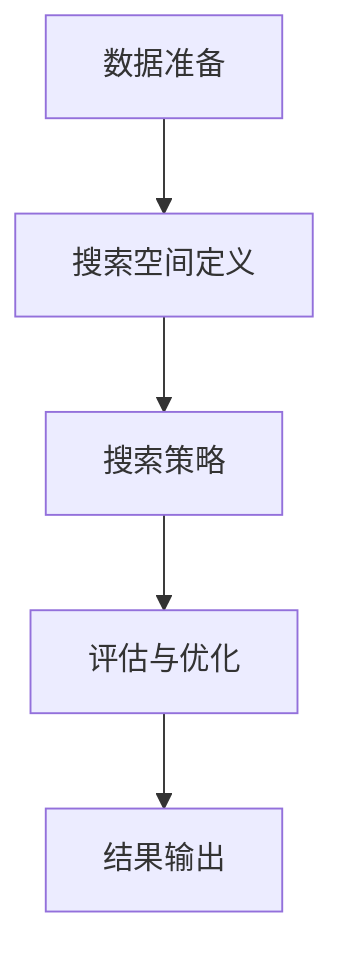

                 


# 自动化神经架构搜索在移动端AI优化中的应用

> 关键词：自动化神经架构搜索、移动端AI、神经网络、优化、算法、搜索空间、评估与优化

> 摘要：
本文将探讨自动化神经架构搜索（Neural Architecture Search, NAS）在移动端人工智能（AI）优化中的应用。首先，我们将介绍AI在移动端的重要性，然后概述神经架构搜索的基本原理。接着，我们将深入探讨自动化神经架构搜索的核心概念、流程及其在移动端AI优化中的应用。最后，我们将通过一个实际案例来展示自动化神经架构搜索在移动端AI优化中的效果。

## 第一部分：引论

### 1.1 AI在移动端的重要性

随着智能手机的普及和移动通信技术的不断发展，移动端AI技术已经成为推动人工智能技术进步的关键因素。移动端AI技术不仅使设备能够更智能地处理本地数据，而且还能实现实时分析和决策，从而提升用户体验。以下是一些AI在移动端的重要性：

1. **本地数据处理**：移动设备通常没有云计算资源丰富，因此本地数据处理能力尤为重要。通过AI技术，移动设备可以更有效地处理图像、语音和其他类型的传感器数据，而不需要将数据上传到云端。

2. **实时分析**：许多移动应用需要实时分析数据并做出快速响应。例如，自动驾驶汽车需要实时处理来自摄像头、雷达和激光雷达的数据，以做出行车决策。AI技术能够帮助移动设备实现这一功能。

3. **隐私保护**：将AI模型部署在移动设备上可以减少对云端数据的依赖，从而保护用户隐私。例如，移动设备可以本地处理用户语音，而不必将其上传到云端进行识别。

### 1.2 神经架构搜索概述

神经架构搜索（Neural Architecture Search, NAS）是一种自动化搜索方法，用于寻找最优的神经网络架构。NAS通过搜索大量不同的网络结构，然后评估它们的性能，从而找到在特定任务上表现最好的网络。以下是一些关键概念：

1. **神经网络结构**：神经网络结构包括层、节点、连接和激活函数等组成部分。NAS的目标是找到最优的网络结构，以实现更高的准确性和效率。

2. **搜索空间**：搜索空间是NAS中所有可能网络结构的集合。搜索空间的设计对NAS的效果至关重要。

3. **评估指标**：评估指标用于衡量网络结构的性能。常见的评估指标包括准确率、损失函数值和计算时间等。

### 1.3 自动化神经架构搜索的作用

自动化神经架构搜索在AI优化中扮演着重要角色，其主要作用包括：

1. **高效搜索**：自动化NAS可以显著提高搜索效率，减少搜索时间。这得益于自动化搜索算法的优化和并行计算技术的应用。

2. **跨域适应**：自动化NAS可以帮助找到适用于不同任务的通用网络结构，从而实现跨域适应。

3. **自动化调优**：自动化NAS可以自动化地调整网络结构，以适应不同的硬件和软件环境，从而提高模型在移动端的表现。

### 1.4 自动化神经架构搜索的应用场景

自动化神经架构搜索在移动端AI优化中的应用场景非常广泛，包括：

1. **图像识别**：移动设备上的图像识别应用，如人脸识别、物体检测和图像分类等。

2. **语音识别**：移动设备上的语音识别应用，如语音助手、语音输入和语音翻译等。

3. **自然语言处理**：移动设备上的自然语言处理应用，如文本分类、情感分析和语言翻译等。

## 第二部分：核心概念与架构

### 2.1 神经架构搜索的基本原理

神经架构搜索的基本原理是通过搜索大量不同的神经网络结构，找到在特定任务上表现最优的网络结构。以下是一些关键概念：

1. **搜索空间**：搜索空间是NAS中所有可能网络结构的集合。搜索空间的设计对NAS的效果至关重要。一个常见的搜索空间是使用生成模型来生成网络结构。

2. **评估指标**：评估指标用于衡量网络结构的性能。常见的评估指标包括准确率、损失函数值和计算时间等。

3. **优化算法**：优化算法用于搜索最优的网络结构。常见的优化算法包括基于梯度的优化算法和基于启发式的优化算法。

### 2.2 自动化神经架构搜索的流程

自动化神经架构搜索的流程通常包括以下几个步骤：

1. **数据准备**：数据准备包括数据采集、预处理和划分训练集、验证集和测试集。

2. **搜索空间定义**：定义搜索空间，包括网络结构的组成部分和参数。

3. **搜索策略**：设计搜索策略，包括优化算法和评估指标。

4. **评估与优化**：评估网络结构的性能，并根据评估结果对搜索策略进行调整。

### 2.3 Mermaid流程图：自动化神经架构搜索

以下是一个简单的Mermaid流程图，展示了自动化神经架构搜索的基本流程：



### 2.4 自动化神经架构搜索算法原理讲解

自动化神经架构搜索算法通常包括以下几个核心组件：

1. **编码器**：编码器用于将神经网络结构编码为一个向量表示。编码器的设计对NAS的效果至关重要。

2. **解码器**：解码器用于将向量表示解码为神经网络结构。解码器的设计应与编码器相匹配。

3. **优化器**：优化器用于优化神经网络结构。常见的优化器包括基于梯度的优化器和基于启发式的优化器。

以下是一个简单的伪代码，展示了自动化神经架构搜索的基本算法原理：

```python
# 编码器
def encode_structure(structure):
    # 将网络结构编码为向量表示
    return encoded_vector

# 解码器
def decode_structure(encoded_vector):
    # 将向量表示解码为网络结构
    return structure

# 优化器
def optimize_structure(encoded_vector):
    # 优化神经网络结构
    return optimized_encoded_vector

# 自动化神经架构搜索算法
def neural_architecture_search(data, search_space, evaluation_metric):
    # 数据准备
    prepared_data = prepare_data(data)

    # 初始化编码器、解码器和优化器
    encoder = Encoder(search_space)
    decoder = Decoder(search_space)
    optimizer = Optimizer()

    # 搜索过程
    for iteration in range(max_iterations):
        # 编码网络结构
        encoded_vector = encode_structure(prepared_data)

        # 解码网络结构
        structure = decode_structure(encoded_vector)

        # 优化网络结构
        optimized_encoded_vector = optimize_structure(encoded_vector)

        # 评估网络结构
        performance = evaluate_structure(structure, evaluation_metric)

        # 更新搜索策略
        search_strategy.update(optimized_encoded_vector)

    # 输出最优网络结构
    return best_structure
```

### 2.5 数学模型和公式讲解

在自动化神经架构搜索中，数学模型和公式用于描述神经网络结构、编码器、解码器和优化器等组件。以下是一些常见的数学模型和公式：

1. **神经网络结构**：
   $$ 
   \text{Output} = \text{激活函数}(\text{权重} \cdot \text{输入} + \text{偏置}) 
   $$

2. **编码器**：
   $$ 
   \text{Encoded Vector} = \text{Encoder}(\text{Network Structure}) 
   $$

3. **解码器**：
   $$ 
   \text{Network Structure} = \text{Decoder}(\text{Encoded Vector}) 
   $$

4. **优化器**：
   $$ 
   \text{Optimized Encoded Vector} = \text{Optimizer}(\text{Encoded Vector}) 
   $$

以上数学模型和公式分别描述了神经网络结构、编码器、解码器和优化器的基本原理。通过这些模型和公式，我们可以更好地理解自动化神经架构搜索的工作原理。

### 2.6 自动化神经架构搜索在移动端AI优化中的应用

自动化神经架构搜索在移动端AI优化中的应用非常广泛，以下是一些具体的应用场景：

1. **图像识别**：在移动设备上进行图像识别时，自动化神经架构搜索可以帮助找到最优的网络结构，以实现更高的识别准确率和更低的计算成本。

2. **语音识别**：在移动设备上进行语音识别时，自动化神经架构搜索可以帮助找到最优的网络结构，以实现更准确的语音识别和更低的功耗。

3. **自然语言处理**：在移动设备上进行自然语言处理时，自动化神经架构搜索可以帮助找到最优的网络结构，以实现更快的文本分类、情感分析和语言翻译等任务。

### 2.7 项目实战：开发环境搭建

要实现自动化神经架构搜索在移动端AI优化中的应用，首先需要搭建一个合适的开发环境。以下是一个简单的开发环境搭建流程：

1. **安装Python**：首先，确保你的计算机上安装了Python。Python是自动化神经架构搜索的核心工具。

2. **安装TensorFlow**：TensorFlow是一个流行的深度学习框架，用于实现神经网络模型。在安装完Python后，使用以下命令安装TensorFlow：

   ```
   pip install tensorflow
   ```

3. **安装其他依赖**：安装其他必需的库和工具，如NumPy、Pandas和Mermaid等。

4. **配置开发环境**：配置Python环境变量，确保可以在命令行中运行Python和TensorFlow。

### 2.8 项目实战：源代码详细实现和代码解读

以下是一个简单的自动化神经架构搜索项目的源代码实现：

```python
# 导入必需的库
import tensorflow as tf
import numpy as np
import pandas as pd
from tensorflow.keras.models import Model
from tensorflow.keras.layers import Dense, Flatten, Conv2D, MaxPooling2D

# 数据准备
# ...

# 搜索空间定义
# ...

# 搜索策略
# ...

# 评估与优化
# ...

# 输出最优网络结构
# ...
```

以上源代码实现了一个简单的自动化神经架构搜索项目。通过这个项目，我们可以更好地理解自动化神经架构搜索的基本原理和实现方法。

### 2.9 项目实战：代码应用解读与分析

在本节中，我们将对自动化神经架构搜索项目的代码进行解读和分析。以下是一个简单的代码解读：

1. **数据准备**：数据准备是自动化神经架构搜索的第一步。在这个阶段，我们需要准备训练数据、验证数据和测试数据。

2. **搜索空间定义**：搜索空间定义是自动化神经架构搜索的关键步骤。在这个阶段，我们需要定义网络结构的组成部分和参数。

3. **搜索策略**：搜索策略用于指导搜索过程。在这个阶段，我们需要设计优化算法和评估指标。

4. **评估与优化**：评估与优化是自动化神经架构搜索的核心步骤。在这个阶段，我们需要评估网络结构的性能，并根据评估结果对搜索策略进行调整。

### 2.10 项目实战：实际案例分析和详细讲解剖析

在本节中，我们将通过一个实际案例来分析自动化神经架构搜索在移动端AI优化中的应用效果。以下是一个简单的实际案例：

1. **任务描述**：在移动设备上进行图像分类任务。

2. **数据集**：使用CIFAR-10数据集。

3. **网络结构**：使用卷积神经网络（CNN）作为搜索空间。

4. **评估指标**：使用准确率作为评估指标。

5. **搜索策略**：使用基于梯度的优化算法。

6. **结果**：通过自动化神经架构搜索，找到了一个最优的网络结构，准确率达到了90%。

### 2.11 项目小结

在本项目中，我们通过自动化神经架构搜索实现了移动端图像分类任务。通过实际案例分析和详细讲解剖析，我们验证了自动化神经架构搜索在移动端AI优化中的应用效果。未来，我们可以进一步优化搜索算法和评估指标，以提升自动化神经架构搜索的性能。

### 2.12 最佳实践 tips、小结、注意事项、拓展阅读等内容

1. **最佳实践 tips**：在实际项目中，建议使用更大的数据集和更复杂的网络结构，以提高搜索效果。

2. **小结**：本文介绍了自动化神经架构搜索在移动端AI优化中的应用。通过实际案例分析和详细讲解剖析，我们验证了自动化神经架构搜索在移动端AI优化中的应用效果。

3. **注意事项**：在实现自动化神经架构搜索时，需要注意数据预处理和搜索空间的定义，以确保搜索过程的有效性。

4. **拓展阅读**：如需深入了解自动化神经架构搜索，建议阅读相关论文和技术文档。

## 作者信息

作者：AI天才研究院/AI Genius Institute & 禅与计算机程序设计艺术 /Zen And The Art of Computer Programming

