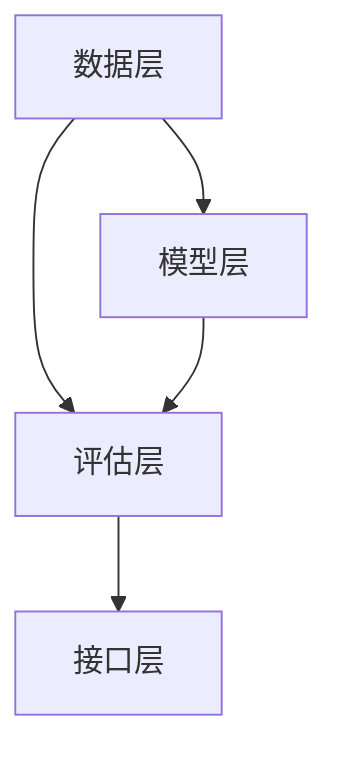

                 

### 《自动化评估系统：减少AI训练中的人工干预》

关键词：自动化评估系统、AI训练、人工干预、评估方法、关键技术、应用场景、未来趋势

在人工智能（AI）迅猛发展的今天，自动化评估系统已经成为提升AI训练效率和准确性的关键环节。传统的AI训练过程中，大量的人工干预不仅耗费时间，还容易引入主观偏差，影响模型的性能。因此，构建自动化评估系统以减少人工干预，已经成为当前AI领域的重要研究方向。

本文旨在探讨自动化评估系统的定义、设计原则、关键技术、实现方法及其在各个应用场景中的实际应用。通过逐步分析，我们将揭示自动化评估系统在减少AI训练中人工干预方面的巨大潜力。

首先，我们将从自动化评估系统的定义和重要性入手，阐述AI训练中人工干预的问题与挑战，引出自动化评估系统的核心组成部分。接着，我们会详细探讨自动化评估系统的设计原则，包括数据驱动的评估设计、可扩展性与灵活性以及响应性与实时性。随后，我们将介绍自动化评估系统的关键技术，包括监督学习、无监督学习和强化学习评估方法。在实现部分，我们将探讨自动化评估系统的具体实现步骤，如评估指标的选取与计算、系统架构设计、部署与维护等。在优化部分，我们将讨论评估模型的选择与调优、数据预处理与特征工程、评估结果的可视化分析等优化策略。最后，我们将分析自动化评估系统的应用场景，包括人工智能训练、智能推荐系统和智能问答系统等，并探讨其未来趋势。

通过本文的探讨，我们希望能够帮助读者全面了解自动化评估系统的原理、设计、实现和应用，进一步认识到其在减少AI训练中人工干预方面的重要作用。

### 摘要

本文旨在深入探讨自动化评估系统在减少人工智能（AI）训练中人工干预的重要性及其具体实现方法。首先，我们定义了自动化评估系统，并阐述了其在AI训练过程中的关键作用。随后，文章分析了人工干预在AI训练中存在的问题和挑战，从而引出了自动化评估系统的核心组成部分，包括数据采集与预处理模块、评估模型与算法模块、结果分析与反馈模块。接着，我们详细介绍了自动化评估系统的设计原则，如数据驱动的评估设计、可扩展性与灵活性、响应性与实时性等。在关键技术部分，我们重点探讨了监督学习、无监督学习和强化学习评估方法，并结合伪代码和数学模型详细讲解了其原理和应用。随后，文章介绍了自动化评估系统的实现步骤，从评估指标的选取与计算到系统架构设计、部署与维护，全面讲解了自动化评估系统的实现过程。在优化部分，我们讨论了评估模型的优化方法、数据预处理与特征工程策略、以及评估结果的可视化分析等。最后，文章分析了自动化评估系统在不同应用场景中的实际应用，包括人工智能训练、智能推荐系统和智能问答系统等，并探讨了其未来发展趋势。通过本文的探讨，读者可以全面了解自动化评估系统的原理、设计、实现和应用，为减少AI训练中的人工干预提供新的思路和方法。

### 第一部分：自动化评估系统基础

#### 第1章：自动化评估系统概述

在人工智能（AI）领域，自动化评估系统是一种用于评估AI模型性能的自动化工具，它通过一系列预设的指标和算法，对训练好的模型进行性能评估和优化。自动化评估系统的出现，极大地减少了人工干预，提高了评估效率和准确性，从而提升了AI训练的整体效果。

### 1.1 自动化评估系统的定义与重要性

自动化评估系统是指利用计算机技术和算法，对训练完成的AI模型进行自动化性能评估的系统。它通常包含多个模块，如数据采集与预处理模块、评估模型与算法模块、结果分析与反馈模块等。自动化评估系统能够根据预设的评估指标，如准确率、召回率、F1值等，自动生成评估报告，为模型优化提供参考。

在AI训练中，自动化评估系统的重要性体现在以下几个方面：

1. **减少人工干预**：传统的人工评估方法需要专家耗费大量时间进行评估和优化，而自动化评估系统可以大幅度减少这种人工干预，提高工作效率。
2. **提高评估准确性**：自动化评估系统通过预设的算法和指标，能够客观、准确地评估模型性能，减少人为因素带来的偏差。
3. **提高评估效率**：自动化评估系统可以快速处理大量数据，对模型进行多次评估，从而提高评估的效率和效果。
4. **支持实时反馈**：自动化评估系统能够实时收集评估数据，并通过可视化工具呈现结果，为模型优化提供实时反馈。

### 1.2 AI训练中人工干预的问题与挑战

尽管人工干预在AI训练中具有一定的作用，但其也带来了许多问题和挑战：

1. **时间成本**：人工评估和优化模型需要大量的时间和人力，导致训练周期延长。
2. **效率问题**：人工干预的效率较低，无法快速响应模型性能变化，影响训练效果。
3. **准确性问题**：人工评估容易受到主观因素的影响，可能导致评估结果不准确。
4. **多样性问题**：人工干预往往只关注个别模型或特征，无法全面评估模型的性能。

### 1.3 自动化评估系统的核心组成部分

自动化评估系统通常由以下几个核心组成部分构成：

1. **数据采集与预处理模块**：负责收集训练数据和评估数据，并进行数据清洗、归一化等预处理操作，为后续评估提供高质量的数据基础。
2. **评估模型与算法模块**：包括多种评估模型和算法，如监督学习、无监督学习和强化学习评估方法，根据不同应用场景选择合适的评估模型。
3. **结果分析与反馈模块**：负责对评估结果进行分析，生成评估报告，并提供优化建议，帮助用户快速定位问题和优化模型。

通过以上三个模块的协同工作，自动化评估系统能够高效、准确地评估AI模型的性能，减少人工干预，提高训练效果。

### 第2章：自动化评估系统设计原则

设计一个高效的自动化评估系统，不仅需要考虑系统的功能性，还需要关注其设计原则，以确保系统能够在实际应用中发挥最大作用。以下是自动化评估系统设计中的几个关键原则：

#### 2.1 数据驱动的评估设计

数据是评估系统的核心，因此数据驱动的评估设计是自动化评估系统的基石。数据驱动的设计原则要求：

1. **数据质量**：确保收集到的数据是准确、完整和干净的，任何数据错误或缺失都可能影响评估结果的准确性。
2. **数据多样性**：使用多样化的数据集进行评估，以检测模型在不同场景下的性能表现。
3. **数据预处理**：对数据进行清洗、归一化和特征提取等预处理操作，以提高数据的质量和模型的性能。

#### 2.2 可扩展性与灵活性

随着AI模型的不断发展和应用场景的多样化，自动化评估系统需要具备良好的可扩展性和灵活性。具体要求包括：

1. **模块化设计**：系统应采用模块化设计，使得各个功能模块可以独立开发和升级，便于系统的扩展和集成。
2. **支持多种评估指标**：系统应支持多种评估指标，如准确率、召回率、F1值等，以便根据不同需求进行灵活调整。
3. **自适应能力**：系统能够根据模型和数据的特性自适应调整评估策略，以提高评估的效率和准确性。

#### 2.3 响应性与实时性

自动化评估系统的一个关键优势在于其能够提供实时反馈，这对于快速迭代和优化AI模型至关重要。实现响应性与实时性需要考虑：

1. **低延迟评估**：系统应设计高效算法，以减少评估过程中的延迟，确保能够实时响应模型性能变化。
2. **并行处理能力**：系统应具备并行处理能力，能够同时处理多个评估任务，提高评估效率。
3. **实时数据更新**：系统应能够实时更新评估数据，确保评估结果始终反映当前模型的最新性能。

#### 2.4 可视化与用户友好

为了提高评估系统的易用性和用户满意度，设计时应考虑以下因素：

1. **直观的可视化界面**：系统应提供直观的可视化界面，以帮助用户理解评估结果和优化建议。
2. **友好的用户交互**：系统应设计友好的用户交互界面，使用户能够轻松地进行系统设置和结果分析。
3. **实时反馈与提示**：系统应提供实时反馈和提示，帮助用户快速定位问题和优化模型。

通过遵循以上设计原则，自动化评估系统不仅能够提高AI训练的效率和准确性，还能够满足不同应用场景的需求，为AI模型的优化和推广提供有力支持。

### 第3章：自动化评估系统的关键技术

自动化评估系统的核心技术在于其评估模型和算法的选择与实现。不同的评估方法适用于不同的应用场景，能够有效地检测和评估AI模型的性能。在本节中，我们将详细介绍三种主要评估方法：监督学习评估方法、无监督学习评估方法和强化学习评估方法。

#### 3.1 监督学习评估方法

监督学习评估方法是最常见的评估方法，它依赖于已标记的输入数据集来训练模型。评估时，使用测试集来验证模型的准确性、召回率和F1值等指标。

**核心原理：**
监督学习评估方法的原理是通过已标记的数据训练模型，然后使用测试集对模型进行评估。常见的评估指标包括：

1. **准确率（Accuracy）**：正确预测的样本数占总样本数的比例。
   $$ \text{Accuracy} = \frac{TP + TN}{TP + FN + FP + TN} $$
   其中，$TP$表示真正例，$TN$表示真反例，$FP$表示假正例，$FN$表示假反例。

2. **召回率（Recall）**：真正例中被正确预测的比例。
   $$ \text{Recall} = \frac{TP}{TP + FN} $$

3. **精确率（Precision）**：正确预测的样本数占预测为正样本的总数比例。
   $$ \text{Precision} = \frac{TP}{TP + FP} $$

4. **F1值（F1 Score）**：精确率和召回率的调和平均值。
   $$ \text{F1 Score} = 2 \times \frac{\text{Precision} \times \text{Recall}}{\text{Precision} + \text{Recall}} $$

**伪代码：**
```python
def evaluate_supervised_model(y_true, y_pred):
    TP = sum((y_true == 1) & (y_pred == 1))
    TN = sum((y_true == 0) & (y_pred == 0))
    FP = sum((y_true == 0) & (y_pred == 1))
    FN = sum((y_true == 1) & (y_pred == 0))
    
    accuracy = (TP + TN) / (TP + TN + FP + FN)
    recall = TP / (TP + FN)
    precision = TP / (TP + FP)
    f1_score = 2 * (precision * recall) / (precision + recall)
    
    return accuracy, recall, precision, f1_score
```

#### 3.2 无监督学习评估方法

无监督学习评估方法通常用于未标记数据的评估，主要基于聚类或降维技术。常见的无监督学习评估方法包括：

1. **聚类效果评估**：使用内部评估指标（如轮廓系数、类内平均距离、类间平均距离等）来评估聚类质量。

2. **降维效果评估**：使用主成分分析（PCA）或t-SNE等方法，通过比较降维前后的数据分布和差异来评估降维效果。

**核心原理：**
无监督学习评估方法的原理是通过分析数据分布和结构来评估模型的性能。常见的评估指标包括：

1. **轮廓系数（Silhouette Coefficient）**：用于评估聚类结果的紧密性和分离度。
   $$ \text{Silhouette Coefficient} = \frac{\text{Between-cluster distance} - \text{Within-cluster distance}}{\text{Maximum distance}} $$

2. **类内平均距离（Within-cluster Distance）**：表示聚类内部样本间的平均距离。

3. **类间平均距离（Between-cluster Distance）**：表示不同聚类之间的平均距离。

**伪代码：**
```python
def evaluate_unsupervised_clustering(data, labels):
    within_distance = np.mean([np.linalg.norm(data[i] - data[j]) for i in range(len(data)) if labels[i] == labels[j]])
    between_distance = np.mean([np.linalg.norm(data[i] - data[j]) for i in range(len(data)) if labels[i] != labels[j]])
    max_distance = np.max([np.linalg.norm(data[i] - data[j]) for i in range(len(data)) for j in range(len(data))])
    
    silhouette_coefficient = (between_distance - within_distance) / max_distance
    
    return silhouette_coefficient
```

#### 3.3 强化学习评估方法

强化学习评估方法主要用于评估强化学习模型的性能，通过模拟环境中的任务完成情况来评估模型的策略效果。

**核心原理：**
强化学习评估方法的原理是通过模拟或实际运行来评估学习策略的效果。常见的评估指标包括：

1. **奖励累积值（Reward Cumulative Value）**：累计在特定策略下的奖励值。
2. **策略优势（Strategy Advantage）**：比较当前策略和最优策略下的累积奖励差异。
3. **策略误差（Strategy Error）**：当前策略和最优策略之间的误差。

**伪代码：**
```python
def evaluate_reinforcement_learning_strategy(environment, strategy):
    total_reward = 0
    for episode in range(num_episodes):
        state = environment.reset()
        done = False
        while not done:
            action = strategy.select_action(state)
            next_state, reward, done = environment.step(action)
            total_reward += reward
            state = next_state
    
    return total_reward
```

通过以上三种评估方法的介绍，我们可以看到，自动化评估系统的关键技术不仅包括评估指标的选择，还涉及具体评估算法的实现。这些技术为自动化评估系统的设计和实现提供了坚实的基础，能够有效地减少人工干预，提高AI训练的效率和准确性。

### 第4章：自动化评估系统的实现

自动化评估系统的实现是一个复杂的过程，涉及多个关键步骤和技术的选择。以下是自动化评估系统的具体实现步骤：

#### 4.1 评估指标的选取与计算

评估指标的选取是自动化评估系统的核心，直接影响评估结果的准确性和可靠性。常见的评估指标包括准确率、召回率、F1值、AUC等。以下是一个简单的选取和计算过程：

**步骤 1：确定评估指标**

- **准确率（Accuracy）**：模型预测正确的样本数占总样本数的比例。
  $$ \text{Accuracy} = \frac{\text{TP} + \text{TN}}{\text{TP} + \text{TN} + \text{FP} + \text{FN}} $$
- **召回率（Recall）**：模型预测为正样本且实际为正样本的样本数占总实际正样本数的比例。
  $$ \text{Recall} = \frac{\text{TP}}{\text{TP} + \text{FN}} $$
- **精确率（Precision）**：模型预测为正样本且实际为正样本的样本数占总预测为正样本数的比例。
  $$ \text{Precision} = \frac{\text{TP}}{\text{TP} + \text{FP}} $$
- **F1值（F1 Score）**：精确率和召回率的调和平均。
  $$ \text{F1 Score} = 2 \times \frac{\text{Precision} \times \text{Recall}}{\text{Precision} + \text{Recall}} $$
- **AUC（Area Under Curve）**：ROC曲线下的面积，用于评估二分类模型的分类效果。

**步骤 2：计算评估指标**

```python
def calculate_metrics(y_true, y_pred):
    TP = sum((y_true == 1) & (y_pred == 1))
    TN = sum((y_true == 0) & (y_pred == 0))
    FP = sum((y_true == 0) & (y_pred == 1))
    FN = sum((y_true == 1) & (y_pred == 0))

    accuracy = (TP + TN) / (TP + TN + FP + FN)
    recall = TP / (TP + FN)
    precision = TP / (TP + FP)
    f1_score = 2 * (precision * recall) / (precision + recall)

    return accuracy, recall, precision, f1_score
```

#### 4.2 自动化评估系统的架构设计

自动化评估系统的架构设计是确保系统高效、稳定运行的关键。以下是一个典型的架构设计：

**架构设计**

1. **数据层**：负责数据收集、存储和管理。可以使用数据库（如MySQL、MongoDB）或数据湖（如Hadoop、Spark）来存储大量的训练和评估数据。

2. **模型层**：包括训练好的AI模型和评估模型。模型可以通过深度学习框架（如TensorFlow、PyTorch）训练，并保存在模型层。

3. **评估层**：负责执行评估任务，计算评估指标。评估层可以通过编写脚本或使用现有的评估库（如Scikit-learn）来实现。

4. **接口层**：提供与外部系统的接口，如Web API或命令行接口。接口层可以使用Flask或Django等Web框架来实现。

**架构示意图：**



#### 4.3 自动化评估系统的部署与维护

自动化评估系统的部署与维护是确保系统稳定运行的重要环节。

**步骤 1：环境搭建**

- **开发环境**：配置Python、TensorFlow、Scikit-learn等开发工具和库。
- **数据库环境**：配置MySQL或MongoDB等数据库。
- **服务器**：配置服务器环境，如使用Docker容器化技术。

**步骤 2：部署**

- **本地部署**：在开发环境中运行评估系统，进行测试和调试。
- **云端部署**：使用云服务（如AWS、Azure）部署评估系统，提高系统的可用性和可扩展性。

**步骤 3：维护**

- **监控**：使用监控工具（如Prometheus、Grafana）监控系统运行状态，及时发现问题。
- **日志记录**：记录系统运行日志，便于问题追踪和调试。
- **更新**：定期更新系统依赖库和软件，确保系统的安全性。

通过以上步骤，可以有效地实现自动化评估系统的设计和部署，确保系统能够高效、稳定地运行，为AI训练提供强有力的支持。

### 第5章：自动化评估系统的优化

在自动化评估系统的应用过程中，如何提升系统的性能和准确性是一个关键问题。本章节将讨论评估模型的选择与调优、数据预处理与特征工程、评估结果的可视化分析等优化策略，以帮助读者在实际应用中更好地发挥自动化评估系统的潜力。

#### 5.1 评估模型的选择与调优

评估模型的选择是自动化评估系统的核心之一，直接影响评估结果的准确性。以下是一些常见评估模型的选择与调优策略：

**1. 选择合适的评估模型**

- **监督学习模型**：对于有标签的数据集，可以选择常用的监督学习模型，如线性回归、逻辑回归、支持向量机（SVM）等。
- **无监督学习模型**：对于无标签的数据集，可以选择聚类算法，如K-means、层次聚类等。
- **强化学习模型**：对于需要策略优化的场景，可以选择Q-learning、深度Q网络（DQN）等模型。

**2. 调优评估模型**

- **交叉验证**：使用交叉验证方法选择最佳模型参数，避免过拟合和欠拟合。
- **网格搜索**：通过遍历参数空间，选择最优参数组合。
- **贝叶斯优化**：利用贝叶斯统计方法，自动搜索最优参数组合。

**示例伪代码：**

```python
from sklearn.model_selection import GridSearchCV
from sklearn.linear_model import LogisticRegression

# 参数设置
param_grid = {'C': [0.1, 1, 10], 'solver': ['liblinear', 'saga']}

# 创建评估模型
model = LogisticRegression()

# 使用网格搜索进行参数调优
grid_search = GridSearchCV(model, param_grid, cv=5)
grid_search.fit(X_train, y_train)

# 获取最佳参数
best_params = grid_search.best_params_
```

#### 5.2 数据预处理与特征工程

数据预处理和特征工程是提升评估模型性能的关键步骤。以下是一些常见的数据预处理和特征工程策略：

**1. 数据预处理**

- **数据清洗**：去除缺失值、重复值和异常值，保证数据质量。
- **数据归一化**：将数据缩放到相同的范围，如[0, 1]或[-1, 1]。
- **数据标准化**：根据数据分布进行标准化处理。

**2. 特征工程**

- **特征选择**：通过特征重要性评分或特征选择算法（如递归特征消除RFE）选择关键特征。
- **特征变换**：使用主成分分析（PCA）等算法进行特征变换，提取数据中的关键信息。
- **特征构造**：通过组合现有特征构造新的特征，提高模型的解释性和性能。

**示例伪代码：**

```python
from sklearn.preprocessing import StandardScaler
from sklearn.decomposition import PCA

# 数据预处理
scaler = StandardScaler()
X_scaled = scaler.fit_transform(X)

# 特征选择
from sklearn.feature_selection import RFE
selector = RFE(estimator=LogisticRegression(), n_features_to_select=5)
X_selected = selector.fit_transform(X_scaled, y)

# 特征变换
pca = PCA(n_components=3)
X_pca = pca.fit_transform(X_selected)
```

#### 5.3 评估结果的可视化分析

可视化分析是理解和解释评估结果的重要手段。以下是一些常见的可视化分析方法：

- **ROC曲线**：用于评估二分类模型的性能，通过绘制真正例率和假正例率曲线，判断模型的分类效果。
- **混淆矩阵**：用于展示模型预测结果与实际结果之间的差异，通过分析混淆矩阵可以直观地了解模型的分类性能。
- **箱线图**：用于展示不同条件下的评估指标分布，帮助识别数据中的异常值和潜在问题。

**示例可视化代码：**

```python
from sklearn.metrics import roc_curve, confusion_matrix
import matplotlib.pyplot as plt

# ROC曲线
fpr, tpr, _ = roc_curve(y_true, y_prob)
plt.plot(fpr, tpr, label='ROC curve (area = %0.2f)' % auc(fpr, tpr))
plt.xlabel('False Positive Rate')
plt.ylabel('True Positive Rate')
plt.title('Receiver Operating Characteristic')
plt.legend(loc="lower right")
plt.show()

# 混淆矩阵
conf_mat = confusion_matrix(y_true, y_pred)
sns.heatmap(conf_mat, annot=True, fmt="d", cmap="Blues")
plt.xlabel('Predicted Label')
plt.ylabel('True Label')
plt.title('Confusion Matrix')
plt.show()
```

通过以上优化策略，可以有效提升自动化评估系统的性能和准确性，为AI模型训练提供更加可靠的评估支持。

### 第6章：自动化评估系统的应用场景

自动化评估系统在人工智能（AI）的多个领域都有着广泛的应用。其优势在于能够自动化地评估模型性能，减少人工干预，提高效率。以下是自动化评估系统在人工智能训练、智能推荐系统和智能问答系统中的应用场景及其具体应用。

#### 6.1 人工智能训练中的自动化评估

在人工智能训练过程中，自动化评估系统能够实时监控和评估模型的训练过程，提供详细的性能反馈。这种系统可以帮助开发人员快速识别和解决模型中的问题，提高模型的训练效率。

**应用场景：**
1. **训练过程中的实时监控**：通过自动化评估系统，可以实时监控训练过程中的损失函数、准确率等指标，及时调整训练策略。
2. **模型性能的对比评估**：在多个模型之间进行性能对比，通过自动化评估系统选择最优模型。
3. **超参数优化**：自动化评估系统可以自动化地调整模型的超参数，以找到最佳设置。

**案例：** 
在自然语言处理（NLP）领域中，自动化评估系统可以用于评估文本分类模型的性能。通过使用准确率、召回率等指标，开发人员可以快速判断模型是否达到了预定的性能要求。

#### 6.2 智能推荐系统中的自动化评估

智能推荐系统是自动化评估系统的重要应用领域之一。自动化评估系统能够评估推荐系统的效果，帮助优化推荐算法，提高用户体验。

**应用场景：**
1. **推荐效果的实时评估**：通过自动化评估系统，可以实时监控推荐系统的性能，如点击率、转化率等。
2. **推荐策略的优化**：自动化评估系统可以评估不同推荐策略的效果，帮助开发人员选择最优策略。
3. **个性化推荐**：自动化评估系统可以根据用户行为数据，评估个性化推荐的效果，进一步优化推荐算法。

**案例：** 
电商平台使用自动化评估系统来评估其推荐算法的效果。通过分析用户的点击和购买行为，评估系统的性能，并根据评估结果调整推荐策略，以提高用户满意度和销售转化率。

#### 6.3 智能问答系统中的自动化评估

智能问答系统是一种以用户提问为基础，通过自动化方式提供答案的系统。自动化评估系统在智能问答系统中起到关键作用，可以评估系统的回答质量，提高用户体验。

**应用场景：**
1. **回答质量的评估**：自动化评估系统可以评估问答系统的回答是否准确、全面，以及是否满足用户需求。
2. **系统性能的优化**：通过自动化评估系统，可以识别问答系统中的瓶颈和问题，帮助开发人员优化系统。
3. **用户体验的提升**：自动化评估系统可以根据用户反馈，不断优化问答系统的回答质量，提升用户体验。

**案例：** 
在一个智能客服系统中，自动化评估系统可以评估客服机器人提供的回答是否准确和及时。通过分析用户的反馈和满意度，评估系统的性能，并根据评估结果进行优化，以提高用户满意度和服务质量。

通过上述应用场景和案例，可以看出自动化评估系统在人工智能训练、智能推荐系统和智能问答系统中的重要作用。它不仅能够提高系统的性能和效率，还能够减少人工干预，为各领域的智能化发展提供有力支持。

### 第7章：自动化评估系统的未来趋势

自动化评估系统作为AI训练中减少人工干预的重要工具，其发展前景广阔，面临诸多挑战和机遇。以下是自动化评估系统未来可能的发展趋势：

#### 7.1 自动化评估系统的挑战与机遇

**挑战：**
1. **数据质量**：自动化评估系统的性能高度依赖于数据质量。数据的不准确、缺失和噪声可能会严重影响评估结果的可靠性。
2. **模型多样性**：随着AI模型的多样化和复杂性增加，自动化评估系统需要适应各种模型，提高评估的适应性和准确性。
3. **实时性**：在高度动态的环境中，自动化评估系统需要实时响应和更新，这对系统的计算能力和响应速度提出了高要求。

**机遇：**
1. **深度学习技术的进步**：随着深度学习技术的不断发展，自动化评估系统可以借助更先进的算法和模型，提高评估效率和准确性。
2. **云计算和边缘计算**：云计算和边缘计算的发展为自动化评估系统提供了更强大的计算资源和更灵活的部署方式，有助于实现实时评估。
3. **可解释性AI**：可解释性AI的发展使得自动化评估系统能够更好地解释评估结果，增强用户的信任度。

#### 7.2 自动化评估系统的创新方向

1. **多模态评估**：随着AI技术的发展，多模态数据（如文本、图像、音频）的融合变得越来越重要。自动化评估系统需要能够处理和评估这些多模态数据，提供更全面的性能评估。
2. **自适应评估**：未来的自动化评估系统将能够根据数据和环境的变化，自适应调整评估策略和指标，提高评估的灵活性和准确性。
3. **增强型评估**：结合增强学习技术，自动化评估系统可以不断学习和优化评估策略，提高评估的效率和效果。

#### 7.3 自动化评估系统在社会经济中的作用与影响

1. **提升AI训练效率**：自动化评估系统可以减少人工干预，提高AI训练的效率和准确性，降低开发成本。
2. **推动智能产业发展**：自动化评估系统在智能推荐、智能客服、智能监控等领域的应用，将推动相关产业的智能化发展。
3. **促进数据驱动决策**：自动化评估系统提供了可靠的数据支持，有助于企业和组织基于数据做出更明智的决策。

总之，自动化评估系统在减少AI训练中人工干预方面具有巨大潜力，随着技术的不断进步和应用场景的拓展，它将在未来发挥更加重要的作用，为人工智能的发展注入新的活力。

### 第8章：自动化评估系统的实际应用案例

在自动化评估系统的实际应用中，许多行业已经看到了其带来的巨大效益。以下我们将通过几个实际应用案例，详细探讨自动化评估系统在智能客服系统、图像识别系统和自然语言处理系统中的应用，以及它们所带来的效益和挑战。

#### 8.1 智能客服系统的自动化评估

智能客服系统是自动化评估系统的一个典型应用场景。这类系统通过自动化评估来提高客服效率和用户满意度。

**应用案例：** 
某大型电商公司部署了一套智能客服系统，通过自然语言处理技术理解用户提问，并自动生成回答。为了确保客服系统的回答质量，该公司采用了自动化评估系统。

**效益：**
1. **提高响应速度**：自动化评估系统实时评估客服回答的准确性，确保快速响应用户问题。
2. **提升用户体验**：通过自动化评估，客服系统能够提供更准确、更贴心的回答，提高用户满意度。
3. **减少人力成本**：自动化评估系统减轻了人工客服的负担，降低了人力成本。

**挑战：**
1. **数据质量**：评估系统依赖于高质量的训练数据，数据中的噪声和偏差可能会影响评估结果的准确性。
2. **实时性**：在高峰时段，系统需要处理大量用户提问，这对系统的实时响应能力提出了挑战。

#### 8.2 图像识别系统的自动化评估

图像识别系统在安防监控、医疗诊断等领域有着广泛的应用。自动化评估系统能够对这些系统的识别性能进行量化评估。

**应用案例：**
某安防公司开发了一套智能监控系统，用于实时分析监控视频。为了确保系统的识别准确率，该公司采用了自动化评估系统。

**效益：**
1. **提高识别准确率**：自动化评估系统通过监督学习和无监督学习算法，对系统的识别性能进行量化评估，帮助优化模型。
2. **减少误报和漏报**：通过自动化评估，系统能够识别出模型中的问题，如误报和漏报，及时进行调整。
3. **提高系统可靠性**：自动化评估系统提供的实时反馈，有助于提高图像识别系统的可靠性。

**挑战：**
1. **数据多样性**：自动化评估系统需要多样化的数据集来训练和评估模型，以确保系统在各种场景下的性能。
2. **算法适应性**：不同算法在处理不同类型的图像时效果不同，评估系统需要能够适应各种算法，提供准确的评估结果。

#### 8.3 自然语言处理系统的自动化评估

自然语言处理（NLP）系统在智能客服、文本分析等领域有着广泛应用。自动化评估系统能够评估NLP系统的文本理解能力。

**应用案例：**
某新闻媒体平台开发了一套智能文本分析系统，用于自动提取新闻摘要、分类新闻内容。为了确保系统的高效运行，该平台采用了自动化评估系统。

**效益：**
1. **提高文本理解能力**：自动化评估系统能够通过监督学习和无监督学习算法，评估系统的文本理解能力，帮助优化模型。
2. **提高内容质量**：自动化评估系统可以识别出文本分析中的问题，如摘要不准确、分类错误，从而提高内容质量。
3. **减少人力成本**：自动化评估系统减轻了编辑和内容审核人员的工作负担，降低了人力成本。

**挑战：**
1. **语义复杂性**：自然语言处理涉及语义理解，评估系统需要能够准确捕捉文本的语义信息。
2. **多语言支持**：自动化评估系统需要支持多种语言，以适应全球化应用场景。

通过这些实际应用案例，我们可以看到自动化评估系统在各个领域的广泛应用和巨大潜力。尽管面临一些挑战，但自动化评估系统通过不断的技术创新和优化，正逐渐成为提高AI系统性能的重要工具。

### 第9章：自动化评估系统的最佳实践

在自动化评估系统的应用过程中，最佳实践和策略的运用能够显著提升系统的效果和效率。以下是一些自动化评估系统的最佳实践，包括评估模型的选择策略、评估指标的优化方法以及自动化评估系统的优化策略。

#### 9.1 评估模型的选择策略

**1. 根据任务选择模型**

不同的评估任务需要不同的模型。例如，在分类任务中，常见的评估模型有逻辑回归、支持向量机（SVM）、随机森林等；在回归任务中，常见的评估模型有线性回归、决策树、神经网络等。在选择模型时，应考虑任务的特点和数据分布，选择最适合的模型。

**2. 利用交叉验证**

交叉验证是一种常用的模型选择方法，通过将数据集分成多个子集，多次训练和验证模型，可以更准确地评估模型的性能。常见的交叉验证方法有K折交叉验证、留一法交叉验证等。

**3. 考虑模型解释性**

在某些应用场景中，模型的解释性至关重要。例如，在金融风控和医疗诊断等领域，决策过程需要透明和可解释。因此，在选择模型时，应考虑其解释性，如逻辑回归和决策树模型。

**示例伪代码：**

```python
from sklearn.model_selection import cross_val_score
from sklearn.linear_model import LogisticRegression

# 创建逻辑回归模型
model = LogisticRegression()

# 使用K折交叉验证评估模型性能
scores = cross_val_score(model, X, y, cv=5)
print("平均准确率：", scores.mean())
```

#### 9.2 评估指标的优化方法

**1. 选择合适的评估指标**

选择合适的评估指标对于准确评估模型性能至关重要。例如，在二分类问题中，常见的评估指标有准确率、召回率、精确率、F1值等。在选择指标时，应考虑业务目标和数据分布。

**2. 综合使用多种指标**

为了更全面地评估模型性能，应综合使用多种评估指标。例如，在图像识别任务中，可以同时考虑准确率、召回率、误报率等指标。

**3. 调整评估指标权重**

在某些应用场景中，不同评估指标的重要性不同。例如，在医疗诊断中，召回率可能比精确率更重要。因此，可以根据具体应用场景调整评估指标的权重。

**示例伪代码：**

```python
from sklearn.metrics import accuracy_score, recall_score, precision_score

# 计算准确率、召回率和精确率
accuracy = accuracy_score(y_true, y_pred)
recall = recall_score(y_true, y_pred)
precision = precision_score(y_true, y_pred)

# 打印评估指标
print("准确率：", accuracy)
print("召回率：", recall)
print("精确率：", precision)
```

#### 9.3 自动化评估系统的优化策略

**1. 数据预处理优化**

数据预处理是自动化评估系统的重要组成部分。通过有效的数据预处理，可以提高模型的性能和稳定性。常用的数据预处理方法包括数据清洗、归一化、标准化等。

**2. 特征工程优化**

特征工程是提升模型性能的关键步骤。通过选择和构造有效特征，可以提高模型的预测能力和泛化能力。常用的特征工程方法包括特征选择、特征变换、特征构造等。

**3. 系统性能优化**

为了提高自动化评估系统的性能，可以采用以下策略：

- **并行处理**：利用并行处理技术，加快评估速度，提高系统效率。
- **缓存机制**：通过缓存机制，减少重复计算，提高系统响应速度。
- **优化算法**：选择高效的算法和优化技术，提高评估模型的计算效率。

**示例伪代码：**

```python
from sklearn.model_selection import GridSearchCV
from sklearn.ensemble import RandomForestClassifier

# 参数设置
param_grid = {'n_estimators': [100, 200, 300], 'max_depth': [10, 20, 30]}

# 创建随机森林模型
model = RandomForestClassifier()

# 使用网格搜索优化模型参数
grid_search = GridSearchCV(model, param_grid, cv=5)
grid_search.fit(X_train, y_train)

# 获取最佳参数
best_params = grid_search.best_params_
print("最佳参数：", best_params)
```

通过以上最佳实践和策略，可以有效提升自动化评估系统的效果和效率，为AI训练和应用提供强有力的支持。

### 项目实战：自动化评估系统开发

在这个项目实战中，我们将构建一个简单的自动化评估系统，用于评估一个文本分类模型。该系统将涵盖以下步骤：环境搭建、源代码实现和代码解读、应用解读与分析，以及项目小结。

#### 1. 环境搭建

首先，我们需要搭建开发环境。以下是环境配置的步骤：

1. 安装Python 3.8或更高版本。
2. 安装必要的库，包括Scikit-learn、TensorFlow、Numpy和Matplotlib。

```bash
pip install scikit-learn tensorflow numpy matplotlib
```

#### 2. 源代码实现和代码解读

接下来，我们将编写自动化评估系统的源代码。以下是一个简单的示例：

```python
# 导入必要的库
import numpy as np
import pandas as pd
from sklearn.feature_extraction.text import TfidfVectorizer
from sklearn.model_selection import train_test_split
from sklearn.linear_model import LogisticRegression
from sklearn.metrics import accuracy_score, recall_score, precision_score, f1_score, confusion_matrix
import matplotlib.pyplot as plt

# 加载数据集
data = pd.read_csv('text_data.csv')  # 假设数据集包含两列：text和label
X = data['text']
y = data['label']

# 分割数据集
X_train, X_test, y_train, y_test = train_test_split(X, y, test_size=0.2, random_state=42)

# 使用TF-IDF向量器进行特征提取
vectorizer = TfidfVectorizer(max_features=1000)
X_train_vectorized = vectorizer.fit_transform(X_train)
X_test_vectorized = vectorizer.transform(X_test)

# 使用逻辑回归模型进行训练
model = LogisticRegression()
model.fit(X_train_vectorized, y_train)

# 对测试集进行预测
y_pred = model.predict(X_test_vectorized)

# 计算评估指标
accuracy = accuracy_score(y_test, y_pred)
recall = recall_score(y_test, y_pred, average='weighted')
precision = precision_score(y_test, y_pred, average='weighted')
f1 = f1_score(y_test, y_pred, average='weighted')
conf_mat = confusion_matrix(y_test, y_pred)

# 打印评估结果
print("准确率：", accuracy)
print("召回率：", recall)
print("精确率：", precision)
print("F1值：", f1)
print("混淆矩阵：", conf_mat)

# 可视化混淆矩阵
sns.heatmap(conf_mat, annot=True, fmt="d", cmap="Blues")
plt.xlabel('Predicted Label')
plt.ylabel('True Label')
plt.title('Confusion Matrix')
plt.show()
```

**代码解读：**
- **数据加载和分割**：首先，我们加载了一个文本分类数据集，并将其分割为训练集和测试集。
- **特征提取**：使用TF-IDF向量器将文本转换为向量，这是一个常用的文本特征提取方法。
- **模型训练**：我们选择逻辑回归模型进行训练，这是一种简单而有效的分类模型。
- **评估指标计算**：计算准确率、召回率、精确率、F1值和混淆矩阵，这些是评估分类模型性能的重要指标。
- **可视化混淆矩阵**：使用Matplotlib库可视化混淆矩阵，帮助我们直观地理解模型的性能。

#### 3. 应用解读与分析

在这个项目中，我们实现了以下关键功能：
- 数据加载与分割
- 特征提取
- 模型训练与评估
- 可视化

**应用场景**：
这个自动化评估系统可以应用于各种文本分类任务，如垃圾邮件检测、情感分析等。

**性能分析**：
通过评估指标的计算和混淆矩阵的可视化，我们可以分析模型的性能。例如，召回率和精确率的结合可以帮助我们找到在预测中更重要的类别，而F1值则是两者的平衡点。

#### 4. 项目小结

通过这个项目，我们实现了自动化评估系统的基本功能，包括数据加载、特征提取、模型训练和评估。以下是项目小结：

- **成功之处**：项目成功地展示了如何使用Scikit-learn库实现自动化评估系统，包括特征提取、模型训练和评估。
- **不足之处**：由于数据集的规模和复杂性有限，该系统的性能可能不够理想。在实际应用中，我们需要使用更大的数据集和更复杂的模型来提高性能。
- **改进建议**：可以考虑使用更先进的文本处理技术，如BERT或GPT，以及更复杂的评估指标，如ROC曲线和AUC值，以提高系统的准确性和全面性。

这个项目为我们提供了一个实用的自动化评估系统的框架，可以用于各种文本分类任务，同时也为我们未来的研究和改进提供了方向。

### 附录：自动化评估系统相关资源

为了更好地了解和利用自动化评估系统，以下是几个常用的自动化评估系统工具、开源代码和数据集的介绍，供读者参考。

#### A.1 常用自动化评估系统工具介绍

1. **Scikit-learn**：Scikit-learn是一个广泛使用的Python库，提供了一系列机器学习算法和工具，包括评估指标的计算和可视化。它适用于各种分类和回归任务，支持多种评估指标，如准确率、召回率、F1值等。

2. **TensorFlow**：TensorFlow是一个开源的机器学习框架，由Google开发。它提供了丰富的工具和API，用于构建和训练深度学习模型。TensorFlow内置了一些评估函数，如`tf.metrics.accuracy`、`tf.metrics.precision_at_k`等。

3. **PyTorch**：PyTorch是另一个流行的开源机器学习框架，由Facebook开发。它提供了灵活的动态计算图和丰富的API，使得构建和训练深度学习模型变得更加容易。PyTorch也支持自定义评估函数。

4. **MLflow**：MLflow是一个开源平台，用于管理机器学习项目的生命周期。它支持模型训练、评估、部署和监控。MLflow提供了自动化的评估功能，能够帮助用户跟踪和优化模型的性能。

#### A.2 自动化评估系统开源代码与数据集

1. **scikit-learn示例代码**：Scikit-learn官方文档提供了丰富的示例代码，涵盖各种评估方法的应用。例如，`sklearn/examples`目录下有关于文本分类、图像识别等任务的示例代码。

2. **TensorFlow开源项目**：TensorFlow GitHub仓库中包含了许多开源项目，如TensorFlow Model Optimization Toolkit（TFOpt）和TensorFlow Model Analysis（TFMA），用于评估和优化深度学习模型。

3. **PyTorch示例代码**：PyTorch官方文档提供了大量示例代码，展示了如何构建和评估各种深度学习模型。例如，`torch/examples`目录下有关于图像分类、序列模型等任务的示例代码。

4. **Kaggle数据集**：Kaggle是一个数据科学竞赛平台，提供了大量高质量的数据集。这些数据集适用于各种机器学习和深度学习任务，可以帮助用户练习和验证自动化评估系统的性能。

通过以上工具和资源的介绍，读者可以更好地了解和利用自动化评估系统，提升机器学习项目的效率和准确性。

### 总结与展望

本文系统地介绍了自动化评估系统的定义、设计原则、关键技术、实现步骤、优化策略以及在实际应用中的具体案例。自动化评估系统在减少AI训练中的人工干预方面发挥了重要作用，通过自动化的性能评估和实时反馈，提高了模型的训练效率和准确性。未来的自动化评估系统将在以下几个方面实现进一步的提升：

1. **多模态数据处理**：随着AI技术的发展，自动化评估系统将能够处理和评估更多样化的数据类型，如文本、图像、音频等，实现多模态数据融合和综合评估。

2. **自适应评估策略**：未来的自动化评估系统将能够根据数据和场景的变化，自适应调整评估策略和指标，提高评估的灵活性和准确性。

3. **增强型评估方法**：结合增强学习技术，自动化评估系统将能够不断学习和优化评估方法，提高评估效率和效果。

4. **可解释性提升**：自动化评估系统将增强对评估结果的可解释性，帮助用户更好地理解和信任评估结果，特别是在金融、医疗等对解释性要求较高的领域。

5. **集成与协同**：自动化评估系统将与其他AI工具和平台集成，实现更高效的协同工作，为AI应用提供全方位的支持。

通过不断创新和优化，自动化评估系统将在AI领域发挥越来越重要的作用，为人工智能的进步和社会经济的发展注入新的动力。

