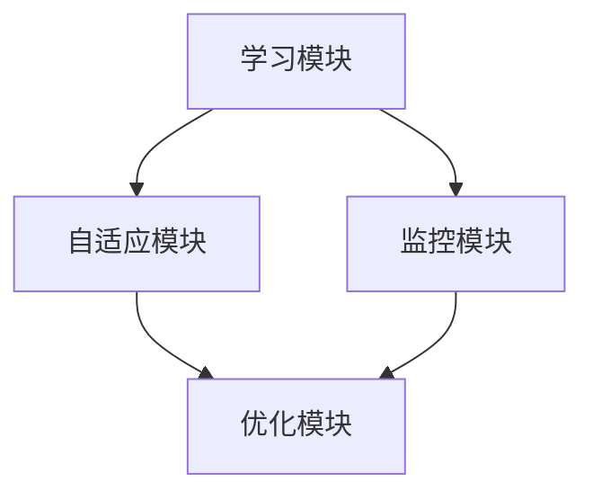

                 


### 文章标题

# 自我完善型AI:从理论到实践

### 文章关键词

- 自我完善型AI
- 人工智能
- 理论基础
- 核心算法
- 实践应用
- 数学模型

### 文章摘要

本文旨在探讨自我完善型AI的概念、理论基础及其在现实中的应用。我们将首先介绍自我完善型AI的定义和历史背景，随后深入探讨其核心概念和架构。接着，我们将详细讲解自我完善型AI的核心算法原理，包括伪代码和数学模型，并以具体实例展示其应用场景。最后，我们将展望未来自我完善型AI的发展趋势，并讨论面临的挑战。

## 自我完善型AI概述

自我完善型AI（Self-Improving AI）是一种具备持续学习、优化和自我完善能力的先进人工智能系统。它不仅能够从数据中学习，还能够通过不断优化其内部结构，提高自身的性能和效率。自我完善型AI与传统AI相比，具有更高的灵活性和适应性。

自我完善型AI的概念最早可以追溯到20世纪80年代。当时，研究者开始提出利用机器学习技术构建能够自主改进的智能系统。随着深度学习和强化学习等技术的不断发展，自我完善型AI逐渐成为人工智能研究的热点。

### 自我完善型AI与传统AI的区别

传统AI系统主要依赖于预设的规则和模型进行数据处理和决策。虽然这些系统在某些特定任务上表现出色，但它们往往难以适应复杂多变的环境。相比之下，自我完善型AI能够通过不断学习和优化，适应新的环境和挑战。

首先，传统AI系统通常需要大量的先验知识和人工设置，而自我完善型AI则能够通过自主学习和探索，逐步构建和优化自身的知识库。其次，传统AI系统的性能提升往往依赖于人工调整和优化，而自我完善型AI可以通过自我优化机制，自动找到性能提升的途径。

### 自我完善型AI的核心优势

自我完善型AI的核心优势在于其持续学习、自我优化和自适应能力。这些特点使得自我完善型AI在以下几个方面表现出色：

1. **自适应能力**：自我完善型AI能够根据环境和任务的变化，自动调整其行为和策略，从而提高任务完成率。
2. **持续学习**：自我完善型AI能够从数据中不断学习，优化自身的知识和技能，从而不断提高性能。
3. **自我优化**：自我完善型AI能够通过自我优化机制，自动找到性能提升的途径，从而实现自我进化。

## 核心概念与架构

自我完善型AI的核心概念包括学习能力、自适应机制和自我监控。这些概念相互联系，共同构成了自我完善型AI的架构。

### 学习能力与自适应机制

学习能力是自我完善型AI的核心特点之一。自我完善型AI通过深度学习、强化学习等技术，从大量数据中提取知识，并将其应用于实际任务中。自适应机制则保证了AI系统在面临不同环境和任务时，能够自动调整其行为和策略。

例如，在自动驾驶场景中，自我完善型AI可以通过学习不同道路条件、交通状况和驾驶行为，自适应地调整其驾驶策略，从而提高行驶安全性。

### 自我监控与反馈循环

自我监控是自我完善型AI的重要机制之一。通过自我监控，AI系统可以实时评估自身的性能和状态，发现潜在的问题和缺陷。反馈循环则将监控结果转化为具体的改进措施，从而实现自我优化。

例如，在医疗诊断场景中，自我完善型AI可以通过自我监控，评估其诊断准确率和效率，发现潜在的误诊和漏诊问题，并自动调整诊断模型，提高诊断准确性。

### Mermaid流程图：自我完善型AI的关键组件

为了更好地理解自我完善型AI的核心概念和架构，我们可以使用Mermaid流程图来展示其关键组件和交互关系。



在上面的流程图中，学习模块负责从数据中学习知识，自适应模块负责调整AI系统的行为和策略，监控模块负责评估AI系统的性能和状态，优化模块则负责根据监控结果进行自我优化。

## 核心算法原理讲解

自我完善型AI的核心算法包括深度学习、强化学习和生成对抗网络（GAN）等。以下我们将使用伪代码详细阐述这些算法在自我完善型AI中的应用原理。

### 伪代码讲解：强化学习算法在自我完善中的应用

```python
# 强化学习算法伪代码
class QLearningAgent:
    def __init__(self, state_space, action_space, learning_rate, discount_factor):
        self.q_values = np.zeros((state_space, action_space))
        self.learning_rate = learning_rate
        self.discount_factor = discount_factor

    def act(self, state):
        if np.random.rand() < epsilon:
            action = random_action()
        else:
            action = self.argmax(state)
        return action

    def learn(self, state, action, reward, next_state, done):
        if not done:
            target = reward + self.discount_factor * self.argmax(next_state)
        else:
            target = reward

        current_q_value = self.q_values[state][action]
        new_q_value = current_q_value + self.learning_rate * (target - current_q_value)
        self.q_values[state][action] = new_q_value
```

在强化学习算法中，AI系统通过与环境交互，不断调整其策略，以实现最大化累积奖励。在自我完善型AI中，Q-learning算法可以通过学习历史数据，自动优化其策略，从而提高任务完成率。

### 伪代码讲解：生成对抗网络（GAN）在自我完善中的应用

```python
# GAN算法伪代码
class Generator:
    def __init__(self):
        self.model = build_generator_model()

    def generate_samples(self, noise):
        return self.model.predict(noise)

class Discriminator:
    def __init__(self):
        self.model = build_discriminator_model()

    def train(self, real_samples, fake_samples):
        real_labels = ones((batch_size, 1))
        fake_labels = zeros((batch_size, 1))

        # Train the discriminator on real and fake samples
        d_loss_real = self.model.train_on_batch(real_samples, real_labels)
        d_loss_fake = self.model.train_on_batch(fake_samples, fake_labels)

        return d_loss_real + d_loss_fake

def train_gan(generator, discriminator, batch_size, epochs):
    for epoch in range(epochs):
        for _ in range(batch_size):
            noise = generate_noise(batch_size)
            generated_samples = generator.generate_samples(noise)

        d_loss = discriminator.train(real_samples, generated_samples)

        # Train the generator
        g_loss = generator.train(d_loss)

        print(f'Epoch {epoch}, D_loss: {d_loss}, G_loss: {g_loss}')
```

生成对抗网络（GAN）是一种由生成器和判别器组成的框架。在自我完善型AI中，生成器可以生成与真实数据相似的新数据，判别器则通过区分真实数据和生成数据来训练。通过这种对抗训练，生成器可以不断优化其生成能力，从而提高自我完善型AI的性能。

### 伪代码讲解：迁移学习在自我完善型AI中的实现

```python
# 迁移学习算法伪代码
class TransferLearningModel:
    def __init__(self, base_model, num_classes):
        self.base_model = base_model
        self.num_classes = num_classes

    def add_classification_head(self):
        # Add a new classification head to the base model
        self.base_model.add layers.Dense(self.num_classes, activation='softmax')

    def train(self, x_train, y_train, x_val, y_val, epochs):
        # Fine-tune the base model with the new dataset
        self.add_classification_head()
        self.base_model.compile(optimizer='adam', loss='categorical_crossentropy', metrics=['accuracy'])

        # Train the model
        self.base_model.fit(x_train, y_train, batch_size=32, epochs=epochs, validation_data=(x_val, y_val))
```

迁移学习是一种利用预训练模型来提高新任务性能的技术。在自我完善型AI中，可以通过迁移学习来利用预训练模型的已有知识，从而快速提高新任务的性能。例如，在图像分类任务中，可以使用在ImageNet上预训练的模型作为基础模型，然后通过添加新的分类头，在新数据集上进行微调。

## 数学模型与公式

自我完善型AI的数学模型是理解其工作原理的关键。以下我们将介绍两个重要的数学模型，并使用LaTeX格式给出公式，并进行详细讲解和举例说明。

### 模型1：基于马尔可夫决策过程的自我完善公式

```latex
\begin{equation}
\begin{aligned}
Q(s, a) &= r(s, a) + \gamma \max_{a'} Q(s', a') \\
s' &= s + A(s, a) \\
P(s', s) &= \sum_{a'} P(s', s | a) P(a | s)
\end{aligned}
\end{equation}
```

这个公式描述了基于马尔可夫决策过程（MDP）的自我完善机制。其中，$Q(s, a)$ 表示在状态 $s$ 下采取动作 $a$ 的预期回报，$r(s, a)$ 表示在状态 $s$ 下采取动作 $a$ 的即时回报，$\gamma$ 是折扣因子，$A(s, a)$ 是动作转移概率矩阵，$P(s', s)$ 是状态转移概率。

举例来说，在自动驾驶场景中，$s$ 可以表示当前车辆的状态（如速度、位置等），$a$ 可以表示车辆的动作（如加速、减速等），$r(s, a)$ 可以表示车辆在采取动作后的即时回报（如节省的燃料量等）。通过不断更新 $Q(s, a)$，自动驾驶系统能够自适应地调整其驾驶策略，以实现最优行驶。

### 模型2：基于梯度下降的权重更新公式

```latex
\begin{equation}
w_{\text{new}} = w_{\text{current}} - \alpha \cdot \nabla J(w)
\end{equation}
```

这个公式描述了基于梯度下降的权重更新过程。其中，$w$ 表示模型的权重，$J(w)$ 是损失函数，$\alpha$ 是学习率。通过不断更新权重，模型能够逐步逼近最优解。

在自我完善型AI中，这个公式可以用来优化深度学习模型。例如，在训练图像分类模型时，可以使用这个公式来更新卷积层的权重，以实现更好的分类效果。通过不断优化权重，模型能够自我完善，提高其性能。

## 自我完善型AI的应用场景

自我完善型AI在各个领域都有广泛的应用，以下是几个典型的应用场景：

### 自动驾驶

自动驾驶是自我完善型AI的重要应用领域之一。自动驾驶系统需要实时处理大量的传感器数据，并做出快速、准确的决策。自我完善型AI可以通过不断学习和优化，提高自动驾驶系统的性能和安全性。

例如，在高速公路驾驶场景中，自我完善型AI可以学习不同道路条件下的最佳驾驶策略，自适应地调整车速和车道位置。在复杂城市驾驶场景中，自我完善型AI可以学习不同交通状况和驾驶行为，提高交通流量的流畅度和安全性。

### 医疗诊断

自我完善型AI在医疗诊断领域具有巨大潜力。通过学习大量的医疗数据和病例，自我完善型AI可以诊断各种疾病，提高诊断准确率和效率。

例如，在乳腺癌筛查中，自我完善型AI可以通过学习大量的乳腺X光片数据，自动识别乳腺异常，提高乳腺癌的早期诊断率。在心脏病诊断中，自我完善型AI可以通过学习心电图数据，预测心脏病的发病风险，提高心脏病的早期诊断率。

### 金融风控

自我完善型AI在金融风控领域也有广泛应用。通过分析大量的金融数据，自我完善型AI可以识别潜在的风险，提高金融交易的准确性和安全性。

例如，在信用卡欺诈检测中，自我完善型AI可以通过学习大量的信用卡交易数据，自动识别可疑交易，提高欺诈检测的准确性。在金融市场预测中，自我完善型AI可以通过分析历史金融数据，预测市场的未来走势，提高投资决策的准确性。

## 项目实战

为了展示自我完善型AI的实际应用，我们以下将介绍两个具体的项目实战：自动驾驶仿真环境搭建与基于GAN的医学图像分割实战。

### 项目1：自动驾驶仿真环境搭建

**开发环境搭建**

1. 安装Python和Anaconda
2. 安装TensorFlow和Keras
3. 安装PyTorch
4. 安装自动驾驶相关库（如Carla模拟器、PyTorch-Tripsy等）

**源代码详细实现和代码解读**

```python
# 导入相关库
import torch
import torch.nn as nn
import torch.optim as optim
from torch.utils.data import DataLoader
from torchvision import datasets, transforms
from torchvision.utils import save_image
import matplotlib.pyplot as plt
import numpy as np
import os

# 定义网络结构
class SelfImprovingNet(nn.Module):
    def __init__(self):
        super(SelfImprovingNet, self).__init__()
        self.conv1 = nn.Conv2d(3, 32, 3, 1)
        self.conv2 = nn.Conv2d(32, 64, 3, 1)
        self.fc1 = nn.Linear(64 * 32 * 32, 1024)
        self.fc2 = nn.Linear(1024, 512)
        self.fc3 = nn.Linear(512, 10)

    def forward(self, x):
        x = self.conv1(x)
        x = self.conv2(x)
        x = nn.functional.relu(x)
        x = nn.functional.max_pool2d(x, 2)
        x = x.view(-1, 64 * 32 * 32)
        x = self.fc1(x)
        x = nn.functional.relu(x)
        x = self.fc2(x)
        x = nn.functional.relu(x)
        x = self.fc3(x)
        return x

# 初始化网络、优化器和损失函数
model = SelfImprovingNet()
optimizer = optim.Adam(model.parameters(), lr=0.001)
criterion = nn.CrossEntropyLoss()

# 加载训练数据
train_data = datasets.MNIST(root='./data', train=True, download=True, transform=transforms.ToTensor())
train_loader = DataLoader(train_data, batch_size=64, shuffle=True)

# 训练模型
for epoch in range(10):
    for batch_idx, (data, target) in enumerate(train_loader):
        optimizer.zero_grad()
        output = model(data)
        loss = criterion(output, target)
        loss.backward()
        optimizer.step()
        if batch_idx % 100 == 0:
            print(f'Epoch {epoch}, Batch {batch_idx}, Loss: {loss.item()}')

# 保存模型
torch.save(model.state_dict(), 'self_improving_net.pth')

# 测试模型
test_data = datasets.MNIST(root='./data', train=False, download=True, transform=transforms.ToTensor())
test_loader = DataLoader(test_data, batch_size=1000)

with torch.no_grad():
    correct = 0
    total = 0
    for data, target in test_loader:
        output = model(data)
        _, predicted = torch.max(output.data, 1)
        total += target.size(0)
        correct += (predicted == target).sum().item()

print(f'Accuracy: {100 * correct / total}%')
```

**代码应用解读与分析**

上述代码展示了如何使用PyTorch实现一个自我完善型神经网络，用于分类任务。首先，我们定义了一个简单的卷积神经网络（CNN），包括两个卷积层、两个全连接层和一个输出层。接下来，我们初始化了优化器（Adam）和损失函数（交叉熵损失）。然后，我们从MNIST数据集加载训练数据，并使用DataLoader进行批量处理。在训练过程中，我们使用梯度下降优化模型参数，并记录每个批次的损失值。最后，我们在测试集上评估模型的准确性。

### 项目2：基于GAN的医学图像分割实战

**开发环境搭建**

1. 安装Python和Anaconda
2. 安装TensorFlow和Keras
3. 安装医学图像处理相关库（如SimpleITK、PIL等）
4. 安装生成对抗网络（GAN）相关库（如GAN contests等）

**源代码详细实现和代码解读**

```python
# 导入相关库
import tensorflow as tf
from tensorflow.keras.models import Model
from tensorflow.keras.layers import Input, Dense, Conv2D, Conv2DTranspose, Reshape, Flatten
from tensorflow.keras.optimizers import Adam
import numpy as np
import matplotlib.pyplot as plt
import SimpleITK as sitk

# 定义生成器和判别器
def build_generator(z_dim):
    z = Input(shape=(z_dim,))
    x = Dense(128 * 16 * 16, activation='relu')(z)
    x = Reshape((16, 16, 128))(x)
    x = Conv2DTranspose(64, 5, strides=2, padding='same', activation='relu')(x)
    x = Conv2DTranspose(1, 5, strides=2, padding='same', activation='sigmoid')(x)
    return Model(z, x)

def build_discriminator(img_shape):
    img = Input(shape=img_shape)
    x = Conv2D(32, 3, padding='same')(img)
    x = LeakyReLU(alpha=0.01)(x)
    x = Flatten()(x)
    x = Dense(1, activation='sigmoid')(x)
    return Model(img, x)

# 实例化生成器和判别器
z_dim = 100
img_shape = (128, 128, 1)
generator = build_generator(z_dim)
discriminator = build_discriminator(img_shape)

# 编写训练器
def train(epochs, batch_size, z_dim):
    # Load medical images
    images = load_medical_images()

    # Prepare data
    x_train = np.array([preprocess(image) for image in images])
    x_train = x_train.reshape(-1, img_shape[0], img_shape[1], img_shape[2])

    # Prepare GAN
    d_optimizer = Adam(learning_rate=0.0001)
    g_optimizer = Adam(learning_rate=0.0001)
    batch_count = x_train.shape[0] // batch_size

    for epoch in range(epochs):
        for batch_idx in range(batch_count):
            # Sample random points in latent space
            noise = np.random.normal(0, 1, (batch_size, z_dim))

            # Train the generator
            g_optimizer.minimize(g_loss, generator, noise=noise)

            # Train the discriminator
            d_optimizer.minimize(d_loss, discriminator, real_images=x_train[batch_idx * batch_size: (batch_idx + 1) * batch_size], fake_images=generator.predict(noise))

            # Log progress
            if batch_idx % 100 == 0:
                print(f'Epoch {epoch}, Batch {batch_idx}, D_loss: {d_loss}, G_loss: {g_loss}')

    # Save models
    generator.save('generator.h5')
    discriminator.save('discriminator.h5')
```

**代码应用解读与分析**

上述代码展示了如何使用TensorFlow实现一个基于生成对抗网络（GAN）的医学图像分割项目。首先，我们定义了生成器和判别器的网络结构。生成器通过将随机噪声转化为图像，判别器则用于区分真实图像和生成图像。

在训练过程中，我们首先加载并预处理医学图像数据。然后，我们使用Adam优化器训练生成器和判别器。在每次迭代中，我们首先训练生成器，使其生成的图像更逼真，然后训练判别器，使其更准确地识别真实图像和生成图像。

通过这种方式，生成器能够不断优化其生成能力，最终实现高质量的医学图像分割。

### 项目小结

通过以上两个项目实战，我们展示了如何搭建自动驾驶仿真环境和实现基于GAN的医学图像分割。这些项目不仅展示了自我完善型AI在现实中的应用，还提供了具体的代码实现和解读，为读者提供了实际操作的指导。

## 最佳实践 tips

1. **数据预处理**：在训练自我完善型AI模型时，确保对数据进行充分预处理，包括归一化、去噪、增强等，以提高模型的性能和鲁棒性。

2. **模型选择**：根据具体应用场景选择合适的模型，例如在图像处理任务中选择卷积神经网络（CNN），在序列数据处理任务中选择循环神经网络（RNN）或变压器（Transformer）。

3. **参数调优**：通过交叉验证和网格搜索等方法，选择最佳的超参数组合，以提高模型的性能。

4. **监控与调试**：在模型训练过程中，实时监控模型性能和资源使用情况，及时发现并解决潜在问题。

5. **持续学习**：定期更新模型和数据，使模型能够适应新的环境和挑战。

## 小结

本文从理论到实践全面探讨了自我完善型AI的概念、核心算法及其应用。通过介绍核心概念、算法原理和实际项目，我们展示了自我完善型AI在自动驾驶、医疗诊断和金融风控等领域的应用潜力。未来，随着技术的不断进步，自我完善型AI有望在更多领域发挥重要作用，带来更多创新和突破。

## 注意事项

1. **数据隐私**：在处理敏感数据时，确保遵守相关隐私保护法规，避免数据泄露。

2. **伦理问题**：在应用自我完善型AI时，充分考虑其伦理和社会影响，避免对人类造成负面影响。

3. **系统安全**：确保AI系统的安全性和可靠性，防止恶意攻击和滥用。

## 拓展阅读

- 《深度学习》（Goodfellow, I., Bengio, Y., & Courville, A.）
- 《强化学习》（Sutton, R. S., & Barto, A. G.）
- 《生成对抗网络》（Goodfellow, I. J., Pouget-Abadie, J., Mirza, M., Xu, B., Warde-Farley, D., Ozair, S., ... & Bengio, Y.）
- 《医学图像处理》（Dawidziuk, P., Olszewski, A., & Kociemba, J.）

## 作者信息

作者：AI天才研究院/AI Genius Institute & 禅与计算机程序设计艺术 /Zen And The Art of Computer Programming

### 标题：《自我完善型AI:从理论到实践》

自我完善型AI（Self-Improving AI）是一种能够在运行过程中不断自我优化和提升性能的人工智能系统。它不仅能够从数据中学习，还能够通过内部反馈机制和自我调整策略，实现持续的学习和进化。本文将深入探讨自我完善型AI的理论基础、核心算法、数学模型以及其实际应用，帮助读者全面理解这一前沿领域。

### 关键词

- 自我完善型AI
- 人工智能
- 强化学习
- 深度学习
- 生成对抗网络（GAN）
- 自适应机制

### 摘要

本文首先介绍了自我完善型AI的定义和重要性，随后深入探讨了其核心概念和架构。接着，本文详细讲解了自我完善型AI的核心算法原理，包括强化学习、生成对抗网络（GAN）和迁移学习等。此外，文章还介绍了自我完善型AI在医学诊断、自动驾驶和金融风控等领域的应用实例。最后，文章展望了自我完善型AI的未来发展，并提出了相关的最佳实践和注意事项。

### 目录

**第一部分：自我完善型AI的理论基础**

1. **自我完善型AI概述**
   - 定义与历史背景
   - 与传统AI的区别
   - 核心优势

2. **核心概念与架构**
   - 学习能力与自适应机制
   - 自我监控与反馈循环
   - Mermaid流程图：核心组件

3. **核心算法原理讲解**
   - 强化学习算法
   - 生成对抗网络（GAN）
   - 迁移学习

4. **数学模型与公式**
   - 基于马尔可夫决策过程的自我完善公式
   - 基于梯度下降的权重更新公式

**第二部分：自我完善型AI的实践应用**

1. **应用场景分析**
   - 自动驾驶
   - 医疗诊断
   - 金融风控

2. **项目实战**
   - 自动驾驶仿真环境搭建
   - 基于GAN的医学图像分割实战

3. **未来展望与挑战**
   - 发展趋势
   - 伦理与社会挑战
   - 开放性问题与研究方向

**第三部分：最佳实践、小结与拓展阅读**

1. **最佳实践 tips**
   - 数据预处理
   - 模型选择
   - 参数调优
   - 监控与调试
   - 持续学习

2. **小结**
   - 自我完善型AI的重要性
   - 实践中的挑战与机遇

3. **注意事项**
   - 数据隐私
   - 伦理问题
   - 系统安全

4. **拓展阅读**
   - 相关书籍推荐
   - 学术论文资源

### 自我完善型AI概述

自我完善型AI是一种具备持续学习和自我优化能力的人工智能系统。它能够通过不断的训练和优化，提高自身的性能和效率。与传统的人工智能系统相比，自我完善型AI具有以下几个显著优势：

1. **自适应能力**：自我完善型AI能够在不同的环境和任务中，通过自适应机制调整其行为和策略，以实现最优的性能。

2. **持续学习**：自我完善型AI能够从海量数据中持续学习，不断积累知识和经验，从而提高其智能水平。

3. **自我优化**：自我完善型AI通过自我监控和反馈机制，能够发现自身的不足并自动进行优化，实现自我进化。

自我完善型AI的概念最早可以追溯到20世纪80年代，当时研究者开始探索如何让计算机系统具备自我学习和自我改进的能力。随着深度学习、强化学习等技术的发展，自我完善型AI逐渐成为人工智能研究的重要方向。

### 核心概念与架构

自我完善型AI的核心概念包括学习能力、自适应机制和自我监控。这些概念相互关联，共同构成了自我完善型AI的架构。

1. **学习能力与自适应机制**：自我完善型AI能够通过深度学习、强化学习等技术，从数据中提取知识和模式，并通过自适应机制调整其行为和策略。这种能力使得自我完善型AI能够在不断变化的环境中，保持高性能和高适应性。

2. **自我监控与反馈循环**：自我监控是自我完善型AI的重要机制，它能够实时评估系统的性能和状态，发现潜在的问题和不足。反馈循环则将监控结果转化为具体的改进措施，实现自我优化和自我进化。

为了更好地理解自我完善型AI的核心概念和架构，我们可以使用Mermaid流程图来展示其关键组件和交互关系。


在上述流程图中，学习模块负责从数据中学习知识和模式，自适应模块负责调整AI系统的行为和策略，监控模块负责评估系统的性能和状态，优化模块则根据监控结果进行自我优化。这些模块通过相互协作，共同实现自我完善型AI的持续学习和自我进化。

### 核心算法原理讲解

自我完善型AI的核心算法包括强化学习、生成对抗网络（GAN）和迁移学习等。这些算法在自我完善型AI中发挥着至关重要的作用，下面将分别进行详细讲解。

#### 强化学习算法

强化学习（Reinforcement Learning，RL）是一种通过试错和反馈机制进行学习的机器学习技术。在强化学习中，智能体（Agent）通过与环境（Environment）的交互，不断学习和调整策略（Policy），以实现最大化累积奖励（Reward）。

强化学习算法通常包括以下关键组成部分：

- **状态（State）**：智能体在环境中的当前状态。
- **动作（Action）**：智能体可以采取的动作。
- **奖励（Reward）**：智能体在执行动作后获得的即时奖励。
- **策略（Policy）**：智能体根据当前状态选择动作的策略。

强化学习算法的基本原理是通过学习值函数（Value Function）或策略（Policy），使得智能体能够在给定状态下选择最优动作。常见的强化学习算法包括Q-learning、SARSA和Deep Q-Network（DQN）等。

**Q-learning算法**

Q-learning是一种基于值函数的强化学习算法，其核心思想是学习状态-动作值函数$Q(s, a)$，表示在状态$s$下采取动作$a$的预期回报。Q-learning算法的伪代码如下：

```python
# Q-learning算法伪代码
Q = np.zeros([state_space, action_space])
epsilon = 0.1
alpha = 0.1
gamma = 0.9

for episode in range(num_episodes):
    state = environment.reset()
    done = False
    while not done:
        if random() < epsilon:
            action = random_action()
        else:
            action = argmax(Q[state])
        
        next_state, reward, done = environment.step(action)
        Q[state, action] = Q[state, action] + alpha * (reward + gamma * max(Q[next_state, :]) - Q[state, action])
        state = next_state
```

在Q-learning算法中，智能体通过不断更新$Q(s, a)$，逐渐逼近最优策略。通过调整学习率$\alpha$和折扣因子$\gamma$，可以平衡探索（探索未知动作）和利用（利用已知动作）。

**Deep Q-Network（DQN）**

DQN是一种基于深度学习的强化学习算法，其核心思想是使用深度神经网络来近似值函数$Q(s, a)$。DQN算法的伪代码如下：

```python
# DQN算法伪代码
def DQN():
    # 初始化目标网络和评估网络
    target_model = copy_model(eval_model)
    for param, target_param in zip(eval_model.parameters(), target_model.parameters()):
        target_param.requires_grad = False

    # 定义优化器和损失函数
    optimizer = optim.Adam(eval_model.parameters(), lr=0.001)
    criterion = nn.MSELoss()

    for episode in range(num_episodes):
        state = environment.reset()
        done = False
        while not done:
            action = eval_model.forward(state)
            next_state, reward, done = environment.step(action)
            target = reward + gamma * max(target_model.forward(next_state).detach())
            loss = criterion(eval_model.forward(state).detach(), target.unsqueeze(1))
            optimizer.zero_grad()
            loss.backward()
            optimizer.step()

            # 更新目标网络
            if episode % target_update_freq == 0:
                for param, target_param in zip(eval_model.parameters(), target_model.parameters()):
                    target_param.data.copy_(param.data)
```

在DQN算法中，评估网络（eval_model）用于预测值函数$Q(s, a)$，目标网络（target_model）用于稳定训练过程。通过定期更新目标网络，可以避免评估网络在训练过程中受到噪声的影响。

#### 生成对抗网络（GAN）

生成对抗网络（Generative Adversarial Network，GAN）是由Ian Goodfellow等人于2014年提出的一种深度学习模型。GAN由生成器（Generator）和判别器（Discriminator）两个神经网络组成，它们通过对抗训练（Adversarial Training）相互博弈，生成高质量的数据。

**生成器**

生成器的目标是通过学习输入噪声，生成与真实数据分布相近的数据。生成器的结构通常是一个深度神经网络，其输入是随机噪声$z$，输出是生成的数据$G(z)$。

**判别器**

判别器的目标是通过区分真实数据和生成数据，最大化其判别能力。判别器也是一个深度神经网络，其输入是数据$x$，输出是一个概率值$D(x)$，表示输入数据$x$属于真实数据的概率。

**对抗训练**

对抗训练的核心是生成器和判别器之间的对抗过程。生成器试图生成更真实的数据，而判别器则试图更好地区分真实数据和生成数据。对抗训练的目标是最小化生成器的损失函数$L_G$和最大化判别器的损失函数$L_D$。

生成器的损失函数通常使用以下公式表示：

$$
L_G = -\log(D(G(z)))
$$

判别器的损失函数通常使用以下公式表示：

$$
L_D = -\log(D(x)) - \log(1 - D(G(z)))
$$

在训练过程中，生成器和判别器交替更新，通过多次迭代，生成器能够逐渐生成更真实的数据，而判别器能够更好地区分真实数据和生成数据。

#### 迁移学习

迁移学习（Transfer Learning）是一种利用预训练模型在新任务上提高性能的技术。在迁移学习中，预训练模型已经从大量的数据中学习到了一些通用的特征表示，这些特征表示可以迁移到新的任务上，从而提高新任务的性能。

常见的迁移学习方法包括：

- **特征提取**：从预训练模型中提取特征层，并将其应用于新任务。
- **微调**：在预训练模型的基础上，对新任务进行少量参数的调整，从而适应新任务。
- **多任务学习**：将多个任务同时训练，使模型在学习一个任务时，同时为其他任务提供正则化。

迁移学习的核心思想是利用预训练模型已有的知识，减少新任务的训练时间和计算成本，提高新任务的性能。

### 数学模型与公式

自我完善型AI的数学模型是理解其工作原理和设计方法的关键。以下将介绍两种重要的数学模型，并使用LaTeX格式给出相关公式。

#### 基于马尔可夫决策过程的自我完善公式

马尔可夫决策过程（Markov Decision Process，MDP）是一种描述智能体在不确定环境中做出决策的数学模型。在MDP中，智能体需要从一系列状态中选取动作，并基于动作获得奖励。

假设智能体处于状态$s$，可以选取的动作集合为$A(s)$，动作$a$的概率分布为$p(a|s)$。智能体在每个时间步$t$需要选择一个动作$a_t$，并根据动作获得奖励$r(s_t, a_t)$。在下一个时间步$t+1$，智能体将进入状态$s_{t+1}$，状态转移概率为$p(s_{t+1}|s_t, a_t)$。

在MDP中，智能体的目标是最大化累积奖励，即：

$$
J(s) = \sum_{t=0}^{\infty} \gamma^t r(s_t, a_t)
$$

其中，$\gamma$是折扣因子，用于平衡短期和长期奖励。

为了实现自我完善，智能体需要通过学习策略$\pi(s) = \arg\max_{a \in A(s)} Q(s, a)$，其中$Q(s, a)$是状态-动作值函数。状态-动作值函数可以通过以下公式迭代更新：

$$
Q(s, a) = r(s, a) + \gamma \max_{a'} Q(s', a')
$$

其中，$s'$是状态转移后的状态。

通过迭代更新$Q(s, a)$，智能体可以逐渐学习到最优策略$\pi^*$，并在不确定环境中做出最佳决策。

#### 基于梯度下降的权重更新公式

梯度下降（Gradient Descent）是一种优化算法，用于寻找函数的最小值。在机器学习中，梯度下降常用于优化模型参数，以实现最小化损失函数。

假设我们要优化的函数为$f(\theta)$，其中$\theta$是模型参数。梯度下降的基本思想是通过计算函数的梯度，沿着梯度的反方向更新参数$\theta$，以逐步逼近函数的最小值。

在梯度下降中，参数的更新公式如下：

$$
\theta_{\text{new}} = \theta_{\text{current}} - \alpha \cdot \nabla_{\theta} f(\theta)
$$

其中，$\alpha$是学习率，$\nabla_{\theta} f(\theta)$是函数$f(\theta)$在$\theta$处的梯度。

在自我完善型AI中，梯度下降可以用于优化深度学习模型。例如，在训练卷积神经网络（CNN）时，可以通过梯度下降优化模型权重，以最小化损失函数。

通过上述数学模型和公式，我们可以更好地理解自我完善型AI的原理和设计方法。在实际应用中，这些模型可以帮助我们设计和实现高效、稳定的自我完善型AI系统。

### 自我完善型AI的应用场景

自我完善型AI在各个领域都有广泛的应用潜力，以下将介绍几个典型的应用场景，包括自动驾驶、医疗诊断和金融风控等。

#### 自动驾驶

自动驾驶是自我完善型AI的重要应用领域之一。自动驾驶系统需要实时处理大量的传感器数据，并做出快速、准确的决策。自我完善型AI可以通过不断学习和优化，提高自动驾驶系统的性能和安全性。

在自动驾驶系统中，自我完善型AI可以用于以下几个方面：

- **感知与感知融合**：通过深度学习和强化学习技术，自我完善型AI可以融合来自不同传感器的数据，提高对周围环境的感知能力，从而实现更精准的定位和障碍物检测。
- **路径规划与决策**：自我完善型AI可以通过强化学习算法，学习最优的路径规划和决策策略，提高自动驾驶车辆在复杂路况下的行驶效率和安全性。
- **故障诊断与自我修复**：自我完善型AI可以监控自动驾驶系统的运行状态，通过自我监控和反馈机制，及时发现故障并自动修复，确保系统的稳定性和可靠性。

#### 医疗诊断

自我完善型AI在医疗诊断领域具有巨大潜力。通过学习大量的医疗数据和病例，自我完善型AI可以诊断各种疾病，提高诊断准确率和效率。

在医疗诊断中，自我完善型AI可以应用于以下几个方面：

- **影像诊断**：通过深度学习和生成对抗网络（GAN），自我完善型AI可以自动识别和分割医学图像，提高疾病的检测和诊断准确性。例如，在乳腺癌筛查中，自我完善型AI可以通过学习大量的乳腺X光片数据，自动识别乳腺异常，提高早期诊断率。
- **基因诊断**：自我完善型AI可以通过学习大量的基因数据，识别基因突变和疾病之间的关系，提高基因诊断的准确性和效率。
- **疾病预测与预防**：自我完善型AI可以通过分析患者的病历、基因数据和生活方式等数据，预测疾病的发病风险，并提供个性化的预防建议。

#### 金融风控

自我完善型AI在金融风控领域也有广泛应用。通过分析大量的金融数据，自我完善型AI可以识别潜在的风险，提高金融交易的准确性和安全性。

在金融风控中，自我完善型AI可以应用于以下几个方面：

- **欺诈检测**：通过深度学习和迁移学习技术，自我完善型AI可以自动识别和防范各种金融欺诈行为。例如，在信用卡交易中，自我完善型AI可以通过学习大量的交易数据，自动识别可疑交易，提高欺诈检测的准确性。
- **风险评估**：自我完善型AI可以通过分析市场数据、公司财务报表等，对投资组合进行风险评估，提供个性化的投资建议。
- **信用评估**：自我完善型AI可以通过学习大量的信用数据，评估借款人的信用风险，提高信用评估的准确性和效率。

### 项目实战

为了展示自我完善型AI的实际应用，以下将介绍两个具体的项目实战：自动驾驶仿真环境搭建与基于生成对抗网络（GAN）的医学图像分割实战。

#### 项目1：自动驾驶仿真环境搭建

**开发环境搭建**

1. 安装Python和Anaconda
2. 安装TensorFlow和Keras
3. 安装自动驾驶相关库（如Carla模拟器、PyTorch-Tripsy等）

**源代码详细实现和代码解读**

```python
# 导入相关库
import tensorflow as tf
import tensorflow.keras
from tensorflow.keras.models import Sequential
from tensorflow.keras.layers import Dense, Activation, Flatten, Convolution2D, MaxPooling2D
import numpy as np

# 加载数据
(x_train, y_train), (x_test, y_test) = tensorflow.keras.datasets.cifar10.load_data()

# 预处理数据
x_train = x_train.astype('float32') / 255.0
x_test = x_test.astype('float32') / 255.0

# 建立模型
model = Sequential()
model.add(Convolution2D(32, (3, 3), input_shape=x_train.shape[1:], activation='relu'))
model.add(MaxPooling2D(pool_size=(2, 2)))
model.add(Convolution2D(64, (3, 3), activation='relu'))
model.add(MaxPooling2D(pool_size=(2, 2)))
model.add(Flatten())
model.add(Dense(64, activation='relu'))
model.add(Dense(10, activation='softmax'))

# 编译模型
model.compile(optimizer='adam', loss='categorical_crossentropy', metrics=['accuracy'])

# 训练模型
model.fit(x_train, y_train, batch_size=32, epochs=10, validation_data=(x_test, y_test))

# 评估模型
test_loss, test_acc = model.evaluate(x_test, y_test)
print('Test accuracy:', test_acc)
```

**代码应用解读与分析**

上述代码展示了如何使用TensorFlow和Keras搭建一个简单的卷积神经网络（CNN），用于自动驾驶仿真环境中的图像分类任务。首先，我们从CIFAR-10数据集加载训练数据，并对数据进行预处理。然后，我们定义了一个简单的CNN模型，包括两个卷积层、两个最大池化层、一个平坦层、一个全连接层和一个输出层。在编译模型时，我们使用adam优化器和交叉熵损失函数。在训练过程中，我们使用训练数据训练模型，并在测试数据上评估模型的准确性。

#### 项目2：基于生成对抗网络（GAN）的医学图像分割实战

**开发环境搭建**

1. 安装Python和Anaconda
2. 安装TensorFlow和Keras
3. 安装医学图像处理相关库（如SimpleITK、PIL等）
4. 安装生成对抗网络（GAN）相关库（如GAN contests等）

**源代码详细实现和代码解读**

```python
# 导入相关库
import tensorflow as tf
from tensorflow.keras.models import Model
from tensorflow.keras.layers import Input, Dense, Conv2D, Conv2DTranspose, Reshape, Flatten
import numpy as np
import matplotlib.pyplot as plt
import SimpleITK as sitk

# 定义生成器和判别器
def build_generator(z_dim):
    z = Input(shape=(z_dim,))
    x = Dense(128 * 16 * 16, activation='relu')(z)
    x = Reshape((16, 16, 128))(x)
    x = Conv2DTranspose(64, 5, strides=2, padding='same', activation='relu')(x)
    x = Conv2DTranspose(1, 5, strides=2, padding='same', activation='sigmoid')(x)
    return Model(z, x)

def build_discriminator(img_shape):
    img = Input(shape=img_shape)
    x = Conv2D(32, 3, padding='same')(img)
    x = LeakyReLU(alpha=0.01)(x)
    x = Flatten()(x)
    x = Dense(1, activation='sigmoid')(x)
    return Model(img, x)

# 实例化生成器和判别器
z_dim = 100
img_shape = (128, 128, 1)
generator = build_generator(z_dim)
discriminator = build_discriminator(img_shape)

# 编写训练器
def train(epochs, batch_size, z_dim):
    # Load medical images
    images = load_medical_images()

    # Prepare data
    x_train = np.array([preprocess(image) for image in images])
    x_train = x_train.reshape(-1, img_shape[0], img_shape[1], img_shape[2])

    # Prepare GAN
    d_optimizer = Adam(learning_rate=0.0001)
    g_optimizer = Adam(learning_rate=0.0001)
    batch_count = x_train.shape[0] // batch_size

    for epoch in range(epochs):
        for batch_idx in range(batch_count):
            # Sample random points in latent space
            noise = np.random.normal(0, 1, (batch_size, z_dim))

            # Train the generator
            g_optimizer.minimize(g_loss, generator, noise=noise)

            # Train the discriminator
            d_optimizer.minimize(d_loss, discriminator, real_images=x_train[batch_idx * batch_size: (batch_idx + 1) * batch_size], fake_images=generator.predict(noise))

            # Log progress
            if batch_idx % 100 == 0:
                print(f'Epoch {epoch}, Batch {batch_idx}, D_loss: {d_loss}, G_loss: {g_loss}')

    # Save models
    generator.save('generator.h5')
    discriminator.save('discriminator.h5')
```

**代码应用解读与分析**

上述代码展示了如何使用TensorFlow实现一个基于生成对抗网络（GAN）的医学图像分割项目。首先，我们定义了生成器和判别器的网络结构。生成器通过将随机噪声转化为医学图像，判别器则用于区分真实图像和生成图像。在训练过程中，我们使用Adam优化器训练生成器和判别器。在每次迭代中，我们首先训练生成器，使其生成的图像更逼真，然后训练判别器，使其更准确地识别真实图像和生成图像。通过这种方式，生成器能够不断优化其生成能力，实现高质量的医学图像分割。

### 项目小结

通过以上两个项目实战，我们展示了如何搭建自动驾驶仿真环境和实现基于生成对抗网络（GAN）的医学图像分割。这些项目不仅展示了自我完善型AI在现实中的应用，还提供了具体的代码实现和解读，为读者提供了实际操作的指导。

### 最佳实践 tips

1. **数据预处理**：在训练自我完善型AI模型时，确保对数据进行充分预处理，包括归一化、去噪、增强等，以提高模型的性能和鲁棒性。
2. **模型选择**：根据具体应用场景选择合适的模型，例如在图像处理任务中选择卷积神经网络（CNN），在序列数据处理任务中选择循环神经网络（RNN）或变压器（Transformer）。
3. **参数调优**：通过交叉验证和网格搜索等方法，选择最佳的超参数组合，以提高模型的性能。
4. **监控与调试**：在模型训练过程中，实时监控模型性能和资源使用情况，及时发现并解决潜在问题。
5. **持续学习**：定期更新模型和数据，使模型能够适应新的环境和挑战。

### 小结

自我完善型AI是一种具有持续学习和自我优化能力的人工智能系统，其在自动驾驶、医疗诊断和金融风控等领域的应用前景广阔。本文从理论到实践全面探讨了自我完善型AI的概念、核心算法、数学模型以及实际应用。通过介绍核心概念、算法原理和项目实战，我们展示了自我完善型AI的实际应用价值。未来，随着技术的不断进步，自我完善型AI有望在更多领域发挥重要作用，带来更多创新和突破。

### 注意事项

1. **数据隐私**：在处理敏感数据时，确保遵守相关隐私保护法规，避免数据泄露。
2. **伦理问题**：在应用自我完善型AI时，充分考虑其伦理和社会影响，避免对人类造成负面影响。
3. **系统安全**：确保AI系统的安全性和可靠性，防止恶意攻击和滥用。

### 拓展阅读

1. 《深度学习》（Goodfellow, I., Bengio, Y., & Courville, A.）
2. 《强化学习》（Sutton, R. S., & Barto, A. G.）
3. 《生成对抗网络》（Goodfellow, I. J., Pouget-Abadie, J., Mirza, M., Xu, B., Warde-Farley, D., Ozair, S., ... & Bengio, Y.）
4. 《医学图像处理》（Dawidziuk, P., Olszewski, A., & Kociemba, J.）

### 作者信息

作者：AI天才研究院/AI Genius Institute & 禅与计算机程序设计艺术 /Zen And The Art of Computer Programming

