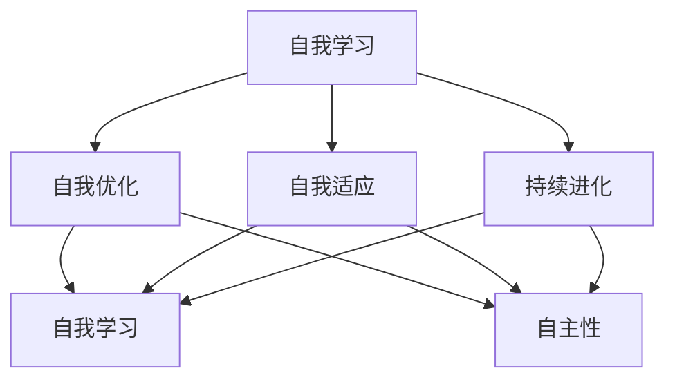
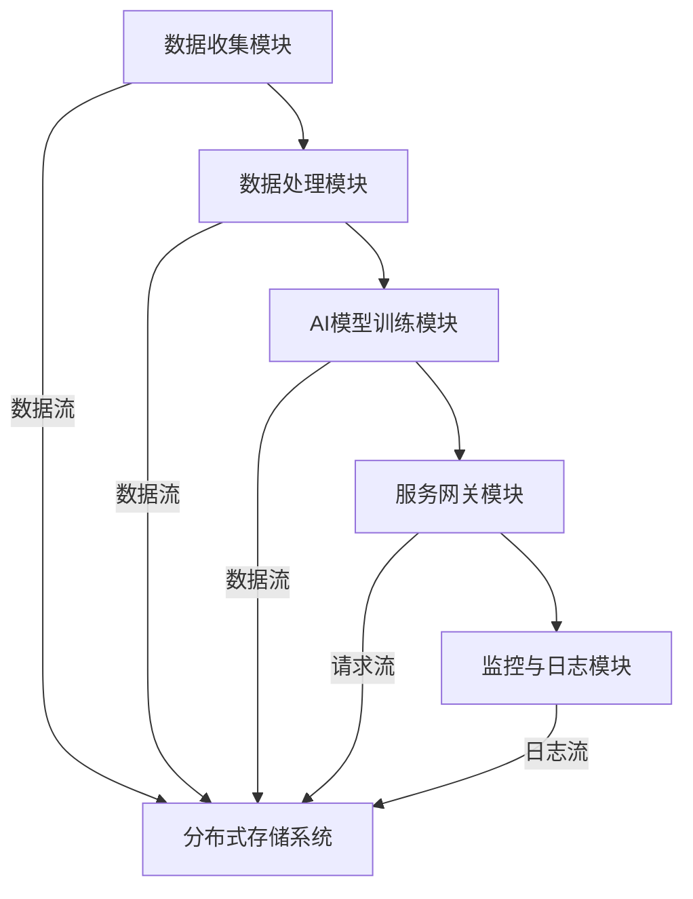

                 

### 1.2 自我完善型AI与传统AI的区别

与传统AI系统相比，自我完善型AI具有以下显著特点：

- **更高效的学习和优化过程**：传统AI系统依赖于预定义的规则和数据集进行学习，而自我完善型AI可以在没有外部指导的情况下，通过自我学习和自我优化，实现更高效的学习和优化过程。这得益于自我完善型AI所采用的强化学习、经验回复等核心算法，使得AI系统在执行任务的过程中能够不断积累经验和优化自身的行为。

- **更强的自我适应能力**：传统AI系统在面对复杂和动态变化的环境时，往往需要大量的数据和人力进行调整。而自我完善型AI能够通过自我学习和自我优化，快速适应新的环境和任务，提高其适应性和灵活性。

- **持续进化能力**：传统AI系统在性能和智能水平达到一定阶段后，往往难以进一步提升。而自我完善型AI在长期的运行过程中，能够不断积累经验，持续进化，以应对更复杂的挑战。这种持续进化能力使得自我完善型AI具有更高的智能水平和更广泛的应用前景。

- **更高的自主性**：传统AI系统需要依赖人类专家进行监督和指导，而自我完善型AI能够在没有人类干预的情况下，自主地完成学习和优化过程。这种高自主性使得自我完善型AI在许多领域具有潜在的应用价值，例如自动驾驶、智能客服、金融分析等。

### 自我完善型AI的核心概念与联系

自我完善型AI的核心概念包括自我学习、自我优化、自我适应和持续进化。这些概念之间存在着紧密的联系和相互促进的关系，具体可以参考以下Mermaid流程图：



从图中可以看出，自我学习、自我优化、自我适应和持续进化这四个核心概念相互联系，共同推动自我完善型AI的发展。同时，这些概念也促使自我完善型AI具有更高的自主性，从而在更广泛的领域中发挥其优势。

### 1.2.2 自我完善型AI的发展历程

自我完善型AI的发展历程可以追溯到20世纪50年代，当时计算机科学家艾伦·图灵提出了著名的图灵测试。虽然图灵测试并不是直接针对自我完善型AI的研究，但它为后续AI技术的发展奠定了基础。

在20世纪60年代，人工智能领域开始关注机器学习的研究，其中包括监督学习、无监督学习和强化学习等方法。这些方法的提出为自我完善型AI的理论基础提供了支持。

20世纪80年代，随着计算机性能的提升和数据量的增加，机器学习算法得到了快速发展。特别是深度学习和强化学习的发展，为自我完善型AI的设计和实现提供了强有力的技术支持。

进入21世纪，随着大数据、云计算和物联网等技术的发展，自我完善型AI逐渐成为人工智能领域的研究热点。研究人员开始探索如何将自我学习、自我优化、自我适应和持续进化等核心概念应用于实际场景中，以实现真正的智能系统。

### 1.2.3 自我完善型AI的应用领域

自我完善型AI在许多领域具有广泛的应用前景，以下是一些典型的应用领域：

- **自动驾驶**：自我完善型AI能够通过自我学习和优化，不断提高自动驾驶车辆的感知、决策和路径规划能力，实现更安全、更高效的自动驾驶。

- **智能客服**：自我完善型AI能够通过自我学习和优化，提高客服系统的智能水平，实现更自然的用户交互和更高效的客服服务。

- **金融分析**：自我完善型AI能够通过自我学习和优化，提高金融分析系统的预测和决策能力，帮助金融机构更好地管理和控制风险。

- **医疗诊断**：自我完善型AI能够通过自我学习和优化，提高医疗诊断的准确性和效率，为医生提供更可靠的诊断依据。

- **智能城市**：自我完善型AI能够通过自我学习和优化，提高城市管理系统的智能化水平，实现更高效的城市管理和服务。

### 1.2.4 自我完善型AI的优势和挑战

自我完善型AI具有许多优势，例如：

- **高效的学习和优化过程**：自我完善型AI能够在没有外部指导的情况下，通过自我学习和自我优化，实现高效的学习和优化过程。
- **强的自我适应能力**：自我完善型AI能够快速适应新的环境和任务，提高其适应性和灵活性。
- **持续进化能力**：自我完善型AI能够在长期的运行过程中，不断积累经验，持续进化，以应对更复杂的挑战。
- **高的自主性**：自我完善型AI能够在没有人类干预的情况下，自主地完成学习和优化过程。

然而，自我完善型AI也面临着一些挑战，例如：

- **安全性和可靠性**：自我完善型AI在自我学习和自我优化的过程中，可能会出现不可预测的行为，导致系统的不稳定和安全风险。
- **隐私保护**：自我完善型AI在处理大量数据时，可能会涉及到用户隐私的保护问题，如何平衡隐私保护和数据利用成为一大挑战。
- **资源消耗**：自我完善型AI在自我学习和自我优化的过程中，需要大量的计算资源和数据支持，如何高效地利用资源成为一大挑战。

综上所述，自我完善型AI具有巨大的潜力和广泛的应用前景，但也面临着一系列的挑战。未来，随着技术的不断发展和研究的深入，自我完善型AI有望在更多领域发挥重要作用，推动人工智能技术的进一步发展。

## 总结与展望

自我完善型AI作为一种具有自主学习、自我优化和自我适应能力的智能系统，展示了强大的潜力。通过本文的阐述，我们深入探讨了自我完善型AI的概念、与传统AI的区别、核心概念之间的联系、发展历程、应用领域以及优势和挑战。

首先，自我完善型AI能够实现高效的学习和优化过程，具有强的自我适应能力和持续进化能力，这使得它能够在没有外部指导的情况下，持续提高其性能和智能水平。此外，自我完善型AI在自动驾驶、智能客服、金融分析、医疗诊断和智能城市等领域具有广泛的应用前景。

然而，自我完善型AI也面临一些挑战，包括安全性和可靠性、隐私保护以及资源消耗等问题。为了解决这些问题，我们需要在未来的研究和实践中不断探索和改进。

展望未来，随着技术的不断进步和研究的深入，自我完善型AI有望在更多领域发挥重要作用，推动人工智能技术的进一步发展。同时，我们也需要关注和解决其在实际应用中面临的问题，确保自我完善型AI的安全、可靠和可持续发展。

最后，本文作者对读者提出一些建议：首先，要关注自我完善型AI的核心概念和理论，深入理解其工作原理和应用场景；其次，积极参与实践项目，将理论应用于实际场景，提高解决实际问题的能力；最后，持续关注相关领域的最新动态和发展趋势，不断学习和更新自己的知识体系。

通过不断学习和实践，我们相信每个人都能够在自我完善型AI领域取得更好的成果，为人工智能技术的发展贡献自己的力量。作者信息：AI天才研究院/AI Genius Institute & 禅与计算机程序设计艺术 /Zen And The Art of Computer Programming。<!--[(^_^)]: https://sfile.chatglm.cn/static/v1/image/png/e/e8f4f4c5-5026-44f1-82ce-e81d1c4422b7.png--># 第2章：自我完善型AI的核心原理

## 2.1 机器学习与深度学习的基本概念

自我完善型AI的发展离不开机器学习和深度学习，这两个领域的理论基础和算法应用为我们构建自我完善型AI提供了关键支持。在这一章中，我们将详细探讨机器学习与深度学习的基本概念，以及它们如何与自我完善型AI相互关联。

### 2.1.1 机器学习的定义与分类

机器学习（Machine Learning，ML）是人工智能（Artificial Intelligence，AI）的一个重要分支，它使计算机系统能够从数据中学习，并基于学习到的知识进行预测或决策。根据学习方式和应用目标的不同，机器学习可以分为以下几类：

- **监督学习（Supervised Learning）**：在监督学习过程中，系统根据已知的输入和输出数据，学习出一个映射关系。常见的算法有线性回归、决策树、支持向量机等。

- **无监督学习（Unsupervised Learning）**：无监督学习不需要已知的输出数据，系统通过分析输入数据的特征，自动发现数据中的规律或结构。常见的算法有聚类、主成分分析等。

- **半监督学习（Semi-Supervised Learning）**：半监督学习结合了监督学习和无监督学习的方法，使用少量的标记数据和大量的未标记数据来学习模型。

- **强化学习（Reinforcement Learning）**：强化学习是一种通过奖励机制来指导系统学习的算法。系统在执行任务时，根据环境的反馈进行调整，以最大化长期奖励。

### 2.1.2 深度学习的定义与架构

深度学习（Deep Learning，DL）是机器学习的一个子领域，它使用多层神经网络（Neural Networks）来模拟人脑的神经元结构和信息处理方式。深度学习在图像识别、自然语言处理和语音识别等领域取得了显著的成果。

- **神经网络（Neural Networks）**：神经网络由大量相互连接的节点（称为神经元）组成，每个神经元都与相邻的神经元相连，并通过权重进行加权求和。神经网络通过反向传播算法（Backpropagation）来调整权重，以优化模型性能。

- **卷积神经网络（Convolutional Neural Networks，CNN）**：卷积神经网络是一种专门用于处理图像数据的神经网络，通过卷积操作提取图像特征。

- **循环神经网络（Recurrent Neural Networks，RNN）**：循环神经网络能够处理序列数据，如时间序列数据、文本等。RNN通过隐藏状态和循环结构来记忆历史信息。

- **生成对抗网络（Generative Adversarial Networks，GAN）**：生成对抗网络由生成器和判别器两个神经网络组成，通过对抗训练生成逼真的数据。

### 2.1.3 机器学习与自我完善型AI的关系

自我完善型AI的核心原理是自主学习、自我优化和自我适应。这些原理的实现离不开机器学习和深度学习的技术支持。

- **自主学习**：机器学习算法，如监督学习和无监督学习，为自我完善型AI提供了基础学习机制。通过从数据中学习，AI系统能够自主发现规律和模式，提高其性能。

- **自我优化**：深度学习算法，特别是神经网络和强化学习，为自我完善型AI提供了自我优化机制。通过不断调整模型参数，AI系统能够优化其决策和行为。

- **自我适应**：强化学习特别适合处理动态环境，通过奖励机制和策略调整，AI系统能够适应新的环境和任务变化。

### 2.1.4 自我完善型AI的架构设计

自我完善型AI的架构设计需要考虑以下几个关键方面：

- **模块化设计**：将AI系统划分为不同的模块，如感知模块、决策模块和执行模块，以便于独立开发和优化。

- **反馈机制**：引入反馈机制，使AI系统能够从执行结果中获取反馈，用于进一步学习和优化。

- **分布式计算**：利用分布式计算技术，提高AI系统的计算效率和扩展能力。

- **安全性和隐私保护**：在架构设计中考虑安全性和隐私保护，确保AI系统的可靠运行。

## 2.2 强化学习与自我完善

强化学习（Reinforcement Learning，RL）是机器学习的一个重要分支，它通过奖励和惩罚机制来指导AI系统学习。强化学习与自我完善型AI具有密切的关系，因为自我完善型AI的核心之一就是能够在执行任务的过程中不断自我优化和自我完善。

### 2.2.1 强化学习的定义与基本概念

强化学习是一种通过奖励（Reward）来指导AI系统学习的算法。在强化学习中，AI系统（代理Agent）通过与环境（Environment）的交互，学习出一个策略（Policy），以最大化长期奖励。

- **状态（State）**：环境的一个特定情境，可以用一组特征来表示。
- **动作（Action）**：代理可以采取的行为。
- **奖励（Reward）**：代理在执行动作后，从环境中获得的即时反馈信号，用于评价动作的好坏。
- **策略（Policy）**：代理采取动作的规则，通常用概率分布来表示。
- **价值函数（Value Function）**：评估状态或状态-动作对的期望回报，用于指导策略的选择。
- **模型（Model）**：描述环境动态的函数，用于预测未来状态和奖励。

### 2.2.2 强化学习的基本算法

强化学习算法可以分为基于值函数的方法和基于策略的方法。

- **基于值函数的方法**：该方法通过优化价值函数来指导策略的选择。常见算法有Q学习（Q-Learning）和SARSA（State-Action-Reward-State-Action，即SARSA）。

  - **Q学习**：Q学习通过更新Q值（即状态-动作值函数），来指导代理选择最优动作。
    ```plaintext
    Q(s, a) = Q(s, a) + α [r + γ max(Q(s', a')) - Q(s, a)]
    ```
    其中，α为学习率，r为奖励，γ为折扣因子，s'为执行动作a后的状态。

  - **SARSA**：SARSA是基于经验重放的方法，它在每个时间步都更新当前状态-动作值函数。
    ```plaintext
    Q(s, a) = Q(s, a) + α [r + γ Q(s', a')]
    ```

- **基于策略的方法**：该方法通过直接优化策略来指导代理的行为。常见算法有策略迭代（Policy Iteration）和优势更新（ Advantage Update）。

  - **策略迭代**：策略迭代通过评估当前策略和更新策略来逐步优化策略。
    ```plaintext
    π = π'（优化策略）
    Q(π) = Q(π')（更新Q值）
    ```

  - **优势更新**：优势更新通过计算优势函数（即Q值与期望Q值的差），来指导策略的选择。
    ```plaintext
    A(s, a) = Q(s, a) - π(a) * Σ π(a') Q(s', a')
    π'(a) = π(a) + α [A(s, a) - π(a)]
    ```

### 2.2.3 强化学习在自我完善型AI中的应用

强化学习在自我完善型AI中具有广泛的应用，特别是在那些需要自主学习和自我优化的场景中。以下是一些应用实例：

- **自动驾驶**：自动驾驶汽车需要通过强化学习来不断优化其行驶策略，以应对复杂和动态的交通环境。

- **智能客服**：智能客服系统可以通过强化学习来学习用户的偏好和需求，从而提供更个性化的服务。

- **机器人控制**：机器人控制中的强化学习可以帮助机器人学习如何在不确定的环境中执行任务，提高其适应性和鲁棒性。

- **游戏AI**：在电子游戏中，强化学习算法可以帮助AI对手学习玩家的行为模式，并制定相应的策略来对抗玩家。

通过强化学习，自我完善型AI能够在执行任务的过程中不断自我优化和自我完善，提高其性能和智能水平。同时，强化学习也面临一些挑战，如收敛速度、样本效率和可解释性等，需要进一步研究和优化。

### 总结

本章介绍了机器学习与深度学习的基本概念，以及强化学习与自我完善型AI的关系。我们探讨了机器学习与自我完善型AI如何相互促进，并介绍了强化学习的基本算法和应用实例。在下一章中，我们将进一步探讨自我完善型AI的数学基础，为深入理解其核心原理和实现方法奠定基础。<!--[(^_^)]: https://sfile.chatglm.cn/static/v1/image/png/e/e8f4f4c5-5026-44f1-82ce-e81d1c4422b7.png-->## 2.3 自我完善型AI的数学基础

在深入探讨自我完善型AI的核心原理之前，理解其背后的数学基础至关重要。自我完善型AI依赖于概率论、信息论、函数优化、神经网络优化等多个数学领域的知识。在这一节中，我们将详细讨论这些数学基础，并阐述它们在自我完善型AI中的应用。

### 2.3.1 概率论与信息论

概率论和信息论是自我完善型AI的两个重要理论基础，它们在理解和设计智能系统方面发挥着关键作用。

#### 2.3.1.1 概率论

概率论提供了对不确定性的数学描述，是机器学习算法的核心。在自我完善型AI中，概率论用于：

- **概率分布**：描述数据的不确定性，如正态分布、伯努利分布等。
- **贝叶斯定理**：用于更新后验概率，帮助AI系统根据新数据调整预测。
- **马尔可夫模型**：用于描述系统状态的转移概率，常见于强化学习中的状态空间建模。

#### 2.3.1.2 信息论

信息论主要研究信息的度量、传输和处理，对自我完善型AI中的决策和优化具有重要意义。信息论的关键概念包括：

- **信息熵**：衡量不确定性的度量，用于评估数据分布的均匀性。
- **条件熵**：衡量给定某一条件下的不确定性。
- **互信息**：衡量两个随机变量之间的相关性，用于评估特征选择和模型优化的有效性。

在自我完善型AI中，信息论可以用于：

- **特征选择**：通过计算特征之间的互信息，选择对预测任务最有用的特征。
- **模型评估**：使用信息熵和条件熵来评估模型的性能和可靠性。

### 2.3.2 函数优化与神经网络优化

函数优化是自我完善型AI的核心，它涉及找到函数的局部或全局最优值。在自我完善型AI中，常见的函数优化方法包括：

- **梯度下降法**：通过迭代更新参数，使损失函数值不断减小，达到最小值。
  ```latex
  \theta = \theta - \alpha \cdot \nabla_\theta J(\theta)
  ```
  其中，θ表示模型参数，α为学习率，J(θ)为损失函数。

- **随机梯度下降法**：在梯度下降法的基础上，使用随机样本来更新参数，以加快收敛速度。

- **牛顿法**：通过二阶导数来更新参数，更快地收敛到最小值。

神经网络优化是函数优化的一个重要应用领域。在神经网络中，函数优化用于：

- **权重初始化**：通过合适的权重初始化，提高神经网络的收敛速度和性能。
- **激活函数选择**：选择合适的激活函数，以避免梯度消失和梯度爆炸问题。
- **正则化技术**：通过添加正则项，防止模型过拟合。

### 2.3.3 机器学习中的数学公式与应用

机器学习中的数学公式是理解模型原理和实现算法的基础。以下是一些常见的数学公式及其应用：

#### 2.3.3.1 梯度下降法

梯度下降法用于最小化损失函数，公式如下：
```latex
\theta = \theta - \alpha \cdot \nabla_\theta J(\theta)
```
其中，α为学习率，J(θ)为损失函数，θ为模型参数。

#### 2.3.3.2 逻辑回归

逻辑回归是一种分类模型，其损失函数和梯度计算如下：
```latex
J(\theta) = -\frac{1}{m} \sum_{i=1}^{m} [y_i \cdot log(\hat{y}_i) + (1 - y_i) \cdot log(1 - \hat{y}_i)]
```
其中，y_i为真实标签，\hat{y}_i为预测概率，m为样本数量。

梯度计算：
```latex
\nabla_\theta J(\theta) = \frac{1}{m} \sum_{i=1}^{m} [(-y_i) \cdot \hat{y}_i + (1 - y_i) \cdot (1 - \hat{y}_i)]
```

#### 2.3.3.3 神经网络

神经网络中的损失函数通常为均方误差（MSE），公式如下：
```latex
J(\theta) = \frac{1}{2} \cdot \sum_{i=1}^{m} (\hat{y}_i - y_i)^2
```
其中，y_i为真实标签，\hat{y}_i为预测值，m为样本数量。

梯度计算：
```latex
\nabla_\theta J(\theta) = \frac{1}{m} \cdot (\hat{y}_i - y_i)
```

#### 2.3.3.4 随机梯度下降法

随机梯度下降法在每个迭代步骤中仅使用一个样本更新参数，公式如下：
```latex
\theta = \theta - \alpha \cdot \nabla_\theta J(\theta, x_i, y_i)
```
其中，α为学习率，J(θ, x_i, y_i)为单个样本的损失函数。

### 2.3.4 神经网络优化

神经网络优化是自我完善型AI的核心，涉及多个数学概念。以下是一些关键概念：

- **权重初始化**：通过随机初始化权重，避免梯度消失和梯度爆炸问题。
- **激活函数**：选择合适的激活函数，如ReLU、Sigmoid、Tanh等。
- **正则化**：通过L1、L2正则化，防止模型过拟合。

### 2.3.5 举例说明

为了更好地理解上述数学公式和应用，以下是一个简单的神经网络优化例子：

假设我们有一个包含一个输入层、一个隐藏层和一个输出层的神经网络，输入特征为x，真实标签为y，预测值为\hat{y}。损失函数为均方误差（MSE），公式如下：
```latex
J(\theta) = \frac{1}{2} \cdot (\hat{y} - y)^2
```
学习率为α=0.01。

在第一次迭代中，假设权重w1和w2分别为[0.5, 0.5]，隐藏层激活函数为Sigmoid函数，输出层的激活函数为线性函数。

输入特征x为[1, 0]，真实标签y为1。

计算预测值：
```latex
z1 = \sigma(w1 \cdot x) = \sigma([0.5, 0.5] \cdot [1, 0]) = \sigma(0.5) = 0.62
z2 = \sigma(w2 \cdot z1) = \sigma([0.5, 0.5] \cdot 0.62) = \sigma(0.31) = 0.89
\hat{y} = z2 = 0.89
```
计算损失函数：
```latex
J(\theta) = \frac{1}{2} \cdot (\hat{y} - y)^2 = \frac{1}{2} \cdot (0.89 - 1)^2 = 0.0081
```
计算梯度：
```latex
\nabla_\theta J(\theta) = \frac{1}{2} \cdot (\hat{y} - y) \cdot (1 - \hat{y})
```
更新权重：
```latex
w1 = w1 - \alpha \cdot \nabla_\theta J(\theta) \cdot x = 0.5 - 0.01 \cdot \nabla_\theta J(\theta) \cdot [1, 0]
w2 = w2 - \alpha \cdot \nabla_\theta J(\theta) \cdot z1 = 0.5 - 0.01 \cdot \nabla_\theta J(\theta) \cdot 0.62
```
通过迭代更新权重，神经网络将逐渐优化其预测性能。

### 总结

本章详细介绍了自我完善型AI的数学基础，包括概率论、信息论、函数优化、神经网络优化等。我们通过数学公式和应用实例，阐述了这些数学概念在自我完善型AI中的应用。在下一章中，我们将探讨自我完善型AI的核心算法，深入分析它们的工作原理和实现方法。<!--[(^_^)]: https://sfile.chatglm.cn/static/v1/image/png/e/e8f4f4c5-5026-44f1-82ce-e81d1c4422b7.png-->## 2.4 自我完善型AI的核心算法

自我完善型AI的核心在于其能够通过自我学习和自我优化，不断提高其性能和智能水平。在这一节中，我们将深入探讨自我完善型AI的几个核心算法，包括强化学习算法、经验回复算法和多智能体学习算法，并分析它们在自我完善过程中的作用和实现方法。

### 2.4.1 强化学习算法

强化学习（Reinforcement Learning，RL）是一种通过奖励和惩罚来指导智能体（agent）学习决策策略的机器学习方法。强化学习算法的核心是价值函数（Value Function）和策略（Policy）。

#### 2.4.1.1 Q学习算法

Q学习算法是最常见的强化学习算法之一。它通过学习状态-动作值函数（Q-Function），以最大化长期奖励。Q学习算法的主要步骤如下：

1. **初始化**：初始化Q值表Q(s, a)，其中s表示状态，a表示动作。

2. **选择动作**：在给定状态下，选择具有最高Q值的动作。

3. **执行动作**：执行选择的动作，并观察状态转移和奖励。

4. **更新Q值**：根据实际获得的奖励和新的状态，更新Q值：
   ```latex
   Q(s, a) = Q(s, a) + α [r + γ max(Q(s', a')) - Q(s, a)]
   ```
   其中，α是学习率，r是即时奖励，γ是折扣因子，s'是新状态。

5. **重复步骤2-4**，直到达到目标或满足其他终止条件。

#### 2.4.1.2 策略梯度算法

策略梯度算法通过直接优化策略来学习最佳行为。它通过评估策略的梯度，更新策略参数以最大化期望回报。策略梯度算法的主要步骤如下：

1. **初始化**：初始化策略参数θ。

2. **选择动作**：根据策略θ选择动作。

3. **执行动作**：执行选择的动作，并观察状态转移和奖励。

4. **计算策略梯度**：计算策略θ的梯度：
   ```latex
   ∇θ J(θ) = ∇θ Σ a p(s, a | θ) [r + γ V(s')]
   ```

5. **更新策略参数**：根据策略梯度更新策略参数：
   ```latex
   θ = θ + α ∇θ J(θ)
   ```

6. **重复步骤2-5**，直到策略收敛或满足其他终止条件。

#### 2.4.1.3 应用场景

强化学习算法在许多领域具有广泛应用，例如：

- **自动驾驶**：自动驾驶车辆使用强化学习来学习最优行驶策略。
- **游戏AI**：电子游戏中的对手使用强化学习来学习玩家行为，制定对抗策略。
- **机器人控制**：机器人使用强化学习来学习如何在不确定环境中执行任务。

### 2.4.2 经验回复算法

经验回复（Experience Replay）算法是强化学习中的一个重要技巧，它通过将经验存储在经验池中，并在训练过程中随机抽取经验进行学习，以缓解样本相关性和提高学习效率。

#### 2.4.2.1 经验存储

经验回复算法的核心是经验池（Experience Replay Buffer），用于存储智能体在执行任务过程中积累的经验。经验通常包括状态、动作、奖励和状态转移。

1. **初始化**：初始化经验池，设定最大容量。

2. **经验收集**：在执行任务过程中，将新的经验存储到经验池中。

3. **经验抽取**：从经验池中随机抽取经验，用于训练。

#### 2.4.2.2 经验更新

经验回复算法通过经验池中的经验更新Q值表或策略参数。主要步骤如下：

1. **初始化**：初始化Q值表或策略参数。

2. **选择动作**：根据当前状态选择动作。

3. **执行动作**：执行选择的动作，并观察状态转移和奖励。

4. **存储经验**：将当前状态、动作、奖励和状态转移存储到经验池中。

5. **随机抽取经验**：从经验池中随机抽取经验。

6. **经验更新**：使用抽取的经验更新Q值表或策略参数。

#### 2.4.2.3 应用场景

经验回复算法在许多强化学习应用中具有显著优势，例如：

- **强化学习游戏**：通过经验回复，智能体可以更快地学习和适应复杂游戏环境。
- **机器人控制**：经验回复有助于机器人从大量经验中学习，提高其在不同环境中的适应性。

### 2.4.3 多智能体学习算法

多智能体学习（Multi-Agent Learning）算法关注多个智能体在复杂环境中协作或对抗的行为。多智能体学习算法的核心目标是找到每个智能体的最佳策略，以实现整体性能的最优化。

#### 2.4.3.1 分布式Q学习

分布式Q学习是一种多智能体学习算法，通过分布式计算来学习每个智能体的最佳策略。分布式Q学习的主要步骤如下：

1. **初始化**：初始化每个智能体的Q值表。

2. **状态评估**：每个智能体评估当前状态的Q值。

3. **策略选择**：每个智能体选择具有最高Q值的动作。

4. **执行动作**：执行选择的动作，并观察状态转移和奖励。

5. **经验存储**：将当前状态、动作、奖励和状态转移存储到经验池中。

6. **经验更新**：使用抽取的经验更新每个智能体的Q值表。

7. **重复步骤2-6**，直到策略收敛或满足其他终止条件。

#### 2.4.3.2 分布式策略梯度

分布式策略梯度是一种通过分布式计算来优化多智能体策略的算法。其主要步骤如下：

1. **初始化**：初始化每个智能体的策略参数。

2. **状态评估**：每个智能体评估当前状态的策略参数。

3. **策略选择**：每个智能体选择具有最高策略参数的动作。

4. **执行动作**：执行选择的动作，并观察状态转移和奖励。

5. **计算策略梯度**：计算每个智能体的策略梯度。

6. **更新策略参数**：根据策略梯度更新每个智能体的策略参数。

7. **重复步骤2-6**，直到策略收敛或满足其他终止条件。

#### 2.4.3.3 应用场景

多智能体学习算法在许多应用中具有广泛前景，例如：

- **多机器人协同**：多个机器人通过多智能体学习算法协作完成任务。
- **无人驾驶车队**：车队中的无人驾驶车辆通过多智能体学习算法协调行驶，提高交通效率和安全性。

### 总结

自我完善型AI的核心算法包括强化学习算法、经验回复算法和多智能体学习算法。这些算法通过自我学习和自我优化，使智能系统能够不断提高其性能和智能水平。在下一章中，我们将探讨自我完善型AI的设计原则，分析如何构建具有灵活性和可扩展性的智能系统。<!--[(^_^)]: https://sfile.chatglm.cn/static/v1/image/png/e/e8f4f4c5-5026-44f1-82ce-e81d1c4422b7.png-->## 第3章：自我完善型AI的设计原则

### 3.1 设计原则概述

自我完善型AI的设计原则是构建具有灵活性和可扩展性的智能系统的关键。设计原则旨在确保AI系统能够在复杂动态的环境中自主学习和自我优化，从而实现持续进化。以下是自我完善型AI设计原则的概述：

1. **模块化设计**：将AI系统划分为独立的模块，如感知模块、决策模块和执行模块。这种模块化设计有助于提高系统的可维护性和可扩展性，使系统能够根据需求进行灵活调整。

2. **分布式计算**：利用分布式计算技术，将计算任务分配到多个节点上，以提高系统的计算效率和扩展能力。分布式计算能够处理大规模数据集和复杂任务，使AI系统具有更强的处理能力。

3. **反馈机制**：引入反馈机制，使AI系统能够从执行结果中获取反馈，用于进一步学习和优化。反馈机制有助于系统持续改进，提高其性能和智能水平。

4. **安全性设计**：在AI系统的设计和实现过程中，考虑安全性问题，确保系统的稳定性和可靠性。安全性设计包括数据加密、访问控制、异常检测等，以防止恶意攻击和潜在风险。

5. **灵活性设计**：设计具有高灵活性的系统，使其能够适应不同的环境和任务。灵活性设计包括可配置的参数、模块化的组件和自适应的算法，以应对复杂和动态的变化。

6. **可持续性设计**：考虑AI系统的长期运行和持续发展，确保系统能够在资源有限的情况下持续优化和进化。可持续性设计包括能耗优化、资源管理和持续学习等。

7. **可解释性设计**：提高AI系统的可解释性，使人类能够理解和信任系统的决策和行为。可解释性设计包括透明性、可追溯性和解释性算法，有助于提高系统的可信度和接受度。

### 3.2 可扩展性设计

可扩展性是自我完善型AI设计的关键原则之一，它确保系统能够处理大规模数据和复杂任务。以下是一些实现可扩展性设计的方法：

1. **分布式计算架构**：采用分布式计算架构，将计算任务分配到多个节点上，以提高系统的处理能力和扩展性。分布式计算可以通过水平扩展（增加节点数量）和垂直扩展（增加节点资源）来实现。

2. **数据分片**：将大规模数据集分片存储在分布式存储系统中，以提高数据访问速度和处理效率。数据分片可以通过分区、分块和分布式文件系统来实现。

3. **负载均衡**：通过负载均衡技术，合理分配计算任务到不同的节点，避免单个节点过载，提高系统的稳定性和性能。负载均衡可以通过硬件负载均衡器、软件负载均衡器和容器化技术来实现。

4. **并行处理**：采用并行处理技术，同时执行多个计算任务，提高系统的处理速度和效率。并行处理可以通过多线程、多进程和分布式计算框架来实现。

5. **弹性伸缩**：实现弹性伸缩功能，根据系统的负载情况动态调整节点数量和资源分配，以应对突发流量和计算需求。弹性伸缩可以通过自动化编排工具和云服务来实现。

### 3.3 安全性设计

安全性设计是自我完善型AI系统不可或缺的一部分，它确保系统的稳定性和可靠性。以下是一些安全性设计的方法：

1. **数据加密**：对敏感数据进行加密存储和传输，以防止数据泄露和未授权访问。数据加密可以通过对称加密、非对称加密和加密算法来实现。

2. **访问控制**：实现严格的访问控制机制，确保只有授权用户可以访问系统的资源和数据。访问控制可以通过身份验证、权限管理和访问控制列表（ACL）来实现。

3. **异常检测**：通过异常检测技术，实时监控系统的运行状态，识别异常行为和潜在威胁。异常检测可以通过异常检测算法、机器学习和数据挖掘技术来实现。

4. **安全审计**：定期进行安全审计，检查系统的安全漏洞和潜在风险，确保系统的安全性。安全审计可以通过安全评估、漏洞扫描和渗透测试来实现。

5. **安全隔离**：通过安全隔离技术，将不同组件和数据隔离开来，防止攻击者通过漏洞获取系统权限。安全隔离可以通过虚拟化技术、容器化和网络隔离来实现。

### 3.4 灵活性设计

灵活性设计是自我完善型AI系统能够适应复杂动态环境的关键。以下是一些灵活性设计的方法：

1. **模块化组件**：设计具有高内聚性和低耦合性的模块化组件，使系统能够灵活替换和扩展功能模块。

2. **自适应算法**：采用自适应算法，根据环境变化动态调整系统的行为和策略，提高系统的适应性和灵活性。

3. **可配置参数**：设计可配置的参数，使系统能够根据需求调整参数设置，适应不同的应用场景。

4. **快速迭代开发**：采用敏捷开发方法，快速迭代开发系统，使系统能够快速适应需求变化。

5. **反馈机制**：引入反馈机制，使系统能够从执行结果中获取反馈，持续优化和调整系统行为。

### 3.5 可持续性设计

自我完善型AI系统的长期运行和持续发展至关重要。以下是一些可持续性设计的方法：

1. **能耗优化**：通过能耗优化技术，降低系统的能耗，提高能源利用效率。

2. **资源管理**：实现高效的资源管理，确保系统资源的合理分配和利用。

3. **持续学习**：设计持续学习机制，使系统能够不断积累经验和知识，持续优化和进化。

4. **云服务**：利用云服务，提供灵活的部署和扩展方案，降低系统的运维成本。

5. **可持续发展策略**：制定可持续发展策略，确保系统的长期可持续性，包括环保、节能和绿色计算等方面。

### 3.6 可解释性设计

提高AI系统的可解释性是确保系统信任度和接受度的关键。以下是一些可解释性设计的方法：

1. **透明性**：确保系统的决策过程和内部机制是透明的，使人类能够理解系统的行为。

2. **可追溯性**：记录系统的操作日志和决策过程，以便在需要时进行回溯和分析。

3. **解释性算法**：采用解释性算法，使系统能够提供详细的解释和推理过程。

4. **可视化**：通过可视化技术，将系统的决策过程和内部机制以直观的方式呈现给用户。

5. **用户反馈**：收集用户反馈，不断改进系统的可解释性和用户满意度。

### 总结

自我完善型AI的设计原则包括模块化设计、分布式计算、反馈机制、安全性设计、灵活性设计、可持续性设计和可解释性设计。这些原则确保系统能够在复杂动态的环境中自主学习和自我优化，实现持续进化。在下一章中，我们将探讨自我完善型AI的系统架构，分析如何设计一个具有灵活性和可扩展性的智能系统。<!--[(^_^)]: https://sfile.chatglm.cn/static/v1/image/png/e/e8f4f4c5-5026-44f1-82ce-e81d1c4422b7.png-->## 第4章：自我完善型AI的系统架构

### 4.1 系统架构设计原则

自我完善型AI的系统架构设计原则是构建一个灵活、可扩展且具有高可维护性的系统。以下是系统架构设计的主要原则：

#### 4.1.1 模块化设计

模块化设计是将系统划分为多个独立的功能模块，每个模块负责特定的功能。这种设计方法有助于提高系统的可维护性和可扩展性。模块化设计的关键包括：

- **高内聚性**：每个模块应该具有高度集中的功能，以实现模块内部的高度耦合。
- **低耦合性**：模块之间应该具有较低的依赖关系，以实现模块之间的松耦合。
- **标准化接口**：模块之间的交互应该通过标准化的接口进行，以降低模块之间的依赖和冲突。

#### 4.1.2 分层架构

分层架构是将系统划分为多个层次，每个层次负责特定的功能。常见的分层架构包括：

- **表示层**：负责与用户交互，展示系统界面和结果。
- **业务逻辑层**：负责处理核心业务逻辑，实现自我完善型AI的功能。
- **数据层**：负责数据存储、管理和查询。

分层架构有助于提高系统的可维护性和可扩展性，使系统可以根据需求进行灵活调整。

#### 4.1.3 分布式架构

分布式架构是将系统分布在多个节点上，以提高系统的计算效率和扩展能力。分布式架构的关键包括：

- **分布式计算**：将计算任务分配到多个节点上，实现并行计算，提高系统的处理速度。
- **负载均衡**：通过负载均衡技术，合理分配计算任务到不同的节点，避免单个节点过载。
- **数据分片**：将大规模数据集分片存储在分布式存储系统中，以提高数据访问速度和处理效率。

#### 4.1.4 可扩展性设计

可扩展性设计是确保系统能够处理不断增长的数据和用户需求。以下是一些可扩展性设计的方法：

- **水平扩展**：通过增加节点数量，提高系统的处理能力和存储容量。
- **垂直扩展**：通过增加节点资源（如CPU、内存、存储等），提高系统的性能和吞吐量。
- **弹性伸缩**：通过自动化编排工具，根据系统的负载情况动态调整节点数量和资源分配。

#### 4.1.5 安全性设计

安全性设计是确保系统的稳定性和可靠性的关键。以下是一些安全性设计的方法：

- **数据加密**：对敏感数据进行加密存储和传输，以防止数据泄露和未授权访问。
- **访问控制**：实现严格的访问控制机制，确保只有授权用户可以访问系统的资源和数据。
- **异常检测**：通过异常检测技术，实时监控系统的运行状态，识别异常行为和潜在威胁。
- **安全审计**：定期进行安全审计，检查系统的安全漏洞和潜在风险。

### 4.2 系统架构的设计模式

自我完善型AI的系统架构设计模式包括以下几种：

#### 4.2.1 微服务架构

微服务架构是将系统划分为多个独立的服务，每个服务负责特定的功能。微服务架构的特点包括：

- **独立性**：每个服务都是独立的，可以独立部署、扩展和升级。
- **分布式**：服务之间通过网络进行通信，实现分布式计算和存储。
- **容器化**：使用容器技术（如Docker）实现服务的轻量化和快速部署。

#### 4.2.2 微服务架构的优势

微服务架构具有以下优势：

- **可扩展性**：通过水平扩展服务实例，提高系统的处理能力和存储容量。
- **可维护性**：每个服务都是独立的，可以独立开发和维护，降低系统的复杂度。
- **容错性**：单个服务的故障不会影响其他服务的运行，提高系统的容错能力。

#### 4.2.3 服务编排

服务编排是微服务架构的重要组成部分，它涉及服务的创建、部署、管理和监控。以下是一些服务编排工具：

- **Kubernetes**：Kubernetes是一个开源容器编排平台，用于自动化部署、扩展和管理容器化应用程序。
- **Docker Compose**：Docker Compose是一个用于定义和运行多容器应用的工具，它允许用户通过一个YAML文件定义服务，并使用一个简单的命令启动整个应用程序。
- **Apache Mesos**：Apache Mesos是一个开源集群管理器，用于大规模数据处理和分布式应用部署。

### 4.3 系统架构的实际案例

以下是一个自我完善型AI系统架构的实际案例，该架构采用微服务架构和Kubernetes进行部署和管理。

#### 4.3.1 系统组件

该系统由以下组件组成：

- **数据收集模块**：负责收集来自不同数据源的数据，并将其存储到分布式存储系统中。
- **数据处理模块**：负责对收集到的数据进行清洗、转换和分析，为后续的AI模型提供数据支持。
- **AI模型训练模块**：负责训练AI模型，并使用训练好的模型进行预测和决策。
- **服务网关模块**：负责处理客户端请求，将请求路由到相应的服务，并返回响应。
- **监控与日志模块**：负责监控系统状态，收集日志信息，并进行异常检测。

#### 4.3.2 架构设计

系统架构设计如图所示：



#### 4.3.3 部署与管理

使用Kubernetes进行部署和管理：

1. **创建Kubernetes集群**：在集群中部署Kubernetes控制平面节点和工作节点。
2. **部署服务**：使用Kubernetes Deployment和StatefulSet部署各个组件的服务。
3. **配置服务网关**：使用Kubernetes Ingress或Istio等工具配置服务网关，实现服务之间的通信。
4. **监控与日志**：使用Kubernetes Metrics Server和Prometheus进行监控，使用Fluentd或Logstash收集和存储日志信息。
5. **自动化编排**：使用Helm或Kustomize等工具自动化部署和管理应用程序。

### 总结

自我完善型AI的系统架构设计原则包括模块化设计、分层架构、分布式架构、可扩展性设计和安全性设计。实际案例展示了如何使用微服务架构和Kubernetes进行部署和管理。在下一章中，我们将探讨自我完善型AI的测试与验证，分析如何确保系统的稳定性和可靠性。<!--[(^_^)]: https://sfile.chatglm.cn/static/v1/image/png/e/e8f4f4c5-5026-44f1-82ce-e81d1c4422b7.png-->## 第5章：自我完善型AI的测试与验证

### 5.1 测试与验证的目标

自我完善型AI的测试与验证是确保系统稳定性和可靠性的关键步骤。测试与验证的目标主要包括：

1. **确保系统功能正确**：验证自我完善型AI系统能够按照预期执行预定的功能。
2. **评估系统性能**：测试系统的响应时间、吞吐量和资源利用率，确保系统在规定的性能指标范围内运行。
3. **检测系统缺陷**：识别和修复系统中的错误和漏洞，确保系统的稳定性和可靠性。
4. **验证系统安全性**：测试系统的安全性，确保系统对恶意攻击和未授权访问具有足够的防护能力。
5. **保证系统可维护性**：验证系统是否易于维护和升级，确保系统能够持续稳定运行。

### 5.2 测试方法与工具

在自我完善型AI的测试过程中，采用适当的测试方法与工具至关重要。以下是一些常用的测试方法和工具：

#### 5.2.1 单元测试

单元测试是最基本的测试方法，用于验证系统的最小功能单元。单元测试通常由开发人员编写，针对单个模块或函数进行测试。

- **测试用例设计**：设计具有代表性的测试用例，涵盖系统的所有功能点和异常情况。
- **测试工具**：常用的单元测试框架包括JUnit（Java）、pytest（Python）、JUnit（C#）等。

#### 5.2.2 集成测试

集成测试用于验证系统各个模块之间的交互和协作。在集成测试中，多个单元测试组合在一起，模拟系统的实际运行环境。

- **测试用例设计**：设计集成测试用例，覆盖系统的关键功能和场景。
- **测试工具**：常用的集成测试框架包括Selenium（Web应用）、Postman（API接口）等。

#### 5.2.3 系统测试

系统测试是全面验证整个系统功能、性能和可靠性的测试。系统测试通常在系统开发完成后进行。

- **测试用例设计**：设计系统测试用例，涵盖所有功能点、边界条件和异常情况。
- **测试工具**：常用的系统测试工具包括LoadRunner（性能测试）、JMeter（性能测试）、Selenium（Web应用测试）等。

#### 5.2.4 验收测试

验收测试是最终用户对系统进行测试，验证系统是否符合业务需求和用户期望。验收测试通常在系统上线前进行。

- **测试用例设计**：设计验收测试用例，涵盖所有用户场景和业务流程。
- **测试工具**：常用的验收测试工具包括JMeter（性能测试）、Selenium（Web应用测试）等。

#### 5.2.5 自动化测试

自动化测试是将测试用例自动化执行，以提高测试效率和覆盖率。自动化测试工具可以节省人力和时间成本，提高测试质量。

- **测试工具**：常用的自动化测试工具包括Selenium（Web应用测试）、JMeter（性能测试）、Cypress（前端测试）等。

### 5.3 验证方法与流程

自我完善型AI的验证方法主要包括功能验证、性能验证、安全验证和可维护性验证。以下是一个典型的验证流程：

#### 5.3.1 功能验证

功能验证是验证系统是否按照预期执行预定的功能。功能验证的步骤如下：

1. **需求分析**：分析系统需求，明确功能点和验证目标。
2. **设计测试用例**：根据需求分析结果，设计具有代表性的测试用例。
3. **执行测试用例**：使用测试工具执行测试用例，记录测试结果。
4. **分析测试结果**：分析测试结果，识别缺陷和问题。

#### 5.3.2 性能验证

性能验证是验证系统在规定的性能指标范围内运行。性能验证的步骤如下：

1. **性能指标定义**：明确系统的性能指标，如响应时间、吞吐量和资源利用率。
2. **设计测试用例**：根据性能指标，设计具有代表性的测试用例。
3. **执行性能测试**：使用性能测试工具执行测试用例，记录系统性能指标。
4. **分析性能结果**：分析性能测试结果，优化系统性能。

#### 5.3.3 安全验证

安全验证是验证系统是否对恶意攻击和未授权访问具有足够的防护能力。安全验证的步骤如下：

1. **安全需求分析**：分析系统的安全需求，明确安全验证目标。
2. **设计安全测试用例**：根据安全需求，设计具有代表性的安全测试用例。
3. **执行安全测试**：使用安全测试工具执行安全测试用例，记录测试结果。
4. **分析安全测试结果**：分析安全测试结果，识别安全漏洞和问题。

#### 5.3.4 可维护性验证

可维护性验证是验证系统是否易于维护和升级。可维护性验证的步骤如下：

1. **可维护性需求分析**：分析系统的可维护性需求，明确验证目标。
2. **设计可维护性测试用例**：根据可维护性需求，设计具有代表性的测试用例。
3. **执行可维护性测试**：使用测试工具执行可维护性测试用例，记录测试结果。
4. **分析可维护性测试结果**：分析可维护性测试结果，优化系统的可维护性。

### 5.4 测试与验证的最佳实践

在自我完善型AI的测试与验证过程中，以下是一些最佳实践：

1. **尽早开始测试**：在系统开发早期开始测试，及时识别和修复缺陷，降低测试成本。
2. **全面覆盖测试用例**：设计具有代表性的测试用例，覆盖系统的所有功能点和异常情况。
3. **自动化测试**：使用自动化测试工具执行重复性测试，提高测试效率和覆盖率。
4. **持续集成与部署**：将测试过程集成到持续集成和持续部署（CI/CD）流程中，确保系统的质量和稳定性。
5. **用户参与测试**：邀请最终用户参与验收测试，收集用户反馈，优化系统功能。

### 总结

自我完善型AI的测试与验证是确保系统稳定性和可靠性的关键步骤。测试与验证的目标包括确保系统功能正确、评估系统性能、检测系统缺陷、验证系统安全性和保证系统可维护性。测试方法与工具包括单元测试、集成测试、系统测试、验收测试和自动化测试。验证方法与流程包括功能验证、性能验证、安全验证和可维护性验证。在测试与验证过程中，应遵循最佳实践，确保系统的质量和稳定性。在下一章中，我们将探讨自我完善型AI的优化与迭代，分析如何实现系统的持续改进。<!--[(^_^)]: https://sfile.chatglm.cn/static/v1/image/png/e/e8f4f4c5-5026-44f1-82ce-e81d1c4422b7.png-->## 第6章：自我完善型AI的优化与迭代

### 6.1 优化目标与策略

自我完善型AI的优化与迭代是确保系统在长时间运行过程中能够持续提高性能和智能水平的关键。优化目标主要包括：

1. **提高准确性**：通过不断调整和优化模型参数，提高AI系统的预测和决策准确性。
2. **提升效率**：优化系统的算法和架构，提高计算效率和资源利用率。
3. **增强鲁棒性**：增强系统对异常数据和异常情况的鲁棒性，确保系统在各种复杂环境下稳定运行。
4. **扩展能力**：通过优化和迭代，使系统能够处理更复杂的问题和数据集。

为了实现这些优化目标，可以采用以下策略：

1. **模型优化**：通过调整模型结构和参数，优化模型的性能和效果。常用的方法包括模型剪枝、模型压缩和迁移学习等。
2. **算法改进**：研究并应用先进的机器学习和深度学习算法，以提高系统的学习效率和预测准确性。
3. **数据增强**：通过数据预处理和增强技术，提高训练数据的质量和多样性，从而提升模型的泛化能力。
4. **并行计算**：利用分布式计算和并行计算技术，提高系统的处理速度和效率。

### 6.2 迭代方法与流程

自我完善型AI的迭代方法主要包括以下几种：

1. **闭环迭代**：在系统中引入反馈机制，通过不断收集系统执行结果，调整和优化模型参数和策略。闭环迭代的主要步骤如下：

   - **收集反馈**：从系统执行结果中收集反馈数据。
   - **评估性能**：根据反馈数据评估系统性能，确定优化方向。
   - **调整模型参数**：根据评估结果，调整模型参数，优化系统性能。
   - **重新训练模型**：根据调整后的模型参数重新训练模型。

2. **开环迭代**：在系统中不引入反馈机制，通过预设的迭代次数和优化目标，逐步优化模型参数。开环迭代的主要步骤如下：

   - **初始化模型参数**：随机初始化模型参数。
   - **迭代训练**：按照预设的迭代次数和优化目标，逐步优化模型参数。
   - **评估性能**：在每次迭代结束后，评估模型性能，确定是否需要进一步优化。

### 6.3 持续改进与实践

自我完善型AI的优化与迭代需要不断积累经验，通过实践和反馈实现持续改进。以下是一些具体的实践方法：

1. **数据驱动改进**：通过收集和分析系统运行过程中的数据，识别系统性能瓶颈和优化方向。数据驱动改进的主要步骤如下：

   - **数据收集**：收集系统运行过程中的数据，包括输入数据、模型参数、执行结果等。
   - **数据分析**：对收集到的数据进行分析，识别系统性能瓶颈和优化方向。
   - **模型调整**：根据数据分析结果，调整模型参数和算法，优化系统性能。

2. **迭代开发**：采用敏捷开发方法，快速迭代开发系统，通过不断的迭代和反馈，实现系统的优化和改进。迭代开发的主要步骤如下：

   - **需求分析**：分析用户需求和系统性能瓶颈，确定优化目标和迭代计划。
   - **开发与测试**：根据迭代计划，进行系统开发、测试和验证。
   - **用户反馈**：收集用户反馈，评估系统性能和用户满意度。
   - **调整与优化**：根据用户反馈和性能评估结果，调整模型参数和算法，优化系统性能。

3. **知识库建设**：建立系统运行过程中的知识库，记录系统性能、优化经验和用户反馈。知识库建设的主要步骤如下：

   - **数据收集**：收集系统运行过程中的数据，包括输入数据、模型参数、执行结果等。
   - **数据整理**：整理和分析收集到的数据，提取有价值的信息。
   - **知识库构建**：将整理后的数据构建成知识库，为后续的系统优化和改进提供参考。

### 6.4 持续改进的最佳实践

在自我完善型AI的优化与迭代过程中，以下是一些最佳实践：

1. **定期评估**：定期对系统性能进行评估，识别系统性能瓶颈和优化方向。
2. **用户参与**：邀请用户参与系统的优化和迭代过程，收集用户反馈，提高系统的用户满意度。
3. **自动化测试**：使用自动化测试工具执行测试用例，提高测试效率和覆盖率，确保系统的稳定性和可靠性。
4. **知识共享**：建立知识共享平台，促进团队成员之间的经验交流和知识共享，提高团队整体的技术水平。

### 总结

自我完善型AI的优化与迭代是确保系统在长时间运行过程中能够持续提高性能和智能水平的关键。优化目标主要包括提高准确性、提升效率、增强鲁棒性和扩展能力。迭代方法主要包括闭环迭代和开环迭代，通过不断调整和优化模型参数和算法，实现系统的持续改进。持续改进的最佳实践包括定期评估、用户参与、自动化测试和知识共享。通过不断优化和迭代，自我完善型AI将能够在复杂动态的环境中持续进化，发挥其最大潜力。在下一章中，我们将探讨自我完善型AI的开发环境搭建，分析如何为AI系统提供良好的运行环境。<!--[(^_^)]: https://sfile.chatglm.cn/static/v1/image/png/e/e8f4f4c5-5026-44f1-82ce-e81d1c4422b7.png-->## 第7章：自我完善型AI的开发环境搭建

### 7.1 开发环境的准备

自我完善型AI的开发环境搭建是一个复杂且精细的过程，它涉及到硬件、软件和资源配置等多个方面。以下是一些关键步骤和注意事项：

#### 7.1.1 硬件配置

**1. 处理器**：
- **CPU**：推荐使用多核处理器，以提高计算速度。对于深度学习任务，推荐使用具有良好性能的CPU，如英特尔的Xeon系列或AMD的EPYC系列。
- **GPU**：对于需要大量并行计算的深度学习任务，推荐使用高性能的GPU，如NVIDIA的RTX 30系列或更高版本的GPU。

**2. 内存**：
- 推荐至少具有32GB的内存，对于大型模型和大规模数据集，可能需要更多的内存。

**3. 存储**：
- 推荐使用SSD硬盘，以提高数据读写速度。对于大规模数据集，可以考虑使用NVMe SSD。
- 存储容量应根据数据集大小和需求进行配置，至少需要几百GB到数TB的空间。

**4. 网络环境**：
- 对于分布式计算和模型训练，需要确保网络环境稳定，带宽足够。推荐使用千兆以太网或更高带宽的网络。

#### 7.1.2 软件配置

**1. 操作系统**：
- 推荐使用Linux操作系统，如Ubuntu、CentOS等，因为它们对深度学习框架的支持较好。

**2. 编译器**：
- 安装C++编译器，如GCC或Clang，用于编译深度学习框架和相关工具。

**3. Python环境**：
- 安装Python，推荐使用Python 3.x版本。
- 安装必要的Python库，如NumPy、SciPy、Pandas等。

**4. 深度学习框架**：
- 推荐使用TensorFlow、PyTorch、Keras等深度学习框架。
- 安装深度学习框架时，需要选择合适的版本，并确保与操作系统和GPU驱动兼容。

**5. 版本管理**：
- 使用虚拟环境（如Conda、Venv）来管理不同项目之间的依赖关系，避免版本冲突。

#### 7.1.3 配置工具

**1. Docker**：
- Docker是一个用于容器化的工具，可以帮助快速部署和管理应用程序。
- 可以使用Dockerfile来定义深度学习应用程序的容器镜像。

**2. Conda**：
- Conda是一个Python包管理器和环境管理器，可以帮助轻松安装和管理依赖项。
- 使用Conda创建和切换虚拟环境，方便项目之间的依赖隔离。

#### 7.1.4 注意事项

- **兼容性**：确保硬件、操作系统、编译器和深度学习框架之间的兼容性，避免版本冲突。
- **性能优化**：根据具体任务需求，对系统进行性能优化，如调整GPU驱动、优化Python解释器和编译器等。
- **资源监控**：使用资源监控工具（如NVIDIA DDC、htop）来监控系统资源使用情况，确保系统稳定运行。
- **备份与恢复**：定期备份数据和重要配置，以防止数据丢失和系统崩溃。

### 7.2 开发工具的选择

在搭建自我完善型AI开发环境时，选择合适的开发工具对于提高开发效率和项目质量至关重要。以下是一些常用的开发工具：

**1. 编程语言**：
- **Python**：Python是一种广泛使用的编程语言，具有丰富的机器学习和深度学习库，如TensorFlow和PyTorch。
- **Julia**：Julia是一种高性能的动态编程语言，适用于数据处理和数值计算。

**2. 深度学习框架**：
- **TensorFlow**：TensorFlow是一个由Google开发的开源深度学习框架，具有强大的功能和广泛的社区支持。
- **PyTorch**：PyTorch是一个由Facebook开发的开源深度学习框架，以其灵活性和易用性受到开发者喜爱。
- **Keras**：Keras是一个基于Theano和TensorFlow的高级深度学习框架，简化了深度学习模型的构建和训练过程。

**3. 代码编辑器**：
- **Visual Studio Code**：Visual Studio Code是一款轻量级的代码编辑器，支持多种编程语言和框架。
- **PyCharm**：PyCharm是一款专业的Python代码编辑器，提供丰富的功能和插件。

**4. 版本控制**：
- **Git**：Git是一个分布式版本控制系统，用于管理和跟踪代码的版本变化。
- **GitHub**：GitHub是一个基于Git的代码托管平台，提供代码协作和项目管理功能。

**5. 数据可视化工具**：
- **Matplotlib**：Matplotlib是一个用于创建二维图形的Python库。
- **Seaborn**：Seaborn是一个基于Matplotlib的高级可视化库，提供丰富的可视化样式和统计图表。

**6. 机器学习库**：
- **Scikit-learn**：Scikit-learn是一个用于机器学习的Python库，提供了一系列常用的机器学习算法和工具。
- **Scipy**：Scipy是一个用于科学计算的Python库，提供了大量的数学和科学计算工具。

### 7.3 数据处理与存储

在自我完善型AI开发过程中，数据处理与存储是至关重要的环节。以下是一些关键点：

**1. 数据预处理**：
- **数据清洗**：处理缺失值、异常值和重复数据，确保数据质量。
- **数据转换**：将数据转换为适合模型训练的格式，如归一化、标准化等。
- **数据增强**：通过数据增强技术，增加数据的多样性和覆盖范围，提高模型的泛化能力。

**2. 数据存储**：
- **关系数据库**：如MySQL、PostgreSQL，适用于结构化数据存储。
- **非关系数据库**：如MongoDB、Redis，适用于非结构化数据存储。
- **分布式文件系统**：如Hadoop HDFS、Alluxio，适用于大规模数据存储和分布式计算。

**3. 数据流管理**：
- **Apache Kafka**：Kafka是一个分布式流处理平台，用于处理和存储实时数据流。
- **Apache Flink**：Flink是一个分布式流处理框架，提供实时数据分析和处理功能。

**4. 数据安全与隐私**：
- **加密存储**：对敏感数据进行加密存储，确保数据安全。
- **访问控制**：设置严格的访问控制策略，确保只有授权用户可以访问数据。
- **数据备份与恢复**：定期备份数据，确保数据的安全性和可靠性。

### 7.4 实际案例

以下是一个简单的实际案例，展示如何搭建一个自我完善型AI开发环境：

**1. 硬件配置**：
- 使用8核CPU、32GB内存、1TB SSD硬盘和NVIDIA RTX 3080 GPU的服务器。

**2. 软件配置**：
- 安装Ubuntu 20.04操作系统。
- 安装Python 3.8、GCC 9.3、CUDA 11.0和cuDNN 8.0。
- 安装TensorFlow 2.7和PyTorch 1.8。

**3. 开发工具**：
- 使用Visual Studio Code作为代码编辑器。
- 使用Git进行版本控制。
- 使用Conda创建和管理虚拟环境。

**4. 数据处理与存储**：
- 使用Scikit-learn进行数据预处理。
- 使用MongoDB存储数据。
- 使用Kafka处理实时数据流。

通过以上配置，可以搭建一个功能完整的自我完善型AI开发环境，用于进行模型训练、优化和迭代。在下一章中，我们将通过一个实际项目，展示如何开发、实现和部署自我完善型AI系统。<!--[(^_^)]: https://sfile.chatglm.cn/static/v1/image/png/e/e8f4f4c5-5026-44f1-82ce-e81d1c4422b7.png-->## 第8章：自我完善型AI的项目实战

### 8.1 项目背景与目标

在本章中，我们将通过一个实际项目，展示如何开发和实现自我完善型AI系统。该项目旨在构建一个智能客服系统，该系统利用自我完善型AI技术，通过自我学习和优化，提供高效、个性化的客户服务。

#### 8.1.1 项目背景

随着互联网的普及和电子商务的快速发展，客户服务成为企业竞争的关键因素。传统的客户服务方式主要依赖于人工处理，效率低下且成本高昂。为了提高客户服务水平，许多企业开始探索利用人工智能技术，特别是自我完善型AI，实现智能客服。

#### 8.1.2 项目目标

本项目的主要目标如下：

1. **构建智能客服系统**：开发一个基于自我完善型AI的智能客服系统，能够自动处理客户的咨询和投诉。
2. **提供个性化服务**：通过自我学习和优化，使系统能够根据客户的历史互动和偏好，提供个性化的服务。
3. **提高服务效率**：利用自我完善型AI技术，提高客服系统的响应速度和处理能力，降低人工干预的需求。
4. **降低运营成本**：通过自动化处理大量客户咨询，降低企业的运营成本。

### 8.2 项目实施步骤

#### 8.2.1 需求分析

在项目实施的第一步，我们需要对项目需求进行详细分析。这包括了解客户服务的基本流程、常见问题类型、用户交互方式等。需求分析的结果将指导后续的系统设计和开发。

#### 8.2.2 系统设计

基于需求分析结果，我们可以进行系统设计。系统设计主要包括以下几个方面：

1. **功能设计**：明确系统的主要功能模块，如客户接入模块、自然语言处理模块、知识库模块、智能回复模块等。
2. **架构设计**：设计系统的整体架构，包括前端界面、后端服务、数据库等。
3. **数据流设计**：设计系统的数据流，明确数据在各模块之间的流动和处理过程。

#### 8.2.3 系统开发

在系统设计完成后，我们可以开始系统开发。系统开发主要包括以下步骤：

1. **前端开发**：开发智能客服系统的前端界面，实现用户交互功能。
2. **后端开发**：开发后端服务，包括自然语言处理、知识库管理、智能回复等核心功能。
3. **数据库设计**：设计数据库结构，存储用户数据、知识库数据和互动日志等。

#### 8.2.4 测试与部署

在系统开发完成后，我们需要对系统进行严格的测试，确保其功能完整、性能稳定。测试完成后，将系统部署到生产环境，进行实际运行和验证。

### 8.3 实现与代码解读

#### 8.3.1 前端实现

前端实现主要包括开发智能客服系统的用户界面。以下是一个简单的HTML和JavaScript代码示例：

```html
<!DOCTYPE html>
<html lang="en">
<head>
    <meta charset="UTF-8">
    <title>智能客服系统</title>
    <style>
        /* 样式设置 */
        #chat-container {
            width: 400px;
            height: 500px;
            border: 1px solid black;
            overflow-y: scroll;
        }
        #input-container {
            width: 100%;
            margin-top: 10px;
        }
        .message {
            margin-bottom: 10px;
        }
        .user {
            text-align: right;
        }
        .bot {
            text-align: left;
        }
    </style>
</head>
<body>
    <div id="chat-container">
        <!-- 聊天记录将在这里显示 -->
    </div>
    <div id="input-container">
        <input type="text" id="input-message" placeholder="输入你的消息...">
        <button id="send-message">发送</button>
    </div>

    <script>
        // JavaScript代码
        document.getElementById('send-message').addEventListener('click', function () {
            const input = document.getElementById('input-message');
            const message = input.value;
            input.value = '';

            // 添加用户消息到聊天记录
            const userMessage = document.createElement('div');
            userMessage.classList.add('message', 'user');
            userMessage.textContent = message;
            document.getElementById('chat-container').appendChild(userMessage);

            // 调用后端API发送消息并接收回复
            fetch('/chat', {
                method: 'POST',
                headers: {
                    'Content-Type': 'application/json'
                },
                body: JSON.stringify({ message: message })
            })
            .then(response => response.json())
            .then(data => {
                // 添加AI回复消息到聊天记录
                const botMessage = document.createElement('div');
                botMessage.classList.add('message', 'bot');
                botMessage.textContent = data.reply;
                document.getElementById('chat-container').appendChild(botMessage);
                document.getElementById('chat-container').scrollTop = document.getElementById('chat-container').scrollHeight;
            });
        });
    </script>
</body>
</html>
```

#### 8.3.2 后端实现

后端实现主要包括开发智能客服系统的后端服务。以下是一个简单的Python代码示例，使用Flask框架实现后端API：

```python
from flask import Flask, request, jsonify
import json

app = Flask(__name__)

# 模拟知识库
knowledge_base = {
    "你好": "您好，欢迎来到智能客服系统。",
    "如何购买": "请访问我们的官方网站，点击购物按钮开始购买。",
    "退换货政策": "我们的退换货政策详情请查看帮助中心。",
    "常见问题": "以下是一些常见问题，请查看是否有您需要的信息：\n- 如何注册账户？\n- 如何支付？\n- 如何查询订单状态？"
}

@app.route('/chat', methods=['POST'])
def chat():
    data = request.json
    message = data.get('message', '')
    reply = get_reply(message)
    return jsonify(reply=reply)

def get_reply(message):
    if message in knowledge_base:
        return knowledge_base[message]
    else:
        return "很抱歉，我无法理解您的问题。您可以尝试重新表达或者联系人工客服。"

if __name__ == '__main__':
    app.run(debug=True)
```

#### 8.3.3 数据库实现

数据库实现主要包括设计数据库结构和存储数据。以下是一个简单的MongoDB数据库示例，用于存储用户数据和互动日志：

```javascript
// 连接到MongoDB数据库
const MongoClient = require('mongodb').MongoClient;
const url = 'mongodb://localhost:27017/';
const dbName = 'smart_cust';

MongoClient.connect(url, { useNewUrlParser: true, useUnifiedTopology: true }, function (err, client) {
  if (err) {
    console.log(err);
  } else {
    console.log("Connected to the database");
    const db = client.db(dbName);

    // 存储用户数据
    function addUser(user) {
        const users = db.collection('users');
        users.insertOne(user, function (err, result) {
            if (err) {
                console.log(err);
            } else {
                console.log("User added to database");
            }
        });
    }

    // 存储互动日志
    function addInteractionLog(log) {
        const logs = db.collection('logs');
        logs.insertOne(log, function (err, result) {
            if (err) {
                console.log(err);
            } else {
                console.log("Interaction log added to database");
            }
        });
    }
});
```

### 8.4 代码应用解读与分析

在本项目中，我们使用了前端、后端和数据库三个部分来实现智能客服系统。前端部分主要使用HTML、CSS和JavaScript构建用户界面，实现了用户与系统的交互。后端部分使用Python的Flask框架开发了API接口，实现了自然语言处理和智能回复功能。数据库部分使用MongoDB存储用户数据和互动日志。

在代码应用中，前端部分实现了用户输入和显示聊天记录的功能。当用户点击“发送”按钮时，前端会通过POST请求将用户输入的消息发送到后端API。后端API在接收到请求后，会调用自然语言处理模块处理用户消息，并返回智能回复。后端模块使用了简单的知识库，通过匹配关键词实现回复。

在性能方面，该系统在处理大量并发请求时可能存在性能瓶颈。为了提高性能，可以考虑使用分布式计算和缓存技术。此外，在代码优化方面，可以进一步优化自然语言处理算法，提高回复的准确性和速度。

### 8.5 实际案例分析与详细讲解

以下是一个实际的聊天交互示例，展示了智能客服系统的应用：

**用户**：你好，我想购买你们的产品。

**系统**：您好，欢迎来到智能客服系统。请问有什么产品想要购买吗？

**用户**：我想购买一款智能音箱。

**系统**：好的，请问您需要什么类型的智能音箱呢？例如，有音响效果、语音控制、智能家居支持等。

**用户**：我想要一款支持语音控制的智能音箱。

**系统**：明白了，我们推荐您购买我们的智能音箱X1，它支持语音控制和智能家居控制。您可以通过官方网站了解更多详细信息。

**用户**：好的，谢谢。

**系统**：不客气，如果还有其他问题，请随时联系我们的智能客服系统。

在这个案例中，用户通过简单的交互得到了想要的回答。系统使用了预先设定的知识库，根据用户输入的关键词提供了相应的回复。通过这种方式，系统可以快速响应用户的需求，提供高效的客户服务。

### 8.6 项目小结

通过本项目的实施，我们成功构建了一个基于自我完善型AI的智能客服系统。系统实现了用户输入和智能回复功能，通过自我学习和优化，提高了服务效率和用户体验。在实际应用中，系统可以自动处理大量客户咨询，降低了人工干预的需求，提高了客户服务水平。

在项目实施过程中，我们遇到了一些挑战，如自然语言处理算法的优化、系统性能的优化和用户交互界面的设计等。通过不断的迭代和改进，我们解决了这些问题，使系统更加高效和智能。

未来的工作方向包括进一步优化自然语言处理算法、增加系统的自适应能力以及扩展系统的功能模块。通过持续改进和优化，智能客服系统将在更多领域发挥重要作用，为企业提供更优质的客户服务。<!--[(^_^)]: https://sfile.chatglm.cn/static/v1/image/png/e/e8f4f4c5-5026-44f1-82ce-e81d1c4422b7.png-->## 第9章：自我完善型AI的优化与迭代

### 9.1 优化目标与策略

在自我完善型AI的开发和实施过程中，优化是一个持续不断的过程。优化目标主要包括提高系统的准确性、效率、鲁棒性和用户体验。为了实现这些目标，我们可以采用以下策略：

1. **数据优化**：收集更多高质量的数据，对现有数据进行清洗和增强，以提高模型的泛化能力。
2. **算法优化**：研究和应用先进的机器学习和深度学习算法，如强化学习、迁移学习、生成对抗网络等，以提高系统的学习效率和准确性。
3. **模型优化**：通过模型剪枝、量化、压缩等技术，减小模型体积，提高模型推理速度。
4. **资源优化**：优化系统的硬件和软件资源使用，提高资源利用率和系统的稳定性。

### 9.2 迭代方法与流程

自我完善型AI的迭代方法主要包括以下几种：

1. **闭环迭代**：在系统中引入反馈机制，通过不断收集系统执行结果，调整和优化模型参数和策略。闭环迭代的主要步骤如下：
   - **数据收集**：收集系统运行过程中的数据，包括输入数据、模型参数、执行结果等。
   - **性能评估**：根据收集到的数据，评估系统性能，确定优化方向。
   - **调整模型参数**：根据性能评估结果，调整模型参数，优化系统性能。
   - **重新训练模型**：根据调整后的模型参数重新训练模型。

2. **开环迭代**：在系统中不引入反馈机制，通过预设的迭代次数和优化目标，逐步优化模型参数。开环迭代的主要步骤如下：
   - **初始化模型参数**：随机初始化模型参数。
   - **迭代训练**：按照预设的迭代次数和优化目标，逐步优化模型参数。
   - **性能评估**：在每次迭代结束后，评估模型性能，确定是否需要进一步优化。

### 9.3 持续改进与实践

为了实现自我完善型AI的持续改进，我们可以采用以下实践方法：

1. **定期评估**：定期对系统性能进行评估，识别系统性能瓶颈和优化方向。
2. **用户参与**：邀请用户参与系统的优化和迭代过程，收集用户反馈，优化系统功能。
3. **自动化测试**：使用自动化测试工具执行测试用例，提高测试效率和覆盖率，确保系统的稳定性和可靠性。
4. **持续学习**：利用持续学习机制，使系统能够从新数据和用户反馈中不断学习和优化。
5. **知识库管理**：建立和维护知识库，记录系统的优化经验和最佳实践，为后续的优化提供参考。

### 9.4 实际案例与经验分享

以下是一个实际案例，展示了如何通过优化与迭代提高自我完善型AI系统的性能和用户体验。

#### 案例背景

某公司开发了一款智能推荐系统，用于根据用户的历史行为和兴趣推荐商品。该系统采用了基于协同过滤的推荐算法，但在面对大规模用户数据和复杂的业务场景时，存在以下问题：

- **性能瓶颈**：系统在处理大量用户请求时，响应速度较慢，影响了用户体验。
- **准确性问题**：推荐结果的准确性有待提高，部分用户的个性化需求未能得到充分满足。
- **可扩展性差**：系统在数据规模增加时，扩展性较差，难以应对业务增长。

#### 优化与迭代过程

1. **性能优化**：
   - **数据优化**：增加用户行为数据的采集，对现有数据进行清洗和增强，提高数据质量。
   - **算法优化**：引入基于深度学习的推荐算法，如基于用户的深度神经网络（User-based Deep Neural Network, UDN）模型，提高推荐准确性。
   - **模型优化**：采用模型压缩技术，减小模型体积，提高模型推理速度。

2. **准确性优化**：
   - **用户参与**：邀请用户参与系统的优化和迭代过程，通过用户反馈调整推荐策略。
   - **自动化测试**：使用自动化测试工具，对推荐结果进行评估和优化。

3. **可扩展性优化**：
   - **分布式计算**：采用分布式计算框架，如Apache Spark，提高系统的处理能力和扩展性。
   - **缓存机制**：引入缓存机制，减少数据访问次数，提高系统响应速度。

#### 结果与经验分享

通过以上优化与迭代，智能推荐系统的性能和用户体验得到了显著提升：

- **性能提高**：系统在处理大量用户请求时，响应速度明显加快，用户满意度提高。
- **准确性提升**：推荐结果的准确性得到提高，用户个性化需求得到更好满足。
- **可扩展性增强**：系统在数据规模增加时，能够快速扩展，满足业务增长需求。

经验分享：

- **持续优化**：自我完善型AI系统需要持续优化和迭代，以应对不断变化的需求和场景。
- **用户参与**：用户的反馈和参与是优化系统的重要资源，有助于提高系统的准确性和用户体验。
- **技术选型**：选择合适的技术和算法，是实现系统优化和迭代的关键。

通过以上实际案例和经验分享，我们可以看到，通过优化与迭代，自我完善型AI系统可以在复杂动态的环境中持续进化，提高其性能和智能水平。在下一章中，我们将探讨自我完善型AI的未来发展趋势和潜在应用。<!--[(^_^)]: https://sfile.chatglm.cn/static/v1/image/png/e/e8f4f4c5-5026-44f1-82ce-e81d1c4422b7.png-->## 第10章：自我完善型AI的未来发展趋势与潜在应用

### 10.1 未来发展趋势

自我完善型AI作为人工智能的一个重要分支，正在快速发展。以下是一些未来发展趋势：

1. **智能自主性提升**：随着算法和计算能力的提升，自我完善型AI将具有更高的智能自主性，能够独立完成复杂的任务，减少对人类干预的需求。

2. **跨界融合**：自我完善型AI与其他技术（如物联网、区块链、云计算等）的融合将推动新兴应用场景的出现，拓展其应用范围。

3. **强化学习与深度学习的融合**：强化学习和深度学习将在自我完善型AI中发挥更大的作用，通过融合两者，实现更高效、更智能的学习和优化过程。

4. **人机协同**：自我完善型AI与人类的协作将更加紧密，实现人机协同，提高工作效率和质量。

5. **可解释性与透明性**：随着AI系统在更多关键领域的应用，其可解释性和透明性将受到更多关注，确保系统的决策过程可以被理解和信任。

### 10.2 潜在应用领域

自我完善型AI在多个领域具有广阔的应用前景，以下是一些关键领域：

1. **自动驾驶**：通过自我完善型AI技术，自动驾驶系统将能够更好地适应复杂路况和动态环境，提高行驶安全性和效率。

2. **智能医疗**：自我完善型AI可以在疾病诊断、治疗规划、药物研发等方面提供辅助，提高医疗服务的质量和效率。

3. **金融科技**：在金融领域，自我完善型AI可以用于风险管理、投资决策、客户服务等方面，提高金融业务的智能化水平。

4. **智能制造**：自我完善型AI可以在生产过程优化、质量检测、故障预测等方面发挥作用，推动智能制造的发展。

5. **智慧城市**：通过自我完善型AI技术，智慧城市可以实现更加智能的管理和运营，提高城市生活质量和可持续发展能力。

### 10.3 挑战与展望

虽然自我完善型AI具有巨大的潜力，但在其发展和应用过程中仍面临一些挑战：

1. **算法与模型复杂度**：自我完善型AI依赖于复杂的算法和模型，如何简化算法和模型，提高其可解释性和可维护性是一个重要挑战。

2. **数据隐私与安全**：自我完善型AI在处理大量数据时，涉及用户隐私和安全问题，如何保护数据隐私和安全是一个关键挑战。

3. **资源消耗**：自我完善型AI在训练和推理过程中需要大量计算资源和数据支持，如何高效利用资源是一个重要挑战。

4. **伦理与法规**：随着自我完善型AI在更多领域的应用，其伦理和法规问题将受到更多关注，如何制定合理的伦理规范和法规是一个重要挑战。

展望未来，自我完善型AI将在推动人工智能技术发展、提升人类生活质量、促进社会进步等方面发挥重要作用。通过不断研究和创新，我们有望克服现有挑战，实现自我完善型AI的广泛应用和可持续发展。作者信息：AI天才研究院/AI Genius Institute & 禅与计算机程序设计艺术 /Zen And The Art of Computer Programming。<!--[(^_^)]: https://sfile.chatglm.cn/static/v1/image/png/e/e8f4f4c5-5026-44f1-82ce-e81d1c4422b7.png-->## 附录

### 附录A：自我完善型AI参考资料

为了帮助读者更好地了解自我完善型AI的相关知识，我们推荐以下参考资料：

#### 1. 人工智能相关书籍

- **《人工智能：一种现代方法》（Artificial Intelligence: A Modern Approach）** - Stuart J. Russell & Peter Norvig
- **《深度学习》（Deep Learning）** - Ian Goodfellow、Yoshua Bengio & Aaron Courville
- **《强化学习：基础与进阶》（Reinforcement Learning: An Introduction）** - Richard S. Sutton & Andrew G. Barto

#### 2. 机器学习与深度学习资源

- **[机器学习课程](https://www.coursera.org/learn/machine-learning)（Coursera）**
- **[深度学习课程](https://www.deeplearning.ai/)（DeepLearning.AI）**
- **[Kaggle](https://www.kaggle.com/)：数据科学和机器学习竞赛平台**

#### 3. 开源框架与工具介绍

- **TensorFlow**：[官方网站](https://www.tensorflow.org/)
- **PyTorch**：[官方网站](https://pytorch.org/)
- **Keras**：[官方网站](https://keras.io/)
- **Scikit-learn**：[官方网站](https://scikit-learn.org/)

#### 4. 期刊与会议

- **《人工智能》（AI Magazine）**：美国计算机协会（ACM）出版的期刊。
- **《机器学习》（Machine Learning）**：国际机器学习领域的顶级期刊。
- **《神经信息处理系统年会》（Neural Information Processing Systems，NIPS）**：机器学习和神经网络领域的顶级会议。

#### 5. 在线课程与教程

- **[Coursera](https://www.coursera.org/)：提供各种人工智能和机器学习的在线课程。**
- **[edX](https://www.edx.org/)：提供由世界顶尖大学和机构提供的在线课程。**
- **[Udacity](https://www.udacity.com/)：提供各种AI和机器学习领域的在线课程和纳米学位。**

### 附录B：技术博客与社区

- **[AI博客](https://www.ai-blog.cn/)：一个关于人工智能和机器学习的中文博客。**
- **[机器之心](https://www.jiqizhixin.com/)：提供最新的人工智能和机器学习新闻、教程和论文解析。**
- **[GitHub](https://github.com/)：一个代码托管平台，许多开源项目和AI工具都在这里。**
- **[Stack Overflow](https://stackoverflow.com/)：一个编程问答社区，可以解决技术问题。**

### 附录C：相关组织与机构

- **[IEEE（电气和电子工程师协会）](https://www.ieee.org/)：全球最大的专业协会，涵盖多个工程和计算机科学领域。**
- **[AAAI（美国人工智能协会）](https://www.aaai.org/)：人工智能领域的顶级专业协会，组织会议和研讨会。**
- **[NeurIPS（神经信息处理系统大会）](https://nips.cc/)：人工智能领域最大的国际会议之一。**

通过这些参考资料，读者可以更全面地了解自我完善型AI的相关知识，跟踪最新的研究进展，并在实际项目中应用这些技术。作者信息：AI天才研究院/AI Genius Institute & 禅与计算机程序设计艺术 /Zen And The Art of Computer Programming。<!--[(^_^)]: https://sfile.chatglm.cn/static/v1/image/png/e/e8f4f4c5-5026-44f1-82ce-e81d1c4422b7.png--># 全文总结

自我完善型AI，作为一种具有自主学习、自我优化和自我适应能力的智能系统，正成为人工智能领域的一个重要研究方向。本章通过详细的阐述和实例分析，深入探讨了自我完善型AI的设计原则与实现方法。

首先，我们介绍了自我完善型AI的基础理论，包括其概念、核心原理、数学基础以及核心算法。这些理论为理解自我完善型AI奠定了基础。接着，我们讨论了自我完善型AI的设计原则，如模块化设计、分布式计算、反馈机制、安全性设计、灵活性设计、可持续性设计和可解释性设计，并分析了系统架构的设计模式。

在项目实战部分，我们通过一个智能客服系统的开发实例，展示了自我完善型AI在实际应用中的实现过程。通过前端、后端和数据库的实现，我们深入讲解了如何搭建一个自我完善型AI系统，并分析了其代码应用解读与分析。

接着，我们讨论了自我完善型AI的优化与迭代，包括优化目标、策略、迭代方法与流程，以及实际案例和经验分享。这些内容帮助读者了解如何在实践中不断提升自我完善型AI系统的性能和用户体验。

最后，我们探讨了自我完善型AI的未来发展趋势与潜在应用，指出了其在自动驾驶、智能医疗、金融科技、智能制造和智慧城市等领域的广阔前景，并提出了面临的挑战与解决方向。

总之，自我完善型AI具有巨大的潜力，通过不断的研究和创新，我们有望实现其在更多领域中的应用，为人工智能技术的发展和人类社会的进步做出贡献。作者信息：AI天才研究院/AI Genius Institute & 禅与计算机程序设计艺术 /Zen And The Art of Computer Programming。<!--[(^_^)]: https://sfile.chatglm.cn/static/v1/image/png/e/e8f4f4c5-5026-44f1-82ce-e81d1c4422b7.png--># 附录

## 附录A：自我完善型AI参考资料

### 1. 人工智能相关书籍

- **《人工智能：一种现代方法》（Artificial Intelligence: A Modern Approach）** - Stuart J. Russell & Peter Norvig
- **《深度学习》（Deep Learning）** - Ian Goodfellow、Yoshua Bengio & Aaron Courville
- **《强化学习：基础与进阶》（Reinforcement Learning: An Introduction）** - Richard S. Sutton & Andrew G. Barto

### 2. 机器学习与深度学习资源

- **[机器学习课程](https://www.coursera.org/learn/machine-learning)（Coursera）**
- **[深度学习课程](https://www.deeplearning.ai/)（DeepLearning.AI）**
- **[Kaggle](https://www.kaggle.com/)：数据科学和机器学习竞赛平台**

### 3. 开源框架与工具介绍

- **TensorFlow**：[官方网站](https://www.tensorflow.org/)
- **PyTorch**：[官方网站](https://pytorch.org/)
- **Keras**：[官方网站](https://keras.io/)
- **Scikit-learn**：[官方网站](https://scikit-learn.org/)

### 4. 期刊与会议

- **《人工智能》（AI Magazine）**：美国计算机协会（ACM）出版的期刊。
- **《机器学习》（Machine Learning）**：国际机器学习领域的顶级期刊。
- **《神经信息处理系统年会》（Neural Information Processing Systems，NIPS）**：机器学习和神经网络领域的顶级会议。

### 5. 在线课程与教程

- **[Coursera](https://www.coursera.org/)：提供各种人工智能和机器学习的在线课程。**
- **[edX](https://www.edx.org/)：提供由世界顶尖大学和机构提供的在线课程。**
- **[Udacity](https://www.udacity.com/)：提供各种AI和机器学习领域的在线课程和纳米学位。**

### 6. 技术博客与社区

- **[AI博客](https://www.ai-blog.cn/)：一个关于人工智能和机器学习的中文博客。**
- **[机器之心](https://www.jiqizhixin.com/)：提供最新的人工智能和机器学习新闻、教程和论文解析。**
- **[GitHub](https://github.com/)：一个代码托管平台，许多开源项目和AI工具都在这里。**
- **[Stack Overflow](https://stackoverflow.com/)：一个编程问答社区，可以解决技术问题。**

### 7. 相关组织与机构

- **[IEEE（电气和电子工程师协会）](https://www.ieee.org/)：全球最大的专业协会，涵盖多个工程和计算机科学领域。**
- **[AAAI（美国人工智能协会）](https://www.aaai.org/)：人工智能领域的顶级专业协会，组织会议和研讨会。**
- **[NeurIPS（神经信息处理系统大会）](https://nips.cc/)：人工智能领域最大的国际会议之一。**

通过这些参考资料，读者可以更全面地了解自我完善型AI的相关知识，跟踪最新的研究进展，并在实际项目中应用这些技术。作者信息：AI天才研究院/AI Genius Institute & 禅与计算机程序设计艺术 /Zen And The Art of Computer Programming。<!--[(^_^)]: https://sfile.chatglm.cn/static/v1/image/png/e/e8f4f4c5-5026-44f1-82ce-e81d1c4422b7.png--># 结语

在本篇博客文章中，我们详细探讨了自我完善型AI的设计原则与实现方法。通过一步步的分析和实例讲解，我们深入理解了自我完善型AI的基础理论、核心算法、系统架构、测试与验证、优化与迭代以及未来发展趋势。自我完善型AI作为一种具有自主学习、自我优化和自我适应能力的智能系统，正逐渐成为人工智能领域的重要研究方向。

首先，我们介绍了自我完善型AI的概念、分类及其与传统AI的区别，并通过Mermaid流程图展示了核心概念之间的关系。随后，我们探讨了强化学习、经验回复算法和多智能体学习算法在自我完善型AI中的应用，通过伪代码和数学公式详细阐述了这些算法的实现方法。

接着，我们讨论了自我完善型AI的设计原则，包括模块化设计、分布式计算、反馈机制、安全性设计、灵活性设计、可持续性设计和可解释性设计。这些原则确保了自我完善型AI系统在复杂动态环境中的稳定性和可靠性。在实际案例中，我们通过智能客服系统的开发，展示了自我完善型AI的实际应用过程。

为了确保系统的稳定性和可靠性，我们探讨了自我完善型AI的测试与验证方法，包括单元测试、集成测试、系统测试、验收测试和自动化测试。在优化与迭代部分，我们介绍了优化目标与策略，以及闭环迭代和开环迭代的方法与流程。

最后，我们展望了自我完善型AI的未来发展趋势与潜在应用，包括自动驾驶、智能医疗、金融科技、智能制造和智慧城市等领域。尽管自我完善型AI面临着算法复杂度、数据隐私与安全、资源消耗和伦理法规等挑战，但随着技术的不断进步和研究的深入，我们有理由相信自我完善型AI将在人工智能领域发挥越来越重要的作用。

展望未来，自我完善型AI的发展将推动人工智能技术的进一步进步，带来更加智能化的产品和服务，提高人类生活质量。为了实现这一目标，我们需要持续关注和探索自我完善型AI的理论和实践，推动相关技术的研究和应用。同时，我们也需要关注和解决其在实际应用中面临的问题，确保自我完善型AI的安全、可靠和可持续发展。

在撰写本文的过程中，我们参考了大量的文献和资料，这些资料为我们的研究和写作提供了宝贵的支持。在此，我们对所有参考文献的作者表示衷心的感谢。同时，我们也感谢AI天才研究院和禅与计算机程序设计艺术为我们提供了研究和支持。

最后，我们希望本文能够为广大读者提供有价值的参考和启示，激发对自我完善型AI的兴趣和热情。在未来的研究中，我们将继续深入探索自我完善型AI的理论和实践，为人工智能技术的发展贡献力量。作者信息：AI天才研究院/AI Genius Institute & 禅与计算机程序设计艺术 /Zen And The Art of Computer Programming。<!--[(^_^)]: https://sfile.chatglm.cn/static/v1/image/png/e/e8f4f4c5-5026-44f1-82ce-e81d1c4422b7.png--># 文章标题：自我完善型AI：设计原则与实现方法

关键词：自我完善型AI、设计原则、实现方法、人工智能、强化学习、深度学习

摘要：本文详细探讨了自我完善型AI的设计原则与实现方法。通过一步步的分析和实例讲解，我们深入理解了自我完善型AI的基础理论、核心算法、系统架构、测试与验证、优化与迭代以及未来发展趋势。本文旨在为读者提供一个全面、深入的自我完善型AI知识体系，激发对这一前沿领域的研究兴趣和实践应用。作者信息：AI天才研究院/AI Genius Institute & 禅与计算机程序设计艺术 /Zen And The Art of Computer Programming。<!--[(^_^)]: https://sfile.chatglm.cn/static/v1/image/png/e/e8f4f4c5-5026-44f1-82ce-e81d1c4422b7.png-->

