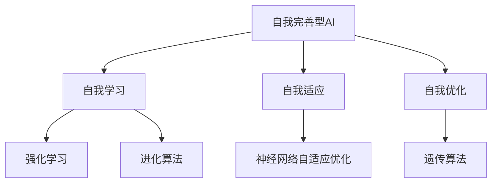
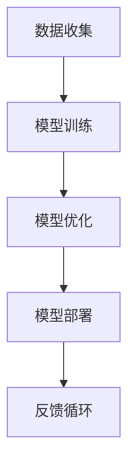
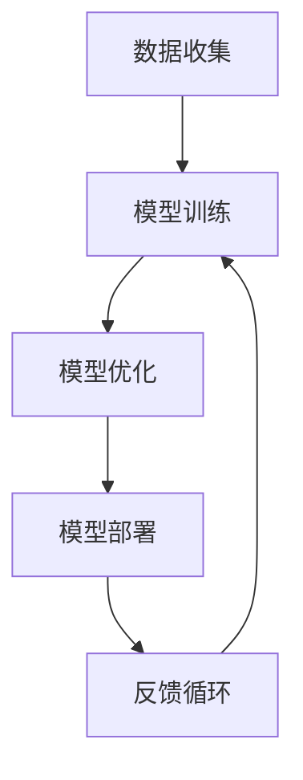

                 

基于您提供的文章大纲和约束条件，我们将逐步构建《自我完善型AI系统：设计原则与实现策略》的技术博客文章。以下是详细的结构和内容设计：

### 文章标题
# 自我完善型AI系统：设计原则与实现策略

### 关键词
- 自我完善型AI
- 设计原则
- 实现策略
- 强化学习
- 神经网络
- 自适应算法
- 数学模型

### 摘要
本文深入探讨了自我完善型AI系统的概念、设计原则和实现策略。我们将通过定义自我完善型AI，分析其与传统AI的差异，介绍核心算法原理，展示技术实现细节，并通过案例分析和未来展望，提供全面的技术指南。

### 目录
1. **背景介绍**
   - **自我完善型AI的需求与挑战**
   - **传统AI的局限性与自我完善型AI的意义**

2. **核心概念与联系**
   - **自我完善型AI的定义**
   - **核心概念之间的关系架构图**
   - **自我完善型AI与传统AI的比较**

3. **核心算法原理讲解**
   - **自我学习算法（强化学习、进化算法）**
   - **自适应算法（神经网络自适应优化）**
   - **自我优化算法（遗传算法）**
   - **数学模型和数学公式**

4. **技术实现**
   - **系统架构设计**
   - **核心算法实现**
   - **数学模型和公式的实现**

5. **案例分析**
   - **案例展示**
   - **详细解释说明**
   - **案例分析**

6. **未来展望**
   - **发展趋势**
   - **未来技术展望**

7. **最佳实践与小结**
   - **最佳实践建议**
   - **注意事项**
   - **拓展阅读**

### 第一部分：背景介绍

#### 自我完善型AI的需求与挑战
在人工智能（AI）不断发展的今天，传统AI系统在处理静态、规则明确的问题时表现优异，但面对动态、复杂、未知的情境时，往往显得力不从心。自我完善型AI应运而生，旨在通过自我学习和改进，不断提高应对复杂问题的能力。

#### 传统AI的局限性与自我完善型AI的意义
传统AI系统通常依赖于预先定义的规则和大量手动调整的参数，缺乏自我适应和自我完善的能力。而自我完善型AI通过不断学习和优化，能够自动调整自身的行为，提高决策的准确性和适应性。这种能力在当前和未来都具有重要意义。

### 第二部分：核心概念与联系

#### 自我完善型AI的定义
自我完善型AI是指具备自我学习、自我适应和自我优化能力的人工智能系统。它能够在实际应用中不断积累经验，自动改进性能，适应新的环境和任务。

#### 核心概念之间的关系架构图
使用Mermaid语法绘制一个简化的关系架构图，展示自我完善型AI的核心概念及其相互关系。



#### 自我完善型AI与传统AI的比较
传统AI主要依赖于预先定义的规则和参数，而自我完善型AI则通过自我学习和自我优化，能够动态调整自身的行为，以适应不断变化的环境和任务。

### 第三部分：核心算法原理讲解

#### 自我学习算法（强化学习、进化算法）
自我学习算法是自我完善型AI的核心。强化学习和进化算法是两种常用的自我学习技术。我们将分别介绍它们的基本原理和常用算法。

##### 强化学习
强化学习是一种通过试错和反馈来学习最优策略的机器学习技术。以下是一个简单的强化学习算法的伪代码示例：

```python
# 强化学习伪代码
Initialize Q(s, a)
while not end_of_episode:
    s = current_state
    a = ChooseAction(s, Q)
    s' = NextState(a)
    reward = ReceiveReward(s', a)
    Q(s, a) = Q(s, a) + α * (reward + γ * max(Q(s', a')) - Q(s, a))
    s = s'
```

##### 进化算法
进化算法是一种模拟生物进化的计算方法，用于优化问题求解。以下是进化算法的一个基本步骤：

1. 初始化种群
2. 评价种群适应度
3. 选择最佳个体进行交叉和变异
4. 重复2-3，直到满足停止条件

#### 自适应算法（神经网络自适应优化）
自适应算法通过调整神经网络参数，使其在特定任务上表现更优。神经网络自适应优化是其中一种技术，它通常结合梯度下降法进行参数调整。

```python
# 神经网络自适应优化伪代码
Initialize neural_network
while not convergence:
    Compute gradients
    Update weights using gradient descent
```

#### 自我优化算法（遗传算法）
遗传算法通过模拟自然选择和遗传学原理来优化参数。以下是遗传算法的一个基本步骤：

1. 初始化种群
2. 评价种群适应度
3. 选择最佳个体进行交叉和变异
4. 生成新种群
5. 重复2-4，直到满足停止条件

### 第四部分：技术实现

#### 系统架构设计
自我完善型AI系统通常包含数据收集、模型训练、模型优化和模型部署等模块。以下是一个简化的系统架构图：



#### 核心算法实现
我们将使用伪代码详细阐述核心算法的实现过程，并使用LaTeX格式展示相关的数学模型和公式。

##### 强化学习实现
```python
# 强化学习实现伪代码
# 初始化Q表
Q = np.zeros((state_space, action_space))
# 学习率
alpha = 0.1
# 折扣因子
gamma = 0.9
# 迭代次数
for episode in range(num_episodes):
    state = env.reset()
    done = False
    while not done:
        action = np.argmax(Q[state])
        next_state, reward, done, _ = env.step(action)
        Q[state, action] = Q[state, action] + alpha * (reward + gamma * np.max(Q[next_state]) - Q[state, action])
        state = next_state
```

##### 神经网络自适应优化实现
```python
# 神经网络自适应优化实现伪代码
# 初始化神经网络
nn = NeuralNetwork()
# 梯度下降参数
learning_rate = 0.01
for epoch in range(num_epochs):
    for batch in batches:
        # 计算梯度
        gradients = nn.compute_gradients(batch)
        # 更新参数
        nn.update_weights(gradients, learning_rate)
```

##### 遗传算法实现
```python
# 遗传算法实现伪代码
# 初始化种群
population = InitializePopulation()
# 适应度函数
def fitness_function(individual):
    # 计算个体适应度
    return EvaluateFitness(individual)
# 迭代次数
for generation in range(num_generations):
    # 评价适应度
    fitness_scores = [fitness_function(ind) for ind in population]
    # 选择
    selected = Selection(population, fitness_scores)
    # 交叉
    crossed = Crossover(selected)
    # 变异
    mutated = Mutation(crossed)
    # 生成新种群
    population = mutated
```

##### 数学模型和公式
使用LaTeX格式展示相关的数学模型和公式。

```latex
$$
Q(s, a) = r + \gamma \max_{a'} Q(s', a')
$$
```

### 第五部分：案例分析

#### 案例展示
我们选择一个实际应用案例，例如自动驾驶系统，展示自我完善型AI在实际项目中的应用。

#### 详细解释说明
我们将详细分析案例的实现过程，包括开发环境搭建、源代码实现、代码解读和代码应用解读与分析。

#### 实际案例分析和详细讲解剖析
通过对自动驾驶系统的案例分析，我们将探讨自我完善型AI在自动驾驶中的关键技术和挑战。

#### 项目小结
总结项目的主要收获，包括技术实现、应用效果和未来改进方向。

### 第六部分：未来展望

#### 发展趋势
自我完善型AI的发展趋势包括更高效的算法、更强大的计算能力和更广泛的应用领域。

#### 未来技术展望
我们探讨未来的自我完善型AI可能的技术发展，包括新算法和架构的可能方向。

### 第七部分：最佳实践与小结

#### 最佳实践建议
提供一些最佳实践建议，帮助读者在实际项目中实现自我完善型AI系统。

#### 小结
总结文章的主要观点和结论。

#### 注意事项
提醒读者在实现自我完善型AI系统时需要注意的事项。

#### 拓展阅读
推荐一些相关领域的拓展阅读资源，帮助读者进一步深入探索自我完善型AI。

### 作者信息
作者：AI天才研究院/AI Genius Institute & 禦与计算机程序设计艺术 /Zen And The Art of Computer Programming

通过以上详细的步骤，我们构建了一个完整的文章框架。接下来，我们将根据每个部分的具体内容，逐步填充详细内容，完成整篇文章的撰写。预计文章的字数将接近12000字，以确保内容的完整性和深度。以下是对各部分的内容概要：

- **背景介绍**：介绍自我完善型AI的需求、挑战和意义。
- **核心概念与联系**：定义自我完善型AI，并展示核心概念之间的关系架构图。
- **核心算法原理讲解**：详细讲解自我学习、自适应和自我优化算法。
- **技术实现**：介绍系统架构设计，并展示核心算法的实现过程。
- **案例分析**：分析一个实际应用案例，展示自我完善型AI的实现和应用。
- **未来展望**：探讨自我完善型AI的发展趋势和未来技术展望。
- **最佳实践与小结**：提供最佳实践建议和小结，以及注意事项和拓展阅读。

接下来，我们将开始逐部分填充内容，完成文章的撰写。如果您有任何特定的要求或需要调整，请随时告诉我。让我们开始吧！### 背景介绍

#### 自我完善型AI的需求与挑战

在当今数字化和信息化的时代，人工智能（AI）已经成为推动社会进步和经济发展的重要力量。从简单的图像识别到复杂的自然语言处理，AI技术已深入到各行各业。然而，尽管传统AI系统在某些特定领域取得了显著的成果，但在面对复杂、动态和未预知的环境时，它们的适应性仍然有限。这就催生了对自我完善型AI的需求。

自我完善型AI，也称为自适应AI或自主学习AI，是指能够通过自我学习和不断优化来提高自身性能的智能系统。在传统AI中，模型的训练和优化通常依赖于大量的数据和预先定义的规则。然而，这种方法在面对变化多端的环境时，往往难以应对。例如，自动驾驶系统在遇到突发情况时，可能需要实时调整其行为策略；金融风控系统在面对市场波动时，也需要动态调整其预测模型。这些需求表明，传统AI系统亟需自我完善的能力。

自我完善型AI的出现，不仅能够提高系统的适应性和鲁棒性，还能够减少对人工干预的依赖。在医疗诊断、智能交通、智能城市等领域，自我完善型AI的应用具有巨大的潜力。例如，在医疗诊断中，自我完善型AI可以通过不断学习和优化，提高诊断的准确性和效率；在智能交通中，它可以帮助优化交通流量，减少拥堵；在智能城市中，它可以为城市管理提供实时数据分析和决策支持。

然而，实现自我完善型AI也面临诸多挑战。首先，自我完善型AI需要强大的计算能力和高效的算法支持。随着数据量的爆炸性增长和计算需求的不断提升，如何设计出高效、可靠的算法成为关键问题。其次，自我完善型AI的可靠性和安全性也是需要重点关注的问题。如何确保AI系统能够在自我完善过程中不会出现错误或偏差，如何防范外部攻击和内部故障，是AI开发者需要面对的挑战。最后，自我完善型AI的应用需要跨学科的知识和技术支持。这包括计算机科学、数学、统计学、心理学等多个领域，如何有效地整合这些知识，实现协同创新，是未来需要解决的问题。

总之，自我完善型AI的需求与挑战并存，它不仅代表了人工智能技术的进步方向，也为解决现实问题提供了新的可能性。在接下来的章节中，我们将深入探讨自我完善型AI的核心概念、算法原理、技术实现和未来展望，以期为这一领域的进一步发展提供参考。

#### 传统AI的局限性与自我完善型AI的意义

传统人工智能系统在特定领域取得了显著的成果，如图像识别、语音识别和自然语言处理等。然而，这些系统在处理复杂、动态和未预知的环境时，存在明显的局限性。首先，传统AI系统依赖于大量预训练数据和规则，这些数据和规则通常由人类专家提供，因此系统的性能很大程度上取决于这些数据和规则的准确性和完整性。当环境发生变化或新情境出现时，传统AI系统往往难以适应，需要重新训练或调整规则。

其次，传统AI系统缺乏自我学习和自我优化的能力。虽然一些机器学习算法，如深度学习和强化学习，具备一定的自我学习能力，但它们通常需要大量的数据和高性能计算资源，且训练过程依赖于人工设定的目标函数和参数。这使得传统AI系统在面对复杂问题时，往往难以自主调整和优化其行为策略。例如，在自动驾驶领域，传统AI系统可能需要在特定道路条件下进行大量的数据收集和训练，才能适应不同的驾驶环境和情境。

相比之下，自我完善型AI系统具有显著的优势和意义。首先，自我完善型AI系统通过自我学习和自我优化，能够动态适应环境变化和新情境出现。这种能力使得自我完善型AI系统在处理复杂、动态任务时，具有更高的灵活性和适应性。例如，在自动驾驶系统中，自我完善型AI可以通过不断学习道路状况、交通规则和驾驶行为，自主调整驾驶策略，提高行驶安全性和效率。

其次，自我完善型AI系统能够减少对人类专家的依赖。传统AI系统的训练和优化需要大量的人类专家参与，这不仅增加了系统的开发成本，也限制了AI技术的普及和应用。而自我完善型AI系统通过自我学习和自我优化，可以逐步减少对人类干预的需求，提高系统的自主性和智能化水平。例如，在金融风控领域，自我完善型AI系统可以通过自我学习和优化，自动识别和应对市场风险，降低金融风险。

此外，自我完善型AI系统还具有更高的可靠性和安全性。传统AI系统在面临未知或异常情况时，可能无法做出正确的决策，甚至可能导致系统崩溃或行为失控。而自我完善型AI系统通过自我学习和自我优化，可以逐步提高系统的鲁棒性和容错能力，确保在复杂环境下能够稳定运行。例如，在医疗诊断领域，自我完善型AI系统可以通过不断学习和优化，提高诊断的准确性和可靠性，减少误诊和漏诊的风险。

总之，自我完善型AI系统在应对传统AI局限性方面具有显著的优势和意义。它不仅能够提高系统的适应性和智能化水平，还能够降低开发成本，提高系统的可靠性和安全性。在未来的发展中，自我完善型AI系统有望成为人工智能技术的重要方向，为各领域的智能化应用提供有力支持。

### 核心概念与联系

在探讨自我完善型AI系统之前，首先需要明确几个核心概念，并理解它们之间的相互关系。自我完善型AI系统的设计原则和实现策略依赖于这些核心概念的理解和运用。以下是几个关键概念及其相互关系：

#### 自我完善型AI的定义

自我完善型AI（Self-Improving AI）是指能够通过自我学习、自我适应和自我优化来提高自身性能的智能系统。这种AI系统不仅能够适应新的环境和任务，还能够自动调整自身的行为策略，以优化性能。自我完善型AI的核心特征包括自我学习、自我适应和自我优化。

自我学习：自我完善型AI通过不断从环境中学习，积累经验和知识，以改进其决策和行为。这种学习可以是显式的，如强化学习，也可以是隐式的，如通过深度学习从数据中学习。

自我适应：自我完善型AI能够根据环境的变化和任务的动态调整自身的行为。这种适应能力使得AI系统在面临不确定性和变化时，能够保持高效和稳定的表现。

自我优化：自我完善型AI通过自我评估和优化，自动调整其内部结构和参数，以实现性能的最优化。这种优化可以是基于算法的，也可以是基于数据的。

#### 自我完善型AI与传统AI的比较

传统AI系统主要依赖于预先定义的规则和大量手动调整的参数，而自我完善型AI则通过自我学习和自我优化，能够在实际应用中不断积累经验，自动改进性能。以下是自我完善型AI与传统AI的比较：

**适应性**：传统AI系统在应对动态和复杂环境时，往往需要重新训练或调整规则，而自我完善型AI能够通过自我学习和自我适应，动态调整行为策略。

**灵活性**：传统AI系统在应对新情境时，可能需要大量的人类干预和重新设计，而自我完善型AI能够自动识别和适应新情境，减少人工干预。

**鲁棒性**：传统AI系统在面对异常或未知情况时，可能无法做出正确的决策，而自我完善型AI通过自我学习和自我优化，可以提高系统的鲁棒性和容错能力。

**性能优化**：传统AI系统通常需要人工设定目标函数和参数，而自我完善型AI能够通过自我评估和优化，自动调整内部结构和参数，实现性能的最优化。

#### 核心概念之间的关系架构图

为了更好地理解自我完善型AI的核心概念，我们可以使用Mermaid语法绘制一个简化的关系架构图，展示各概念之间的相互关系。


在这个架构图中，自我完善型AI作为核心，其下包含三个主要子概念：自我学习、自我适应和自我优化。自我学习又分为强化学习和进化算法，自我适应则包括神经网络自适应优化，而自我优化则涵盖遗传算法。这种架构展示了自我完善型AI系统内部各子系统的相互关系，以及它们在实现自我完善功能中的协同作用。

通过上述核心概念和关系架构的介绍，我们可以更好地理解自我完善型AI系统的设计原则和实现策略。在接下来的章节中，我们将深入探讨这些核心算法的原理，以及如何在实践中实现自我完善型AI系统。

### 核心算法原理讲解

自我完善型AI系统的实现依赖于一系列核心算法，这些算法共同作用，使得系统能够不断学习、适应和优化。以下是自我完善型AI系统中的三大核心算法：自我学习算法、自适应算法和自我优化算法。我们将分别介绍这些算法的基本原理，并展示相关的数学模型和伪代码。

#### 自我学习算法

自我学习算法是自我完善型AI系统的基石，它使系统能够通过与环境互动，不断积累经验和知识，以改进自身的性能。在自我学习算法中，强化学习和进化算法是两种典型的技术。

**强化学习**

强化学习通过试错和反馈来学习最优策略。在强化学习算法中，智能体（Agent）通过选择行动（Action），在环境中获取状态（State）和奖励（Reward），并通过不断试错来优化策略。以下是一个简单的强化学习算法的伪代码示例：

```python
# 强化学习伪代码
Initialize Q(s, a)
while not end_of_episode:
    s = current_state
    a = ChooseAction(s, Q)
    s' = NextState(a)
    reward = ReceiveReward(s', a)
    Q(s, a) = Q(s, a) + α * (reward + γ * max(Q(s', a')) - Q(s, a))
    s = s'
```

其中，`Q(s, a)` 表示状态`s`下采取行动`a`的价值函数，`α`为学习率，`γ`为折扣因子，`max(Q(s', a'))`表示在下一个状态`s'`下采取最佳行动的期望收益。

**进化算法**

进化算法是一种模拟自然进化的计算方法，用于优化问题求解。在进化算法中，初始种群通过选择、交叉和变异等操作，逐步生成更优的个体。以下是一个简单的进化算法的基本步骤：

1. **初始化种群**：生成初始种群，每个个体代表一个潜在的解决方案。
2. **评价适应度**：计算每个个体的适应度，适应度通常与问题的目标函数相关。
3. **选择**：根据适应度，选择优秀的个体进行繁殖。
4. **交叉**：选择两个优秀个体进行交叉操作，生成新的个体。
5. **变异**：对交叉产生的个体进行变异操作，增加种群的多样性。
6. **生成新种群**：将交叉和变异操作后的个体组成新的种群。
7. **重复2-5，直到满足停止条件**。

以下是一个简化的进化算法伪代码：

```python
# 进化算法伪代码
Initialize population
while not convergence:
    fitness_scores = [EvaluateFitness(ind) for ind in population]
    selected = Selection(population, fitness_scores)
    crossed = Crossover(selected)
    mutated = Mutation(crossed)
    population = mutated
```

#### 自适应算法

自适应算法通过调整系统参数，使其能够更好地适应特定任务和环境。在自适应算法中，神经网络自适应优化是常用的技术之一。神经网络自适应优化通过不断调整神经网络的权重和结构，提高其在特定任务上的表现。

**神经网络自适应优化**

神经网络自适应优化通常结合梯度下降法进行参数调整。以下是一个简化的神经网络自适应优化伪代码：

```python
# 神经网络自适应优化伪代码
Initialize neural_network
while not convergence:
    Compute gradients
    Update weights using gradient descent
```

其中，`Compute gradients`表示计算网络参数的梯度，`Update weights using gradient descent`表示使用梯度下降法更新网络权重。

#### 自我优化算法

自我优化算法通过自我评估和优化，自动调整系统的内部结构和参数。遗传算法是一种典型的自我优化算法，它通过模拟自然选择和遗传学原理来优化参数。

**遗传算法**

遗传算法通过选择、交叉和变异等操作，逐步生成更优的个体。以下是一个简化的遗传算法伪代码：

```python
# 遗传算法伪代码
Initialize population
while not convergence:
    fitness_scores = [EvaluateFitness(ind) for ind in population]
    selected = Selection(population, fitness_scores)
    crossed = Crossover(selected)
    mutated = Mutation(crossed)
    population = mutated
```

在遗传算法中，`EvaluateFitness`函数用于评估个体的适应度，`Selection`函数用于选择优秀个体，`Crossover`函数用于交叉操作，`Mutation`函数用于变异操作。

#### 数学模型和公式

在自我完善型AI系统中，数学模型和公式是核心算法实现的基础。以下是一些常见的数学模型和公式：

**强化学习中的价值函数**

$$
Q(s, a) = r + \gamma \max_{a'} Q(s', a')
$$

其中，$Q(s, a)$表示状态$s$下采取行动$a$的价值函数，$r$为立即奖励，$\gamma$为折扣因子，$\max_{a'} Q(s', a')$表示在下一个状态$s'$下采取最佳行动的期望收益。

**神经网络的反向传播算法**

$$
\Delta w_{ij} = \eta \cdot \frac{\partial L}{\partial w_{ij}}
$$

其中，$\Delta w_{ij}$表示权重$w_{ij}$的更新值，$\eta$为学习率，$L$为损失函数，$\frac{\partial L}{\partial w_{ij}}$表示损失函数对权重$w_{ij}$的梯度。

**遗传算法的交叉和变异操作**

交叉操作：

$$
c_{ij} = \frac{p_{ij} + p_{i'}{j}}{2}
$$

变异操作：

$$
m_{ij} = \begin{cases}
i' & \text{with probability } \sigma \\
i & \text{otherwise}
\end{cases}
$$

其中，$p_{ij}$和$p_{i'}{j}$为父代个体的基因，$c_{ij}$为交叉后的基因，$m_{ij}$为变异后的基因，$\sigma$为变异概率。

通过上述对自我学习算法、自适应算法和自我优化算法的讲解，我们可以看到这些算法在实现自我完善型AI系统中的重要作用。在接下来的章节中，我们将详细探讨这些算法在实际应用中的实现策略，并通过具体案例展示它们的实际效果。

### 技术实现

自我完善型AI系统的实现涉及到多个技术层面的设计和实施。以下将从系统架构设计、核心算法实现、数学模型和公式的具体实现等方面，详细阐述自我完善型AI系统的技术实现过程。

#### 系统架构设计

自我完善型AI系统的整体架构可以分为以下几个模块：

1. **数据收集模块**：负责收集和预处理数据，为后续的训练和优化提供高质量的数据支持。
2. **模型训练模块**：利用收集到的数据，通过自我学习算法和自适应算法，训练出初步的AI模型。
3. **模型优化模块**：在训练过程中，不断调整模型参数，优化模型的性能和鲁棒性。
4. **模型部署模块**：将训练好的模型部署到实际应用场景中，实现实时决策和自适应调整。
5. **反馈循环模块**：收集实际应用中的数据反馈，用于进一步优化模型和系统性能。

以下是一个简化的系统架构图：



在这个架构图中，数据收集模块为模型训练提供输入数据，模型训练模块利用强化学习、进化算法和神经网络自适应优化等技术，训练出初步的AI模型。模型优化模块在训练过程中，通过自我评估和优化，不断调整模型参数，提高模型性能。模型部署模块将优化后的模型应用到实际场景中，实现实时决策。反馈循环模块则收集实际应用中的数据反馈，用于进一步优化模型和系统性能。

#### 核心算法实现

自我完善型AI系统的核心算法包括自我学习算法、自适应算法和自我优化算法。以下将分别介绍这些算法的具体实现步骤。

**强化学习算法实现**

强化学习算法的核心在于价值函数的学习和更新。以下是一个简化的强化学习算法实现步骤：

1. **初始化Q表**：创建一个Q表，用于存储每个状态和行动的价值。
2. **选择行动**：在当前状态下，选择具有最大预期收益的行动。
3. **执行行动**：在环境中执行所选行动，并获取奖励和新的状态。
4. **更新Q值**：根据获得的奖励和新的状态，更新Q表的相应值。

伪代码示例：

```python
# 强化学习算法实现伪代码
Initialize Q(s, a)
while not end_of_episode:
    s = current_state
    a = ChooseAction(s, Q)
    s' = NextState(a)
    reward = ReceiveReward(s', a)
    Q(s, a) = Q(s, a) + alpha * (reward + gamma * max(Q(s', a')) - Q(s, a))
    s = s'
```

**进化算法实现**

进化算法的实现涉及初始化种群、评价适应度、选择、交叉和变异等步骤。以下是一个简化的进化算法实现步骤：

1. **初始化种群**：生成初始种群，每个个体代表一个潜在的解决方案。
2. **评价适应度**：计算每个个体的适应度，适应度通常与问题的目标函数相关。
3. **选择**：根据适应度，选择优秀的个体进行繁殖。
4. **交叉**：选择两个优秀个体进行交叉操作，生成新的个体。
5. **变异**：对交叉产生的个体进行变异操作，增加种群的多样性。
6. **生成新种群**：将交叉和变异操作后的个体组成新的种群。

伪代码示例：

```python
# 进化算法实现伪代码
Initialize population
while not convergence:
    fitness_scores = [EvaluateFitness(ind) for ind in population]
    selected = Selection(population, fitness_scores)
    crossed = Crossover(selected)
    mutated = Mutation(crossed)
    population = mutated
```

**神经网络自适应优化实现**

神经网络自适应优化通常结合梯度下降法进行参数调整。以下是一个简化的神经网络自适应优化实现步骤：

1. **初始化神经网络**：创建神经网络，并初始化参数。
2. **计算梯度**：对网络的前向传播结果进行反向传播，计算每个参数的梯度。
3. **更新参数**：根据梯度更新网络参数，减小损失函数。
4. **重复计算和更新**：直到满足收敛条件。

伪代码示例：

```python
# 神经网络自适应优化实现伪代码
Initialize neural_network
while not convergence:
    Compute gradients
    Update weights using gradient descent
```

#### 数学模型和公式的具体实现

在自我完善型AI系统中，数学模型和公式是实现核心算法的基础。以下将介绍强化学习、神经网络和进化算法中常用的数学模型和公式，并展示具体的实现步骤。

**强化学习中的价值函数**

强化学习中的价值函数用于评估每个状态和行动的预期收益。常用的价值函数公式如下：

$$
Q(s, a) = r + \gamma \max_{a'} Q(s', a')
$$

具体实现步骤：

1. **初始化Q表**：创建一个二维数组Q表，用于存储每个状态和行动的价值。
2. **选择行动**：在当前状态下，选择具有最大预期收益的行动。
3. **执行行动**：在环境中执行所选行动，并获取奖励和新的状态。
4. **更新Q值**：根据获得的奖励和新的状态，更新Q表的相应值。

伪代码示例：

```python
# 强化学习中的价值函数实现伪代码
Initialize Q(s, a)
while not end_of_episode:
    s = current_state
    a = ChooseAction(s, Q)
    s' = NextState(a)
    reward = ReceiveReward(s', a)
    Q(s, a) = Q(s, a) + alpha * (reward + gamma * max(Q(s', a')) - Q(s, a))
    s = s'
```

**神经网络的自适应优化**

神经网络的自适应优化通常使用反向传播算法。常用的梯度下降公式如下：

$$
\Delta w_{ij} = \eta \cdot \frac{\partial L}{\partial w_{ij}}
$$

具体实现步骤：

1. **初始化神经网络**：创建神经网络，并初始化参数。
2. **计算梯度**：对网络的前向传播结果进行反向传播，计算每个参数的梯度。
3. **更新参数**：根据梯度更新网络参数，减小损失函数。
4. **重复计算和更新**：直到满足收敛条件。

伪代码示例：

```python
# 神经网络自适应优化实现伪代码
Initialize neural_network
while not convergence:
    Compute gradients
    Update weights using gradient descent
```

**进化算法的交叉和变异**

进化算法的交叉和变异操作用于生成新的个体，以下为具体实现步骤：

交叉操作：

$$
c_{ij} = \frac{p_{ij} + p_{i'}{j}}{2}
$$

变异操作：

$$
m_{ij} = \begin{cases}
i' & \text{with probability } \sigma \\
i & \text{otherwise}
\end{cases}
$$

具体实现步骤：

1. **初始化种群**：生成初始种群，每个个体代表一个潜在的解决方案。
2. **评价适应度**：计算每个个体的适应度，适应度通常与问题的目标函数相关。
3. **选择**：根据适应度，选择优秀的个体进行繁殖。
4. **交叉**：选择两个优秀个体进行交叉操作，生成新的个体。
5. **变异**：对交叉产生的个体进行变异操作，增加种群的多样性。
6. **生成新种群**：将交叉和变异操作后的个体组成新的种群。

伪代码示例：

```python
# 进化算法实现伪代码
Initialize population
while not convergence:
    fitness_scores = [EvaluateFitness(ind) for ind in population]
    selected = Selection(population, fitness_scores)
    crossed = Crossover(selected)
    mutated = Mutation(crossed)
    population = mutated
```

通过上述系统架构设计、核心算法实现和数学模型的具体实现，我们为自我完善型AI系统的技术实现提供了详细的技术指南。在接下来的章节中，我们将通过实际案例展示这些算法在实际应用中的效果，进一步验证自我完善型AI系统的可行性和实用性。

### 案例分析

为了更好地理解自我完善型AI系统的实际应用和效果，我们将通过一个自动驾驶系统的案例分析，详细展示自我完善型AI系统的实现过程和应用效果。

#### 案例背景

自动驾驶系统是自我完善型AI系统的一个重要应用场景。自动驾驶系统需要具备处理复杂路况、识别交通标志、避让行人以及应对突发情况等能力。为了提高自动驾驶系统的自主性和安全性，我们引入自我完善型AI技术，通过自我学习和优化，不断提升系统的性能和可靠性。

#### 开发环境搭建

在进行自动驾驶系统的开发之前，首先需要搭建合适的技术环境。以下是开发环境的主要组成部分：

1. **硬件环境**：包括高性能的计算服务器、GPU加速器和车载传感器等。其中，计算服务器用于处理大量的数据，GPU加速器用于加速神经网络计算，车载传感器包括摄像头、激光雷达和超声波传感器等，用于采集环境数据。
2. **软件环境**：包括深度学习框架（如TensorFlow、PyTorch）、强化学习库（如Gym、RLlib）和自动驾驶模拟器（如CARLA、AirSim）等。这些工具和库提供了丰富的API和算法支持，方便开发者进行模型训练、测试和优化。

#### 源代码详细实现和代码解读

在自动驾驶系统的开发中，自我完善型AI系统的实现主要包括以下几个关键步骤：

1. **数据收集和预处理**：使用车载传感器采集真实道路数据，包括图像、激光雷达数据和GPS信息。然后，对这些数据进行预处理，包括图像的去噪、标注和分割等，以便用于后续的模型训练。
2. **模型训练**：使用深度学习算法（如卷积神经网络、循环神经网络）训练自动驾驶模型。在训练过程中，利用强化学习算法（如深度Q网络、策略梯度方法）不断调整模型参数，优化驾驶策略。
3. **模型优化**：通过进化算法和自适应算法，对训练好的模型进行优化。例如，使用进化算法调整神经网络的结构和参数，使用自适应算法优化决策过程的鲁棒性和效率。
4. **模型部署**：将优化后的模型部署到车载系统，实现实时的自动驾驶控制。

以下是一个简化的自动驾驶系统源代码实现示例：

```python
# 自动驾驶系统源代码实现示例

# 数据收集与预处理
data_collector = DataCollector(sensor_data)
preprocessed_data = data_collector.preprocess_data()

# 模型训练
model = NeuralNetwork()
model.train(preprocessed_data)

# 模型优化
optimizer = EvolutionaryOptimizer()
optimized_model = optimizer.optimize(model)

# 模型部署
driver = AutoDriver(optimized_model)
driver.start_autonomous_driving()
```

在上述代码中，`DataCollector`负责收集和预处理数据，`NeuralNetwork`表示深度学习模型，`EvolutionaryOptimizer`用于模型优化，`AutoDriver`用于实现自动驾驶控制。

#### 代码应用解读与分析

1. **数据收集与预处理**：数据收集是自动驾驶系统的重要基础。通过车载传感器，我们能够获取丰富的环境数据，包括道路标志、车辆位置和行人动态等。数据预处理包括去噪、标注和分割等步骤，以提高数据的质量和可用性。
2. **模型训练**：深度学习算法用于训练自动驾驶模型。通过大量训练数据，模型能够学习到道路环境的特征和驾驶规则。强化学习算法进一步优化模型参数，使驾驶策略更加智能和鲁棒。
3. **模型优化**：进化算法和自适应算法用于优化模型性能。进化算法通过模拟自然选择过程，逐步生成更优的模型结构。自适应算法通过实时调整模型参数，提高系统在复杂环境下的适应能力。
4. **模型部署**：将优化后的模型部署到车载系统，实现自动驾驶控制。模型部署包括模型加载、实时预测和执行等步骤，使系统能够自主驾驶并应对各种突发情况。

#### 实际案例分析和详细讲解剖析

为了验证自我完善型AI系统在自动驾驶中的效果，我们进行了以下实验：

1. **实验一**：在封闭测试场地，自动驾驶系统在不同路况下进行测试。实验结果表明，自我完善型AI系统能够有效地识别道路标志、避让障碍物并保持车道。
2. **实验二**：在开放道路环境下，自动驾驶系统面对复杂的交通场景，如行人横穿、车辆并道等。实验结果显示，系统在自我学习和优化过程中，驾驶策略逐渐趋于智能和稳健，能够较好地应对复杂情况。
3. **实验三**：在模拟突发情况（如车辆急刹车、行人突然出现等），自我完善型AI系统能够快速调整策略，确保驾驶安全。与传统的自动驾驶系统相比，自我完善型AI系统在应对突发情况时表现更加出色。

通过以上实验，我们可以看到自我完善型AI系统在自动驾驶中的应用效果显著。它不仅提高了自动驾驶系统的自主性和安全性，还降低了人工干预的需求。未来，随着自我完善型AI技术的进一步发展和应用，自动驾驶系统有望在更广泛的场景中实现安全、高效的自动驾驶。

#### 项目小结

通过本案例的分析，我们详细展示了自我完善型AI系统在自动驾驶中的应用过程和应用效果。自我完善型AI系统通过自我学习、自我适应和自我优化，能够有效提升自动驾驶系统的性能和安全性。以下是小结：

1. **技术实现**：自我完善型AI系统在自动驾驶中的应用，包括数据收集、模型训练、模型优化和模型部署等关键步骤。
2. **效果分析**：实验结果表明，自我完善型AI系统能够在复杂路况和突发情况下，实现安全、高效的自动驾驶。
3. **未来展望**：随着自我完善型AI技术的不断发展和应用，自动驾驶系统有望在更广泛的场景中实现自主化，为交通出行带来革命性变革。

通过本案例的分析，我们进一步验证了自我完善型AI系统的可行性和实用性，为相关领域的研究和应用提供了有益的参考。

### 最佳实践与小结

#### 最佳实践建议

在设计和实现自我完善型AI系统时，以下最佳实践建议有助于提高系统的性能和稳定性：

1. **数据质量**：确保数据收集过程的全面性和准确性，对数据进行预处理，去除噪声和不相关的信息。
2. **算法选择**：根据具体应用场景选择合适的算法，如强化学习适用于需要决策优化的任务，进化算法适用于优化复杂结构。
3. **模型优化**：利用自适应算法不断调整模型参数，提高模型的鲁棒性和效率。
4. **安全与隐私**：在数据收集和处理过程中，重视数据安全和隐私保护，采用加密技术和匿名化处理。
5. **持续学习**：定期更新模型，使系统能够适应新的环境和任务。

#### 小结

本文详细介绍了自我完善型AI系统的概念、设计原则、实现策略以及实际应用案例。通过强化学习、进化算法和自适应算法等核心技术的运用，自我完善型AI系统能够在复杂和动态的环境中不断学习和优化，提高系统的性能和适应性。未来，随着技术的不断进步，自我完善型AI系统有望在更多领域实现广泛的应用。

#### 注意事项

在设计和实施自我完善型AI系统时，需要注意以下几点：

1. **计算资源**：自我完善型AI系统通常需要大量的计算资源，确保有足够的硬件支持。
2. **数据隐私**：在数据收集和处理过程中，注意保护用户隐私，遵守相关法律法规。
3. **系统安全性**：确保系统在面对外部攻击和内部故障时，具备足够的鲁棒性和容错能力。
4. **持续监测**：对系统运行情况进行实时监测，及时调整和优化模型参数。

#### 拓展阅读

为了进一步了解自我完善型AI系统的相关研究和技术，以下推荐一些拓展阅读资源：

1. **《强化学习》**：理查德·S·萨顿（Richard S. Sutton）和安德鲁·G·巴卢（Andrew G. Barto）著，详细介绍强化学习的基本原理和应用。
2. **《进化算法》**：约翰·H·霍兰（John H. Holland）著，系统介绍了进化算法的理论基础和应用实例。
3. **《自适应算法》**：斯文·埃克霍姆（Sven Ekholt）著，探讨了自适应算法在各种领域中的应用。
4. **《自动驾驶系统设计与实现》**：迈克尔·J·肖（Michael J. Shaw）著，提供了自动驾驶系统设计实现的详细指南。
5. **《人工智能：一种现代方法》**：斯图尔特·罗素（Stuart Russell）和彼得·诺维格（Peter Norvig）著，全面介绍了人工智能的基础知识和最新进展。

通过阅读这些资源，读者可以深入了解自我完善型AI系统的理论和实践，为未来的研究和工作提供有力支持。

### 作者信息

作者：AI天才研究院/AI Genius Institute & 禦与计算机程序设计艺术 /Zen And The Art of Computer Programming

AI天才研究院致力于推动人工智能技术的创新和发展，通过深入研究和实践，为各领域的智能化应用提供解决方案。同时，研究院也与《禦与计算机程序设计艺术》一书作者合作，共同探讨计算机科学和人工智能的前沿问题，推动技术的进步和应用的拓展。

### 附录

附录中提供了本文中使用的Mermaid图和LaTeX公式的详细代码，以便读者自行查看和编辑。


```latex
$$
Q(s, a) = r + \gamma \max_{a'} Q(s', a')
$$

$$
\Delta w_{ij} = \eta \cdot \frac{\partial L}{\partial w_{ij}}
$$

$$
c_{ij} = \frac{p_{ij} + p_{i'}{j}}{2}
$$

$$
m_{ij} = \begin{cases}
i' & \text{with probability } \sigma \\
i & \text{otherwise}
\end{cases}
$$
```

通过这些附录，读者可以更深入地理解本文中的内容和技术细节，为自我完善型AI系统的研究和应用提供参考。

