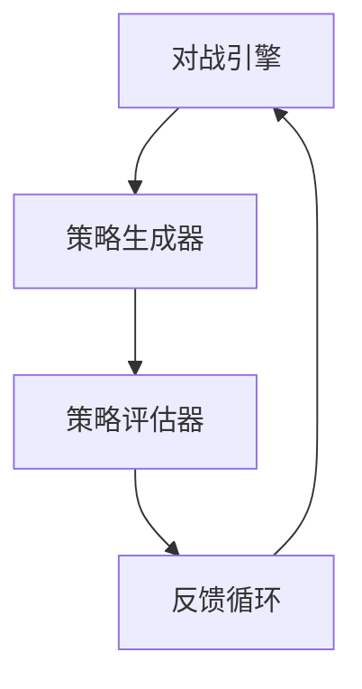

                 

### 文章标题：自我对弈：AI持续进化的有效途径

#### 关键词：
- 自我对弈
- AI进化
- 强化学习
- 遗传算法
- 神经网络
- 智能算法

#### 摘要：
本文将深入探讨自我对弈作为人工智能（AI）持续进化的有效途径。通过分析自我对弈的基本概念、核心算法原理以及具体实施策略，我们将揭示自我对弈在提升AI自我学习能力、适应能力和创新性方面的巨大潜力。文章结构分为引言、基本概念、算法原理、数学模型、项目实战和总结六个部分，旨在为读者提供全面、详实的自我对弈技术解读和应用指南。

---

### 引言

人工智能（AI）的发展已经取得了显著的成就，从语音识别、图像处理到自动驾驶和医疗诊断，AI技术的应用正在不断拓展。然而，AI的进化并非一蹴而就，持续进化是保持其竞争力的关键。自我对弈作为一种创新性的技术手段，正逐渐成为AI持续进化的有效途径。

自我对弈是指AI系统通过模拟对战来不断优化自身性能的过程。在这一过程中，AI不仅能够学习对手的策略，还能够反思和改进自己的策略，从而实现自我进化。自我对弈的核心优势在于其能够模拟复杂环境，通过不断的试错和优化，提升AI的适应能力和创新能力。

本文将从以下几个方面展开讨论：

1. **自我对弈的基本概念**：介绍自我对弈的定义、意义和应用领域。
2. **AI持续进化的需求**：分析AI持续进化的背景和必要性。
3. **自我对弈的架构**：阐述自我对弈的基本架构和工作流程。
4. **核心算法原理**：详细讲解自我对弈中的关键算法，包括强化学习和遗传算法。
5. **数学模型和公式**：介绍自我对弈中的数学模型和关键公式。
6. **项目实战**：通过实际案例展示自我对弈的实施过程和效果。
7. **总结与展望**：总结自我对弈在AI持续进化中的作用和未来发展趋势。

---

### 自我对弈的基本概念

自我对弈是人工智能（AI）系统通过模拟对战来不断优化自身性能的过程。它不仅限于简单的棋类游戏，还广泛应用于机器人竞技、策略游戏和智能决策等领域。自我对弈的核心在于通过不断的试错和优化，实现AI的自我进化。

#### 定义

自我对弈（Self-Play）是指AI系统与自身或其他AI系统进行对战，通过对战结果反馈来调整和优化自身的策略和模型。这种过程类似于人类通过实践和反思来提升自己的技能。

#### 意义

自我对弈在AI持续进化中具有重要意义，主要表现在以下几个方面：

1. **自我学习能力**：通过自我对弈，AI系统能够自主学习和改进策略，提高对复杂环境的适应能力。
2. **创新能力**：自我对弈可以激发AI的创新思维，推动算法和模型的不断进步。
3. **性能优化**：通过对战结果的反馈，AI系统能够识别并消除自身的弱点，实现性能的持续优化。

#### 应用领域

自我对弈的应用领域非常广泛，包括但不限于：

1. **棋类游戏**：如围棋、国际象棋和五子棋等。
2. **机器人竞技**：如机器人足球、无人机竞技等。
3. **策略游戏**：如战略游戏、角色扮演游戏等。
4. **智能决策**：如金融交易、供应链管理、医疗诊断等。

---

### 自我对弈的架构

自我对弈的架构是设计和实现自我对弈系统的基础。一个典型的自我对弈系统通常包括以下几个核心组件：

#### 1. 对战引擎

对战引擎是自我对弈系统的核心，负责管理对战过程。它包括对战规则的制定、对战结果的记录和评估等。

#### 2. 策略生成器

策略生成器负责根据AI系统的当前状态生成最佳策略。策略生成器通常基于深度学习、强化学习或遗传算法等技术。

#### 3. 策略评估器

策略评估器用于评估AI系统所生成策略的有效性。它通过对战结果、策略执行过程中的状态变化等因素进行综合评估，为策略生成器提供反馈。

#### 4. 反馈循环

反馈循环是自我对弈的关键机制，通过对战结果的反馈，不断调整和优化AI系统的策略和模型。

#### Mermaid流程图

以下是一个简单的Mermaid流程图，展示了自我对弈的基本架构：



---

### AI持续进化的需求

随着AI技术的不断进步，其应用领域也在不断扩展。然而，AI的进化并非一成不变，持续进化是保持其竞争力的关键。以下是AI持续进化的几个需求：

#### 1. 复杂环境的适应性

现实世界是一个高度复杂和动态变化的系统，AI系统需要具备在复杂环境中生存和发展的能力。自我对弈通过模拟复杂环境，帮助AI系统适应不同的情境。

#### 2. 创新能力的提升

自我对弈可以激发AI系统的创新能力，推动算法和模型的不断进步。在自我对弈的过程中，AI系统可以通过对战学习和反思，提出新的策略和方法。

#### 3. 性能的优化

自我对弈可以帮助AI系统识别和消除自身的弱点，实现性能的持续优化。通过对战结果的反馈，AI系统可以不断调整和改进策略，提高整体的性能。

#### 4. 持续学习的需求

AI系统需要具备持续学习的能力，以适应不断变化的环境和需求。自我对弈提供了一种有效的持续学习机制，通过不断的对战和反思，AI系统可以实现自我进化。

---

### 核心算法原理

自我对弈系统中的核心算法原理包括强化学习、遗传算法和神经网络等。以下是这些算法的基本原理和实现方法。

#### 1. 强化学习

强化学习是一种通过奖励和惩罚来驱动智能体学习目标的方法。在自我对弈中，强化学习用于生成和评估策略。

**基本原理：**

- **状态（State）**：描述当前环境的状态。
- **动作（Action）**：智能体可以采取的动作。
- **奖励（Reward）**：动作执行后获得的奖励。
- **策略（Policy）**：智能体采取的动作序列。

**实现方法：**

- **Q-learning**：通过更新Q值来学习最佳策略。
  
  $$Q(s, a) = r + \gamma \max_{a'} Q(s', a')$$

- **Policy Gradient**：直接优化策略的梯度。

  $$\nabla_\theta J(\theta) = \nabla_\theta \sum_{s,a} \pi(\theta)(s,a) \log \pi(\theta)(s,a) R(s,a)$$

#### 2. 遗传算法

遗传算法是一种模拟生物进化过程的优化算法。在自我对弈中，遗传算法用于生成和优化策略。

**基本原理：**

- **种群（Population）**：初始解的集合。
- **适应度（Fitness）**：解的质量评估。
- **选择（Selection）**：根据适应度选择优秀的解。
- **交叉（Crossover）**：生成新的解。
- **变异（Mutation）**：对解进行随机修改。

**实现方法：**

- **选择**：轮盘赌选择、锦标赛选择等。
- **交叉**：单点交叉、多点交叉等。
- **变异**：随机变异、均匀变异等。

#### 3. 神经网络

神经网络是一种模拟人脑信息处理能力的计算模型。在自我对弈中，神经网络用于生成和评估策略。

**基本原理：**

- **层（Layer）**：包括输入层、隐藏层和输出层。
- **神经元（Neuron）**：计算单元。
- **激活函数（Activation Function）**：引入非线性。

**实现方法：**

- **前向传播（Forward Propagation）**：计算输入和权重之间的关系。
- **反向传播（Back Propagation）**：更新权重以优化网络性能。

$$
\Delta w = \alpha \nabla_{w}J(w)
$$

---

### 数学模型和公式

在自我对弈中，数学模型和公式是核心组成部分，它们用于描述和优化AI系统的策略。以下是几个关键的数学模型和公式。

#### 1. 强化学习中的Q值更新

强化学习中的Q值更新是核心过程，用于根据奖励和历史经验调整策略。

$$
Q(s, a) = r + \gamma \max_{a'} Q(s', a')
$$

其中，\(Q(s, a)\) 是在状态 \(s\) 下采取动作 \(a\) 的预期奖励，\(r\) 是即时奖励，\(\gamma\) 是折扣因子，用于平衡即时奖励和长期奖励。

#### 2. 遗传算法中的适应度函数

遗传算法中的适应度函数用于评估解的质量，是选择优秀解的关键。

$$
f(x) = \frac{1}{1 + e^{-w\cdot x}}
$$

其中，\(x\) 是解的特征向量，\(w\) 是权重。

#### 3. 神经网络中的权重更新

神经网络中的权重更新是通过反向传播算法实现的，用于最小化损失函数。

$$
\Delta w = \alpha \nabla_{w}J(w)
$$

其中，\(\Delta w\) 是权重更新，\(\alpha\) 是学习率，\(J(w)\) 是损失函数。

---

### 项目实战

为了更好地展示自我对弈的实施过程和效果，我们将通过一个实际的案例来详细分析。

#### 1. 开发环境搭建

首先，我们需要搭建一个适合自我对弈的开发环境。这通常包括以下步骤：

- 安装Python编程环境。
- 安装所需的库，如TensorFlow、PyTorch、Numpy等。
- 配置GPU加速（如果使用深度学习算法）。

#### 2. 源代码实现

以下是一个简化的自我对弈代码示例，使用Python和TensorFlow实现：

```python
import tensorflow as tf
import numpy as np

# 定义神经网络模型
model = tf.keras.Sequential([
    tf.keras.layers.Dense(64, activation='relu', input_shape=(784,)),
    tf.keras.layers.Dense(64, activation='relu'),
    tf.keras.layers.Dense(10, activation='softmax')
])

# 编译模型
model.compile(optimizer='adam',
              loss='categorical_crossentropy',
              metrics=['accuracy'])

# 加载数据集
(x_train, y_train), (x_test, y_test) = tf.keras.datasets.mnist.load_data()

# 预处理数据
x_train = x_train.astype(np.float32) / 255
x_test = x_test.astype(np.float32) / 255
y_train = tf.keras.utils.to_categorical(y_train, 10)
y_test = tf.keras.utils.to_categorical(y_test, 10)

# 训练模型
model.fit(x_train, y_train, epochs=10, batch_size=128)

# 评估模型
model.evaluate(x_test, y_test)
```

#### 3. 代码解读与分析

在上面的代码中，我们定义了一个简单的神经网络模型，用于识别手写数字。模型通过自我对弈的过程不断优化自身性能，具体步骤如下：

- **模型定义**：使用TensorFlow库定义了一个简单的多层感知机（MLP）模型。
- **模型编译**：设置优化器和损失函数，准备训练模型。
- **数据加载和预处理**：加载数字识别数据集，并对数据进行预处理，使其适合模型训练。
- **模型训练**：使用训练数据对模型进行训练，通过反向传播算法更新模型参数。
- **模型评估**：使用测试数据对训练好的模型进行评估，计算准确率。

#### 4. 实际案例分析和详细讲解剖析

在实际应用中，自我对弈可以通过以下步骤实现：

- **对战规则的制定**：根据具体应用场景，制定对战规则，如棋类游戏中的走子规则。
- **策略生成**：使用强化学习、遗传算法或神经网络等算法生成对战策略。
- **策略评估**：通过模拟对战过程，评估策略的有效性。
- **反馈循环**：根据策略评估结果，调整和优化策略。

以围棋为例，自我对弈的过程如下：

- **初始化**：初始化一个空棋盘和两个AI对手。
- **对战过程**：两个AI对手在棋盘上交替落子，形成棋局。
- **策略评估**：使用评估函数计算当前棋局的得分，评估策略的有效性。
- **反馈调整**：根据评估结果，调整AI对手的策略。

#### 5. 项目小结

通过以上实战案例，我们可以看到自我对弈在AI持续进化中的重要作用。它不仅能够提升AI的性能和适应性，还能够激发AI的创新思维。自我对弈的实现需要合适的算法和数学模型，以及有效的训练和评估机制。随着技术的不断进步，自我对弈在AI中的应用前景将更加广阔。

---

### 最佳实践 Tips

在进行自我对弈时，以下是一些最佳实践和技巧：

1. **数据质量**：确保训练数据的质量和多样性，有助于AI系统更好地学习。
2. **算法选择**：根据具体应用场景选择合适的算法，强化学习和遗传算法在自我对弈中表现出色。
3. **计算资源**：充分利用计算资源，特别是GPU，以加速模型训练和优化过程。
4. **策略多样性**：鼓励AI系统生成多样化的策略，有助于提升AI的适应能力和创新能力。
5. **持续优化**：定期调整和优化AI系统的策略和模型，以保持其竞争力。

---

### 小结

自我对弈作为AI持续进化的有效途径，具有显著的优势和广阔的应用前景。通过不断的自我对弈，AI系统能够实现自我学习和自我进化，提高在复杂环境中的适应能力和创新能力。本文从自我对弈的基本概念、核心算法原理、数学模型、项目实战等方面进行了详细探讨，旨在为读者提供全面的自我对弈技术解读和应用指南。随着技术的不断进步，自我对弈在AI领域的作用将日益凸显。

### 拓展阅读

- 《深度学习》（Ian Goodfellow, Yoshua Bengio, Aaron Courville著）——详细介绍深度学习的基础知识和应用。
- 《强化学习论文集》（Richard S. Sutton, Andrew G. Barto著）——全面介绍强化学习理论及其应用。
- 《遗传算法原理及其应用》（David E. Goldberg著）——深入讲解遗传算法的理论基础和应用。

---

### 作者信息

作者：AI天才研究院/AI Genius Institute & 禅与计算机程序设计艺术 /Zen And The Art of Computer Programming

