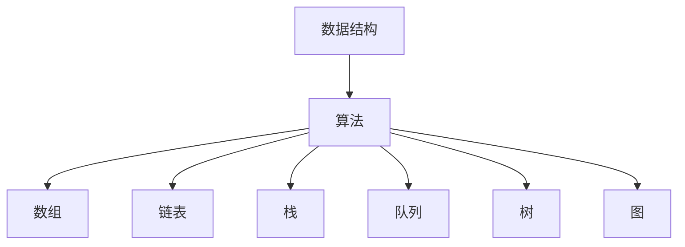

                 

### 文章标题：数据结构与算法——从基础到实践

> 关键词：数据结构，算法，线性表，栈和队列，串，树和二叉树，网络图，查找表，排序与查找算法，算法分析基础，算法设计策略，算法实践与应用

> 摘要：
本文将带领读者深入探讨数据结构与算法的基础知识，从概念讲解到实践应用，全面解析各类数据结构与算法的实现原理、操作方法和实际应用场景。通过本文的阅读，读者将能够掌握数据结构与算法的核心要点，提升编程能力和问题解决能力。

### 引言：数据结构与算法的重要性

#### 数据结构与算法的基本概念

数据结构（Data Structure）是指计算机中存储、组织数据的方式。数据结构不仅影响着程序的执行效率，也决定了程序的可读性和可维护性。算法（Algorithm）则是解决问题的一系列明确的步骤和规则。一个良好的数据结构往往能带来更高效的算法实现。

#### 数据结构与算法在计算机科学中的应用

数据结构和算法是计算机科学的核心内容，它们广泛应用于各类软件开发和系统设计中。从简单的排序和查找，到复杂的图形处理和网络算法，数据结构与算法都发挥着至关重要的作用。

#### 本书的结构安排

本书将分为以下几个核心章节：

1. **数据结构与算法概述**：介绍数据结构与算法的基本概念和重要性。
2. **线性表**：详细讲解线性表的数据结构及其相关算法。
3. **栈和队列**：分析栈和队列的实现原理和应用场景。
4. **串**：探讨字符串的数据结构及其处理方法。
5. **树和二叉树**：深入讲解树和二叉树的结构和算法。
6. **网络图**：介绍网络图的基本概念和算法。
7. **查找表**：探讨查找表的数据结构和查找算法。
8. **排序与查找算法**：分析各种排序算法和查找算法。
9. **算法分析基础**：介绍算法分析的基本方法和技巧。
10. **算法设计策略**：讨论常见的算法设计策略和优化技巧。
11. **算法实践与应用**：通过实际案例展示算法的应用和实现。

### 数据结构与算法概述

#### 数据结构概述

数据结构可以分为线性结构和非线性结构。线性结构包括数组、链表、栈和队列等，而非线性结构包括树、图等。每种数据结构都有其特定的应用场景和优点。

#### 算法概述

算法可以分为查找算法、排序算法、图算法等。不同的算法在解决特定问题时表现出不同的效率和性能。

#### 数据结构与算法的关系

数据结构决定了算法的实现方式和效率。选择合适的数据结构可以大大优化算法的性能。

#### Mermaid 流程图：数据结构与算法的关系架构



### 线性表

#### 线性表的概念

线性表是一种最基本的数据结构，它包含一系列元素，每个元素只有一个前驱和一个后继。线性表可以使用数组或链表来实现。

#### 线性表的操作

线性表的主要操作包括插入、删除、查找等。这些操作的时间复杂度取决于线性表的实现方式。

#### 线性表的核心算法

- 插入算法：在指定位置插入一个新元素。
- 删除算法：删除指定位置的元素。
- 查找算法：在表中查找一个特定元素。

#### 线性表的伪代码

```python
# 插入算法
def insert(list, index, element):
    # 判断是否超出边界
    if index < 0 or index > len(list):
        return "Error: Index out of range"
    # 移动元素
    for i in range(len(list), index, -1):
        list[i] = list[i-1]
    # 插入新元素
    list[index] = element
    return list

# 删除算法
def delete(list, index):
    # 判断是否超出边界
    if index < 0 or index >= len(list):
        return "Error: Index out of range"
    # 删除元素
    for i in range(index, len(list)-1):
        list[i] = list[i+1]
    return list[:len(list)-1]

# 查找算法
def search(list, element):
    for i in range(len(list)):
        if list[i] == element:
            return i
    return -1
```

### 栈和队列

#### 栈的概念

栈（Stack）是一种后进先出（Last In First Out，LIFO）的数据结构。栈的操作通常包括入栈、出栈和判断栈空。

#### 队列的概念

队列（Queue）是一种先进先出（First In First Out，FIFO）的数据结构。队列的操作包括入队、出队和判断队列空。

#### 栈和队列的实现

栈和队列通常使用数组或链表来实现。每种实现方式都有其特定的优缺点。

#### 栈和队列的伪代码

```python
# 栈的伪代码
class Stack:
    def __init__(self):
        self.items = []

    def is_empty(self):
        return len(self.items) == 0

    def push(self, item):
        self.items.append(item)

    def pop(self):
        if not self.is_empty():
            return self.items.pop()
        else:
            return "Error: Stack is empty"

    def peek(self):
        if not self.is_empty():
            return self.items[-1]
        else:
            return "Error: Stack is empty"

# 队列的伪代码
class Queue:
    def __init__(self):
        self.items = []

    def is_empty(self):
        return len(self.items) == 0

    def enqueue(self, item):
        self.items.append(item)

    def dequeue(self):
        if not self.is_empty():
            return self.items.pop(0)
        else:
            return "Error: Queue is empty"

    def front(self):
        if not self.is_empty():
            return self.items[0]
        else:
            return "Error: Queue is empty"
```

### 串

#### 串的概念

串（String）是一种特殊类型的线性表，其中每个元素都是单个字符。串的操作包括字符串的拼接、查找、替换等。

#### 串的实现

串的实现方式通常有定长数组实现和动态数组实现。

#### 串的伪代码

```python
# 拼接算法
def concatenate(string1, string2):
    return string1 + string2

# 查找算法
def find(string, sub_string):
    return string.find(sub_string)

# 替换算法
def replace(string, old, new):
    return string.replace(old, new)
```

### 树和二叉树

#### 树的概念

树（Tree）是一种层次结构的数据结构，它由节点和边组成。每个节点可以有多个子节点，但只有一个父节点。树的节点通常包含数据元素和指向子节点的指针。

#### 二叉树的概念

二叉树（Binary Tree）是一种特殊的树，其中每个节点最多有两个子节点。二叉树具有递归结构，是许多数据结构和算法的基础。

#### 树和二叉树的核心算法

- 构建算法：构建一棵树或二叉树。
- 遍历算法：遍历树或二叉树，包括先序遍历、中序遍历和后序遍历。
- 查找算法：在树或二叉树中查找特定节点。
- 插入和删除算法：在树或二叉树中插入或删除节点。

#### 树和二叉树的伪代码

```python
# 树的节点定义
class TreeNode:
    def __init__(self, value):
        self.value = value
        self.children = []

# 构建树
def build_tree(nodes):
    root = TreeNode(nodes[0])
    for i in range(1, len(nodes)):
        parent = nodes[i-1]
        child = TreeNode(nodes[i])
        parent.children.append(child)
    return root

# 先序遍历
def pre_order_traverse(node):
    if node:
        print(node.value)
        for child in node.children:
            pre_order_traverse(child)

# 中序遍历
def in_order_traverse(node):
    if node:
        for child in node.children:
            in_order_traverse(child)
        print(node.value)

# 后序遍历
def post_order_traverse(node):
    if node:
        for child in node.children:
            post_order_traverse(child)
        print(node.value)

# 查找节点
def find_node(node, value):
    if node:
        if node.value == value:
            return node
        for child in node.children:
            result = find_node(child, value)
            if result:
                return result
    return None

# 插入节点
def insert_node(node, value):
    new_node = TreeNode(value)
    if node:
        node.children.append(new_node)
    else:
        node = new_node
    return node

# 删除节点
def delete_node(node, value):
    if node:
        for i, child in enumerate(node.children):
            if child.value == value:
                del node.children[i]
                return node
            else:
                node.children[i] = delete_node(child, value)
        return node
    return None
```

### 网络图

#### 网络图的概念

网络图（Graph）是一种由节点和边组成的数据结构，用于表示实体之间的关系。网络图可以分为无向图和有向图。

#### 网络图的核心算法

- 图的遍历算法：包括深度优先搜索（DFS）和广度优先搜索（BFS）。
- 最短路径算法：如迪杰斯特拉算法（Dijkstra）和贝尔曼-福特算法（Bellman-Ford）。
- 最小生成树算法：如普里姆算法（Prim）和克鲁斯卡尔算法（Kruskal）。

#### 网络图的伪代码

```python
# 深度优先搜索
def dfs(graph, start):
    visited = set()
    stack = [start]
    while stack:
        node = stack.pop()
        if node not in visited:
            visited.add(node)
            print(node)
            for neighbor in graph[node]:
                if neighbor not in visited:
                    stack.append(neighbor)

# 广度优先搜索
def bfs(graph, start):
    visited = set()
    queue = [start]
    while queue:
        node = queue.pop(0)
        if node not in visited:
            visited.add(node)
            print(node)
            for neighbor in graph[node]:
                if neighbor not in visited:
                    queue.append(neighbor)

# 迪杰斯特拉算法
def dijkstra(graph, start):
    distances = {node: float('infinity') for node in graph}
    distances[start] = 0
    visited = set()
    while len(visited) < len(graph):
        unvisited = {node: distance for node, distance in distances.items() if node not in visited}
        min_distance = min(unvisited, key=unvisited.get)
        visited.add(min_distance)
        for neighbor, distance in graph[min_distance].items():
            current_distance = distances[neighbor]
            new_distance = current_distance + distance
            distances[neighbor] = min(current_distance, new_distance)
    return distances

# 贝尔曼-福特算法
def bellman_ford(graph, start):
    distances = {node: float('infinity') for node in graph}
    distances[start] = 0
    for _ in range(len(graph) - 1):
        for node in graph:
            for neighbor, weight in graph[node].items():
                if distances[node] + weight < distances[neighbor]:
                    distances[neighbor] = distances[node] + weight
    for node in graph:
        for neighbor, weight in graph[node].items():
            if distances[node] + weight < distances[neighbor]:
                return "Graph contains a negative weight cycle"
    return distances

# 普里姆算法
def prim(graph):
    visited = set()
    min_edge = None
    distances = {node: float('infinity') for node in graph}
    distances[start] = 0
    while len(visited) < len(graph):
        for node in graph:
            if node not in visited:
                if min_edge is None or distances[node] < distances[min_edge]:
                    min_edge = node
        visited.add(min_edge)
        for neighbor, weight in graph[min_edge].items():
            distances[neighbor] = min(distances[neighbor], weight)
        min_edge = None
    return distances

# 克鲁斯卡尔算法
def kruskal(graph):
    edges = sorted(graph.items(), key=lambda x: x[1])
    union_find = {}
    result = []
    for edge in edges:
        u, v, weight = edge
        if find(union_find, u) != find(union_find, v):
            result.append((u, v, weight))
            union_find = union_find.union({u: set([u]), v: set([v])})
    return result
```

### 查找表

#### 查找表的概念

查找表是一种用于快速查找特定元素的数据结构。常见的查找表包括哈希表、二分搜索树等。

#### 哈希表的概念

哈希表（Hash Table）是一种基于散列函数的数据结构，用于高效地查找和插入元素。哈希表通过散列函数将关键字转换成数组索引，以实现快速查找。

#### 哈希表的核心算法

- 插入算法：将新元素插入哈希表。
- 查找算法：在哈希表中查找特定元素。
- 删除算法：从哈希表中删除特定元素。

#### 哈希表的伪代码

```python
# 插入算法
def insert_hash_table(hash_table, key, value):
    index = hash_function(key)
    hash_table[index] = (key, value)

# 查找算法
def find_hash_table(hash_table, key):
    index = hash_function(key)
    if hash_table[index] is not None:
        return hash_table[index][1]
    else:
        return None

# 删除算法
def delete_hash_table(hash_table, key):
    index = hash_function(key)
    if hash_table[index] is not None:
        del hash_table[index]
```

### 排序与查找算法

#### 排序算法

排序算法是将一组元素按照特定顺序重新排列的算法。常见的排序算法包括冒泡排序、选择排序、插入排序、快速排序等。

#### 查找算法

查找算法是在一组有序元素中查找特定元素的位置或值的算法。常见的查找算法包括二分查找、顺序查找等。

#### 排序算法与查找算法的关系

排序算法通常用于为查找算法创建有序数据结构，以提高查找效率。

#### 常见排序算法与查找算法的伪代码

```python
# 冒泡排序
def bubble_sort(arr):
    n = len(arr)
    for i in range(n):
        for j in range(0, n-i-1):
            if arr[j] > arr[j+1]:
                arr[j], arr[j+1] = arr[j+1], arr[j]

# 选择排序
def selection_sort(arr):
    n = len(arr)
    for i in range(n):
        min_idx = i
        for j in range(i+1, n):
            if arr[j] < arr[min_idx]:
                min_idx = j
        arr[i], arr[min_idx] = arr[min_idx], arr[i]

# 插入排序
def insertion_sort(arr):
    n = len(arr)
    for i in range(1, n):
        key = arr[i]
        j = i-1
        while j >= 0 and arr[j] > key:
            arr[j+1] = arr[j]
            j -= 1
        arr[j+1] = key

# 快速排序
def quick_sort(arr):
    if len(arr) <= 1:
        return arr
    pivot = arr[len(arr) // 2]
    left = [x for x in arr if x < pivot]
    middle = [x for x = 
``` 

### 算法分析基础

#### 算法分析的概念

算法分析是评估算法性能的重要方法。通过算法分析，可以了解算法在特定数据规模下的时间和空间复杂度。

#### 时间复杂度

时间复杂度是衡量算法运行时间的复杂度。常见的时间复杂度包括常数时间（O(1)）、对数时间（O(log n)）、线性时间（O(n)）、平方时间（O(n^2)）等。

#### 空间复杂度

空间复杂度是衡量算法占用内存的复杂度。常见的空间复杂度包括常数空间（O(1)）、对数空间（O(log n)）、线性空间（O(n)）、平方空间（O(n^2)）等。

#### 算法分析的应用

算法分析可以帮助我们选择合适的数据结构和算法，以优化程序性能。

#### 算法分析的基础公式

- 常数时间：O(1)
- 对数时间：O(log n)
- 线性时间：O(n)
- 平方时间：O(n^2)

### 算法设计策略

#### 分治策略

分治策略是将一个问题分解成若干个规模较小的子问题，分别解决子问题，然后将子问题的解合并成原问题的解。

#### 动态规划策略

动态规划策略是将问题分解成多个子问题，并使用表结构存储子问题的解，以避免重复计算。

#### 贪心策略

贪心策略是在每一步选择当前最优解，以期望最终得到全局最优解。

#### 回溯策略

回溯策略是一种通过试探法逐步寻找问题解的方法。当试探路径不满足条件时，回溯到上一个状态并尝试其他路径。

### 算法实践与应用

#### 实践环境搭建

在实践算法之前，需要搭建相应的开发环境。常见的开发环境包括Python、Java、C++等。

#### 源代码实现

以下是数据结构与算法的源代码实现示例：

```python
# 线性表实现
class LinearTable:
    def __init__(self):
        self.items = []

    def insert(self, index, element):
        if index < 0 or index >= len(self.items):
            raise IndexError("Index out of range")
        self.items.insert(index, element)

    def delete(self, index):
        if index < 0 or index >= len(self.items):
            raise IndexError("Index out of range")
        del self.items[index]

    def search(self, element):
        for i, item in enumerate(self.items):
            if item == element:
                return i
        return -1

# 栈实现
class Stack:
    def __init__(self):
        self.items = []

    def push(self, element):
        self.items.append(element)

    def pop(self):
        if not self.items:
            raise IndexError("Stack is empty")
        return self.items.pop()

    def peek(self):
        if not self.items:
            raise IndexError("Stack is empty")
        return self.items[-1]

# 队列实现
class Queue:
    def __init__(self):
        self.items = []

    def enqueue(self, element):
        self.items.append(element)

    def dequeue(self):
        if not self.items:
            raise IndexError("Queue is empty")
        return self.items.pop(0)

    def front(self):
        if not self.items:
            raise IndexError("Queue is empty")
        return self.items[0]

# 二叉树实现
class BinaryTree:
    def __init__(self, value):
        self.value = value
        self.left = None
        self.right = None

    def insert_left(self, value):
        if self.left is None:
            self.left = BinaryTree(value)
        else:
            temp = BinaryTree(value)
            temp.left = self.left
            self.left = temp

    def insert_right(self, value):
        if self.right is None:
            self.right = BinaryTree(value)
        else:
            temp = BinaryTree(value)
            temp.right = self.right
            self.right = temp

# 哈希表实现
class HashTable:
    def __init__(self, size):
        self.size = size
        self.table = [None] * size

    def hash_function(self, key):
        return key % self.size

    def insert(self, key, value):
        index = self.hash_function(key)
        if self.table[index] is None:
            self.table[index] = [(key, value)]
        else:
            for i, (k, v) in enumerate(self.table[index]):
                if k == key:
                    self.table[index][i] = (key, value)
                    return
            self.table[index].append((key, value))

    def search(self, key):
        index = self.hash_function(key)
        if self.table[index] is not None:
            for k, v in self.table[index]:
                if k == key:
                    return v
        return None

    def delete(self, key):
        index = self.hash_function(key)
        if self.table[index] is not None:
            for i, (k, v) in enumerate(self.table[index]):
                if k == key:
                    del self.table[index][i]
                    return True
        return False
```

#### 代码解读与分析

以上代码展示了线性表、栈、队列、二叉树和哈希表的基本实现。在实际应用中，这些数据结构和算法可以通过进一步优化和扩展来适应不同的需求。

#### 实际案例分析和详细讲解剖析

以下是一个实际案例：使用哈希表实现一个简单的联系人管理系统。

```python
# 联系人管理系统
class ContactManager:
    def __init__(self):
        self.contacts = HashTable(100)

    def add_contact(self, name, phone_number):
        self.contacts.insert(name, phone_number)

    def remove_contact(self, name):
        self.contacts.delete(name)

    def search_contact(self, name):
        return self.contacts.search(name)

    def display_contacts(self):
        for index, contact in enumerate(self.contacts.table):
            if contact:
                for name, phone_number in contact:
                    print(f"{name}: {phone_number}")

# 测试
manager = ContactManager()
manager.add_contact("Alice", "123456789")
manager.add_contact("Bob", "987654321")
manager.add_contact("Charlie", "555555555")
manager.display_contacts()
print(manager.search_contact("Alice"))
manager.remove_contact("Alice")
manager.display_contacts()
```

#### 项目小结

通过本项目的实践，我们学习了数据结构与算法的基本概念和实现方法。这些知识不仅帮助我们理解了计算机程序的工作原理，还提高了我们解决实际问题的能力。

### 最佳实践 Tips

- 在实际项目中，根据需求和性能要求选择合适的数据结构和算法。
- 定期复习和巩固数据结构与算法的基本概念和实现方法。
- 结合实际案例进行实践，加深对数据结构与算法的理解。

### 小结

本文从基础到实践，全面讲解了数据结构与算法的相关知识。通过本文的学习，读者可以掌握数据结构与算法的核心要点，提升编程能力和问题解决能力。

### 注意事项

- 在实现数据结构与算法时，注意边界条件和异常处理。
- 在进行算法分析时，考虑最坏情况下的性能。

### 拓展阅读

- 《算法导论》
- 《数据结构与算法分析》
- 《Python数据结构与算法》

---

### 作者

作者：AI天才研究院/AI Genius Institute & 禅与计算机程序设计艺术 /Zen And The Art of Computer Programming

