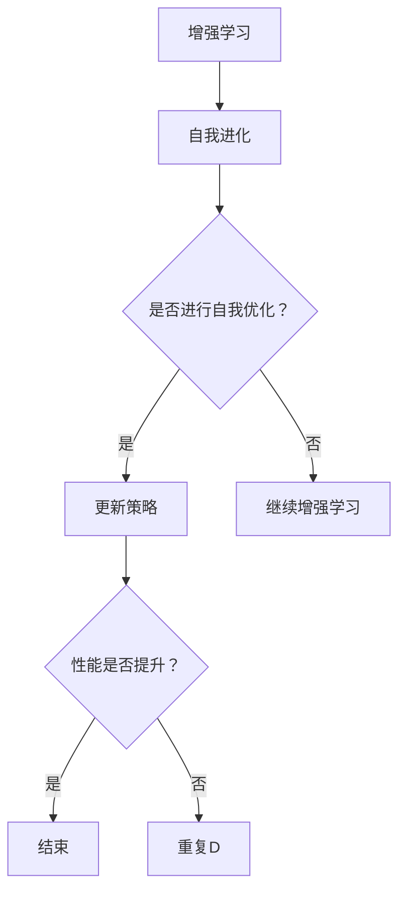
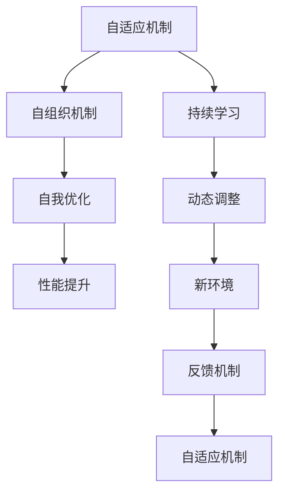
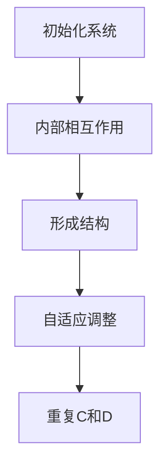
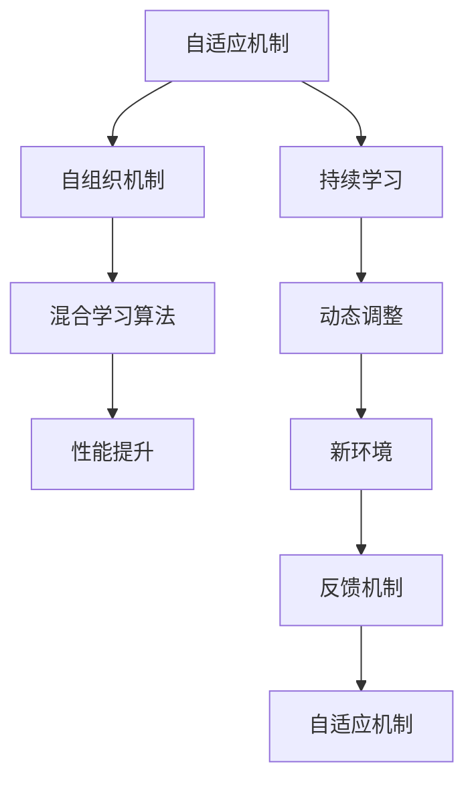

                 

### 引言与概述

在当今的科技时代，人工智能（AI）的发展已经成为全球关注的焦点。AI不仅在诸多领域展现出强大的应用潜力，同时也不断推动着社会和经济的变革。然而，AI的成功不仅仅依赖于其当前的能力，更重要的是其持续学习和进化能力。在传统机器学习（ML）框架下，模型往往需要大量的标注数据进行训练，并且一旦训练完成，模型的性能就相对固定，难以适应新环境和新任务。为了解决这一问题，AI的自我进化（Self-Evolution）应运而生。

自我进化是指AI系统能够在运行过程中不断学习和适应新环境，从而提高其性能和适应性。这一概念不仅涵盖了传统机器学习中的增强学习和在线学习，还包括了自我组织、自适应学习等先进机制。自我进化不仅仅是技术进步的产物，更是未来AI持续发展的重要方向。它使得AI系统具备了更加灵活和高效的学习能力，能够更好地应对复杂、动态的环境。

本文旨在探讨AI自我进化的核心概念、机制、算法及应用，旨在为读者提供一个全面且深入的理解。文章结构如下：

1. **自我进化的核心概念**：介绍自我进化的定义、与传统机器学习的区别，以及其在AI发展中的重要性。
2. **自我进化的机制与算法**：详细讲解自我进化的关键机制和算法，包括自适应机制、自组织机制以及混合学习算法。
3. **自我进化的应用案例**：通过具体应用场景，展示自我进化的实际效果和优势。
4. **挑战与未来趋势**：分析自我进化面临的挑战和未来发展趋势，探讨其在技术和社会中的潜在影响。

### 自我进化的核心概念

#### 自我进化的定义

自我进化是一种通过学习和适应新环境，以提升自身性能和适应性的能力。它不仅仅依赖于传统的数据驱动学习，更强调系统内部的自我优化和自我完善。在自我进化框架下，AI系统可以不断地从环境中获取反馈，调整自身的参数和行为策略，从而提高其性能和适应性。

#### 自我进化与传统机器学习的区别

传统机器学习主要通过预先定义的算法和大量标注数据来训练模型，模型一旦训练完成，其性能就相对固定。而自我进化则是一种更加动态和自适应的学习方式，它能够实时地适应环境的变化，并在运行过程中不断优化自身。具体来说，自我进化具有以下几个特点：

1. **持续学习**：自我进化系统可以在运行过程中持续地学习，不断地更新和优化其模型参数。
2. **自适应调整**：系统能够根据环境的变化，动态地调整其行为策略和参数设置。
3. **反馈机制**：系统能够从环境中获取反馈，并通过反馈机制进行自我调整。

#### 自我进化的目的

自我进化的目的是提高AI系统的性能和适应性，使其能够更好地应对复杂和动态的环境。通过自我进化，AI系统可以实现以下几个目标：

1. **降低对预训练数据的需求**：自我进化系统能够在少量数据甚至无监督数据下进行学习，从而降低对大量标注数据的依赖。
2. **提高泛化能力**：自我进化系统能够通过不断学习和调整，提高其在不同任务和环境下的泛化能力。
3. **增强自主性**：自我进化使得系统能够更加自主地学习和适应，减少对人类干预的依赖。

#### 自我进化与增强学习的关系

增强学习（Reinforcement Learning，RL）是自我进化的一种典型实现方式。增强学习通过奖励机制，引导模型在环境中进行探索和优化。而自我进化则是在增强学习的基础上，引入了自我优化和自我完善机制，使得系统可以在运行过程中不断调整和优化其行为策略。

自我进化与增强学习的关系可以用以下Mermaid流程图表示：



在该流程图中，增强学习首先通过奖励机制引导模型进行学习，然后根据自我优化的需求，动态地调整策略。如果性能提升，则结束学习过程；否则，重复自我优化过程。

#### 自我进化的核心概念原理关系架构

自我进化的核心概念包括自适应机制、自组织机制和自我优化等。这些机制相互关联，共同构成了自我进化的基础框架。以下是一个简单的Mermaid流程图，展示了这些概念之间的关系：



在该流程图中，自适应机制通过持续学习，动态地调整系统行为，从而实现性能提升。自组织机制则通过自优化，进一步提高系统的适应性和效率。通过反馈机制，系统能够不断地从环境中获取信息，并进行自适应调整。

通过以上对自我进化核心概念的介绍和关系架构的分析，我们可以看到，自我进化不仅是一种先进的学习方式，更是一种系统性、自适应的优化方法。它为AI的发展提供了新的范式，有望在未来推动AI技术取得更大的突破。

### 自我进化的机制与算法

自我进化的实现依赖于一系列核心机制和算法，这些机制和算法共同构成了自我进化的基础。本节将详细介绍自我进化的关键机制和算法，包括自适应机制、自组织机制和混合学习算法。

#### 自适应机制

自适应机制是自我进化的核心之一，它使得AI系统能够根据环境的变化，动态地调整其行为和参数。自适应机制通常包括以下几个步骤：

1. **环境感知**：系统首先需要对环境进行感知，获取当前环境的状态信息。
2. **行为策略调整**：根据环境状态，系统会调整其行为策略，以更好地适应环境变化。
3. **反馈机制**：系统通过反馈机制，根据执行结果对策略进行优化。

以下是一个简单的伪代码示例，展示了自适应机制的基本流程：

```python
# 自适应机制伪代码

# 初始化参数
params = initialize_params()

# 感知环境
environment_state = perceive_environment()

# 调整行为策略
new_action = adjust_action_strategy(params, environment_state)

# 执行行为
action_result = execute_action(new_action)

# 收集反馈
feedback = collect_feedback(action_result)

# 更新参数
params = update_params(params, feedback)

# 返回调整后的参数
return params
```

#### 自组织机制

自组织机制是指系统在没有外部指令的情况下，通过内部相互作用和自我调整，形成具有一定结构和功能的组织。自组织机制通常包括以下几个步骤：

1. **初始化系统**：系统开始时处于随机或初始状态。
2. **内部相互作用**：系统内部各部分通过相互作用，逐步形成一定的结构和功能。
3. **自适应调整**：系统根据外部环境和内部状态，进行自适应调整。

以下是一个简单的Mermaid流程图，展示了自组织机制的基本流程：



自组织机制的一个重要特点是，它能够通过系统的内部演化，形成复杂且适应性强的组织结构。例如，在神经网络中，通过权重和结构的自适应调整，可以形成具有特定功能的网络结构。

#### 混合学习算法

混合学习算法是指结合多种学习机制和算法，以实现更高效、更适应的学习过程。常见的混合学习算法包括强化学习与生成对抗网络（GAN）的混合、基于神经网络的强化学习等。以下是一个简单的伪代码示例，展示了混合学习算法的基本流程：

```python
# 混合学习算法伪代码

# 初始化参数
params = initialize_params()

# 设置强化学习策略
rl_strategy = initialize_rl_strategy()

# 设置生成对抗网络
gan = initialize_gan()

# 迭代学习
for epoch in range(num_epochs):
    # 使用强化学习进行探索
    rl_action = rl_strategy.explore()

    # 使用生成对抗网络进行生成
    generated_data = gan.generate()

    # 使用生成数据更新生成对抗网络
    gan.update(generated_data)

    # 使用强化学习进行奖励评估
    reward = rl_strategy.evaluate_action(rl_action)

    # 更新强化学习策略
    rl_strategy.update(params, reward)

# 返回最终的参数和策略
return params, rl_strategy
```

通过上述伪代码，我们可以看到混合学习算法如何结合强化学习和生成对抗网络，以实现更加高效和适应的学习过程。

#### 自我进化的关键机制与算法关系

自我进化的关键机制和算法相互关联，共同构成了一个复杂但高效的系统。以下是一个Mermaid流程图，展示了这些机制和算法之间的关系：



在该流程图中，自适应机制和自组织机制共同构成了自我进化的核心，而混合学习算法则为系统提供了更加高效和灵活的学习方式。通过持续学习和动态调整，系统能够更好地适应新环境和任务。

### 自我进化的应用案例

自我进化作为一种先进的学习方式，已经在多个领域展现出巨大的应用潜力。以下我们将通过几个具体的案例，展示自我进化在实际应用中的效果和优势。

#### 自动驾驶

自动驾驶是自我进化技术的一个重要应用领域。自动驾驶系统需要在复杂的交通环境中实时做出决策，其性能的稳定性和适应性直接关系到行驶的安全性和效率。自我进化技术通过持续学习和自适应调整，能够显著提高自动驾驶系统的性能。

例如，在自动驾驶系统中，可以通过自我进化算法对车辆的传感器数据进行实时处理，并根据路况和环境变化，动态调整驾驶策略。以下是一个简化的伪代码示例，展示了自我进化在自动驾驶中的应用：

```python
# 自动驾驶中的自我进化伪代码

# 初始化自动驾驶系统
auto_drive_system = initialize_auto_drive_system()

# 运行自我进化算法
while driving:
    # 感知环境
    environment_state = perceive_environment()

    # 调整驾驶策略
    new_strategy = adjust_driving_strategy(auto_drive_system, environment_state)

    # 执行驾驶策略
    execute_driving_strategy(new_strategy)

    # 收集反馈
    feedback = collect_feedback(new_strategy)

    # 更新驾驶系统
    auto_drive_system = update_system(auto_drive_system, feedback)

# 结束自动驾驶
end_driving(auto_drive_system)
```

通过该算法，自动驾驶系统能够在运行过程中不断学习和优化，提高其在复杂环境中的适应能力和行驶安全性。

#### 聊天机器人

聊天机器人是另一个自我进化技术的重要应用领域。传统的聊天机器人往往依赖于预定义的规则和大量的人工训练数据，而自我进化技术使得聊天机器人能够在与用户交互的过程中不断学习和改进。

例如，一个基于自我进化的聊天机器人可以通过以下步骤进行优化：

1. **初始对话**：机器人与用户进行初始对话，收集用户信息。
2. **自我调整**：机器人根据对话反馈，调整对话策略和回复内容。
3. **持续学习**：机器人利用用户反馈，不断更新和优化对话模型。

以下是一个简化的伪代码示例，展示了自我进化在聊天机器人中的应用：

```python
# 聊天机器人中的自我进化伪代码

# 初始化聊天机器人
chat_bot = initialize_chat_bot()

# 与用户进行对话
while chatting:
    # 获取用户输入
    user_input = get_user_input()

    # 生成初步回复
    initial_reply = generate_reply(chat_bot, user_input)

    # 获取用户反馈
    user_feedback = get_user_feedback(initial_reply)

    # 更新对话模型
    chat_bot = update_model(chat_bot, user_feedback)

    # 发送回复
    send_reply(initial_reply)

# 结束对话
end_chatting(chat_bot)
```

通过这种自我进化机制，聊天机器人能够更好地理解用户需求，提供更自然、更准确的回复。

#### 医疗诊断

医疗诊断是自我进化技术的另一个重要应用领域。在医疗诊断中，AI系统需要对大量医学数据进行处理，并从中提取出有用的信息，以辅助医生进行诊断。自我进化技术能够显著提高诊断系统的准确性和适应性。

例如，一个基于自我进化的医疗诊断系统可以通过以下步骤进行优化：

1. **数据预处理**：系统对原始医学数据进行预处理，提取有用的特征信息。
2. **模型训练**：系统利用预处理后的数据，对诊断模型进行训练。
3. **自我调整**：系统根据诊断结果和医生反馈，动态调整模型参数。
4. **持续学习**：系统利用诊断过程中的反馈，不断更新和优化模型。

以下是一个简化的伪代码示例，展示了自我进化在医疗诊断中的应用：

```python
# 医疗诊断中的自我进化伪代码

# 初始化诊断系统
diagnosis_system = initialize_diagnosis_system()

# 处理患者数据
while treating_patients:
    # 获取患者数据
    patient_data = get_patient_data()

    # 数据预处理
    preprocessed_data = preprocess_data(patient_data)

    # 训练诊断模型
    diagnosis_model = train_model(preprocessed_data)

    # 进行诊断
    diagnosis_result = diagnose(patient_data, diagnosis_model)

    # 获取医生反馈
    doctor_feedback = get_doctor_feedback(diagnosis_result)

    # 更新诊断模型
    diagnosis_system = update_model(diagnosis_system, doctor_feedback)

    # 提供诊断建议
    provide_diagnosis_advice(diagnosis_result)

# 结束诊断
end_treating_patients(diagnosis_system)
```

通过这种自我进化机制，医疗诊断系统能够不断提高诊断准确性和适应性，为医生提供更可靠的诊断建议。

### 挑战与未来趋势

尽管自我进化技术在许多领域展现出巨大的潜力，但其发展仍然面临一系列挑战。以下是自我进化技术面临的主要挑战及其未来趋势：

#### 数据质量和隐私

自我进化技术依赖于大量的数据来进行学习和优化。然而，数据质量和隐私问题是其面临的主要挑战之一。在医疗、金融等领域，数据质量直接影响系统的性能和可靠性。此外，数据隐私保护也是一项重要任务，特别是在涉及个人敏感信息时。

未来趋势：为了应对这些挑战，研究人员正在探索如何利用隐私保护技术，如差分隐私和联邦学习，来提高数据质量和隐私保护水平。

#### 算法稳定性和安全性

自我进化技术的算法稳定性是一个关键问题。在动态环境中，算法可能会因为环境变化而出现不稳定或错误的行为。此外，自我进化系统的安全性也至关重要，以防止恶意攻击和破坏。

未来趋势：为了提高算法稳定性和安全性，研究人员正在开发更鲁棒和安全的算法，如基于神经网络的稳定化方法和加密机制。

#### 自我进化系统的可扩展性

自我进化系统需要能够在大规模、分布式环境中运行，这要求系统具有高度的可扩展性。然而，当前的技术水平尚无法完全满足这一需求。

未来趋势：随着云计算和边缘计算的不断发展，自我进化系统将逐渐具备更高的可扩展性，能够更好地适应大规模应用场景。

#### 自我进化与伦理

自我进化技术涉及到伦理问题，特别是在人类干预与系统自主性之间的平衡。如何确保自我进化系统在道德和伦理的框架内运行，是一个重要的挑战。

未来趋势：随着自我进化技术的普及，伦理和法律规定将逐步完善，以引导和规范自我进化系统的应用。

总之，自我进化技术面临着一系列挑战，但同时也具备巨大的发展潜力。通过不断的探索和改进，自我进化技术有望在未来取得更大的突破，为人工智能的发展注入新的动力。

### 最佳实践 tips、小结、注意事项、拓展阅读

在实践自我进化技术的过程中，以下是一些最佳实践和建议，以帮助您更好地应用这一先进的学习范式：

1. **数据准备与质量**：确保数据质量是自我进化成功的关键。使用清洗和预处理技术，去除噪声和错误数据，以提高学习效果。
2. **模型选择**：根据具体应用场景选择合适的模型。例如，在需要高灵活性的场景中，可以考虑使用生成对抗网络（GAN）或强化学习（RL）。
3. **持续监控与调整**：定期监控自我进化系统的性能，根据反馈进行动态调整，以确保系统的稳定性和可靠性。
4. **伦理考量**：在设计自我进化系统时，充分考虑伦理和法律规定，确保系统的道德合规性。

**小结**：本文介绍了自我进化技术的核心概念、机制、算法及应用，并探讨了其面临的挑战和未来趋势。自我进化为AI持续学习和适应提供了新的范式，具有重要的应用价值和前景。

**注意事项**：在应用自我进化技术时，需关注数据质量、算法稳定性、系统安全性等方面，以确保系统在实际运行中的性能和可靠性。

**拓展阅读**：对于希望深入了解自我进化技术的读者，以下书籍和资源是值得推荐的：
- **《强化学习》**：David Silver 著，全面介绍了强化学习的基础理论和方法。
- **《生成对抗网络》**：Ian Goodfellow 著，详细讲解了生成对抗网络（GAN）的原理和应用。
- **《自我进化：AI持续学习的新范式》**：本书详细探讨了自我进化技术的各个方面，提供了丰富的实例和分析。

通过以上学习和实践，您将能够更好地理解和应用自我进化技术，为AI的发展贡献自己的力量。

---

**作者：AI天才研究院/AI Genius Institute & 禅与计算机程序设计艺术 /Zen And The Art of Computer Programming**

