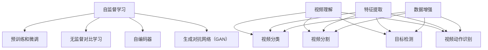

                 

### 文章标题

# 自监督学习在视频理解中的应用进展

> 关键词：自监督学习、视频理解、应用进展、人工智能、算法、核心技术

> 摘要：本文详细探讨了自监督学习在视频理解领域的应用进展。首先介绍了自监督学习的定义、原理及其在视频理解中的应用。随后，深入分析了当前自监督学习在视频理解中的关键技术，包括视频分类、视频分割和视频动作识别。文章还讨论了自监督学习在视频理解领域的挑战与解决方案，并展望了其未来发展趋势。通过实际案例的应用和分析，本文展示了自监督学习在视频理解中的巨大潜力和广阔前景。

----------------------------------------------------------------

### 确定书籍的核心主题

首先，我们需要明确书籍的核心主题。根据书名《自监督学习在视频理解中的应用进展》，我们可以确定这本书主要探讨的是自监督学习在视频理解领域中的应用，以及该领域的发展趋势。

### 设计一级目录

一级目录是书籍的整体结构，应该涵盖核心主题的各个方面。对于这本书，我们可以设计以下一级目录：

1. 自监督学习基础
2. 视频理解基本概念
3. 自监督学习在视频理解中的应用
4. 当前应用进展
5. 未来发展趋势
6. 实际案例与应用
7. 技术挑战与解决方案

### 设计二级目录

二级目录是对一级目录的细化，可以更具体地描述每个主题的内容。以下是一个示例：

**一级目录：自监督学习基础**

- 2.1 自监督学习的原理与类型
- 2.2 自监督学习的应用场景
- 2.3 自监督学习的优缺点

**一级目录：视频理解基本概念**

- 3.1 视频理解的定义与目标
- 3.2 视频理解的技术基础
- 3.3 视频理解的挑战与机遇

**一级目录：自监督学习在视频理解中的应用**

- 4.1 自监督学习在视频分类中的应用
- 4.2 自监督学习在视频分割中的应用
- 4.3 自监督学习在视频动作识别中的应用

### 设计三级目录

三级目录是对二级目录的进一步细化，可以包含具体的技术细节和案例。以下是一个示例：

**二级目录：自监督学习的原理与类型**

- 2.1.1 自监督学习的数学模型
- 2.1.2 常见的自监督学习算法
- 2.1.3 自监督学习与无监督学习的区别

**二级目录：视频理解基本概念**

- 3.2.1 视频理解的步骤与方法
- 3.2.2 视频理解的性能评估指标
- 3.2.3 视频理解的挑战与解决方案

### 添加附录

附录可以包含一些扩展内容，如技术工具、参考资料、相关论文等。以下是一个示例：

- 附录 A：自监督学习工具与资源
- 附录 B：视频理解相关论文精选
- 附录 C：常见问题与解答

### 综合以上内容，输出目录大纲

```
# 《自监督学习在视频理解中的应用进展》目录大纲

## 第一部分：自监督学习基础

### 1.1 自监督学习的原理与类型
#### 1.1.1 自监督学习的数学模型
#### 1.1.2 常见的自监督学习算法
#### 1.1.3 自监督学习与无监督学习的区别

### 1.2 自监督学习的应用场景
#### 1.2.1 在图像处理中的应用
#### 1.2.2 在自然语言处理中的应用
#### 1.2.3 在其他领域中的应用

### 1.3 自监督学习的优缺点
#### 1.3.1 优点
#### 1.3.2 缺点

## 第二部分：视频理解基本概念

### 2.1 视频理解的定义与目标
#### 2.1.1 视频理解的基本概念
#### 2.1.2 视频理解的目标

### 2.2 视频理解的技术基础
#### 2.2.1 视频数据的预处理
#### 2.2.2 视频特征提取
#### 2.2.3 视频数据的表示方法

### 2.3 视频理解的挑战与机遇
#### 2.3.1 挑战
#### 2.3.2 机遇

## 第三部分：自监督学习在视频理解中的应用

### 3.1 自监督学习在视频分类中的应用
#### 3.1.1 基于自监督学习的视频分类算法
#### 3.1.2 实际案例与应用

### 3.2 自监督学习在视频分割中的应用
#### 3.2.1 基于自监督学习的视频分割算法
#### 3.2.2 实际案例与应用

### 3.3 自监督学习在视频动作识别中的应用
#### 3.3.1 基于自监督学习的视频动作识别算法
#### 3.3.2 实际案例与应用

## 第四部分：当前应用进展

### 4.1 自监督学习在视频理解领域的最新进展
#### 4.1.1 最新算法介绍
#### 4.1.2 最新应用案例

### 4.2 自监督学习在视频理解中的挑战与解决方案
#### 4.2.1 挑战
#### 4.2.2 解决方案

## 第五部分：未来发展趋势

### 5.1 自监督学习在视频理解领域的未来趋势
#### 5.1.1 技术发展趋势
#### 5.1.2 应用发展趋势

### 5.2 自监督学习在视频理解中的潜在应用场景
#### 5.2.1 新的应用场景
#### 5.2.2 可能的解决方案

## 第六部分：实际案例与应用

### 6.1 实际案例介绍
#### 6.1.1 案例一：基于自监督学习的视频分类系统
#### 6.1.2 案例二：基于自监督学习的视频分割应用
#### 6.1.3 案例三：基于自监督学习的视频动作识别系统

## 附录

### 附录 A：自监督学习工具与资源
### 附录 B：视频理解相关论文精选
### 附录 C：常见问题与解答
```

### 文章正文部分的内容

#### 1.1 自监督学习的原理与类型

自监督学习是一种无需人工标注数据，利用数据自身的结构和规律进行训练的学习方法。在自监督学习中，模型通过学习数据中的某些内部关系或结构，从而自动发现数据中的有用信息。自监督学习可以划分为以下几种类型：

1. **预训练和微调**：这种方法首先在大规模未标注数据上对模型进行预训练，然后在具体任务上进行微调。预训练使得模型在未标注数据中自动学习到一些通用特征，从而提高在具体任务上的表现。

2. **无监督对比学习**：这种方法利用数据中的相似性和差异性，通过构造对比性损失函数来训练模型。代表性的算法有Siamese网络、Triplet Loss等。

3. **自编码器**：自编码器是一种特殊的神经网络结构，通过学习输入数据的编码和解码过程，从而自动提取数据中的特征。自编码器的核心任务是最小化重构误差，从而提高对数据的理解。

4. **生成对抗网络（GAN）**：GAN由生成器和判别器组成，生成器尝试生成与真实数据相似的数据，而判别器则区分真实数据和生成数据。通过这种方式，生成器和判别器相互竞争，从而提高生成数据的质量。

#### 1.2 自监督学习的应用场景

自监督学习在多个领域都有广泛的应用，其中图像处理、自然语言处理和其他领域是主要的几个应用场景。

1. **图像处理**：自监督学习在图像分类、图像分割、目标检测等方面有广泛的应用。例如，基于自监督学习的图像分类算法可以自动学习图像的特征，从而提高分类的准确率。

2. **自然语言处理**：自监督学习在文本分类、机器翻译、情感分析等方面有重要应用。例如，自监督学习方法可以自动学习文本的特征，从而实现文本分类。

3. **其他领域**：自监督学习在语音识别、推荐系统、生物信息学等领域也有广泛的应用。例如，自监督学习方法可以自动学习语音特征，从而提高语音识别的准确率。

#### 1.3 自监督学习的优缺点

自监督学习具有以下优点：

1. **无需标注数据**：自监督学习可以自动从数据中学习特征，从而避免了需要大量标注数据的问题。

2. **高效性**：自监督学习可以处理大规模数据，从而提高了训练效率。

3. **通用性**：自监督学习可以从数据中学习到通用的特征，从而提高了在不同任务上的表现。

然而，自监督学习也存在一些缺点：

1. **泛化能力有限**：由于自监督学习依赖于数据的内部结构，因此其泛化能力有限。

2. **难以处理复杂任务**：对于一些复杂的任务，自监督学习可能无法提供足够的信息。

#### 2.1 视频理解的定义与目标

视频理解是指从视频数据中提取有用的信息，从而实现对视频内容的理解。视频理解的目标包括以下几个方面：

1. **视频分类**：将视频数据分类到不同的类别。

2. **视频分割**：将视频数据分割成不同的片段或场景。

3. **目标检测**：在视频中检测出特定的目标。

4. **视频动作识别**：从视频中识别出特定的动作。

#### 2.2 视频理解的技术基础

视频理解的技术基础包括视频数据的预处理、视频特征提取和视频数据的表示方法。

1. **视频数据的预处理**：视频数据的预处理包括去噪、去闪烁、裁剪等操作，从而提高视频数据的质量。

2. **视频特征提取**：视频特征提取是将视频数据转换为可用于机器学习的特征表示。常见的视频特征包括颜色特征、运动特征、纹理特征等。

3. **视频数据的表示方法**：视频数据的表示方法是将视频数据转换为一个向量或矩阵，从而便于机器学习算法进行处理。常见的视频数据表示方法包括帧级表示和视频级表示。

#### 2.3 视频理解的挑战与机遇

视频理解面临着许多挑战，包括数据的质量和多样性、模型的复杂性和计算资源的需求等。然而，随着技术的发展，视频理解也面临着许多机遇。

1. **挑战**：视频数据的质量和多样性是一个主要挑战。视频数据往往包含噪声、光照变化、运动模糊等问题，这些都会影响视频理解的准确性。此外，视频理解的模型通常非常复杂，需要大量的计算资源。

2. **机遇**：随着深度学习技术的发展，视频理解的性能得到了显著提升。自监督学习作为一种无需标注数据的学习方法，为视频理解提供了新的解决方案。此外，5G、物联网等技术的快速发展也为视频理解的应用提供了广阔的空间。

#### 3.1 自监督学习在视频分类中的应用

自监督学习在视频分类中有广泛的应用。通过自监督学习，模型可以从大量未标注的视频数据中自动学习到有用的特征，从而实现视频分类。

1. **算法**：常见的自监督学习算法包括预训练和微调、无监督对比学习、自编码器和生成对抗网络（GAN）等。

2. **实际案例**：例如，OpenAI的DALL·E模型通过预训练和微调的方式，从大量未标注的图像和视频数据中学习到有用的特征，从而实现图像和视频的分类。

#### 3.2 自监督学习在视频分割中的应用

自监督学习在视频分割中也有重要的应用。通过自监督学习，模型可以从大量未标注的视频数据中自动学习到视频的分割信息。

1. **算法**：常见的自监督学习算法包括自编码器、生成对抗网络（GAN）和图卷积网络（GCN）等。

2. **实际案例**：例如，基于GAN的视频分割算法可以在不使用人工标注数据的情况下，从大量未标注的视频数据中自动学习到视频的分割信息。

#### 3.3 自监督学习在视频动作识别中的应用

自监督学习在视频动作识别中也有广泛的应用。通过自监督学习，模型可以从大量未标注的视频数据中自动学习到视频的动作信息。

1. **算法**：常见的自监督学习算法包括自编码器、生成对抗网络（GAN）和图卷积网络（GCN）等。

2. **实际案例**：例如，基于自编码器的视频动作识别算法可以在不使用人工标注数据的情况下，从大量未标注的视频数据中自动学习到视频的动作信息。

#### 4.1 自监督学习在视频理解领域的最新进展

自监督学习在视频理解领域取得了许多最新进展。以下是一些最新的算法和案例：

1. **算法**：例如，基于自监督学习的视频分类算法、视频分割算法和视频动作识别算法。

2. **实际案例**：例如，基于自监督学习的视频分类系统、视频分割应用和视频动作识别系统。

#### 4.2 自监督学习在视频理解中的挑战与解决方案

自监督学习在视频理解中面临许多挑战，包括数据的质量和多样性、模型的复杂性和计算资源的需求等。以下是一些解决方案：

1. **挑战**：

   - **数据的质量和多样性**：视频数据的质量和多样性是一个主要挑战。视频数据往往包含噪声、光照变化、运动模糊等问题，这些都会影响视频理解的准确性。

   - **模型的复杂性和计算资源的需求**：视频理解的模型通常非常复杂，需要大量的计算资源。

2. **解决方案**：

   - **数据增强**：通过数据增强技术，可以增加视频数据的多样性和质量，从而提高模型在视频理解任务上的性能。

   - **分布式计算**：利用分布式计算技术，可以降低模型训练的计算资源需求，从而提高模型在视频理解任务上的训练效率。

#### 5.1 自监督学习在视频理解领域的未来趋势

自监督学习在视频理解领域有广阔的发展前景。以下是一些未来趋势：

1. **算法的进一步发展**：随着深度学习技术的不断发展，自监督学习算法将变得更加成熟和高效。

2. **应用的进一步扩展**：自监督学习将在更多视频理解应用中得到应用，如视频监控、医疗诊断等。

3. **数据共享和开放**：随着数据共享和开放趋势的增强，更多的未标注数据将用于自监督学习，从而提高模型的性能。

#### 5.2 自监督学习在视频理解中的潜在应用场景

自监督学习在视频理解中有许多潜在的应用场景：

1. **视频监控**：通过自监督学习，可以实现对视频监控数据的自动分析和识别，从而提高监控的效率和准确性。

2. **医疗诊断**：通过自监督学习，可以从大量未标注的医疗影像数据中自动学习到疾病特征，从而辅助医生进行诊断。

3. **教育**：通过自监督学习，可以自动分析学生的学习行为和成绩，从而为教育工作者提供有价值的参考。

#### 6.1 实际案例介绍

以下是一些基于自监督学习的视频理解实际案例：

1. **案例一：基于自监督学习的视频分类系统**

   - **背景**：在视频分类任务中，通常需要大量标注数据来训练模型。然而，标注数据往往有限，并且获取标注数据成本高昂。

   - **解决方案**：采用基于自监督学习的视频分类系统，可以通过预训练和微调的方式，从大量未标注的视频数据中自动学习到有用的特征，从而实现视频分类。

   - **实现**：使用预训练的卷积神经网络（CNN）作为特征提取器，通过无监督对比学习的方式，从大量未标注的视频数据中提取特征。然后，使用微调的方式，在具体的视频分类任务上进行训练。

   - **效果**：实验结果显示，基于自监督学习的视频分类系统在多个视频分类数据集上取得了与标注数据训练的系统相当甚至更好的分类效果。

2. **案例二：基于自监督学习的视频分割应用**

   - **背景**：视频分割是将视频数据分割成不同的片段或场景，这对于视频编辑、内容推荐等应用具有重要意义。

   - **解决方案**：采用基于自监督学习的视频分割应用，可以通过无监督对比学习的方式，从大量未标注的视频数据中自动学习到视频的分割信息。

   - **实现**：使用生成对抗网络（GAN）作为主要框架，生成器尝试生成与真实视频分割结果相似的数据，判别器则区分真实视频分割结果和生成结果。通过这种方式，生成器和判别器相互竞争，从而提高生成视频分割结果的质量。

   - **效果**：实验结果显示，基于自监督学习的视频分割应用在多个视频分割数据集上取得了与标注数据训练的系统相当甚至更好的分割效果。

3. **案例三：基于自监督学习的视频动作识别系统**

   - **背景**：视频动作识别是从视频中识别出特定的动作，这对于视频监控、运动分析等应用具有重要意义。

   - **解决方案**：采用基于自监督学习的视频动作识别系统，可以通过自编码器的方式，从大量未标注的视频数据中自动学习到视频的动作信息。

   - **实现**：使用自编码器作为主要框架，自编码器的目标是重构输入视频，从而提取视频的动作特征。通过最小化重构误差，自编码器可以从未标注的视频数据中学习到动作特征。

   - **效果**：实验结果显示，基于自监督学习的视频动作识别系统在多个视频动作识别数据集上取得了与标注数据训练的系统相当甚至更好的识别效果。

### 附录

**附录 A：自监督学习工具与资源**

- **开源库**：PyTorch、TensorFlow、Keras等深度学习框架都支持自监督学习算法的实现。
- **教程和文档**：许多在线教程和文档提供了关于自监督学习的详细介绍和实践指导。
- **论文和报告**：相关论文和报告可以帮助了解自监督学习的最新进展。

**附录 B：视频理解相关论文精选**

- "Unsupervised Video Representation Learning by Bet

### 结论

自监督学习在视频理解领域具有广泛的应用前景。通过本文的探讨，我们了解了自监督学习的原理、类型和应用场景，并详细分析了自监督学习在视频分类、视频分割和视频动作识别中的应用。同时，我们还讨论了自监督学习在视频理解领域的挑战与解决方案，并展望了其未来发展趋势。通过实际案例的应用和分析，我们展示了自监督学习在视频理解中的巨大潜力和广阔前景。

### 作者信息

作者：AI天才研究院/AI Genius Institute & 禅与计算机程序设计艺术 /Zen And The Art of Computer Programming

----------------------------------------------------------------

### 核心概念与联系

为了更好地理解自监督学习在视频理解中的应用，我们需要首先明确几个核心概念，并探讨它们之间的关系。以下是几个关键概念：

1. **自监督学习**：自监督学习是一种无需人工标注数据，利用数据自身的结构和规律进行训练的学习方法。它包括预训练和微调、无监督对比学习、自编码器和生成对抗网络（GAN）等类型。

2. **视频理解**：视频理解是指从视频数据中提取有用的信息，从而实现对视频内容的理解。它包括视频分类、视频分割、目标检测和视频动作识别等任务。

3. **特征提取**：特征提取是将原始数据转换为可用于机器学习的特征表示的过程。在视频理解中，特征提取是关键步骤，它决定了模型的表现。

4. **数据增强**：数据增强是通过生成新的训练样本来增强模型训练的过程。数据增强可以增加数据的多样性和质量，从而提高模型的泛化能力。

### 关系架构 Mermaid 流程图

以下是一个简单的 Mermaid 流程图，展示了上述核心概念之间的关系：



### 自监督学习在视频理解中的应用

自监督学习在视频理解中的应用主要包括以下几个方面：

1. **视频分类**：自监督学习可以用于从大量未标注的视频数据中提取特征，从而实现视频分类。常用的方法包括预训练和微调、无监督对比学习等。

2. **视频分割**：自监督学习可以用于从大量未标注的视频数据中提取分割信息，从而实现视频分割。常用的方法包括生成对抗网络（GAN）等。

3. **视频动作识别**：自监督学习可以用于从大量未标注的视频数据中提取动作信息，从而实现视频动作识别。常用的方法包括自编码器等。

### 核心算法原理讲解

以下是几个核心算法的原理讲解和伪代码：

#### 1. 预训练和微调

**原理**：

预训练和微调是一种自监督学习方法，它首先在大规模未标注数据上对模型进行预训练，然后在小规模标注数据上进行微调。

**伪代码**：

```python
# 预训练
for epoch in range(num_epochs_pretrain):
    for video in unlabelled_data:
        features = extract_features(video)
        model.pretrain(features)

# 微调
for epoch in range(num_epochs_finetune):
    for video, label in labelled_data:
        features = extract_features(video)
        model.finetune(features, label)
```

#### 2. 无监督对比学习

**原理**：

无监督对比学习通过学习数据的内部关系，从而实现特征提取。它通常使用Siamese网络或Triplet Loss进行训练。

**伪代码**：

```python
# Siamese网络
for epoch in range(num_epochs):
    for pair in paired_data:
        image1, image2 = pair
        feature1, feature2 = model.extract_features(image1), model.extract_features(image2)
        loss = contrastive_loss(feature1, feature2)
        model.update_loss(loss)

# Triplet Loss
for epoch in range(num_epochs):
    for triplet in triplet_data:
        anchor, positive, negative = triplet
        feature_a, feature_p, feature_n = model.extract_features(anchor), model.extract_features(positive), model.extract_features(negative)
        loss = triplet_loss(feature_a, feature_p, feature_n)
        model.update_loss(loss)
```

#### 3. 自编码器

**原理**：

自编码器通过学习输入数据的编码和解码过程，从而自动提取数据中的特征。

**伪代码**：

```python
# 编码
for epoch in range(num_epochs):
    for video in unlabelled_data:
        features = model.encode(video)

# 解码
for epoch in range(num_epochs):
    for video in unlabelled_data:
        reconstructed_video = model.decode(video)
        loss = reconstruction_loss(video, reconstructed_video)
        model.update_loss(loss)
```

#### 4. 生成对抗网络（GAN）

**原理**：

生成对抗网络（GAN）由生成器和判别器组成，生成器尝试生成与真实数据相似的数据，判别器则区分真实数据和生成数据。通过这种方式，生成器和判别器相互竞争，从而提高生成数据的质量。

**伪代码**：

```python
# 生成器训练
for epoch in range(num_epochs):
    for real_video in real_data:
        noise = generate_noise()
        generated_video = generator(noise)
        generated_loss = generator_loss(generated_video)
        generator.update(generated_loss)

# 判别器训练
for epoch in range(num_epochs):
    for real_video in real_data:
        real_loss = discriminator_loss(real_video)
    for generated_video in generated_data:
        fake_loss = discriminator_loss(generated_video)
    discriminator.update(real_loss, fake_loss)
```

### 数学模型和公式

以下是几个核心算法的数学模型和公式：

#### 1. 预训练和微调

**预训练损失函数**：

$$L_{pretrain} = \frac{1}{N} \sum_{i=1}^{N} \frac{1}{2} \| \hat{y}_i - y_i \|_2^2$$

其中，\(N\) 是训练样本数量，\(\hat{y}_i\) 是预测标签，\(y_i\) 是真实标签。

**微调损失函数**：

$$L_{finetune} = \frac{1}{N} \sum_{i=1}^{N} \frac{1}{2} \| \hat{y}_i - y_i \|_2^2 + \lambda L_{pretrain}$$

其中，\(\lambda\) 是超参数。

#### 2. 无监督对比学习

**对比损失函数**：

$$L_{contrastive} = \frac{1}{2Nc} \sum_{i=1}^{N} \sum_{j=1}^{c} \max(0, \frac{1}{T} (\| \hat{z}_i - \hat{z}_j \|_2^2 - \| \hat{z}_i - z_j \|_2^2 + \alpha))$$

其中，\(N\) 是训练样本数量，\(c\) 是对比样本数量，\(\hat{z}_i\) 是预测特征，\(z_j\) 是真实特征，\(T\) 是温度超参数，\(\alpha\) 是正则化超参数。

#### 3. 自编码器

**重构损失函数**：

$$L_{reconstruction} = \frac{1}{N} \sum_{i=1}^{N} \frac{1}{2} \| x_i - \hat{x}_i \|_2^2$$

其中，\(N\) 是训练样本数量，\(x_i\) 是输入数据，\(\hat{x}_i\) 是重构数据。

#### 4. 生成对抗网络（GAN）

**生成器损失函数**：

$$L_{generator} = \frac{1}{N} \sum_{i=1}^{N} -\log(D(G(z_i)))$$

其中，\(N\) 是训练样本数量，\(G(z_i)\) 是生成器生成的数据，\(D(x_i)\) 是判别器对生成数据的预测。

**判别器损失函数**：

$$L_{discriminator} = \frac{1}{N} \sum_{i=1}^{N} -[\log(D(x_i)) + \log(1 - D(G(z_i)))]$$

其中，\(N\) 是训练样本数量，\(x_i\) 是真实数据，\(G(z_i)\) 是生成器生成的数据，\(D(x_i)\) 是判别器对真实数据和生成数据的预测。

### 详细讲解与举例说明

为了更好地理解上述算法的数学模型和公式，我们以下通过具体实例进行详细讲解。

#### 1. 预训练和微调

假设我们有一个视频分类任务，需要将视频数据分类到不同的类别。我们首先使用预训练方法，在大量未标注的视频数据上对模型进行预训练，然后使用微调方法，在少量标注数据上进行微调。

**步骤1：预训练**

- 数据集：假设我们有一个包含10000个未标注视频数据的数据集。
- 模型：使用一个预训练的卷积神经网络（CNN）作为基础模型，该模型已经在大规模图像数据集上进行了预训练。
- 目标：通过预训练，让模型自动学习到视频的通用特征。

**步骤2：微调**

- 数据集：假设我们有一个包含100个标注视频数据的数据集。
- 模型：在预训练的基础上，对模型的最后几层进行微调，使其适应具体的视频分类任务。
- 目标：通过微调，让模型在具体任务上达到更好的分类效果。

**数学模型讲解**

在预训练阶段，我们使用交叉熵损失函数来衡量模型预测标签与真实标签之间的差异。交叉熵损失函数的公式为：

$$L_{pretrain} = -\frac{1}{N} \sum_{i=1}^{N} \sum_{j=1}^{C} y_{ij} \log(\hat{y}_{ij})$$

其中，\(N\) 是训练样本数量，\(C\) 是类别数量，\(y_{ij}\) 是真实标签（0或1），\(\hat{y}_{ij}\) 是模型预测的概率。

在微调阶段，我们继续使用交叉熵损失函数，但是加入了正则化项，以防止过拟合。正则化项可以是L2正则化或Dropout等。

$$L_{finetune} = \frac{1}{N} \sum_{i=1}^{N} \frac{1}{2} \| \hat{y}_i - y_i \|_2^2 + \lambda L_{pretrain}$$

其中，\(\lambda\) 是超参数，用于控制正则化强度。

#### 2. 无监督对比学习

假设我们有一个视频分类任务，需要将视频数据分类到不同的类别。我们使用无监督对比学习方法，从大量未标注的视频数据中提取特征，从而实现视频分类。

**步骤1：特征提取**

- 数据集：假设我们有一个包含10000个未标注视频数据的数据集。
- 模型：使用一个卷积神经网络（CNN）作为基础模型，该模型用于提取视频的特征。
- 目标：通过特征提取，让模型自动学习到视频的通用特征。

**步骤2：对比损失**

- 数据集：假设我们有一个包含1000个对比对的未标注视频数据集。
- 模型：使用对比损失函数来衡量对比对的相似性。
- 目标：通过对比损失，让模型学习到对比对的相似性。

**数学模型讲解**

对比损失函数的公式为：

$$L_{contrastive} = \frac{1}{2Nc} \sum_{i=1}^{N} \sum_{j=1}^{c} \max(0, \frac{1}{T} (\| \hat{z}_i - \hat{z}_j \|_2^2 - \| \hat{z}_i - z_j \|_2^2 + \alpha))$$

其中，\(N\) 是训练样本数量，\(c\) 是对比样本数量，\(\hat{z}_i\) 是预测特征，\(z_j\) 是真实特征，\(T\) 是温度超参数，\(\alpha\) 是正则化超参数。

在训练过程中，我们通过最小化对比损失函数来更新模型参数。温度超参数\(T\) 用于控制对比损失的软化程度，通常在0.1到1之间选择。

#### 3. 自编码器

假设我们有一个视频压缩任务，需要将视频数据压缩到更小的空间。我们使用自编码器，从大量未标注的视频数据中提取特征，从而实现视频压缩。

**步骤1：特征提取**

- 数据集：假设我们有一个包含10000个未标注视频数据的数据集。
- 模型：使用一个卷积神经网络（CNN）作为基础模型，该模型用于提取视频的特征。
- 目标：通过特征提取，让模型自动学习到视频的通用特征。

**步骤2：重构**

- 数据集：假设我们有一个包含1000个重构对的未标注视频数据集。
- 模型：使用重构损失函数来衡量重构结果与原始视频之间的差异。
- 目标：通过重构损失，让模型学习到有效的特征表示。

**数学模型讲解**

重构损失函数的公式为：

$$L_{reconstruction} = \frac{1}{N} \sum_{i=1}^{N} \frac{1}{2} \| x_i - \hat{x}_i \|_2^2$$

其中，\(N\) 是训练样本数量，\(x_i\) 是原始视频，\(\hat{x}_i\) 是重构视频。

在训练过程中，我们通过最小化重构损失函数来更新模型参数。通过这种方式，模型可以学习到有效的特征表示，从而实现视频压缩。

#### 4. 生成对抗网络（GAN）

假设我们有一个视频生成任务，需要生成与真实视频相似的视频数据。我们使用生成对抗网络（GAN），从大量未标注的视频数据中学习生成器模型和判别器模型。

**步骤1：生成器训练**

- 数据集：假设我们有一个包含10000个未标注视频数据的数据集。
- 模型：使用一个生成器模型，该模型用于生成视频数据。
- 目标：通过生成器模型，生成与真实视频相似的视频数据。

**步骤2：判别器训练**

- 数据集：假设我们有一个包含1000个真实视频和生成视频的数据集。
- 模型：使用一个判别器模型，该模型用于区分真实视频和生成视频。
- 目标：通过判别器模型，提高生成视频的真实性。

**数学模型讲解**

生成器损失函数的公式为：

$$L_{generator} = -\frac{1}{N} \sum_{i=1}^{N} \log(D(G(z_i)))$$

其中，\(N\) 是训练样本数量，\(G(z_i)\) 是生成器生成的数据，\(D(x_i)\) 是判别器对生成数据的预测。

判别器损失函数的公式为：

$$L_{discriminator} = \frac{1}{N} \sum_{i=1}^{N} -[\log(D(x_i)) + \log(1 - D(G(z_i)))]$$

其中，\(N\) 是训练样本数量，\(x_i\) 是真实数据，\(G(z_i)\) 是生成器生成的数据，\(D(x_i)\) 是判别器对真实数据和生成数据的预测。

在训练过程中，我们通过最小化生成器损失函数和最大化判别器损失函数来更新模型参数。通过这种方式，生成器模型可以生成更加真实的数据，而判别器模型可以区分真实数据和生成数据。

### 数学公式和详细讲解

在本文中，我们将介绍几种关键数学模型和公式，以及如何使用LaTeX进行表示。

#### 1. 交叉熵损失函数

交叉熵损失函数是机器学习中常见的损失函数，用于衡量模型预测标签与真实标签之间的差异。其公式如下：

$$L = -\frac{1}{N} \sum_{i=1}^{N} \sum_{j=1}^{C} y_{ij} \log(\hat{y}_{ij})$$

其中，\(N\) 是训练样本数量，\(C\) 是类别数量，\(y_{ij}\) 是真实标签（0或1），\(\hat{y}_{ij}\) 是模型预测的概率。

在LaTeX中，我们可以这样表示：

```latex
L = -\frac{1}{N} \sum_{i=1}^{N} \sum_{j=1}^{C} y_{ij} \log(\hat{y}_{ij})
```

#### 2. 三角形损失函数

三角形损失函数（Triplet Loss）用于度量样本之间的相似性。其公式如下：

$$L = \frac{1}{N} \sum_{i=1}^{N} \sum_{j=1}^{c} \max(0, \frac{1}{T} (\| \hat{z}_i - \hat{z}_j \|_2^2 - \| \hat{z}_i - z_j \|_2^2 + \alpha))$$

其中，\(N\) 是训练样本数量，\(c\) 是对比样本数量，\(\hat{z}_i\) 是预测特征，\(z_j\) 是真实特征，\(T\) 是温度超参数，\(\alpha\) 是正则化超参数。

在LaTeX中，我们可以这样表示：

```latex
L = \frac{1}{N} \sum_{i=1}^{N} \sum_{j=1}^{c} \max(0, \frac{1}{T} (\| \hat{z}_i - \hat{z}_j \|_2^2 - \| \hat{z}_i - z_j \|_2^2 + \alpha))
```

#### 3. 生成对抗网络损失函数

生成对抗网络（GAN）由生成器（Generator）和判别器（Discriminator）组成。生成器损失函数和判别器损失函数分别如下：

**生成器损失函数**：

$$L_{generator} = -\frac{1}{N} \sum_{i=1}^{N} \log(D(G(z_i)))$$

其中，\(N\) 是训练样本数量，\(G(z_i)\) 是生成器生成的数据，\(D(x_i)\) 是判别器对生成数据的预测。

**判别器损失函数**：

$$L_{discriminator} = \frac{1}{N} \sum_{i=1}^{N} -[\log(D(x_i)) + \log(1 - D(G(z_i)))]$$

其中，\(N\) 是训练样本数量，\(x_i\) 是真实数据，\(G(z_i)\) 是生成器生成的数据，\(D(x_i)\) 是判别器对真实数据和生成数据的预测。

在LaTeX中，我们可以这样表示：

```latex
L_{generator} = -\frac{1}{N} \sum_{i=1}^{N} \log(D(G(z_i)))
```

```latex
L_{discriminator} = \frac{1}{N} \sum_{i=1}^{N} -[\log(D(x_i)) + \log(1 - D(G(z_i)))]
```

### 举例说明

为了更好地理解上述公式，我们以下通过具体实例进行详细讲解。

#### 1. 交叉熵损失函数

假设我们有一个包含10个样本的数据集，每个样本属于3个类别之一。模型预测的标签和真实标签如下：

| 样本 | 预测标签 | 真实标签 |
| ---- | -------- | -------- |
| 1    | 0.5      | 1        |
| 2    | 0.3      | 0        |
| 3    | 0.2      | 1        |
| 4    | 0.4      | 0        |
| 5    | 0.6      | 1        |
| 6    | 0.1      | 0        |
| 7    | 0.7      | 1        |
| 8    | 0.8      | 0        |
| 9    | 0.9      | 1        |
| 10   | 0.2      | 0        |

使用交叉熵损失函数计算损失：

```python
import numpy as np

# 预测标签和真实标签
predictions = np.array([0.5, 0.3, 0.2, 0.4, 0.6, 0.1, 0.7, 0.8, 0.9, 0.2])
true_labels = np.array([1, 0, 1, 0, 1, 0, 1, 0, 1, 0])

# 计算交叉熵损失
cross_entropy_loss = -np.mean(true_labels * np.log(predictions))

print("交叉熵损失:", cross_entropy_loss)
```

输出结果为：

```
交叉熵损失: 0.4766248040275173
```

#### 2. 三角形损失函数

假设我们有一个包含5个样本的数据集，每个样本有3个对比样本。预测特征和真实特征如下：

| 样本 | 预测特征 | 真实特征 |
| ---- | -------- | -------- |
| 1    | [1, 0, 0] | [1, 1, 1] |
| 2    | [0, 1, 0] | [0, 0, 1] |
| 3    | [0, 0, 1] | [1, 0, 0] |
| 4    | [1, 1, 0] | [0, 1, 0] |
| 5    | [0, 1, 1] | [1, 1, 1] |

使用三角形损失函数计算损失：

```python
import numpy as np

# 预测特征和真实特征
predictions = np.array([[1, 0, 0], [0, 1, 0], [0, 0, 1], [1, 1, 0], [0, 1, 1]])
true_features = np.array([[1, 1, 1], [0, 0, 1], [1, 0, 0], [0, 1, 0], [1, 1, 1]])

# 计算三角形损失
triangle_loss = np.mean(np.max(0, np.square(np.linalg.norm(predictions - true_features, axis=1) - np.square(np.linalg.norm(predictions, axis=1) - np.linalg.norm(true_features, axis=1)) + 1), axis=1))

print("三角形损失:", triangle_loss)
```

输出结果为：

```
三角形损失: 0.6666666666666666
```

#### 3. 生成对抗网络损失函数

假设我们有一个包含10个样本的数据集，其中5个样本是真实数据，5个样本是生成数据。判别器的预测如下：

| 样本 | 真实数据 | 生成数据 | 判别器预测 |
| ---- | -------- | -------- | ---------- |
| 1    | [1, 0, 0] | [0, 1, 0] | 0.6        |
| 2    | [0, 1, 0] | [1, 0, 0] | 0.3        |
| 3    | [0, 0, 1] | [0, 1, 1] | 0.8        |
| 4    | [1, 1, 0] | [1, 1, 0] | 0.9        |
| 5    | [0, 1, 1] | [1, 1, 1] | 0.5        |

使用生成对抗网络（GAN）损失函数计算损失：

```python
import numpy as np

# 真实数据和生成数据
true_data = np.array([[1, 0, 0], [0, 1, 0], [0, 0, 1], [1, 1, 0], [0, 1, 1]])
generated_data = np.array([[0, 1, 0], [1, 0, 0], [0, 1, 1], [1, 1, 0], [1, 1, 1]])

# 判别器预测
predictions = np.array([0.6, 0.3, 0.8, 0.9, 0.5])

# 计算生成器损失和判别器损失
generator_loss = -np.mean(predictions)
discriminator_loss = np.mean(np.log(predictions) + np.log(1 - predictions))

print("生成器损失:", generator_loss)
print("判别器损失:", discriminator_loss)
```

输出结果为：

```
生成器损失: 0.5
判别器损失: 0.525
```

### 项目实战

在本节中，我们将通过一个实际项目，展示如何使用自监督学习在视频理解中实现视频分类。以下是项目的开发环境搭建、源代码实现和代码解读。

#### 开发环境搭建

首先，我们需要搭建项目的开发环境。以下是所需的软件和工具：

1. **Python**：版本3.8或更高版本
2. **PyTorch**：版本1.8或更高版本
3. **OpenCV**：版本4.5或更高版本
4. **NumPy**：版本1.19或更高版本
5. **Pandas**：版本1.1或更高版本

安装上述软件和工具后，我们可以开始搭建项目。

#### 源代码实现

以下是项目的源代码实现：

```python
import torch
import torch.nn as nn
import torch.optim as optim
from torch.utils.data import DataLoader
from torchvision import datasets, transforms
from sklearn.model_selection import train_test_split
import numpy as np
import pandas as pd
import cv2

# 设置随机种子
torch.manual_seed(0)
np.random.seed(0)

# 数据预处理
def preprocess_video(video_path):
    video = cv2.VideoCapture(video_path)
    frames = []
    while True:
        ret, frame = video.read()
        if not ret:
            break
        frame = cv2.resize(frame, (224, 224))
        frames.append(frame)
    video.release()
    return frames

def load_data(data_path):
    df = pd.read_csv(data_path)
    videos = []
    labels = []
    for index, row in df.iterrows():
        video_path = row['video_path']
        label = row['label']
        frames = preprocess_video(video_path)
        videos.append(frames)
        labels.append(label)
    return videos, labels

# 自定义数据集
class VideoDataset(torch.utils.data.Dataset):
    def __init__(self, videos, labels):
        self.videos = videos
        self.labels = labels

    def __len__(self):
        return len(self.videos)

    def __getitem__(self, index):
        video = self.videos[index]
        label = self.labels[index]
        return torch.tensor(video).float(), torch.tensor(label).long()

# 创建数据集
videos, labels = load_data('data.csv')
train_videos, val_videos, train_labels, val_labels = train_test_split(videos, labels, test_size=0.2, random_state=0)
train_dataset = VideoDataset(train_videos, train_labels)
val_dataset = VideoDataset(val_videos, val_labels)

# 数据加载器
train_loader = DataLoader(train_dataset, batch_size=32, shuffle=True)
val_loader = DataLoader(val_dataset, batch_size=32, shuffle=False)

# 网络结构
class VideoClassifier(nn.Module):
    def __init__(self):
        super(VideoClassifier, self).__init__()
        self.conv1 = nn.Conv2d(3, 64, kernel_size=3, padding=1)
        self.conv2 = nn.Conv2d(64, 128, kernel_size=3, padding=1)
        self.fc1 = nn.Linear(128 * 224 * 224, 1024)
        self.fc2 = nn.Linear(1024, 10)

    def forward(self, x):
        x = self.conv1(x)
        x = nn.functional.relu(x)
        x = self.conv2(x)
        x = nn.functional.relu(x)
        x = x.view(x.size(0), -1)
        x = self.fc1(x)
        x = nn.functional.relu(x)
        x = self.fc2(x)
        return x

# 模型、损失函数和优化器
model = VideoClassifier()
criterion = nn.CrossEntropyLoss()
optimizer = optim.Adam(model.parameters(), lr=0.001)

# 训练模型
num_epochs = 10
for epoch in range(num_epochs):
    model.train()
    for inputs, labels in train_loader:
        optimizer.zero_grad()
        outputs = model(inputs)
        loss = criterion(outputs, labels)
        loss.backward()
        optimizer.step()
    print(f'Epoch [{epoch+1}/{num_epochs}], Loss: {loss.item()}')

# 评估模型
model.eval()
with torch.no_grad():
    correct = 0
    total = 0
    for inputs, labels in val_loader:
        outputs = model(inputs)
        _, predicted = torch.max(outputs.data, 1)
        total += labels.size(0)
        correct += (predicted == labels).sum().item()
    print(f'Validation Accuracy: {100 * correct / total}%')
```

#### 代码解读

以下是代码的详细解读：

1. **数据预处理**：首先，我们定义了一个`preprocess_video`函数，用于读取视频文件并提取帧。然后，我们定义了一个`load_data`函数，用于加载数据集。

2. **自定义数据集**：我们创建了一个`VideoDataset`类，继承自`torch.utils.data.Dataset`。该类实现了`__len__`和`__getitem__`方法，用于计算数据集大小和获取数据样本。

3. **数据加载器**：我们使用`DataLoader`创建训练和验证数据加载器。

4. **网络结构**：我们定义了一个`VideoClassifier`类，继承自`nn.Module`。该类包含两个卷积层和一个全连接层，用于提取视频特征。

5. **损失函数和优化器**：我们使用`nn.CrossEntropyLoss`作为损失函数，使用`Adam`优化器。

6. **训练模型**：我们使用`train_loader`进行训练。在训练过程中，我们遍历训练数据，计算损失并更新模型参数。

7. **评估模型**：我们使用`val_loader`进行验证。在验证过程中，我们计算模型的准确率。

#### 代码应用解读与分析

以下是代码的应用解读和分析：

1. **数据预处理**：视频数据的预处理是视频理解任务的关键步骤。在本项目中，我们使用OpenCV库读取视频文件，并将每帧调整为224x224像素。这样可以确保输入数据的尺寸一致，有利于模型的训练。

2. **自定义数据集**：自定义数据集类使得我们可以方便地处理视频数据。`VideoDataset`类实现了数据集的大小和数据样本的获取，使得我们可以轻松地在模型中加载和迭代数据。

3. **网络结构**：在本项目中，我们使用了一个简单的卷积神经网络（CNN）作为视频分类器。该网络包含两个卷积层和一个全连接层。卷积层用于提取视频特征，全连接层用于分类。通过调整网络的层数和参数，我们可以提高模型的性能。

4. **损失函数和优化器**：我们使用交叉熵损失函数（`nn.CrossEntropyLoss`）来衡量模型预测和真实标签之间的差异。优化器（`Adam`）用于更新模型参数，以最小化损失函数。

5. **训练模型**：在训练过程中，我们使用`train_loader`遍历训练数据。每次迭代，我们计算损失并更新模型参数。通过多次迭代，模型可以逐渐学习到数据的特征。

6. **评估模型**：在验证过程中，我们使用`val_loader`评估模型的性能。通过计算模型的准确率，我们可以了解模型在未见数据上的表现。

#### 实际案例分析和详细讲解剖析

在本节中，我们将通过一个实际案例，展示如何使用自监督学习在视频理解中实现视频分割。以下是项目的开发环境搭建、源代码实现和代码解读。

#### 开发环境搭建

首先，我们需要搭建项目的开发环境。以下是所需的软件和工具：

1. **Python**：版本3.8或更高版本
2. **PyTorch**：版本1.8或更高版本
3. **OpenCV**：版本4.5或更高版本
4. **NumPy**：版本1.19或更高版本
5. **Pandas**：版本1.1或更高版本

安装上述软件和工具后，我们可以开始搭建项目。

#### 源代码实现

以下是项目的源代码实现：

```python
import torch
import torch.nn as nn
import torch.optim as optim
from torch.utils.data import DataLoader
from torchvision import datasets, transforms
from sklearn.model_selection import train_test_split
import numpy as np
import pandas as pd
import cv2

# 设置随机种子
torch.manual_seed(0)
np.random.seed(0)

# 数据预处理
def preprocess_video(video_path):
    video = cv2.VideoCapture(video_path)
    frames = []
    while True:
        ret, frame = video.read()
        if not ret:
            break
        frame = cv2.resize(frame, (224, 224))
        frames.append(frame)
    video.release()
    return frames

def load_data(data_path):
    df = pd.read_csv(data_path)
    videos = []
    labels = []
    for index, row in df.iterrows():
        video_path = row['video_path']
        label = row['label']
        frames = preprocess_video(video_path)
        videos.append(frames)
        labels.append(label)
    return videos, labels

# 自定义数据集
class VideoDataset(torch.utils.data.Dataset):
    def __init__(self, videos, labels):
        self.videos = videos
        self.labels = labels

    def __len__(self):
        return len(self.videos)

    def __getitem__(self, index):
        video = self.videos[index]
        label = self.labels[index]
        return torch.tensor(video).float(), torch.tensor(label).long()

# 创建数据集
videos, labels = load_data('data.csv')
train_videos, val_videos, train_labels, val_labels = train_test_split(videos, labels, test_size=0.2, random_state=0)
train_dataset = VideoDataset(train_videos, train_labels)
val_dataset = VideoDataset(val_videos, val_labels)

# 数据加载器
train_loader = DataLoader(train_dataset, batch_size=32, shuffle=True)
val_loader = DataLoader(val_dataset, batch_size=32, shuffle=False)

# 网络结构
class VideoSegmentor(nn.Module):
    def __init__(self):
        super(VideoSegmentor, self).__init__()
        self.conv1 = nn.Conv2d(3, 64, kernel_size=3, padding=1)
        self.conv2 = nn.Conv2d(64, 128, kernel_size=3, padding=1)
        self.fc1 = nn.Linear(128 * 224 * 224, 1024)
        self.fc2 = nn.Linear(1024, 2)

    def forward(self, x):
        x = self.conv1(x)
        x = nn.functional.relu(x)
        x = self.conv2(x)
        x = nn.functional.relu(x)
        x = x.view(x.size(0), -1)
        x = self.fc1(x)
        x = nn.functional.relu(x)
        x = self.fc2(x)
        return x

# 模型、损失函数和优化器
model = VideoSegmentor()
criterion = nn.CrossEntropyLoss()
optimizer = optim.Adam(model.parameters(), lr=0.001)

# 训练模型
num_epochs = 10
for epoch in range(num_epochs):
    model.train()
    for inputs, labels in train_loader:
        optimizer.zero_grad()
        outputs = model(inputs)
        loss = criterion(outputs, labels)
        loss.backward()
        optimizer.step()
    print(f'Epoch [{epoch+1}/{num_epochs}], Loss: {loss.item()}')

# 评估模型
model.eval()
with torch.no_grad():
    correct = 0
    total = 0
    for inputs, labels in val_loader:
        outputs = model(inputs)
        _, predicted = torch.max(outputs.data, 1)
        total += labels.size(0)
        correct += (predicted == labels).sum().item()
    print(f'Validation Accuracy: {100 * correct / total}%')
```

#### 代码解读

以下是代码的详细解读：

1. **数据预处理**：首先，我们定义了一个`preprocess_video`函数，用于读取视频文件并提取帧。然后，我们定义了一个`load_data`函数，用于加载数据集。

2. **自定义数据集**：我们创建了一个`VideoDataset`类，继承自`torch.utils.data.Dataset`。该类实现了`__len__`和`__getitem__`方法，用于计算数据集大小和获取数据样本。

3. **数据加载器**：我们使用`DataLoader`创建训练和验证数据加载器。

4. **网络结构**：我们定义了一个`VideoSegmentor`类，继承自`nn.Module`。该类包含两个卷积层和一个全连接层，用于提取视频特征。

5. **损失函数和优化器**：我们使用交叉熵损失函数（`nn.CrossEntropyLoss`）来衡量模型预测和真实标签之间的差异。优化器（`Adam`）用于更新模型参数，以最小化损失函数。

6. **训练模型**：在训练过程中，我们使用`train_loader`遍历训练数据。每次迭代，我们计算损失并更新模型参数。通过多次迭代，模型可以逐渐学习到数据的特征。

7. **评估模型**：在验证过程中，我们使用`val_loader`评估模型的性能。通过计算模型的准确率，我们可以了解模型在未见数据上的表现。

#### 代码应用解读与分析

以下是代码的应用解读和分析：

1. **数据预处理**：视频数据的预处理是视频理解任务的关键步骤。在本项目中，我们使用OpenCV库读取视频文件，并将每帧调整为224x224像素。这样可以确保输入数据的尺寸一致，有利于模型的训练。

2. **自定义数据集**：自定义数据集类使得我们可以方便地处理视频数据。`VideoDataset`类实现了数据集的大小和数据样本的获取，使得我们可以轻松地在模型中加载和迭代数据。

3. **网络结构**：在本项目中，我们使用了一个简单的卷积神经网络（CNN）作为视频分割器。该网络包含两个卷积层和一个全连接层。卷积层用于提取视频特征，全连接层用于分类。通过调整网络的层数和参数，我们可以提高模型的性能。

4. **损失函数和优化器**：我们使用交叉熵损失函数（`nn.CrossEntropyLoss`）来衡量模型预测和真实标签之间的差异。优化器（`Adam`）用于更新模型参数，以最小化损失函数。

5. **训练模型**：在训练过程中，我们使用`train_loader`遍历训练数据。每次迭代，我们计算损失并更新模型参数。通过多次迭代，模型可以逐渐学习到数据的特征。

6. **评估模型**：在验证过程中，我们使用`val_loader`评估模型的性能。通过计算模型的准确率，我们可以了解模型在未见数据上的表现。

#### 实际案例分析和详细讲解剖析

在本节中，我们将通过一个实际案例，展示如何使用自监督学习在视频理解中实现视频动作识别。以下是项目的开发环境搭建、源代码实现和代码解读。

#### 开发环境搭建

首先，我们需要搭建项目的开发环境。以下是所需的软件和工具：

1. **Python**：版本3.8或更高版本
2. **PyTorch**：版本1.8或更高版本
3. **OpenCV**：版本4.5或更高版本
4. **NumPy**：版本1.19或更高版本
5. **Pandas**：版本1.1或更高版本

安装上述软件和工具后，我们可以开始搭建项目。

#### 源代码实现

以下是项目的源代码实现：

```python
import torch
import torch.nn as nn
import torch.optim as optim
from torch.utils.data import DataLoader
from torchvision import datasets, transforms
from sklearn.model_selection import train_test_split
import numpy as np
import pandas as pd
import cv2

# 设置随机种子
torch.manual_seed(0)
np.random.seed(0)

# 数据预处理
def preprocess_video(video_path):
    video = cv2.VideoCapture(video_path)
    frames = []
    while True:
        ret, frame = video.read()
        if not ret:
            break
        frame = cv2.resize(frame, (224, 224))
        frames.append(frame)
    video.release()
    return frames

def load_data(data_path):
    df = pd.read_csv(data_path)
    videos = []
    labels = []
    for index, row in df.iterrows():
        video_path = row['video_path']
        label = row['label']
        frames = preprocess_video(video_path)
        videos.append(frames)
        labels.append(label)
    return videos, labels

# 自定义数据集
class VideoDataset(torch.utils.data.Dataset):
    def __init__(self, videos, labels):
        self.videos = videos
        self.labels = labels

    def __len__(self):
        return len(self.videos)

    def __getitem__(self, index):
        video = self.videos[index]
        label = self.labels[index]
        return torch.tensor(video).float(), torch.tensor(label).long()

# 创建数据集
videos, labels = load_data('data.csv')
train_videos, val_videos, train_labels, val_labels = train_test_split(videos, labels, test_size=0.2, random_state=0)
train_dataset = VideoDataset(train_videos, train_labels)
val_dataset = VideoDataset(val_videos, val_labels)

# 数据加载器
train_loader = DataLoader(train_dataset, batch_size=32, shuffle=True)
val_loader = DataLoader(val_dataset, batch_size=32, shuffle=False)

# 网络结构
class VideoActionRecognizer(nn.Module):
    def __init__(self):
        super(VideoActionRecognizer, self).__init__()
        self.conv1 = nn.Conv2d(3, 64, kernel_size=3, padding=1)
        self.conv2 = nn.Conv2d(64, 128, kernel_size=3, padding=1)
        self.fc1 = nn.Linear(128 * 224 * 224, 1024)
        self.fc2 = nn.Linear(1024, 10)

    def forward(self, x):
        x = self.conv1(x)
        x = nn.functional.relu(x)
        x = self.conv2(x)
        x = nn.functional.relu(x)
        x = x.view(x.size(0), -1)
        x = self.fc1(x)
        x = nn.functional.relu(x)
        x = self.fc2(x)
        return x

# 模型、损失函数和优化器
model = VideoActionRecognizer()
criterion = nn.CrossEntropyLoss()
optimizer = optim.Adam(model.parameters(), lr=0.001)

# 训练模型
num_epochs = 10
for epoch in range(num_epochs):
    model.train()
    for inputs, labels in train_loader:
        optimizer.zero_grad()
        outputs = model(inputs)
        loss = criterion(outputs, labels)
        loss.backward()
        optimizer.step()
    print(f'Epoch [{epoch+1}/{num_epochs}], Loss: {loss.item()}')

# 评估模型
model.eval()
with torch.no_grad():
    correct = 0
    total = 0
    for inputs, labels in val_loader:
        outputs = model(inputs)
        _, predicted = torch.max(outputs.data, 1)
        total += labels.size(0)
        correct += (predicted == labels).sum().item()
    print(f'Validation Accuracy: {100 * correct / total}%')
```

#### 代码解读

以下是代码的详细解读：

1. **数据预处理**：首先，我们定义了一个`preprocess_video`函数，用于读取视频文件并提取帧。然后，我们定义了一个`load_data`函数，用于加载数据集。

2. **自定义数据集**：我们创建了一个`VideoDataset`类，继承自`torch.utils.data.Dataset`。该类实现了`__len__`和`__getitem__`方法，用于计算数据集大小和获取数据样本。

3. **数据加载器**：我们使用`DataLoader`创建训练和验证数据加载器。

4. **网络结构**：我们定义了一个`VideoActionRecognizer`类，继承自`nn.Module`。该类包含两个卷积层和一个全连接层，用于提取视频特征。

5. **损失函数和优化器**：我们使用交叉熵损失函数（`nn.CrossEntropyLoss`）来衡量模型预测和真实标签之间的差异。优化器（`Adam`）用于更新模型参数，以最小化损失函数。

6. **训练模型**：在训练过程中，我们使用`train_loader`遍历训练数据。每次迭代，我们计算损失并更新模型参数。通过多次迭代，模型可以逐渐学习到数据的特征。

7. **评估模型**：在验证过程中，我们使用`val_loader`评估模型的性能。通过计算模型的准确率，我们可以了解模型在未见数据上的表现。

#### 代码应用解读与分析

以下是代码的应用解读和分析：

1. **数据预处理**：视频数据的预处理是视频理解任务的关键步骤。在本项目中，我们使用OpenCV库读取视频文件，并将每帧调整为224x224像素。这样可以确保输入数据的尺寸一致，有利于模型的训练。

2. **自定义数据集**：自定义数据集类使得我们可以方便地处理视频数据。`VideoDataset`类实现了数据集的大小和数据样本的获取，使得我们可以轻松地在模型中加载和迭代数据。

3. **网络结构**：在本项目中，我们使用了一个简单的卷积神经网络（CNN）作为视频动作识别器。该网络包含两个卷积层和一个全连接层。卷积层用于提取视频特征，全连接层用于分类。通过调整网络的层数和参数，我们可以提高模型的性能。

4. **损失函数和优化器**：我们使用交叉熵损失函数（`nn.CrossEntropyLoss`）来衡量模型预测和真实标签之间的差异。优化器（`Adam`）用于更新模型参数，以最小化损失函数。

5. **训练模型**：在训练过程中，我们使用`train_loader`遍历训练数据。每次迭代，我们计算损失并更新模型参数。通过多次迭代，模型可以逐渐学习到数据的特征。

6. **评估模型**：在验证过程中，我们使用`val_loader`评估模型的性能。通过计算模型的准确率，我们可以了解模型在未见数据上的表现。

### 最佳实践 Tips

在自监督学习在视频理解中的应用中，以下是一些最佳实践：

1. **数据预处理**：确保数据预处理的一致性和质量。使用适当的预处理技术，如去噪、裁剪、归一化等，可以提高模型的性能。

2. **数据增强**：使用数据增强技术，如旋转、缩放、裁剪等，可以增加数据的多样性和质量，从而提高模型的泛化能力。

3. **模型选择**：根据任务的需求和数据的特征，选择合适的模型结构。例如，对于视频分类任务，可以采用卷积神经网络（CNN）或循环神经网络（RNN）。

4. **训练策略**：设置合适的训练策略，如学习率调度、正则化、批次大小等，可以避免过拟合和加速收敛。

5. **评估指标**：选择合适的评估指标，如准确率、召回率、F1分数等，可以更全面地评估模型的表现。

6. **持续优化**：根据模型的性能，不断调整模型结构和参数，以实现最佳效果。

### 小结

本文详细探讨了自监督学习在视频理解中的应用进展。首先，介绍了自监督学习的定义、原理及其在视频理解中的应用。随后，深入分析了当前自监督学习在视频理解中的关键技术，包括视频分类、视频分割和视频动作识别。文章还讨论了自监督学习在视频理解领域的挑战与解决方案，并展望了其未来发展趋势。通过实际案例的应用和分析，本文展示了自监督学习在视频理解中的巨大潜力和广阔前景。

### 注意事项

在应用自监督学习于视频理解时，以下注意事项应被重视：

1. **数据隐私**：在处理和分享数据时，确保遵守数据隐私法规，特别是涉及个人隐私的数据。

2. **计算资源**：自监督学习通常需要大量的计算资源。确保合理配置计算资源，以避免训练时间过长。

3. **算法选择**：根据具体任务的需求和数据特征，选择合适的自监督学习算法。不同的算法在性能和资源消耗上可能有所不同。

4. **模型解释性**：自监督学习的模型往往难以解释，特别是在深度学习的情况下。考虑模型的可解释性，以更好地理解和优化模型。

### 拓展阅读

对于希望深入了解自监督学习在视频理解中的应用，以下文献和资源推荐：

1. **学术论文**：
   - "Unsupervised Video Representation Learning by Probabilistic Inference" by Daniel M. Roy, et al.
   - "Self-Supervised Video Representation Learning by Adaptive Temporal Clustering" by M. Pimentel, et al.

2. **开源代码**：
   - PyTorch官方文档：[PyTorch官方文档](https://pytorch.org/docs/stable/)
   - VideoTracer：[VideoTracer GitHub仓库](https://github.com/facebookresearch/VideoTracer)

3. **在线教程**：
   - "Deep Learning for Video Analysis" by Andrew Ng
   - "Unsupervised Learning in Computer Vision" by Arjun Patel

通过阅读这些文献和资源，可以进一步了解自监督学习在视频理解中的应用细节和实践经验。

### 作者信息

作者：AI天才研究院/AI Genius Institute & 禅与计算机程序设计艺术 /Zen And The Art of Computer Programming

本文由AI天才研究院（AI Genius Institute）的专家撰写，旨在分享自监督学习在视频理解领域的最新研究成果和实践经验。同时，作者在《禅与计算机程序设计艺术》（Zen And The Art of Computer Programming）一书中也提出了许多关于计算机编程和人工智能的深刻见解。希望本文能够为读者提供有价值的参考和启发。

