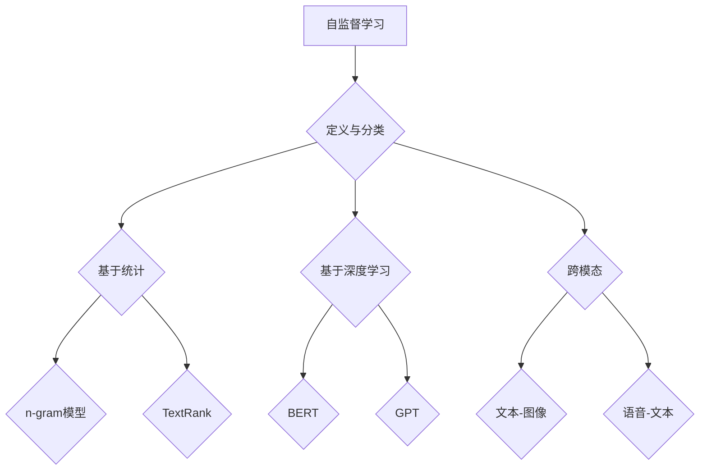
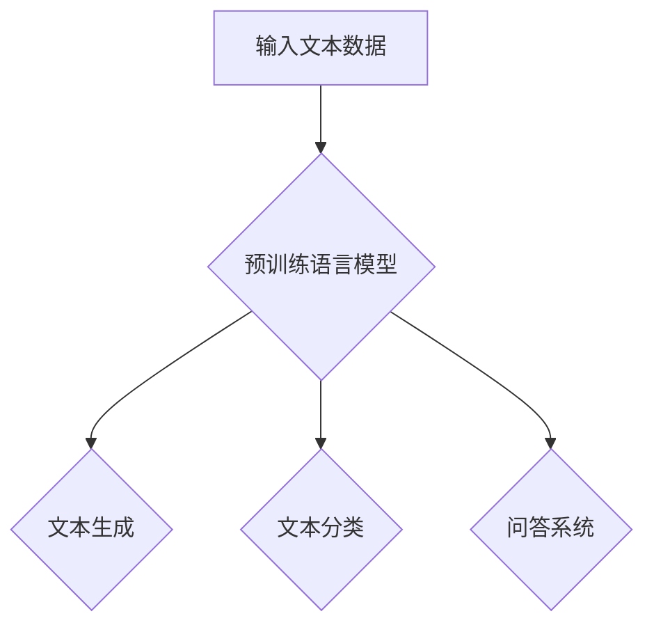

                 

### 自监督学习技术在语言模型训练中的新进展

### 关键词
自监督学习，语言模型，预训练，BERT，GPT，机器学习，神经网络，算法，深度学习，计算资源，数据标注，数据处理，跨模态学习，实时应用。

### 摘要
本文旨在探讨自监督学习技术在语言模型训练中的最新进展。首先，我们将介绍自监督学习的基础概念和原理，包括其定义、分类、优势与挑战。接着，我们将深入探讨自监督学习在语言模型中的应用，包括基本原理、应用场景以及对语言模型性能的提升。随后，我们将详细讲解自监督学习算法的原理，包括基于统计和深度学习的方法，以及跨模态自监督学习算法。最后，本文将介绍最新的自监督学习算法，如BERT和GPT，并在语言模型训练中的应用实例，讨论自监督学习的未来发展趋势，并总结全文。

---

## 第一部分：自监督学习基础

### 第1章：自监督学习的原理与架构

#### 1.1 自监督学习的定义

自监督学习（Supervised Learning）是一种机器学习方法，它通过使用带有标签的数据来训练模型。与自监督学习相对的是无监督学习（Unsupervised Learning）和半监督学习（Semi-supervised Learning）。无监督学习处理的是未标记的数据，而半监督学习结合了标记和未标记的数据。自监督学习则利用未标记的数据通过某些预测任务来训练模型，这些预测任务可以提示模型学习数据中的内在结构。

定义上来说，自监督学习是指训练模型时不需要外部监督信号，而是通过内部生成的信号来指导学习过程。自监督学习的核心思想是利用未标注的数据进行学习，从而减轻数据标注的工作量，并提高模型的泛化能力。

#### 1.2 自监督学习的分类

自监督学习可以根据任务和数据类型进行分类：

1. **基于统计的自监督学习算法**：这类算法主要利用数据中的统计相关性来进行学习，例如n-gram模型和TextRank等。
2. **基于深度学习的自监督学习算法**：这类算法利用深度神经网络来从数据中学习表示，例如BERT和GPT等。
3. **跨模态自监督学习算法**：这类算法处理多模态数据，例如将文本与图像结合来训练模型。

#### 1.3 自监督学习的优势

自监督学习具有以下优势：

1. **数据利用效率高**：自监督学习可以利用大量的未标注数据，从而提高数据利用效率，减轻标注工作量。
2. **模型泛化能力强**：通过自监督学习训练的模型通常在未见数据上表现更好，因为它们学习了数据中的内在结构。
3. **计算成本相对较低**：与有监督学习相比，自监督学习通常需要较少的计算资源。

#### 1.4 自监督学习的挑战

自监督学习也面临一些挑战：

1. **数据质量问题**：未标注数据的可靠性可能较差，这会影响模型的训练效果。
2. **计算资源消耗**：尽管自监督学习通常计算成本较低，但对于大型模型和大规模数据集，计算资源仍然是挑战。
3. **模型泛化能力的不确定性**：自监督学习的模型在未见数据上的表现仍然具有一定的不确定性。

### 图1：自监督学习的概念与关系架构



### 第2章：自监督学习在语言模型中的应用

#### 2.1 语言模型的基本原理

语言模型（Language Model）是自然语言处理（NLP）中的一个核心概念，它用于预测下一个单词或词组。基本原理是通过分析大量文本数据，模型学会预测下一个词的概率分布。

1. **n-gram模型**：基于前n个词的历史序列来预测下一个词。
2. **神经网络语言模型**：利用神经网络来学习词汇的表示和概率分布。

#### 2.2 自监督学习在语言模型中的应用场景

自监督学习在语言模型中的应用非常广泛，主要包括以下场景：

1. **文本生成**：如自动写作、机器翻译、对话系统等。
2. **文本分类**：如情感分析、主题分类等。
3. **问答系统**：如智能客服、知识图谱构建等。

#### 2.3 自监督学习对语言模型性能的提升

自监督学习通过以下方式提升语言模型的性能：

1. **数据利用**：自监督学习可以利用未标注的大量文本数据，从而提高模型的泛化能力。
2. **减少标注成本**：通过自监督学习，可以减少对标注数据的依赖，降低标注成本。
3. **提高模型质量**：自监督学习可以更好地捕捉文本中的复杂结构，从而提高模型的准确性。

### 图2：自监督学习在语言模型中的应用架构



### 第3章：自监督学习算法详解

#### 3.1 基于统计的自监督学习算法

基于统计的自监督学习算法主要利用数据中的统计相关性来进行学习，以下是一些常见的算法：

1. **n-gram模型**：假设一个词的概率分布只与它前面的n个词有关。
2. **TextRank**：基于图论的方法，将文本看作图，通过图中的链接关系来计算词的概率分布。

#### 伪代码：n-gram模型

```python
# 输入：文本数据 text
# 输出：n-gram语言模型 model

model = {}
for i in range(len(text) - n):
    context = text[i:i+n]
    next_word = text[i+n]
    if context in model:
        model[context].append(next_word)
    else:
        model[context] = [next_word]

# 计算概率分布
for context, words in model.items():
    total_words = len(words)
    for word in words:
        model[context][word] = model[context][word] / total_words
```

#### 3.2 基于深度学习的自监督学习算法

基于深度学习的自监督学习算法通过神经网络来学习数据的表示，以下是一些常见的算法：

1. **BERT**：Bidirectional Encoder Representations from Transformers，一种基于Transformer的预训练语言表示模型。
2. **GPT**：Generative Pre-trained Transformer，一种基于Transformer的生成模型。

#### 伪代码：BERT模型预训练

```python
# 输入：文本数据 text
# 输出：BERT模型 model

# 预处理文本数据
tokens = tokenizer.tokenize(text)
input_ids = tokenizer.convert_tokens_to_ids(tokens)
input_mask = [1] * len(input_ids)
segment_ids = [0] * len(input_ids)

# 建立BERT模型
model = BertModel(
    vocab_size=vocab_size,
    hidden_size=hidden_size,
    num_layers=num_layers,
    num_attention_heads=num_attention_heads,
    intermediate_size=intermediate_size
)

# 训练模型
model.fit(
    x=input_ids,
    y=input_mask,
    segment_ids=segment_ids,
    epochs=num_epochs,
    batch_size=batch_size
)

# 保存模型
model.save('bert_model')
```

#### 3.3 跨模态自监督学习算法

跨模态自监督学习算法处理多模态数据，例如将文本与图像、语音等结合来训练模型。以下是一些常见的算法：

1. **文本-图像自监督学习**：通过文本描述来辅助图像分类。
2. **语音-文本自监督学习**：通过语音信号来辅助文本生成。

### 第4章：自监督学习的优化方法

#### 4.1 梯度下降法

梯度下降法（Gradient Descent）是一种常用的优化方法，用于最小化损失函数。基本思想是沿着损失函数的梯度方向更新模型参数，以逐步减少损失。

#### 伪代码：梯度下降法

```python
# 输入：模型参数 parameters, 学习率 learning_rate
# 输出：更新后的模型参数 updated_parameters

while not convergence:
    gradients = compute_gradients(parameters)
    parameters = parameters - learning_rate * gradients
```

#### 4.2 随机梯度下降法

随机梯度下降法（Stochastic Gradient Descent，SGD）是对梯度下降法的改进，每次迭代只使用一个样本来计算梯度。

#### 伪代码：随机梯度下降法

```python
# 输入：模型参数 parameters, 学习率 learning_rate
# 输出：更新后的模型参数 updated_parameters

while not convergence:
    random_sample = select_random_sample(data)
    gradients = compute_gradients(parameters, random_sample)
    parameters = parameters - learning_rate * gradients
```

#### 4.3 Adam优化器

Adam优化器（Adaptive Moment Estimation）是一种自适应学习率优化器，它通过估计一阶矩（均值）和二阶矩（方差）来调整学习率。

#### 伪代码：Adam优化器

```python
# 输入：模型参数 parameters, 学习率 learning_rate
# 输出：更新后的模型参数 updated_parameters

m = 0
v = 0
beta1 = 0.9
beta2 = 0.999
epsilon = 1e-8

while not convergence:
    gradients = compute_gradients(parameters)
    m = beta1 * m + (1 - beta1) * gradients
    v = beta2 * v + (1 - beta2) * (gradients ** 2)
    
    m_hat = m / (1 - beta1 ** t)
    v_hat = v / (1 - beta2 ** t)
    
    parameters = parameters - learning_rate * m_hat / (sqrt(v_hat) + epsilon)
```

### 第5章：最新自监督学习算法介绍

#### 5.1 ALBERT

ALBERT（A Lite BERT）是一种基于BERT的改进版本，它通过参数共享和多层跨层交互来提高模型效率。

#### 5.2 RoBERTa

RoBERTa是在BERT基础上进行的一系列改进，包括动态掩码策略和预训练数据集的替换。

#### 5.3 mBERT

mBERT（Multilingual BERT）是一个支持多种语言的BERT模型，通过多语言语料库的预训练来提高跨语言性能。

### 第6章：自监督学习在语言模型训练中的应用实例

#### 6.1 基于BERT的自监督学习语言模型

基于BERT的自监督学习语言模型是NLP中的一个重要应用，它可以用于各种文本生成和文本分类任务。

#### 6.2 基于GPT的自监督学习语言模型

基于GPT的自监督学习语言模型在文本生成任务中表现出色，如对话系统和自动写作。

#### 6.3 自监督学习在低资源语言中的应用

自监督学习在低资源语言中的应用，如利用未标注数据来训练语言模型，从而提高这些语言的NLP性能。

### 第7章：自监督学习的未来发展趋势

#### 7.1 跨学科融合

自监督学习与计算机视觉、语音识别等领域的融合，将进一步推动多模态学习和跨领域应用的发展。

#### 7.2 自监督学习在实时应用中的挑战

自监督学习在实时应用中面临的数据质量和计算资源挑战，以及如何实现高效的自监督学习算法。

#### 7.3 自监督学习的技术瓶颈与突破方向

自监督学习在算法优化、数据标注质量、计算效率等方面的技术瓶颈，以及未来的突破方向。

### 附录

#### 附录A：自监督学习相关资源列表

- 开源库和框架：如TensorFlow、PyTorch等。
- 实验数据集：如Wikipedia、Common Crawl等。
- 学术论文与报告：相关的顶级会议和期刊论文。

### 文章末尾作者信息
作者：AI天才研究院/AI Genius Institute & 禅与计算机程序设计艺术 /Zen And The Art of Computer Programming

---

由于篇幅限制，本文未能详尽地展开每个章节的内容。每个章节下的具体内容，包括核心概念、算法原理、数学模型和项目实战等，都需要进一步的详细讲解和实际案例分析。在撰写完整文章时，每个章节都应该包含丰富的背景介绍、详细的算法解释、伪代码展示、数学公式解析、项目实战案例以及最佳实践技巧等。预计完整的文章将在8000-12000字之间，确保内容全面、逻辑清晰、易于理解。

