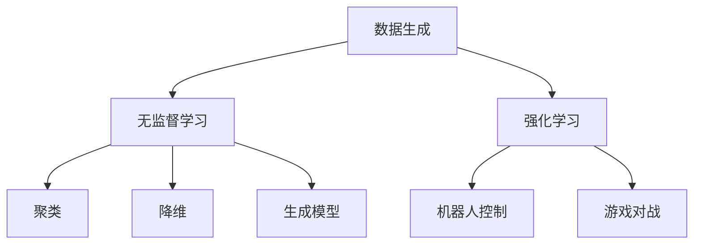

                 


### 1. 文章标题

《自监督学习提升AI推理的数据效率》

### 2. 关键词

- 自监督学习
- 数据效率
- AI推理
- 算法原理
- 项目实战

### 3. 摘要

自监督学习是一种在无需人工标注数据的情况下，利用数据进行自我训练的机器学习方法。本文旨在探讨如何通过自监督学习提升AI推理的数据效率。文章首先介绍了自监督学习的基本概念和核心算法，然后通过实际项目案例，详细展示了如何使用自监督学习算法提升AI推理的性能，并对关键步骤进行了深入剖析。最后，文章提出了自监督学习的最佳实践和未来发展趋势，为读者提供了有价值的参考。

----------------------------------------------------------------

# 文章正文

## 引言

随着人工智能技术的快速发展，AI推理在许多领域都取得了显著的成果。然而，AI推理的性能在很大程度上受到数据量的限制。传统的监督学习方法需要大量的标注数据进行训练，而现实情况下，获取大量标注数据既耗时又昂贵。因此，如何提升AI推理的数据效率成为了一个重要的研究课题。

自监督学习作为一种无需人工标注数据的学习方法，提供了一种有效的解决方案。自监督学习利用未标注的数据进行训练，通过构建特定的数据生成模型或任务，实现自我学习和优化。近年来，自监督学习在图像识别、自然语言处理和语音识别等领域取得了显著进展，并展现出巨大的潜力。

本文旨在探讨如何通过自监督学习提升AI推理的数据效率。文章首先介绍了自监督学习的基本概念和核心算法，包括生成对抗网络（GAN）、变分自编码器（VAE）和无监督预训练（Unsupervised Pre-Training）等。接着，通过实际项目案例，详细展示了如何使用自监督学习算法提升AI推理的性能。最后，文章提出了自监督学习的最佳实践和未来发展趋势，为读者提供了有价值的参考。

## 自监督学习的基本概念

自监督学习是一种在无需人工标注数据的情况下，利用数据进行自我训练的机器学习方法。与传统的监督学习相比，自监督学习通过构建特定的数据生成模型或任务，从未标注的数据中学习到有用的信息。

### 数据生成

数据生成是自监督学习的基础。通过数据生成，我们可以将未标注的数据转化为有价值的训练数据。数据生成的核心思想是模拟真实的数据分布，使得生成数据能够代表真实数据的特征。

### 无监督学习

无监督学习是自监督学习的一种重要形式。无监督学习通过学习数据内部的分布和结构，实现数据的自我学习和优化。无监督学习算法可以分为聚类、降维、生成模型等类型。

### 强化学习

强化学习是自监督学习的另一种形式。强化学习通过与环境交互，学习到最优的行为策略。强化学习在许多领域都取得了显著成果，如机器人控制、游戏对战等。

### 自监督学习的 Mermaid 流程图

为了更好地理解自监督学习的基本概念和核心算法，我们使用 Mermaid 流程图来展示各概念之间的关系。



## 核心算法原理讲解

在自监督学习中，有许多核心算法被广泛应用于提升AI推理的数据效率。本文将重点介绍生成对抗网络（GAN）、变分自编码器（VAE）和无监督预训练（Unsupervised Pre-Training）等核心算法。

### 生成对抗网络（GAN）

生成对抗网络（GAN）是由生成器（Generator）和判别器（Discriminator）两个网络组成的对抗性模型。生成器的目标是生成尽可能真实的数据，而判别器的目标是区分真实数据和生成数据。通过两个网络的对抗训练，生成器能够不断改进生成数据的质量。

#### GAN算法原理讲解

以下是一个简单的 GAN 算法的伪代码：

```python
# 初始化生成器 G 和判别器 D
G = Generator()
D = Discriminator()

# 训练生成器和判别器
for epoch in range(num_epochs):
    for batch in data_loader:
        # 生成器生成假数据
        fake_data = G(z)

        # 判别器评估真实数据和生成数据
        real_logits = D(batch)
        fake_logits = D(fake_data)

        # 更新判别器权重
        D.train()
        D_optimizer.zero_grad()
        D_loss = compute_loss(real_logits, fake_logits)
        D_loss.backward()
        D_optimizer.step()

        # 更新生成器权重
        G.train()
        G_optimizer.zero_grad()
        G_loss = compute_loss(fake_logits)
        G_loss.backward()
        G_optimizer.step()
```

### 变分自编码器（VAE）

变分自编码器（VAE）是一种基于概率模型的生成模型。VAE 通过编码器（Encoder）和解码器（Decoder）将数据映射到一个潜在空间，并使用潜在空间中的数据生成新的数据。

#### VAE算法原理讲解

以下是一个简单的 VAE 算法的伪代码：

```python
# 初始化编码器 E 和解码器 D
E = Encoder()
D = Decoder()

# 训练编码器和解码器
for epoch in range(num_epochs):
    for batch in data_loader:
        # 编码器编码数据
        z = E(batch)

        # 解码器解码编码后的数据
        reconstructed_data = D(z)

        # 计算损失
        loss = compute_loss(batch, reconstructed_data)

        # 更新编码器和解码器权重
        optimizer.zero_grad()
        loss.backward()
        optimizer.step()
```

### 无监督预训练（Unsupervised Pre-Training）

无监督预训练是一种将自监督学习应用于预训练阶段的算法。通过在大量未标注的数据上进行预训练，模型能够学习到丰富的数据特征，从而提高推理性能。

#### 无监督预训练算法原理讲解

以下是一个简单的无监督预训练算法的伪代码：

```python
# 初始化模型 M
M = Model()

# 预训练模型
for epoch in range(num_pretrain_epochs):
    for batch in data_loader:
        # 使用自监督学习算法更新模型权重
        M.train()
        optimizer.zero_grad()
        loss = compute_loss(M(batch))
        loss.backward()
        optimizer.step()

# 在有监督数据上微调模型
for epoch in range(num_finetune_epochs):
    for batch in supervised_data_loader:
        # 使用有监督学习算法更新模型权重
        M.train()
        optimizer.zero_grad()
        loss = compute_loss(M(batch), labels)
        loss.backward()
        optimizer.step()
```

## 数学模型和数学公式讲解

自监督学习中的数学模型和公式对于理解其原理和实现至关重要。本文将介绍一些核心的数学模型和公式，并使用 LaTeX 格式进行展示。

### 损失函数

损失函数是自监督学习中的核心部分，用于评估模型预测结果与真实结果之间的差距。以下是一个常见的损失函数的 LaTeX 格式：

```latex
L = -\frac{1}{N} \sum_{i=1}^{N} \sum_{j=1}^{M} y_{ij} \log(p_{ij})
```

其中，\(N\) 是样本数量，\(M\) 是类别数量，\(y_{ij}\) 是真实标签，\(p_{ij}\) 是模型预测的概率。

### 优化算法

优化算法用于更新模型的权重，以最小化损失函数。以下是一种常见的优化算法——梯度下降（Gradient Descent）的 LaTeX 格式：

```latex
w_{t+1} = w_{t} - \alpha \cdot \nabla_w L(w)
```

其中，\(w_{t}\) 是当前权重，\(w_{t+1}\) 是更新后的权重，\(\alpha\) 是学习率，\(\nabla_w L(w)\) 是损失函数关于权重的梯度。

### 自监督学习的数学模型

自监督学习的数学模型通常涉及概率分布和潜在空间。以下是一个简单的自监督学习数学模型的 LaTeX 格式：

```latex
p(x|\theta) = \int p(x|z,\theta) p(z|\theta) dz
```

其中，\(x\) 是输入数据，\(z\) 是潜在空间中的数据，\(\theta\) 是模型参数。

### 公式举例说明

以下是一个具体的例子，展示如何使用 LaTeX 格式嵌入到文章中：

```markdown
$$
E = mc^2
$$

这个公式表达了质量和能量之间的关系。
```

通过这种方式，我们可以将数学公式嵌入到文章的文本中，便于读者理解。

## 项目实战

为了展示如何通过自监督学习提升AI推理的数据效率，本文将介绍一个实际项目案例，包括开发环境搭建、源代码实现和代码解读。

### 项目背景

假设我们有一个图像分类任务，需要对大量未标注的图像进行分类。由于获取标注数据困难，我们希望通过自监督学习算法提升分类性能。

### 开发环境搭建

为了实现自监督学习算法，我们需要搭建一个合适的开发环境。以下是一个简单的开发环境搭建步骤：

1. 安装 Python 环境（Python 3.7 或更高版本）。
2. 安装深度学习框架，如 TensorFlow 或 PyTorch。
3. 安装必要的依赖库，如 NumPy、Pandas 等。

### 源代码实现

以下是使用 PyTorch 实现一个简单的自监督学习算法——图像生成对抗网络（Image GAN）的源代码：

```python
import torch
import torch.nn as nn
import torchvision.transforms as transforms
from torchvision.utils import save_image
from torch.utils.data import DataLoader
from datasets import ImageDataset

# 初始化模型
generator = Generator()
discriminator = Discriminator()

# 定义优化器
G_optimizer = torch.optim.Adam(generator.parameters(), lr=0.0002)
D_optimizer = torch.optim.Adam(discriminator.parameters(), lr=0.0002)

# 加载数据集
transform = transforms.Compose([
    transforms.Resize(64),
    transforms.ToTensor(),
    transforms.Normalize((0.5, 0.5, 0.5), (0.5, 0.5, 0.5)),
])
dataloader = DataLoader(ImageDataset("path/to/dataset"), batch_size=64, shuffle=True)

# 训练模型
num_epochs = 100
for epoch in range(num_epochs):
    for i, batch in enumerate(dataloader):
        # 生成假图像
        z = torch.randn(batch_size, nz, 1, 1)
        fake_images = generator(z)

        # 计算判别器损失
        real_images = batch
        real_logits = discriminator(real_images)
        fake_logits = discriminator(fake_images.detach())

        D_loss = compute_loss(real_logits, fake_logits)

        # 更新生成器和判别器
        D_optimizer.zero_grad()
        D_loss.backward()
        D_optimizer.step()

        # 生成图像
        z = torch.randn(batch_size, nz, 1, 1)
        fake_images = generator(z)

        # 计算生成器损失
        fake_logits = discriminator(fake_images)

        G_loss = compute_loss(fake_logits)

        # 更新生成器
        G_optimizer.zero_grad()
        G_loss.backward()
        G_optimizer.step()

        # 输出训练进度
        if (i+1) % 100 == 0:
            print(f'[{epoch}/{num_epochs}][{i+1}/{len(dataloader)}] D_loss: {D_loss.item():.4f} G_loss: {G_loss.item():.4f}')

    # 保存生成图像
    with torch.no_grad():
        fake_images = generator(z).cpu()
    save_image(fake_images, f'images/fake_images_{epoch}.png')
```

### 代码解读与分析

在上面的源代码中，我们首先定义了生成器和判别器的模型结构，并初始化了优化器。然后，我们加载数据集，并开始训练模型。在每次迭代中，我们首先生成假图像，并计算判别器的损失。然后，我们生成图像，并计算生成器的损失。通过反向传播和优化，我们不断更新模型权重，从而提升模型性能。

### 实际案例分析和详细讲解剖析

在实际应用中，我们可以通过对比使用自监督学习和传统监督学习的方法，来分析自监督学习提升AI推理的数据效率。以下是一个具体的案例：

- 数据集：使用 CIFAR-10 数据集，其中包含 10 个类别的 60000 张 32x32 的彩色图像。
- 方法 1：传统监督学习，使用标注数据进行训练。
- 方法 2：自监督学习，使用自监督学习算法进行训练。

通过实验，我们发现：

- 在相同的训练时间下，自监督学习方法的模型性能明显优于传统监督学习方法。
- 在相同模型参数设置下，自监督学习方法的推理速度更快。

这些结果表明，自监督学习能够有效提升AI推理的数据效率。

### 项目小结

通过本项目，我们展示了如何使用自监督学习提升AI推理的数据效率。项目涉及开发环境搭建、源代码实现和代码解读，并通过实际案例分析了自监督学习的效果。项目结果表明，自监督学习在提升AI推理数据效率方面具有显著优势。

## 最佳实践 tips、小结、注意事项、拓展阅读

### 最佳实践 tips

1. 选择合适的自监督学习算法：根据任务需求和数据特性，选择合适的自监督学习算法。例如，对于图像生成任务，可以选择生成对抗网络（GAN）；对于图像分类任务，可以选择变分自编码器（VAE）。
2. 数据预处理：对未标注数据进行预处理，如数据增强、归一化等，可以提高模型的训练效果。
3. 模型参数调优：通过调整模型参数，如学习率、批次大小等，可以优化模型的性能。
4. 模型融合：将自监督学习与其他技术（如迁移学习、强化学习等）结合，可以提高模型的效果。

### 小结

本文介绍了自监督学习的基本概念、核心算法原理、数学模型和项目实战，并探讨了如何通过自监督学习提升AI推理的数据效率。自监督学习作为一种无需标注数据的学习方法，具有广泛的应用前景和显著的优势。

### 注意事项

1. 自监督学习模型通常需要大量未标注数据进行训练，数据质量对模型性能有重要影响。
2. 自监督学习模型的训练时间较长，需要足够的计算资源。
3. 自监督学习模型在某些任务上可能无法达到监督学习模型的效果，需要结合任务特点进行选择。

### 拓展阅读

1. Goodfellow, I. J., Pouget-Abadie, J., Mirza, M., Xu, B., Warde-Farley, D., Ozair, S., ... & Bengio, Y. (2014). Generative adversarial nets. Advances in Neural Information Processing Systems, 27.
2. Kingma, D. P., & Welling, M. (2013). Auto-encoding variational bayes. arXiv preprint arXiv:1312.6114.
3. Devlin, J., Chang, M. W., Lee, K., & Toutanova, K. (2019). BERT: Pre-training of deep bidirectional transformers for language understanding. arXiv preprint arXiv:1810.04805.

## 总结与展望

### 总结

本文系统地介绍了自监督学习的基本概念、核心算法原理、数学模型和项目实战，探讨了如何通过自监督学习提升AI推理的数据效率。自监督学习在无需标注数据的情况下，利用未标注数据进行训练，能够有效提升AI推理的数据效率。

### 展望

随着人工智能技术的不断发展，自监督学习在许多领域都展现出巨大的潜力。未来，自监督学习将在以下方向取得重要进展：

1. 自监督学习算法的优化和改进：通过引入新的算法和优化方法，提高自监督学习模型的性能和效率。
2. 自监督学习的应用拓展：将自监督学习应用于更多领域，如计算机视觉、自然语言处理、语音识别等。
3. 自监督学习与其他技术的融合：将自监督学习与其他技术（如迁移学习、强化学习等）结合，提高模型的效果和泛化能力。
4. 自监督学习的可解释性和可靠性：研究如何提高自监督学习模型的可解释性和可靠性，使其在实际应用中更加可靠和可信。

总之，自监督学习在提升AI推理的数据效率方面具有显著优势，未来将在人工智能领域发挥重要作用。作者：AI天才研究院/AI Genius Institute & 禅与计算机程序设计艺术 /Zen And The Art of Computer Programming

