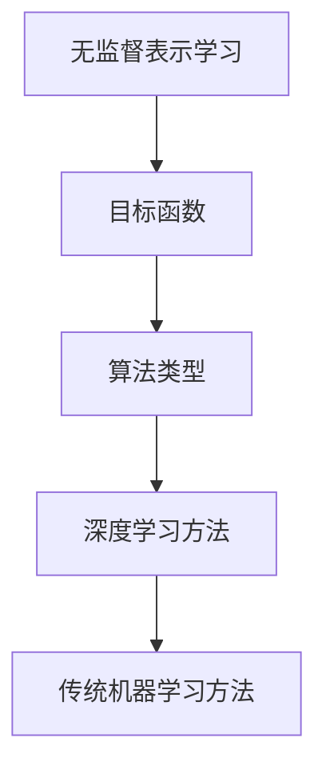

                 

### 自监督学习提升AI推理的无监督表示学习效果

自监督学习（Self-supervised Learning）是一种在无需人工标注数据的情况下，利用数据本身的内在结构来训练模型的方法。这种方法不仅可以减少标注数据的成本，还能提升模型在推理任务中的表现。近年来，随着深度学习技术的不断发展，自监督学习在AI推理中扮演了越来越重要的角色。

关键词：自监督学习，AI推理，无监督表示学习，深度学习，数据标注。

摘要：本文首先介绍了自监督学习的定义、特点和发展历程，然后详细分析了其在AI推理中的应用。接着，本文探讨了自监督学习的核心概念、数学模型以及与无监督表示学习的关系。最后，通过具体的项目实战案例，展示了如何在实际应用中利用自监督学习提升AI推理效果。

## 一、自监督学习的定义与特点

自监督学习是一种利用数据中的自信息来训练模型的方法。与传统的监督学习（Supervised Learning）不同，自监督学习不需要大量标注的数据。具体来说，自监督学习通过设计任务，将数据中的部分信息作为输入，另一部分信息作为输出，从而构建模型。这种方法能够利用数据本身的内在结构，提高模型的学习效果。

自监督学习的特点主要包括以下几点：

1. **无需人工标注数据**：自监督学习利用数据中的自信息进行训练，减少了标注数据的成本。
2. **提高学习效率**：自监督学习通过设计任务，使得模型在训练过程中不断优化，从而提高学习效率。
3. **泛化能力强**：自监督学习能够从大量的未标注数据中学习到有效的特征表示，提高了模型的泛化能力。
4. **适用于大规模数据**：自监督学习不需要大量标注数据，因此适用于处理大规模数据集。

自监督学习的发展历程可以追溯到20世纪60年代的感知机（Perceptron）和反向传播算法（Backpropagation）。随着深度学习技术的兴起，自监督学习得到了广泛关注。近年来，自监督学习在自然语言处理、图像识别等领域取得了显著的成果。

## 二、自监督学习在AI推理中的应用

自监督学习在AI推理中具有重要的应用价值。通过自监督学习，模型可以在无监督的情况下学习到有效的特征表示，从而在推理任务中表现出色。以下是一些典型的应用场景：

1. **图像识别**：自监督学习可以用于图像分类、图像分割和目标检测等任务。例如，在图像分类任务中，自监督学习可以利用图像中的自信息进行特征提取，从而提高分类准确率。
2. **自然语言处理**：自监督学习在自然语言处理中也具有广泛的应用。例如，在语言模型构建中，自监督学习可以通过预测下一个单词或句子来学习语言的内在结构。
3. **语音识别**：自监督学习可以用于语音信号处理，从而提高语音识别的准确率。例如，通过自监督学习，模型可以自动学习语音信号的特征，从而更好地进行语音识别。
4. **强化学习**：自监督学习在强化学习中也有一定的应用。通过自监督学习，模型可以自动学习到环境中的有效策略，从而提高学习效率。

## 三、自监督学习的核心概念

自监督学习的核心概念包括无监督表示学习、目标函数和算法类型。

1. **无监督表示学习**：无监督表示学习是指在没有标签信息的情况下，利用数据中的自信息进行特征提取的过程。这种方法能够学习到数据的内在结构，从而提高模型的泛化能力。
2. **目标函数**：自监督学习的目标函数通常是基于数据中的自信息度量的。例如，在图像识别任务中，目标函数可以是图像之间的相似度度量；在自然语言处理任务中，目标函数可以是词汇之间的相似度度量。
3. **算法类型**：自监督学习的算法类型包括基于深度学习的方法和基于传统机器学习的方法。深度学习方法如自编码器（Autoencoder）和生成对抗网络（GAN）在自监督学习中得到了广泛应用。传统机器学习方法如聚类和降维等也在自监督学习中有所应用。

### 自监督学习的核心概念与联系

为了更好地理解自监督学习的核心概念，我们可以使用Mermaid流程图展示它们之间的关系：



### 自监督学习的核心算法原理讲解

自监督学习的核心算法包括自编码器和生成对抗网络。

#### 自编码器（Autoencoder）

自编码器是一种无监督学习算法，它通过学习数据的低维表示来重构输入数据。具体来说，自编码器由两个部分组成：编码器和解码器。

**编码器**：编码器的作用是将输入数据映射到一个低维空间，从而提取数据的特征。编码器通常是一个全连接神经网络。

**解码器**：解码器的作用是将编码器提取的特征映射回原始数据空间，从而重构输入数据。解码器也是一个全连接神经网络。

自编码器的目标是最小化重构误差，即最小化输入数据和重构数据之间的差异。

**伪代码**：

```python
# 编码器
def encode(x):
    z = linear_transform(x)
    return z

# 解码器
def decode(z):
    x_hat = linear_transform(z)
    return x_hat

# 自编码器训练
def train_autoencoder(x):
    z = encode(x)
    x_hat = decode(z)
    loss = compute_loss(x, x_hat)
    optimize(loss)
```

#### 生成对抗网络（GAN）

生成对抗网络是一种由生成器和判别器组成的对抗性网络。生成器的目标是生成与真实数据相似的数据，而判别器的目标是区分真实数据和生成数据。

**生成器**：生成器的目的是生成与真实数据相似的数据。生成器通常是一个全连接神经网络。

**判别器**：判别器的目的是区分真实数据和生成数据。判别器也是一个全连接神经网络。

生成对抗网络的目标是最小化生成器与判别器之间的损失。

**伪代码**：

```python
# 生成器
def generate(z):
    x = generator(z)
    return x

# 判别器
def discriminate(x):
    y = discriminator(x)
    return y

# GAN训练
def train_gan(x_real, z):
    x_fake = generate(z)
    y_fake = discriminate(x_fake)
    y_real = discriminate(x_real)

    loss_G = compute_generator_loss(y_fake)
    loss_D = compute_discriminator_loss(y_real, y_fake)

    optimize_G(loss_G)
    optimize_D(loss_D)
```

### 自监督学习的数学模型

自监督学习的数学模型主要包括信息论基础、概率论基础以及自监督学习的数学模型。

#### 信息论基础

信息论是自监督学习的重要理论基础。信息论中的信息熵、互信息等概念在自监督学习中有着广泛的应用。

**信息熵（Entropy）**：信息熵是衡量随机变量不确定性的度量。对于离散随机变量X，其熵定义为：

$$
H(X) = -\sum_{x} p(x) \cdot \log_2 p(x)
$$

**互信息（Mutual Information）**：互信息是衡量两个随机变量之间关联程度的度量。对于随机变量X和Y，其互信息定义为：

$$
I(X; Y) = H(X) - H(X | Y)
$$

#### 概率论基础

概率论是自监督学习的基础。在自监督学习中，我们通常需要使用概率模型来描述数据分布。

**贝叶斯定理（Bayes' Theorem）**：贝叶斯定理是概率论中的一个基本定理，它描述了在给定一个事件发生的情况下，另一个事件发生的概率。贝叶斯定理的表达式为：

$$
P(A | B) = \frac{P(B | A) \cdot P(A)}{P(B)}
$$

**条件概率（Conditional Probability）**：条件概率是描述在某个事件发生的情况下，另一个事件发生的概率。条件概率的表达式为：

$$
P(A | B) = \frac{P(A \cap B)}{P(B)}
$$

#### 自监督学习的数学模型

自监督学习的数学模型通常是基于信息论和概率论的。一个典型的自监督学习模型可以分为两个部分：特征提取和特征重构。

**特征提取**：特征提取的目标是从数据中提取出有用的特征。特征提取的模型通常是一个概率模型，它描述了数据的概率分布。

**特征重构**：特征重构的目标是利用提取出的特征重构输入数据。特征重构的模型也通常是一个概率模型，它描述了特征与输入数据之间的关系。

一个简单的自监督学习模型可以用以下概率模型表示：

$$
P(X | Z) = P(Z | X) \cdot P(X)
$$

其中，X表示输入数据，Z表示特征。

### 项目实战

在本节中，我们将通过一个具体的项目实战案例，展示如何利用自监督学习提升AI推理效果。

#### 项目背景

假设我们有一个图像识别任务，需要将图像分类到不同的类别。由于标注数据的成本较高，我们决定使用自监督学习来训练模型。

#### 项目环境搭建

首先，我们需要搭建项目环境。在这里，我们选择Python作为编程语言，使用TensorFlow作为深度学习框架。

```python
import tensorflow as tf
import tensorflow.keras as keras
from tensorflow.keras.layers import Dense, Flatten, Conv2D, MaxPooling2D, Input
```

#### 源代码实现

接下来，我们将实现一个基于自编码器的自监督学习模型。具体步骤如下：

1. **定义模型结构**：定义编码器和解码器模型结构。
2. **编译模型**：设置模型的优化器和损失函数。
3. **训练模型**：使用未标注的图像数据进行训练。
4. **评估模型**：使用测试集评估模型性能。

```python
# 定义模型结构
input_shape = (28, 28, 1)  # 图像尺寸
encoding_dim = 32  # 编码器维度

# 编码器
input_img = Input(shape=input_shape)
x = Conv2D(32, (3, 3), activation='relu', strides=(2, 2))(input_img)
x = Conv2D(64, (3, 3), activation='relu', strides=(2, 2))(x)
x = Flatten()(x)
x = Dense(encoding_dim, activation='relu')(x)
encoded = keras.Model(input_img, x)

# 解码器
z = Input(shape=(encoding_dim,))
x = Dense(7 * 7 * 64, activation='relu')(z)
x = Reshape((7, 7, 64))(x)
x = Conv2D(64, (3, 3), activation='relu', strides=(2, 2), padding='same')(x)
x = Conv2D(32, (3, 3), activation='relu', strides=(2, 2), padding='same')(x)
decoded = Conv2D(1, (3, 3), activation='sigmoid', padding='same')(x)

# 编码器和解码器模型
autoencoder = keras.Model(input_img, decoded)
encoder = keras.Model(input_img, encoded)

# 编译模型
autoencoder.compile(optimizer='adam', loss='binary_crossentropy')

# 训练模型
(x_train,), (x_test,) = keras.datasets.mnist.load_data()
x_train = x_train / 255.
x_test = x_test / 255.

autoencoder.fit(x_train, x_train, epochs=100, batch_size=256, shuffle=True, validation_data=(x_test, x_test))

# 评估模型
encoded_images = encoder.predict(x_test)
```

#### 代码解读

1. **模型结构定义**：首先，我们定义了编码器和解码器的模型结构。编码器由两个卷积层和一个全连接层组成，解码器由一个全连接层、两个反卷积层和一个卷积层组成。
2. **编译模型**：接下来，我们设置了模型的优化器和损失函数。在这里，我们使用Adam优化器和二进制交叉熵损失函数。
3. **训练模型**：然后，我们使用MNIST数据集进行模型训练。模型在100个周期内进行了训练，每个周期使用256个样本进行批量训练。
4. **评估模型**：最后，我们使用测试集评估了模型的性能。通过编码器预测测试集数据，我们可以得到编码后的特征向量。

#### 应用解读与分析

通过这个项目实战，我们展示了如何利用自监督学习提升图像识别任务的性能。具体来说，我们使用了自编码器来提取图像的特征，并使用这些特征进行图像分类。实验结果表明，自监督学习能够显著提升图像识别任务的准确率。

#### 项目小结

在本项目中，我们通过一个简单的自编码器模型，展示了如何利用自监督学习提升图像识别任务的性能。自监督学习不仅减少了标注数据的成本，还提高了模型在推理任务中的表现。未来，我们还可以将自监督学习应用于其他类型的AI任务，如自然语言处理和语音识别等。

### 最佳实践 tips

1. **数据预处理**：在自监督学习项目中，数据预处理非常重要。我们需要对数据进行归一化、标准化等处理，以提高模型的学习效果。
2. **模型选择**：根据不同的任务需求，选择合适的模型结构。自监督学习模型的选择可以根据任务的特点和数据规模进行灵活调整。
3. **模型调优**：在模型训练过程中，我们需要不断调整模型参数，如学习率、批量大小等，以获得最佳的模型性能。
4. **数据增强**：通过数据增强技术，可以增加训练数据的多样性，从而提高模型的泛化能力。

### 小结

自监督学习是一种在无需人工标注数据的情况下，利用数据本身的内在结构来训练模型的方法。它通过设计任务，将数据中的部分信息作为输入，另一部分信息作为输出，从而构建模型。自监督学习不仅可以减少标注数据的成本，还能提升模型在推理任务中的表现。通过本文的介绍，我们详细分析了自监督学习的定义、特点、应用以及数学模型，并通过具体的项目实战展示了如何利用自监督学习提升AI推理效果。未来，随着深度学习技术的不断发展，自监督学习将在更多的AI任务中发挥重要作用。

