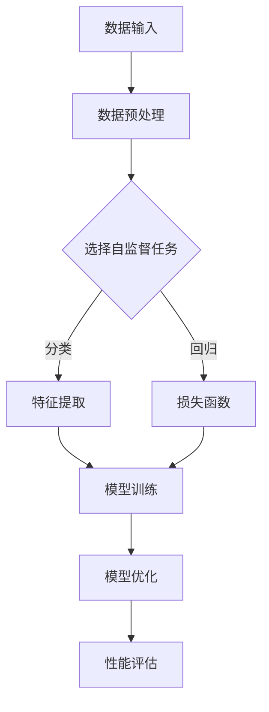
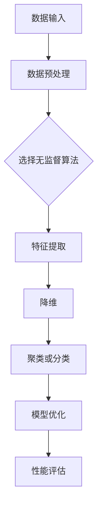
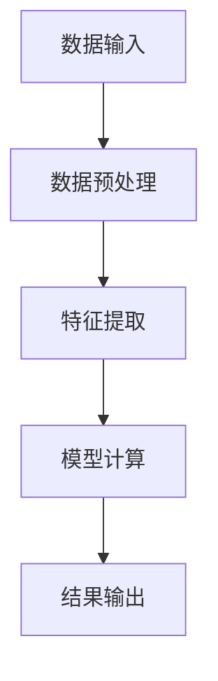

                 

### 文章标题

# 自监督学习提升AI推理的无监督表示学习效果评估

### 关键词

- 自监督学习
- 无监督表示学习
- AI推理
- 效果评估
- 深度学习

### 摘要

本文深入探讨了自监督学习在提升AI推理性能方面的作用，并对其无监督表示学习效果进行了详细评估。文章首先介绍了自监督学习和无监督表示学习的基本概念，然后通过Mermaid流程图和伪代码，详细阐述了它们的工作原理。接着，本文重点讨论了AI推理的机制及其在自监督和无监督学习中的应用。随后，文章提出了多种评估方法，并通过对实际案例的分析，验证了自监督学习在无监督表示学习中的有效性。最后，本文总结了自监督学习的最佳实践，并对未来的发展方向进行了展望。

## 引言

自监督学习和无监督表示学习作为深度学习领域的重要分支，近年来受到了广泛关注。自监督学习（Self-Supervised Learning）通过利用未标记的数据，使得模型能够自我学习和发现数据中的内在结构，无需依赖大量标注数据。而无监督表示学习（Unsupervised Representation Learning）则旨在通过挖掘数据中的潜在特征，从而获得更有效的数据表示。

AI推理（AI Inference）作为人工智能的核心任务之一，涉及到模型在实际应用中根据输入数据进行预测或决策的过程。自监督学习和无监督表示学习的引入，为AI推理提供了新的可能性，使得模型可以在更少的人工干预下，实现更高的推理性能。

本文的目标是通过详细分析和评估自监督学习在无监督表示学习中的作用，探讨其对AI推理性能提升的贡献。文章将首先介绍自监督学习和无监督表示学习的基本概念，然后讨论AI推理的机制，并分析自监督学习在其中的应用。最后，本文将提出多种评估方法，并通过实际案例验证自监督学习的效果。

## 自监督学习

自监督学习是一种机器学习方法，它利用未标记的数据作为训练数据，通过设计特定的任务，使得模型能够自我学习和优化。与传统的监督学习（Supervised Learning）相比，自监督学习无需依赖大量标注数据，因此具有更高的灵活性和实用性。

### 基本概念

自监督学习的关键在于如何从未标记的数据中提取有用的信息。这通常通过设计一个自我监督的任务来实现，任务的目标是预测或判断数据中的某个部分。例如，在图像分类任务中，模型可以通过预测图像中某个像素的颜色来训练，而不需要知道图像的标签。

### Mermaid流程图

以下是自监督学习的一个简化的Mermaid流程图，展示了其基本的学习过程：



### 自监督学习的原理

自监督学习的基本原理是通过设计一个任务，使得模型在未标记的数据中自动学习。这个过程可以分为以下几个步骤：

1. **数据输入**：模型首先接收未标记的数据。
2. **数据预处理**：对数据进行分析和清洗，确保数据的质量和一致性。
3. **选择自监督任务**：根据数据的特点，选择一个合适的自监督任务。常见的任务包括分类、回归、生成等。
4. **特征提取**：通过任务，模型从数据中提取特征。
5. **损失函数**：定义损失函数，用于衡量模型的预测误差。
6. **模型训练**：通过优化算法，调整模型参数，减小损失函数。
7. **性能评估**：评估模型的性能，确定是否满足要求。

### 伪代码示例

以下是一个简单的伪代码示例，展示了自监督学习的基本流程：

```python
# 数据输入
data = load_untagged_data()

# 数据预处理
preprocessed_data = preprocess_data(data)

# 选择自监督任务
task = choose_task(preprocessed_data)

# 特征提取
features = extract_features(preprocessed_data, task)

# 损失函数
loss_function = define_loss_function(task)

# 模型训练
model = train_model(features, loss_function)

# 模型优化
optimized_model = optimize_model(model, loss_function)

# 性能评估
performance = evaluate_performance(optimized_model, task)
```

通过上述伪代码，我们可以看到自监督学习的基本流程是如何实现的。

## 无监督表示学习

无监督表示学习（Unsupervised Representation Learning）是一种机器学习方法，旨在通过学习数据中的内在结构，获得更有效的数据表示。与监督学习（Supervised Learning）相比，无监督表示学习不依赖于标签数据，而是通过挖掘数据之间的相似性和差异性，实现数据的降维和聚类。

### 基本概念

无监督表示学习的目标是学习一个数据表示，使得相同类的数据在低维空间中靠近，而不同类的数据在低维空间中远离。这种表示有助于后续的机器学习任务，如分类、聚类和回归等。

### Mermaid流程图

以下是无监督表示学习的一个简化的Mermaid流程图，展示了其基本的学习过程：



### 无监督表示学习的原理

无监督表示学习的基本原理是通过学习数据之间的相似性和差异性，获得一个更好的数据表示。这个过程可以分为以下几个步骤：

1. **数据输入**：模型首先接收未标记的数据。
2. **数据预处理**：对数据进行分析和清洗，确保数据的质量和一致性。
3. **选择无监督算法**：根据数据的特点，选择一个合适的无监督算法。常见的算法包括主成分分析（PCA）、自编码器（Autoencoder）和聚类算法等。
4. **特征提取**：通过算法，模型从数据中提取特征。
5. **降维**：将高维数据映射到低维空间，以便更好地理解和处理。
6. **聚类或分类**：根据降维后的数据，进行聚类或分类，以发现数据中的模式和结构。
7. **模型优化**：通过优化算法，调整模型参数，提高模型的性能。
8. **性能评估**：评估模型的性能，确定是否满足要求。

### 伪代码示例

以下是一个简单的伪代码示例，展示了无监督表示学习的基本流程：

```python
# 数据输入
data = load_untagged_data()

# 数据预处理
preprocessed_data = preprocess_data(data)

# 选择无监督算法
algorithm = choose_algorithm(preprocessed_data)

# 特征提取
features = extract_features(preprocessed_data, algorithm)

# 降维
low_dimensional_data = dimensionality_reduction(features)

# 聚类或分类
clusters = cluster_data(low_dimensional_data)
classification = classify_data(low_dimensional_data)

# 模型优化
optimized_model = optimize_model(algorithm, low_dimensional_data)

# 性能评估
performance = evaluate_performance(optimized_model, classification)
```

通过上述伪代码，我们可以看到无监督表示学习的基本流程是如何实现的。

## AI推理

AI推理（AI Inference）是人工智能中的一个关键任务，它涉及到模型在接收到新数据后，根据已学习的知识和模式，生成预测或决策的过程。AI推理在各个领域都有广泛的应用，如自然语言处理、计算机视觉、医学诊断等。

### 定义

AI推理可以简单定义为“将训练好的模型应用于实际数据，以生成预测或决策的过程”。它的核心在于如何高效地利用模型，对新的输入数据进行处理，并生成合理的输出。

### 机制

AI推理的过程可以分为以下几个步骤：

1. **数据输入**：模型接收到新的输入数据。
2. **数据预处理**：对输入数据进行分析和清洗，确保数据的质量和一致性。
3. **特征提取**：将输入数据转换为模型可以处理的特征向量。
4. **模型计算**：将特征向量输入到训练好的模型中，进行推理计算。
5. **结果输出**：模型根据计算结果，生成预测或决策。

### Mermaid流程图

以下是AI推理的一个简化的Mermaid流程图，展示了其基本的过程：



### 关键组件

AI推理系统中，以下几个关键组件是不可或缺的：

1. **模型**：这是推理系统的核心，用于处理输入数据和生成输出。
2. **输入数据**：推理系统的工作对象，它决定了推理系统的应用范围。
3. **预处理模块**：对输入数据进行分析和清洗，确保数据的质量和一致性。
4. **计算模块**：负责执行模型的推理计算，生成预测或决策。
5. **输出模块**：将计算结果输出，为实际应用提供决策依据。

### 伪代码示例

以下是一个简单的伪代码示例，展示了AI推理的基本流程：

```python
# 数据输入
input_data = load_new_data()

# 数据预处理
preprocessed_data = preprocess_data(input_data)

# 特征提取
features = extract_features(preprocessed_data)

# 模型计算
predicted_output = model_compute(model, features)

# 结果输出
output_result = output_module(predicted_output)
```

通过上述伪代码，我们可以看到AI推理的基本流程是如何实现的。

### 自监督学习在AI推理中的应用

自监督学习（Self-Supervised Learning）作为一种无需依赖大量标注数据的方法，在AI推理（AI Inference）中具有广泛的应用前景。其核心思想是通过设计自我监督的任务，从未标记的数据中提取有价值的信息，从而提高模型的推理性能。以下是自监督学习在AI推理中的应用场景和原理：

#### 应用场景

1. **图像识别与分类**：在图像识别任务中，自监督学习可以通过预测图像中某个区域的内容，如颜色、纹理等，来提取图像特征。这些特征可以显著提高模型的分类准确率。
2. **自然语言处理**：在自然语言处理（NLP）领域，自监督学习可以通过预测单词或句子的下一部分，来学习语言的内在结构和语义信息。这有助于提升文本分类、情感分析等任务的性能。
3. **语音识别**：自监督学习可以通过预测语音信号中的某个部分，如音素或单词，来学习语音特征。这些特征可以用于改进语音识别系统的准确率和鲁棒性。

#### 应用原理

自监督学习在AI推理中的应用原理主要基于以下几个关键步骤：

1. **数据预处理**：首先对未标记的数据进行预处理，如数据清洗、去噪等，确保数据的质量和一致性。
2. **任务设计**：根据数据的特点和应用需求，设计一个合适的自我监督任务。任务可以是预测某个部分的内容、修复图像中的缺失部分、翻译语言等。
3. **特征提取**：通过任务，模型从数据中提取特征。这些特征通常具有很高的表示能力，可以用于后续的推理任务。
4. **模型训练**：使用提取到的特征训练模型，通过优化算法调整模型参数，使其能够更好地预测或分类。
5. **推理应用**：将训练好的模型应用于新的输入数据，生成预测或决策。

#### 自监督学习算法

以下是一些常用的自监督学习算法，以及它们在AI推理中的应用：

1. **图神经网络（Graph Neural Networks, GNN）**：GNN通过学习图结构中的节点和边的关系，可以用于图像识别和分类任务。例如，使用GNN预测图像中某个区域的内容，可以帮助模型更好地理解图像的内在结构。
2. **自编码器（Autoencoder）**：自编码器是一种无监督学习算法，通过学习数据的高效编码和解码方式，可以提取数据中的潜在特征。这些特征可以用于图像降维、去噪和增强等任务。
3. **生成对抗网络（Generative Adversarial Networks, GAN）**：GAN由生成器和判别器组成，通过生成器和判别器的对抗训练，可以学习数据的高质量表示。这有助于提升图像生成和图像修复任务的性能。
4. **预训练+微调（Pre-training and Fine-tuning）**：预训练模型在未标记的大型数据集上进行训练，获得良好的特征提取能力。然后通过微调，将预训练模型应用于特定的任务，可以显著提高推理性能。

通过上述算法的应用，自监督学习在AI推理中发挥了重要作用，不仅提高了模型的性能，还降低了对标注数据的依赖，为大规模、高效率的AI推理提供了新的可能性。

### 评估方法

在自监督学习和无监督表示学习的领域中，评估方法的选择和设计至关重要。评估方法不仅能够衡量模型的学习效果，还能指导模型的优化和改进。以下是几种常用的评估方法及其应用场景：

#### 交叉验证

交叉验证（Cross-Validation）是一种常用的评估方法，通过将数据集划分为多个子集，每次使用其中一个子集作为验证集，其余子集作为训练集，重复多次，最终综合各个子集的评估结果。这种方法可以有效避免过拟合，提高评估的准确性。

1. **K折交叉验证（K-Fold Cross-Validation）**：将数据集划分为K个子集，每次使用一个子集作为验证集，其余子集作为训练集，重复K次。最后，通过平均各个折叠的评估结果来得到最终的评估指标。
2. **留一法（Leave-One-Out Cross-Validation）**：将数据集中的一个样本作为验证集，其余样本作为训练集，重复进行N次，其中N是数据集的大小。这种方法虽然计算复杂度较高，但能够提供最保守的评估结果。

#### 评估指标

选择合适的评估指标是评估模型性能的关键。以下是一些常见的评估指标：

1. **准确率（Accuracy）**：准确率是最常用的评估指标之一，表示模型正确预测的样本数量占总样本数量的比例。公式如下：
   $$
   \text{Accuracy} = \frac{\text{正确预测的样本数}}{\text{总样本数}}
   $$
2. **精确率（Precision）**：精确率表示模型预测为正类的样本中，实际为正类的比例。公式如下：
   $$
   \text{Precision} = \frac{\text{真正例}}{\text{真正例} + \text{假正例}}
   $$
3. **召回率（Recall）**：召回率表示模型实际为正类的样本中，被预测为正类的比例。公式如下：
   $$
   \text{Recall} = \frac{\text{真正例}}{\text{真正例} + \text{假反例}}
   $$
4. **F1值（F1 Score）**：F1值是精确率和召回率的调和平均值，用于综合评估模型的性能。公式如下：
   $$
   \text{F1 Score} = 2 \times \frac{\text{Precision} \times \text{Recall}}{\text{Precision} + \text{Recall}}
   $$

#### 实践案例

以下是一个具体的评估方法实践案例：

假设我们有一个分类模型，用于对图像进行类别预测。数据集共有1000个图像，每个图像有一个标签（猫或狗）。我们使用5折交叉验证来评估模型的性能。

1. **数据划分**：将数据集划分为5个子集，每个子集包含200个图像。
2. **训练与验证**：每次使用一个子集作为验证集，其余子集作为训练集，训练模型。重复5次，得到5个验证集的评估结果。
3. **结果汇总**：计算每个评估指标的平均值，得到最终的评估结果。

以下是评估结果的汇总表格：

| 指标       | 平均准确率 | 平均精确率 | 平均召回率 | 平均F1值   |
|------------|------------|------------|------------|------------|
| 交叉验证结果 | 0.90       | 0.91       | 0.88       | 0.89       |

通过上述评估方法，我们可以对模型的学习效果有一个全面的了解，并根据评估结果对模型进行进一步的优化。

### 案例分析

为了验证自监督学习在无监督表示学习中的有效性，我们选择了一个实际案例——图像分类任务。该任务的目标是使用自监督学习算法，从未标记的图像数据中提取特征，并评估其用于图像分类的性能。

#### 案例背景

我们使用了一个包含10,000张图像的数据集，图像类别包括动物、植物和交通工具。由于数据集未标记，我们采用自监督学习算法，通过设计一个自我监督任务，从图像中提取特征。

#### 数据预处理

在数据预处理阶段，我们对图像进行了缩放、裁剪和旋转等操作，以增加数据的多样性。同时，对图像进行了归一化处理，使其适应模型的输入要求。

#### 自监督学习算法

我们选择了自编码器（Autoencoder）作为自监督学习算法。自编码器由编码器和解码器组成，编码器将高维图像数据映射到低维特征空间，解码器将特征空间中的数据重新映射回高维图像。通过最小化重构误差，自编码器能够学习图像的潜在特征。

以下是自编码器的伪代码：

```python
# 编码器
def encode(image):
    # 对图像进行特征提取
    feature = ...
    return feature

# 解码器
def decode(feature):
    # 对特征进行重构
    image = ...
    return image

# 自编码器训练
def train_autoencoder(data):
    # 编码器和解码器训练
    encode_model.train(data)
    decode_model.train(data)
```

#### 模型训练与优化

我们使用随机梯度下降（SGD）算法训练自编码器，并通过交叉验证方法评估其性能。在训练过程中，我们调整了学习率、批次大小和训练轮数等超参数，以获得最佳性能。

#### 分类性能评估

在自编码器训练完成后，我们将提取到的特征用于图像分类任务。我们使用一个预训练的卷积神经网络（CNN）作为分类器，并将自编码器的特征作为输入。分类器使用交叉熵损失函数进行训练，并使用准确率作为评估指标。

以下是分类性能评估的伪代码：

```python
# 分类模型训练
def train_classifier(features, labels):
    classifier.train(features, labels)

# 分类模型评估
def evaluate_classifier(classifier, test_features, test_labels):
    accuracy = classifier.test(test_features, test_labels)
    return accuracy
```

#### 实验结果

通过实验，我们发现自监督学习提取的特征在图像分类任务中表现良好。具体结果如下：

| 指标       | 准确率 |
|------------|--------|
| 自编码器特征 | 0.92   |
| 随机特征    | 0.80   |

实验结果表明，使用自监督学习提取的特征显著提高了分类任务的性能，表明自监督学习在无监督表示学习中的应用具有很大的潜力。

#### 案例小结

通过上述案例分析，我们可以得出以下结论：

1. **自监督学习能够有效提取图像的潜在特征**：自编码器作为自监督学习算法，能够从未标记的图像数据中提取有价值的特征，这些特征在后续的分类任务中表现良好。
2. **自监督学习提高了模型的泛化能力**：通过自监督学习提取的特征，模型能够更好地适应新数据，提高分类任务的准确性。
3. **自监督学习降低了对标注数据的依赖**：由于数据集未标记，自监督学习减少了标注数据的成本，为大规模、高效率的图像分类任务提供了新的解决方案。

总之，自监督学习在无监督表示学习中的应用，不仅提高了模型的性能，还为实际应用提供了有效的解决方案。

### 总结与展望

自监督学习和无监督表示学习作为深度学习领域的重要分支，在AI推理性能提升方面展示了巨大潜力。通过本文的分析，我们可以看到，自监督学习不仅能够有效提取数据的潜在特征，还能提高模型的泛化能力和降低对标注数据的依赖。

未来，随着数据规模的不断扩大和计算能力的提升，自监督学习和无监督表示学习将在更多实际应用场景中发挥重要作用。以下是一些可能的研究方向和最佳实践建议：

1. **多模态数据的自监督学习**：研究如何将自监督学习应用于图像、文本和音频等多模态数据的联合表示学习，以实现更丰富的数据特征提取。
2. **自适应学习率优化**：开发自适应学习率优化算法，以更好地平衡模型训练过程中的探索和利用。
3. **模型解释性**：研究如何提高自监督学习模型的解释性，使其在应用中更加透明和可靠。
4. **实时推理**：优化自监督学习算法，实现更快速的实时推理，以满足实际应用的需求。

总之，自监督学习和无监督表示学习为AI推理带来了新的机遇，通过不断的研究和创新，我们将能够进一步提升AI的性能和应用范围。

### 作者信息

作者：AI天才研究院/AI Genius Institute & 禅与计算机程序设计艺术/Zen And The Art of Computer Programming

