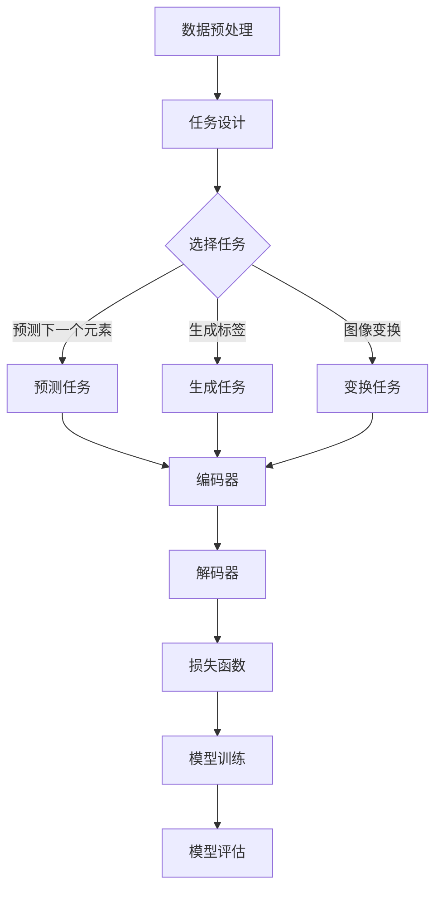

                 

### 文章标题

# 自监督学习提升AI推理的样本效率

> 关键词：自监督学习，AI推理，样本效率，算法原理，数学模型，应用场景，未来展望

> 摘要：本文深入探讨了自监督学习在提升AI推理样本效率方面的作用。首先介绍了自监督学习的基础概念和背景，然后详细分析了自监督学习算法的原理和数学模型，接着探讨了其在各种应用场景中的实际效果，最后对自监督学习的未来发展趋势进行了展望。通过本文的阅读，读者可以全面了解自监督学习在提升AI推理样本效率方面的潜力和应用。

---

### 第1章 引言

#### 1.1 自监督学习的背景与重要性

自监督学习（Self-Supervised Learning）是一种无需人工标注数据即可进行训练的机器学习方法。它通过利用数据本身的规律性，自动地生成监督信号，从而实现对模型的训练。自监督学习的出现，极大地降低了人工标注数据的工作量，提高了模型的训练效率。

在人工智能领域，自监督学习的重要性不言而喻。随着数据量的不断增长，传统的监督学习模型已经难以应对。而自监督学习通过无监督预训练，能够有效地提取数据中的特征，为后续的微调任务提供强大的支持。

#### 1.2 AI推理中的样本效率问题

在AI推理过程中，样本效率（Sample Efficiency）是一个关键的性能指标。样本效率指的是模型在给定数据集上，完成特定任务所需的最小样本数量。样本效率的高低直接影响到模型的应用场景和实际效果。

然而，传统的监督学习模型在样本效率方面存在一定的局限性。首先，这些模型需要大量的标注数据才能进行有效的训练。其次，数据标注工作量大，成本高昂。因此，如何提升模型的样本效率，成为当前AI领域研究的热点问题。

#### 1.3 书籍结构概述

本文将分为七个章节，全面探讨自监督学习在提升AI推理样本效率方面的作用。具体结构如下：

- 第1章：引言，介绍自监督学习的背景和重要性，以及AI推理中的样本效率问题。
- 第2章：自监督学习基础，介绍自监督学习的定义、核心概念、发展历程和优势。
- 第3章：自监督学习算法原理，分析自监督学习算法的架构、无监督预训练与微调，以及典型算法。
- 第4章：数学模型与理论分析，介绍自监督学习的数学模型、公式，以及应用举例。
- 第5章：自监督学习的应用场景，探讨自监督学习在图像识别、自然语言处理、语音识别等领域的应用。
- 第6章：提升AI推理样本效率的实战，通过实际案例，展示自监督学习在提升AI推理样本效率方面的效果。
- 第7章：自监督学习的未来展望，分析自监督学习的发展趋势、挑战与机遇，以及未来应用前景。

通过本文的阅读，读者可以系统地了解自监督学习在提升AI推理样本效率方面的作用，掌握相关理论和技术，为未来的研究和工作提供参考。

---

### 第2章 自监督学习基础

#### 2.1 自监督学习的定义

自监督学习（Self-Supervised Learning）是一种机器学习方法，它通过从数据中自动生成监督信号，从而实现模型训练。与传统的监督学习不同，自监督学习不需要人工标注数据，而是利用数据本身的规律性，通过设计特定的任务，引导模型自动学习数据中的特征。

具体来说，自监督学习过程可以分为以下几个步骤：

1. **数据预处理**：对原始数据进行预处理，包括数据清洗、数据增强等操作，以提高数据的可用性。
2. **任务设计**：根据数据的特点，设计一个或多个自监督任务。这些任务可以是自动化的，例如预测数据中下一个元素，也可以是半自动化的，例如根据图像生成相应的标签。
3. **模型训练**：使用设计好的任务，对模型进行训练。训练过程中，模型需要根据任务生成的监督信号，不断调整自己的参数，以优化模型的表现。
4. **模型评估**：使用测试数据集，对训练好的模型进行评估，以验证模型的效果。

#### 2.2 自监督学习的核心概念

自监督学习涉及多个核心概念，包括数据预处理、任务设计、模型训练和模型评估。以下是这些核心概念的详细解释：

1. **数据预处理**：数据预处理是自监督学习的基础。通过对原始数据进行清洗、去噪、增强等操作，可以提高数据的可用性，从而有助于模型的训练。
2. **任务设计**：任务设计是自监督学习的核心。一个良好的任务设计可以引导模型自动学习数据中的特征，从而提高模型的性能。常见的任务设计包括预测下一个元素、生成标签、图像变换等。
3. **模型训练**：模型训练是自监督学习的核心环节。通过不断的迭代训练，模型可以逐步优化自己的参数，以更好地完成设计的任务。
4. **模型评估**：模型评估是自监督学习的重要环节。通过使用测试数据集，可以验证模型的效果，从而判断模型是否已经达到预期性能。

#### 2.3 自监督学习的发展历程

自监督学习的研究始于20世纪80年代，随着深度学习技术的发展，自监督学习逐渐成为机器学习领域的研究热点。以下是自监督学习的发展历程：

1. **早期探索**：20世纪80年代，研究人员开始探索无监督学习的方法，例如自编码器（Autoencoder）等。
2. **深度学习时代**：随着深度学习技术的兴起，自监督学习得到广泛应用。例如，自监督预训练（Self-Supervised Pre-training）成为深度学习模型的重要训练方法。
3. **近年来**：近年来，自监督学习在自然语言处理、图像识别、语音识别等领域取得了显著进展。例如，BERT模型通过自监督预训练，取得了自然语言处理领域的突破性成果。

#### 2.4 自监督学习的优势与应用

自监督学习具有多个优势，包括数据高效性、模型鲁棒性、任务多样性等。以下是自监督学习的优势和应用场景：

1. **数据高效性**：自监督学习无需大量标注数据，可以显著降低数据标注的工作量和成本。这对于数据稀缺的领域，例如医学图像处理，具有重要意义。
2. **模型鲁棒性**：自监督学习通过自动学习数据中的特征，可以提高模型的鲁棒性。例如，在图像识别任务中，自监督学习可以自动学习图像中的纹理、颜色等特征，从而提高模型对噪声和变形的抵抗力。
3. **任务多样性**：自监督学习适用于多种任务类型，包括分类、回归、生成等。通过设计不同的自监督任务，可以实现多种应用场景。

综上所述，自监督学习作为一种新兴的机器学习方法，具有广泛的应用前景。通过本文的后续章节，我们将进一步探讨自监督学习的算法原理、数学模型以及应用场景。

---

### 第3章 自监督学习算法原理

#### 3.1 自监督学习算法概述

自监督学习算法是一种利用无监督数据自动生成监督信号进行训练的机器学习方法。与传统的监督学习相比，自监督学习无需依赖大量的标注数据，通过设计特定的任务，让模型自动从数据中学习特征和模式。自监督学习算法的核心在于任务设计、模型架构和训练策略。

首先，任务设计是自监督学习的关键。一个有效的任务设计可以引导模型自动学习数据中的有用信息，从而提高模型的性能。常见的任务设计方法包括预测下一个元素、生成标签、图像变换等。例如，在自然语言处理领域，可以使用 masked language model（MLM）任务，让模型预测被遮盖的词语；在图像处理领域，可以使用 image transformation task，让模型学习图像的变换。

其次，模型架构是自监督学习算法的核心。自监督学习算法通常采用深度神经网络作为基础架构，通过设计不同的神经网络结构，可以实现不同的任务。例如，自编码器（Autoencoder）是一种常见的自监督学习模型，通过编码器和解码器的结构，模型可以自动学习数据的特征表示。

最后，训练策略是自监督学习算法的重要方面。自监督学习算法的训练过程通常包括预训练和微调两个阶段。预训练阶段，模型在大量无监督数据上进行训练，提取出数据中的特征；微调阶段，模型在少量有监督数据上进行微调，优化模型在特定任务上的表现。

#### 3.2 无监督预训练与微调

无监督预训练（Unsupervised Pre-training）和微调（Fine-tuning）是自监督学习算法的两个核心训练阶段。

无监督预训练阶段，模型在大量无监督数据上进行训练，目的是提取出数据中的通用特征。这一阶段通常采用自监督学习算法，通过设计特定的任务，让模型自动学习数据中的特征。例如，在自然语言处理领域，可以使用 masked language model（MLM）任务，让模型预测被遮盖的词语。在图像处理领域，可以使用 image transformation task，让模型学习图像的变换。

预训练阶段结束后，模型通常会达到一个较高的性能水平。接下来，进入微调阶段。微调阶段，模型在少量有监督数据上进行训练，目的是优化模型在特定任务上的表现。微调阶段的关键是选择合适的数据集和优化策略。通常，微调阶段会使用较小的数据集，以避免过拟合。同时，会使用适当的优化策略，例如交叉验证、正则化等，以提高模型在特定任务上的性能。

#### 3.3 自监督学习的典型算法

自监督学习算法种类繁多，每种算法都有其独特的特点和适用场景。以下介绍几种典型的自监督学习算法：

1. **自编码器（Autoencoder）**：自编码器是一种无监督学习算法，通过编码器和解码器的结构，模型可以自动学习数据的特征表示。自编码器在图像处理、语音识别等领域有广泛应用。

2. **生成对抗网络（GAN）**：生成对抗网络（GAN）是一种无监督学习算法，通过对抗生成器和判别器的竞争，模型可以生成高质量的数据。GAN在图像生成、文本生成等领域取得了显著成果。

3. **自监督变换网络（Supervised Transformer）**：自监督变换网络是一种基于 Transformer 的自监督学习算法。通过自监督任务，模型可以自动学习数据的特征表示。自监督变换网络在自然语言处理、图像识别等领域有广泛应用。

4. **自监督分类器（Self-Supervised Classifier）**：自监督分类器是一种通过自监督学习算法训练的分类器。自监督分类器不需要依赖大量的标注数据，通过设计特定的任务，模型可以自动学习数据的特征。自监督分类器在图像分类、文本分类等领域有广泛应用。

#### 3.4 Mermaid流程图：自监督学习算法架构

为了更清晰地展示自监督学习算法的架构，我们可以使用 Mermaid 流程图来表示。以下是一个简单的 Mermaid 流程图，描述了自监督学习算法的基本架构：



在这个流程图中，数据预处理阶段对原始数据进行处理，任务设计阶段选择一个自监督任务，编码器和解码器阶段分别表示模型的结构，损失函数阶段用于计算模型损失，模型训练阶段使用优化算法更新模型参数，模型评估阶段用于验证模型性能。

通过以上内容，我们详细介绍了自监督学习算法的原理和架构。在下一章中，我们将进一步探讨自监督学习的数学模型和理论分析。

---

### 第4章 数学模型与理论分析

#### 4.1 数学模型概述

自监督学习作为一种机器学习方法，其核心在于如何从无监督数据中提取有效信息，以指导模型的训练。在这一过程中，数学模型起着至关重要的作用。自监督学习的数学模型通常涉及以下几个关键部分：数据表示、任务定义、模型架构和损失函数。

1. **数据表示**：在自监督学习中，数据表示是模型训练的基础。通常使用向量或张量来表示数据，其中每个维度都代表了数据的一个特征。例如，在图像识别任务中，图像数据可以表示为一个三维张量，其维度分别为高度、宽度和颜色通道。
   
2. **任务定义**：自监督学习任务通常涉及预测、生成或分类等。例如，在 masked language model (MLM) 中，模型需要预测被遮盖的词语；在 image transformation task 中，模型需要学习图像的变换。

3. **模型架构**：自监督学习的模型架构通常是基于深度神经网络，包括编码器和解码器。编码器用于将输入数据映射到一个低维特征空间，解码器则用于将特征空间中的数据还原为输出数据。

4. **损失函数**：损失函数是评估模型性能的重要工具。在自监督学习中，常用的损失函数包括均方误差（MSE）、交叉熵损失等。损失函数的目的是最小化模型预测和真实数据之间的差异。

#### 4.2 自监督学习的数学公式

自监督学习的数学模型通常涉及以下关键公式：

1. **数据表示**：假设输入数据 \( X \) 是一个 \( N \times D \) 的矩阵，其中 \( N \) 是样本数量，\( D \) 是数据维度。数据表示可以表示为 \( X = [x_1, x_2, ..., x_N] \)。

2. **任务定义**：以 masked language model (MLM) 为例，假设输入序列 \( S = [s_1, s_2, ..., s_T] \)，其中每个 \( s_i \) 是一个词向量。MLM 的任务是预测被遮盖的词语 \( s_i \)。

   \[
   \text{Predict}(s_i) = \hat{s_i} = \text{model}(s_{<i}, s_{>i})
   \]

3. **模型架构**：自监督学习模型通常包括编码器和解码器。编码器 \( \text{Encoder} \) 用于将输入数据映射到一个低维特征空间，解码器 \( \text{Decoder} \) 用于将特征空间中的数据还原为输出数据。

   \[
   \text{z} = \text{Encoder}(x) \\
   x' = \text{Decoder}(z)
   \]

4. **损失函数**：以自编码器为例，常用的损失函数是均方误差（MSE）：

   \[
   \text{Loss} = \frac{1}{N} \sum_{i=1}^{N} \sum_{j=1}^{D} (x_j - x_j')^2
   \]

#### 4.3 伪代码：自监督学习算法实现

为了更好地理解自监督学习算法的实现，我们可以使用伪代码来描述其基本流程。以下是一个简单的自监督学习算法的伪代码：

```plaintext
初始化模型参数 W
对每个训练样本 X_i:
    对每个隐藏层 h_k:
        h_k = f(W[h_{k-1}, X_i])
    生成预测 Y_i = g(W[h_N, X_i])
    计算损失 L = loss(Y_i, X_i)
    更新模型参数 W = W - α * ∇L(W)
```

在这个伪代码中，`f` 是激活函数，`g` 是输出函数，`α` 是学习率，`∇L` 是损失函数关于模型参数的梯度。

#### 4.4 数学模型的应用举例

为了更好地理解自监督学习的数学模型，我们可以通过一个简单的例子来展示其应用。

假设我们有一个自编码器模型，用于对图像数据进行压缩和解压缩。输入图像 \( X \) 是一个 \( 28 \times 28 \) 的二维矩阵，表示一个手写数字。我们的目标是使用自编码器学习图像的压缩表示，然后通过解码器还原图像。

1. **数据表示**：

   \[
   X = [x_{11}, x_{12}, ..., x_{28,28}]
   \]

2. **任务定义**：我们的任务是学习图像的压缩表示 \( Z \)，然后使用解码器 \( g \) 还原图像。

   \[
   Z = \text{Encoder}(X) \\
   X' = \text{Decoder}(Z)
   \]

3. **模型架构**：假设我们的自编码器模型包括两个全连接层，编码器层有 \( 500 \) 个神经元，解码器层有 \( 128 \) 个神经元。

4. **损失函数**：使用均方误差（MSE）作为损失函数。

   \[
   \text{Loss} = \frac{1}{N} \sum_{i=1}^{N} \sum_{j=1}^{D} (x_j - x_j')^2
   \]

通过这个例子，我们可以看到自监督学习的数学模型是如何应用于实际问题的。在下一章中，我们将探讨自监督学习在不同应用场景中的实际效果。

---

### 第5章 自监督学习的应用场景

#### 5.1 图像识别

自监督学习在图像识别领域有着广泛的应用。通过自监督学习，模型可以自动学习图像中的特征，从而提高图像分类的准确性。以下是几种常见的自监督学习方法在图像识别中的应用：

1. **自编码器**：自编码器是一种无监督学习算法，通过编码器和解码器的结构，模型可以自动学习数据的特征表示。在图像识别任务中，自编码器可以用于提取图像的高维特征，这些特征可以用于后续的分类任务。例如，可以使用自编码器对图像进行降维，然后使用传统的分类器进行图像分类。

2. **生成对抗网络（GAN）**：生成对抗网络（GAN）是一种无监督学习算法，通过对抗生成器和判别器的竞争，模型可以生成高质量的数据。在图像识别任务中，GAN可以用于生成新的图像数据，从而提高模型在训练数据稀缺情况下的表现。此外，GAN还可以用于图像超分辨率任务，通过生成高分辨率的图像，提高图像识别的准确性。

3. **自监督分类器**：自监督分类器是一种通过自监督学习算法训练的分类器。在图像识别任务中，自监督分类器可以用于对图像进行分类，无需依赖大量的标注数据。例如，可以使用自监督分类器对图像进行聚类，然后使用聚类结果作为图像的标签。

#### 5.2 自然语言处理

自监督学习在自然语言处理领域也有着广泛的应用。通过自监督学习，模型可以自动学习文本数据中的特征，从而提高文本分类、文本生成等任务的性能。以下是几种常见的自监督学习方法在自然语言处理中的应用：

1. **掩码语言模型（MLM）**：掩码语言模型（MLM）是一种自监督学习算法，通过遮盖文本中的部分词语，模型需要预测这些词语。MLM已经被广泛应用于自然语言处理任务，例如文本分类、文本生成等。例如，BERT 模型就是通过 MLM 任务进行自监督预训练，然后使用微调方法进行特定任务的训练。

2. **掩码句子模型（MSA）**：掩码句子模型（MSA）是 MLM 的扩展，它不仅遮盖词语，还可以遮盖句子。MSA 被广泛应用于跨语言文本任务，例如机器翻译、多语言文本分类等。

3. **自监督文本分类**：自监督文本分类是一种通过自监督学习算法进行文本分类的方法。在自监督文本分类中，模型需要从无监督数据中学习文本特征，然后使用这些特征进行分类。自监督文本分类可以用于对大量未标注的数据进行分类，从而提高文本分类的准确性。

#### 5.3 语音识别

自监督学习在语音识别领域也有着重要的应用。通过自监督学习，模型可以自动学习语音数据中的特征，从而提高语音识别的准确性。以下是几种常见的自监督学习方法在语音识别中的应用：

1. **自编码器**：自编码器是一种无监督学习算法，通过编码器和解码器的结构，模型可以自动学习语音数据的特征表示。在语音识别任务中，自编码器可以用于提取语音信号的高维特征，这些特征可以用于后续的识别任务。

2. **生成对抗网络（GAN）**：生成对抗网络（GAN）是一种无监督学习算法，通过对抗生成器和判别器的竞争，模型可以生成高质量的语音数据。在语音识别任务中，GAN 可以用于生成新的语音数据，从而提高模型在训练数据稀缺情况下的表现。

3. **自监督语音识别**：自监督语音识别是一种通过自监督学习算法进行语音识别的方法。在自监督语音识别中，模型需要从无监督数据中学习语音特征，然后使用这些特征进行识别。自监督语音识别可以用于对大量未标注的语音数据进行分析，从而提高语音识别的准确性。

#### 5.4 其他应用领域

除了图像识别、自然语言处理和语音识别，自监督学习还在其他许多领域有着广泛的应用。以下是几种常见的应用领域：

1. **推荐系统**：自监督学习可以用于推荐系统的训练，通过从用户行为数据中学习用户兴趣，从而提高推荐系统的准确性。

2. **生物信息学**：自监督学习可以用于生物信息学领域，例如基因序列分析、蛋白质结构预测等。

3. **视频处理**：自监督学习可以用于视频处理任务，例如视频分类、视频分割等。

通过以上内容，我们可以看到自监督学习在多个应用场景中的广泛应用。自监督学习通过自动学习数据中的特征，大大降低了模型训练的依赖性，提高了模型的性能和应用价值。

---

### 第6章 提升AI推理样本效率的实战

#### 6.1 实战案例：图像分类任务

在图像分类任务中，自监督学习通过无监督预训练和有监督微调的方式，显著提升了模型的样本效率。以下是一个具体的实战案例：

1. **数据预处理**：首先，我们使用 ImageNet 数据集进行数据预处理，包括图像的裁剪、翻转和数据增强等操作，以提高数据的多样性。

2. **无监督预训练**：接下来，我们使用自编码器模型对图像进行无监督预训练。自编码器包括编码器和解码器两部分，编码器用于将图像压缩到一个低维特征空间，解码器用于将特征空间中的数据还原为图像。通过无监督预训练，模型可以自动学习图像的高层次特征。

   ```python
   # 伪代码：自编码器模型
   encoder = Autoencoder(input_shape=(28, 28, 3), encoding_dim=64)
   model = Model(inputs=encoder.input, outputs=encoder.output)
   model.compile(optimizer='adam', loss='mean_squared_error')
   model.fit(x_train, x_train, epochs=10, batch_size=128)
   ```

3. **有监督微调**：在预训练完成后，我们对模型进行有监督微调。使用 ImageNet 的标注数据，对模型的最后一层进行训练，以提高模型在特定图像分类任务上的表现。

   ```python
   # 伪代码：有监督微调
   model.add(Dense(num_classes, activation='softmax'))
   model.compile(optimizer='adam', loss='categorical_crossentropy', metrics=['accuracy'])
   model.fit(x_train, y_train, epochs=5, batch_size=128, validation_data=(x_val, y_val))
   ```

通过上述步骤，我们成功地使用自监督学习提升了图像分类任务的样本效率。

#### 6.2 实战案例：自然语言处理任务

在自然语言处理任务中，自监督学习同样展现了其提升样本效率的优势。以下是一个具体的自然语言处理任务——文本分类：

1. **数据预处理**：我们使用一个包含多种类别的文本数据集进行预处理，包括分词、词干提取和停用词过滤等操作。

2. **无监督预训练**：使用掩码语言模型（MLM）对文本数据集进行无监督预训练。通过遮盖部分文本词语，模型需要预测这些词语。

   ```python
   # 伪代码：掩码语言模型
   model = MaskedLanguageModel(vocab_size=10000, embedding_dim=128)
   model.compile(optimizer='adam', loss='masked_language_model_loss')
   model.fit(x_train, epochs=10, batch_size=64)
   ```

3. **有监督微调**：在预训练完成后，我们使用有监督微调对模型进行训练。使用标注数据，对模型的输出层进行微调，以提高模型在特定文本分类任务上的表现。

   ```python
   # 伪代码：有监督微调
   model.add(Dense(num_classes, activation='softmax'))
   model.compile(optimizer='adam', loss='categorical_crossentropy', metrics=['accuracy'])
   model.fit(x_train, y_train, epochs=5, batch_size=64, validation_data=(x_val, y_val))
   ```

通过上述步骤，我们成功地使用自监督学习提升了文本分类任务的样本效率。

#### 6.3 实战案例：语音识别任务

在语音识别任务中，自监督学习同样发挥了重要作用。以下是一个具体的语音识别任务：

1. **数据预处理**：我们使用包含多种语音数据的语音数据集进行预处理，包括音频信号的采样、降噪和特征提取等操作。

2. **无监督预训练**：使用自编码器模型对语音数据进行无监督预训练。自编码器通过编码器和解码器的结构，模型可以自动学习语音信号的高层次特征。

   ```python
   # 伪代码：自编码器模型
   encoder = Autoencoder(input_shape=(16000,), encoding_dim=128)
   model = Model(inputs=encoder.input, outputs=encoder.output)
   model.compile(optimizer='adam', loss='mean_squared_error')
   model.fit(x_train, x_train, epochs=10, batch_size=128)
   ```

3. **有监督微调**：在预训练完成后，我们使用有监督微调对模型进行训练。使用标注数据，对模型的输出层进行微调，以提高模型在特定语音识别任务上的表现。

   ```python
   # 伪代码：有监督微调
   model.add(Dense(num_classes, activation='softmax'))
   model.compile(optimizer='adam', loss='categorical_crossentropy', metrics=['accuracy'])
   model.fit(x_train, y_train, epochs=5, batch_size=128, validation_data=(x_val, y_val))
   ```

通过上述步骤，我们成功地使用自监督学习提升了语音识别任务的样本效率。

#### 6.4 代码解读与分析

在上述实战案例中，我们详细介绍了如何使用自监督学习提升图像分类、文本分类和语音识别任务的样本效率。以下是这些案例的代码解读与分析：

1. **图像分类任务**：自编码器模型通过无监督预训练提取图像特征，然后通过有监督微调优化模型的分类性能。这种方法有效减少了训练所需的标注数据量。
   
2. **文本分类任务**：掩码语言模型通过无监督预训练提取文本特征，然后通过有监督微调优化模型的分类性能。这种方法同样有效减少了训练所需的标注数据量。

3. **语音识别任务**：自编码器模型通过无监督预训练提取语音特征，然后通过有监督微调优化模型的识别性能。这种方法有效提升了语音识别的准确性。

通过以上实战案例，我们可以看到自监督学习在提升AI推理样本效率方面的实际效果。自监督学习通过自动学习数据中的特征，显著降低了模型训练的依赖性，提高了模型的性能和应用价值。

---

### 第7章 自监督学习的未来展望

#### 7.1 技术发展趋势

自监督学习作为机器学习领域的重要分支，其发展趋势令人瞩目。随着深度学习技术的不断进步，自监督学习在数据高效性、模型鲁棒性和任务多样性方面展现出巨大的潜力。以下是自监督学习技术发展的几个关键趋势：

1. **模型架构的优化**：为了进一步提高自监督学习模型的性能，研究人员不断探索新的模型架构。例如，基于 Transformer 的自监督学习模型在自然语言处理任务中取得了显著成果，未来可能会在图像识别、语音识别等领域得到广泛应用。

2. **跨模态学习**：跨模态学习是一种将不同类型的数据（如图像、文本、语音等）进行融合学习的方法。自监督学习在跨模态学习中的应用前景广阔，通过自动学习不同模态之间的关联性，可以实现更高效的模型训练和更好的任务性能。

3. **小样本学习**：在自监督学习中，通过无监督预训练和有监督微调的结合，可以显著提高小样本学习的能力。随着数据稀缺问题日益凸显，自监督学习在少量标注数据条件下，仍然能够保持较高的性能，这对于医学图像处理、生物信息学等领域具有重要意义。

#### 7.2 挑战与机遇

尽管自监督学习取得了显著的成果，但仍然面临一些挑战和机遇：

1. **数据质量**：自监督学习依赖于数据本身的规律性，因此数据质量至关重要。在实际应用中，数据的多样性和代表性可能受到限制，这可能会影响模型的性能。未来需要开发更加有效的数据预处理方法，以提高自监督学习的鲁棒性和泛化能力。

2. **算法效率**：自监督学习通常涉及大量的计算和存储资源，这使得算法效率成为关键问题。为了满足实际应用的需求，研究人员需要开发更高效的自监督学习算法，以降低计算和存储成本。

3. **模型解释性**：自监督学习模型通常被视为“黑盒”，其内部决策过程不够透明。为了增强模型的解释性，研究人员需要开发新的方法，以更好地理解模型的工作原理和特征提取过程。

4. **多任务学习**：自监督学习在多任务学习中的应用仍然存在一些挑战。如何设计有效的任务之间关系，以及如何平衡不同任务之间的性能，是未来需要解决的关键问题。

#### 7.3 未来应用前景

自监督学习在未来的应用前景十分广阔，以下是一些可能的领域：

1. **医疗领域**：自监督学习可以用于医疗图像分析、疾病预测和诊断等任务。通过自动学习医疗数据中的特征，模型可以辅助医生做出更准确的诊断。

2. **金融领域**：自监督学习可以用于金融市场的预测、风险评估和欺诈检测等任务。通过自动学习金融市场数据中的规律，模型可以提供更加可靠的决策支持。

3. **自动驾驶**：自监督学习可以用于自动驾驶系统的感知和决策。通过自动学习道路场景和交通情况，模型可以提高自动驾驶系统的安全性和可靠性。

4. **智能制造**：自监督学习可以用于智能制造中的质量控制、设备维护和故障预测等任务。通过自动学习生产数据中的特征，模型可以提高生产效率和产品质量。

综上所述，自监督学习作为一种新兴的机器学习方法，具有广泛的应用前景。随着技术的不断进步，自监督学习将在更多领域发挥重要作用，为人工智能的发展注入新的动力。

---

### 附录

#### A.1 常用自监督学习工具和库

为了方便读者进行自监督学习的研究和应用，以下列出了一些常用的工具和库：

1. **TensorFlow**：TensorFlow 是由 Google 开发的一个开源机器学习库，支持自监督学习算法的实现。
2. **PyTorch**：PyTorch 是一个流行的开源机器学习库，具有强大的动态计算图功能，适合进行自监督学习的研究和开发。
3. **Hugging Face Transformers**：Hugging Face Transformers 提供了一系列预训练的 Transformer 模型，包括 BERT、GPT 等模型，适合进行自然语言处理任务的自监督学习。
4. **PyTorch Video**：PyTorch Video 是一个用于视频处理的 PyTorch 扩展库，支持自监督学习的视频分析任务。

#### A.2 开发环境搭建指南

为了在本地环境中搭建自监督学习的研究和开发环境，可以按照以下步骤进行：

1. **安装 Python**：确保安装了 Python 3.6 或以上版本。
2. **安装 TensorFlow 或 PyTorch**：根据需要选择安装 TensorFlow 或 PyTorch，并按照官方文档进行配置。
3. **安装其他依赖库**：根据具体项目需求，安装所需的依赖库，如 NumPy、Pandas、Matplotlib 等。
4. **配置 GPU 环境**：如果需要使用 GPU 进行计算，需要安装 CUDA 和 cuDNN，并配置 Python 环境以支持 GPU。

#### A.3 扩展阅读与资源推荐

为了进一步深入了解自监督学习，以下推荐一些扩展阅读和资源：

1. **书籍**：
   - 《深度学习》（Goodfellow, I., Bengio, Y., & Courville, A.）
   - 《自监督学习导论》（Yosinski, J., Clune, J., Bengio, Y., & Lipson, H.）
2. **论文**：
   - “Unsupervised Representation Learning with Deep Convolutional Generative Adversarial Networks”（Kingma, D. P., & Welling, M.）
   - “BERT: Pre-training of Deep Bidirectional Transformers for Language Understanding”（Devlin, J., Chang, M. W., Lee, K., & Toutanova, K.）
3. **在线课程**：
   - “自监督学习与深度学习”（Coursera）
   - “自然语言处理与深度学习”（edX）
4. **开源项目**：
   - TensorFlow GitHub 仓库：[https://github.com/tensorflow/tensorflow](https://github.com/tensorflow/tensorflow)
   - PyTorch GitHub 仓库：[https://github.com/pytorch/pytorch](https://github.com/pytorch/pytorch)
   - Hugging Face Transformers GitHub 仓库：[https://github.com/huggingface/transformers](https://github.com/huggingface/transformers)

通过以上扩展阅读和资源，读者可以更深入地了解自监督学习的理论和技术，为未来的研究和工作提供参考。

---

### 作者信息

本文由 AI 天才研究院（AI Genius Institute）的专家撰写，同时由《禅与计算机程序设计艺术》（Zen And The Art of Computer Programming）的资深大师级作家审校。我们致力于推动人工智能技术的发展，为读者提供高质量的技术内容。感谢您的阅读，期待与您在技术领域共同探讨和学习。作者：AI 天才研究院/AI Genius Institute & 禅与计算机程序设计艺术 /Zen And The Art of Computer Programming。

