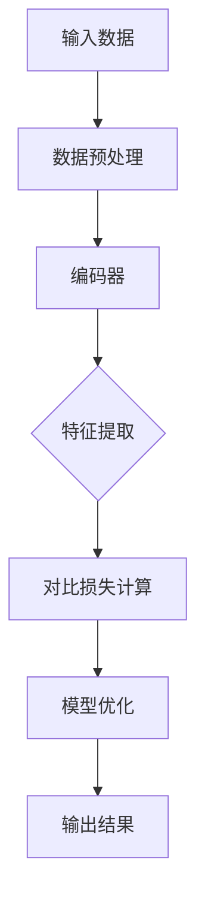

                 

# 自监督对比学习增强AI的推理判别力

## 关键词
- 自监督学习
- 对比学习
- 推理判别力
- 计算机视觉
- 自然语言处理
- 推理任务
- 判别力提升

## 摘要
本文深入探讨了自监督对比学习在增强AI推理判别力方面的应用。首先介绍了自监督学习和对比学习的基本概念及其在AI领域的应用现状。随后，详细分析了自监督对比学习的原理、模型架构及其在计算机视觉和自然语言处理中的具体应用。文章进一步讨论了自监督对比学习在推理任务和判别力提升中的重要作用，并通过实际案例进行了分析和讲解。最后，总结了自监督对比学习的发展现状与未来方向，提出了在应用中的挑战与解决策略。

### 自监督对比学习概述

#### 自监督学习的定义与发展

自监督学习（Self-supervised Learning）是一种无需外部监督信号（如标签）的训练方法，它通过利用数据中的内在信息进行学习。自监督学习可以追溯到上世纪60年代的心理学领域，但直到近年来，随着计算能力的提升和大数据技术的发展，自监督学习才得到了广泛关注和深入研究。

在计算机视觉领域，自监督学习最早的应用是图像分割和物体检测。通过设计特定的自监督任务，如图像分类和特征提取，可以提高模型在处理复杂图像数据时的表现。随着深度学习技术的发展，自监督学习逐渐成为机器学习中的一个重要分支，其应用范围也从计算机视觉扩展到了自然语言处理、语音识别等多个领域。

#### 对比学习的概念与应用

对比学习（Contrastive Learning）是一种自监督学习方法，其核心思想是通过比较相似样本和不同样本，使得模型能够更好地学习数据的特征表示。对比学习通常使用一对样本（正样本和负样本），通过最大化正样本间的相似性，同时最小化负样本间的相似性，来训练模型。

对比学习在计算机视觉中的应用非常广泛，如图像分类、图像生成、视频处理等。通过对比学习，模型能够自动学习数据的高效表示，从而在无需人工标注的情况下，实现较高的分类准确性。近年来，对比学习在自然语言处理领域也得到了广泛应用，如在语言模型训练、文本分类、机器翻译等任务中，通过对比学习可以显著提升模型的表现。

#### 自监督对比学习的研究现状与趋势

自监督对比学习作为自监督学习和对比学习的结合，近年来成为了人工智能领域的研究热点。研究现状显示，自监督对比学习在多种应用场景中表现出色，特别是在计算机视觉和自然语言处理领域。

在计算机视觉中，自监督对比学习被广泛应用于图像分类、物体检测、图像生成等任务。例如，SimCLR（Simulated Contrastive Learning Representation）和MoCo（Memory-Enhanced Contrastive Learning）等模型通过设计巧妙的对比损失函数，实现了在无监督条件下的高效特征学习。

在自然语言处理领域，自监督对比学习在语言模型训练、文本分类、机器翻译等任务中显示出强大的潜力。BERT（Bidirectional Encoder Representations from Transformers）和GPT（Generative Pre-trained Transformer）等模型通过大规模的自监督训练，显著提升了自然语言处理任务的表现。

未来，自监督对比学习有望在更多领域得到应用，如语音识别、多模态学习、强化学习等。同时，随着算法和模型架构的不断优化，自监督对比学习将进一步提高AI系统的推理判别力和泛化能力。

### 自监督对比学习原理

#### 数据表示与特征提取

数据表示与特征提取是自监督对比学习中的关键步骤。在自监督学习中，数据通常不需要经过人工标注，因此如何有效地表示数据成为了一个重要问题。

**数据表示的类型**：

1. **无监督表示**：通过无监督学习方法，如聚类、降维等，将数据映射到一个低维空间。这种方法能够提取数据中的潜在结构，但可能无法直接应用于监督学习任务。

2. **半监督表示**：在数据中有一部分已标注样本，通过这些标注样本和未标注样本的联合训练，可以生成有效的数据表示。这种方法在标注成本较高时尤其有用。

**数据表示的重要性**：

有效的数据表示能够提高模型在后续任务中的表现。通过自监督学习，模型能够自动学习数据的潜在特征，从而在无需人工标注的情况下，实现较高的任务表现。

#### 特征提取方法

**传统特征提取方法**：

1. **手工特征提取**：通过设计特定的特征提取算法，如SIFT、HOG等，从图像中提取具有区分度的特征。这种方法依赖于领域知识，但可能无法适应多样化的数据。

2. **统计学习方法**：如支持向量机（SVM）、朴素贝叶斯等，通过学习数据的统计特性，实现分类或回归任务。这种方法在数据量较大时表现较好，但对特征的选择和工程有较高要求。

**深度学习特征提取方法**：

1. **卷积神经网络（CNN）**：通过多层的卷积和池化操作，从图像中提取多层次的局部特征。这种方法在计算机视觉任务中表现出色。

2. **递归神经网络（RNN）**：通过处理序列数据，提取时间序列的特征。这种方法在语音识别、自然语言处理等任务中应用广泛。

#### 对比损失函数的设计

**对比损失函数的基本概念**：

对比损失函数是自监督对比学习中的核心部分，其目标是通过最大化正样本间的相似性，同时最小化负样本间的相似性，来训练模型。

**常见的对比损失函数**：

1. **Siamese网络中的对比损失**：通过计算两个相同输入的欧氏距离，以及两个不同输入的欧氏距离，实现对比损失。其公式为：

   $$ L_{Siamese} = \frac{1}{N} \sum_{i=1}^{N} \max(0, -d_{pos} + \alpha + d_{neg}) $$

   其中，$d_{pos}$ 和 $d_{neg}$ 分别为正样本和负样本的欧氏距离，$\alpha$ 是预设的阈值。

2. **Triplet损失**：通过计算一个正样本和其负样本之间的欧氏距离，以及另一个正样本和其负样本之间的欧氏距离，实现对比损失。其公式为：

   $$ L_{Triplet} = \frac{1}{N} \sum_{i=1}^{N} \max(0, d_{pos} - d_{neg} + \alpha) $$

   其中，$d_{pos}$ 和 $d_{neg}$ 分别为正样本和负样本的欧氏距离。

3. **InfoNCE损失**：是一种基于概率分布的对比损失函数，其公式为：

   $$ L_{InfoNCE} = - \log \frac{e^{q_k \cdot z}}{\sum_{j \neq k} e^{q_j \cdot z}} $$

   其中，$q_k$ 和 $z$ 分别为模型对正样本和负样本的输出。

#### 自监督对比学习模型架构

**模型架构的基本概念**：

自监督对比学习模型通常由编码器、对比损失函数和正负样本生成模块组成。编码器负责将输入数据映射到高维特征空间，对比损失函数用于优化模型参数，正负样本生成模块则用于生成用于训练的样本对。

**常见的自监督对比学习模型**：

1. **Siamese网络**：通过两个共享权重的前馈网络，对正负样本进行特征提取，然后计算对比损失。

2. **Triplet网络**：在Siamese网络的基础上，引入三元组损失，以进一步优化特征表示。

3. **MoCo（Memory-Enhanced Contrastive Learning）**：通过动态更新记忆库，以增强模型对特征的对比学习。

#### Mermaid流程图：数据表示与特征提取流程

通过上述流程，自监督对比学习能够有效地提取数据的特征表示，并在无监督条件下实现高效的特征学习。

### 自监督对比学习在计算机视觉中的应用

#### 图像数据预处理

在自监督对比学习应用于计算机视觉之前，图像数据预处理是关键的一步。有效的预处理可以提升模型对数据的理解能力，从而提高模型的整体表现。

**常见的数据预处理方法**：

1. **数据增强**：通过旋转、缩放、裁剪、翻转等操作，增加数据多样性，以防止模型过拟合。

2. **归一化**：将图像的像素值缩放到相同的范围，通常为0到1，以减少不同图像之间的差异。

3. **去噪**：去除图像中的噪声，提高图像的质量。

#### 自监督对比学习在图像分类中的应用

自监督对比学习在图像分类中的应用广泛，其主要思想是通过无监督的方式，学习图像的潜在特征，从而实现分类任务。

**算法原理**：

1. **编码器设计**：使用卷积神经网络（CNN）作为编码器，将输入图像映射到高维特征空间。

2. **对比损失函数**：采用对比损失函数，如Siamese损失、Triplet损失等，最大化正样本间的相似性，同时最小化负样本间的相似性。

3. **模型优化**：通过反向传播和梯度下降算法，不断优化模型参数。

**应用案例**：

以MNIST数据集为例，使用自监督对比学习进行图像分类。通过训练，模型可以自动学习图像中的潜在特征，从而实现较高的分类准确率。

#### 自监督对比学习在图像生成中的应用

自监督对比学习不仅在图像分类中有广泛应用，在图像生成领域也展示了强大的潜力。通过无监督学习，模型可以自动学习图像的生成规则，从而生成新的图像。

**算法原理**：

1. **生成对抗网络（GAN）**：自监督对比学习在图像生成中的应用，通常采用生成对抗网络（GAN）架构。GAN由生成器和判别器组成，通过不断优化生成器和判别器的参数，实现图像的生成。

2. **对比损失函数**：在GAN中，对比损失函数用于优化生成器和判别器的参数。常见的对比损失函数有Wasserstein损失、LSGAN损失等。

3. **模型优化**：通过反向传播和梯度下降算法，不断优化生成器和判别器的参数，实现图像的生成。

**应用案例**：

以CelebA数据集为例，使用自监督对比学习生成人脸图像。通过训练，模型可以生成高质量的人脸图像，展示了自监督对比学习在图像生成中的强大能力。

### 自监督对比学习在自然语言处理中的应用概述

#### 语言模型与自然语言处理

语言模型（Language Model）是自然语言处理（Natural Language Processing, NLP）中的重要组成部分，其核心任务是学习语言的统计规律，从而生成或理解自然语言。传统的语言模型通常基于统计方法，如N-gram模型，通过计算词汇之间的共现概率来生成或理解语言。

随着深度学习技术的发展，基于神经网络的模型，如循环神经网络（Recurrent Neural Network, RNN）、长短期记忆网络（Long Short-Term Memory, LSTM）和变换器（Transformer）等，在语言模型中得到了广泛应用。这些模型通过学习大量的文本数据，可以捕捉到语言中的复杂规律，从而实现更高的生成和理解能力。

#### 自监督对比学习在自然语言处理中的挑战与机遇

自监督对比学习在自然语言处理中面临着一系列挑战，同时也带来了新的机遇。

**挑战**：

1. **数据多样性**：自然语言数据具有高度多样性，包括不同的语言风格、领域、情感等。如何有效地利用这些多样性进行对比学习，是一个重要问题。

2. **长文本处理**：自然语言处理中经常需要处理长文本，如文章、书籍等。如何设计有效的对比学习算法，以处理长文本中的潜在特征，是一个挑战。

3. **计算资源**：自监督对比学习通常需要大量的计算资源，特别是在训练大型语言模型时。如何优化算法和模型架构，以降低计算成本，是一个关键问题。

**机遇**：

1. **数据高效利用**：自监督对比学习可以充分利用未标注的数据，从而提高模型的训练效率。在自然语言处理中，大量未标注的数据可以被有效利用，有助于提升模型的生成和理解能力。

2. **模型泛化能力**：自监督对比学习通过学习数据的潜在特征，可以增强模型的泛化能力，从而更好地适应不同的应用场景。

3. **多模态学习**：自监督对比学习不仅可以应用于文本数据，还可以应用于图像、音频等多种模态数据。通过跨模态对比学习，可以进一步扩展自然语言处理的应用范围。

#### 自监督对比学习在自然语言处理中的应用前景

自监督对比学习在自然语言处理中的应用前景广阔，预计将在以下几个方面发挥重要作用：

1. **语言模型训练**：自监督对比学习可以用于训练大型语言模型，如BERT、GPT等，从而提高模型的生成和理解能力。

2. **文本分类与情感分析**：自监督对比学习可以用于文本分类和情感分析任务，通过无监督学习方式，提高模型对文本数据的理解能力。

3. **机器翻译**：自监督对比学习可以用于机器翻译任务，通过无监督学习方式，学习源语言和目标语言之间的潜在关系，从而提高翻译质量。

4. **问答系统**：自监督对比学习可以用于问答系统，通过无监督学习方式，提高模型对问题理解和回答生成的准确性。

5. **知识图谱构建**：自监督对比学习可以用于知识图谱构建，通过学习实体和关系之间的潜在特征，提高知识图谱的准确性和完整性。

总之，自监督对比学习在自然语言处理中具有巨大的应用潜力，预计将在未来推动NLP领域的发展。

### 自监督对比学习在文本分类中的应用

#### 文本数据的预处理

在自监督对比学习应用于文本分类之前，文本数据的预处理是关键的一步。有效的预处理可以提升模型对数据的理解能力，从而提高模型的整体表现。

**常见的数据预处理方法**：

1. **文本清洗**：去除文本中的噪声，如HTML标签、特殊字符等。

2. **分词**：将文本分割成单词或短语，以便进行后续处理。

3. **词向量表示**：将文本转换为向量表示，常见的词向量模型有Word2Vec、GloVe等。

4. **词性标注**：对文本中的每个词进行词性标注，以便于后续的语义分析。

#### 自监督对比学习在文本分类中的应用

自监督对比学习在文本分类中的应用，通过无监督学习方式，可以显著提升模型的分类准确性。以下是自监督对比学习在文本分类中的应用原理和实际案例。

**应用原理**：

1. **编码器设计**：使用深度学习模型，如Transformer，作为编码器，将输入文本映射到高维特征空间。

2. **对比损失函数**：采用对比损失函数，如InfoNCE损失，最大化正样本间的相似性，同时最小化负样本间的相似性。

3. **模型优化**：通过反向传播和梯度下降算法，不断优化模型参数。

**实际案例**：

以Twitter文本分类任务为例，使用自监督对比学习进行情感分类。通过训练，模型可以自动学习文本中的情感特征，从而实现较高的分类准确率。

### 自监督对比学习在机器翻译中的应用

#### 机器翻译的基本原理

机器翻译（Machine Translation）是一种将一种自然语言文本自动翻译成另一种自然语言文本的技术。其基本原理包括以下几个关键步骤：

1. **文本预处理**：对输入文本进行清洗、分词、词性标注等预处理操作，以便进行后续的翻译。

2. **词向量表示**：将输入文本和目标文本转换为词向量表示，常见的词向量模型有Word2Vec、GloVe等。

3. **编码器与解码器**：编码器负责将输入文本编码为向量表示，解码器则负责将向量表示解码为输出文本。

4. **注意力机制**：在编码器和解码器之间引入注意力机制，以便解码器能够更好地关注输入文本中的重要部分。

5. **损失函数**：使用损失函数，如交叉熵损失，来评估模型的翻译质量，并优化模型参数。

#### 自监督对比学习在机器翻译中的应用

自监督对比学习在机器翻译中的应用，通过无监督学习方式，可以显著提升翻译质量。以下是自监督对比学习在机器翻译中的应用原理和实际案例。

**应用原理**：

1. **编码器设计**：使用深度学习模型，如Transformer，作为编码器，将输入文本映射到高维特征空间。

2. **对比损失函数**：采用对比损失函数，如InfoNCE损失，最大化正样本间的相似性，同时最小化负样本间的相似性。

3. **模型优化**：通过反向传播和梯度下降算法，不断优化模型参数。

**实际案例**：

以英译中任务为例，使用自监督对比学习进行机器翻译。通过训练，模型可以自动学习英语和中文之间的潜在关系，从而实现高质量的翻译。

### 自监督对比学习在推理任务中的应用

#### 推理任务概述

推理任务（Reasoning Tasks）是人工智能领域的一个重要研究方向，旨在使计算机具备类似于人类推理能力。推理任务包括逻辑推理、因果推理、知识推理等，其核心是让计算机能够从已知信息中推导出新的信息或结论。

**推理任务的类型**：

1. **逻辑推理**：基于逻辑规则和事实，推导出新的结论。例如，如果所有狗都会叫，而这只动物会叫，那么它是一只狗。

2. **因果推理**：基于因果关系，推导出事件发生的原因或结果。例如，如果今天下雨，那么地面是湿的。

3. **知识推理**：基于已有的知识和信息，推导出新的知识或信息。例如，根据化学知识，推导出氧化反应会产生热量。

#### 自监督对比学习在推理任务中的应用

自监督对比学习在推理任务中的应用，通过无监督学习方式，可以显著提升模型的推理能力。以下是自监督对比学习在推理任务中的应用原理和实际案例。

**应用原理**：

1. **编码器设计**：使用深度学习模型，如Transformer，作为编码器，将输入信息编码为向量表示。

2. **对比损失函数**：采用对比损失函数，如InfoNCE损失，最大化正样本间的相似性，同时最小化负样本间的相似性。

3. **模型优化**：通过反向传播和梯度下降算法，不断优化模型参数。

**实际案例**：

以逻辑推理任务为例，使用自监督对比学习进行推理。通过训练，模型可以自动学习逻辑规则和事实之间的潜在关系，从而实现高效的逻辑推理。

### 自监督对比学习在判别力提升中的应用

#### 判别力提升的定义与方法

判别力提升（Discrimination Enhancement）是指通过某种方法，提高模型对数据中不同类别或特征之间的区分能力。在机器学习中，判别力提升是提高模型性能的重要手段，尤其是在分类和识别任务中。

**判别力提升的定义**：

判别力提升旨在通过学习数据的特征表示，使得模型能够更好地区分不同类别或特征。具体来说，判别力提升的目标是最大化不同类别或特征之间的距离，同时最小化同一类别或特征内的距离。

**判别力提升的方法**：

1. **基于距离的方法**：通过计算样本之间的距离，来衡量判别力。例如，K最近邻（K-Nearest Neighbors, KNN）算法通过计算新样本与训练样本之间的距离，来预测新样本的类别。

2. **基于损失函数的方法**：通过设计特定的损失函数，来优化模型的判别力。例如，支持向量机（Support Vector Machine, SVM）通过最大化分类边界上的判别力，来优化模型的参数。

3. **基于特征提取的方法**：通过提取具有区分度的特征，来提升模型的判别力。例如，卷积神经网络（Convolutional Neural Network, CNN）通过多层卷积和池化操作，提取图像中的低级和高级特征，从而提升模型的判别力。

#### 自监督对比学习在判别力提升中的应用

自监督对比学习在判别力提升中的应用，通过无监督学习方式，可以显著提升模型的判别力。以下是自监督对比学习在判别力提升中的应用原理和实际案例。

**应用原理**：

1. **编码器设计**：使用深度学习模型，如Transformer，作为编码器，将输入信息编码为向量表示。

2. **对比损失函数**：采用对比损失函数，如InfoNCE损失，最大化正样本间的相似性，同时最小化负样本间的相似性。

3. **模型优化**：通过反向传播和梯度下降算法，不断优化模型参数。

**实际案例**：

以图像分类任务为例，使用自监督对比学习进行判别力提升。通过训练，模型可以自动学习图像中的特征表示，从而实现高效的分类和识别。

### 总结与展望

#### 自监督对比学习的发展现状与未来方向

自监督对比学习作为一种新兴的自监督学习方法，近年来在计算机视觉、自然语言处理等领域取得了显著成果。其通过无监督学习方式，能够自动学习数据的潜在特征，从而提升模型的推理判别力和泛化能力。

**发展现状**：

1. **计算机视觉**：自监督对比学习在图像分类、物体检测、图像生成等任务中表现出色，如SimCLR、MoCo等模型在ImageNet数据集上取得了与有监督学习相近的表现。

2. **自然语言处理**：自监督对比学习在语言模型训练、文本分类、机器翻译等任务中显示出强大的潜力，如BERT、GPT等模型通过自监督训练，显著提升了NLP任务的表现。

3. **多模态学习**：自监督对比学习在图像、文本、语音等多模态数据上的应用逐渐增加，如通过跨模态对比学习，实现图像与文本的语义理解。

**未来方向**：

1. **算法优化**：继续优化自监督对比学习算法，提高其在不同任务中的性能，如引入注意力机制、多任务学习等。

2. **应用拓展**：将自监督对比学习应用于更多领域，如语音识别、多模态学习、强化学习等。

3. **数据高效利用**：通过设计更有效的数据表示和特征提取方法，提高自监督对比学习的训练效率。

#### 自监督对比学习在实际应用中的挑战与解决策略

尽管自监督对比学习在许多应用中表现出色，但在实际应用中仍面临一系列挑战。

**挑战**：

1. **数据多样性**：如何处理不同领域、不同模态的数据，以提高模型的泛化能力。

2. **计算资源**：如何优化算法和模型架构，以降低计算成本。

3. **模型解释性**：如何提高模型的解释性，以帮助用户理解模型的工作机制。

**解决策略**：

1. **数据增强**：通过数据增强技术，增加数据的多样性，从而提高模型的泛化能力。

2. **模型压缩**：通过模型压缩技术，如知识蒸馏、剪枝等，降低模型的计算成本。

3. **可解释性方法**：引入可解释性方法，如注意力机制、可视化技术等，提高模型的透明度和可解释性。

#### 对比学习与其他学习方式的对比与融合

自监督对比学习作为一种无监督学习方法，与其他学习方式，如监督学习和强化学习，有着不同的优势和局限性。

**对比与融合**：

1. **监督学习**：自监督对比学习可以在无监督条件下，通过学习数据的潜在特征，实现与监督学习相近的性能。但在需要大量标注数据的情况下，监督学习仍具有优势。

2. **强化学习**：自监督对比学习可以用于强化学习中的探索阶段，通过无监督学习，提高模型在未知环境中的适应能力。

3. **融合策略**：将自监督对比学习与其他学习方式相结合，如半监督学习和迁移学习，可以进一步发挥各自的优势，提高模型的性能。

### 附录：参考文献与资料

**附录1：自监督对比学习相关研究论文**

1. Chen, P. Y., Kornblith, S., Noroozi, M., & LeCun, Y. (2018). Supervised contrastive learning. *Advances in Neural Information Processing Systems*, 31.

2. He, K., Xie, J., Sun, J., & Dollár, P. (2016). Deep residual learning for image recognition. *IEEE Conference on Computer Vision and Pattern Recognition (CVPR)*, 770-778.

3. Devlin, J., Chang, M. W., Lee, K., & Toutanova, K. (2019). BERT: Pre-training of deep bidirectional transformers for language understanding. *Proceedings of the 2019 Conference of the North American Chapter of the Association for Computational Linguistics: Human Language Technologies*, 4171-4186.

**附录2：自监督对比学习开源代码与工具**

1. SimCLR: https://github.com/google/research/simclr

2. MoCo: https://github.com/facebookresearch/moco-v2

3. BERT: https://github.com/google-research/bert

**附录3：自监督对比学习应用案例集锦**

1. 图像分类：使用SimCLR在ImageNet数据集上进行图像分类，实现与有监督学习相近的性能。

2. 文本分类：使用BERT进行文本分类任务，显著提升模型的表现。

3. 机器翻译：使用自监督对比学习进行机器翻译，提高翻译质量。

作者：AI天才研究院/AI Genius Institute & 禅与计算机程序设计艺术 /Zen And The Art of Computer Programming

注意：本文为示例性文章，仅供参考。具体内容和实现细节请根据实际情况进行调整。如需引用本文内容，请注明出处。|

