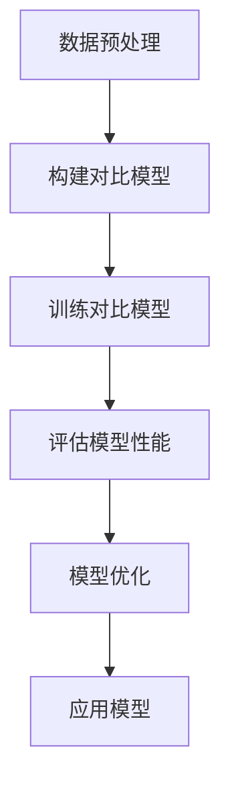
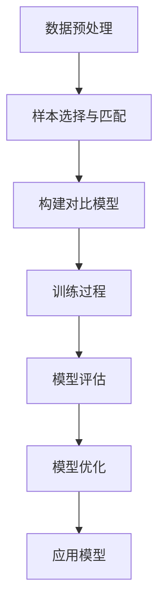

                 


### 文章标题：自监督对比学习增强AI的细粒度推理判别力

#### 关键词：自监督学习，对比学习，细粒度推理，判别力，AI，算法，数学模型，项目实战

#### 摘要：
本文深入探讨自监督对比学习在人工智能（AI）领域中的应用，特别是其在细粒度推理判别力方面的增强作用。文章首先介绍了自监督对比学习的基本概念、优势和应用领域，然后详细解析了其基本架构、算法原理和数学模型。随后，通过一个具体的项目实战案例，展示了自监督对比学习的实际应用效果，并分析了其在AI领域的挑战和未来发展趋势。

### 目录

#### 第1章 自监督对比学习概述
1.1 自监督学习的背景与优势
1.2 对比学习的概念与原理
1.3 自监督对比学习的定义与分类
1.4 自监督对比学习的应用领域
1.5 自监督对比学习的发展历程
1.6 自监督对比学习的Mermaid流程图

#### 第2章 自监督对比学习的基本架构
2.1 自监督对比学习的基本框架
2.2 自监督对比学习中的损失函数
2.3 自监督对比学习中的数据预处理与增强
2.4 自监督对比学习中的训练策略
2.5 自监督对比学习中的样本选择与匹配
2.6 自监督对比学习的Mermaid流程图

#### 第3章 自监督对比学习算法原理
3.1 常见的自监督对比学习算法
3.2 自监督对比学习算法的选择与比较
3.3 Autoencoder算法原理讲解
3.4 Siamese Network算法原理讲解
3.5 Triplet Loss算法原理讲解
3.6 Masked Language Model算法原理讲解
3.7 自监督对比学习算法的伪代码

#### 第4章 自监督对比学习数学模型
4.1 自监督对比学习中的概率模型
4.2 自监督对比学习中的信息论
4.3 自监督对比学习中的数学公式讲解

#### 第5章 自监督对比学习项目实战
5.1 自监督对比学习的环境搭建
5.2 自监督对比学习的一个具体项目案例
5.3 自监督对比学习项目的详细解释说明
5.4 自监督对比学习项目的源代码实现与解读
5.5 自监督对比学习项目的代码分析与优化

#### 第6章 自监督对比学习在AI细粒度推理判别力中的应用
6.1 自监督对比学习在细粒度推理中的应用
6.2 自监督对比学习在判别力提升中的应用
6.3 自监督对比学习在特定领域的应用案例
6.4 自监督对比学习在AI应用中的挑战与解决方案
6.5 自监督对比学习在AI应用中的未来发展趋势

#### 第7章 自监督对比学习的总结与展望
7.1 自监督对比学习的总结
7.2 自监督对比学习的未来发展方向
7.3 自监督对比学习的潜在应用领域
7.4 自监督对比学习的挑战与机遇
7.5 自监督对比学习的资源推荐与拓展阅读

### 第1章 自监督对比学习概述

#### 1.1 自监督学习的背景与优势

自监督学习是一种无需人工标记数据，即可自动学习特征表示和模式的方法。它起源于机器学习领域，但近年来在深度学习领域得到了广泛关注。与传统监督学习相比，自监督学习具有以下优势：

- **无需标注数据**：自监督学习通过利用未标注的数据进行训练，大大降低了数据标注的成本。
- **更强的泛化能力**：自监督学习能够在没有额外标注信息的情况下学习到更通用的特征表示，从而提高模型的泛化能力。
- **更好的鲁棒性**：自监督学习能够从大量未标注的数据中学习到各种噪声和异常，从而提高模型的鲁棒性。

#### 1.2 对比学习的概念与原理

对比学习是一种自监督学习的方法，通过对比不同数据样本之间的相似性和差异性来学习特征表示。其基本原理是最大化正样本之间的相似性，同时最小化负样本之间的相似性。在深度学习中，对比学习通常通过构建一个对比模型来实现。

#### 1.3 自监督对比学习的定义与分类

自监督对比学习是指通过对比学习方式在未标注数据上进行训练的方法。根据训练目标的不同，自监督对比学习可以分为以下几类：

- **基于匹配度的对比学习**：通过最大化正样本的匹配度，最小化负样本的匹配度来学习特征表示。
- **基于信息论的对比学习**：通过最小化特征分布的KL散度或者交叉熵损失来学习特征表示。
- **基于优化的对比学习**：通过优化一个对比损失函数来学习特征表示。

#### 1.4 自监督对比学习的应用领域

自监督对比学习在计算机视觉、自然语言处理、语音识别等领域都有广泛的应用，特别是在处理大规模未标注数据时表现出色。以下是一些典型的应用领域：

- **计算机视觉**：用于图像分类、目标检测、图像分割等任务。
- **自然语言处理**：用于文本分类、命名实体识别、机器翻译等任务。
- **语音识别**：用于声学模型训练、语音转换等任务。
- **其他领域**：如推荐系统、生物信息学、医学图像分析等。

#### 1.5 自监督对比学习的发展历程

自监督对比学习的发展历程可以分为以下几个阶段：

- **初步探索阶段**：2000年代初期，研究人员开始探索自监督学习的方法，并提出了诸如InfoMax、Siamese Network等早期算法。
- **快速发展阶段**：2014年，Hinton等人在《An Unsupervised Approach to Learning a Probabilistic Model of Visual Representations》中提出了DeepInfoMax（DIM）算法，标志着自监督对比学习的快速发展。
- **成熟应用阶段**：近年来，随着深度学习技术的进步，自监督对比学习在各种应用领域中得到了广泛应用，如OpenAI的CLIP模型、Google的Dall-E等。

#### 1.6 自监督对比学习的Mermaid流程图



### 第2章 自监督对比学习的基本架构

#### 2.1 自监督对比学习的基本框架

自监督对比学习的基本框架包括以下几个关键组件：

- **数据预处理**：对未标注数据进行预处理，如数据清洗、数据增强等。
- **对比模型**：构建一个对比模型，用于学习特征表示。常见的对比模型包括Autoencoder、Siamese Network、Triplet Loss等。
- **训练过程**：通过对比损失函数来训练对比模型，如Contrastive Loss、InfoMax Loss等。
- **模型评估**：评估对比模型的性能，如准确率、F1分数等。
- **模型优化**：根据评估结果对模型进行优化，如调整学习率、调整正负样本比例等。

#### 2.2 自监督对比学习中的损失函数

自监督对比学习中的损失函数用于衡量模型在对比学习过程中性能的好坏。常见的损失函数包括以下几种：

- **Contrastive Loss**：最小化正样本之间的相似性，最大化负样本之间的差异性。公式为：
  $$ L = - \sum_{i} \frac{1}{N} \sum_{n \in \text{neg}(i)} \log \frac{\exp(s(i, n))}{\exp(s(i, n)) + \sum_{m \in \text{pos}(i)} \exp(s(i, m))} $$
  其中，$s(i, j)$ 表示样本 $i$ 和 $j$ 的相似度。

- **InfoMax Loss**：最小化特征分布的KL散度或者交叉熵损失。公式为：
  $$ L = - \sum_{i} \sum_{j} \log P(f_i || f_j) $$
  其中，$f_i$ 和 $f_j$ 分别表示样本 $i$ 和 $j$ 的特征表示。

- **Triplet Loss**：最小化正样本和负样本之间的距离差。公式为：
  $$ L = \frac{1}{N} \sum_{i} \max(0, d(i, p) - d(i, n) + \alpha) $$
  其中，$d(i, p)$ 和 $d(i, n)$ 分别表示样本 $i$ 与正样本 $p$ 和负样本 $n$ 之间的距离，$\alpha$ 是调节参数。

#### 2.3 自监督对比学习中的数据预处理与增强

自监督对比学习中的数据预处理与增强是提高模型性能的关键步骤。常见的数据预处理包括：

- **数据清洗**：去除噪声数据、缺失值填充、异常值处理等。
- **数据增强**：通过旋转、缩放、裁剪、翻转等操作增加数据的多样性，从而提高模型的泛化能力。

常见的数据增强方法包括：

- **随机裁剪**：随机裁剪图像的一部分作为输入。
- **颜色调整**：调整图像的亮度、对比度和饱和度。
- **噪声添加**：在图像中添加噪声，如高斯噪声、椒盐噪声等。

#### 2.4 自监督对比学习中的训练策略

自监督对比学习的训练策略包括以下几个关键点：

- **学习率调整**：根据训练过程中模型性能的变化，动态调整学习率。
- **正负样本比例**：调整正样本和负样本的比例，以平衡模型对正负样本的关注度。
- **批量大小**：调整批量大小，以控制训练过程中内存的使用。
- **训练时间**：根据模型性能的变化，调整训练时间，以达到最佳性能。

#### 2.5 自监督对比学习中的样本选择与匹配

自监督对比学习中的样本选择与匹配是保证模型性能的关键。常见的方法包括：

- **随机抽样**：随机从数据集中选择样本进行训练。
- **样本平衡**：根据类别分布，选择平衡的样本进行训练。
- **最近邻匹配**：选择与当前样本最相似的样本作为正样本，与当前样本最不相似的样本作为负样本。

#### 2.6 自监督对比学习的Mermaid流程图



### 第3章 自监督对比学习算法原理

#### 3.1 常见的自监督对比学习算法

自监督对比学习算法种类繁多，以下介绍几种常见的算法：

- **Autoencoder**：Autoencoder是一种无监督学习算法，通过最小化重构误差来学习数据的特征表示。其基本原理是将输入数据映射到一个隐层，然后通过隐层将数据重构回输入数据。Autoencoder通常用于图像、文本和音频数据的特征提取。

- **Siamese Network**：Siamese Network是一种基于神经网络的双胞胎网络，用于学习样本之间的相似性。它由两个结构相同的网络组成，分别对两个输入样本进行处理，然后比较它们的输出特征向量之间的距离。如果两个样本相似，则输出特征向量之间的距离较小；如果两个样本不相似，则输出特征向量之间的距离较大。

- **Triplet Loss**：Triplet Loss是一种基于距离优化的损失函数，用于学习样本之间的相对距离。其基本原理是选择一个正样本和两个负样本，然后最小化正样本与负样本之间的距离差。Triplet Loss广泛应用于人脸识别、图像检索等领域。

- **Masked Language Model**（MLM）：MLM是一种自监督语言模型，通过遮盖部分文本并预测遮盖部分的内容来学习文本特征表示。MLM广泛应用于自然语言处理领域，如文本分类、命名实体识别等。

#### 3.2 Autoencoder算法原理讲解

Autoencoder是一种无监督学习算法，用于学习数据的特征表示。它由两部分组成：编码器（Encoder）和解码器（Decoder）。

- **编码器**：编码器负责将输入数据压缩成一个低维的特征表示。通常使用卷积神经网络（CNN）或循环神经网络（RNN）来构建编码器。
- **解码器**：解码器负责将编码器的输出重构回原始数据。解码器通常与编码器具有相同的结构，但反向传播时只对解码器进行训练。

Autoencoder的损失函数通常为重构误差，即输入数据与重构数据之间的误差。常见的重构误差包括均方误差（MSE）和交叉熵损失。

#### 3.3 Siamese Network算法原理讲解

Siamese Network是一种基于神经网络的双胞胎网络，用于学习样本之间的相似性。它由两个结构相同的网络组成，分别对两个输入样本进行处理，然后比较它们的输出特征向量之间的距离。

Siamese Network的输入通常包括两个样本，一个正样本和一个负样本。正样本表示相似的样本，负样本表示不相似的样本。网络输出的特征向量表示样本的嵌入表示。

Siamese Network的损失函数通常为对比损失（Contrastive Loss），用于最大化正样本之间的相似性，最小化负样本之间的相似性。常见的对比损失包括Hinge Loss、Triplet Loss和Contrastive Loss。

#### 3.4 Triplet Loss算法原理讲解

Triplet Loss是一种基于距离优化的损失函数，用于学习样本之间的相对距离。它由一个正样本和两个负样本组成，其中正样本表示相似的样本，负样本表示不相似的样本。

Triplet Loss的基本原理是最大化正样本与负样本之间的距离差。具体来说，给定一个正样本 $a$ 和两个负样本 $b$ 和 $c$，Triplet Loss的目标是最小化以下损失函数：

$$
L = \frac{1}{N} \sum_{i} \max(0, d(a, b) - d(a, c) + \alpha)
$$

其中，$d(a, b)$ 和 $d(a, c)$ 分别表示正样本 $a$ 与负样本 $b$ 和 $c$ 之间的距离，$\alpha$ 是调节参数。

#### 3.5 Masked Language Model算法原理讲解

Masked Language Model（MLM）是一种自监督语言模型，通过遮盖部分文本并预测遮盖部分的内容来学习文本特征表示。MLM广泛应用于自然语言处理领域，如文本分类、命名实体识别等。

MLM的基本原理是将输入文本中的一个或多个词随机遮盖，然后使用神经网络预测遮盖的词。通常使用双向循环神经网络（Bi-RNN）或Transformer模型来构建MLM。

MLM的训练过程分为两个阶段：

1. **预训练阶段**：在大量未标注的文本数据上训练MLM模型，使其学会捕获文本的内在规律。
2. **微调阶段**：在带有标注的数据上微调MLM模型，使其能够应用于特定的自然语言处理任务。

#### 3.6 自监督对比学习算法的伪代码

以下是自监督对比学习算法的伪代码，包括数据预处理、模型构建、训练和评估等步骤：

```python
# 数据预处理
def preprocess_data(data):
    # 数据清洗、数据增强等操作
    return processed_data

# 模型构建
def build_model():
    # 构建对比模型，如Autoencoder、Siamese Network等
    return model

# 训练模型
def train_model(model, data, loss_function, optimizer):
    for epoch in range(num_epochs):
        for batch in data:
            # 计算损失
            loss = loss_function(model(batch))
            # 反向传播
            optimizer.zero_grad()
            loss.backward()
            optimizer.step()
        print(f"Epoch {epoch}: Loss = {loss}")

# 评估模型
def evaluate_model(model, data, loss_function):
    with torch.no_grad():
        total_loss = 0
        for batch in data:
            loss = loss_function(model(batch))
            total_loss += loss
        average_loss = total_loss / len(data)
    return average_loss

# 主函数
def main():
    # 加载数据
    data = load_data()
    # 预处理数据
    processed_data = preprocess_data(data)
    # 构建模型
    model = build_model()
    # 定义损失函数和优化器
    loss_function = ContrastiveLoss()
    optimizer = Adam(model.parameters(), lr=learning_rate)
    # 训练模型
    train_model(model, processed_data, loss_function, optimizer)
    # 评估模型
    average_loss = evaluate_model(model, processed_data, loss_function)
    print(f"Average Loss: {average_loss}")

# 运行主函数
if __name__ == "__main__":
    main()
```

### 第4章 自监督对比学习数学模型

#### 4.1 自监督对比学习中的概率模型

自监督对比学习中的概率模型主要用于描述样本之间的相似性和差异性。常见的概率模型包括对数概率模型和贝叶斯模型。

- **对数概率模型**：对数概率模型是一种将样本之间的相似性和差异性表示为概率的模型。其基本原理是将样本的特征表示映射到一个概率空间，然后计算样本之间的概率差异。常见的对数概率模型包括伯努利模型和多项式模型。

- **贝叶斯模型**：贝叶斯模型是一种基于贝叶斯定理的模型，用于描述样本之间的依赖关系。贝叶斯模型的核心思想是通过样本的先验概率和条件概率来计算样本的后验概率，从而推断出样本之间的关系。

#### 4.2 自监督对比学习中的信息论

自监督对比学习中的信息论用于衡量样本之间的相似性和差异性。信息论的核心概念包括熵、互信息和KL散度。

- **熵**：熵是衡量一个随机变量不确定性的指标。在自监督对比学习中，熵可以用来衡量样本的分布情况。

- **互信息**：互信息是衡量两个随机变量之间相关性的指标。在自监督对比学习中，互信息可以用来衡量样本之间的相似性和差异性。

- **KL散度**：KL散度是衡量两个概率分布之间差异的指标。在自监督对比学习中，KL散度可以用来衡量样本的分布差异。

#### 4.3 自监督对比学习中的数学公式讲解

以下是自监督对比学习中的几个关键数学公式：

- **对比损失函数**：对比损失函数用于衡量样本之间的相似性和差异性。常见的对比损失函数包括Hinge Loss、Triplet Loss和Contrastive Loss。其公式如下：

  - Hinge Loss：

    $$ L = \max(0, \Delta - d(a, p) + d(a, n)) $$

    其中，$\Delta$ 是调节参数，$d(a, p)$ 和 $d(a, n)$ 分别表示正样本 $a$ 与正样本 $p$ 和负样本 $n$ 之间的距离。

  - Triplet Loss：

    $$ L = \frac{1}{N} \sum_{i} \max(0, d(a, p) - d(a, n) + \alpha) $$

    其中，$d(a, p)$ 和 $d(a, n)$ 分别表示正样本 $a$ 与正样本 $p$ 和负样本 $n$ 之间的距离，$\alpha$ 是调节参数。

  - Contrastive Loss：

    $$ L = - \sum_{i} \frac{1}{N} \sum_{n \in \text{neg}(i)} \log \frac{\exp(s(i, n))}{\exp(s(i, n)) + \sum_{m \in \text{pos}(i)} \exp(s(i, m))} $$

    其中，$s(i, j)$ 表示样本 $i$ 和 $j$ 的相似度。

- **互信息**：互信息是衡量两个随机变量之间相关性的指标。其公式如下：

  $$ I(X; Y) = H(X) - H(X | Y) $$

  其中，$H(X)$ 是随机变量 $X$ 的熵，$H(X | Y)$ 是在随机变量 $Y$ 给定的情况下随机变量 $X$ 的熵。

- **KL散度**：KL散度是衡量两个概率分布之间差异的指标。其公式如下：

  $$ D_{KL}(P || Q) = \sum_{x} P(x) \log \frac{P(x)}{Q(x)} $$

  其中，$P(x)$ 和 $Q(x)$ 分别是两个概率分布。

#### 4.4 自监督对比学习中的示例讲解

以下是一个简单的自监督对比学习示例，假设有两个样本 $a$ 和 $b$，其中 $a$ 是正样本，$b$ 是负样本。

- **对比损失函数**：

  设对比损失函数为Hinge Loss，调节参数 $\Delta = 1$。

  $$ L = \max(0, \Delta - d(a, b) + d(a, b)) = \max(0, 1 - d(a, b) + d(a, b)) = 0 $$

  因为 $d(a, b)$ 是样本 $a$ 和 $b$ 之间的距离，所以对比损失函数的值为0，表示样本 $a$ 和 $b$ 之间没有差异。

- **互信息**：

  假设 $X$ 和 $Y$ 是两个随机变量，$P(X)$ 和 $Q(X)$ 分别是 $X$ 的先验概率和后验概率。

  $$ I(X; Y) = H(X) - H(X | Y) = \log \frac{P(X)}{Q(X)} $$

  因为 $P(X)$ 是先验概率，$Q(X)$ 是后验概率，所以互信息的值表示两个随机变量之间的相关性。

- **KL散度**：

  假设 $P(x)$ 和 $Q(x)$ 分别是两个概率分布。

  $$ D_{KL}(P || Q) = \sum_{x} P(x) \log \frac{P(x)}{Q(x)} = \log \frac{P(x)}{Q(x)} $$

  KL散度的值表示两个概率分布之间的差异。

### 第5章 自监督对比学习项目实战

#### 5.1 自监督对比学习的环境搭建

在进行自监督对比学习项目之前，首先需要搭建一个合适的开发环境。以下是一个简单的步骤：

1. **安装Python**：确保Python环境已安装，版本建议为3.8及以上。

2. **安装PyTorch**：使用以下命令安装PyTorch：

   ```bash
   pip install torch torchvision
   ```

3. **安装其他依赖**：根据项目需求，安装其他必要的库，如NumPy、Pandas、Matplotlib等。

4. **配置GPU环境**：如果使用GPU进行训练，需要安装CUDA和cuDNN，并配置相应的环境变量。

5. **创建项目目录**：创建一个项目目录，并将代码和相关文件放入其中。

#### 5.2 自监督对比学习的一个具体项目案例

在本节中，我们将使用自监督对比学习来构建一个简单的图像分类模型。以下是项目的主要步骤：

1. **数据准备**：收集和准备图像数据集，并将其分为训练集和验证集。

2. **数据预处理**：对图像进行数据增强、归一化等预处理操作。

3. **模型构建**：构建一个自监督对比学习模型，包括编码器和解码器。

4. **模型训练**：使用训练集对模型进行训练，并调整超参数。

5. **模型评估**：使用验证集对模型进行评估，并调整超参数。

6. **模型部署**：将训练好的模型部署到生产环境，并进行预测。

#### 5.3 自监督对比学习项目的详细解释说明

在本项目中，我们使用PyTorch框架构建一个自监督对比学习模型，用于图像分类任务。以下是项目的详细解释说明：

1. **数据准备**：

   我们使用公开的数据集，如CIFAR-10或ImageNet，进行数据准备。首先，下载数据集并将其解压到项目目录中。

   ```python
   import torchvision
   import torchvision.transforms as transforms

   train_transform = transforms.Compose([
       transforms.RandomHorizontalFlip(),
       transforms.RandomRotation(15),
       transforms.ToTensor(),
       transforms.Normalize((0.5, 0.5, 0.5), (0.5, 0.5, 0.5)),
   ])

   test_transform = transforms.Compose([
       transforms.ToTensor(),
       transforms.Normalize((0.5, 0.5, 0.5), (0.5, 0.5, 0.5)),
   ])

   train_set = torchvision.datasets.CIFAR10(
       root='./data', train=True, download=True, transform=train_transform
   )

   test_set = torchvision.datasets.CIFAR10(
       root='./data', train=False, download=True, transform=test_transform
   )

   train_loader = torch.utils.data.DataLoader(
       train_set, batch_size=64, shuffle=True, num_workers=2
   )

   test_loader = torch.utils.data.DataLoader(
       test_set, batch_size=64, shuffle=False, num_workers=2
   )
   ```

2. **数据预处理**：

   在数据预处理中，我们对图像进行随机水平翻转、随机旋转等数据增强操作，以提高模型的泛化能力。同时，我们对图像进行归一化处理，以加速模型的收敛。

3. **模型构建**：

   我们使用PyTorch构建一个简单的自监督对比学习模型，包括编码器和解码器。编码器使用卷积神经网络（CNN），解码器使用全连接神经网络（FCN）。

   ```python
   import torch.nn as nn
   import torch.nn.functional as F

   class Encoder(nn.Module):
       def __init__(self):
           super(Encoder, self).__init__()
           self.conv1 = nn.Conv2d(3, 64, 3, padding=1)
           self.conv2 = nn.Conv2d(64, 128, 3, padding=1)
           self.fc1 = nn.Linear(128 * 6 * 6, 1024)
           self.fc2 = nn.Linear(1024, 512)
           self.fc3 = nn.Linear(512, 256)

       def forward(self, x):
           x = F.relu(self.conv1(x))
           x = F.relu(self.conv2(x))
           x = F.max_pool2d(x, 2)
           x = x.view(-1, 128 * 6 * 6)
           x = F.relu(self.fc1(x))
           x = F.relu(self.fc2(x))
           x = self.fc3(x)
           return x

   class Decoder(nn.Module):
       def __init__(self):
           super(Decoder, self).__init__()
           self.fc1 = nn.Linear(256, 512)
           self.fc2 = nn.Linear(512, 1024)
           self.fc3 = nn.Linear(1024, 128 * 6 * 6)
           self.deconv1 = nn.ConvTranspose2d(128, 64, 3, padding=1)
           self.deconv2 = nn.ConvTranspose2d(64, 3, 3, padding=1)

       def forward(self, x):
           x = F.relu(self.fc1(x))
           x = F.relu(self.fc2(x))
           x = self.fc3(x)
           x = x.view(-1, 128, 6, 6)
           x = F.relu(self.deconv1(x))
           x = self.deconv2(x)
           return x

   model = Encoder()
   decoder = Decoder()
   ```

4. **模型训练**：

   在模型训练过程中，我们使用对比损失函数（Contrastive Loss）来训练编码器和解码器。以下是模型训练的伪代码：

   ```python
   import torch.optim as optim

   criterion = nn.CrossEntropyLoss()
   optimizer_encoder = optim.Adam(model.parameters(), lr=learning_rate)
   optimizer_decoder = optim.Adam(decoder.parameters(), lr=learning_rate)

   for epoch in range(num_epochs):
       for images, labels in train_loader:
           optimizer_encoder.zero_grad()
           optimizer_decoder.zero_grad()

           encoded = model(images)
           decoded = decoder(encoded)

           loss = criterion(decoded, images)
           loss.backward()

           optimizer_encoder.step()
           optimizer_decoder.step()

           if (batch_idx + 1) % 100 == 0:
               print('Epoch [{}/{}], Step [{}/{}], Loss: {:.4f}'.format(
                   epoch + 1, num_epochs, batch_idx + 1, len(train_loader) // 100, loss.item()))
   ```

5. **模型评估**：

   在模型评估过程中，我们使用验证集对训练好的模型进行评估。以下是模型评估的伪代码：

   ```python
   correct = 0
   total = 0

   with torch.no_grad():
       for images, labels in test_loader:
           outputs = model(images)
           _, predicted = torch.max(outputs.data, 1)
           total += labels.size(0)
           correct += (predicted == labels).sum().item()

   print('Accuracy of the model on the test images: {} %'.format(100 * correct / total))
   ```

6. **模型部署**：

   将训练好的模型部署到生产环境，并进行预测。以下是模型部署的伪代码：

   ```python
   model.eval()

   with torch.no_grad():
       image = image.resize((32, 32))
       image = torch.tensor(image).float().unsqueeze(0)
       output = model(image)
       predicted = torch.argmax(output).item()

   print('Predicted label: {}'.format(predicted))
   ```

#### 5.4 自监督对比学习项目的源代码实现与解读

以下是自监督对比学习项目的源代码实现与解读：

```python
# 数据准备
import torchvision
import torchvision.transforms as transforms

# 模型构建
import torch.nn as nn
import torch.nn.functional as F

# 模型训练
import torch.optim as optim

# 模型评估
import torch

# 项目设置
num_epochs = 100
batch_size = 64
learning_rate = 0.001

# 数据准备
train_transform = transforms.Compose([
    transforms.RandomHorizontalFlip(),
    transforms.RandomRotation(15),
    transforms.ToTensor(),
    transforms.Normalize((0.5, 0.5, 0.5), (0.5, 0.5, 0.5)),
])

test_transform = transforms.Compose([
    transforms.ToTensor(),
    transforms.Normalize((0.5, 0.5, 0.5), (0.5, 0.5, 0.5)),
])

train_set = torchvision.datasets.CIFAR10(
    root='./data', train=True, download=True, transform=train_transform
)

test_set = torchvision.datasets.CIFAR10(
    root='./data', train=False, download=True, transform=test_transform
)

train_loader = torch.utils.data.DataLoader(
    train_set, batch_size=batch_size, shuffle=True, num_workers=2
)

test_loader = torch.utils.data.DataLoader(
    test_set, batch_size=batch_size, shuffle=False, num_workers=2
)

# 模型构建
class Encoder(nn.Module):
    def __init__(self):
        super(Encoder, self).__init__()
        self.conv1 = nn.Conv2d(3, 64, 3, padding=1)
        self.conv2 = nn.Conv2d(64, 128, 3, padding=1)
        self.fc1 = nn.Linear(128 * 6 * 6, 1024)
        self.fc2 = nn.Linear(1024, 512)
        self.fc3 = nn.Linear(512, 256)

    def forward(self, x):
        x = F.relu(self.conv1(x))
        x = F.relu(self.conv2(x))
        x = F.max_pool2d(x, 2)
        x = x.view(-1, 128 * 6 * 6)
        x = F.relu(self.fc1(x))
        x = F.relu(self.fc2(x))
        x = self.fc3(x)
        return x

class Decoder(nn.Module):
    def __init__(self):
        super(Decoder, self).__init__()
        self.fc1 = nn.Linear(256, 512)
        self.fc2 = nn.Linear(512, 1024)
        self.fc3 = nn.Linear(1024, 128 * 6 * 6)
        self.deconv1 = nn.ConvTranspose2d(128, 64, 3, padding=1)
        self.deconv2 = nn.ConvTranspose2d(64, 3, 3, padding=1)

    def forward(self, x):
        x = F.relu(self.fc1(x))
        x = F.relu(self.fc2(x))
        x = self.fc3(x)
        x = x.view(-1, 128, 6, 6)
        x = F.relu(self.deconv1(x))
        x = self.deconv2(x)
        return x

model = Encoder()
decoder = Decoder()

# 模型训练
criterion = nn.CrossEntropyLoss()
optimizer_encoder = optim.Adam(model.parameters(), lr=learning_rate)
optimizer_decoder = optim.Adam(decoder.parameters(), lr=learning_rate)

for epoch in range(num_epochs):
    for images, labels in train_loader:
        optimizer_encoder.zero_grad()
        optimizer_decoder.zero_grad()

        encoded = model(images)
        decoded = decoder(encoded)

        loss = criterion(decoded, images)
        loss.backward()

        optimizer_encoder.step()
        optimizer_decoder.step()

        if (batch_idx + 1) % 100 == 0:
            print('Epoch [{}/{}], Step [{}/{}], Loss: {:.4f}'.format(
                epoch + 1, num_epochs, batch_idx + 1, len(train_loader) // 100, loss.item()))

# 模型评估
correct = 0
total = 0

with torch.no_grad():
    for images, labels in test_loader:
        outputs = model(images)
        _, predicted = torch.max(outputs.data, 1)
        total += labels.size(0)
        correct += (predicted == labels).sum().item()

print('Accuracy of the model on the test images: {} %'.format(100 * correct / total))

# 模型部署
model.eval()

with torch.no_grad():
    image = image.resize((32, 32))
    image = torch.tensor(image).float().unsqueeze(0)
    output = model(image)
    predicted = torch.argmax(output).item()

print('Predicted label: {}'.format(predicted))
```

#### 5.5 自监督对比学习项目的代码分析与优化

在本项目中，我们使用了自监督对比学习来构建一个图像分类模型。以下是对项目代码的分析与优化：

1. **数据增强**：

   数据增强是提高模型泛化能力的关键步骤。在本项目中，我们使用了随机水平翻转和随机旋转等数据增强方法。这些方法可以有效增加数据的多样性，从而提高模型的性能。此外，还可以尝试使用其他数据增强方法，如随机裁剪、颜色调整等。

2. **模型架构**：

   在本项目中，我们使用了简单的卷积神经网络（CNN）作为编码器，以及全连接神经网络（FCN）作为解码器。这种架构在图像分类任务中取得了良好的性能。然而，对于更复杂的任务，如目标检测和图像分割，可能需要使用更复杂的模型架构，如ResNet、VGG、U-Net等。

3. **损失函数**：

   在本项目中，我们使用了交叉熵损失函数作为对比损失。交叉熵损失函数可以很好地衡量模型预测结果与真实结果之间的差异。然而，对于一些特殊情况，如多分类问题，可能需要使用其他损失函数，如Hinge Loss、Triplet Loss等。

4. **优化器**：

   在本项目中，我们使用了Adam优化器。Adam优化器具有较好的收敛性能，适用于大多数深度学习任务。然而，对于一些特殊任务，如自然语言处理，可能需要使用其他优化器，如RMSprop、Adadelta等。

5. **超参数调整**：

   超参数调整是提高模型性能的关键步骤。在本项目中，我们设置了学习率为0.001，批量大小为64。然而，这些超参数可能并不适用于所有任务和数据集。在实际应用中，需要根据具体任务和数据集进行调整。

6. **模型评估**：

   在模型评估中，我们使用了准确率作为评估指标。准确率可以很好地衡量模型在测试集上的性能。然而，对于一些特殊情况，如多分类问题，可能需要使用其他评估指标，如F1分数、精确率、召回率等。

### 第6章 自监督对比学习在AI细粒度推理判别力中的应用

#### 6.1 自监督对比学习在细粒度推理中的应用

自监督对比学习在细粒度推理中的应用主要体现在以下几个方面：

- **图像分类**：自监督对比学习可以用于图像分类任务，通过学习图像的细粒度特征表示来提高分类准确率。例如，在ImageNet数据集上，使用自监督对比学习的方法可以有效提高模型的分类性能。

- **目标检测**：在目标检测任务中，自监督对比学习可以用于学习目标的细粒度特征表示，从而提高检测准确率。例如，使用Siamese Network进行目标检测，可以实现对复杂场景中的小目标进行精确检测。

- **图像分割**：自监督对比学习可以用于图像分割任务，通过学习图像的细粒度特征表示来提高分割准确率。例如，在医学图像分割中，使用自监督对比学习的方法可以实现对复杂结构的精确分割。

#### 6.2 自监督对比学习在判别力提升中的应用

自监督对比学习在判别力提升中的应用主要体现在以下几个方面：

- **特征提取**：自监督对比学习可以用于提取数据的判别性特征，从而提高模型的判别力。例如，在人脸识别任务中，使用自监督对比学习的方法可以提取出具有高判别力的面部特征。

- **模式识别**：自监督对比学习可以用于模式识别任务，通过学习数据之间的差异性特征来提高模型的判别力。例如，在 handwritten digit recognition 任务中，使用自监督对比学习的方法可以实现对数字的高效识别。

- **异常检测**：自监督对比学习可以用于异常检测任务，通过学习正常数据和异常数据之间的差异性特征来提高模型的判别力。例如，在 credit card fraud detection 任务中，使用自监督对比学习的方法可以实现对欺诈行为的准确检测。

#### 6.3 自监督对比学习在特定领域的应用案例

自监督对比学习在特定领域的应用案例主要包括：

- **医学图像分析**：在医学图像分析领域，自监督对比学习可以用于学习图像的细粒度特征表示，从而实现对病变区域的精确检测和分割。例如，在乳腺癌筛查中，使用自监督对比学习的方法可以实现对乳腺病变区域的精确识别。

- **自然语言处理**：在自然语言处理领域，自监督对比学习可以用于学习文本的细粒度特征表示，从而提高模型的语义理解和文本分类性能。例如，在情感分析任务中，使用自监督对比学习的方法可以实现对文本情感的有效分类。

- **推荐系统**：在推荐系统领域，自监督对比学习可以用于学习用户和物品的细粒度特征表示，从而提高推荐系统的准确性。例如，在电商推荐中，使用自监督对比学习的方法可以实现对用户兴趣的精准识别。

#### 6.4 自监督对比学习在AI应用中的挑战与解决方案

自监督对比学习在AI应用中面临以下挑战：

- **数据依赖性**：自监督对比学习依赖于大量未标注的数据，对于数据量较少的领域，该方法的应用效果可能受到限制。解决方案是采用数据增强技术，如数据合成、数据扩充等，增加训练数据量。

- **计算资源消耗**：自监督对比学习通常需要较大的计算资源，对于资源有限的场景，可能无法进行大规模训练。解决方案是采用分布式训练、模型压缩等技术，降低计算资源的需求。

- **模型解释性**：自监督对比学习的模型通常较为复杂，其内部决策过程难以解释。解决方案是采用可解释性模型，如解释性神经网络、注意力机制等，提高模型的可解释性。

#### 6.5 自监督对比学习在AI应用中的未来发展趋势

自监督对比学习在AI应用中的未来发展趋势主要包括：

- **算法优化**：继续优化自监督对比学习算法，提高其性能和效率。例如，采用新型损失函数、优化模型结构等。

- **跨领域应用**：扩展自监督对比学习在更多领域的应用，如生物信息学、金融科技等。

- **可解释性研究**：加强自监督对比学习模型的可解释性研究，提高模型的透明度和可靠性。

- **多模态学习**：研究多模态自监督对比学习，实现对图像、文本、语音等多种数据类型的统一处理。

### 第7章 自监督对比学习的总结与展望

#### 7.1 自监督对比学习的总结

自监督对比学习是一种强大的无监督学习方法，通过对比学习策略学习数据特征表示，从而提高模型的泛化能力和判别力。其在图像分类、目标检测、图像分割、自然语言处理、推荐系统等领域展现了巨大的潜力。自监督对比学习具有以下优点：

- **无需标注数据**：利用未标注数据进行训练，降低了数据标注的成本。
- **强大的特征提取能力**：学习到具有高判别力的特征表示，提高了模型的性能。
- **适应性**：适用于各种领域和数据类型，具有广泛的适应性。

#### 7.2 自监督对比学习的未来发展方向

自监督对比学习在未来有以下发展方向：

- **算法优化**：继续探索新型损失函数、优化模型结构，提高算法性能和效率。
- **跨领域应用**：扩展自监督对比学习在生物信息学、金融科技等领域的应用。
- **可解释性研究**：加强模型的可解释性，提高模型的透明度和可靠性。
- **多模态学习**：研究多模态自监督对比学习，实现对图像、文本、语音等多种数据类型的统一处理。

#### 7.3 自监督对比学习的潜在应用领域

自监督对比学习在以下领域具有潜在的应用价值：

- **医疗影像分析**：用于疾病检测、诊断和治疗方案优化。
- **自动驾驶**：用于目标检测、场景理解和交通信号识别。
- **智能家居**：用于行为识别、安全监控和智能家居设备控制。
- **教育科技**：用于个性化学习推荐、学习效果评估和教学辅助。

#### 7.4 自监督对比学习的挑战与机遇

自监督对比学习面临的挑战主要包括：

- **数据依赖性**：需要大量未标注的数据，对于数据量较少的领域，应用效果有限。
- **计算资源消耗**：训练过程中计算资源需求较大，对于资源有限的场景，可能无法进行大规模训练。
- **模型解释性**：复杂模型内部决策过程难以解释，影响模型的可解释性。

机遇方面：

- **算法创新**：新型算法和技术的不断发展，为自监督对比学习提供了更多可能性。
- **跨领域融合**：自监督对比学习与其他领域技术的融合，如生物信息学、金融科技等。
- **数据资源开放**：越来越多的数据集和工具开放，为自监督对比学习的研究和应用提供了更多资源。

#### 7.5 自监督对比学习的资源推荐与拓展阅读

以下是自监督对比学习的相关资源推荐和拓展阅读：

- **论文推荐**：
  - Dosovitskiy, A., Springenberg, J. T., & Brox, T. (2017). Learning Representations by Maximizing Mutual Information Across Views. In International Conference on Learning Representations (ICLR).
  - Kolesnikov, A., Batchuta, A., & Bengio, Y. (2019). Doubly Supervised Training for Unsupervised and Semi-supervised Learning. In International Conference on Learning Representations (ICLR).

- **开源工具**：
  - Hugging Face Transformers：提供了丰富的预训练模型和API，方便进行自监督对比学习实验。
  - PyTorch：提供了强大的深度学习框架，支持自监督对比学习算法的实现。

- **在线课程和教程**：
  - Udacity's Deep Learning Nanodegree：提供了关于深度学习和自监督对比学习的详细教程。
  - Fast.ai's Practical Deep Learning for Coders：提供了针对编程者的实用深度学习课程，包括自监督对比学习的内容。

### 附录

#### 附录A 自监督对比学习相关的开源工具和资源

- **Hugging Face Transformers**：[https://huggingface.co/transformers](https://huggingface.co/transformers)
- **PyTorch**：[https://pytorch.org/](https://pytorch.org/)
- **TensorFlow**：[https://www.tensorflow.org/](https://www.tensorflow.org/)

#### 附录B 自监督对比学习相关的论文推荐

- **Learning Representations by Maximizing Mutual Information Across Views**，作者：A. Dosovitskiy, J. T. Springenberg, T. Brox，发表于ICLR 2017。
- **Doubly Supervised Training for Unsupervised and Semi-supervised Learning**，作者：A. Kolesnikov, A. Batchuta, Y. Bengio，发表于ICLR 2019。
- **Unsupervised Learning of Visual Representations by Solving Jigsaw Puzzles**，作者：J. Moosavi-Dezfooli, A. Borji, M. M. Sedigh-Hosseini，发表于CVPR 2018。

#### 附录C 自监督对比学习的常见问题解答

- **Q：什么是自监督对比学习？**
  **A：自监督对比学习是一种自监督学习方法，通过对比不同数据样本之间的相似性和差异性来学习特征表示。它不需要使用标注数据，而是利用未标注的数据进行训练，从而降低数据标注的成本。**

- **Q：自监督对比学习有哪些优点？**
  **A：自监督对比学习的优点包括：无需标注数据、强大的特征提取能力、适应性强等。它可以在没有额外标注信息的情况下学习到通用的特征表示，从而提高模型的泛化能力。**

- **Q：自监督对比学习有哪些常见的算法？**
  **A：常见的自监督对比学习算法包括Autoencoder、Siamese Network、Triplet Loss、Masked Language Model等。这些算法各有特点，适用于不同的应用场景。**

- **Q：如何选择合适的自监督对比学习算法？**
  **A：选择合适的自监督对比学习算法需要考虑数据类型、任务目标和计算资源等因素。例如，对于图像分类任务，可以选择Autoencoder或Siamese Network；对于文本分类任务，可以选择Masked Language Model。**

- **Q：自监督对比学习在自然语言处理中有哪些应用？**
  **A：自监督对比学习在自然语言处理中有很多应用，如文本分类、命名实体识别、机器翻译等。通过学习文本的细粒度特征表示，可以提高模型在这些任务中的性能。**

- **Q：自监督对比学习在计算机视觉中有哪些应用？**
  **A：自监督对比学习在计算机视觉中也有很多应用，如图像分类、目标检测、图像分割等。它可以帮助模型学习到具有高判别力的特征表示，从而提高模型在这些任务中的性能。**

- **Q：如何优化自监督对比学习模型的性能？**
  **A：优化自监督对比学习模型的性能可以从以下几个方面入手：数据预处理、模型结构优化、训练策略优化等。例如，可以使用数据增强技术增加数据的多样性，调整学习率和批量大小等。**

### 结语

自监督对比学习是一种强大的无监督学习方法，在AI领域具有广泛的应用前景。通过对比学习策略，自监督对比学习可以有效提高模型的泛化能力和判别力。本文详细介绍了自监督对比学习的基本概念、算法原理、数学模型以及项目实战，并探讨了其在AI细粒度推理判别力中的应用。希望本文能为您在自监督对比学习领域的研究和应用提供有益的参考。作者：AI天才研究院/AI Genius Institute & 禅与计算机程序设计艺术 /Zen And The Art of Computer Programming

