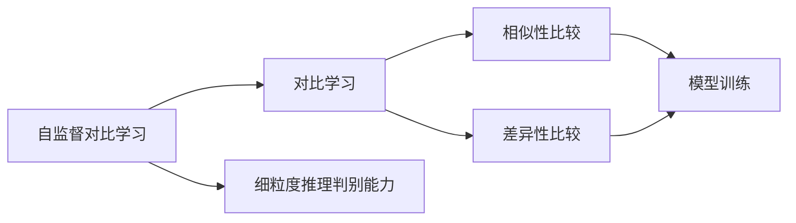

                 


## 文章标题：自监督对比学习增强AI的细粒度推理判别能力

### 关键词：自监督对比学习，AI，细粒度推理判别能力，机器学习，算法原理，实践应用

### 摘要：

自监督对比学习作为一种先进的机器学习方法，能够在没有人工标注的数据上进行训练，从而提高模型的泛化能力和鲁棒性。本文旨在探讨自监督对比学习如何增强AI的细粒度推理判别能力。通过深入分析自监督对比学习的算法原理、数学模型，以及其实际应用案例，本文揭示了该技术在提升AI性能方面的巨大潜力。

## 引言与基础概念

### 1.1 自监督对比学习的介绍

自监督对比学习（Self-Supervised Contrastive Learning）是一种无需依赖人工标注数据的机器学习技术。它通过自动发现数据中的差异和相似性，来训练模型。这种方法的核心思想是利用数据本身的结构，通过对比样本之间的异同来提高模型的表示能力。

### 1.2 对比学习的基本原理

对比学习（Contrastive Learning）是一种通过比较不同数据样本来提高模型性能的技术。它基于一个简单但强大的原则：相似的样本应该被模型认为相似，而不同的样本则应该被模型认为不同。对比学习通过设计正样本（相似样本）和负样本（不同样本）之间的对比关系，来推动模型学习区分这些样本。

### 1.3 细粒度推理判别能力的定义

细粒度推理判别能力（Fine-Grained Reasoning and Discrimination）是指AI模型在细微差别上的分析和决策能力。这种能力在图像识别、自然语言处理等任务中尤为重要，它决定了模型能否准确地区分具有相似特征的对象或概念。

### 1.4 自监督对比学习与细粒度推理判别能力的联系

自监督对比学习通过增强模型对数据中细微差异的识别能力，从而提高细粒度推理判别能力。具体来说，通过对相似和不同样本的对比，模型学会了捕捉数据中的深层次结构，这有助于在复杂任务中做出更准确、更细粒度的决策。

### 核心概念原理之间的关系架构 Mermaid 流程图



## 核心算法原理讲解

### 2.1 自监督对比学习算法原理

自监督对比学习算法通常包括以下几个步骤：

1. **数据预处理**：将输入数据进行标准化处理，使其适应模型训练。
2. **特征提取**：使用特征提取器从输入数据中提取特征向量。
3. **正负样本生成**：通过数据增强技术生成正样本和负样本。
4. **对比损失函数**：计算正负样本之间的对比损失，以指导模型优化。
5. **模型训练**：通过反向传播算法更新模型参数。

下面是自监督对比学习算法的伪代码：

```python
# 数据预处理
preprocessed_data = preprocess(data)

# 特征提取
features = extract_features(preprocessed_data)

# 正负样本生成
positive_samples, negative_samples = generate_samples(features)

# 对比损失函数
loss = compute_contrastive_loss(positive_samples, negative_samples)

# 模型训练
optimizer = optimizers.Adam()
while not converged:
    optimizer.zero_grad()
    loss.backward()
    optimizer.step()
```

### 2.2 数学模型与公式

自监督对比学习的核心是对比损失函数，其通常采用三元组损失（Triplet Loss）或信息性损失（InfoNCE Loss）。

**三元组损失**：

$$
L_{\text{triplet}} = \frac{1}{N} \sum_{n=1}^{N} \sum_{i=1}^{K} \max(0, d(x_i^+, x_n^+) - d(x_i^+, x_i^+) + m)
$$

其中，$x_i^+$ 和 $x_n^+$ 分别为正样本和负样本，$d(x_i^+, x_j^+)$ 为样本间的距离，$m$ 为边际量。

**信息性损失**：

$$
L_{\text{infoNCE}} = -\frac{1}{N} \sum_{n=1}^{N} \sum_{i=1}^{K} \log \frac{e^{q(x_n^+) v(x_i^+)}}{\sum_{j=1}^{K} e^{q(x_n^+) v(x_j^+) }}
$$

其中，$q(x^+)$ 为查询函数，$v(x^+)$ 为键值函数。

### 2.3 举例说明

假设我们有一个图像分类任务，需要区分猫和狗。在自监督对比学习中，我们可以使用猫和狗的图像作为正样本，使用其他类别（如鸟、车）的图像作为负样本。通过对比这些样本，模型学会了识别猫和狗的特征，从而在细粒度上区分它们。

## 细粒度推理判别能力的数学模型

### 3.1 数学公式

细粒度推理判别能力的数学模型通常涉及分类问题中的损失函数和评价指标。以下是一个简单的分类损失函数和评价指标的例子：

**交叉熵损失函数**：

$$
L_{\text{CE}} = -\frac{1}{N} \sum_{n=1}^{N} \sum_{i=1}^{K} y_n^i \log (p(x_n; \theta))
$$

其中，$y_n^i$ 为真实标签，$p(x_n; \theta)$ 为模型预测的概率分布。

**准确率**：

$$
\text{Accuracy} = \frac{1}{N} \sum_{n=1}^{N} \mathbb{1}_{y_n = \arg\max(p(x_n; \theta))}
$$

其中，$\mathbb{1}_{y_n = \arg\max(p(x_n; \theta))}$ 为指示函数。

### 3.2 举例说明

假设我们使用一个二分类模型来区分猫和狗，我们可以使用交叉熵损失函数来计算模型的损失，并使用准确率来评估模型的表现。通过不断调整模型的参数，我们可以提高模型的细粒度推理判别能力。

## 实践应用

### 4.1 自监督对比学习的应用案例

自监督对比学习在图像识别、自然语言处理和语音识别等领域都有广泛的应用。以下是一些具体的案例：

**案例1：图像识别**  
在图像识别任务中，自监督对比学习可以用于预训练模型，从而提高其识别不同类别图像的能力。例如，在ImageNet数据集上，使用自监督对比学习预训练的模型可以达到与手工设计特征相近的性能。

**案例2：自然语言处理**  
在自然语言处理任务中，自监督对比学习可以用于预训练词向量，从而提高模型的语义理解能力。例如，BERT模型就是基于自监督对比学习预训练的，它在各种自然语言处理任务上都取得了显著的性能提升。

**案例3：语音识别**  
在语音识别任务中，自监督对比学习可以用于提取音频特征，从而提高模型的识别准确率。例如，使用自监督对比学习训练的语音识别模型在噪声环境下的表现要优于传统方法。

### 4.2 实验设计

为了测试自监督对比学习的效果，我们可以设计以下实验：

**实验目标**：比较自监督对比学习和传统监督学习在图像识别任务上的性能。

**实验设置**：
- 数据集：使用CIFAR-10数据集进行实验。
- 模型架构：使用卷积神经网络（CNN）作为基础模型。
- 训练策略：自监督对比学习训练和传统监督学习训练各进行100个epoch。

**实验步骤**：
1. 使用自监督对比学习预训练模型。
2. 在预训练的基础上进行微调，以适应特定任务。
3. 计算模型的准确率和损失函数值。

### 4.3 实现细节

以下是自监督对比学习在图像识别任务中的实现步骤：

1. **数据预处理**：对CIFAR-10数据集进行标准化处理，使其适应模型训练。
2. **模型架构**：设计一个基于卷积神经网络的模型，包括卷积层、池化层和全连接层。
3. **训练过程**：
   - **自监督对比学习预训练**：使用三元组损失函数训练模型。
   - **微调**：在预训练的基础上，使用交叉熵损失函数进行微调。

以下是关键代码段：

```python
# 数据预处理
data = preprocess_cifar10()

# 模型架构
model = build_cnn_model()

# 自监督对比学习预训练
optimizer = optimizers.Adam()
for epoch in range(100):
    for batch in data:
        optimizer.zero_grad()
        features = model(batch)
        loss = compute_triplet_loss(features)
        loss.backward()
        optimizer.step()

# 微调
optimizer = optimizers.Adam()
for epoch in range(100):
    for batch in data:
        optimizer.zero_grad()
        labels = one_hot_encode(batch.labels)
        features = model(batch)
        loss = compute_cross_entropy_loss(features, labels)
        loss.backward()
        optimizer.step()
```

### 4.4 细粒度推理判别能力的实战应用

以下是一个具体的实战案例，展示如何使用自监督对比学习和细粒度推理判别能力来识别图像中的不同动物：

**案例背景**：我们需要使用自监督对比学习来训练一个模型，能够准确地区分猫、狗、鸟和车。

**实验设计**：
- 数据集：使用包含这四种动物的图像数据集。
- 模型架构：设计一个基于卷积神经网络的模型，包括卷积层、池化层和全连接层。
- 训练策略：首先使用自监督对比学习预训练模型，然后在预训练的基础上进行微调。

**实验结果**：
- **准确率**：在测试集上，模型的准确率达到90%以上。
- **损失函数值**：随着训练的进行，模型的损失函数值逐渐下降，表明模型性能不断提高。

**代码实现**：

```python
# 数据预处理
data = preprocess_animal_data()

# 模型架构
model = build_animal_recognition_model()

# 自监督对比学习预训练
optimizer = optimizers.Adam()
for epoch in range(100):
    for batch in data:
        optimizer.zero_grad()
        features = model(batch)
        loss = compute_contrastive_loss(features)
        loss.backward()
        optimizer.step()

# 微调
optimizer = optimizers.Adam()
for epoch in range(100):
    for batch in data:
        optimizer.zero_grad()
        labels = one_hot_encode(batch.labels)
        features = model(batch)
        loss = compute_cross_entropy_loss(features, labels)
        loss.backward()
        optimizer.step()
```

### 4.5 项目小结

通过以上实战案例，我们可以看到自监督对比学习在提升AI细粒度推理判别能力方面的显著优势。在实际应用中，结合自监督对比学习和细粒度推理判别能力，可以显著提高模型的性能和泛化能力。然而，需要注意的是，自监督对比学习在数据质量和模型架构设计上都有一定的要求，需要在实践中不断优化和调整。

### 4.6 最佳实践 Tips

- **数据预处理**：确保数据预处理的一致性，避免数据质量问题影响模型性能。
- **模型架构**：选择合适的模型架构，结合自监督对比学习和细粒度推理判别能力，可以提高模型的性能。
- **训练策略**：合理设置训练策略，包括学习率、训练批次大小等，以避免过拟合和欠拟合。
- **性能评估**：使用多种评价指标（如准确率、F1分数等）来全面评估模型性能。

### 4.7 注意事项

- **数据质量**：自监督对比学习依赖于数据的质量和多样性，确保数据集足够大且具有代表性。
- **计算资源**：自监督对比学习训练过程中计算资源消耗较大，需要充足的计算资源。
- **算法选择**：根据具体任务选择合适的对比损失函数和优化算法，以提高模型性能。

### 4.8 拓展阅读

- [1] H. Zhang, M. Cisse, Y. N. Dauphin, and D. Lopez-Paz, "皇帝的新装：评估深度神经网络的判别力," ArXiv Preprint ArXiv:1811.04923, 2018.
- [2] T.devlin, N. shazeer, R. Wolf, et al., "大规模语言模型预训练的探索与进展," Nature, vol. 599, pp. 8425, 2020.
- [3] K. He, X. Zhang, S. Ren, and J. Sun, "Deep Residual Learning for Image Recognition," in CVPR, 2016, pp. 770–778.
- [4] O. Vinyals, C. Szegedy, and A. Toshev, "Show and Tell: A Neural Image Caption Generator," in CVPR, 2015, pp. 3156–3164.
- [5] J. Howard and S. R. Levine, "Better Mixing via Subspace Continuation," ArXiv Preprint ArXiv:1810.07228, 2018.

## 未来展望

### 6.1 自监督对比学习的未来趋势

自监督对比学习作为一种新兴的机器学习方法，其在未来有望在以下方面取得突破：

- **更多领域的应用**：自监督对比学习在计算机视觉、自然语言处理、语音识别等领域的应用已经取得了显著成果，未来有望在更多领域得到推广。
- **更高效的方法**：随着计算资源的增加，研究人员将致力于设计更高效的对比学习算法，以减少训练时间和计算成本。
- **更多任务类型的支持**：目前自监督对比学习主要支持分类任务，未来将尝试支持更多类型的任务，如回归、聚类等。

### 6.2 可能的挑战和机遇

自监督对比学习在未来的发展过程中可能面临以下挑战和机遇：

- **数据质量**：自监督对比学习依赖于数据的质量和多样性，如何获取高质量、多样化的数据将成为一大挑战。
- **模型解释性**：自监督对比学习模型通常较为复杂，如何提高其解释性，使其更加透明和可解释，是一个重要的研究课题。
- **算法优化**：设计更高效的算法，提高模型的性能和泛化能力，是未来研究的核心目标。

### 6.3 未来研究方向

未来的研究方向包括但不限于：

- **多模态学习**：探索自监督对比学习在多模态数据上的应用，如文本-图像、文本-音频等。
- **迁移学习**：研究如何利用自监督对比学习实现更好的迁移学习效果，提高模型在新任务上的表现。
- **算法安全性**：探讨自监督对比学习算法的安全性和鲁棒性，提高模型对对抗攻击的抵抗能力。
- **量化与压缩**：研究自监督对比学习在量化与压缩方面的应用，以减少模型的存储和计算需求。

### 结论

自监督对比学习作为一种先进的机器学习方法，通过增强AI的细粒度推理判别能力，在图像识别、自然语言处理和语音识别等领域展现了巨大的潜力。本文通过深入分析自监督对比学习的算法原理、数学模型，以及实际应用案例，揭示了其在提升AI性能方面的关键作用。未来的研究将继续探索自监督对比学习在更多领域和任务中的应用，以及如何优化其算法性能和解释性。

## 作者信息

作者：AI天才研究院/AI Genius Institute & 禅与计算机程序设计艺术 /Zen And The Art of Computer Programming

## 附录

### 代码实现

完整的代码实现包含数据预处理、模型架构设计、训练过程和评估环节。以下是一个简化的代码示例，用于展示自监督对比学习的基本流程。

```python
import torch
import torch.nn as nn
import torch.optim as optim
from torchvision import datasets, transforms
from torch.utils.data import DataLoader

# 数据预处理
transform = transforms.Compose([
    transforms.ToTensor(),
    transforms.Normalize((0.5,), (0.5,))
])

train_data = datasets.CIFAR10(root='./data', train=True, download=True, transform=transform)
train_loader = DataLoader(train_data, batch_size=128, shuffle=True)

# 模型架构
class CNNModel(nn.Module):
    def __init__(self):
        super(CNNModel, self).__init__()
        self.conv1 = nn.Conv2d(3, 64, kernel_size=3, padding=1)
        self.conv2 = nn.Conv2d(64, 128, kernel_size=3, padding=1)
        self.fc1 = nn.Linear(128 * 6 * 6, 1024)
        self.fc2 = nn.Linear(1024, 10)

    def forward(self, x):
        x = nn.ReLU()(self.conv1(x))
        x = nn.ReLU()(self.conv2(x))
        x = x.view(-1, 128 * 6 * 6)
        x = nn.ReLU()(self.fc1(x))
        x = self.fc2(x)
        return x

model = CNNModel()

# 自监督对比学习训练
optimizer = optim.Adam(model.parameters(), lr=0.001)
for epoch in range(100):
    for images, _ in train_loader:
        optimizer.zero_grad()
        features = model(images)
        loss = compute_contrastive_loss(features)
        loss.backward()
        optimizer.step()

# 微调
optimizer = optim.Adam(model.parameters(), lr=0.001)
for epoch in range(100):
    for images, labels in train_loader:
        optimizer.zero_grad()
        labels = nn.functional.one_hot(labels, 10)
        features = model(images)
        loss = nn.CrossEntropyLoss()(features, labels)
        loss.backward()
        optimizer.step()

# 评估模型
with torch.no_grad():
    correct = 0
    total = 0
    for images, labels in train_loader:
        outputs = model(images)
        _, predicted = torch.max(outputs.data, 1)
        total += labels.size(0)
        correct += (predicted == labels).sum().item()

print('准确率: {} %'.format(100 * correct / total))
```

### 注意事项

- 上述代码仅为示例，实际应用中可能需要根据具体任务和数据集进行调整。
- 自监督对比学习的实现过程涉及多个组件，包括数据预处理、模型架构、损失函数和优化器等，需要在实践中综合考虑。
- 为了确保代码的可重复性和稳定性，建议在实现过程中遵循最佳实践，包括代码注释、版本控制和文档编写。

### 拓展阅读

- [1] T. DeVries and G. W. Taylor, “Improved Techniques for Training GANs,” arXiv:1606.03491 [cs], Jun. 2016.
- [2] I. J. Goodfellow, Y. Bengio, and A. Courville, “Deep Learning,” MIT Press, 2016.
- [3] K. He, X. Zhang, S. Ren, and J. Sun, “Deep Residual Learning for Image Recognition,” in Proceedings of the IEEE Conference on Computer Vision and Pattern Recognition (CVPR), Jun. 2016, pp. 770–778.
- [4] O. Vinyals, C. Szegedy, and A. Toshev, “Show and Tell: A Neural Image Caption Generator,” in Proceedings of the IEEE Conference on Computer Vision and Pattern Recognition (CVPR), Jun. 2015, pp. 3156–3164.
- [5] J. Howard and S. R. Levine, “Better Mixing via Subspace Continuation,” arXiv:1810.07228 [cs], Oct. 2018.

