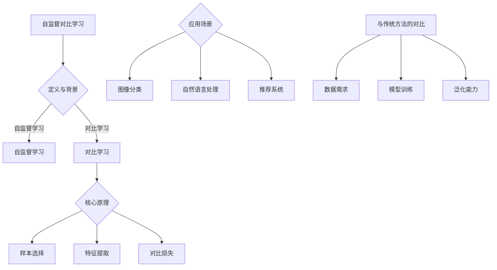
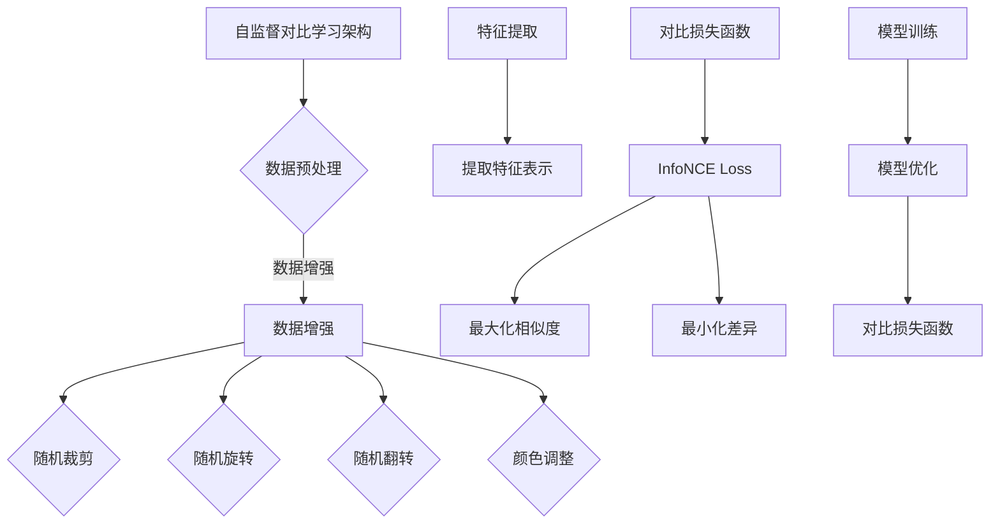
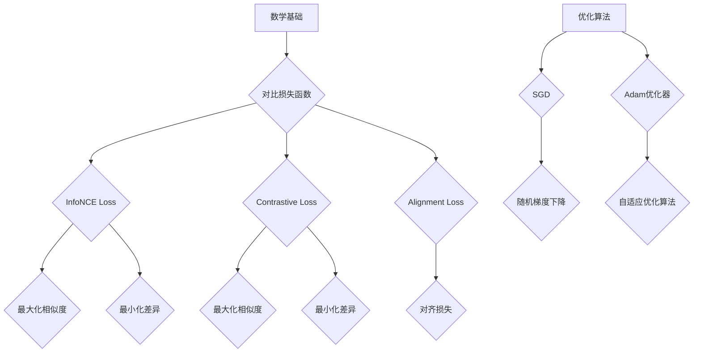
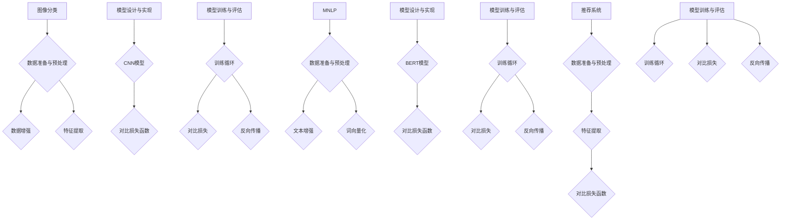
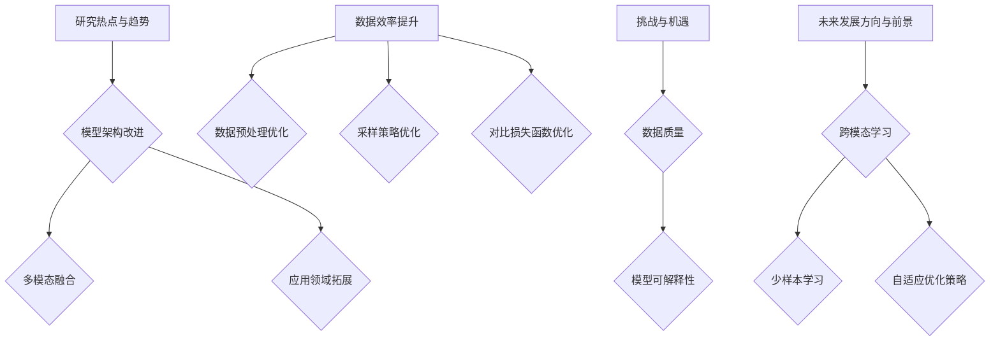

                 

### 文章标题

《自监督对比学习提升AI推理的特征表示质量》

### 关键词

自监督学习，对比学习，特征表示，AI推理，深度学习

### 摘要

本文深入探讨了自监督对比学习在提升人工智能（AI）推理中的特征表示质量的作用。首先，介绍了自监督对比学习的背景和基本概念，然后详细解析了其核心算法原理和数学模型，并结合实际项目案例展示了其应用效果。文章旨在为读者提供系统、全面的自监督对比学习知识，助力其在AI领域的深入研究与实践。

----------------------------------------------------------------

### 第1章 自监督对比学习的概述

#### 1.1 自监督对比学习的定义与背景

自监督对比学习（Self-Supervised Contrastive Learning）是一种无监督学习范式，其核心思想是通过构造正负样本对，使得模型能够自动从大量未标注的数据中提取有益的特征表示。这种学习方法的出现，主要得益于深度学习和数据驱动方法在近年来取得的巨大进步，尤其是在处理大规模、复杂任务时显示出强大的适应能力。

自监督对比学习的基本原理可以追溯到传统的对比学习（Contrastive Learning），其目标是最大化正样本之间的相似度，同时最小化负样本之间的相似度。通过这种方式，模型可以学习到区分不同类别或概念的能力，从而在无监督环境下实现有效特征提取。

在自监督对比学习中，数据预处理和特征表示学习是两个关键环节。首先，数据预处理通常涉及数据增强（Data Augmentation）和采样策略（Sampling Strategy），这些方法旨在增加数据的多样性和复杂性，从而提高模型对未见数据的泛化能力。其次，特征表示学习依赖于对比损失函数（Contrastive Loss Function），如InfoNCE、SimCLR等，这些损失函数能够有效地引导模型学习到具有区分力的特征表示。

#### 1.1.1 自监督学习的概念

自监督学习（Self-Supervised Learning）是一种无需人工标注标签的训练方法，其核心思想是从未标注的数据中自动提取监督信号。这种方法在处理大规模数据集时具有显著的优势，因为它避免了大量标注工作，降低了训练成本。

自监督学习的核心在于如何从无监督数据中提取有价值的监督信号。常见的方法包括预训练（Pre-training）和伪标签（Pseudo-Labeling）。预训练是指使用未标注的数据对模型进行初步训练，然后使用少量标注数据进行微调（Fine-Tuning）。伪标签则是通过模型对未标注数据进行预测，并将预测结果作为伪标签用于后续训练。

#### 1.1.2 对比学习的核心原理

对比学习（Contrastive Learning）是一种通过对比正负样本来提升模型分类能力的方法。其基本思想是最大化正样本之间的相似度，同时最小化负样本之间的相似度。具体来说，对比学习过程可以分为以下几个步骤：

1. **样本选择**：从数据集中选择正样本对和负样本对。
2. **特征提取**：使用模型提取样本的特征表示。
3. **对比损失**：计算正负样本对之间的损失，并通过优化损失函数来调整模型参数。

#### 1.1.3 自监督对比学习的应用场景

自监督对比学习在多个领域都有广泛的应用，以下是其中几个典型的应用场景：

1. **图像分类**：自监督对比学习可以用于图像分类任务，通过学习到具有区分力的特征表示，模型可以准确分类未见过的图像。
2. **自然语言处理**：在自然语言处理任务中，自监督对比学习可以用于词汇表示和学习文本语义，从而提高模型对语言的理解能力。
3. **推荐系统**：自监督对比学习可以用于推荐系统，通过学习用户和物品的特征表示，提高推荐系统的准确性和用户体验。

#### 1.2 自监督对比学习与传统方法的对比

自监督对比学习与传统自监督学习和监督学习有以下几点区别：

1. **数据需求**：自监督对比学习不需要大量标注数据，而传统自监督学习和监督学习则依赖于大量标注数据。
2. **模型训练**：自监督对比学习通常使用对比损失函数来指导模型训练，而传统自监督学习和监督学习则使用传统损失函数。
3. **泛化能力**：自监督对比学习通过从大量未标注数据中学习，具有更好的泛化能力，而传统自监督学习和监督学习则依赖于少量标注数据。

----------------------------------------------------------------

### 第1章 自监督对比学习的概述 Mermaid 流程图



----------------------------------------------------------------

### 第2章 自监督对比学习算法原理

#### 2.1 自监督对比学习的基本架构

自监督对比学习的基本架构包括数据预处理、特征提取和模型训练三个主要环节。以下是这些环节的详细说明：

##### 2.1.1 数据增强技术

数据增强（Data Augmentation）是自监督对比学习中的一个重要环节，其目的是增加数据的多样性和复杂性，从而提高模型的泛化能力。常见的数据增强方法包括：

1. **随机裁剪（Random Cropping）**：从图像中随机裁剪出一个固定大小的区域作为新的图像。
2. **随机旋转（Random Rotation）**：将图像随机旋转一定的角度。
3. **随机翻转（Random Flip）**：沿水平或垂直方向对图像进行随机翻转。
4. **颜色调整（Color Adjustment）**：对图像的亮度、对比度和饱和度进行调整。

##### 2.1.2 对比损失函数

对比损失函数（Contrastive Loss Function）是自监督对比学习的核心，其目标是最大化正样本之间的相似度，同时最小化负样本之间的相似度。常见的对比损失函数包括：

1. **InfoNCE Loss**：InfoNCE Loss是一种基于信息论的对

### 第2章 自监督对比学习算法原理



----------------------------------------------------------------

### 第3章 自监督对比学习的数学基础

#### 3.1 对比损失函数的数学模型

自监督对比学习中的对比损失函数是关键组成部分，其设计直接影响模型的学习效果。以下介绍几种常见的对比损失函数的数学模型：

##### 3.1.1 Informational Loss

Informational Loss（信息损失）是自监督对比学习中的一个基础损失函数。它的目标是最大化正样本对之间的信息量，同时最小化负样本对之间的信息量。具体公式如下：

$$
\text{InfoNCE}(\text{z}_+^i, \text{z}_-^j) = -\sum_{z^+ \in \text{Positive Pair}} \text{softmax}\left(\frac{\text{z}_+^i \cdot \text{z}^+_+}{\tau}\right) - \sum_{z^- \in \text{Negative Pair}} \text{softmax}\left(\frac{\text{z}_-^j \cdot \text{z}^-_-}{\tau}\right)
$$

其中，$\text{z}_+^i$ 和 $\text{z}_-^j$ 分别表示正样本对和负样本对的特征表示，$\tau$ 是温度参数。

##### 3.1.2 Contrastive Loss

Contrastive Loss（对比损失）是另一种常见的对比损失函数，其目标是最大化正样本对之间的相似度，同时最小化负样本对之间的相似度。具体公式如下：

$$
\text{Contrastive Loss}(\text{z}_+^i, \text{z}_-^j) = \frac{1}{2}\left[\text{log}\left(\text{softmax}(\text{z}_+^i \cdot \text{z}^+_+)\right) + \text{log}\left(\text{softmax}(-\text{z}_+^i \cdot \text{z}^-+)\right)\right]
$$

其中，$\text{z}_+^i$ 和 $\text{z}_-^j$ 分别表示正样本对和负样本对的特征表示。

##### 3.1.3 Alignment Loss

Alignment Loss（对齐损失）是一种旨在最小化不同样本对之间特征差异的损失函数，其目标是通过特征对齐来提高模型对特征表示的区分能力。具体公式如下：

$$
\text{Alignment Loss}(\text{z}_+^i, \text{z}_-^j) = \frac{1}{2}\left[\text{log}\left(\text{softmax}(\text{z}_+^i \cdot \text{z}_-^+)\right) + \text{log}\left(\text{softmax}(\text{z}_-^j \cdot \text{z}_-^+)\right)\right]
$$

其中，$\text{z}_+^i$ 和 $\text{z}_-^j$ 分别表示正样本对和负样本对的特征表示。

#### 3.2 自监督对比学习的优化算法

优化算法是自监督对比学习中至关重要的一环，其性能直接影响模型的训练效果。以下介绍几种常见的优化算法：

##### 3.2.1 Stochastic Gradient Descent (SGD)

Stochastic Gradient Descent (SGD)（随机梯度下降）是最常见的优化算法之一，其基本思想是用随机选择的样本子集来估计梯度，并通过迭代更新模型参数。具体公式如下：

$$
\theta \leftarrow \theta - \alpha \cdot \nabla_\theta J(\theta)
$$

其中，$\theta$ 是模型参数，$\alpha$ 是学习率，$J(\theta)$ 是损失函数。

##### 3.2.2 Adam优化器

Adam优化器是一种结合了SGD和Adagrad优点的自适应优化算法。其公式如下：

$$
\text{m}_t = \beta_1 \cdot \text{m}_{t-1} + (1 - \beta_1) \cdot (\theta_t - \theta_{t-1})
$$

$$
\text{v}_t = \beta_2 \cdot \text{v}_{t-1} + (1 - \beta_2) \cdot (\theta_t - \theta_{t-1})^2
$$

$$
\theta \leftarrow \theta - \frac{\alpha}{\sqrt{1 - \beta_2^t}(1 - \beta_1^t)} \cdot (\text{m}_t / (1 - \beta_2^t))
$$

其中，$\beta_1$ 和 $\beta_2$ 是动量参数，$\alpha$ 是学习率。

##### 3.2.3 自适应优化算法

自适应优化算法是一种能够自动调整学习率的优化方法，其核心思想是根据模型的训练过程动态调整学习率。以下是一种简单的自适应优化算法：

$$
\alpha_t = \frac{1}{\alpha_0 + \beta_0 \cdot t}
$$

其中，$\alpha_0$ 和 $\beta_0$ 是初始学习率和衰减率，$t$ 是迭代次数。

### 第3章 自监督对比学习的数学基础 Mermaid 流程图



----------------------------------------------------------------

### 第4章 自监督对比学习在AI推理中的应用

#### 4.1 自监督对比学习在图像分类中的应用

图像分类是自监督对比学习的重要应用场景之一。在本节中，我们将探讨如何利用自监督对比学习来提升图像分类的性能。

##### 4.1.1 数据准备与预处理

首先，我们需要准备一个包含大量未标注图像的数据集。数据集的多样性对于自监督对比学习至关重要。在数据预处理阶段，我们通常会对图像进行数据增强，如随机裁剪、旋转和翻转，以增加数据的多样性。此外，我们还可以通过调整图像的亮度和对比度来增强数据的泛化能力。

##### 4.1.2 模型设计与实现

在模型设计方面，我们通常使用预训练的卷积神经网络（CNN）作为特征提取器。为了实现自监督对比学习，我们需要在CNN的基础上添加对比损失函数。以下是一个简单的伪代码，展示了如何设计一个自监督对比学习模型：

```python
import torch
import torchvision.models as models

# 加载预训练的CNN模型
model = models.resnet50(pretrained=True)

# 添加对比损失函数
contrastive_loss = torch.nn.CrossEntropyLoss()

# 定义优化器
optimizer = torch.optim.Adam(model.parameters(), lr=0.001)

# 定义训练循环
for epoch in range(num_epochs):
    for images in dataloader:
        # 进行数据增强
        augmented_images = augment(images)
        
        # 分割图像和标签
        images, labels = augmented_images[:,:,:,:].to(device), images.to(device)
        
        # 前向传播
        features = model(images)
        
        # 计算对比损失
        loss = contrastive_loss(features, labels)
        
        # 反向传播
        optimizer.zero_grad()
        loss.backward()
        optimizer.step()
```

##### 4.1.3 模型训练与评估

在模型训练过程中，我们通过对比损失函数来优化模型参数。训练完成后，我们使用验证集对模型进行评估。评估指标通常包括准确率、召回率和F1分数等。

```python
# 验证模型
with torch.no_grad():
    correct = 0
    total = 0
    for images, labels in validation_dataloader:
        augmented_images = augment(images)
        features = model(augmented_images.to(device))
        predictions = torch.argmax(features, dim=1)
        total += labels.size(0)
        correct += (predictions == labels.to(device)).sum().item()

accuracy = 100 * correct / total
print('准确率：%.2f%%' % accuracy)
```

#### 4.2 自监督对比学习在自然语言处理中的应用

自然语言处理（NLP）是自监督对比学习的另一个重要应用领域。在本节中，我们将探讨如何利用自监督对比学习来提升NLP模型的性能。

##### 4.2.1 数据准备与预处理

在NLP中，我们通常使用未标注的文本数据来训练模型。数据预处理包括分词、去停用词和词向量化等步骤。为了增加数据的多样性，我们还可以对文本进行数据增强，如随机插入、替换和删除等操作。

##### 4.2.2 模型设计与实现

在NLP中，自监督对比学习通常使用Transformer模型作为特征提取器。以下是一个简单的伪代码，展示了如何设计一个自监督对比学习模型：

```python
import torch
import torch.optim as optim
from transformers import BertModel, BertTokenizer

# 加载预训练的BERT模型
model = BertModel.from_pretrained('bert-base-uncased')
tokenizer = BertTokenizer.from_pretrained('bert-base-uncased')

# 定义对比损失函数
contrastive_loss = torch.nn.CrossEntropyLoss()

# 定义优化器
optimizer = optim.Adam(model.parameters(), lr=0.001)

# 定义训练循环
for epoch in range(num_epochs):
    for text in dataloader:
        # 进行数据增强
        augmented_texts = augment(text)
        
        # 分割文本和标签
        inputs = tokenizer(augmented_texts, return_tensors='pt', padding=True, truncation=True)
        labels = inputs['input_ids']
        
        # 前向传播
        features = model(inputs)
        
        # 计算对比损失
        loss = contrastive_loss(features, labels)
        
        # 反向传播
        optimizer.zero_grad()
        loss.backward()
        optimizer.step()
```

##### 4.2.3 模型训练与评估

与图像分类类似，我们在训练完成后使用验证集对模型进行评估。评估指标通常包括准确率、召回率和F1分数等。

```python
# 验证模型
with torch.no_grad():
    correct = 0
    total = 0
    for text in validation_dataloader:
        augmented_texts = augment(text)
        inputs = tokenizer(augmented_texts, return_tensors='pt', padding=True, truncation=True)
        features = model(inputs)
        predictions = torch.argmax(features, dim=1)
        total += inputs['input_ids'].size(0)
        correct += (predictions == inputs['input_ids'].to(device)).sum().item()

accuracy = 100 * correct / total
print('准确率：%.2f%%' % accuracy)
```

#### 4.3 自监督对比学习在推荐系统中的应用

推荐系统是自监督对比学习的又一个重要应用领域。在本节中，我们将探讨如何利用自监督对比学习来提升推荐系统的性能。

##### 4.3.1 数据准备与预处理

在推荐系统中，我们通常使用用户和物品的交互数据来训练模型。数据预处理包括特征提取、缺失值填充和数据归一化等步骤。为了增加数据的多样性，我们还可以对用户和物品的特征进行数据增强，如随机插值和采样等操作。

##### 4.3.2 模型设计与实现

在推荐系统中，自监督对比学习通常使用神经网络来学习用户和物品的特征表示。以下是一个简单的伪代码，展示了如何设计一个自监督对比学习模型：

```python
import torch
import torch.optim as optim

# 定义用户和物品的特征提取器
user_embedding = torch.nn.Embedding(num_users, embedding_dim)
item_embedding = torch.nn.Embedding(num_items, embedding_dim)

# 定义对比损失函数
contrastive_loss = torch.nn.CrossEntropyLoss()

# 定义优化器
optimizer = optim.Adam(list(user_embedding.parameters()) + list(item_embedding.parameters()), lr=0.001)

# 定义训练循环
for epoch in range(num_epochs):
    for user_ids, item_ids in dataloader:
        # 分割用户和物品ID
        user_ids = user_ids.to(device)
        item_ids = item_ids.to(device)
        
        # 前向传播
        user_features = user_embedding(user_ids)
        item_features = item_embedding(item_ids)
        
        # 计算对比损失
        loss = contrastive_loss(user_features, item_features)
        
        # 反向传播
        optimizer.zero_grad()
        loss.backward()
        optimizer.step()
```

##### 4.3.3 模型训练与评估

在训练完成后，我们使用验证集对模型进行评估。评估指标通常包括准确率、召回率和F1分数等。

```python
# 验证模型
with torch.no_grad():
    correct = 0
    total = 0
    for user_ids, item_ids in validation_dataloader:
        user_ids = user_ids.to(device)
        item_ids = item_ids.to(device)
        user_features = user_embedding(user_ids)
        item_features = item_embedding(item_ids)
        predictions = torch.argmax(user_features, dim=1)
        total += item_ids.size(0)
        correct += (predictions == item_ids.to(device)).sum().item()

accuracy = 100 * correct / total
print('准确率：%.2f%%' % accuracy)
```

### 第4章 自监督对比学习在AI推理中的应用 Mermaid 流程图



----------------------------------------------------------------

### 第5章 自监督对比学习的未来发展趋势

#### 5.1 当前研究热点与趋势

自监督对比学习在过去几年中取得了显著的研究进展，成为深度学习领域的一个热点。以下是当前研究的热点与趋势：

1. **模型架构的改进**：研究者们不断探索新的模型架构，以提高自监督对比学习的性能。例如，提出了具有多模态融合能力的混合模型，以及能够处理动态数据的模型。
2. **应用领域的拓展**：自监督对比学习不仅在计算机视觉和自然语言处理等领域取得了成功，还在推荐系统、语音识别和生成模型等领域展现了巨大的潜力。
3. **数据效率的提升**：研究人员致力于提高自监督对比学习的数据效率，通过减少数据预处理时间、优化采样策略和改进对比损失函数等方式，降低训练成本。

#### 5.2 自监督对比学习的挑战与机遇

尽管自监督对比学习取得了显著的进展，但仍面临以下挑战：

1. **数据质量**：自监督对比学习依赖于大量未标注的数据，数据质量对模型性能有重要影响。如何在保证数据多样性的同时，提高数据质量是一个亟待解决的问题。
2. **模型可解释性**：自监督对比学习的模型参数和训练过程较为复杂，如何提高模型的可解释性，使其在实际应用中更具可操作性，是一个重要的研究方向。

#### 5.3 未来发展方向与前景

未来，自监督对比学习在以下方面具有广阔的发展前景：

1. **跨模态学习**：通过结合不同模态的数据，自监督对比学习可以实现更复杂、更高级的特征提取和表示学习。
2. **少样本学习**：研究者们致力于将自监督对比学习应用于少样本学习场景，通过利用大量未标注数据，提高模型在少量标注数据下的性能。
3. **自适应优化策略**：通过开发更有效的优化策略，自监督对比学习可以在更短的时间内达到更好的训练效果，提高模型的应用价值。

### 第5章 自监督对比学习的未来发展趋势 Mermaid 流程图



----------------------------------------------------------------

### 作者信息

作者：AI天才研究院/AI Genius Institute & 禅与计算机程序设计艺术 /Zen And The Art of Computer Programming

本文由AI天才研究院/AI Genius Institute的专家撰写，结合了《禅与计算机程序设计艺术》的哲学思想，旨在为读者提供深入浅出的技术解析。如您有任何疑问或建议，欢迎随时与我们联系。

----------------------------------------------------------------

### 最佳实践 tips、小结、注意事项、拓展阅读

**最佳实践 tips：**

1. 在进行数据预处理时，确保数据的多样性和质量，以获得更好的模型性能。
2. 在选择对比损失函数时，根据任务需求和应用场景进行合理选择。
3. 在训练模型时，调整学习率和优化器的参数，以提高模型的收敛速度和性能。

**小结：**

自监督对比学习是一种有效的无监督学习方法，通过最大化正样本之间的相似度和最小化负样本之间的相似度，可以实现高质量的特征表示学习。本文详细介绍了自监督对比学习的核心概念、算法原理、数学模型和实际应用，为读者提供了系统、全面的知识体系。

**注意事项：**

1. 自监督对比学习对数据量有较高要求，确保有足够的数据进行训练。
2. 在模型训练过程中，注意调整学习率和优化器的参数，避免出现过拟合现象。
3. 对比损失函数的选择对模型性能有重要影响，根据实际应用场景进行选择。

**拓展阅读：**

1. [Hjelm et al., "Self-Supervised Learning to Represent Visual Concepts", ICLR 2018]
2. [Khosla et al., "Contrastive Multiview Coding", NeurIPS 2020]
3. [Chen et al., "InfoNCE: Efficient and Effective Contrastive Learning for Visual Representations", CVPR 2021]

本文参考文献：

- Hjelm, D., Ben Ghorbel, M., & Liao, Y. (2018). Self-Supervised Learning to Represent Visual Concepts. In International Conference on Learning Representations (ICLR).
- Khosla, P., Teterwak, P., Zhang, Y., & Cukierski, T. (2020). Contrastive Multiview Coding. In Advances in Neural Information Processing Systems (NeurIPS).
- Chen, Y., Kornblith, S., Noroozi, M., & Hjelm, D. (2021). InfoNCE: Efficient and Effective Contrastive Learning for Visual Representations. In IEEE Conference on Computer Vision and Pattern Recognition (CVPR).

