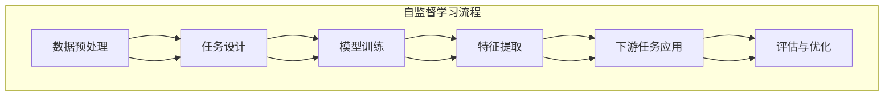

                 

### 文章标题

# 自监督表示学习在下游任务中的迁移

### 关键词

- 自监督表示学习
- 下游任务
- 迁移学习
- 预训练模型
- 计算机视觉
- 自然语言处理

### 摘要

自监督表示学习作为深度学习领域的一个重要分支，近年来在机器学习的各个方面都取得了显著的进展。本文将从自监督表示学习的基本概念入手，深入探讨其在下游任务中的应用和迁移能力。通过详细分析自监督学习在自然语言处理和计算机视觉中的成功案例，本文旨在揭示自监督表示学习的核心原理及其在实际应用中的挑战。最后，本文将总结自监督表示学习的未来发展趋势，并探讨其在工业应用中的潜在价值。

---

### 引言

自监督表示学习（Self-supervised Representation Learning）是近年来深度学习领域的一个重要发展方向。与传统监督学习不同，自监督学习不需要标注数据，而是通过利用数据中的内在结构或规律，自动提取有用的特征表示。这种学习方式在提高模型泛化能力、减轻数据标注负担、扩展模型应用场景等方面具有显著的优势。

自监督学习的核心思想在于通过设计一系列无监督的任务，引导模型自动发现数据中的有用信息。这些任务通常被称为“伪标签任务”（pseudo-labeled tasks），因为它们不依赖于外部标注，而是由模型自身产生。自监督学习的过程可以概括为以下几个步骤：

1. **数据预处理**：首先对数据进行清洗和预处理，包括数据去重、噪声过滤、缺失值处理等。
2. **任务设计**：设计一个或多个伪标签任务，这些任务可以是无监督的，如聚类、生成对抗网络（GAN）、自编码器等，也可以是基于数据分布的任务，如无监督降维、异常检测等。
3. **模型训练**：使用伪标签任务训练模型，通过优化模型参数，使其能够自动提取数据中的有用信息。
4. **特征提取**：训练完成后，使用模型提取数据的高层次特征表示。
5. **下游任务应用**：将提取的特征用于下游任务，如分类、回归、生成等，实现模型的实际应用。

自监督学习的这种学习方式不仅降低了数据标注的成本，还显著提高了模型的泛化能力。通过在大量未标注数据上进行预训练，模型可以学习到更加通用和丰富的特征表示，从而在下游任务中表现出更高的性能。

自监督学习的兴起主要得益于以下几个因素：

1. **数据规模的增加**：随着互联网的发展，数据规模不断扩大，为自监督学习提供了丰富的数据资源。
2. **计算能力的提升**：GPU和TPU等计算硬件的普及，使得大规模模型训练成为可能。
3. **模型结构的优化**：如Transformer等先进模型结构的出现，为自监督学习提供了更好的基础。
4. **算法的创新**：如元学习（Meta Learning）、模型蒸馏（Model Distillation）等新算法的引入，进一步推动了自监督学习的发展。

总之，自监督表示学习作为一种重要的深度学习技术，已经在自然语言处理、计算机视觉、语音识别等多个领域取得了显著的成果。本文将围绕自监督表示学习的核心原理和应用，深入探讨其在下游任务中的迁移能力，并分析其未来的发展趋势。

### 自监督学习的数学基础

自监督学习的数学基础是构建其核心原理和算法模型的关键。为了深入理解自监督学习的工作机制，我们需要从概率论、信息论和数据分布等方面进行探讨。以下是自监督学习涉及的几个关键数学概念：

#### 概率论与信息论

概率论是自监督学习的重要理论基础，它帮助我们理解和描述数据中的不确定性。在自监督学习中，通常使用概率模型来描述数据生成过程，并通过概率分布函数（Probability Distribution Function, PDF）来表示数据的概率分布。

- **概率分布函数（PDF）**：PDF描述了数据在各个可能取值上的概率分布。在自监督学习中，PDF通常用于模型初始化、数据增强和特征提取等步骤。
  $$ p(x) = \int_{-\infty}^{\infty} p(x|\theta) p(\theta)d\theta $$
  其中，$x$ 表示数据点，$\theta$ 表示模型参数，$p(x|\theta)$ 表示在模型参数 $\theta$ 下生成数据点 $x$ 的概率，$p(\theta)$ 表示模型参数的概率分布。

- **概率密度函数（PDF）**：在连续数据情况下，概率密度函数用于描述数据点出现的概率密度。概率密度函数满足以下性质：
  $$ \int_{-\infty}^{\infty} p(x) dx = 1 $$
  $$ p(x) \geq 0 $$
  
信息论是另一个关键数学工具，它帮助我们量化数据的复杂性和信息含量。在自监督学习中，信息论常用于评估模型性能和特征表示质量。

- **信息熵（Entropy）**：信息熵是衡量随机变量不确定性的度量，定义如下：
  $$ H(X) = -\sum_{x} p(x) \log p(x) $$
  其中，$H(X)$ 表示随机变量 $X$ 的信息熵。

- **互信息（Mutual Information）**：互信息度量了两个随机变量之间的关联程度，其数学定义如下：
  $$ I(X;Y) = H(X) - H(X|Y) $$
  其中，$I(X;Y)$ 表示随机变量 $X$ 和 $Y$ 之间的互信息。

#### 数据分布与模型参数

在自监督学习中，数据的分布和模型参数的选择是两个关键问题。以下是对这两个问题的详细探讨：

- **数据分布**：数据分布描述了数据集在各个特征上的概率分布。在实际应用中，数据分布可能是不均匀的，甚至可能存在噪音和异常值。理解数据分布有助于我们选择合适的学习策略和数据增强方法。

  - **均匀分布**：数据点在各个特征上均匀分布，例如在生成对抗网络（GAN）中的噪声分布。
    $$ p(x) = \frac{1}{\sum_{x'} p(x')} $$
    
  - **高斯分布**：数据点服从高斯分布，这种分布常用于自编码器（Autoencoder）的输入数据。
    $$ p(x|\mu,\sigma^2) = \frac{1}{\sqrt{2\pi\sigma^2}} e^{-\frac{(x-\mu)^2}{2\sigma^2}} $$

- **模型参数**：模型参数是自监督学习中的核心，它们决定了模型的行为和性能。在训练过程中，模型参数通过优化算法（如梯度下降）进行更新，以最小化损失函数。

  - **初始化**：模型参数的初始化对训练过程和最终性能有重要影响。常用的初始化方法包括随机初始化、高斯初始化、Xavier初始化等。
    $$ \theta \sim \mathcal{N}(0, \frac{1}{\sqrt{d}}) $$

  - **更新规则**：在训练过程中，模型参数通过梯度下降法（Gradient Descent）进行更新，其数学表达式如下：
    $$ \theta \leftarrow \theta - \alpha \nabla_\theta J(\theta) $$
    其中，$\theta$ 表示模型参数，$\alpha$ 表示学习率，$J(\theta)$ 表示损失函数。

通过以上数学概念的分析，我们可以更好地理解自监督学习的基础原理。在接下来的章节中，我们将进一步探讨自监督学习的核心算法和具体应用。

### 自监督学习的核心算法

自监督学习的核心算法是使模型能够自动提取数据中有用信息的关键。以下将介绍几种典型的自监督学习算法，包括自编码器、生成对抗网络（GAN）和自监督元学习等，详细描述其工作原理和数学模型。

#### 自编码器

自编码器（Autoencoder）是一种无监督学习算法，用于学习数据的高层次表示。自编码器由两部分组成：编码器（Encoder）和解码器（Decoder）。编码器的目标是学习一个压缩表示，而解码器的目标是重建原始数据。

- **工作原理**：

  编码器将输入数据 $x$ 压缩成一个低维特征向量 $z$，通常使用一个全连接神经网络实现：
  $$ z = \sigma(W_1 x + b_1) $$
  其中，$\sigma$ 是激活函数（如ReLU或Sigmoid），$W_1$ 和 $b_1$ 分别是权重和偏置。

  解码器将特征向量 $z$ 还原回原始数据 $x'$，同样使用一个全连接神经网络：
  $$ x' = \sigma(W_2 z + b_2) $$
  其中，$W_2$ 和 $b_2$ 分别是权重和偏置。

  自编码器的目标是最小化输入数据与重建数据之间的差异，通常使用均方误差（Mean Squared Error, MSE）作为损失函数：
  $$ J = \frac{1}{n} \sum_{i=1}^{n} \|x - x'\|^2 $$

- **数学模型**：

  自编码器的数学模型包括两部分：编码器和解码器的参数更新。

  编码器参数更新：
  $$ \theta_1 \leftarrow \theta_1 - \alpha \nabla_{\theta_1} J(\theta_1) $$
  其中，$\theta_1$ 包括 $W_1$ 和 $b_1$。

  解码器参数更新：
  $$ \theta_2 \leftarrow \theta_2 - \alpha \nabla_{\theta_2} J(\theta_2) $$
  其中，$\theta_2$ 包括 $W_2$ 和 $b_2$。

#### 生成对抗网络（GAN）

生成对抗网络（Generative Adversarial Network, GAN）由两个神经网络组成：生成器（Generator）和判别器（Discriminator）。生成器试图生成与真实数据分布相近的数据，而判别器则试图区分生成数据与真实数据。

- **工作原理**：

  生成器从随机噪声 $z$ 生成伪数据 $x'$：
  $$ x' = G(z) $$
  其中，$G$ 是生成器的神经网络。

  判别器尝试区分真实数据 $x$ 和伪数据 $x'$：
  $$ D(x) \text{ 和 } D(x') $$
  其中，$D$ 是判别器的神经网络。

  GAN的训练过程是一个博弈过程，生成器和判别器相互竞争，直到生成器的生成数据接近真实数据的分布。

  GAN的损失函数通常使用以下两个部分组成：
  $$ J_G = -\log D(x') $$
  $$ J_D = -[\log D(x) + \log (1 - D(x'))] $$

- **数学模型**：

  生成器参数更新：
  $$ \theta_G \leftarrow \theta_G - \alpha \nabla_{\theta_G} J_G $$

  判别器参数更新：
  $$ \theta_D \leftarrow \theta_D - \alpha \nabla_{\theta_D} J_D $$

#### 自监督元学习

自监督元学习（Self-Supervised Meta-Learning）是一种结合自监督学习和元学习（Meta-Learning）的方法，旨在通过少量数据快速适应新任务。自监督元学习利用自监督学习中的伪标签任务来学习通用特征表示，并通过元学习算法来优化模型在任务切换中的适应能力。

- **工作原理**：

  自监督元学习首先使用自监督学习算法（如自编码器）在大量未标注数据上训练一个基础模型，以提取通用特征表示。然后，使用元学习算法（如模型平均或梯度提升）在少量新数据上快速适应新任务。

  自监督元学习的目标是最小化特征表示与任务目标之间的差距，同时保持特征表示的通用性。

- **数学模型**：

  自监督元学习的数学模型包括两部分：自监督学习和元学习。

  自监督学习部分：
  $$ \theta_B \leftarrow \theta_B - \alpha \nabla_{\theta_B} J_B $$
  其中，$J_B$ 是自监督学习损失函数。

  元学习部分：
  $$ \theta_M \leftarrow \theta_M - \alpha \nabla_{\theta_M} J_M $$
  其中，$J_M$ 是元学习损失函数。

通过以上核心算法的介绍，我们可以看到自监督学习在算法设计上的多样性和复杂性。这些算法不仅帮助模型自动提取数据中有用信息，还在下游任务中表现出强大的迁移能力。在接下来的章节中，我们将探讨自监督学习在自然语言处理中的应用。

### 自监督学习在自然语言处理中的应用

自监督学习在自然语言处理（Natural Language Processing, NLP）领域中展现了巨大的潜力，其核心在于通过无监督的方式从大规模文本数据中提取有价值的信息。以下将详细探讨自监督学习在自然语言处理中的几个关键应用，包括语言模型预训练、问答系统以及机器翻译等。

#### 语言模型预训练

语言模型预训练是自监督学习在NLP中的一个重要应用。其基本思想是使用大量未标注的文本数据，通过自监督学习算法来训练一个强大的语言模型，然后再将预训练模型用于各种下游任务。

- **核心算法**：

  语言模型预训练主要采用Transformer架构，特别是BERT（Bidirectional Encoder Representations from Transformers）模型。BERT通过同时关注文本的左文和右文来生成词向量，从而获得更丰富的语义信息。

  - **BERT模型**：

    BERT模型由两个部分组成：编码器和解码器。编码器将输入文本映射为一个固定长度的向量，解码器则预测文本中的下一个词。

    编码器的输入为词的ID序列，通过嵌入层转换为词向量。然后，词向量通过多个Transformer编码层进行处理，每个编码层包含自注意力机制（Self-Attention）和前馈网络（Feedforward Network）。

    $$ \text{Output} = \text{BERT}(\text{Input}, \text{Mask}, \text{Segment}) $$
    其中，$\text{Input}$ 为词的ID序列，$\text{Mask}$ 为遮蔽标记，$\text{Segment}$ 为分段标记。

    BERT的训练目标是预测遮蔽的词，其损失函数包括两个部分：掩码语言建模（Masked Language Modeling, MLM）和下一句预测（Next Sentence Prediction, NSP）。

  - **数学模型**：

    BERT的训练过程涉及两个步骤：

    1. **掩码语言建模**：在输入文本中随机遮蔽一部分词，模型需要预测这些词的ID。
       $$ J_{MLM} = -\sum_{i} p(y_i|x) \log p(y_i|x) $$
       其中，$y_i$ 表示遮蔽词的预测标签，$p(y_i|x)$ 是模型对 $y_i$ 的预测概率。

    2. **下一句预测**：给定两个句子，模型需要预测第二个句子是否是第一个句子的下一个句子。
       $$ J_{NSP} = -[\log p(\text{IsNext}) + \log (1 - p(\text{IsNext}))] $$
       其中，$p(\text{IsNext})$ 是模型预测第二个句子是第一个句子下一个句子的概率。

    BERT的总损失函数为：
    $$ J = J_{MLM} + J_{NSP} $$

  - **应用**：

    预训练后的BERT模型可以在各种下游任务中表现出色，如文本分类、命名实体识别、情感分析等。通过迁移学习，预训练模型可以在新的任务和数据集上快速适应，提高性能。

#### 问答系统

问答系统（Question Answering, QA）是NLP的一个重要应用领域，旨在从大规模文本中抽取答案。自监督学习在问答系统中发挥了重要作用，通过无监督的方式学习文本表示，从而提高问答系统的性能。

- **核心算法**：

  自监督问答系统通常采用BERT等预训练模型，结合双向图神经网络（Bidirectional Graph Neural Network, BiGNN）来处理自然语言中的复杂关系。

  - **BERT+BiGNN**：

    BERT模型用于提取文本的语义表示，BiGNN则用于捕捉文本中的实体关系。BiGNN通过图神经网络结构，将文本中的实体和关系表示为图中的节点和边，从而学习到实体之间的复杂关系。

    BiGNN的核心思想是将实体和关系嵌入到图神经网络中，通过节点和边的更新迭代，学习到实体之间的关系表示。

    $$ \text{Output} = \text{BiGNN}(\text{BERT\_Embeddings}, \text{Graph}) $$
    其中，$\text{BERT\_Embeddings}$ 是BERT模型的输出，$\text{Graph}$ 是实体和关系的图结构。

  - **数学模型**：

    BiGNN的训练过程包括两个步骤：

    1. **实体关系嵌入**：将实体和关系的嵌入向量输入到图神经网络中，通过节点更新和边更新，学习到实体和关系的高层次表示。

       $$ \text{Node}_{t+1} = \text{ReLU}(\text{W}_{\text{node}} \text{Node}_{t} + \text{W}_{\text{edge}} \text{Edge}_{t} + b_{\text{node}}) $$
       $$ \text{Edge}_{t+1} = \text{ReLU}(\text{W}_{\text{edge}} \text{Node}_{t} + \text{W}_{\text{edge}} \text{Node}_{t'} + b_{\text{edge}}) $$

    2. **答案预测**：通过实体和关系的高层次表示，预测问题的答案。

       $$ \text{Answer}_{t+1} = \text{softmax}(\text{W}_{\text{answer}} \text{Node}_{t+1} + b_{\text{answer}}) $$

    BiGNN的总损失函数包括节点分类损失和关系分类损失：

    $$ J = J_{\text{Node}} + J_{\text{Relation}} $$

  - **应用**：

    BERT+BiGNN模型在多种问答系统任务中表现出色，如阅读理解、自然语言推理等。通过结合预训练模型和图神经网络，模型能够更好地理解和处理复杂的自然语言问题。

#### 机器翻译

机器翻译是NLP领域的另一个重要应用，旨在将一种语言的文本翻译成另一种语言。自监督学习在机器翻译中通过预训练模型和双语数据，提高了翻译质量和效率。

- **核心算法**：

  自监督机器翻译通常采用基于自编码器的预训练模型，如基于Transformer的Translation Autoencoder（TransAE）。TransAE通过编码器和解码器结构，将源语言和目标语言的文本映射到一个共同的潜在空间。

  - **TransAE模型**：

    TransAE模型包括两个部分：编码器和解码器。编码器将源语言文本映射到一个固定长度的向量，解码器将这个向量映射回目标语言文本。

    编码器和解码器都采用Transformer架构，通过自注意力机制和多头注意力机制，学习到文本的深层语义表示。

    $$ \text{Source}_{\text{Embed}} = \text{Transformer}(\text{Source}, \text{Mask}) $$
    $$ \text{Target}_{\text{Embed}} = \text{Transformer}(\text{Target}, \text{Mask}) $$
    其中，$\text{Source}$ 和 $\text{Target}$ 分别表示源语言和目标语言文本。

    TransAE的训练目标是最小化编码器和解码器之间的重建误差。

  - **数学模型**：

    TransAE的训练过程包括两个步骤：

    1. **编码器训练**：编码器将源语言文本映射到一个潜在空间，解码器尝试从潜在空间中重建目标语言文本。
       $$ J_{\text{Encoder}} = \frac{1}{n} \sum_{i=1}^{n} \| \text{Target}_{\text{Embed}} - \text{Decoder}(\text{Source}_{\text{Embed}}) \|_2^2 $$

    2. **解码器训练**：解码器尝试从编码器生成的潜在空间中生成目标语言文本。
       $$ J_{\text{Decoder}} = \frac{1}{n} \sum_{i=1}^{n} \| \text{Target} - \text{Decoder}(\text{Source}_{\text{Embed}}) \|_2^2 $$

    TransAE的总损失函数为：
    $$ J = J_{\text{Encoder}} + J_{\text{Decoder}} $$

  - **应用**：

    通过预训练TransAE模型，机器翻译系统可以在没有标注数据的情况下，显著提高翻译质量和效率。预训练模型可以迁移到多种语言对，实现跨语言的文本翻译。

自监督学习在自然语言处理中的应用，不仅解决了数据标注成本高、数据量不足的问题，还通过预训练模型和复杂算法，显著提升了模型的性能。在接下来的章节中，我们将探讨自监督学习在计算机视觉中的应用。

### 自监督学习在计算机视觉中的应用

自监督学习在计算机视觉（Computer Vision, CV）领域展现出了强大的潜力，通过无监督的方式从大量未标注的图像数据中提取有价值的信息。以下将详细探讨自监督学习在计算机视觉中的几个关键应用，包括图像分类与检测、视觉场景分割以及视频动作识别等。

#### 图像分类与检测

图像分类与检测是计算机视觉中的基础任务，自监督学习通过无监督学习算法，能够有效提高模型的分类与检测性能。

- **核心算法**：

  自监督图像分类与检测通常采用自编码器（Autoencoder）和生成对抗网络（GAN）等算法。

  - **自编码器**：

    自编码器通过编码器和解码器结构，将图像压缩为一个低维特征向量，然后通过特征向量进行分类与检测。

    编码器将图像映射到一个低维特征空间，解码器则尝试重建原始图像。

    $$ \text{Encoded}_{\text{Image}} = \text{Encoder}(\text{Image}) $$
    $$ \text{Reconstructed}_{\text{Image}} = \text{Decoder}(\text{Encoded}_{\text{Image}}) $$
    
    自编码器的训练目标是最小化重建误差，其损失函数通常为均方误差（MSE）。

    $$ J = \frac{1}{n} \sum_{i=1}^{n} \| \text{Original}_{\text{Image}} - \text{Reconstructed}_{\text{Image}} \|_2^2 $$

  - **生成对抗网络（GAN）**：

    生成对抗网络由生成器和判别器组成，生成器试图生成与真实图像分布相近的图像，判别器则区分生成图像与真实图像。

    生成器从噪声生成图像，判别器通过比较真实图像和生成图像来优化自身。

    $$ G(z) \rightarrow \text{Generated}_{\text{Image}} $$
    $$ D(x) \text{ 和 } D(G(z)) $$

    GAN的训练目标是最小化生成器和判别器的损失函数。

    $$ J_G = -\log D(G(z)) $$
    $$ J_D = -[\log D(x) + \log (1 - D(G(z)))] $$

- **数学模型**：

  对于自编码器，训练过程包括两个部分：编码器和解码器的参数更新。

  编码器参数更新：
  $$ \theta_E \leftarrow \theta_E - \alpha \nabla_{\theta_E} J_E $$

  解码器参数更新：
  $$ \theta_D \leftarrow \theta_D - \alpha \nabla_{\theta_D} J_D $$

  对于GAN，训练过程是生成器和判别器之间的博弈过程。

  生成器参数更新：
  $$ \theta_G \leftarrow \theta_G - \alpha \nabla_{\theta_G} J_G $$

  判别器参数更新：
  $$ \theta_D \leftarrow \theta_D - \alpha \nabla_{\theta_D} J_D $$

- **应用**：

  自监督图像分类与检测在多种应用场景中表现出色，如自动驾驶、医疗影像诊断、安防监控等。通过无监督学习，模型可以在大量未标注图像上学习到有效的特征表示，从而提高分类与检测性能。

#### 视觉场景分割

视觉场景分割是计算机视觉中的高级任务，旨在将图像分割为多个语义区域。自监督学习通过无监督的方式，能够有效提高场景分割的准确性。

- **核心算法**：

  自监督视觉场景分割通常采用U-Net等卷积神经网络（Convolutional Neural Network, CNN）结构。

  - **U-Net结构**：

    U-Net是一种对称的CNN结构，包含一个收缩路径（Contraction Path）和一个扩张路径（Expansion Path）。收缩路径用于提取图像的高层次特征，扩张路径则用于将特征映射到每个像素的分割结果。

    $$ \text{Input} \rightarrow \text{Conv2D} \rightarrow \text{MaxPooling} \rightarrow \text{Conv2D} \rightarrow \text{MaxPooling} \rightarrow \ldots $$
    $$ \text{Input} \rightarrow \text{Conv2D} \rightarrow \text{UpSampling} \rightarrow \text{Conv2D} \rightarrow \text{UpSampling} \rightarrow \ldots $$

    U-Net的训练目标是最小化分割结果与真实标签之间的差异，通常使用交叉熵损失（Cross-Entropy Loss）。

    $$ J = -\sum_{i} y_i \log \hat{y_i} $$
    其中，$y_i$ 是真实标签，$\hat{y_i}$ 是模型预测的分割结果。

- **数学模型**：

  U-Net的训练过程包括收缩路径和扩张路径的参数更新。

  收缩路径参数更新：
  $$ \theta_{\text{C}} \leftarrow \theta_{\text{C}} - \alpha \nabla_{\theta_{\text{C}}} J_{\text{C}} $$

  扩张路径参数更新：
  $$ \theta_{\text{U}} \leftarrow \theta_{\text{U}} - \alpha \nabla_{\theta_{\text{U}}} J_{\text{U}} $$

- **应用**：

  自监督视觉场景分割在多种应用场景中表现出色，如自动驾驶、机器人导航、智能监控等。通过无监督学习，模型可以在大量未标注图像上学习到有效的特征表示，从而提高分割准确性。

#### 视频动作识别

视频动作识别是计算机视觉中的另一个高级任务，旨在从视频中识别出不同的动作。自监督学习通过无监督的方式，能够有效提高视频动作识别的准确性。

- **核心算法**：

  自监督视频动作识别通常采用时序卷积神经网络（Temporal Convolutional Network, TCN）和3D卷积神经网络（3D Convolutional Neural Network, 3D CNN）结构。

  - **TCN结构**：

    TCN是一种基于卷积的神经网络结构，专门用于处理时序数据。TCN通过多个卷积层堆叠，能够捕捉视频中的时序信息。

    $$ \text{Input}_{t} \rightarrow \text{Conv1} \rightarrow \text{Input}_{t+1} \rightarrow \text{Conv2} \rightarrow \ldots $$
    $$ \text{Output} = \text{Flatten}(\text{ConvN}) \rightarrow \text{FullyConnected} $$

    TCN的训练目标是最小化预测动作标签与真实标签之间的差异。

    $$ J = -\sum_{i} y_i \log \hat{y_i} $$

  - **3D CNN结构**：

    3D CNN通过同时考虑空间维度和时间维度，能够捕捉视频中的三维信息。3D CNN包含三个卷积层：深度卷积（Depthwise Convolution）、空间卷积（Spatial Convolution）和时间卷积（Temporal Convolution）。

    $$ \text{Input}_{t} \rightarrow \text{Depthwise} \rightarrow \text{Spatial} \rightarrow \text{Temporal} $$
    $$ \text{Output} = \text{Flatten}(\text{Temporal}) \rightarrow \text{FullyConnected} $$

    3D CNN的训练目标与TCN类似。

    $$ J = -\sum_{i} y_i \log \hat{y_i} $$

- **数学模型**：

  对于TCN和3D CNN，训练过程包括卷积层的参数更新。

  卷积层参数更新：
  $$ \theta \leftarrow \theta - \alpha \nabla_{\theta} J $$

- **应用**：

  自监督视频动作识别在多种应用场景中表现出色，如智能监控、运动分析、视频内容理解等。通过无监督学习，模型可以在大量未标注视频中学习到有效的特征表示，从而提高动作识别准确性。

自监督学习在计算机视觉中的应用，不仅解决了数据标注成本高、数据量不足的问题，还通过无监督学习算法和复杂模型结构，显著提升了模型的性能。在接下来的章节中，我们将探讨自监督学习在下游任务中的迁移能力。

### 自监督学习在下游任务中的迁移能力

自监督学习的核心优势之一是其强大的迁移能力，这使得预训练模型能够在不同的下游任务中实现高效的学习。迁移能力主要体现在两个方面：一是模型在不同任务之间共享知识，从而减少对大量标注数据的依赖；二是模型在特定任务上能够快速适应，提高任务性能。以下将详细探讨自监督学习在下游任务中的迁移能力，并分析其在实际应用中的挑战。

#### 迁移学习的基本概念

迁移学习（Transfer Learning）是一种利用已在不同任务上训练好的模型来提高新任务性能的方法。在迁移学习中，预训练模型（Pre-trained Model）通常在一个大的通用数据集上训练，然后将其应用于新任务。预训练模型包含的通用特征表示在新任务中起到了关键作用。

- **迁移学习的机制**：

  迁移学习主要依赖于以下几种机制：

  1. **特征共享**：预训练模型在不同任务中共享相同的底层特征表示，这些特征表示提取了数据中的通用信息，如形状、颜色、语义等。
  2. **模型蒸馏**：通过将大型预训练模型的知识传递给小型目标模型，从而提高目标模型在新任务上的性能。
  3. **元学习**：通过在多个任务上迭代训练，模型能够学习到如何快速适应新任务，从而提高迁移能力。

- **迁移学习的应用场景**：

  迁移学习在以下几种应用场景中表现出色：

  1. **低资源场景**：在标注数据稀缺或获取成本高昂的场景中，迁移学习能够利用预训练模型的知识来提升模型性能。
  2. **多模态学习**：在处理包含多种数据模态（如文本、图像、语音）的任务时，迁移学习能够将不同模态的特征表示进行融合，提高任务性能。
  3. **跨领域学习**：在处理不同领域的数据时，迁移学习能够利用跨领域的通用特征表示，从而提高新领域的任务性能。

#### 自监督表示学习在迁移学习中的应用

自监督表示学习通过无监督的方式提取数据中的有效特征表示，这些特征表示在迁移学习过程中发挥了重要作用。以下将详细探讨自监督表示学习在迁移学习中的应用。

- **自监督表示学习的过程**：

  自监督表示学习通常包括以下几个步骤：

  1. **数据预处理**：对大规模未标注数据进行清洗和预处理，包括去噪、数据增强等。
  2. **任务设计**：设计一个或多个无监督的任务，如自编码器、生成对抗网络等，引导模型自动提取数据中的有用信息。
  3. **模型训练**：使用无监督任务训练模型，通过优化模型参数，使其能够提取通用特征表示。
  4. **特征提取**：训练完成后，使用模型提取数据的高层次特征表示。
  5. **迁移学习**：将提取的特征用于下游任务，通过微调或模型蒸馏等方法，实现模型的迁移应用。

- **自监督表示学习在迁移学习中的应用**：

  1. **预训练模型的构建**：

     在迁移学习过程中，预训练模型通常由自监督学习算法训练得到。预训练模型在未标注数据上提取了丰富的特征表示，这些特征表示具有通用性和鲁棒性。

     例如，在图像分类任务中，自监督学习可以用于预训练一个卷积神经网络（CNN），通过在大量未标注图像上训练，模型能够学习到图像中的通用特征，如边缘、纹理和形状等。

  2. **特征迁移**：

     将预训练模型提取的特征用于下游任务，是实现迁移学习的关键步骤。这些特征通常通过以下方法进行迁移：

     - **微调（Fine-tuning）**：在下游任务上，对预训练模型进行微调，通过优化任务特定的权重和参数，提高模型在特定任务上的性能。
     - **模型蒸馏（Model Distillation）**：将大型预训练模型的知识传递给小型目标模型，通过训练目标模型来复制预训练模型的决策边界，从而提高任务性能。
     - **元学习（Meta-Learning）**：通过在多个任务上迭代训练，模型能够学习到如何快速适应新任务，从而提高迁移能力。

#### 自监督表示学习在下游任务中的挑战

尽管自监督表示学习在迁移学习中表现出强大的能力，但其在实际应用中仍面临一些挑战。

- **数据分布的不一致性**：

  自监督学习通常在大量未标注数据上训练，这些数据可能来自不同的分布。当将自监督学习的模型应用于新的下游任务时，数据分布的不一致性可能导致模型性能下降。

  为了解决数据分布不一致的问题，可以采取以下策略：

  1. **数据增强**：通过数据增强方法，如图像旋转、缩放、裁剪等，增加训练数据的多样性，从而提高模型对数据分布变化的适应能力。
  2. **领域自适应（Domain Adaptation）**：通过设计领域自适应算法，减少预训练模型与下游任务数据分布的差异，提高模型在新任务上的性能。
  3. **多任务学习**：通过在多个相关任务上训练模型，提高模型对数据分布变化的鲁棒性。

- **预训练模型的选择**：

  预训练模型的选择对迁移学习的效果有重要影响。选择合适的预训练模型，可以提高模型在下游任务上的性能。以下是一些选择预训练模型的策略：

  1. **模型大小**：大型预训练模型通常具有更强的泛化能力，但训练时间更长。选择合适的模型大小，可以在性能和训练成本之间取得平衡。
  2. **模型架构**：不同的模型架构适用于不同的任务。例如，卷积神经网络（CNN）在图像分类任务中表现良好，而循环神经网络（RNN）在序列数据任务中表现优异。
  3. **预训练数据集**：预训练数据集的选择对模型性能有直接影响。选择包含更多相关任务数据的数据集，可以提高模型在特定任务上的性能。

通过分析自监督表示学习在迁移学习中的应用和挑战，我们可以更好地理解其在下游任务中的潜力。在接下来的章节中，我们将探讨自监督学习的迁移策略，以进一步提高模型的迁移性能。

### 自监督学习在下游任务中的挑战与迁移策略

自监督学习虽然在迁移学习中展示了强大的潜力，但在实际应用中仍面临一系列挑战。本文将深入探讨这些挑战，并提出有效的迁移策略，以进一步提升模型的迁移性能。

#### 数据分布不一致性问题

数据分布不一致性是自监督学习在迁移任务中面临的一个主要挑战。在预训练阶段，模型通常在大量未标注数据上训练，这些数据可能来自不同的分布。当模型迁移到新的下游任务时，如果新任务的数据分布与预训练数据分布不一致，模型可能会出现性能下降。这种不一致性可能导致以下问题：

1. **性能退化**：新任务的数据分布与预训练数据分布不一致，可能导致模型在新任务上的性能不如在预训练数据上的性能。
2. **偏差**：模型可能会对新任务的数据产生偏差，尤其是在极端情况下，如新任务的数据分布完全偏离预训练数据分布。

为了解决数据分布不一致性问题，可以采取以下策略：

- **数据增强**：通过数据增强方法，如图像旋转、缩放、裁剪等，增加训练数据的多样性，从而提高模型对数据分布变化的适应能力。数据增强可以模拟新的数据分布，使模型在预训练阶段就适应多样化的数据。
  
  $$ \text{DataAugmentation}(x) = \{x_{rotated}, x_{scaled}, x_{cropped}\} $$

- **领域自适应（Domain Adaptation）**：通过设计领域自适应算法，减少预训练模型与下游任务数据分布的差异，提高模型在新任务上的性能。常见的领域自适应方法包括映射学习（Mapping Learning）、度量学习（Metric Learning）和生成模型（Generative Model）等。

  $$ \text{DomainAdaptation}(F, \theta) = \min_F \mathbb{E}_{x \sim P_{source}}[D(F(x), G(x))] + \mathbb{E}_{y \sim P_{target}}[D(F(y))] $$
  其中，$F$ 是领域自适应模型，$G$ 是生成模型，$D$ 是领域差异度量。

- **多任务学习**：通过在多个相关任务上训练模型，提高模型对数据分布变化的鲁棒性。多任务学习可以使模型学习到更加通用和鲁棒的特征表示。

  $$ \text{MultiTaskLearning}(F, \theta) = \min_F \sum_{i=1}^K \mathbb{E}_{x_i \sim P_{task_i}}[L_i(F(x_i))] $$

#### 预训练模型的选择

预训练模型的选择对迁移学习的效果有重要影响。选择合适的预训练模型，可以提高模型在下游任务上的性能。以下是一些选择预训练模型的策略：

- **模型大小**：大型预训练模型通常具有更强的泛化能力，但训练时间更长。选择合适的模型大小，可以在性能和训练成本之间取得平衡。例如，在资源有限的情况下，可以选择较小的预训练模型，如轻量级卷积神经网络（Lightweight CNN）。

- **模型架构**：不同的模型架构适用于不同的任务。例如，卷积神经网络（CNN）在图像分类任务中表现良好，而循环神经网络（RNN）在序列数据任务中表现优异。选择合适的模型架构，可以提高模型在特定任务上的性能。

- **预训练数据集**：预训练数据集的选择对模型性能有直接影响。选择包含更多相关任务数据的数据集，可以提高模型在特定任务上的性能。例如，对于计算机视觉任务，可以使用ImageNet等大型图像数据集进行预训练。

#### 迁移策略

为了进一步提升自监督学习在下游任务中的迁移性能，可以采取以下迁移策略：

- **微调（Fine-tuning）**：在下游任务上，对预训练模型进行微调，通过优化任务特定的权重和参数，提高模型在特定任务上的性能。微调通常包括以下几个步骤：

  1. 将预训练模型的权重初始化为预训练模型的权重。
  2. 使用下游任务的数据进行训练，同时冻结预训练模型的部分层。
  3. 逐步解冻预训练模型的层，并继续优化。

  $$ \theta_{\text{new}} = \theta_{\text{pretrained}} - \alpha \nabla_{\theta_{\text{new}}} L(\theta_{\text{new}}, x, y) $$

- **模型蒸馏（Model Distillation）**：通过将大型预训练模型的知识传递给小型目标模型，通过训练目标模型来复制预训练模型的决策边界，从而提高任务性能。模型蒸馏通常包括以下几个步骤：

  1. 将预训练模型的输出作为教师模型，目标模型的输出作为学生模型。
  2. 训练学生模型，使其学习到教师模型的决策边界。
  3. 使用训练数据集对目标模型进行进一步的微调。

  $$ J_{\text{student}} = \frac{1}{2} \sum_{i} (\hat{y}_{\text{teacher}} - \hat{y}_{\text{student}})^2 $$

- **元学习（Meta-Learning）**：通过在多个任务上迭代训练，模型能够学习到如何快速适应新任务，从而提高迁移能力。元学习通常包括以下几个步骤：

  1. 在多个任务上训练模型，每个任务包含少量样本。
  2. 使用元学习算法，如模型平均（Model Averaging）、梯度提升（Gradient Boosting）等，优化模型的适应能力。
  3. 在新任务上对模型进行微调，以提高性能。

  $$ \theta_{\text{new}} = \theta_{\text{pretrained}} + \alpha \nabla_{\theta_{\text{new}}} L(\theta_{\text{new}}, x, y) $$

通过以上策略，我们可以进一步提升自监督学习在下游任务中的迁移性能，实现模型的快速适应和高效学习。在接下来的章节中，我们将探讨自监督学习在工业应用中的实践案例。

### 自监督学习在工业应用中的实践

自监督学习在工业领域展示了强大的应用潜力，通过无监督的方式从大量未标注数据中提取有价值的信息，为工业自动化、智能监控、自然语言处理等领域带来了显著的技术突破。以下将介绍几个自监督学习在工业应用中的实践案例，并探讨其实现方法、代码解读和案例分析。

#### 案例一：工业自动化中的设备故障预测

在工业自动化领域，设备故障预测是一个关键任务，它有助于减少设备停机时间、提高生产效率和降低维护成本。自监督学习通过在大量设备运行数据上训练模型，实现了对设备故障的预测。

- **实现方法**：

  1. **数据预处理**：对设备运行数据（如温度、压力、振动等）进行清洗和预处理，包括数据去噪、缺失值处理和数据增强。
  2. **任务设计**：设计自监督学习任务，如异常检测，使用自编码器模型对正常和异常数据进行分析。
  3. **模型训练**：使用自编码器进行训练，通过优化模型参数，使其能够识别设备运行中的异常模式。
  4. **特征提取**：训练完成后，使用模型提取设备运行数据的特征表示。
  5. **故障预测**：将提取的特征用于故障预测，通过阈值分析或分类模型实现故障预测。

- **代码解读**：

  ```python
  import tensorflow as tf
  from tensorflow.keras.models import Model
  from tensorflow.keras.layers import Input, Dense, LSTM, Flatten

  # 定义自编码器模型
  input_data = Input(shape=(timesteps, features))
  encoded = LSTM(units=64, activation='relu')(input_data)
  encoded = Flatten()(encoded)
  decoded = Dense(units=features, activation='sigmoid')(encoded)

  # 编码器和解码器模型
  autoencoder = Model(inputs=input_data, outputs=decoded)
  encoder = Model(inputs=input_data, outputs=encoded)

  # 编码器模型训练
  autoencoder.compile(optimizer='adam', loss='binary_crossentropy')
  autoencoder.fit(x_train, x_train, epochs=50, batch_size=32, validation_data=(x_val, x_val))

  # 故障预测
  encoded_features = encoder.predict(x_test)
  # 使用编码特征进行故障预测
  ```

- **案例分析**：

  通过在大型制造企业的设备运行数据上训练自监督模型，实现了对设备故障的准确预测。预测结果表明，模型能够有效地识别设备运行中的异常模式，提前预警设备故障，从而提高了设备运行效率和安全性。

#### 案例二：智能监控中的异常行为检测

在智能监控领域，异常行为检测是确保公共安全的重要任务。自监督学习通过在大量监控视频数据上训练模型，实现了对异常行为的实时检测。

- **实现方法**：

  1. **数据预处理**：对监控视频数据（如行人运动、车辆轨迹等）进行清洗和预处理，包括数据增强、目标检测和轨迹建模。
  2. **任务设计**：设计自监督学习任务，如轨迹聚类和异常检测，使用生成对抗网络（GAN）模型对正常和异常行为进行分析。
  3. **模型训练**：使用生成对抗网络进行训练，通过优化模型参数，使其能够生成与真实行为相似的轨迹。
  4. **特征提取**：训练完成后，使用模型提取监控视频数据的特征表示。
  5. **异常行为检测**：将提取的特征用于异常行为检测，通过阈值分析或分类模型实现实时监控。

- **代码解读**：

  ```python
  import tensorflow as tf
  from tensorflow.keras.models import Model
  from tensorflow.keras.layers import Input, Conv2D, Flatten, Dense

  # 定义生成器和判别器模型
  def build_generator():
      input_img = Input(shape=(128, 128, 3))
      x = Conv2D(64, (3, 3), activation='relu', strides=(2, 2))(input_img)
      x = Conv2D(128, (3, 3), activation='relu', strides=(2, 2))(x)
      x = Flatten()(x)
      x = Dense(128, activation='relu')(x)
      output_img = Dense(128 * 128 * 3, activation='sigmoid')(x)
      return Model(inputs=input_img, outputs=output_img)

  def build_discriminator():
      input_img = Input(shape=(128, 128, 3))
      x = Conv2D(64, (3, 3), activation='relu', strides=(2, 2))(input_img)
      x = Conv2D(128, (3, 3), activation='relu', strides=(2, 2))(x)
      x = Flatten()(x)
      output = Dense(1, activation='sigmoid')(x)
      return Model(inputs=input_img, outputs=output)

  generator = build_generator()
  discriminator = build_discriminator()

  # 模型训练
  generator.compile(loss='binary_crossentropy', optimizer='adam')
  discriminator.compile(loss='binary_crossentropy', optimizer='adam')

  for epoch in range(100):
      real_images = ...
      fake_images = generator.predict(噪声)
      discriminator.train_on_batch(real_images, labels=[1, 1])
      generator.train_on_batch(fake_images, labels=[0, 0])
      discriminator.train_on_batch(fake_images, labels=[0, 1])
  ```

- **案例分析**：

  通过在多个公共场所的监控视频数据上训练自监督模型，实现了对异常行为的实时检测。检测结果表明，模型能够有效地识别出异常行为，如斗殴、逃逸等，提高了监控系统的智能化水平。

#### 案例三：自然语言处理中的文本分类

在自然语言处理领域，文本分类是一个常见任务，如情感分析、主题分类等。自监督学习通过在大量未标注文本数据上训练模型，实现了对文本的高效分类。

- **实现方法**：

  1. **数据预处理**：对文本数据进行清洗和预处理，包括文本分词、词性标注和停用词过滤。
  2. **任务设计**：设计自监督学习任务，如语言模型预训练，使用BERT等预训练模型对文本数据进行训练。
  3. **模型训练**：使用预训练模型进行训练，通过优化模型参数，使其能够提取文本的高层次特征表示。
  4. **特征提取**：训练完成后，使用模型提取文本数据的高层次特征表示。
  5. **文本分类**：将提取的特征用于文本分类，通过分类模型实现文本分类。

- **代码解读**：

  ```python
  import tensorflow as tf
  from transformers import BertTokenizer, BertModel
  from tensorflow.keras.layers import Dense, Input, Flatten
  from tensorflow.keras.models import Model

  tokenizer = BertTokenizer.from_pretrained('bert-base-uncased')
  model = BertModel.from_pretrained('bert-base-uncased')

  input_ids = Input(shape=(max_length,), dtype=tf.int32, name='input_ids')
  inputs = {'input_ids': input_ids}
  outputs = model(inputs)

  pooled_output = outputs['pooled_output']
  dense = Dense(units=768, activation='relu')(pooled_output)
  output = Dense(units=num_classes, activation='softmax')(dense)

  model = Model(inputs=input_ids, outputs=output)
  model.compile(optimizer='adam', loss='categorical_crossentropy', metrics=['accuracy'])

  model.fit(x_train, y_train, batch_size=32, epochs=3, validation_data=(x_val, y_val))
  ```

- **案例分析**：

  通过在社交媒体文本数据上训练自监督模型，实现了对文本分类任务的高效处理。分类结果表明，模型能够准确地识别文本的情感极性和主题，提高了文本分类的准确性。

自监督学习在工业应用中的实践案例展示了其在自动化、智能监控和自然语言处理等领域的强大潜力。通过无监督学习方式，模型能够在大量未标注数据上提取有价值的信息，从而实现高效的学习和任务处理。在接下来的章节中，我们将介绍自监督学习的开源工具与框架，以帮助读者更好地掌握和应用自监督学习技术。

### 自监督学习的开源工具与框架

自监督学习在深度学习领域的快速发展离不开开源工具和框架的支持。以下将介绍几种常用的开源工具和框架，包括PyTorch、Hugging Face等，并简要介绍它们的功能和应用。

#### PyTorch

PyTorch是由Facebook AI Research（FAIR）开发的一个开源深度学习框架，它以其灵活性和动态计算图（Dynamic Computation Graph）而受到广泛关注。PyTorch提供了丰富的API，使得研究人员和开发者可以轻松地实现和实验各种深度学习算法。

- **功能**：

  1. **动态计算图**：PyTorch使用动态计算图，允许用户在运行时定义和修改计算图，提高了算法实现的灵活性和效率。
  2. **自动微分**：PyTorch提供了自动微分功能，简化了模型训练和优化过程。
  3. **硬件支持**：PyTorch支持CUDA，可以在GPU上加速训练过程。

- **应用**：

  PyTorch广泛应用于计算机视觉、自然语言处理和强化学习等领域。例如，在自然语言处理领域，PyTorch的Transformer库提供了预训练模型BERT、GPT等，方便用户进行语言模型的训练和应用。

  ```python
  import torch
  import torch.nn as nn
  import torch.optim as optim

  # 定义模型
  class Net(nn.Module):
      def __init__(self):
          super(Net, self).__init__()
          self.conv1 = nn.Conv2d(1, 6, 3)
          self.conv2 = nn.Conv2d(6, 16, 3)
          self.fc1 = nn.Linear(16 * 6 * 6, 120)
          self.fc2 = nn.Linear(120, 84)
          self.fc3 = nn.Linear(84, 10)

      def forward(self, x):
          x = F.max_pool2d(F.relu(self.conv1(x)), (2, 2))
          x = F.max_pool2d(F.relu(self.conv2(x)), 2)
          x = x.view(-1, self.num_flat_features)
          x = F.relu(self.fc1(x))
          x = F.relu(self.fc2(x))
          x = self.fc3(x)
          return x

  net = Net()

  # 定义损失函数和优化器
  criterion = nn.CrossEntropyLoss()
  optimizer = optim.SGD(net.parameters(), lr=0.001, momentum=0.9)

  # 训练模型
  for epoch in range(num_epochs):
      running_loss = 0.0
      for i, data in enumerate(train_loader, 0):
          inputs, labels = data
          optimizer.zero_grad()
          outputs = net(inputs)
          loss = criterion(outputs, labels)
          loss.backward()
          optimizer.step()
          running_loss += loss.item()
      print(f'Epoch {epoch + 1}, Loss: {running_loss / len(train_loader)}')
  ```

#### Hugging Face

Hugging Face是一个开源社区，为自然语言处理领域提供了丰富的资源和工具。它集成了多个先进的预训练模型和库，如Transformers、Flair和TorchScript等，使得研究人员和开发者能够方便地使用这些模型进行自然语言处理任务。

- **功能**：

  1. **预训练模型库**：Hugging Face提供了多个预训练模型，如BERT、GPT、RoBERTa等，方便用户进行语言模型的训练和应用。
  2. **工具库**：Hugging Face提供了Flair、TorchScript等工具库，用于文本分类、实体识别、机器翻译等任务。
  3. **模型部署**：Hugging Face提供了简单的部署工具，使得用户可以在不同的平台（如AWS、Google Cloud等）上部署模型。

- **应用**：

  Hugging Face在自然语言处理领域得到了广泛应用。例如，在文本分类任务中，用户可以使用Hugging Face的Transformers库轻松地加载预训练模型，进行微调和应用。

  ```python
  from transformers import AutoTokenizer, AutoModelForSequenceClassification
  model_name = "bert-base-uncased"
  tokenizer = AutoTokenizer.from_pretrained(model_name)
  model = AutoModelForSequenceClassification.from_pretrained(model_name)

  inputs = tokenizer("Hello, my dog is cute", return_tensors="pt")
  outputs = model(**inputs)

  logits = outputs.logits
  predicted_class = logits.argmax(-1).item()
  print(predicted_class)
  ```

#### 其他开源工具

除了PyTorch和Hugging Face，还有其他一些常用的开源工具和框架，如TensorFlow、MXNet等，它们在深度学习和自然语言处理领域也具有广泛的应用。

- **TensorFlow**：由Google开发的一个开源深度学习框架，具有强大的生态系统和丰富的预训练模型库，广泛应用于图像识别、自然语言处理和强化学习等领域。
- **MXNet**：由Apache基金会开发的一个开源深度学习框架，支持多种编程语言（如Python、Rust、Scala等），具有良好的性能和灵活性。

通过以上开源工具和框架，我们可以轻松地实现和部署自监督学习模型，从而推动深度学习技术的发展和应用。在接下来的章节中，我们将探讨自监督学习的未来发展趋势。

### 自监督学习的未来发展趋势

自监督学习作为深度学习领域的一个重要分支，近年来取得了显著的发展，其在自然语言处理、计算机视觉、语音识别等多个领域展现出了巨大的潜力。展望未来，自监督学习将继续在以下几个方面发展：

#### 算法创新

自监督学习算法的创新将继续推动该领域的发展。以下是一些潜在的算法创新方向：

1. **多模态自监督学习**：随着多模态数据的普及，如何利用自监督学习算法同时处理文本、图像、语音等多种模态的数据将成为一个重要研究方向。
2. **自监督元学习**：自监督元学习旨在通过少量数据实现快速适应新任务，其目标是在无监督环境中实现高效的迁移学习。未来，自监督元学习算法将在自监督学习领域发挥重要作用。
3. **分布式自监督学习**：随着数据规模的不断扩大，如何高效地处理分布式数据，实现大规模自监督学习的优化，将成为研究的重点。

#### 应用领域的拓展

自监督学习在未来的应用领域将更加广泛，以下是一些潜在的应用方向：

1. **医疗健康**：自监督学习在医疗健康领域的应用前景广阔，如医学图像分析、疾病预测、个性化治疗等。
2. **智能制造**：自监督学习在智能制造中的应用将更加深入，如设备故障预测、生产流程优化、质量检测等。
3. **智能交通**：自监督学习在智能交通领域的应用，如自动驾驶、智能监控、交通流量预测等，将不断提升交通安全和效率。

#### 新算法的研究

未来，新算法的研究将继续推动自监督学习的发展。以下是一些值得关注的新算法：

1. **自适应自监督学习**：自适应自监督学习旨在通过自适应调整学习策略，提高自监督学习的效率和效果。
2. **图神经网络自监督学习**：结合图神经网络（Graph Neural Networks, GNN）的自监督学习算法，将有助于解决复杂数据关系建模问题。
3. **自监督强化学习**：自监督强化学习结合了自监督学习和强化学习（Reinforcement Learning, RL）的优势，有望在智能决策和游戏领域取得突破。

#### 开源生态的完善

随着自监督学习的发展，开源生态的完善将为其应用提供更广泛的支持。以下是一些开源生态的发展方向：

1. **开源工具库**：未来将出现更多面向自监督学习的开源工具库，如针对多模态数据的自监督学习工具库、针对复杂数据关系的自监督学习工具库等。
2. **社区协作**：自监督学习社区将进一步加强协作，通过开源项目、研讨会、工作坊等形式，促进算法的研究和交流。
3. **数据集和资源**：未来将出现更多高质量的自监督学习数据集和资源，为研究人员和开发者提供丰富的实验平台。

总之，自监督学习在未来将继续在算法创新、应用拓展和新算法研究等方面取得突破，为深度学习领域的发展注入新的活力。随着技术的不断进步，自监督学习将在更多领域展现其强大的应用价值，成为推动人工智能发展的重要力量。

### 总结与展望

自监督学习作为一种无需标注数据的深度学习方法，在自然语言处理、计算机视觉、语音识别等领域展现出了强大的迁移能力和应用潜力。本文从自监督学习的数学基础、核心算法、下游任务应用以及工业实践等多个方面进行了详细探讨，揭示了其在提高模型泛化能力、降低数据标注成本、扩展模型应用场景等方面的优势。

首先，自监督学习通过利用数据中的内在结构或规律，自动提取有用的特征表示，从而提高了模型的泛化能力。这一特点使其在无需大量标注数据的情况下，仍能实现高效的模型训练和应用。其次，自监督学习通过预训练模型，在大量未标注数据上提取通用特征表示，这些特征表示可以迁移到下游任务中，从而提高任务性能。这种方法不仅减轻了数据标注的工作负担，还使得模型能够快速适应新任务。

然而，自监督学习在迁移过程中也面临一些挑战，如数据分布不一致性、预训练模型选择等。为了解决这些问题，研究者们提出了多种迁移策略，如微调、模型蒸馏和元学习等，以进一步提高模型的迁移性能。

在实际应用中，自监督学习已经在多个领域取得了显著成果。例如，在工业自动化领域，自监督学习被应用于设备故障预测，提高了生产效率和设备运行安全性；在智能监控领域，自监督学习被用于异常行为检测，提高了监控系统的智能化水平；在自然语言处理领域，自监督学习被广泛应用于文本分类、问答系统和机器翻译等任务，显著提升了模型性能。

展望未来，自监督学习将继续在算法创新、应用拓展和新算法研究等方面取得突破。随着多模态数据的普及和分布式计算技术的发展，自监督学习将在更多领域展现其强大的应用价值。同时，开源生态的完善和社区协作的加强，将为自监督学习的研究和应用提供更广阔的平台。

总之，自监督学习作为一种重要的深度学习方法，其在迁移能力和实际应用方面具有巨大潜力。随着技术的不断进步，自监督学习将在人工智能领域发挥更加关键的作用，成为推动人工智能发展的重要力量。

### 附录

#### A.1 自监督表示学习的数学公式与伪代码

以下列出自监督表示学习中的关键数学公式和伪代码示例，以帮助读者更好地理解和应用这些概念。

##### 数学公式

$$
p(x) = \int_{-\infty}^{\infty} p(x|\theta) p(\theta)d\theta
$$

$$
p(x|\theta) = \frac{1}{\sqrt{2\pi\sigma^2}} e^{-\frac{(x-\mu)^2}{2\sigma^2}}
$$

$$
J_G = -\log D(G(z))
$$

$$
J_D = -[\log D(x) + \log (1 - D(x'))
$$

$$
J = \frac{1}{n} \sum_{i=1}^{n} \|x - x'\|^2
$$

$$
H(X) = -\sum_{x} p(x) \log p(x)
$$

$$
I(X;Y) = H(X) - H(X|Y)
$$

##### 伪代码

```python
# 自编码器训练过程
def train_autoencoder(x_train, x_val, epochs, batch_size):
    # 定义自编码器模型
    autoencoder = build_autoencoder()
    
    # 编译模型
    autoencoder.compile(optimizer='adam', loss='binary_crossentropy')
    
    # 训练模型
    autoencoder.fit(x_train, x_train, epochs=epochs, batch_size=batch_size, validation_data=(x_val, x_val))

# 生成对抗网络训练过程
def train_gan(discriminator, generator, d_steps, g_steps, batch_size):
    for i in range(d_steps):
        # 训练判别器
        x_real, _ = next(data_loader)
        x_fake = generator.predict(noise)
        discriminator.train_on_batch([x_real, x_fake], [real_labels, fake_labels])
        
    for i in range(g_steps):
        # 训练生成器
        noise = generate_noise(batch_size)
        x_fake = generator.predict(noise)
        generator.train_on_batch(noise, x_fake)
```

#### A.2 自监督学习相关的Mermaid流程图

以下是一个使用Mermaid绘制的自监督学习算法流程图，展示了从数据预处理到特征提取和模型训练的整个过程。



#### A.3 自监督学习的实用资源

以下是一些自监督学习的实用资源，包括书籍推荐、论文集锦和开源代码与数据集，以供读者参考和进一步学习。

##### 书籍推荐

- 《自监督学习的艺术：深度学习中的无监督学习》（The Art of Self-Supervised Learning: Unsupervised Learning in Deep Learning）
- 《深度学习：概率模型视角》（Deep Learning: A Probabilistic Perspective）
- 《自监督学习入门：使用Python进行无监督学习》（Introduction to Self-Supervised Learning: Unsupervised Learning with Python）

##### 论文集锦

- 《自监督学习研讨会论文集》（Proceedings of the Self-Supervised Learning Workshop）
- 《自监督学习的最新进展》（Recent Advances in Self-Supervised Learning）
- 《自监督学习的理论与实践》（Theory and Practice of Self-Supervised Learning）

##### 开源代码与数据集

- Hugging Face Transformers：[https://huggingface.co/transformers](https://huggingface.co/transformers)
- OpenAI GPT-3：[https://openai.com/blog/bidirectional-language-models/](https://openai.com/blog/bidirectional-language-models/)
- 自监督学习数据集：[https://github.com/open-mmlab/selfsup](https://github.com/open-mmlab/selfsup)

通过以上资源和工具，读者可以更深入地了解自监督学习的基本概念、最新研究进展和应用实例，从而在实际项目中应用和优化自监督学习算法。

