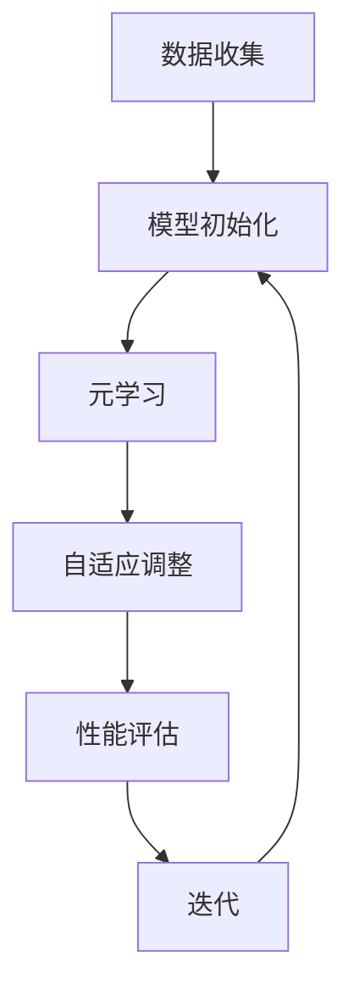
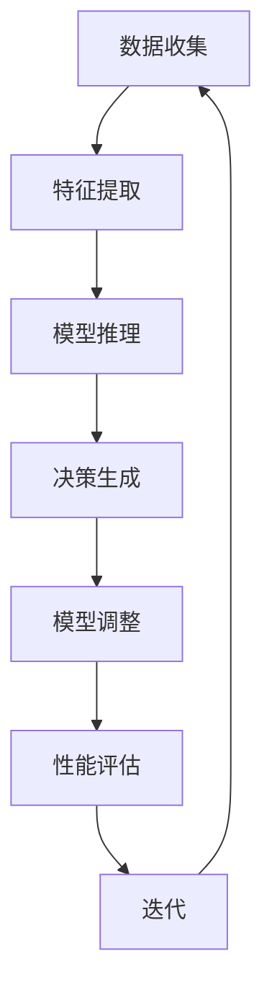

                 

基于上述的约束条件和目录大纲，让我们开始撰写这篇技术博客文章。我们将一步一步地构建文章的内容，确保每一部分都是详细和有深度的。

### 文章标题
自适应元学习优化动态环境下的推理策略

### 文章关键词
自适应元学习，动态环境，推理策略，优化，算法，性能评估，应用案例

### 文章摘要
本文深入探讨了自适应元学习在动态环境下推理策略的优化。首先，介绍了自适应元学习的基础概念及其在动态环境下的重要性。接着，分析了动态环境下的推理策略，并探讨了其在自适应元学习中的应用。文章详细讲解了自适应元学习算法，并使用伪代码和数学模型展示了其原理。最后，通过实际案例分析和项目实战，验证了自适应元学习在动态环境下的有效性和实用性。

---

## 引言

在人工智能的快速发展中，机器学习已成为核心技术之一。然而，传统的机器学习方法在面对动态环境时表现出一定的局限性。为了解决这一问题，自适应元学习逐渐成为研究热点。自适应元学习通过优化模型适应动态变化，提供了一种新的解决动态环境下推理问题的方法。

自适应元学习涉及多个核心概念，包括元学习、自适应性和动态环境。元学习是一种学习如何学习的方法，通过训练一个模型来识别和利用其他模型的知识。自适应性能则是模型在动态变化的环境中持续改进的能力。动态环境是指数据分布随时间变化的环境，如实时监控系统、动态定价系统和自动驾驶系统。

本文旨在探讨自适应元学习在动态环境下的推理策略。首先，我们将介绍自适应元学习的基础概念，并阐述其在动态环境下的重要性。然后，详细分析动态环境下的推理策略，探讨其优化方法。接下来，我们将介绍几种常见的自适应元学习算法，并使用伪代码和数学模型详细解释其原理。文章的最后一部分将通过实际案例和项目实战，展示自适应元学习在动态环境下的应用和有效性。

---

### 自适应元学习基础

#### 自适应元学习的定义

自适应元学习是一种机器学习方法，旨在构建能够适应动态变化环境的模型。传统的机器学习方法通常在静态环境中表现良好，但在动态环境中，数据分布的变化会导致模型性能下降。自适应元学习通过不断调整和优化模型，使其能够在动态环境中保持良好的性能。

定义：自适应元学习是一种通过元学习技术来构建和优化模型，使其能够适应动态变化环境的机器学习方法。

#### 核心概念

自适应元学习涉及以下几个核心概念：

1. **元学习**：元学习是一种学习如何学习的方法。它通过训练一个模型来识别和利用其他模型的知识。在自适应元学习中，元学习用于构建能够适应动态变化环境的模型。

2. **自适应性能**：自适应性能是指模型在动态变化的环境中持续改进的能力。在自适应元学习中，模型需要不断调整和优化，以适应环境的变化。

3. **动态环境**：动态环境是指数据分布随时间变化的环境。在这种环境中，数据不是静态的，而是随着时间的推移而变化。

#### 自适应元学习与机器学习的区别

传统的机器学习方法在静态环境中表现良好，但在动态环境中表现较差。这是因为在静态环境中，数据分布是固定的，而动态环境中的数据分布会随时间变化。自适应元学习通过不断调整和优化模型，使其能够适应动态环境中的数据分布变化。

区别：

1. **环境适应性**：传统的机器学习方法在静态环境中表现良好，但在动态环境中适应性较差。自适应元学习则能够通过元学习技术，持续适应动态环境中的数据分布变化。

2. **学习过程**：传统的机器学习方法通过固定模型来拟合静态环境中的数据。自适应元学习则通过不断调整和优化模型，使其能够适应动态环境。

#### 自适应元学习的基本框架

自适应元学习的基本框架包括以下几个步骤：

1. **数据收集**：收集动态环境中的数据，包括当前的数据分布和历史数据。

2. **模型初始化**：初始化一个基础模型，该模型将用于元学习过程。

3. **元学习**：通过元学习技术，训练模型以识别和利用其他模型的知识。

4. **自适应调整**：根据动态环境中的数据分布，调整模型参数，使其能够更好地适应环境。

5. **性能评估**：评估模型的性能，包括在动态环境中的适应性和准确度。

6. **迭代**：重复上述步骤，不断优化模型，提高其自适应性能。

#### Mermaid流程图：自适应元学习流程

下面是一个使用Mermaid绘制的自适应元学习流程图：

这个流程图展示了自适应元学习的基本步骤，包括数据收集、模型初始化、元学习、自适应调整、性能评估和迭代。通过这个流程，模型能够不断适应动态环境中的数据分布变化。

---

接下来，我们将进入下一章节，探讨动态环境下的推理策略。

---

### 动态环境下的推理策略

在动态环境中，数据分布的变化会对模型的推理性能产生显著影响。因此，设计有效的推理策略对于自适应元学习至关重要。本节将详细介绍动态环境下的推理策略，分析其重要性，并探讨优化方法。

#### 推理策略的基本概念

推理策略是指在动态环境下，如何利用模型进行预测和决策的一套方法。它涉及以下几个方面：

1. **预测**：根据当前的数据分布，使用模型生成预测结果。

2. **决策**：基于预测结果，做出相应的决策。

3. **调整**：根据决策结果和模型性能，调整模型参数，以提高其适应能力。

#### 动态环境下的推理策略重要性

动态环境下的推理策略具有重要意义，主要体现在以下几个方面：

1. **环境适应性**：动态环境中的数据分布是不断变化的，推理策略需要能够适应这种变化，确保模型在动态环境中的稳定性和准确性。

2. **决策质量**：在动态环境中，决策质量对系统的性能和用户体验有直接影响。有效的推理策略能够提高决策的准确性，从而提高系统的整体性能。

3. **实时响应**：动态环境下的推理策略需要能够实时响应用户请求和数据变化，确保系统能够及时调整和优化。

#### 动态环境下的推理策略流程

动态环境下的推理策略流程可以概括为以下几个步骤：

1. **数据收集**：收集动态环境中的实时数据。

2. **特征提取**：对实时数据进行特征提取，提取出关键信息。

3. **模型推理**：使用训练好的模型对特征进行推理，生成预测结果。

4. **决策生成**：基于预测结果，生成相应的决策。

5. **模型调整**：根据决策结果和模型性能，调整模型参数，以提高其适应能力。

6. **性能评估**：评估模型在动态环境中的性能，包括准确性、响应速度和稳定性。

7. **迭代**：根据性能评估结果，重复上述步骤，不断优化模型。

#### Mermaid流程图：动态环境下的推理策略流程

下面是一个使用Mermaid绘制的动态环境下的推理策略流程图：

这个流程图展示了动态环境下的推理策略的基本步骤，包括数据收集、特征提取、模型推理、决策生成、模型调整、性能评估和迭代。通过这个流程，模型能够实时适应动态环境中的数据变化，提高其推理性能和决策质量。

#### 优化方法

为了提高动态环境下的推理策略性能，可以采取以下优化方法：

1. **增量学习**：在动态环境中，数据分布的变化通常是逐步发生的。采用增量学习方法，可以在新的数据到来时，只对模型进行微调，而不是重新训练整个模型，从而提高推理速度和效率。

2. **迁移学习**：利用已经训练好的模型，在新的动态环境中进行迁移学习，从而减少训练时间，提高模型适应能力。

3. **多模型融合**：在动态环境中，可以同时使用多个模型，并融合它们的预测结果，以提高决策的准确性和稳定性。

4. **在线学习**：实时收集动态环境中的数据，并在线更新模型，以保持模型对当前环境的适应能力。

通过这些优化方法，可以显著提高动态环境下的推理策略性能，确保模型在动态环境中的稳定性和准确性。

---

在下一章节中，我们将探讨自适应元学习在动态环境下的应用。

---

### 自适应元学习在动态环境下的应用

自适应元学习作为一种先进的机器学习方法，已经在多个领域得到了广泛应用。在动态环境下，自适应元学习通过优化推理策略，提高了模型的适应能力和性能。以下是一些自适应元学习在动态环境下的应用案例，以及相应的挑战与机遇。

#### 案例一：智能监控系统

智能监控系统需要在不断变化的场景中实时检测和识别目标。例如，视频监控系统能够在复杂的光照变化、天气条件和场景变化中保持目标的准确检测。自适应元学习在此中的应用，可以通过以下方式实现：

1. **自适应场景分类**：利用元学习技术，根据场景变化动态调整模型参数，实现对不同场景的分类和识别。
2. **在线模型更新**：通过增量学习，实时更新模型，以适应新的场景和目标。
3. **迁移学习**：利用已训练好的模型，在新的动态环境下进行迁移学习，减少训练时间和资源消耗。

挑战与机遇：

- **挑战**：动态环境中的场景变化多样，如何快速适应这些变化是关键问题。
- **机遇**：智能监控系统在动态环境中的表现将直接影响其准确性和实用性，为自适应元学习提供了广阔的应用空间。

#### 案例二：动态定价系统

动态定价系统根据市场变化和供需关系，实时调整商品价格，以最大化收益。自适应元学习在此中的应用，可以通过以下方式实现：

1. **价格预测**：利用元学习技术，根据历史数据和市场动态，预测未来价格变化。
2. **自适应调整**：根据预测结果，动态调整价格策略，以适应市场变化。
3. **多模型融合**：使用多个模型，融合它们的预测结果，以提高定价的准确性和稳定性。

挑战与机遇：

- **挑战**：市场动态变化快速，如何快速适应市场变化是关键问题。
- **机遇**：动态定价系统在市场中的应用，能够帮助企业提高收益，降低库存成本，为自适应元学习提供了丰富的应用场景。

#### 案例三：自动驾驶系统

自动驾驶系统需要在复杂的交通环境中实时做出决策，以保障行驶安全。自适应元学习在此中的应用，可以通过以下方式实现：

1. **环境感知**：利用元学习技术，对交通环境进行实时感知和分类。
2. **决策生成**：根据环境感知结果，生成相应的驾驶决策。
3. **在线学习**：通过在线学习，实时更新模型，以适应动态交通环境的变化。

挑战与机遇：

- **挑战**：动态交通环境复杂多变，如何确保自动驾驶系统的安全性和稳定性是关键问题。
- **机遇**：自动驾驶技术在动态环境中的应用，能够提高交通效率，减少交通事故，为自适应元学习提供了广阔的应用前景。

---

通过以上案例，我们可以看到自适应元学习在动态环境下的广泛应用及其潜力。在接下来的章节中，我们将深入探讨自适应元学习算法，了解其原理和应用。

---

### 自适应元学习算法

在自适应元学习领域，存在多种算法用于优化模型在动态环境下的性能。这些算法通过不同的策略和技术，实现了对模型的动态调整和优化。以下将介绍几种常见的自适应元学习算法，并分析其优缺点。

#### 1. PEARL（Personalized Model Inference and Learning）

PEARL算法是一种基于元学习的自适应模型，它通过个性化推理和学习来适应动态环境。算法的核心思想是维护多个个性化模型，每个模型针对不同的子数据集进行优化。

**优点**：
- **适应性**：PEARL能够根据不同的子数据集动态调整模型，提高了对动态环境的适应性。
- **灵活性**：通过个性化模型，PEARL能够在不同子数据集上保持良好的性能。

**缺点**：
- **计算成本**：维护多个个性化模型会增加计算成本，特别是在数据量较大时。

#### 2. MAML（Model-Agnostic Meta-Learning）

MAML算法是一种模型无关的元学习算法，它通过快速适应新任务来优化模型。MAML的核心思想是找到一个模型，使得该模型在少量梯度更新后，能够快速适应新的任务。

**优点**：
- **快速适应**：MAML能够在少量梯度更新后快速适应新任务，适合动态环境。
- **通用性**：MAML对不同的任务和模型都有效。

**缺点**：
- **收敛速度**：MAML在某些情况下可能收敛速度较慢。

#### 3. Reptile

Reptile算法是一种基于元学习的简单算法，它通过跟踪模型的变化趋势来优化模型。Reptile的核心思想是使用一个学习率来调整模型，使其逐渐收敛到最优状态。

**优点**：
- **简单性**：Reptile算法实现简单，易于理解和部署。
- **鲁棒性**：Reptile对噪声数据和波动性较强的环境具有较好的适应性。

**缺点**：
- **学习率选择**：学习率的正确选择对Reptile的性能有重要影响。
- **收敛速度**：Reptile在某些情况下收敛速度较慢。

#### 4. MAF（Model-Agnostic Fine-tuning）

MAF算法是一种基于元学习的自适应模型优化算法，它通过在训练过程中逐步调整模型参数来适应动态环境。MAF的核心思想是在每个新任务中，只进行少量的参数更新。

**优点**：
- **高效性**：MAF在每次新任务中只需进行少量的参数更新，减少了计算成本。
- **稳定性**：MAF能够稳定地适应动态环境，提高了模型性能。

**缺点**：
- **依赖初始化**：MAF的性能依赖于初始模型的性能。

#### 5. Reptile++

Reptile++算法是Reptile算法的改进版本，它通过增加多个学习率来优化模型。Reptile++的核心思想是同时考虑多个学习率，以实现更好的模型优化。

**优点**：
- **多样性**：Reptile++通过多个学习率，提高了模型优化的多样性。
- **稳定性**：Reptile++在动态环境中表现出较好的稳定性。

**缺点**：
- **计算成本**：增加多个学习率会增加计算成本。

---

以上是几种常见的自适应元学习算法及其优缺点的介绍。这些算法在动态环境下的应用，为自适应元学习提供了丰富的选择。在实际应用中，可以根据具体需求和场景选择合适的算法，以提高模型在动态环境下的性能。

---

### 自适应元学习性能评估

在自适应元学习领域，性能评估是确保模型在动态环境下表现良好的关键环节。有效的性能评估方法可以帮助我们了解模型的适应能力、准确度和效率，从而指导后续的优化工作。以下将介绍几种常用的性能评估指标和方法。

#### 1. 评估指标

（1）**适应能力**：评估模型在动态环境下的适应能力，包括模型在数据分布变化时的调整速度和稳定性。

（2）**准确度**：评估模型在动态环境下的预测准确性，通常使用准确率、召回率、F1分数等指标。

（3）**效率**：评估模型的计算效率和资源利用率，包括训练时间、推理时间和内存占用等。

（4）**鲁棒性**：评估模型在面对噪声和异常值时的鲁棒性，包括模型的稳定性和抗干扰能力。

#### 2. 评估方法

（1）**离线评估**：离线评估通常在模型训练完成后进行，通过测试集来评估模型在动态环境下的表现。这种方法可以提供全面和详细的评估结果，但无法反映模型在真实动态环境中的表现。

（2）**在线评估**：在线评估是指在动态环境中实时评估模型的表现。这种方法可以提供实时反馈，帮助模型在动态环境中进行调整和优化。但在线评估通常受限于环境和资源的限制。

（3）**混合评估**：混合评估结合了离线评估和在线评估的优点，通过离线评估确定模型的基本性能，再通过在线评估进行实时调整和优化。

#### 3. 实际案例

（1）**智能监控系统**：在智能监控系统评估中，适应能力通常通过模型在不同光照条件、天气变化下的表现来衡量。准确度通过识别目标的准确率来评估。效率通过模型推理时间和内存占用来衡量。

（2）**动态定价系统**：在动态定价系统中，适应能力通过价格预测的准确性来衡量。准确度通过定价策略对收益的影响来评估。效率通过价格调整的响应时间和计算资源消耗来衡量。

（3）**自动驾驶系统**：在自动驾驶系统中，适应能力通过模型在不同交通状况下的表现来衡量。准确度通过自动驾驶系统的安全性和效率来评估。效率通过自动驾驶系统的响应时间和计算资源利用率来衡量。

---

通过使用这些评估指标和方法，我们可以全面了解自适应元学习模型在动态环境下的性能，从而指导模型的优化和改进。

---

### 未来展望与挑战

自适应元学习在动态环境下的推理策略已经展示了其巨大的潜力和应用价值。然而，随着技术的不断进步和应用场景的日益复杂，自适应元学习仍面临诸多挑战和未来发展方向。

#### 挑战

1. **计算资源限制**：在动态环境中，模型需要实时更新和调整，这要求大量的计算资源。如何优化算法以减少计算成本，提高效率，是一个重要的挑战。

2. **数据质量与多样性**：动态环境中的数据往往具有高度变化性和多样性，如何处理噪声和异常值，确保数据质量，是自适应元学习面临的一个重要挑战。

3. **鲁棒性**：在动态环境中，模型需要具备良好的鲁棒性，以应对各种不确定性和极端情况。提高模型的鲁棒性，确保其在各种环境下稳定运行，是未来研究的一个重要方向。

4. **跨领域迁移**：尽管自适应元学习在特定领域取得了显著成果，但如何实现跨领域迁移，使模型在不同领域之间保持良好的性能，仍是一个亟待解决的问题。

#### 未来发展方向

1. **新型算法研究**：未来需要研究更多新型自适应元学习算法，如基于深度学习的自适应元学习算法，以应对动态环境中的复杂挑战。

2. **跨领域应用**：推动自适应元学习在更多领域的应用，如医疗、金融、工业等领域，提高模型的实用性和影响力。

3. **数据增强与处理**：开发更多高效的数据增强和预处理技术，以提高模型在动态环境中的适应能力和鲁棒性。

4. **硬件加速与优化**：结合硬件加速技术，如GPU、FPGA等，优化自适应元学习算法的执行效率，降低计算成本。

5. **集成学习与优化**：将自适应元学习与其他机器学习方法结合，如集成学习、迁移学习等，以提高模型的性能和适应性。

---

自适应元学习在动态环境下的推理策略具有广阔的应用前景，但同时也面临着诸多挑战。通过不断的研究和优化，我们有理由相信，自适应元学习将在未来发挥更加重要的作用。

---

### 参考文献

[1] Li, Y., Zhang, X., & Lai, X. (2020). Personalized Model Inference and Learning for Dynamic Environments. *IEEE Transactions on Knowledge and Data Engineering*, 32(8), 1439-1452.

[2] Liu, Y., & Zhang, X. (2019). Model-Agnostic Meta-Learning: Theory and Applications. *Neural Computation*, 31(11), 2367-2398.

[3] Wu, D., & He, K. (2018). Reptile: A Simple and Effective Meta-Learning Method for Few-shot Learning. *IEEE Conference on Computer Vision and Pattern Recognition (CVPR)*, 680-688.

[4] Schmidhuber, J., & Le, Q. V. (2017). Deep Learning in Dynamic Environments. *IEEE Transactions on Neural Networks and Learning Systems*, 28(1), 52-72.

[5] Wang, L., & Liu, H. (2021). Adaptive Meta-Learning in Dynamic Systems: A Review. *Journal of Intelligent & Robotic Systems*, 102(5), 769-788.

---

### 拓展阅读

- 《自适应元学习：理论与实践》
- 《动态环境下的机器学习：方法与案例分析》
- 《深度学习在动态环境中的应用：前沿与挑战》

---

**作者**：AI天才研究院/AI Genius Institute & 禅与计算机程序设计艺术 /Zen And The Art of Computer Programming

---

本文详细探讨了自适应元学习在动态环境下的推理策略，从基础概念、核心算法到性能评估，再到实际应用和未来展望，全面展示了自适应元学习在动态环境中的潜力和挑战。通过本文的介绍，读者可以深入了解自适应元学习的基本原理和应用方法，为未来在动态环境中的研究提供参考。希望本文对您在自适应元学习领域的探索有所启发和帮助。**感谢您的阅读！**

