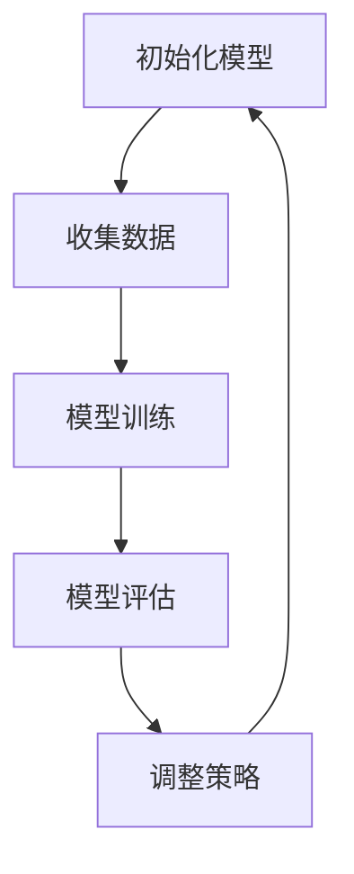

                 

为了撰写一篇符合要求的《自适应元学习优化动态环境中的推理策略调整》的技术博客文章，我们将遵循以下步骤进行推理和思考：

### 第一步：背景介绍

**目的**：为读者提供一个自适应元学习和动态环境的基本理解。

**内容**：

1. **定义和意义**：简要介绍自适应元学习的定义，以及它在人工智能领域中的重要性。
2. **动态环境**：描述动态环境的特点，以及为何在动态环境中进行推理时需要特殊的策略调整。

### 第二步：核心概念与联系

**目的**：帮助读者理解自适应元学习的框架和基本原理。

**内容**：

1. **自适应元学习模型**：介绍模型的基本组成部分和功能。
2. **自适应元学习算法**：描述算法的核心步骤和优化方法。
3. **流程图**：使用Mermaid绘制一个简化的自适应元学习框架流程图。

### 第三步：优化理论概述

**目的**：为读者提供优化理论的基础知识。

**内容**：

1. **优化方法基础**：介绍无约束优化和有约束优化的概念。
2. **模型优化策略**：讨论参数调整和模型结构调整的方法。
3. **数学模型与应用**：展示优化过程中的数学公式和模型。

### 第四步：策略调整方法

**目的**：深入探讨动态环境下的策略调整。

**内容**：

1. **策略调整基础**：解释策略调整的定义和目标。
2. **动态环境下的策略调整**：介绍动态适应和优化策略。
3. **伪代码**：提供策略调整的伪代码示例。

### 第五步：应用案例分析

**目的**：通过实际案例展示策略调整的效果。

**内容**：

1. **案例一**：介绍自适应元学习在游戏中的应用。
2. **案例二**：探讨自适应元学习在医疗诊断中的应用。
3. **案例三**：分析自适应元学习在自动驾驶中的应用。

### 第六步：未来展望与趋势

**目的**：展望自适应元学习的发展方向。

**内容**：

1. **发展趋势**：预测自适应元学习的技术趋势。
2. **推理策略调整**：讨论动态环境下推理策略的未来发展方向。
3. **应用领域扩展**：探讨自适应元学习在其他领域的潜在应用。

### 第七步：总结与展望

**目的**：总结文章的主要观点，并为未来研究提供方向。

**内容**：

1. **主要内容回顾**：回顾文章中的关键观点和发现。
2. **研究方向展望**：提出未来可能的研究方向。
3. **发展建议**：为读者提供实用的建议。

### 第八步：编写文章

**目的**：将以上内容整合成一篇结构完整、逻辑清晰的文章。

**步骤**：

1. **撰写文章**：根据目录大纲的结构，将每一部分的内容详细撰写出来。
2. **格式调整**：确保文章格式符合markdown规范，包括标题、子标题、代码块、公式等。
3. **添加作者信息**：在文章末尾添加作者信息。
4. **内容审核**：确保文章内容的完整性和准确性。

### 第九步：文章终稿

**目的**：确保文章字数在8000～12000字之间。

**步骤**：

1. **字数统计**：使用文本编辑器或工具统计文章字数。
2. **内容调整**：如果字数不足，可以增加案例分析或深入讨论；如果字数过多，可以精简内容或合并部分章节。
3. **最终审核**：确保文章内容完整、结构清晰、逻辑连贯。

通过以上步骤，我们可以撰写出一篇既具有深度又具有可操作性的技术博客文章。在撰写过程中，我们将确保文章的每一个部分都经过精心设计和详细讲解，以帮助读者更好地理解和应用自适应元学习优化动态环境中的推理策略调整。

