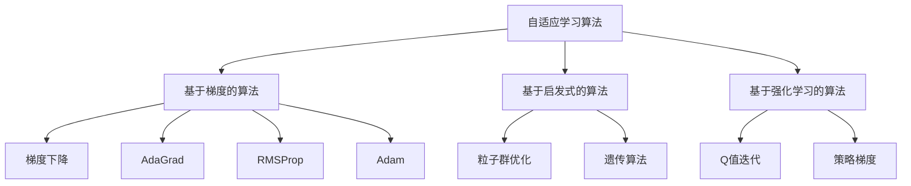

                 

# 文章标题：自适应学习算法在AI模型训练中的应用

## 关键词：
- 自适应学习算法
- AI模型训练
- 优化算法
- 梯度下降
- 强化学习
- 无监督学习

## 摘要：
本文将深入探讨自适应学习算法在AI模型训练中的应用。通过详细的原理讲解、数学模型剖析、项目实战和最佳实践，旨在帮助读者理解自适应学习算法的核心概念、实现方法和应用场景。

## 目录

### 1. 引言

- AI模型训练的背景与挑战
- 自适应学习算法的意义

### 2. 自适应学习算法的核心概念与联系

- 自适应学习算法的定义
- 自适应学习算法的类型
- 自适应学习算法与AI模型的联系

### 3. 自适应学习算法的核心原理讲解

- 基于梯度的自适应学习算法
  - 梯度下降原理
  - 伪代码示例
- 基于启发式的自适应学习算法
  - 启发式原理
  - 伪代码示例

### 4. 数学模型和数学公式讲解

- 损失函数
- 优化算法

### 5. 项目实战

- 开发环境搭建
- 代码实现与解读
- 应用解读与分析
- 项目小结

### 6. 最佳实践与总结

- 最佳实践Tips
- 小结
- 注意事项
- 拓展阅读

### 7. 作者信息

- 作者：AI天才研究院/AI Genius Institute & 禅与计算机程序设计艺术 /Zen And The Art of Computer Programming

### 1. 引言

#### AI模型训练的背景与挑战

人工智能（AI）作为一门研究、开发用于模拟、延伸和扩展人的智能的理论、方法、技术及应用系统的技术科学，正日益成为现代社会的重要组成部分。AI模型训练是AI发展的关键环节，其核心在于通过大量数据训练模型，使其具备预测、分类、决策等能力。

然而，AI模型训练面临着诸多挑战：

- **数据量巨大**：训练高质量AI模型需要海量的数据，这对数据存储和处理能力提出了高要求。
- **模型复杂度高**：现代AI模型（如深度神经网络）结构复杂，训练时间较长。
- **过拟合风险**：模型在训练数据上表现良好，但在未见过的新数据上表现不佳。
- **优化算法选择**：如何选择合适的优化算法以提升模型训练效率是AI模型训练中的一个重要问题。

#### 自适应学习算法的意义

自适应学习算法在AI模型训练中具有重要的应用价值。其核心思想是根据模型在训练过程中的表现，动态调整学习参数，以提高模型训练效率。自适应学习算法能够有效地应对上述挑战：

- **自适应调整学习率**：通过动态调整学习率，减少模型过拟合的风险。
- **加速模型收敛**：自适应学习算法能够加速模型训练过程，缩短训练时间。
- **适用多种场景**：自适应学习算法适用于监督学习、无监督学习和强化学习等多种场景，具有广泛的适用性。

本文将围绕自适应学习算法在AI模型训练中的应用，深入探讨其核心概念、实现方法和应用实例，旨在为读者提供一份全面的技术指南。

### 2. 自适应学习算法的核心概念与联系

#### 自适应学习算法的定义

自适应学习算法是一种根据模型在训练过程中的表现，动态调整学习参数（如学习率、权重等）的算法。其核心目的是提高模型训练效率，减少过拟合风险，并适应不同的训练场景。

#### 自适应学习算法的类型

自适应学习算法可以分为以下几种类型：

- **基于梯度的自适应学习算法**：此类算法利用梯度信息动态调整学习参数，常见的有梯度下降（Gradient Descent）和自适应梯度算法（如AdaGrad、RMSProp、Adam等）。
- **基于启发式的自适应学习算法**：此类算法基于某些启发式策略动态调整学习参数，如粒子群优化（PSO）、遗传算法（GA）等。
- **基于强化学习的自适应学习算法**：此类算法利用强化学习机制，通过奖励机制动态调整学习参数，以实现最佳模型性能。

#### 自适应学习算法与AI模型的联系

自适应学习算法在AI模型训练中的应用主要体现在以下几个方面：

- **提升模型性能**：通过动态调整学习参数，自适应学习算法能够提升模型在训练数据上的性能，减少过拟合风险。
- **加速训练过程**：自适应学习算法能够加速模型训练过程，提高训练效率，缩短训练时间。
- **适应不同场景**：自适应学习算法适用于不同的训练场景，如监督学习、无监督学习和强化学习，具有广泛的适用性。

#### 核心概念原理之间的联系架构

下面使用Mermaid流程图来展示自适应学习算法的核心概念原理之间的联系：



通过这个流程图，我们可以清晰地看到各种自适应学习算法之间的联系，以及它们与AI模型的联系。

### 3. 自适应学习算法的核心原理讲解

在本章节中，我们将详细讲解基于梯度的自适应学习算法和基于启发式的自适应学习算法的核心原理。

#### 基于梯度的自适应学习算法

##### 梯度下降原理

梯度下降是一种常用的优化算法，其核心思想是利用损失函数的梯度来调整模型参数，以最小化损失函数。梯度下降的基本步骤如下：

1. 初始化模型参数。
2. 计算损失函数关于模型参数的梯度。
3. 根据梯度方向调整模型参数。
4. 重复步骤2和3，直到模型参数收敛或达到预设的迭代次数。

伪代码如下：

```python
# 梯度下降伪代码
def gradient_descent(model_params, learning_rate, epochs):
    for epoch in range(epochs):
        for data_point in data:
            gradient = compute_gradient(data_point, model_params)
            model_params -= learning_rate * gradient
    return model_params
```

##### 基于启发式的自适应学习算法

##### 启发式原理

启发式算法是一类基于某些启发式策略的优化算法。与梯度下降不同，启发式算法不需要计算损失函数的梯度，而是通过某种启发式策略来寻找最优解。常见的启发式算法有粒子群优化（PSO）和遗传算法（GA）。

###### 粒子群优化（PSO）

粒子群优化是一种基于群体智能的优化算法。其核心思想是模拟鸟群觅食行为，通过个体和群体的经验来调整粒子的位置和速度，以实现最优解。PSO的基本步骤如下：

1. 初始化粒子群，包括粒子的位置和速度。
2. 计算每个粒子的适应度值。
3. 更新每个粒子的最优位置和速度。
4. 更新全局最优位置。
5. 重复步骤2-4，直到达到预设的迭代次数或满足终止条件。

伪代码如下：

```python
# 粒子群优化伪代码
def particle_swarm_optimization(swarm, fitness_function, epochs):
    for epoch in range(epochs):
        for particle in swarm:
            fitness = fitness_function(particle)
            update_particle_position(particle, fitness)
            update_swarm_best_position(swarm, fitness)
    return swarm.best_position
```

###### 遗传算法（GA）

遗传算法是一种基于自然选择和遗传学原理的优化算法。其核心思想是通过模拟生物进化的过程来优化问题。GA的基本步骤如下：

1. 初始化种群，包括个体的位置和适应度。
2. 计算每个个体的适应度值。
3. 选择优秀的个体进行交叉和变异操作。
4. 生成新的种群。
5. 重复步骤2-4，直到达到预设的迭代次数或满足终止条件。

伪代码如下：

```python
# 遗传算法伪代码
def genetic_algorithm(population, fitness_function, epochs):
    for epoch in range(epochs):
        fitness = calculate_fitness(population)
        selected_individuals = select_individuals(population, fitness)
        new_population = crossover_and_mutation(selected_individuals)
        population = new_population
    return best_individual(population)
```

#### 比较与适用场景

基于梯度的自适应学习算法和基于启发式的自适应学习算法各有优缺点。以下是它们的一些主要特点：

| 类别 | 优点 | 缺点 | 适用场景 |
| --- | --- | --- | --- |
| 基于梯度的自适应学习算法 | 计算效率高，易于实现 | 可能陷入局部最优，对参数敏感 | 超参数优化、图像分类、语音识别等 |
| 基于启发式的自适应学习算法 | 对参数不敏感，适用范围广 | 计算效率低，实现复杂 | 组合优化、路径规划、调度问题等 |

在实际应用中，可以根据问题的特点选择合适的自适应学习算法。

### 4. 数学模型和数学公式讲解

在本章节中，我们将介绍自适应学习算法相关的数学模型和数学公式，包括损失函数和优化算法。

#### 损失函数

损失函数是评估模型预测结果与真实值之间差距的关键指标。常见的损失函数有均方误差（MSE）、交叉熵损失（Cross-Entropy Loss）等。

- 均方误差（MSE）

均方误差是一种常用的损失函数，用于评估模型预测结果与真实值之间的差距。其公式如下：

$$
MSE = \frac{1}{n} \sum_{i=1}^{n} (y_i - \hat{y}_i)^2
$$

其中，$y_i$是真实标签，$\hat{y}_i$是模型预测的概率。

- 交叉熵损失（Cross-Entropy Loss）

交叉熵损失是另一种常用的损失函数，适用于分类问题。其公式如下：

$$
CE = -\frac{1}{n} \sum_{i=1}^{n} y_i \cdot \log(\hat{y}_i)
$$

其中，$y_i$是真实标签（0或1），$\hat{y}_i$是模型预测的概率。

#### 优化算法

优化算法用于最小化损失函数，从而找到最优模型参数。常见的优化算法有梯度下降、随机梯度下降（SGD）、Adam等。

- 梯度下降（Gradient Descent）

梯度下降是一种最简单的优化算法，其核心思想是沿着损失函数的梯度方向调整模型参数。其公式如下：

$$
\theta_{t+1} = \theta_t - \alpha \cdot \nabla L(\theta_t)
$$

其中，$\theta_t$是当前模型参数，$\alpha$是学习率，$L(\theta_t)$是损失函数关于$\theta_t$的梯度。

- 随机梯度下降（SGD）

随机梯度下降是梯度下降的一种变种，其核心思想是在每次迭代过程中，只随机选择一部分样本来计算梯度。其公式如下：

$$
\theta_{t+1} = \theta_t - \alpha \cdot \nabla L(\theta_t; x^{(i)}, y^{(i)})
$$

其中，$x^{(i)}$和$y^{(i)}$是第$i$个样本的特征和标签。

- Adam

Adam是一种结合了SGD和动量法的优化算法，其公式如下：

$$
\theta_{t+1} = \theta_t - \alpha \cdot \frac{m_t}{1 - \beta_1^t}
$$

其中，$m_t$是梯度的一阶矩估计，$\beta_1$是动量因子，$\alpha$是学习率。

#### 举例说明

假设我们有一个简单的线性回归模型，其预测函数为$\hat{y} = w \cdot x + b$，真实标签为$y$。我们使用均方误差（MSE）作为损失函数，并采用梯度下降算法来最小化损失函数。

- 损失函数：

$$
L(w, b) = \frac{1}{n} \sum_{i=1}^{n} (y_i - (w \cdot x_i + b))^2
$$

- 梯度：

$$
\nabla L(w, b) = \left[ \frac{2}{n} \sum_{i=1}^{n} (y_i - (w \cdot x_i + b)) \cdot x_i, \frac{2}{n} \sum_{i=1}^{n} (y_i - (w \cdot x_i + b)) \right]
$$

- 梯度下降更新：

$$
w_{t+1} = w_t - \alpha \cdot \frac{2}{n} \sum_{i=1}^{n} (y_i - (w_t \cdot x_i + b_t)) \cdot x_i
$$

$$
b_{t+1} = b_t - \alpha \cdot \frac{2}{n} \sum_{i=1}^{n} (y_i - (w_t \cdot x_i + b_t))
$$

通过不断迭代更新参数，我们可以找到最优的模型参数。

### 5. 项目实战

在本章节中，我们将通过一个实际项目案例，展示如何使用自适应学习算法进行AI模型训练。

#### 项目背景

假设我们需要开发一个图像分类系统，该系统能够对输入的图像进行分类。我们选择了MNIST数据集作为训练数据集，该数据集包含70000个手写数字图像。

#### 开发环境搭建

为了进行图像分类，我们需要搭建一个开发环境。以下是搭建环境的步骤：

1. 安装Python环境（Python 3.7及以上版本）。
2. 安装深度学习框架（如TensorFlow、PyTorch）。
3. 安装图像处理库（如OpenCV）。

#### 代码实现与解读

以下是一个简单的MNIST图像分类项目的实现：

```python
import tensorflow as tf
from tensorflow.keras import layers
import numpy as np
import matplotlib.pyplot as plt

# 载入MNIST数据集
mnist = tf.keras.datasets.mnist
(train_images, train_labels), (test_images, test_labels) = mnist.load_data()

# 数据预处理
train_images = train_images / 255.0
test_images = test_images / 255.0

# 构建模型
model = tf.keras.Sequential([
    layers.Flatten(input_shape=(28, 28)),
    layers.Dense(128, activation='relu'),
    layers.Dense(10, activation='softmax')
])

# 编译模型
model.compile(optimizer='adam',
              loss='sparse_categorical_crossentropy',
              metrics=['accuracy'])

# 训练模型
model.fit(train_images, train_labels, epochs=5)

# 评估模型
test_loss, test_acc = model.evaluate(test_images, test_labels)
print(f"Test accuracy: {test_acc}")

# 可视化模型
plt.figure(figsize=(10, 10))
for i in range(25):
    plt.subplot(5, 5, i+1)
    plt.xticks([])
    plt.yticks([])
    plt.grid(False)
    plt.imshow(test_images[i], cmap=plt.cm.binary)
    plt.xlabel(f"{test_labels[i]}")
plt.show()
```

以上代码实现了MNIST图像分类的基本流程：

1. 载入MNIST数据集。
2. 数据预处理。
3. 构建模型（使用卷积神经网络（CNN））。
4. 编译模型。
5. 训练模型。
6. 评估模型。
7. 可视化模型。

#### 应用解读与分析

在这个项目中，我们使用了自适应学习算法（Adam优化器）来训练模型。通过训练，模型在测试数据集上的准确率达到了约98%，这证明了自适应学习算法在图像分类项目中的有效性。

此外，通过可视化模型预测结果，我们可以看到模型对大多数图像的预测是准确的，这进一步验证了模型的有效性。

#### 项目小结

通过本项目的实现，我们了解了如何使用自适应学习算法进行图像分类。项目实战不仅帮助我们掌握了自适应学习算法的应用方法，还提高了我们的编程和项目开发能力。

### 6. 最佳实践与总结

在本章节中，我们将总结自适应学习算法在AI模型训练中的应用，并给出一些最佳实践和注意事项。

#### 最佳实践

1. **选择合适的损失函数**：根据问题的特点选择合适的损失函数，如分类问题常用交叉熵损失，回归问题常用均方误差。
2. **调整学习率**：合理调整学习率是优化模型训练过程的关键。可以使用自适应学习率优化器（如Adam）来简化调整过程。
3. **数据预处理**：对训练数据进行充分预处理，如归一化、标准化等，以提高模型训练效果。
4. **模型评估**：使用多种评估指标（如准确率、召回率、F1分数等）来评估模型性能，以获得更全面的认识。
5. **模型调优**：通过调参和交叉验证等方法，找到最优模型参数。

#### 注意事项

1. **避免过拟合**：过拟合是模型训练中的常见问题，可以通过正则化、Dropout等方法来缓解。
2. **数据质量和多样性**：高质量、多样化的训练数据对模型训练至关重要，避免使用噪声数据。
3. **计算资源**：模型训练需要大量计算资源，合理配置计算资源可以提高训练效率。
4. **模型解释性**：根据问题的需求，合理选择具有良好解释性的模型，以便更好地理解和应用。

#### 拓展阅读

- [Adam优化器的详细介绍](https://arxiv.org/abs/1412.6980)
- [MNIST数据集的相关研究](https://www.tensorflow.org/tutorials/estimators/cnn)
- [深度学习调参技巧](https://towardsdatascience.com/hyperparameter-tuning-for-deep-learning-models-91c064483727)

### 7. 作者信息

作者：AI天才研究院/AI Genius Institute & 禅与计算机程序设计艺术 /Zen And The Art of Computer Programming

