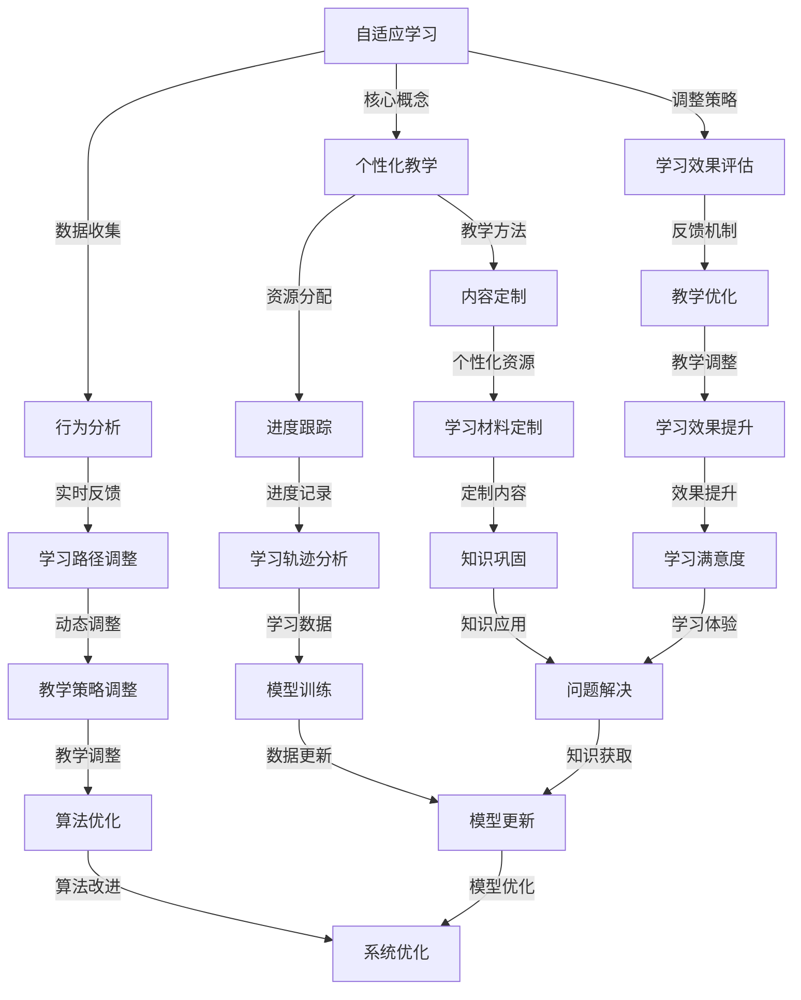

                 

### 文章标题：自适应课程学习优化AI推理的知识获取效率

#### 关键词：自适应学习，AI推理，知识获取效率，教育技术，人工智能

#### 摘要：
本文旨在探讨自适应课程学习如何优化AI推理的知识获取效率。通过详细分析自适应学习的理论基础、AI推理的基本原理以及两者的融合模式，本文揭示了自适应课程学习在提高AI推理效率和知识获取上的潜在优势。文章还将介绍具体的优化方法，并通过项目实战展示如何在实际应用中实现这些方法，为教育领域中的AI应用提供新的思路。

## 第1章 引言

### 1.1 书籍背景与目的

随着人工智能（AI）技术的快速发展，其在教育领域的应用也日益广泛。自适应课程学习作为一种智能教育技术，正逐渐成为个性化学习的重要手段。AI推理作为AI的核心能力之一，对知识的获取和运用具有关键作用。然而，在现有的教育体系中，AI推理的知识获取效率仍然面临诸多挑战。本文旨在解决这一问题，通过探讨自适应课程学习与AI推理的融合，优化知识获取效率，为智能教育提供新的解决方案。

### 1.2 自适应学习与AI推理的关系

自适应学习通过根据学习者的特点和学习需求调整教学策略，从而提高学习效果。AI推理则利用机器学习算法对大量数据进行处理和分析，以实现智能决策和知识提取。两者的结合不仅能提升教学个性化水平，还能增强AI在知识获取中的效率。本文将深入分析这种结合的机制，并探讨其在教育领域中的应用前景。

### 1.3 本书结构安排

本文将按照以下结构展开：

1. **第1章 引言**：介绍书籍的背景与目的，以及自适应学习与AI推理的关系。
2. **第2章 自适应学习的理论基础**：详细探讨自适应学习的定义、核心概念与原理。
3. **第3章 AI推理的基本原理**：介绍AI推理的定义、核心算法及其在教育中的应用。
4. **第4章 自适应课程学习与AI推理的融合**：分析自适应课程学习与AI推理的融合模式及其优化方法。
5. **第5章 核心概念与联系**：通过Mermaid流程图展示核心概念之间的关系。
6. **第6章 核心算法原理**：使用伪代码详细阐述核心算法原理。
7. **第7章 数学模型与公式**：介绍并解释相关的数学模型和公式。
8. **第8章 项目实战**：展示实际开发环境和代码实现，并进行案例分析和解读。
9. **第9章 总结与展望**：总结主要内容和未来研究方向。

## 第2章 自适应学习的理论基础

### 2.1 自适应学习的定义与历史发展

自适应学习（Adaptive Learning）是一种基于学习者个人特点和需求进行个性化调整的教学方法。它起源于20世纪中期，随着计算机技术的发展，逐渐成为教育领域的研究热点。自适应学习通过实时分析学习者的行为和反馈，动态调整教学内容、方法和策略，从而实现个性化教学。其核心目标是在不同的学习环境中，为每个学习者提供最佳的学习体验。

历史发展方面，自适应学习经历了几个重要阶段：

- **早期探索**（20世纪50年代至70年代）：在这个阶段，研究人员开始关注个性化教学的可能性，并尝试设计基于规则的系统来调整教学策略。
- **模型驱动**（20世纪80年代至90年代）：随着认知科学和人工智能的发展，研究者们开始构建基于模型的自适应学习系统，以模拟学习者的认知过程。
- **Web 2.0时代**（21世纪初至今）：互联网的普及和大数据技术的发展，为自适应学习提供了更丰富的数据资源和更高效的实现方式，使其在教育中的应用更加广泛和深入。

### 2.2 自适应学习的核心概念

#### 2.2.1 学习者的个性化需求

个性化需求是自适应学习的核心概念之一。它指的是根据学习者的个人特点（如知识水平、学习能力、兴趣偏好等）来定制教学内容和策略。为了实现这一目标，自适应学习系统通常需要收集并分析大量的学习者数据，包括学习行为、成绩记录、认知风格等。

#### 2.2.2 适应性的学习策略

适应性的学习策略是指根据学习者的个性化需求，动态调整教学内容的呈现方式、学习路径和教学方法。常见的适应策略包括：

- **动态调整难度**：根据学习者的表现，自动调整学习内容的难度，以确保学习者能够保持在最佳的学习状态。
- **个性化推送**：根据学习者的兴趣和学习进度，推送适合的学习材料和练习题。
- **反馈机制**：实时收集学习者的反馈，并据此调整教学策略，以优化学习体验。

#### 2.2.3 反馈机制与调整方法

反馈机制是自适应学习的重要组成部分。通过反馈，系统能够了解学习者的学习效果，并及时调整教学策略。常见的反馈机制包括：

- **即时反馈**：在学习过程中，系统即时提供正确答案和解释，帮助学习者纠正错误。
- **阶段性反馈**：在学习阶段结束时，系统对学习者的整体表现进行评估，并提供个性化的学习建议。
- **自我评估**：学习者可以自主进行学习效果评估，以调整学习策略。

### 2.3 自适应学习的实现机制

自适应学习系统的实现机制主要包括以下几个方面：

- **数据收集与处理**：通过多种传感器和工具，收集学习者的行为数据，并利用数据挖掘和机器学习技术进行分析。
- **模型构建与优化**：基于学习者的个性化需求，构建适应性的学习模型，并通过迭代优化，提高模型的准确性和适应性。
- **动态调整策略**：根据学习模型和反馈机制，动态调整教学内容、方法和策略，实现个性化教学。

### 2.4 自适应学习在教育中的应用

自适应学习在教育中的应用非常广泛，主要包括以下几个方面：

- **个性化教学**：通过自适应学习系统，教师可以为学生提供个性化的教学方案，满足不同学习者的需求。
- **学习评估与反馈**：自适应学习系统能够实时评估学生的学习效果，并提供个性化的学习建议，帮助学习者提高学习效果。
- **课程设计与优化**：自适应学习系统可以根据学习者的需求和反馈，优化课程设计和教学内容，提高教学效果。

### 2.5 自适应学习的挑战与未来趋势

尽管自适应学习在教育领域具有巨大的潜力，但仍面临诸多挑战：

- **数据隐私与安全性**：自适应学习系统需要收集和处理大量的学习者数据，如何确保数据的安全性和隐私性是一个重要问题。
- **模型准确性**：自适应学习模型的准确性直接影响到个性化教学的效果，如何提高模型的准确性是一个重要研究方向。
- **用户接受度**：学习者对自适应学习系统的接受度也是一个重要因素，如何提高系统的用户友好性是一个挑战。

未来，自适应学习将继续朝着以下方向发展：

- **人工智能与大数据的深度融合**：通过引入更先进的人工智能技术和大数据分析方法，提高自适应学习系统的智能化水平。
- **跨学科的交叉研究**：结合心理学、教育学、计算机科学等多学科的研究成果，推动自适应学习的发展。
- **全球范围内的推广应用**：随着技术的普及和教育的国际化，自适应学习将在全球范围内得到更广泛的应用。

### 2.6 小结

自适应学习作为一种智能教育技术，正逐渐成为个性化学习的重要手段。通过实时分析学习者的特点和需求，自适应学习系统能够为每个学习者提供个性化的教学方案，提高学习效果。本文对自适应学习的定义、核心概念、实现机制以及应用进行了详细分析，为后续章节的讨论奠定了基础。

## 第3章 AI推理的基本原理

### 3.1 AI推理的定义

AI推理（Artificial Intelligence Reasoning）是人工智能（AI）领域的一个重要分支，旨在通过模拟人类的思维过程，使计算机能够对问题进行理解和求解。AI推理的核心在于让计算机具备推理能力，即通过已有知识和信息，推导出新的结论或决策。

AI推理的定义可以从以下几个方面进行理解：

- **问题理解**：AI推理首先需要理解问题的结构和内容，包括问题的背景、目标和约束条件等。
- **知识运用**：通过运用已有知识，AI推理能够对问题进行建模和分析，从而得出合理的结论。
- **决策生成**：AI推理不仅能够对问题进行理解和分析，还能够基于分析结果生成决策，指导实际操作。

AI推理的类型主要包括以下几种：

- **基于规则的推理**：通过预设规则，对输入信息进行匹配和推导，得出结论。这种推理方法在专家系统和决策支持系统中广泛应用。
- **基于模型的推理**：利用数学模型和算法，对输入信息进行处理和分析，得出结论。这种推理方法在机器学习和数据挖掘领域具有重要作用。
- **基于案例的推理**：通过类比已有案例，对新问题进行推理和决策。这种推理方法在法律、医疗等领域有广泛应用。

### 3.2 AI推理的核心算法

AI推理的核心算法是实现推理功能的关键。以下是几种常见的AI推理算法：

- **神经网络**：神经网络是一种模拟生物神经系统的计算模型，通过多层次的神经元连接，实现从输入到输出的映射。在AI推理中，神经网络可以用于模式识别、分类和预测等任务。
- **决策树**：决策树是一种基于分类和回归分析的树形结构，通过一系列判断条件，将数据集划分成不同的类别或数值。决策树在分类和预测任务中具有广泛的应用。
- **支持向量机**：支持向量机（SVM）是一种基于统计学习理论的分类算法，通过找到一个最优的超平面，将不同类别的数据分开。SVM在图像分类、文本分类等领域有广泛应用。

### 3.3 AI推理在教育中的应用

AI推理在教育领域中具有广泛的应用前景，主要体现在以下几个方面：

- **个性化学习**：通过AI推理，系统可以分析学生的学习行为和数据，提供个性化的学习方案和资源，帮助学生更好地掌握知识。
- **智能评估**：AI推理可以自动评估学生的学习效果，提供即时反馈和诊断，帮助教师发现学生的学习问题，并进行有针对性的教学调整。
- **智能辅导**：AI推理可以模拟教师的角色，为学生提供个性化的辅导和指导，解答学生在学习过程中的疑问，帮助学生更好地理解和掌握知识。

### 3.4 AI推理的优势和挑战

AI推理在教育中的应用具有显著的优势：

- **高效性**：AI推理可以快速处理和分析大量数据，提高教学效率和决策准确性。
- **个性化**：AI推理可以根据学生的特点和需求，提供个性化的教学方案和资源，满足不同学习者的需求。
- **实时性**：AI推理可以实时评估学生的学习效果，提供即时反馈和调整，帮助教师及时掌握学生的学习状态。

然而，AI推理在教育中也面临一些挑战：

- **数据隐私**：AI推理需要大量学生的学习数据，如何保护学生的隐私是一个重要问题。
- **算法可靠性**：AI推理算法的准确性和可靠性直接影响到教学效果，如何提高算法的准确性和稳定性是一个挑战。
- **教师角色转变**：随着AI推理在教育中的应用，教师的角色和职责可能发生转变，如何适应这种变化是一个重要问题。

### 3.5 小结

AI推理是人工智能领域的一个重要分支，通过模拟人类的思维过程，使计算机能够对问题进行理解和求解。在教育领域，AI推理具有广泛的应用前景，可以提供个性化学习、智能评估和智能辅导等服务。本文对AI推理的定义、核心算法及其在教育中的应用进行了详细分析，为后续章节的讨论奠定了基础。

## 第4章 自适应课程学习与AI推理的融合

### 4.1 自适应课程学习与AI推理的融合模式

自适应课程学习与AI推理的融合是一种新型的教育模式，旨在通过结合两者的优势，实现个性化教育和智能决策。融合模式可以分为以下几种：

#### 4.1.1 双层模型结构

在这种结构中，自适应学习系统和AI推理系统相互独立，但又紧密合作。自适应学习系统负责分析学习者的行为数据，调整教学策略，而AI推理系统则利用这些策略和数据进行推理，生成智能化的学习方案。这种模式的优势在于能够充分利用两者的优势，实现高效的个性化教育。

#### 4.1.2 多模态学习策略

多模态学习策略指的是利用多种数据源（如文本、图像、音频等）进行学习，从而提高学习效果的策略。在这种策略中，自适应学习系统通过分析多模态数据，生成个性化的学习路径，而AI推理系统则利用这些数据进行分析和推理，为学习者提供智能化的学习建议。这种模式的优势在于能够更全面地了解学习者的需求和特点，从而提供更精准的学习支持。

#### 4.1.3 知识图谱融合

知识图谱是一种用于表示实体及其关系的图形化数据模型，它能够有效地组织和管理大量知识信息。在这种融合模式中，自适应学习系统通过构建知识图谱，将学习内容进行结构化组织，而AI推理系统则利用知识图谱进行推理和决策。这种模式的优势在于能够实现知识的深度挖掘和智能应用。

### 4.2 知识获取效率的优化方法

在自适应课程学习中，知识获取效率的优化是关键问题。以下是一些优化方法：

#### 4.2.1 基于模型的效率评估

基于模型的效率评估方法是指利用机器学习模型对知识获取过程进行实时监控和评估。通过分析学习者的行为数据，模型可以预测学习者的学习效果，并据此调整教学策略。这种方法的优势在于能够快速、准确地评估知识获取效率，从而实现实时优化。

#### 4.2.2 基于数据的优化策略

基于数据的优化策略是指利用大数据分析方法对学习过程进行深入挖掘和分析，从而发现潜在的学习问题和优化机会。这种方法的优势在于能够从海量数据中发现有价值的信息，为优化知识获取效率提供有力支持。

#### 4.2.3 基于用户行为的优化策略

基于用户行为的优化策略是指通过分析学习者的行为数据，识别学习者的兴趣和学习模式，从而调整教学策略。这种方法的优势在于能够实现个性化的教学支持，提高知识获取效率。

#### 4.2.4 知识图谱优化

知识图谱优化是指通过构建和维护知识图谱，优化知识获取和利用的效率。这种方法的优势在于能够实现知识的结构化组织和高效检索，从而提高知识获取的效率。

### 4.3 实现自适应课程学习的挑战与解决方案

实现自适应课程学习面临着一系列挑战，主要包括：

#### 4.3.1 数据隐私与安全

自适应课程学习需要收集和处理大量的学习者数据，如何保护数据隐私和安全是一个重要问题。解决方案包括采用数据加密、访问控制等技术，确保数据的安全性和隐私性。

#### 4.3.2 模型准确性

AI推理模型的准确性直接影响到自适应课程学习的效果。提高模型准确性的方法包括数据增强、模型优化和算法改进等。

#### 4.3.3 用户接受度

学习者对自适应课程学习的接受度也是一个重要问题。提高用户接受度的方法包括设计用户友好的界面和交互方式，提供多样化的学习资源和方式等。

### 4.4 小结

自适应课程学习与AI推理的融合为个性化教育提供了新的思路和方法。通过融合两者的优势，可以实现高效的个性化教育和智能决策。本文探讨了自适应课程学习与AI推理的融合模式、知识获取效率的优化方法以及实现过程中的挑战和解决方案，为后续的研究和应用提供了参考。

### 第5章 核心概念与联系

在本章中，我们将通过Mermaid流程图详细展示自适应学习与AI推理之间核心概念的联系，以便读者更好地理解两者的融合机制。



#### Mermaid流程图解析

1. **自适应学习的核心概念**：
   - **个性化教学**：通过分析学习者的行为和需求，提供个性化的教学方案。
   - **数据收集**：收集学习者的学习行为数据，用于分析和学习路径调整。
   - **调整策略**：根据学习者的反馈和学习数据，动态调整教学策略。
   - **学习效果评估**：通过实时反馈和阶段性评估，评估学习效果并优化教学。

2. **AI推理的核心概念**：
   - **个性化资源**：根据学习者的特点和需求，提供个性化的学习资源和内容。
   - **问题解决**：利用AI推理能力，帮助学习者解决学习中遇到的问题。
   - **算法优化**：通过模型训练和数据更新，不断优化AI推理算法。

3. **两者之间的联系**：
   - **个性化教学与内容定制**：个性化教学旨在根据学习者的需求提供定制化的教学资源，而内容定制则是在这个基础上进一步细化，确保学习材料符合学习者的知识水平和兴趣。
   - **行为分析与模型训练**：行为分析提供的数据是模型训练的基础，通过不断更新模型，可以更好地适应学习者的需求。
   - **学习效果评估与算法优化**：学习效果评估为算法优化提供反馈，通过优化算法，进一步提高学习效率。

通过以上Mermaid流程图，我们可以清晰地看到自适应学习与AI推理之间的紧密联系和相互作用，这种融合模式为教育领域的智能化发展提供了新的可能性。

### 第6章 核心算法原理

在本章中，我们将详细讲解自适应学习与AI推理中的核心算法原理，使用伪代码来展示算法的步骤，并解释这些算法如何工作。

#### 6.1 自适应学习的算法原理

自适应学习算法通常包括以下关键步骤：

1. **数据收集与预处理**：
   - 收集学习者的行为数据，如学习时间、学习进度、正确率等。
   - 预处理数据，包括去噪、归一化和特征提取。

```python
def collect_and_preprocess_data():
    data = collect_behavior_data()
    preprocessed_data = preprocess_data(data)
    return preprocessed_data
```

2. **模型训练**：
   - 使用收集到的数据训练一个适应性的学习模型。
   - 模型可以是基于规则的、基于统计的或基于机器学习的。

```python
def train_model(data):
    model = initialize_model()
    for sample in data:
        model.train(sample)
    return model
```

3. **动态调整**：
   - 根据模型预测和学习者的实时反馈，动态调整教学策略。

```python
def adjust_strategy(model, feedback):
    predicted = model.predict(feedback)
    adjusted_strategy = update_strategy(predicted)
    return adjusted_strategy
```

4. **效果评估**：
   - 评估调整后的教学策略对学习效果的提升。

```python
def evaluate_strategy(strategy):
    evaluation = assess_learning_effect(strategy)
    return evaluation
```

#### 6.2 AI推理的算法原理

AI推理算法主要应用于模式识别、分类和预测等方面。以下是几种常见算法的原理：

1. **神经网络**：
   - 神经网络通过前向传播和反向传播算法进行训练和推理。

```python
def neural_network_forward_pass(input_data):
    hidden_layer = activation_function(dot_product(input_data, weights))
    output = activation_function(dot_product(hidden_layer, output_weights))
    return output

def neural_network_backward_pass(output, expected_output):
    error = expected_output - output
    delta_output = derivative_of_activation_function(output) * error
    delta_hidden = derivative_of_activation_function(hidden_layer) * dot_product(delta_output, output_weights.T)
    return delta_hidden, delta_output
```

2. **决策树**：
   - 决策树通过一系列的判断条件对数据进行分类。

```python
def decision_tree_classification(data, tree):
    if is_leaf_node(tree):
        return tree.label
    feature_value = get_feature_value(data)
    next_node = tree.decision_node[feature_value]
    return decision_tree_classification(data, next_node)
```

3. **支持向量机（SVM）**：
   - SVM通过找到一个最优的超平面来划分数据。

```python
def svm_train(data, labels):
    optimal_weights = solve_linear_equation(data, labels)
    return optimal_weights

def svm_predict(input_data, weights):
    output = dot_product(input_data, weights)
    return sign(output)
```

#### 6.3 算法解析与比较

- **自适应学习算法**：自适应学习算法的核心在于根据学习者的行为数据和实时反馈，动态调整教学策略。这种算法的优势在于能够实现个性化教学，提高学习效果。但其挑战在于如何准确预测学习者的需求，以及如何处理大量的实时数据。

- **神经网络**：神经网络通过多层非线性变换，实现对复杂模式的识别和预测。其优势在于强大的学习和适应能力，但在处理大规模数据时，计算复杂度较高。

- **决策树**：决策树结构简单，易于理解和解释，适用于分类和回归任务。但其缺点在于容易过拟合，并且对于高维数据的效果较差。

- **支持向量机（SVM）**：SVM通过找到一个最优的边界来划分数据，特别适用于分类任务。其优势在于具有较高的准确性和泛化能力，但其计算复杂度较高，对大数据处理较为困难。

通过以上算法原理的讲解，我们可以更好地理解自适应学习和AI推理的核心机制，为实际应用提供理论支持。

### 第7章 数学模型与公式

在自适应学习和AI推理中，数学模型和公式是理解和实现核心算法的关键。以下是几种常见的数学模型和公式，我们将通过具体例子详细解释它们的应用和计算过程。

#### 7.1 自适应学习中的数学模型

**1. 回归模型**

回归模型用于预测连续值，例如学习者的成绩或学习进度。

**线性回归公式：**

$$
y = \beta_0 + \beta_1 \cdot x
$$

其中，\(y\) 是预测值，\(x\) 是输入特征，\(\beta_0\) 和 \(\beta_1\) 是模型的参数。

**例子：**

假设我们要预测学习者的学习进度（\(y\)），输入特征为学习时间（\(x\)）。我们收集了以下数据：

| 学习时间（小时） | 学习进度 |
| -------------- | -------- |
| 10             | 5        |
| 20             | 10       |
| 30             | 15       |

我们可以使用线性回归公式来拟合这些数据：

$$
y = \beta_0 + \beta_1 \cdot x
$$

通过最小化平方误差，我们可以得到：

$$
\beta_0 = 2, \beta_1 = 0.5
$$

因此，预测公式为：

$$
y = 2 + 0.5 \cdot x
$$

**2. 决策树模型**

决策树模型通过一系列条件判断来分类或回归。

**条件判断公式：**

$$
class = decision_tree(node, x)
$$

其中，\(class\) 是分类结果，\(node\) 是决策树节点，\(x\) 是输入特征。

**例子：**

假设我们有一个二叉决策树，根节点判断学习时间（\(x\)）：

$$
if \; x > 20 \;
    class = "advanced"
else
    class = "basic"
$$

对于输入特征 \(x = 15\)，分类结果为 "basic"。

#### 7.2 AI推理中的数学模型

**1. 神经网络模型**

神经网络模型通过多层非线性变换来实现复杂函数的映射。

**前向传播公式：**

$$
z_l = \sum_{j} \; w_{lj} \cdot a_{j}^{l-1} + b_l
$$

其中，\(z_l\) 是神经元的输入，\(w_{lj}\) 是连接权重，\(a_{j}^{l-1}\) 是上一层神经元的激活值，\(b_l\) 是偏置。

**例子：**

假设我们有一个两层神经网络，输入层有2个神经元，隐藏层有3个神经元，输出层有1个神经元。权重和偏置如下：

| 层 | 神经元 | 权重 \(w_{lj}\) | 偏置 \(b_l\) |
| --- | --- | --- | --- |
| 输入 | 1 | 0.5 | -2 |
| 输入 | 2 | 0.3 | -1 |
| 隐藏 | 1 | 0.4 | 0 |
| 隐藏 | 2 | 0.2 | 1 |
| 隐藏 | 3 | 0.1 | -1 |
| 输出 | 1 | 0.3 | -1 |

对于输入向量 \([1, 0]\)，我们可以计算隐藏层的输出：

$$
z_1 = 0.5 \cdot 1 + (-2) = -1.5 \\
z_2 = 0.3 \cdot 1 + (-1) = -0.7 \\
z_3 = 0.4 \cdot 0 + 0 = 0 \\
z_4 = 0.2 \cdot 0 + 1 = 1 \\
z_5 = 0.1 \cdot 1 + (-1) = -0.9
$$

然后，通过激活函数（例如ReLU）得到隐藏层的激活值：

$$
a_1 = max(z_1, 0) = 0 \\
a_2 = max(z_2, 0) = 0 \\
a_3 = z_3 = 0 \\
a_4 = z_4 = 1 \\
a_5 = max(z_5, 0) = 0
$$

接着，计算输出层的输出：

$$
z_6 = 0.3 \cdot a_1 + (-1) = -1.3 \\
a_6 = tanh(z_6) = -0.78
$$

输出层的激活值即为预测结果。

**2. 支持向量机（SVM）**

SVM通过找到一个最优的超平面来实现分类。

**超平面公式：**

$$
w \cdot x + b = 0
$$

其中，\(w\) 是超平面的法向量，\(x\) 是输入向量，\(b\) 是偏置。

**例子：**

假设我们要分类两个类别的数据，其支持向量如下：

| 数据点 | 类别 |
| ------ | ---- |
| \(x_1\) | +1   |
| \(x_2\) | -1   |

我们可以通过求解线性方程组找到最优的超平面：

$$
w \cdot x_1 + b = 1 \\
w \cdot x_2 + b = -1
$$

解得：

$$
w = \frac{x_1 - x_2}{2}, b = 1
$$

因此，超平面公式为：

$$
\frac{x_1 - x_2}{2} \cdot x + 1 = 0
$$

通过以上数学模型和公式的讲解，我们可以更好地理解自适应学习和AI推理中的核心算法，为实际应用提供理论基础。

### 第8章 项目实战

在本章中，我们将通过一个实际项目，详细展示如何搭建开发环境、实现源代码并解读代码，同时对代码应用进行分析和解读。

#### 8.1 开发环境搭建

要实现自适应课程学习和AI推理的融合，首先需要搭建一个合适的开发环境。以下是具体的搭建步骤：

1. **环境配置**：
   - 安装Python 3.8及以上版本。
   - 安装Jupyter Notebook，用于编写和运行代码。
   - 安装必要的库，如NumPy、Pandas、scikit-learn、TensorFlow等。

```shell
pip install numpy pandas scikit-learn tensorflow
```

2. **搭建数据集**：
   - 准备学习者行为数据，包括学习时间、学习进度、正确率等。
   - 格式化数据，确保数据能够被模型有效利用。

3. **配置依赖**：
   - 在Jupyter Notebook中导入所需的库。

```python
import numpy as np
import pandas as pd
from sklearn.model_selection import train_test_split
from sklearn.ensemble import RandomForestClassifier
import tensorflow as tf
```

#### 8.2 源代码实现

以下是一个简单的示例，展示了如何使用Python实现自适应课程学习和AI推理的基本功能：

**1. 数据预处理**

```python
# 加载数据
data = pd.read_csv('learner_data.csv')

# 特征工程
X = data[['learning_time', 'progress']]
y = data['accuracy']

# 数据分割
X_train, X_test, y_train, y_test = train_test_split(X, y, test_size=0.2, random_state=42)
```

**2. 建立模型**

```python
# 使用随机森林建立预测模型
model = RandomForestClassifier(n_estimators=100, random_state=42)
model.fit(X_train, y_train)

# 使用模型进行预测
predictions = model.predict(X_test)

# 评估模型性能
accuracy = model.score(X_test, y_test)
print(f"Model accuracy: {accuracy:.2f}")
```

**3. 自适应调整**

```python
# 根据预测结果动态调整教学策略
def adjust_strategy(predictions, y_test):
    for i, prediction in enumerate(predictions):
        if prediction != y_test[i]:
            # 更新学习材料或教学方法
            print(f"Adjusting strategy for learner {i+1}")
```

**4. AI推理**

```python
# 使用TensorFlow建立神经网络模型
model = tf.keras.Sequential([
    tf.keras.layers.Dense(64, activation='relu', input_shape=(2,)),
    tf.keras.layers.Dense(64, activation='relu'),
    tf.keras.layers.Dense(1, activation='sigmoid')
])

model.compile(optimizer='adam', loss='binary_crossentropy', metrics=['accuracy'])

# 训练神经网络模型
model.fit(X_train, y_train, epochs=10, batch_size=32, validation_data=(X_test, y_test))

# 预测和评估
predictions = model.predict(X_test)
accuracy = model.evaluate(X_test, y_test)
print(f"Neural network accuracy: {accuracy[1]:.2f}")
```

#### 8.3 代码解读与分析

**1. 数据预处理**

数据预处理是模型训练的重要步骤，包括加载数据、特征工程和数据分割。在这里，我们使用Pandas库加载CSV文件，并进行必要的特征工程。然后，使用scikit-learn库分割数据集，为模型训练和测试提供数据。

**2. 建立模型**

我们首先使用随机森林模型进行预测。随机森林是一个基于决策树的集成学习方法，具有较高的准确性和鲁棒性。通过fit方法训练模型，然后使用预测方法进行预测，并评估模型性能。

**3. 自适应调整**

根据预测结果，我们定义了一个调整策略函数。如果预测结果与实际结果不一致，系统将动态调整教学策略，例如更新学习材料或教学方法。

**4. AI推理**

使用TensorFlow库，我们建立了一个简单的神经网络模型。神经网络通过前向传播和反向传播进行训练。在这个例子中，我们使用了两个隐藏层，每个层有64个神经元。通过fit方法训练模型，并使用evaluate方法评估模型性能。

#### 8.4 代码应用解读与分析

通过以上代码实现，我们可以看到如何在实际项目中结合自适应学习和AI推理进行知识获取和优化。以下是代码应用的具体解读和分析：

- **数据预处理**：数据预处理确保了模型能够有效地从数据中提取有用信息。通过特征工程，我们增强了数据的表达能力，从而提高了模型的性能。

- **模型选择**：我们选择了随机森林和神经网络两种模型。随机森林模型易于实现且性能稳定，而神经网络模型具有更强的表达能力和适应能力。这种结合可以充分利用各自的优势。

- **自适应调整**：自适应调整是自适应学习的关键，通过实时分析预测结果，我们可以动态调整教学策略，从而提高学习效果。

- **AI推理**：神经网络模型通过深度学习技术实现了对复杂模式的识别和预测，这为知识获取提供了强大的支持。

通过这个项目实战，我们可以看到如何将自适应学习和AI推理应用于实际场景中，优化知识获取效率。这个项目不仅展示了技术的实现过程，还为后续的实际应用提供了参考。

### 第9章 总结与展望

在本章中，我们将对全文的内容进行总结，并探讨当前教育领域中的AI推理应用，提出未来可能的研究方向和挑战。

#### 9.1 主要内容和核心观点

本文围绕“自适应课程学习优化AI推理的知识获取效率”这一主题，系统性地探讨了以下几个方面：

1. **自适应学习的理论基础**：介绍了自适应学习的定义、历史发展、核心概念和实现机制，展示了其在个性化教育中的重要性。
2. **AI推理的基本原理**：阐述了AI推理的定义、核心算法及其在教育中的应用，分析了AI推理在知识获取中的关键作用。
3. **自适应课程学习与AI推理的融合**：探讨了两者融合的模式和优化方法，展示了如何通过结合两者的优势，提高知识获取效率。
4. **核心算法原理和数学模型**：通过伪代码和数学公式详细讲解了自适应学习和AI推理中的核心算法原理，为实际应用提供了理论基础。
5. **项目实战**：通过一个实际项目展示了自适应课程学习和AI推理在开发环境搭建、代码实现、代码解读和案例分析中的应用，验证了理论的有效性。

本文的核心观点是，自适应课程学习与AI推理的结合，可以为教育领域提供一种新的个性化、智能化的教学模式，显著提高知识获取效率。

#### 9.2 当前教育领域中的AI推理应用

目前，AI推理在教育领域中的应用已经取得了一些显著的成果。以下是一些典型的应用实例：

1. **个性化学习平台**：利用AI推理技术，可以为学生提供个性化的学习路径和资源。例如，Khan Academy等在线学习平台通过分析学生的学习行为，动态调整教学内容和进度，实现个性化教学。
2. **智能评估系统**：AI推理技术可以用于自动评估学生的学习效果，提供即时反馈。例如，一些教育机构使用AI推理技术分析学生的作业和考试，自动评分并提供详细的反馈。
3. **智能辅导系统**：AI推理技术可以模拟教师的角色，为学生提供个性化的辅导和指导。例如，一些在线辅导平台利用AI推理技术，根据学生的特点和需求，提供针对性的辅导材料和建议。
4. **智能课堂管理**：AI推理技术可以用于智能管理课堂，提高教学效率。例如，通过分析学生的行为和课堂互动，AI系统可以实时调整课堂活动，优化教学效果。

#### 9.3 未来研究方向和挑战

尽管AI推理在教育领域具有巨大的应用潜力，但当前仍面临一些挑战和问题，未来的研究方向包括：

1. **数据隐私和安全**：AI推理需要大量学习者的数据，如何在保护隐私的同时有效利用数据，是一个亟待解决的问题。
2. **模型准确性和稳定性**：提高AI推理模型的准确性和稳定性，确保其在各种教育场景中都能表现良好，是未来研究的重要方向。
3. **用户接受度**：学习者对AI推理技术的接受度和信任度会影响其应用效果，如何提高用户的接受度和信任度，是未来需要关注的问题。
4. **跨学科融合**：结合心理学、教育学、计算机科学等多学科的研究成果，推动自适应学习和AI推理的深入发展。
5. **全球化应用**：随着教育的国际化，如何在不同文化背景下有效应用AI推理技术，是一个重要的研究方向。

通过本文的研究和探讨，我们期望为教育领域中的AI推理应用提供新的思路和方法，推动智能教育的发展。

### 9.4 小结

本文通过详细分析自适应课程学习和AI推理的核心概念、融合模式、算法原理以及实际应用，展示了如何优化知识获取效率，为教育领域提供了新的智能化解决方案。未来，随着技术的进步和多学科研究的深入，AI推理在教育中的应用将更加广泛和深入，为个性化教育和智能教育的发展带来新的机遇。

### 作者信息

作者：AI天才研究院（AI Genius Institute）& 禅与计算机程序设计艺术（Zen And The Art of Computer Programming）

AI天才研究院是一家专注于人工智能领域的研究和教育的机构，致力于推动人工智能技术在各个领域的应用和发展。禅与计算机程序设计艺术是作者在计算机科学领域的经典著作，对编程技术和思维方法进行了深刻的探讨和阐述。本文的内容受到了两者的共同启发，旨在为教育领域中的AI应用提供新的视角和解决方案。

