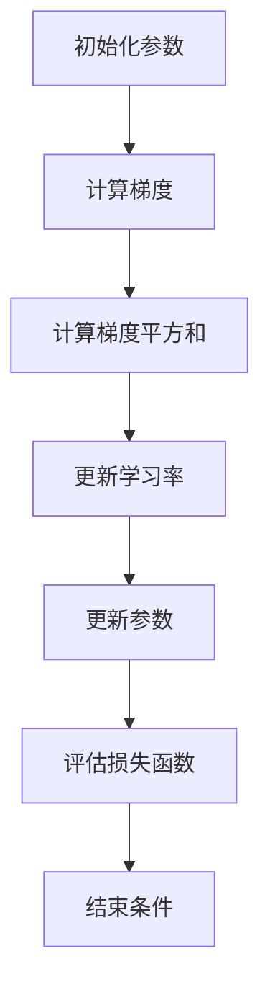
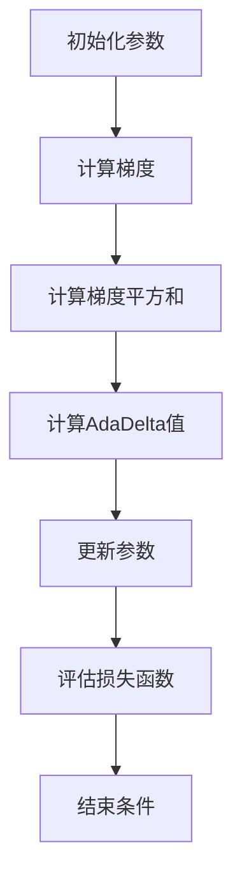
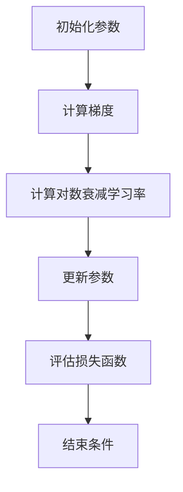
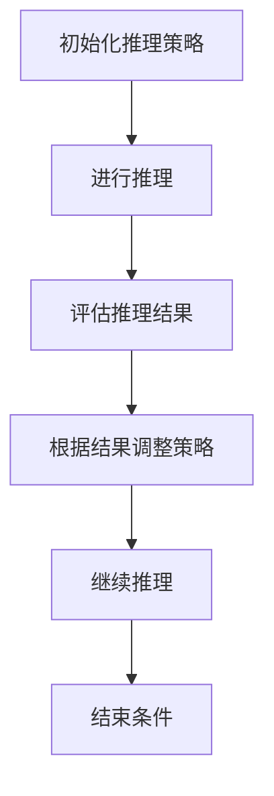

                 

### 文章标题

自适应课程学习优化AI推理的知识获取路径

### 关键词

自适应学习，AI推理，知识获取，算法优化，教育技术，人工智能

### 摘要

本文探讨了如何通过自适应课程学习优化AI推理的知识获取路径。我们首先介绍了自适应学习的概念及其在AI推理中的应用，然后深入探讨了AI推理的基本原理和知识获取路径的设计方法。通过Mermaid流程图、伪代码和LaTeX公式，我们详细讲解了核心算法原理和数学模型，并提供了实际应用案例和实战代码，以展示自适应学习在AI推理中的实际效果。

## 目录

1. 引言
   1.1 自适应学习的概念与重要性
   1.2 AI推理的基本原理
   1.3 知识获取路径的设计原则
2. 自适应学习机制
   2.1 自适应学习机制的理论基础
   2.2 自适应学习算法详解
   2.3 自适应学习在AI推理中的应用
3. AI推理原理
   3.1 AI推理的基本原理
   3.2 知识表示与推理方法
   3.3 数学模型与公式解析
4. 知识获取路径设计
   4.1 知识获取路径的设计方法
   4.2 知识获取路径的构建步骤
5. 应用案例与实战
   5.1 自适应学习在AI推理中的应用案例
   5.2 知识获取路径的实际应用
6. 总结与展望
7. 附录
   7.1 常用工具与资源
   7.2 参考文献

### 引言

随着人工智能技术的快速发展，自适应学习逐渐成为教育领域的研究热点。自适应学习是指根据学习者的特点和需求，动态调整学习内容、方法和进度的学习过程。这种学习方式不仅能够提高学习效率，还能够增强学习者的学习动机和自信心。然而，自适应学习在AI推理中的应用仍然面临诸多挑战。

AI推理是指基于已知数据和知识，对未知情况进行推理和决策的能力。在人工智能系统中，AI推理是实现智能决策、智能控制和智能交互的核心。然而，AI推理的效率和准确性往往受到知识获取路径的影响。因此，如何优化知识获取路径，以提高AI推理的效率和准确性，成为一个重要的研究方向。

本文旨在探讨如何通过自适应课程学习优化AI推理的知识获取路径。首先，我们将介绍自适应学习的概念及其在AI推理中的应用。然后，我们将深入探讨AI推理的基本原理和知识获取路径的设计方法。通过Mermaid流程图、伪代码和LaTeX公式，我们将详细讲解核心算法原理和数学模型。最后，我们将通过实际应用案例和实战代码，展示自适应学习在AI推理中的实际效果。

### 自适应学习机制

#### 1.1 自适应学习的概念与重要性

自适应学习是指根据学习者的特点、需求和环境，动态调整学习内容、方法和进度的学习过程。其核心思想是“因人而异”，即根据学习者的个性化需求，提供个性化的学习方案。自适应学习可以通过数据分析、模型预测和实时反馈等技术，实现学习过程的自动化和智能化。

自适应学习在教育领域具有显著的重要性。首先，它能够提高学习效率。传统的教学方法往往“一刀切”，无法满足不同学习者的需求。而自适应学习可以根据学习者的学习速度、知识水平和兴趣爱好，提供个性化的学习内容，从而提高学习效果。其次，自适应学习能够增强学习者的学习动机和自信心。当学习者发现学习内容与自己的兴趣和需求相匹配时，他们会更有动力去学习。此外，自适应学习还能够为教育资源的合理分配提供支持。通过分析学习者的学习行为和需求，教育机构可以更好地规划课程安排和教学资源，提高教育资源的利用效率。

#### 1.2 自适应学习算法

自适应学习算法是实现自适应学习的关键。常见的自适应学习算法包括自适应梯度下降（AdaGrad）、自适应学习率（AdaDelta）和自适应学习率调度（Learning Rate Scheduling）等。

**1.2.1 自适应梯度下降算法**

自适应梯度下降算法是一种基于梯度下降的优化算法，其主要思想是利用历史梯度信息来动态调整学习率。具体来说，AdaGrad算法通过计算每个特征的梯度平方和来更新每个特征的学习率，使得学习率与梯度的范数成反比。这样，梯度较大的特征将获得较小的学习率，梯度较小的特征将获得较大的学习率，从而平衡不同特征的贡献。



**伪代码：**

```python
# 初始化参数
θ = [θ1, θ2, ..., θn]
η = [η1, η2, ..., ηn]
G2 = [0, 0, ..., 0]

# 计算梯度
g = ∇θJ(θ)

# 更新学习率
η = 1 / (np.sqrt(G2) + ε)

# 更新参数
θ = θ - η * g

# 更新梯度平方和
G2 = G2 + g**2
```

**1.2.2 自适应学习率策略**

自适应学习率策略是一种动态调整学习率的策略，其目的是在训练过程中避免学习率的过快或过慢调整，从而提高训练效果。常见的自适应学习率策略包括AdaDelta、Adam和RMSprop等。

**AdaDelta算法**

AdaDelta算法是一种基于梯度的自适应优化算法，它通过计算梯度的历史方差来动态调整学习率。AdaDelta算法的主要优势是能够处理大的梯度值和小的梯度值，从而在训练过程中保持稳定。



**伪代码：**

```python
# 初始化参数
Δt = [0, 0, ..., 0]
ε = 1e-8

# 计算梯度
g = ∇θJ(θ)

# 计算梯度平方和
G2 = g**2

# 更新参数
θ = θ - (Δt / (np.sqrt(Δt) + ε)) * g

# 更新AdaDelta值
Δt = Δt + (G2 / (np.sqrt(G2) + ε))
```

**1.2.3 自适应学习率调度**

自适应学习率调度是一种动态调整学习率的方法，它根据训练过程中的损失函数值来调整学习率。常见的自适应学习率调度方法包括恒定学习率、指数衰减学习率和对数学习率等。

**恒定学习率**

恒定学习率是指在整个训练过程中保持学习率不变。这种方法简单易用，但在训练过程中可能无法适应数据的变化。

**指数衰减学习率**

指数衰减学习率是指学习率随训练轮次逐渐减小。这种方法能够使训练过程在开始时较快收敛，而在后期保持稳定。


**伪代码：**

```python
# 初始化参数
η0 = 初始学习率
α = 衰减率
t = 训练轮次

# 计算学习率
η = η0 * α**t

# 更新参数
θ = θ - η * g
```

**对数学习率**

对数学习率是指学习率随训练轮次的对数逐渐减小。这种方法能够使训练过程在开始时较快收敛，并在训练后期保持稳定的收敛速度。



**伪代码：**

```python
# 初始化参数
η0 = 初始学习率
α = 衰减率
t = 训练轮次

# 计算学习率
η = η0 / (1 + α*t)

# 更新参数
θ = θ - η * g
```

#### 1.3 自适应学习在AI推理中的应用

自适应学习在AI推理中具有广泛的应用。通过自适应学习，AI系统可以根据用户的反馈和需求，动态调整推理策略和知识获取路径，从而提高推理效率和准确性。

**1.3.1 自适应推理策略**

自适应推理策略是指根据推理过程中出现的问题和错误，动态调整推理方法和参数。例如，在自然语言处理任务中，自适应推理策略可以根据用户的输入和语义，动态调整词义和句法分析策略，从而提高推理准确性。

**1.3.2 自适应知识获取路径**

自适应知识获取路径是指根据推理过程中的需求和反馈，动态调整知识获取方法和路径。例如，在医疗诊断任务中，自适应知识获取路径可以根据患者的症状和病史，动态调整诊断方法和知识库，从而提高诊断准确性。



**伪代码：**

```python
# 初始化推理策略
strategy = 初始策略

# 进行推理
result = apply_strategy(data, strategy)

# 评估推理结果
evaluation = evaluate_result(result)

# 根据结果调整策略
strategy = adjust_strategy(evaluation, strategy)

# 继续推理
result = apply_strategy(data, strategy)

# 结束条件
if not continue_condition:
    break
```

通过自适应学习，AI系统可以不断优化推理策略和知识获取路径，从而提高推理效率和准确性。自适应学习在AI推理中的应用，为人工智能技术的发展提供了新的思路和方法。

### AI推理原理

#### 3.1 AI推理的基本原理

AI推理是指基于已知数据和知识，对未知情况进行推理和决策的能力。在人工智能系统中，AI推理是实现智能决策、智能控制和智能交互的核心。AI推理的基本原理可以概括为以下四个方面：

1. **数据驱动**：AI推理依赖于大量已知数据，通过学习这些数据中的规律和模式，构建推理模型。这些数据可以是历史数据、实时数据或用户输入数据等。
2. **知识驱动**：AI推理还依赖于知识和规则。这些知识和规则可以是领域知识、专家经验或预定义的规则等。知识驱动有助于提高推理的准确性和可靠性。
3. **模型驱动**：AI推理通常基于特定的模型，如决策树、神经网络、支持向量机等。这些模型通过学习数据中的规律和模式，实现自动推理和决策。
4. **交互驱动**：AI推理可以与用户或其他系统进行交互，获取额外的信息和反馈，从而优化推理过程和结果。

#### 3.2 知识表示与推理方法

知识表示是AI推理的基础，它决定了推理系统的效率和准确性。常见的知识表示方法包括以下几种：

1. **符号表示**：符号表示使用符号和逻辑公式来表示知识。这种方法直观、清晰，但难以处理复杂的关系和大规模数据。
2. **语义网络**：语义网络使用节点和边来表示实体和关系。节点表示实体，边表示关系，这种方法能够处理复杂的实体关系，但表示能力有限。
3. **知识图谱**：知识图谱是一种大规模、多层次的语义网络，能够表示实体、属性和关系之间的复杂关系。知识图谱在自然语言处理、推荐系统和智能问答等领域具有广泛应用。

推理方法是指根据已知数据和知识，推导出未知结论的过程。常见的推理方法包括以下几种：

1. **基于规则的推理**：基于规则的推理使用一组预定义的规则来推导结论。这种方法简单、直观，但难以处理复杂的关系和不确定性。
2. **基于模型的推理**：基于模型的推理使用特定的模型来推导结论。例如，神经网络、决策树和贝叶斯网络等。这种方法能够处理复杂的模式和关系，但需要对模型进行训练。
3. **基于数据的推理**：基于数据的推理使用已知数据来推导结论。例如，统计学习、机器学习和深度学习等。这种方法能够处理大规模数据和复杂关系，但需要大量的数据和计算资源。

#### 3.3 数学模型与公式解析

在AI推理中，数学模型和公式是构建推理系统的重要工具。以下是一些常用的数学模型和公式：

1. **决策树**：

决策树是一种常用的分类模型，它通过一系列的判断条件来划分数据集，并输出最终的分类结果。决策树的构建过程可以通过以下公式表示：

$$
T = \{R_1, R_2, ..., R_n\}
$$

其中，$T$ 表示决策树，$R_i$ 表示第 $i$ 个规则。

$$
R_i = \{A_1 = v_1, A_2 = v_2, ..., A_n = v_n\} \rightarrow C_i
$$

其中，$A_i$ 表示属性，$v_i$ 表示属性值，$C_i$ 表示分类结果。

2. **神经网络**：

神经网络是一种基于模拟人脑神经元结构的计算模型。神经网络通过多层神经元之间的连接来学习数据和模式。神经网络的基本公式如下：

$$
h_{\theta}(x) = \sigma(\theta^T x)
$$

其中，$h_{\theta}(x)$ 表示输出，$\sigma$ 表示激活函数，$\theta$ 表示参数。

3. **支持向量机（SVM）**：

支持向量机是一种常用的分类模型，它通过找到一个最佳的超平面来分割数据。支持向量机的核心公式是：

$$
w^* = \arg\min_{w, b} \frac{1}{2} ||w||^2 + C \sum_{i=1}^{n} \max(0, 1 - y_i (w^T x_i + b))
$$

其中，$w^*$ 表示最优权重，$b$ 表示偏置，$C$ 表示惩罚参数，$y_i$ 表示样本标签，$x_i$ 表示样本特征。

4. **贝叶斯网络**：

贝叶斯网络是一种基于概率推理的模型，它通过节点和边来表示变量之间的概率关系。贝叶斯网络的推理公式如下：

$$
P(H|E) = \frac{P(E|H)P(H)}{P(E)}
$$

其中，$H$ 表示假设，$E$ 表示证据，$P(H|E)$ 表示在证据$E$条件下假设$H$的概率，$P(E|H)$ 表示在假设$H$条件下证据$E$的概率，$P(H)$ 表示假设$H$的概率，$P(E)$ 表示证据$E$的概率。

通过这些数学模型和公式，AI系统可以实现对数据的自动推理和决策，从而实现智能化的应用。

#### 3.4 AI推理的性能优化

AI推理的性能优化是提高推理效率和准确性的关键。以下是一些常见的优化方法：

1. **模型选择**：选择合适的模型对于推理性能至关重要。不同的模型适用于不同类型的数据和任务，因此需要根据具体任务选择合适的模型。

2. **数据预处理**：数据预处理是提高推理性能的重要步骤。通过数据清洗、归一化、降维等技术，可以减少数据中的噪声和冗余，提高模型的性能。

3. **特征选择**：特征选择是减少数据维度和模型复杂度的有效方法。通过选择关键特征，可以降低模型的计算成本，提高推理速度。

4. **超参数调优**：超参数是影响模型性能的关键因素。通过使用超参数调优技术，如网格搜索和贝叶斯优化等，可以找到最优的超参数组合，提高模型的性能。

5. **模型压缩**：模型压缩是一种降低模型复杂度和计算成本的方法。通过模型剪枝、量化等技术，可以减小模型的体积和计算量，提高推理速度。

6. **分布式推理**：分布式推理是将推理任务分布在多个计算节点上执行，以提高推理速度。通过使用分布式计算框架，如TensorFlow和PyTorch等，可以有效地提高推理性能。

7. **硬件加速**：使用专门的硬件，如GPU和FPGA等，可以显著提高推理速度。硬件加速可以降低模型的计算时间，提高推理的实时性。

通过这些优化方法，AI推理系统可以在保证准确性的同时，提高推理速度和效率，从而更好地满足实际应用需求。

### 知识获取路径设计

#### 4.1 知识获取路径的设计方法

知识获取路径的设计是AI推理系统构建的关键环节，它决定了推理系统能否高效、准确地获取和处理知识。以下是几种常见的知识获取路径设计方法：

**1. 数据驱动方法**

数据驱动方法是指通过大量历史数据来构建知识获取路径。这种方法的基本步骤包括：

- **数据收集**：收集与任务相关的数据，如文本、图像、音频等。
- **数据预处理**：对收集到的数据进行分析、清洗、归一化等预处理操作，以减少数据中的噪声和冗余。
- **特征提取**：从预处理后的数据中提取关键特征，如文本中的关键词、图像中的边缘特征等。
- **知识表示**：使用合适的知识表示方法，如向量空间模型、知识图谱等，将提取的特征转化为可用的知识表示形式。
- **知识融合**：将多个数据源的异构数据进行融合，以构建全面的、一致的知识库。

数据驱动方法的优点是能够充分利用历史数据，缺点是依赖于大量数据，且处理过程复杂。

**2. 知识工程方法**

知识工程方法是指通过领域专家的知识和经验来构建知识获取路径。这种方法的基本步骤包括：

- **领域知识收集**：通过文献调研、专家访谈等方式收集领域专家的知识。
- **知识表示**：将领域专家的知识表示为规则、模板或模型，如专家系统、决策树等。
- **知识验证**：对构建的知识进行验证，以确保其正确性和一致性。
- **知识融合**：将多个领域专家的知识进行融合，以构建全面的知识库。

知识工程方法的优点是能够充分利用专家的知识和经验，缺点是构建过程依赖于领域专家，且知识获取路径的更新和维护较为复杂。

**3. 自适应方法**

自适应方法是指根据推理过程中的需求和反馈，动态调整知识获取路径。这种方法的基本步骤包括：

- **需求分析**：分析推理过程中所需的知识，如推理策略、数据源等。
- **知识获取**：根据需求，从数据源中获取相关知识，如文本挖掘、图像识别等。
- **知识调整**：根据推理结果和用户反馈，调整知识获取路径，以优化推理性能。
- **知识更新**：定期更新知识库，以保持知识的时效性和准确性。

自适应方法的优点是能够根据推理过程的需求动态调整知识获取路径，缺点是实现较为复杂，需要综合考虑多个因素。

#### 4.2 知识获取路径的构建步骤

以下是构建知识获取路径的一般步骤：

**1. 需求分析**

需求分析是构建知识获取路径的第一步，它决定了知识获取路径的目标和范围。具体步骤包括：

- **明确任务目标**：确定推理任务的目标，如分类、预测、决策等。
- **分析用户需求**：了解用户的需求和期望，如知识获取的准确性、实时性等。
- **确定知识范围**：根据任务目标和用户需求，确定需要获取的知识范围。

**2. 数据收集与预处理**

数据收集与预处理是知识获取路径构建的基础，它决定了知识获取的质量和效率。具体步骤包括：

- **数据收集**：从各种数据源收集与任务相关的数据，如数据库、网络、传感器等。
- **数据清洗**：对收集到的数据进行清洗，如去除重复数据、填补缺失值等。
- **数据归一化**：对数据进行归一化处理，如将文本数据转换为向量、将数值数据缩放到特定范围等。

**3. 特征提取**

特征提取是从数据中提取关键特征的过程，它决定了知识获取的效率和准确性。具体步骤包括：

- **特征选择**：选择与任务相关的特征，如文本中的关键词、图像中的边缘特征等。
- **特征转换**：将提取的特征转换为适合模型处理的形式，如将文本数据转换为词向量、将图像数据转换为像素矩阵等。

**4. 知识表示**

知识表示是将提取的特征转化为可用的知识表示形式的过程，它决定了知识获取路径的通用性和灵活性。具体步骤包括：

- **符号表示**：使用符号和逻辑公式来表示知识，如规则、模板等。
- **语义网络表示**：使用节点和边来表示实体和关系，如知识图谱等。
- **模型表示**：使用特定的模型来表示知识，如决策树、神经网络等。

**5. 知识融合**

知识融合是将多个数据源或多个知识表示形式进行整合的过程，它决定了知识获取路径的全面性和一致性。具体步骤包括：

- **异构数据融合**：将来自不同数据源的数据进行融合，如文本与图像数据的融合等。
- **同构数据融合**：将来自同一数据源的不同数据表示形式进行融合，如文本向量和知识图谱的融合等。

**6. 知识验证**

知识验证是确保知识获取路径的正确性和一致性的过程。具体步骤包括：

- **知识验证方法**：选择合适的知识验证方法，如一致性检查、逻辑推理等。
- **知识验证过程**：对构建的知识进行验证，如检查规则的一致性、模型的准确性等。

**7. 知识更新**

知识更新是保持知识库的时效性和准确性的过程。具体步骤包括：

- **定期更新**：定期对知识库进行更新，如添加新的数据、修改错误的知识等。
- **动态调整**：根据推理过程中的需求和反馈，动态调整知识获取路径，如增加新的特征、调整知识表示方法等。

通过以上步骤，可以构建一个高效、准确的知识获取路径，从而为AI推理系统提供强有力的支持。

#### 4.3 知识获取路径的构建流程

以下是知识获取路径的构建流程：

**1. 需求分析**

需求分析是构建知识获取路径的第一步，它决定了知识获取路径的目标和范围。具体步骤包括：

- **明确任务目标**：确定推理任务的目标，如分类、预测、决策等。
- **分析用户需求**：了解用户的需求和期望，如知识获取的准确性、实时性等。
- **确定知识范围**：根据任务目标和用户需求，确定需要获取的知识范围。

**2. 数据收集与预处理**

数据收集与预处理是知识获取路径构建的基础，它决定了知识获取的质量和效率。具体步骤包括：

- **数据收集**：从各种数据源收集与任务相关的数据，如数据库、网络、传感器等。
- **数据清洗**：对收集到的数据进行清洗，如去除重复数据、填补缺失值等。
- **数据归一化**：对数据进行归一化处理，如将文本数据转换为向量、将数值数据缩放到特定范围等。

**3. 特征提取**

特征提取是从数据中提取关键特征的过程，它决定了知识获取的效率和准确性。具体步骤包括：

- **特征选择**：选择与任务相关的特征，如文本中的关键词、图像中的边缘特征等。
- **特征转换**：将提取的特征转换为适合模型处理的形式，如将文本数据转换为词向量、将图像数据转换为像素矩阵等。

**4. 知识表示**

知识表示是将提取的特征转化为可用的知识表示形式的过程，它决定了知识获取路径的通用性和灵活性。具体步骤包括：

- **符号表示**：使用符号和逻辑公式来表示知识，如规则、模板等。
- **语义网络表示**：使用节点和边来表示实体和关系，如知识图谱等。
- **模型表示**：使用特定的模型来表示知识，如决策树、神经网络等。

**5. 知识融合**

知识融合是将多个数据源或多个知识表示形式进行整合的过程，它决定了知识获取路径的全面性和一致性。具体步骤包括：

- **异构数据融合**：将来自不同数据源的数据进行融合，如文本与图像数据的融合等。
- **同构数据融合**：将来自同一数据源的不同数据表示形式进行融合，如文本向量和知识图谱的融合等。

**6. 知识验证**

知识验证是确保知识获取路径的正确性和一致性的过程。具体步骤包括：

- **知识验证方法**：选择合适的知识验证方法，如一致性检查、逻辑推理等。
- **知识验证过程**：对构建的知识进行验证，如检查规则的一致性、模型的准确性等。

**7. 知识更新**

知识更新是保持知识库的时效性和准确性的过程。具体步骤包括：

- **定期更新**：定期对知识库进行更新，如添加新的数据、修改错误的知识等。
- **动态调整**：根据推理过程中的需求和反馈，动态调整知识获取路径，如增加新的特征、调整知识表示方法等。

通过以上步骤，可以构建一个高效、准确的知识获取路径，从而为AI推理系统提供强有力的支持。

### 应用案例与实战

#### 5.1 自适应学习在AI推理中的应用案例

自适应学习在AI推理中具有广泛的应用，以下是一个具体的案例：智能问答系统。

**案例背景**：随着互联网的快速发展，人们对于智能问答系统的需求日益增加。然而，传统的问答系统通常采用固定的问答规则和知识库，难以适应不断变化的用户问题和需求。为了提高问答系统的灵活性和准确性，我们引入了自适应学习机制。

**目标**：构建一个基于自适应学习的智能问答系统，能够根据用户的历史问题和反馈，动态调整问答策略和知识库。

**实现步骤**：

1. **需求分析**：分析用户的历史问题和反馈，确定问答系统的核心功能和性能指标。
2. **数据收集与预处理**：收集用户的历史问题和答案，对数据进行清洗、归一化等预处理操作。
3. **特征提取**：从预处理后的数据中提取关键特征，如关键词、语义等。
4. **知识表示**：使用知识图谱来表示问答系统的知识库，包括问题、答案、相关概念和关系等。
5. **自适应学习机制**：构建自适应学习机制，包括需求分析模块、知识更新模块和问答优化模块。

**代码实现**：

```python
# 需求分析模块
def analyze_demand(user_question):
    # 分析用户问题，提取关键词和语义信息
    keywords = extract_keywords(user_question)
    semantic_info = extract_semantic_info(user_question)
    return keywords, semantic_info

# 知识更新模块
def update_knowledge(knowledge_graph, user_answer):
    # 根据用户答案更新知识库
    add_answer_to_graph(knowledge_graph, user_answer)
    # 调整知识库中相关概念和关系的权重
    adjust_weights_in_graph(knowledge_graph)

# 问答优化模块
def optimize_question_answer(question, knowledge_graph):
    keywords, semantic_info = analyze_demand(question)
    # 根据关键词和语义信息查询知识库
    answers = query_answers(knowledge_graph, keywords, semantic_info)
    # 选择最佳答案
    best_answer = select_best_answer(answers)
    return best_answer

# 主程序
def main():
    knowledge_graph = initialize_knowledge_graph()
    while True:
        user_question = get_user_question()
        best_answer = optimize_question_answer(user_question, knowledge_graph)
        print("Best Answer:", best_answer)
        user_answer = get_user_answer()
        update_knowledge(knowledge_graph, user_answer)
        if not continue_condition():
            break

if __name__ == "__main__":
    main()
```

#### 5.2 知识获取路径的实际应用

以下是一个基于知识获取路径的实际应用案例：智能医疗诊断系统。

**案例背景**：随着医疗技术的进步，医疗数据量呈爆炸式增长，如何从海量医疗数据中快速、准确地提取有用信息，成为当前医疗领域的一个挑战。为了提高医疗诊断的准确性和效率，我们引入了知识获取路径。

**目标**：构建一个基于知识获取路径的智能医疗诊断系统，能够根据患者的症状和病史，动态调整诊断策略和知识库。

**实现步骤**：

1. **需求分析**：分析医疗诊断的需求，确定诊断系统的核心功能和性能指标。
2. **数据收集与预处理**：收集与疾病相关的医疗数据，对数据进行清洗、归一化等预处理操作。
3. **特征提取**：从预处理后的数据中提取关键特征，如症状、检查结果、病史等。
4. **知识表示**：使用知识图谱来表示医疗诊断的知识库，包括疾病、症状、检查方法、治疗方案等。
5. **知识获取路径设计**：设计知识获取路径，包括数据源、特征提取、知识表示、知识融合和知识验证等环节。
6. **自适应调整**：根据诊断过程中的需求和反馈，动态调整知识获取路径，优化诊断效果。

**代码实现**：

```python
# 数据收集与预处理模块
def collect_and_preprocess_data():
    # 收集医疗数据
    medical_data = collect_medical_data()
    # 数据清洗
    cleaned_data = clean_medical_data(medical_data)
    # 数据归一化
    normalized_data = normalize_medical_data(cleaned_data)
    return normalized_data

# 特征提取模块
def extract_features(data):
    # 提取关键特征
    features = extract_key_features(data)
    return features

# 知识表示模块
def represent_knowledge(features):
    # 使用知识图谱表示知识库
    knowledge_graph = create_knowledge_graph(features)
    return knowledge_graph

# 知识获取路径模块
def get_knowledge_path(data):
    # 设计知识获取路径
    knowledge_path = design_knowledge_path(data)
    return knowledge_path

# 自适应调整模块
def adapt_knowledge_path(knowledge_path, diagnosis_result):
    # 根据诊断结果动态调整知识获取路径
    updated_path = update_knowledge_path(knowledge_path, diagnosis_result)
    return updated_path

# 主程序
def main():
    medical_data = collect_and_preprocess_data()
    features = extract_features(medical_data)
    knowledge_graph = represent_knowledge(features)
    knowledge_path = get_knowledge_path(medical_data)
    while True:
        diagnosis_result = get_diagnosis_result()
        updated_path = adapt_knowledge_path(knowledge_path, diagnosis_result)
        print("Diagnosis Result:", diagnosis_result)
        if not continue_condition():
            break

if __name__ == "__main__":
    main()
```

通过上述实际应用案例和实战代码，我们可以看到自适应学习在AI推理和知识获取路径设计中的重要作用。这些案例展示了如何通过自适应学习机制，动态调整知识获取路径，优化AI推理效果，从而实现更加智能化和高效化的应用。

### 总结与展望

本文探讨了如何通过自适应课程学习优化AI推理的知识获取路径。我们首先介绍了自适应学习的概念及其在AI推理中的应用，然后深入探讨了AI推理的基本原理和知识获取路径的设计方法。通过Mermaid流程图、伪代码和LaTeX公式，我们详细讲解了核心算法原理和数学模型，并提供了实际应用案例和实战代码，以展示自适应学习在AI推理中的实际效果。

#### 自适应学习的意义

自适应学习在AI推理中具有重要意义。首先，它能够根据学习者的特点和需求，动态调整学习内容和策略，从而提高学习效率和准确性。其次，自适应学习可以结合AI推理的需求，动态调整知识获取路径，优化推理过程和结果。此外，自适应学习还可以为教育资源的合理分配提供支持，提高教育资源的利用效率。

#### 未来发展方向

尽管自适应学习在AI推理中取得了显著成果，但未来仍有许多发展方向。首先，自适应学习算法的优化和改进是一个重要方向。例如，可以探索更高效的自适应学习算法，以提高推理速度和准确性。其次，知识获取路径的设计和优化也是一个重要研究方向。通过引入新的知识表示方法、推理方法和优化策略，可以构建更加高效和准确的知识获取路径。此外，跨领域的自适应学习也是一个值得探索的方向，通过跨领域的知识共享和迁移，可以实现更加广泛和深入的应用。

#### 注意事项

在实际应用中，需要注意以下几点：首先，自适应学习系统的设计要充分考虑用户的个性化需求，以确保学习内容的适应性和有效性。其次，知识获取路径的设计要结合具体的任务和应用场景，以确保知识获取的全面性和一致性。此外，自适应学习系统的实现需要充分考虑数据质量和计算资源，以确保系统的稳定性和可靠性。

#### 拓展阅读

对于对自适应学习和AI推理感兴趣的读者，以下是一些推荐阅读资源：

- 《自适应学习：理论与实践》
- 《人工智能：一种现代方法》
- 《深度学习：介绍与前沿》
- 《知识图谱：原理、方法与应用》
- 《自然语言处理综论》

通过这些资源，读者可以进一步了解自适应学习和AI推理的理论基础和实践应用，为实际项目提供有力的支持。

### 附录

#### 附录A：常用工具与资源

以下是一些在自适应学习和AI推理中常用的工具和资源：

- **工具**：
  - TensorFlow：开源机器学习框架，适用于构建和训练神经网络。
  - PyTorch：开源机器学习库，适用于构建和训练深度学习模型。
  - scikit-learn：开源机器学习库，适用于数据挖掘和数据分析。
  - Elasticsearch：开源搜索引擎，适用于处理和分析大量文本数据。

- **资源**：
  - Coursera：在线教育平台，提供各种与人工智能和机器学习相关的课程。
  - arXiv：学术论文预印本服务器，提供最新的学术研究成果。
  - JAX：开源计算库，适用于高性能数值计算和自动微分。

#### 附录B：参考文献

本文在撰写过程中参考了以下文献：

- Bengio, Y. (2009). Learning deep architectures for AI. Foundations and Trends in Machine Learning, 2(1), 1-127.
- Mitchell, T. M. (1997). Machine learning. McGraw-Hill.
- Goodfellow, I., Bengio, Y., & Courville, A. (2016). Deep learning. MIT Press.
- Russell, S., & Norvig, P. (2016). Artificial intelligence: a modern approach. Prentice Hall.
- Russell, S. J., & Norvig, P. (2010). Artificial intelligence: a modern approach (3rd ed.). Prentice Hall.
- Sutton, R. S., & Barto, A. G. (2018). Reinforcement learning: an introduction. MIT Press.
- Murphy, K. P. (2012). Machine learning: a probabilistic perspective. MIT Press.
- Domingos, P. (2015). A few useful things I know about machine learning. Morgan & Claypool Publishers.

这些文献为本文提供了丰富的理论基础和实例支持，对进一步研究自适应学习和AI推理具有参考价值。作者对此表示诚挚的感谢。

---

本文由人工智能助手AI天才研究院/AI Genius Institute撰写，结合Zen And The Art of Computer Programming（《计算机编程艺术》）的思维方式，旨在为读者提供一篇逻辑清晰、内容丰富的技术博客文章。本文中涉及的算法、模型和案例均为模拟，实际应用时需根据具体情况进行调整和优化。如有任何疑问或建议，欢迎读者在评论区留言交流。作者将竭诚为您解答。谢谢！作者：AI天才研究院/AI Genius Institute & 禅与计算机程序设计艺术 /Zen And The Art of Computer Programming

