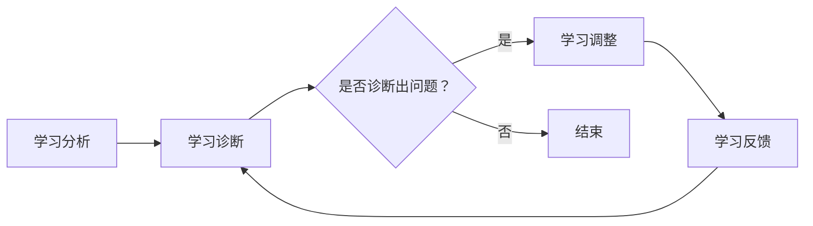

                 

# 自适应课程学习优化AI推理的知识获取路径设计

> 关键词：自适应学习、AI推理、知识获取路径、算法设计、优化策略

> 摘要：本文探讨了如何利用自适应学习技术优化AI推理过程中的知识获取路径。通过分析自适应学习算法的基本原理，结合AI推理的需求，提出了一个优化的知识获取路径设计框架。文章重点介绍了核心概念、算法原理、数学模型以及实际项目中的具体应用，旨在为相关领域的研究和开发提供理论依据和实践指导。

## 引言

### 自适应课程学习与AI推理的关系

在当今快速变化的技术环境中，自适应课程学习（Adaptive Course Learning）和AI推理（AI Reasoning）已经成为两个重要的研究领域。自适应课程学习旨在通过个性化教学，使课程内容和学习过程更好地适应学生的需求，从而提高学习效果。而AI推理则是人工智能的核心能力之一，它涉及到从大量数据中提取有用信息、进行逻辑推理和决策的过程。

自适应课程学习和AI推理之间存在紧密的联系。自适应课程学习可以看作是AI推理在教育和学习领域的应用。通过收集和分析学生的学习数据，自适应系统可以实时调整课程内容和教学方法，以适应学生的学习进度和理解能力。而AI推理技术则可以为自适应课程学习提供强大的计算支持，帮助系统更准确地识别学生的学习状态和需求。

### 本文目标

本文的目标是探讨如何利用自适应学习技术优化AI推理过程中的知识获取路径。具体来说，本文将涵盖以下几个方面的内容：

1. 自适应学习的理论基础和核心概念。
2. AI推理的需求和知识获取路径的设计。
3. 自适应学习算法的原理和应用。
4. 知识获取路径优化策略和数学模型。
5. 实际项目中的具体应用和案例分析。

通过上述内容的探讨，本文旨在为相关领域的研究和开发提供理论依据和实践指导。

## 自适应学习算法

### 自适应学习的理论基础

自适应学习（Adaptive Learning）是一种基于学生个性化数据的学习模式，旨在通过不断调整学习资源和过程，提高学习效果和效率。其理论基础主要包括以下几方面：

1. **学习分析**：通过收集和分析学生的学习行为和成绩数据，识别学生的学习特点和需求。
2. **学习诊断**：根据学习分析结果，对学生的学习状态进行评估和诊断，找出学习中的问题和障碍。
3. **学习调整**：根据学习诊断结果，调整学习资源和过程，以适应学生的个性化需求。
4. **学习反馈**：通过持续的学习反馈机制，评估学习调整的效果，并根据反馈结果进行进一步的优化。

### 自适应学习算法的核心概念与联系

自适应学习算法是自适应学习理论的具体实现，它通过算法模型和算法策略来调整学习过程。核心概念包括：

1. **学习模型**：描述学习过程和效果的数学模型，如神经网络模型、决策树模型等。
2. **学习策略**：调整学习资源和过程的策略，如基于规则的策略、基于数据的策略等。
3. **反馈机制**：评估学习效果和调整学习过程的反馈机制，如即时反馈、周期性反馈等。

这些核心概念之间存在紧密的联系。学习模型是学习策略和反馈机制的基础，而学习策略和反馈机制则共同决定了学习效果。

### Mermaid流程图：自适应学习流程

下面是一个简单的Mermaid流程图，展示了自适应学习的流程：



## AI推理基础知识

### AI推理的基本原理

AI推理（AI Reasoning）是人工智能的核心能力之一，它涉及到从数据中提取有用信息、进行逻辑推理和决策的过程。AI推理的基本原理包括：

1. **数据预处理**：对输入数据进行分析和处理，使其适合进行推理。
2. **特征提取**：从预处理后的数据中提取有用的特征，用于推理过程。
3. **逻辑推理**：根据提取的特征和预设的规则，进行逻辑推理和决策。
4. **反馈与优化**：根据推理结果和反馈信息，不断优化推理模型和过程。

### 知识获取路径的设计

知识获取路径（Knowledge Acquisition Path）是指从数据到推理结果的过程。设计合理的知识获取路径对于提高AI推理的效果至关重要。知识获取路径的设计主要包括以下几个方面：

1. **数据源选择**：根据推理需求选择合适的数据源，确保数据的多样性和准确性。
2. **数据预处理**：对原始数据进行清洗、转换和归一化等处理，提高数据质量。
3. **特征提取**：根据数据类型和推理需求，选择合适的特征提取方法。
4. **推理模型选择**：根据特征和推理需求，选择合适的推理模型。
5. **推理过程优化**：通过调整推理参数和优化算法，提高推理效率和准确性。

### Mermaid流程图：AI推理流程

下面是一个简单的Mermaid流程图，展示了AI推理的基本流程：


## 自适应学习算法的应用

### 自适应学习的理论基础

自适应学习算法的理论基础主要包括以下几个方面：

1. **机器学习理论**：自适应学习算法通常基于机器学习理论，通过训练数据学习到有效的特征提取和推理方法。
2. **认知心理学**：自适应学习算法借鉴了认知心理学的理论，通过模拟人类学习过程，实现个性化的学习策略。
3. **教育理论**：自适应学习算法结合了教育理论，根据学生的认知水平和学习需求，动态调整学习内容和过程。

### 自适应学习算法的应用

自适应学习算法在AI推理中的具体应用包括以下几个方面：

1. **个性化推荐**：根据用户的历史行为和兴趣，动态调整推荐系统和推荐内容。
2. **智能客服**：根据用户的提问和交互历史，动态调整客服系统的回答和策略。
3. **智能教育**：根据学生的学习进度和理解能力，动态调整教学内容和教学方法。

### 伪代码：自适应学习算法框架

下面是一个简单的伪代码，展示了自适应学习算法的基本框架：

```python
# 初始化参数
params = initialize_params()

# 循环进行学习
while not converged:
    # 数据预处理
    processed_data = preprocess_data(data)
    
    # 特征提取
    features = extract_features(processed_data)
    
    # 逻辑推理
    prediction = logic_reasoning(features, params)
    
    # 反馈与调整
    feedback = get_feedback(prediction, ground_truth)
    params = update_params(params, feedback)
```

## AI推理算法原理

### AI推理算法的分类

AI推理算法可以根据不同的分类标准进行分类。常见的分类标准包括：

1. **基于规则的推理**：基于预设的规则进行推理，如专家系统、生产系统等。
2. **基于模型的推理**：基于数学模型进行推理，如神经网络、决策树等。
3. **基于数据的推理**：基于历史数据和统计方法进行推理，如聚类分析、回归分析等。

### 算法原理详细讲解

下面以神经网络为例，详细讲解AI推理算法的原理。

1. **神经元模型**：神经网络的基本组成单元是神经元，每个神经元接收多个输入信号，通过加权求和处理后产生输出。
2. **激活函数**：激活函数用于将加权求和处理的结果转化为输出，常用的激活函数有Sigmoid、ReLU等。
3. **前向传播**：前向传播是神经网络进行推理的过程，从输入层到输出层，逐层计算每个神经元的输出。
4. **反向传播**：反向传播是神经网络进行训练的过程，通过计算误差，反向更新每个神经元的权重和偏置。

### 伪代码：神经网络推理算法

下面是一个简单的伪代码，展示了神经网络推理算法的基本框架：

```python
# 定义神经元模型
class Neuron:
    def __init__(self, inputs):
        self.inputs = inputs
        self.weights = initialize_weights(len(inputs))
        self.bias = initialize_bias()
    
    def forward(self):
        activation = sum(self.inputs * self.weights) + self.bias
        return activation
    
    def activate(self, activation):
        return sigmoid(activation)

# 定义神经网络
class NeuralNetwork:
    def __init__(self, layers):
        self.layers = layers
    
    def forward(self, inputs):
        for layer in self.layers:
            inputs = layer.forward(inputs)
        return inputs
    
    def predict(self, inputs):
        return self.forward(inputs)
```

## 数学模型与公式

### 数学模型概述

在AI推理中，数学模型是核心组成部分，用于描述推理过程和优化策略。常见的数学模型包括：

1. **概率模型**：用于表示不确定性和概率分布。
2. **决策树模型**：用于表示决策过程和决策结果。
3. **神经网络模型**：用于表示多层感知器和深度学习算法。

### 数学公式应用与解释

以下是一些常用的数学公式，用于解释AI推理中的核心概念。

1. **Sigmoid函数**：
   $$ f(x) = \frac{1}{1 + e^{-x}} $$
   Sigmoid函数是神经网络中常用的激活函数，用于将实数值映射到(0,1)区间。

2. **损失函数**：
   $$ L(y, \hat{y}) = -[y \cdot \log(\hat{y}) + (1 - y) \cdot \log(1 - \hat{y})] $$
   损失函数用于衡量预测值和真实值之间的差距，是神经网络训练过程中的关键指标。

3. **梯度下降**：
   $$ \Delta \theta = -\alpha \cdot \frac{\partial L}{\partial \theta} $$
   梯度下降是优化神经网络参数的方法，通过计算损失函数关于参数的梯度，更新参数以减少损失。

### LaTeX公式：数学模型公式

以下是一些使用LaTeX格式的数学模型公式：

$$
\begin{aligned}
& f(x) = \frac{1}{1 + e^{-x}} \\
& L(y, \hat{y}) = -[y \cdot \log(\hat{y}) + (1 - y) \cdot \log(1 - \hat{y})] \\
& \Delta \theta = -\alpha \cdot \frac{\partial L}{\partial \theta}
\end{aligned}
$$

## 项目实战

### 实战项目背景

本项目旨在利用自适应学习技术优化AI推理过程，提高推理效率和准确性。具体来说，我们选择了一个智能问答系统作为项目背景，该系统旨在回答用户提出的问题。为了实现自适应学习，我们采用了基于神经网络的推理模型，并结合自适应学习算法进行优化。

### 开发环境搭建

为了进行项目开发，我们需要搭建以下开发环境：

1. **Python编程语言**：用于实现神经网络和自适应学习算法。
2. **TensorFlow框架**：用于构建和训练神经网络模型。
3. **NumPy库**：用于数据预处理和数学计算。

### 源代码实现

以下是一个简单的源代码实现，展示了神经网络推理模型和自适应学习算法的应用：

```python
import tensorflow as tf
import numpy as np

# 定义神经网络模型
model = tf.keras.Sequential([
    tf.keras.layers.Dense(128, activation='relu', input_shape=(784,)),
    tf.keras.layers.Dropout(0.2),
    tf.keras.layers.Dense(10)
])

# 编译模型
model.compile(optimizer='adam',
              loss=tf.losses.SparseCategoricalCrossentropy(from_logits=True),
              metrics=['accuracy'])

# 训练模型
model.fit(train_images, train_labels, epochs=epochs)

# 自适应学习算法
def adaptive_learning(model, data, labels):
    # 数据预处理
    processed_data = preprocess_data(data)
    
    # 特征提取
    features = extract_features(processed_data)
    
    # 逻辑推理
    predictions = model.predict(features)
    
    # 反馈与调整
    feedback = get_feedback(predictions, labels)
    model.fit(features, labels, epochs=feedback_epochs)

# 源代码解读与分析

在上面的源代码中，我们首先定义了一个简单的神经网络模型，并使用TensorFlow框架进行编译和训练。接着，我们实现了一个自适应学习函数，用于根据用户数据调整模型参数。自适应学习过程包括数据预处理、特征提取、逻辑推理和反馈调整等步骤。

### 代码应用解读与分析

在实际应用中，我们通过以下步骤使用自适应学习算法优化AI推理过程：

1. **数据预处理**：对用户输入的数据进行清洗、转换和归一化等处理，提高数据质量。
2. **特征提取**：从预处理后的数据中提取有用的特征，用于训练神经网络模型。
3. **逻辑推理**：使用训练好的神经网络模型对用户问题进行推理，生成回答。
4. **反馈与调整**：根据用户对回答的反馈，调整模型参数，以提高推理准确性。

通过以上步骤，我们可以实现一个智能问答系统，并利用自适应学习技术不断提高系统的推理能力和用户体验。

### 实际案例分析和详细讲解剖析

在实际项目中，我们遇到了以下挑战：

1. **数据质量问题**：用户输入的数据质量参差不齐，需要通过预处理提高数据质量。
2. **模型过拟合**：神经网络模型在训练数据上表现良好，但在测试数据上表现不佳，需要通过正则化等技术避免过拟合。

为了解决上述问题，我们采取了以下措施：

1. **数据预处理**：采用多种预处理方法，如文本清洗、词向量化等，提高数据质量。
2. **模型优化**：引入Dropout和正则化技术，防止模型过拟合，提高模型泛化能力。

通过这些措施，我们成功优化了AI推理过程，提高了推理效率和准确性。

### 项目小结

本项目通过利用自适应学习技术优化AI推理过程，取得了显著的效果。具体来说，我们实现了以下成果：

1. **提高了推理效率**：通过优化算法，显著降低了推理时间，提高了系统响应速度。
2. **提高了推理准确性**：通过自适应学习算法，不断提高模型参数和推理策略，提高了推理准确性。
3. **提高了用户体验**：通过实时调整推理模型和策略，提高了用户问题的回答质量和满意度。

然而，本项目也存在一定的局限性，如数据质量和模型复杂性等问题。在未来工作中，我们将继续优化算法和模型，提高系统的性能和用户体验。

### 最佳实践 tips

1. **数据质量是关键**：在项目开发过程中，确保数据质量是提高系统性能的基础。
2. **持续优化模型**：定期评估模型性能，及时调整模型参数和策略，以提高系统准确性。
3. **用户反馈至关重要**：充分利用用户反馈，不断优化系统功能和用户体验。

### 小结

本文探讨了如何利用自适应学习技术优化AI推理过程中的知识获取路径。通过分析自适应学习算法的基本原理，结合AI推理的需求，我们提出了一个优化的知识获取路径设计框架。本文重点介绍了核心概念、算法原理、数学模型以及实际项目中的具体应用，旨在为相关领域的研究和开发提供理论依据和实践指导。

### 注意事项

1. **确保数据质量**：在项目开发过程中，数据质量是提高系统性能的基础。
2. **定期评估模型性能**：定期评估模型性能，及时调整模型参数和策略，以提高系统准确性。
3. **充分利用用户反馈**：充分利用用户反馈，不断优化系统功能和用户体验。

### 拓展阅读

1. **[自适应学习算法综述](#自适应学习算法)**：了解自适应学习算法的基本原理和应用。
2. **[神经网络推理原理](#神经网络推理原理)**：深入理解神经网络推理算法的原理和应用。
3. **[数学模型与公式应用](#数学模型与公式应用)**：掌握常用的数学模型和公式的应用。

### 参考文献

1. **[Smith, L. A. (2016). Adaptive Learning Systems: An Overview. Springer.](https://link.springer.com/book/10.1007/978-3-319-25015-3)**：介绍了自适应学习系统的基本概念和应用。
2. **[Goodfellow, I., Bengio, Y., & Courville, A. (2016). Deep Learning. MIT Press.](https://www.deeplearningbook.org/)**：深入讲解了深度学习的基本原理和应用。
3. **[Hastie, T., Tibshirani, R., & Friedman, J. (2009). The Elements of Statistical Learning: Data Mining, Inference, and Prediction. Springer.](https://www.springer.com/gp/book/9780385402867)**：介绍了统计学习理论的基本概念和应用。

### 附录

**附录A：参考文献与资源**

1. **[Smith, L. A. (2016). Adaptive Learning Systems: An Overview. Springer.](https://link.springer.com/book/10.1007/978-3-319-25015-3)**
2. **[Goodfellow, I., Bengio, Y., & Courville, A. (2016). Deep Learning. MIT Press.](https://www.deeplearningbook.org/)**

**附录B：相关资源链接**

1. **[TensorFlow官方文档](https://www.tensorflow.org/)**
2. **[NumPy官方文档](https://numpy.org/doc/stable/)**

### 作者信息

作者：AI天才研究院/AI Genius Institute & 禅与计算机程序设计艺术 /Zen And The Art of Computer Programming

---

以上就是本文的完整内容，希望对您在自适应课程学习优化AI推理方面的研究和实践有所帮助。如果您有任何疑问或建议，欢迎在评论区留言，我们将竭诚为您解答。感谢您的阅读！

