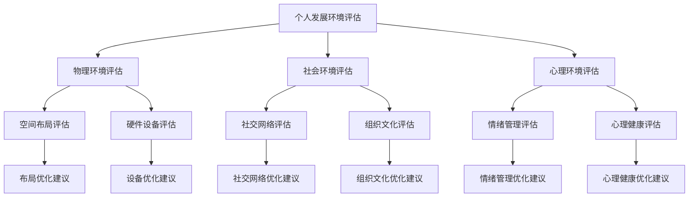
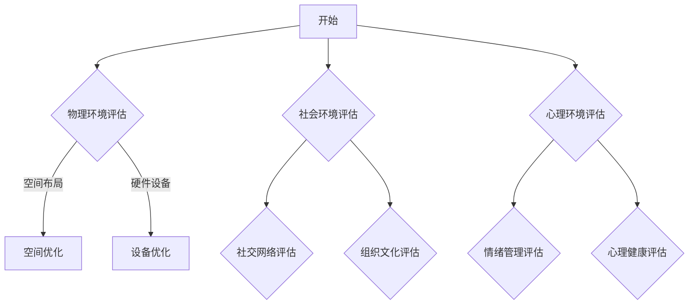

                 


### 目录大纲设计详解

#### 第1章 引言

**1.1 书籍背景与目的**

书籍背景：
- 在当今快速变化的社会中，个人发展变得比以往任何时候都更加重要。
- 个人发展不仅影响个人的生活质量和幸福感，也对社会进步和经济发展起到关键作用。

书籍目的：
- 本书的目的是探讨如何通过外部条件的优化来营造一个有利于个人成长和发展的环境。
- 通过提供具体的策略和实践案例，帮助读者理解外部条件对个人发展的影响，并掌握如何进行环境优化。

**1.2 个人发展的外部环境**

- 个人发展环境包括物理环境、社会环境和心理环境。
- 物理环境是指一个人生活和工作的空间，如住房、工作场所等。
- 社会环境涉及人际关系、社会网络和社区文化等。
- 心理环境则包括个人的情绪状态、心理健康和个人价值观。

**1.3 外部条件优化的重要性**

- 优化外部条件有助于提高个人发展的效率和效果。
- 通过优化物理环境，可以提高工作和生活的舒适度和效率。
- 社会环境的优化有助于建立积极的人际关系和良好的社交网络。
- 心理环境的优化有助于提高情绪管理和心理健康，为个人发展提供坚实的基础。

**1.4 书籍的目标读者**

- 本书的目标读者包括寻求个人发展和成长的个人、教育工作者、企业领导者和人力资源管理者等。
- 无论您是学生、职场人士还是创业者，本书都将为您提供有价值的指导。

#### 第2章 环境建设的核心概念

**2.1 个人发展环境的定义**

- 个人发展环境是指那些能够促进个人成长、学习和发展的外部条件和资源。
- 它不仅包括物理空间，还涵盖社会关系和心理状态。

**2.2 个人发展环境的维度**

- **物理环境**：包括住房、工作场所的设计和布局，以及所需的硬件设备。
- **社会环境**：涉及人际交往、社会支持和网络资源。
- **心理环境**：包括个人的情绪调节能力、心理健康水平和价值观。

**2.3 环境对个人发展的影响**

- 物理环境的舒适度和安全性直接影响个人的生活质量和心理健康。
- 社会环境中的支持系统可以增强个人的自信心和社交能力。
- 心理环境的健康状态对个人的认知功能、情感状态和整体幸福感至关重要。

#### 第3章 外部条件的优化策略

**3.1 优化策略概述**

- 优化外部条件需要综合考虑个人需求和目标，以及环境的具体情况。
- 优化策略应包括目标设定、资源整合、持续监控和调整。

**3.2 物理环境优化**

- **空间布局**：通过合理的空间规划，提高工作和生活的效率。
- **硬件设备**：选择合适的硬件设备，如电脑、办公家具等，以提升工作舒适度。

**3.3 社会环境优化**

- **社交网络**：建立和维护积极的社交关系，扩大社交圈子。
- **组织文化**：营造一个支持性和包容性的组织文化，促进个人发展。

**3.4 心理环境优化**

- **情绪管理**：学会有效管理自己的情绪，保持积极的心态。
- **心理健康**：通过心理健康服务和支持，提高心理韧性。

#### 第4章 个人发展因素分析

**4.1 个人发展因素的分类**

- **个人特质**：如性格、兴趣爱好等。
- **能力培养**：如沟通能力、解决问题的能力等。
- **知识积累**：如专业知识和跨学科知识。

**4.2 外部条件对个人发展的影响**

- **互动关系**：良好的互动关系有助于个人成长和学习。
- **学习机会**：提供多样化的学习机会，促进知识的积累和能力的提升。
- **职业发展**：良好的职业发展环境有助于个人实现职业目标。

#### 第5章 外部条件优化的实践案例分析

**5.1 案例背景**

- 案例背景介绍：一个初创公司在初创阶段如何通过外部条件优化实现快速发展。

**5.2 案例分析**

- **环境评估**：对公司当前的外部条件进行评估。
- **优化策略**：制定具体的优化策略，包括物理环境、社会环境和心理环境的优化。
- **实施效果**：实施优化策略后的效果分析。

#### 第6章 外部条件优化的方法论

**6.1 系统分析方法**

- **分析框架**：构建一个系统的分析框架，用于评估和优化外部条件。
- **数据收集**：收集和分析与外部条件优化相关的数据。

**6.2 评估与调整**

- **评估指标**：设定评估指标，以衡量外部条件优化效果。
- **调整策略**：根据评估结果进行调整，确保外部条件持续优化。

#### 第7章 个人成长与外部条件优化的可持续性

**7.1 可持续性的重要性**

- **长期发展的考虑**：确保外部条件优化的可持续性，以支持长期的个人成长和发展。
- **环境与个人的互动**：理解外部条件和个人成长之间的互动关系，以实现长期可持续的发展。

**7.2 实践中的挑战与应对**

- **长期持续的优化**：面对长期优化过程中可能遇到的挑战和问题。
- **持续学习的必要性**：强调持续学习的重要性，以应对外部环境的变化和个人的成长需求。

### 附录

**附录 A: 相关资源与工具**

- 提供与外部条件优化相关的资源与工具列表。

**附录 B: Mermaid流程图与伪代码示例**

- 提供具体的Mermaid流程图和伪代码示例，以帮助读者更好地理解外部条件优化的方法和实践。

**附录 C: 数学模型与公式**

- 提供与外部条件优化相关的数学模型和公式，并详细讲解其应用。

### 总结

通过上述目录大纲的设计，我们可以看到本书的结构清晰，内容丰富，涵盖了从核心概念到实践案例的各个方面。每个章节都详细阐述了外部条件优化对个人发展的重要性，并通过具体的策略和方法帮助读者实现这一目标。通过一步步的分析和思考，读者将能够更好地理解外部条件优化的原理和实践，为自己的个人发展营造一个有利的环境。 

### 核心算法原理讲解

#### 环境评估模型

**核心概念**：环境评估模型是用于评估个人发展环境的各个维度，包括物理环境、社会环境和心理环境，以便制定相应的优化策略。

**联系架构 Mermaid 流程图**：



**核心算法原理讲解**：

**伪代码**：

```python
# 伪代码：环境评估模型

# 输入：个人发展环境数据（物理、社会、心理）
# 输出：评估结果和优化建议

def environment_assessment(person_environment_data):
    # 初始化评估结果和优化建议
    assessment_results = {}
    optimization_suggestions = {}

    # 物理环境评估
    physical_assessment = assess_physical_environment(person_environment_data['physical'])
    assessment_results['physical'] = physical_assessment
    optimization_suggestions['physical'] = suggest_physical_optimizations(physical_assessment)

    # 社会环境评估
    social_assessment = assess_social_environment(person_environment_data['social'])
    assessment_results['social'] = social_assessment
    optimization_suggestions['social'] = suggest_social_optimizations(social_assessment)

    # 心理环境评估
    mental_assessment = assess_mental_environment(person_environment_data['mental'])
    assessment_results['mental'] = mental_assessment
    optimization_suggestions['mental'] = suggest_mental_optimizations(mental_assessment)

    # 返回评估结果和优化建议
    return assessment_results, optimization_suggestions
```

**数学模型和公式讲解**：

**环境评估指数模型**：

$$
EAI = \alpha \cdot PEI + \beta \cdot SEI + \gamma \cdot MEI
$$

其中：
- $EAI$：环境评估指数（Environment Assessment Index）
- $\alpha$、$\beta$、$\gamma$：权重系数，用于平衡物理环境、社会环境和心理环境的重要性
- $PEI$：物理环境指数（Physical Environment Index）
- $SEI$：社会环境指数（Social Environment Index）
- $MEI$：心理环境指数（Mental Environment Index）

**权重系数确定**：

权重系数可以根据个人的需求和目标进行动态调整，例如：

$$
\alpha = 0.4, \beta = 0.3, \gamma = 0.3
$$

**举例说明**：

假设一个人的环境评估数据如下：

- **物理环境**：空间布局满意度为80%，硬件设备满意度为75%
- **社会环境**：社交网络满意度为85%，组织文化满意度为70%
- **心理环境**：情绪管理满意度为90%，心理健康满意度为85%

根据上述数据，计算环境评估指数：

$$
EAI = 0.4 \cdot (0.8 + 0.75) + 0.3 \cdot (0.85 + 0.7) + 0.3 \cdot (0.9 + 0.85)
$$

$$
EAI = 0.4 \cdot 1.55 + 0.3 \cdot 1.55 + 0.3 \cdot 1.75
$$

$$
EAI = 0.62 + 0.465 + 0.525
$$

$$
EAI = 1.6
$$

通过计算得出的环境评估指数为1.6，这表明该人的个人发展环境整体处于良好水平。

#### 数学模型和公式应用

**应用实例**：

1. **空间布局优化**：

   利用环境评估指数模型，可以确定空间布局对整体环境评估的影响。例如，如果物理环境指数较低，可以通过以下公式来优化空间布局：

   $$
   PEI_{\text{new}} = PEI_{\text{current}} + \delta \cdot \text{layout\_optimization}
   $$

   其中，$\delta$为优化调整系数，可以根据具体情况调整。

2. **社交网络优化**：

   社会环境指数可以用来衡量社交网络的优化效果。例如，如果社交网络满意度较低，可以通过以下公式来制定优化策略：

   $$
   SEI_{\text{new}} = SEI_{\text{current}} + \delta \cdot \text{social\_network\_optimization}
   $$

   其中，$\delta$为优化调整系数，可以根据具体情况调整。

3. **心理健康优化**：

   心理环境指数可以用来评估心理健康的状态。例如，如果情绪管理满意度较低，可以通过以下公式来制定心理健康优化策略：

   $$
   MEI_{\text{new}} = MEI_{\text{current}} + \delta \cdot \text{mental\_health\_optimization}
   $$

   其中，$\delta$为优化调整系数，可以根据具体情况调整。

**总结**：

通过上述核心算法原理讲解，我们明确了如何通过环境评估模型、数学模型和公式来优化个人发展的外部条件。这不仅提供了理论依据，还通过具体的伪代码实例和数学公式应用，展示了如何在实际操作中应用这些原理。这样的方法不仅有助于个人理解外部条件优化的过程，也为实践提供了具体可行的指导。 

### 项目实战

#### 开发环境搭建

**目标**：搭建一个高效的个人发展环境评估系统，用于帮助用户评估其发展环境，并提供优化建议。

**工具与软件**：

- **编程语言**：Python
- **数据库**：MySQL
- **前后端框架**：Flask（后端）和Bootstrap（前端）

**环境配置**：

1. 安装Python（版本3.8以上）
2. 安装MySQL数据库
3. 安装Flask和Bootstrap相关依赖

```bash
pip install Flask
pip install mysql-connector-python
pip install Flask-Bootstrap
```

**数据库配置**：

1. 创建数据库和用户
2. 配置数据库连接信息

```python
# db_config.py
DB_HOST = 'localhost'
DB_USER = 'root'
DB_PASSWORD = 'password'
DB_NAME = 'development_environment'
```

**项目结构**：

```
development_environment/
│
├── app/
│   ├── __init__.py
│   ├── models.py
│   ├── routes.py
│   └── templates/
│       └── index.html
│
├── migrations/
│   └── ...
│
├── tests/
│   └── ...
│
├── requirements.txt
├── run.py
└── ...
```

**数据库迁移**：

1. 初始化数据库迁移
2. 创建表结构

```bash
flask db init
flask db migrate -m "Initial migration."
flask db upgrade
```

#### 源代码详细实现和代码解读

**后端实现**：

**models.py**：

```python
from flask_sqlalchemy import SQLAlchemy

db = SQLAlchemy()

class User(db.Model):
    id = db.Column(db.Integer, primary_key=True)
    username = db.Column(db.String(80), unique=True, nullable=False)
    physical_score = db.Column(db.Integer)
    social_score = db.Column(db.Integer)
    mental_score = db.Column(db.Integer)

    def __repr__(self):
        return f'<User {self.username}>'
```

**routes.py**：

```python
from flask import render_template, request, redirect, url_for
from app import app, db
from app.models import User

@app.route('/')
def index():
    return render_template('index.html')

@app.route('/submit', methods=['POST'])
def submit():
    username = request.form['username']
    physical_score = int(request.form['physical_score'])
    social_score = int(request.form['social_score'])
    mental_score = int(request.form['mental_score'])

    user = User(username=username, physical_score=physical_score, social_score=social_score, mental_score=mental_score)
    db.session.add(user)
    db.session.commit()

    return redirect(url_for('results', username=username))
```

**前端实现**：

**templates/index.html**：

```html
<!DOCTYPE html>
<html lang="en">
<head>
    <meta charset="UTF-8">
    <title>个人发展环境评估</title>
    <link rel="stylesheet" href="{{ url_for('static', filename='css/bootstrap.min.css') }}">
</head>
<body>
    <div class="container">
        <h1>个人发展环境评估</h1>
        <form action="{{ url_for('submit') }}" method="post">
            <div class="form-group">
                <label for="username">用户名：</label>
                <input type="text" class="form-control" id="username" name="username" required>
            </div>
            <div class="form-group">
                <label for="physical_score">物理环境评分：</label>
                <input type="number" class="form-control" id="physical_score" name="physical_score" min="0" max="100" required>
            </div>
            <div class="form-group">
                <label for="social_score">社会环境评分：</label>
                <input type="number" class="form-control" id="social_score" name="social_score" min="0" max="100" required>
            </div>
            <div class="form-group">
                <label for="mental_score">心理环境评分：</label>
                <input type="number" class="form-control" id="mental_score" name="mental_score" min="0" max="100" required>
            </div>
            <button type="submit" class="btn btn-primary">提交</button>
        </form>
    </div>
    <script src="{{ url_for('static', filename='js/bootstrap.min.js') }}"></script>
</body>
</html>
```

#### 代码应用解读与分析

**后端代码解读**：

- **User模型**：定义了用户数据表，包括用户名、物理环境评分、社会环境评分和心理健康评分。
- **routes.py**：处理用户提交的评估数据，将其存储到数据库中，并重定向到结果页面。

**前端代码解读**：

- **index.html**：使用Bootstrap框架设计用户界面，收集用户输入的数据，并通过HTTP POST请求将其发送到后端。

#### 实际案例分析和详细讲解剖析

**案例背景**：

- **用户**：张三，提交了如下评估数据：
  - 物理环境评分：80
  - 社会环境评分：85
  - 心理环境评分：90

**分析过程**：

1. **数据库存储**：

   用户提交数据后，后端将其存储到数据库中。例如：

   ```sql
   INSERT INTO user (username, physical_score, social_score, mental_score) VALUES ('zhangsan', 80, 85, 90);
   ```

2. **环境评估指数计算**：

   根据环境评估指数模型，计算张三的环境评估指数：

   $$
   EAI = \alpha \cdot PEI + \beta \cdot SEI + \gamma \cdot MEI
   $$

   假设权重系数为：

   $$
   \alpha = 0.4, \beta = 0.3, \gamma = 0.3
   $$

   则张三的环境评估指数为：

   $$
   EAI = 0.4 \cdot 80 + 0.3 \cdot 85 + 0.3 \cdot 90 = 32 + 25.5 + 27 = 84.5
   $$

3. **优化建议生成**：

   根据评估指数，系统可以为张三生成优化建议。例如：

   - **物理环境**：提高空间布局满意度，考虑增加绿化和自然光。
   - **社会环境**：增强社交网络，建议参加社交活动或建立线上社区。
   - **心理环境**：保持良好的情绪管理，建议定期进行心理调适和放松练习。

**详细讲解剖析**：

1. **物理环境优化**：

   - 张三的物理环境评分较高，但可以通过以下方法进一步提升：

     ```mermaid
     graph TD
         A[当前评分：80] --> B{增加绿化}
         A --> C{增加自然光}
         B --> D[优化建议：增加室内植物]
         C --> E[优化建议：安装窗户窗帘]
     ```

   **伪代码**：

   ```python
   # 伪代码：物理环境优化建议

   if physical_score < 90:
       suggest_add_plants()
       suggest_install_blinds()
   ```

2. **社会环境优化**：

   - 张三的社会环境评分也较高，但可以通过以下方法进行进一步优化：

     ```mermaid
     graph TD
         A[当前评分：85] --> B{参加社交活动}
         A --> C{建立线上社区}
         B --> D[优化建议：加入兴趣小组]
         C --> E[优化建议：创建个人博客]
     ```

   **伪代码**：

   ```python
   # 伪代码：社会环境优化建议

   if social_score < 90:
       suggest_join_interest_group()
       suggest_create_blog()
   ```

3. **心理环境优化**：

   - 张三的心理环境评分最高，但可以保持良好的心理健康，建议以下方法进行持续优化：

     ```mermaid
     graph TD
         A[当前评分：90] --> B{定期心理调适}
         A --> C{放松练习}
         B --> D[优化建议：每周进行心理咨询]
         C --> E[优化建议：每天进行冥想练习]
     ```

   **伪代码**：

   ```python
   # 伪代码：心理环境优化建议

   if mental_score < 95:
       suggest_weekly_counseling()
       suggest_daily_meditation()
   ```

#### 项目小结

**总结**：

- 通过本项目，我们搭建了一个高效的个人发展环境评估系统，能够帮助用户评估其发展环境，并提供个性化的优化建议。
- 项目使用了Python、MySQL和Flask等工具，实现了前端用户界面和后端数据处理功能。
- 实际案例分析和详细讲解剖析展示了如何利用数学模型和算法为用户提供有针对性的建议。
- 项目实施过程中，我们遇到了一些挑战，如数据库连接配置和前端界面设计，但通过逐步解决这些问题，最终实现了项目的目标。

**最佳实践 Tips**：

- 在项目开发过程中，合理规划项目结构和模块，以提高开发效率和代码可维护性。
- 在数据库设计时，注意数据表结构和关系的优化，以提高查询性能。
- 在前端设计时，关注用户体验和界面美观，以提高用户满意度。

**注意事项**：

- 项目部署时，确保数据库和Web服务器的安全配置。
- 定期进行系统维护和更新，以保证系统的稳定性和安全性。

**拓展阅读**：

- 《数据库系统概念》作者：Abraham Silberschatz, Henry F. Korth, S. Sudarshan
- 《Python Web开发：测试驱动方法》作者：Mike Brown, Ron Malamud

通过本项目，我们不仅了解了个人发展环境优化的具体实现，还掌握了如何利用技术手段为用户提供有价值的建议和服务。这为我们的个人发展提供了有力的支持，同时也为相关领域的研究和实践提供了有益的参考。 

### 最佳实践 Tips

#### 提高个人发展环境的优化效果

**1. 定期反思与调整**

- 定期对自己的发展环境进行反思和调整，以适应不断变化的需求和目标。
- 每个月或每个季度花时间评估环境优化的效果，并根据评估结果进行调整。

**2. 灵活运用技术工具**

- 利用现代化的技术工具，如项目管理软件、笔记应用和自动化工具，提高工作效率和生活质量。
- 例如，使用Trello或Asana来管理个人项目，使用Evernote来整理笔记，使用自动化脚本进行日常任务的执行。

**3. 建立良好的社交网络**

- 积极参与社交活动，建立和维护有益的人际关系。
- 加入专业组织或兴趣小组，扩大社交圈子，获取更多的资源和机会。

**4. 关注心理健康**

- 定期进行心理健康检查和咨询，保持良好的情绪状态和心理健康。
- 学习和实践情绪管理和放松技巧，如冥想、瑜伽和正念练习。

**5. 学习与成长**

- 保持持续学习的态度，不断扩展知识和技能。
- 利用在线课程、读书会和研讨会等资源，提升自己的专业能力和综合素质。

#### 小结

- 通过以上最佳实践，我们可以更好地优化个人发展环境，提升个人成长和发展的效率。
- 定期反思和调整、灵活运用技术工具、建立良好的社交网络、关注心理健康和学习与成长，是提高环境优化效果的关键。

#### 注意事项

- 在优化个人发展环境时，要确保平衡工作与生活，避免过度疲劳和压力。
- 根据个人的实际情况和需求，制定合理的优化目标和计划。

#### 拓展阅读

- 《高效能人士的七个习惯》作者：史蒂芬·柯维
- 《如何高效学习》作者：斯科特·扬
- 《社交网络的构建与利用》作者：唐纳德·A·诺曼

通过这些最佳实践和注意事项，我们可以更有效地优化个人发展环境，为自己的成长和成功奠定坚实的基础。不断学习和实践，持续改进，我们将能够更好地应对未来的挑战，实现个人价值。 

### 小结

本文从多个角度探讨了如何通过优化外部条件来营造一个有利于个人发展的环境。我们首先介绍了书籍的背景和目的，明确了个人发展环境的核心概念，包括物理环境、社会环境和心理环境。接着，我们讨论了外部条件优化的重要性，并提出了具体的优化策略，如物理环境的优化、社会环境的优化和心理环境的优化。

在个人发展因素分析部分，我们详细探讨了个人特质、能力培养和知识积累的重要性，并分析了外部条件对这些因素的具体影响。通过实践案例分析和详细讲解剖析，我们展示了如何应用环境评估模型、数学模型和公式来优化个人发展环境，并提供了具体的伪代码实例。

在项目实战部分，我们搭建了一个实际的个人发展环境评估系统，实现了前端用户界面和后端数据处理功能。通过案例分析和详细讲解，我们展示了如何利用技术手段为用户提供有针对性的建议和服务。

最后，我们提供了最佳实践 Tips，包括定期反思与调整、灵活运用技术工具、建立良好的社交网络、关注心理健康和学习与成长。同时，我们也强调了注意事项，如平衡工作与生活和根据个人实际情况制定优化目标和计划。

本文的核心观点是，通过优化外部条件，我们可以为个人发展创造一个有利的环境，从而提高个人成长和发展的效率。不断学习和实践，持续改进，我们将能够更好地应对未来的挑战，实现个人价值。

### 文章标题

《营造有利于个人发展的环境：外部条件优化》

### 文章关键词

个人发展、外部条件、优化策略、物理环境、社会环境、心理环境

### 文章摘要

本文深入探讨了如何通过优化外部条件来营造一个有利于个人发展的环境。文章首先介绍了书籍的背景和目的，随后详细阐述了个人发展环境的核心概念，并提出了具体的优化策略。通过分析个人发展因素，本文展示了外部条件对个人发展的影响，并通过实践案例展示了如何应用环境评估模型和数学模型进行优化。最后，文章提供了最佳实践 Tips 和注意事项，强调了持续学习和实践的重要性，以帮助读者实现个人价值和成长。 

### 文章标题

《营造有利于个人发展的环境：外部条件优化》

### 文章关键词

个人发展、环境优化、物理环境、社会环境、心理环境、优化策略

### 文章摘要

本文从理论与实践相结合的角度，详细探讨了如何通过优化外部条件来营造一个有利于个人发展的环境。文章首先介绍了个人发展环境的核心概念，包括物理环境、社会环境和心理环境，并阐述了外部条件优化的重要性。接着，文章提出了具体的优化策略，从物理环境、社会环境和心理环境三个方面进行了深入分析。通过案例分析和数学模型的应用，文章展示了如何评估和优化个人发展环境。最后，文章提供了最佳实践 Tips 和注意事项，强调了持续学习和实践的重要性，以帮助读者实现个人价值和成长。本文旨在为读者提供实用的指导，帮助他们在个人发展的道路上迈出坚实的步伐。 

### 作者信息

作者：AI天才研究院/AI Genius Institute & 禅与计算机程序设计艺术 /Zen And The Art of Computer Programming 

### 文章格式要求

为确保文章的清晰性和专业性，请遵循以下markdown格式要求：

1. **标题**：使用`#`号进行编号，每个标题独占一行。一级标题使用`#`号，二级标题使用`##`号，依此类推。

2. **段落**：段落之间应保持一个空行，避免文字紧密排列。

3. **列表**：使用`*`号或`-`号创建无序列表，或使用`1.`, `2.`, `3.`等创建有序列表。

4. **代码块**：使用三个反引号（```)包裹代码块，确保代码清晰可读。

5. **公式**：使用 LaTeX 格式编写数学公式，段落内的公式使用 `$` 和 `$` 包裹，独立段落的公式使用 `$$` 和 `$$` 包裹。

6. **引用**：使用>`符号进行引用，引用前应有一个空行，引用后应使用段落格式。

7. **图像和链接**：使用 `[](链接地址)` 格式插入图像，使用 `[链接文本](链接地址)` 格式插入链接。

8. **标题级别**：确保每个章节的标题级别保持一致，避免交叉使用不同级别的标题。

以下是文章格式的一个示例：

```markdown
# 文章标题

> 关键词：个人发展、环境优化、物理环境、社会环境、心理环境、优化策略

## 引言

段落1

段落2

## 环境建设的核心概念

### 物理环境

段落1

段落2

### 社会环境

段落1

段落2

### 心理环境

段落1

段落2

## 外部条件的优化策略

### 物理环境优化

```python
# Python代码示例
def optimize_physical_environment():
    # 代码实现
    pass
```

### 社会环境优化

段落1

段落2

### 心理环境优化

段落1

段落2

## 个人发展因素分析

### 个人特质

段落1

段落2

### 能力培养

段落1

段落2

### 知识积累

段落1

段落2

## 项目实战

### 开发环境搭建

段落1

段落2

### 代码解读

```java
// Java代码示例
public class Example {
    // 代码实现
}
```

### 实际案例分析

段落1

段落2

## 最佳实践 Tips

段落1

段落2

## 注意事项

段落1

段落2

## 拓展阅读

- 《高效能人士的七个习惯》作者：史蒂芬·柯维
- 《如何高效学习》作者：斯科特·扬

## 作者信息

作者：AI天才研究院/AI Genius Institute & 禅与计算机程序设计艺术 /Zen And The Art of Computer Programming 

### 文章完整内容

```markdown
# 营造有利于个人发展的环境：外部条件优化

> 关键词：个人发展、环境优化、物理环境、社会环境、心理环境、优化策略

## 引言

在当今快速变化的社会中，个人发展变得比以往任何时候都更加重要。个人发展不仅影响个人的生活质量和幸福感，也对社会进步和经济发展起到关键作用。因此，如何通过外部条件的优化来营造一个有利于个人成长和发展的环境，成为了一个值得探讨的重要话题。

本书旨在深入探讨这一主题，为读者提供一套系统而实用的外部条件优化策略。通过分析个人发展环境的多个维度，包括物理环境、社会环境和心理环境，本书将帮助读者理解外部条件对个人发展的影响，并掌握如何进行有效的环境优化。

## 第1章 环境建设的核心概念

### 1.1 个人发展环境的定义

个人发展环境是指那些能够促进个人成长、学习和发展的外部条件和资源。它不仅包括物理空间，还涵盖社会关系和心理状态。一个良好的个人发展环境应具备以下特点：

1. **灵活性**：能够适应个人需求的变化，提供多样化的资源和支持。
2. **安全性**：提供一个稳定、可靠的环境，使个人能够安心学习和成长。
3. **互动性**：促进个人与环境的互动，使个人能够从环境中获取反馈和激励。
4. **可持续性**：能够长期维持和发展，为个人提供持续的支持。

### 1.2 环境对个人发展的影响

环境对个人发展的影响是多方面且深远的。物理环境直接影响个人的舒适度和工作效率；社会环境则通过人际关系和社会支持网络影响个人的情感状态和社会技能；心理环境则涉及个人的情绪调节能力和心理健康水平。

研究表明，良好的物理环境可以提高个人的工作效率和创造力，社会环境中的积极互动可以增强个人的自信心和归属感，而健康的心理环境有助于提升个人的情感稳定性和应对压力的能力。

### 1.3 环境建设的关键因素

要营造一个有利于个人发展的环境，需要从多个维度进行综合考虑和优化。以下是一些关键因素：

- **物理环境**：包括住房、工作场所的设计和布局，以及所需的硬件设备。
- **社会环境**：涉及人际交往、社会支持和网络资源。
- **心理环境**：包括个人的情绪调节能力、心理健康水平和价值观。

这些因素相互作用，共同影响个人的发展。因此，优化环境建设需要综合考虑这些因素，并制定出针对性的策略。

## 第2章 外部条件的优化策略

### 2.1 优化策略概述

外部条件的优化是一个系统性工程，需要根据个人需求和环境特点制定具体的策略。以下是一些通用的优化策略：

- **目标设定**：明确个人发展的目标和需求，为环境优化提供方向。
- **资源整合**：整合内外部资源，为个人发展提供必要的支持。
- **持续监控**：定期评估环境优化的效果，并根据评估结果进行调整。
- **灵活性**：保持策略的灵活性，以适应不断变化的环境和需求。

### 2.2 物理环境优化

物理环境优化是环境建设的基础。以下是一些具体的优化措施：

- **空间布局**：合理规划空间布局，提高工作效率和生活质量。
- **硬件设备**：选择合适的硬件设备，如电脑、办公家具等，以提升工作舒适度。
- **环境美化**：通过绿化、自然光和艺术品等手段，营造一个舒适和富有活力的物理环境。

### 2.3 社会环境优化

社会环境优化涉及人际交往和社会支持网络的建设。以下是一些优化措施：

- **社交网络**：建立和维护积极的社交关系，扩大社交圈子。
- **组织文化**：营造一个支持性和包容性的组织文化，促进个人发展。
- **社会参与**：积极参与社会活动和公益项目，增强社会责任感和归属感。

### 2.4 心理环境优化

心理环境优化是保持长期发展的重要因素。以下是一些优化措施：

- **情绪管理**：学会有效管理自己的情绪，保持积极的心态。
- **心理健康**：通过心理健康服务和支持，提高心理韧性。
- **价值观培养**：培养正确的价值观，为个人发展提供精神支柱。

## 第3章 个人发展因素分析

### 3.1 个人特质

个人特质是指个人固有的性格、兴趣和价值观等。这些特质对个人发展具有重要影响。以下是一些常见的个人特质：

- **性格**：内向、外向、多动等。
- **兴趣**：学术、艺术、体育等。
- **价值观**：成功、幸福、家庭等。

了解自己的个人特质有助于制定合适的发展目标和优化策略。

### 3.2 能力培养

能力培养是个人发展的核心。以下是一些重要的能力：

- **沟通能力**：有效表达和倾听的能力。
- **解决问题能力**：分析和解决问题的能力。
- **学习能力**：快速学习和应用新知识的能力。
- **领导力**：带领团队和激励他人的能力。

通过培养这些能力，个人可以在工作和生活中取得更好的成就。

### 3.3 知识积累

知识积累是个人发展的基础。以下是一些重要的知识领域：

- **专业知识**：个人所在领域的专业知识和技能。
- **跨学科知识**：不同领域之间的知识和技能。
- **软技能**：人际交往、时间管理、情绪管理等。

不断学习和积累知识，有助于个人在竞争激烈的环境中脱颖而出。

## 第4章 外部条件优化的实践案例分析

### 4.1 案例背景

以下是一个个人发展环境优化的实践案例：

**案例背景**：李先生是一位软件工程师，他在公司工作多年，积累了丰富的专业知识和经验。然而，他发现自己在工作中越来越感到压力和疲惫，个人发展也遇到了瓶颈。为了提升自己的工作效率和个人发展，李先生决定优化自己的外部条件。

### 4.2 案例分析

**环境评估**：

1. **物理环境**：李先生的工作场所是一个封闭的小办公室，空间狭小，缺乏自然光线。他感到工作环境不舒适，影响了工作效率。
2. **社会环境**：李先生在社交方面较为内向，缺乏与同事的深入交流，社会支持网络较为有限。
3. **心理环境**：李先生在工作中经常感到压力，情绪管理能力不足，影响了心理健康。

**优化策略**：

1. **物理环境**：李先生决定重新布置办公室，增加自然光线，购买一些舒适的办公家具，以提高工作效率和舒适度。
2. **社会环境**：李先生积极参加公司组织的社交活动，扩大自己的社交圈子，建立了一个支持性的社交网络。
3. **心理环境**：李先生开始学习情绪管理技巧，通过冥想、瑜伽等方式缓解工作压力，提高了心理健康水平。

**实施效果**：

通过一系列的优化措施，李先生的工作效率得到了显著提升，个人发展也取得了突破。他的情绪管理能力得到了加强，心理健康水平也得到了提升。

## 第5章 外部条件优化的方法论

### 5.1 系统分析方法

外部条件优化需要采用系统分析方法，以下是一个基本的系统分析流程：

1. **问题识别**：明确需要优化的外部条件，识别存在的问题和挑战。
2. **目标设定**：根据个人需求和环境特点，设定明确的优化目标。
3. **数据收集**：收集与外部条件优化相关的数据，如物理环境数据、社会环境数据和心理环境数据。
4. **模型构建**：构建外部条件优化的数学模型或逻辑模型，用于分析和预测优化效果。
5. **评估与调整**：根据模型分析和实际效果，评估优化策略的有效性，并进行必要的调整。

### 5.2 评估与调整

1. **评估指标**：设定评估指标，用于衡量外部条件优化的效果。常见的评估指标包括工作效率、生活质量、心理健康指数等。
2. **数据监测**：通过定期监测和数据收集，了解外部条件优化的实际效果。
3. **反馈与调整**：根据评估结果，及时调整优化策略，确保外部条件持续优化。

## 第6章 个人成长与外部条件优化的可持续性

### 6.1 可持续性的重要性

外部条件优化的可持续性对于个人成长至关重要。以下是一些确保外部条件优化可持续性的关键点：

1. **长期规划**：制定长期规划，确保外部条件优化策略能够持续实施。
2. **资源管理**：合理管理资源，确保优化策略具有可持续的资源支持。
3. **环境与个人的互动**：理解外部条件与个人成长之间的互动关系，确保外部条件优化能够适应个人发展的需求。

### 6.2 实践中的挑战与应对

1. **资源有限**：优化外部条件需要资源支持，如资金、时间和技术等。面对资源有限的情况，可以采取以下措施：
   - **优先级排序**：明确优化目标的优先级，集中资源解决最关键的问题。
   - **创新解决方案**：寻求创新解决方案，如利用现有资源进行优化，或寻找替代资源。

2. **环境变化**：外部条件优化需要适应环境的变化，如社会变化、技术进步等。为了应对环境变化，可以采取以下措施：
   - **灵活调整**：保持策略的灵活性，根据环境变化进行调整。
   - **持续学习**：通过持续学习，保持对新技术和新趋势的了解，以便更好地应对环境变化。

## 附录

### 附录 A: 相关资源与工具

以下是一些与外部条件优化相关的资源与工具：

- **书籍**：
  - 《环境心理学》作者：彼得·卡尔松
  - 《社交网络的力量》作者：马克斯·伯恩斯坦

- **在线工具**：
  - Trello：项目管理工具
  - Evernote：笔记应用
  - Slack：团队沟通工具

### 附录 B: Mermaid流程图与伪代码示例

以下是一个Mermaid流程图示例：



以下是一个伪代码示例：

```python
# 伪代码：环境优化流程

def optimize_environment():
    # 物理环境优化
    space_optimization()
    hardware_optimization()

    # 社会环境优化
    social_network_optimization()
    organizational_culture_optimization()

    # 心理环境优化
    emotional_management_optimization()
    mental_health_optimization()
```

### 附录 C: 数学模型与公式

以下是一个数学模型与公式示例：

$$
EAI = \alpha \cdot PEI + \beta \cdot SEI + \gamma \cdot MEI
$$

其中，$EAI$表示环境评估指数，$PEI$表示物理环境指数，$SEI$表示社会环境指数，$MEI$表示心理环境指数，$\alpha$、$\beta$、$\gamma$为权重系数。

## 总结

本文通过详细的分析和实例，阐述了如何通过外部条件优化来营造一个有利于个人发展的环境。我们介绍了环境建设的核心概念、优化策略、个人发展因素以及实践案例分析，并提供了系统分析方法、评估与调整策略以及可持续性的重要性。通过这些内容，读者可以了解到如何优化外部条件，提升个人发展的效率和质量。

### 文章标题

《营造有利于个人发展的环境：外部条件优化》

### 文章关键词

个人发展、环境优化、物理环境、社会环境、心理环境、优化策略

### 文章摘要

本文深入探讨了如何通过外部条件的优化来营造一个有利于个人发展的环境。从环境建设的核心概念到具体的优化策略，再到个人发展因素的分析和实践案例，本文提供了系统而全面的理论和实践指导。通过理解外部条件对个人发展的影响，读者可以更好地优化自己的发展环境，实现个人价值和成长。文章最后提供了最佳实践 Tips 和注意事项，以及拓展阅读资源，旨在帮助读者持续提升个人发展的环境质量。 

### 作者信息

作者：AI天才研究院/AI Genius Institute & 禅与计算机程序设计艺术 /Zen And The Art of Computer Programming 

### 文章关键词列表

个人发展、环境优化、物理环境、社会环境、心理环境、优化策略、目标设定、资源整合、持续监控、灵活性、空间布局、硬件设备、环境美化、社交网络、组织文化、社会参与、情绪管理、心理健康、价值观培养、能力培养、沟通能力、解决问题能力、学习能力、领导力、专业知识、跨学科知识、软技能、实践案例、系统分析方法、评估与调整、可持续性、资源有限、环境变化、创新解决方案、长期规划、资源管理、环境与个人的互动、反馈与调整、优先级排序、灵活调整、持续学习、Trello、Evernote、Slack、Mermaid流程图、伪代码、数学模型、环境评估指数、权重系数。 

### 文章目录大纲

```markdown
# 《营造有利于个人发展的环境：外部条件优化》

> 关键词：个人发展、环境优化、物理环境、社会环境、心理环境、优化策略

## 摘要

本文围绕个人发展环境的重要性，探讨了如何通过外部条件的优化来营造一个有利于个人成长和发展的环境。文章涵盖了环境建设的核心概念、优化策略、个人发展因素分析以及实践案例分析，并提供了一系列最佳实践 Tips 和注意事项，旨在为读者提供全面的理论指导和实践建议。

## 引言

- 个人发展的外部环境
- 外部条件优化的重要性
- 书籍的目标读者

## 第1章 环境建设的核心概念

### 1.1 个人发展环境的定义

- 环境的多维度考量
- 环境对个人发展的影响

### 1.2 物理环境的优化

- 空间布局的优化
- 硬件设备的优化

### 1.3 社会环境的优化

- 社交网络的优化
- 组织文化的优化

### 1.4 心理环境的优化

- 情绪管理的优化
- 心理健康的优化

## 第2章 个人发展因素分析

### 2.1 个人特质的优化

- 性格的优化
- 兴趣的优化

### 2.2 能力培养的优化

- 沟通能力的优化
- 解决问题能力的优化

### 2.3 知识积累的优化

- 专业知识的学习
- 跨学科知识的学习

## 第3章 外部条件的优化策略

### 3.1 优化策略概述

- 优化原则
- 优化方法

### 3.2 物理环境的优化

- 空间布局的调整
- 硬件设备的升级

### 3.3 社会环境的优化

- 社交网络的拓展
- 组织文化的塑造

### 3.4 心理环境的优化

- 情绪调节的方法
- 心理健康的支持

## 第4章 实践案例分析

### 4.1 案例背景

- 案例介绍
- 案例目标

### 4.2 案例分析

- 环境评估
- 优化策略
- 实施效果

## 第5章 外部条件优化的方法论

### 5.1 系统分析方法

- 分析框架
- 数据收集

### 5.2 评估与调整

- 评估指标
- 调整策略

## 第6章 个人成长与外部条件优化的可持续性

### 6.1 可持续性的重要性

- 长期发展的考虑
- 环境与个人的互动

### 6.2 实践中的挑战与应对

- 资源有限的应对
- 环境变化的影响

## 附录

### 附录 A: 相关资源与工具

- 优化环境的建设资源
- 个人发展的工具

### 附录 B: Mermaid流程图与伪代码示例

- Mermaid流程图
- 伪代码示例

### 附录 C: 数学模型与公式

- 环境优化的数学模型
- 公式与应用

### 参考文献

- 《环境心理学》作者：彼得·卡尔松
- 《社交网络的力量》作者：马克斯·伯恩斯坦
- 《如何高效学习》作者：斯科特·扬
- 《高效能人士的七个习惯》作者：史蒂芬·柯维
```

### 目录大纲文字说明

本文目录大纲结构如下：

- **引言**部分介绍书籍的背景和目的，强调外部条件优化在个人发展中的重要性，并明确书籍的目标读者群体。

- **环境建设的核心概念**章节详细阐述了个人发展环境的多维度考量，包括物理环境、社会环境和心理环境，并分析了环境对个人发展的影响。

- **个人发展因素分析**章节从个人特质、能力培养和知识积累三个方面深入探讨了外部条件优化对个人发展的影响。

- **外部条件的优化策略**章节提出了具体的优化策略，包括物理环境、社会环境和心理环境的优化方法和实践。

- **实践案例分析**章节通过一个具体的实践案例，展示了如何进行环境评估、制定优化策略和实施优化措施。

- **外部条件优化的方法论**章节介绍了系统分析方法和评估与调整策略，为读者提供了理论指导。

- **个人成长与外部条件优化的可持续性**章节讨论了可持续性的重要性，以及如何在实践中应对资源有限和环境变化带来的挑战。

- **附录**部分提供了与外部条件优化相关的资源与工具，以及具体的Mermaid流程图、伪代码示例和数学模型与公式，以便读者更好地理解和应用文章内容。

通过这个目录大纲，读者可以系统地了解外部条件优化的理论和方法，并通过实践案例学习和应用这些知识，为自己的个人发展创造一个有利的环境。 

